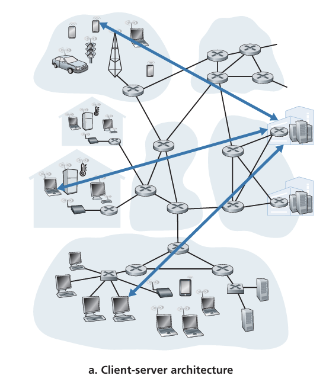

# Application
## 網路應用原理
### 網路應用架構

應用架構(application architecture) 由開發者設計，定義了如何在各個系統上整合應用程式。

當前有兩個主流體系:

1. 客戶-服務器架構(client-server architecture)

會有一個總是啟動的主機，其是*服務器*。它服務來自於許多其它稱為*客戶*的主機請求。這存在以下特徵
- 客戶之間互不直接通訊
- 服務器有一個周知的 IP 地址

當只有一台服務器時，可能是搜尋引擎等。它可能無法處理成千上萬的客戶請求。因此可藉由託管大量主機即*數據中心(data center)* 來解決該問題。

2. P2P 架構(P2P architecture)

- 不再大量依賴位於資料中心的專用伺服器，而是讓網路中的使用者端（Peers）彼此直接通訊
- 這些 Peers 為個人擁有的桌上型電腦或筆電，分散於家中、學校、辦公室等地，而非服務提供者所管理
- 因為不經過專用伺服器而是 Peer 間直連傳輸，因此稱為「Peer-to-Peer」
- 不需大規模伺服器基礎設施與高頻寬的資料中心，相較傳統 Client-Server 模式*更省成本*

特性:

- P2P 自我延展(Self-Scalability)
  - 在檔案分享應用（如 BitTorrent）中，雖然每個 Peer 會產生需求（下載檔案），卻也同時提供上傳能力（為其他 Peer 分發檔案）
  - 因此整體服務能力會隨著 Peer 數量增加而提升，具有良好的可擴充性

面臨挑戰:

- 安全性 (Security)：高度分散的架構使得管理與防護更困難
- 效能 (Performance)：節點連線品質不一、Peer 上線/離線不穩定，導致整體效能波動大
- 可靠度 (Reliability)：缺乏中央伺服器，可能造成檔案來源不足、分散節點故障等問題

### 行程通訊(Processes Communicating)

在作業系統中，進行通訊的是行程(process)而不是程式。然而被運行的程式為作業系統中的行程。

- 同一端系統上的程序通訊
    - 程序彼此間使用「行程間通訊 (IPC)」交換資料。
    - 行程間通訊規則由作業系統管理。

- 跨主機（端系統）通訊的重點
    - 透過跨越計算機網路交換訊息(message)相互通訊

##### 1. 客戶端與伺服器端程序

- 網路應用程式的通訊形態
    - 由一對對的行程(process)相互透過網路傳送訊息所構成（例如：Web、P2P 檔案共享）。

- 客戶端與伺服器的基本概念
    - 在每對通訊程序中，一方標記為客戶端，另一方標記為伺服器。
        - Web: 瀏覽器 (客戶端) <-> 網頁伺服器 (伺服器)
        - P2P: 下載端 (客戶端) <-> 上傳端 (伺服器)
- *角色定義*
    - 客戶端：在通訊連線開始時，主動聯繫另一方的行程
    - 伺服器：在通訊連線開始時，等待對方聯繫的行程

>P2P 行程可同時上傳與下載，在不同會話可同時扮演客戶端與伺服器，但一條特定連線中仍可清楚區分客戶端與伺服器。

##### 2. 行程與網路之間的介面

應用程式通常是行程對組成，因此可互相通訊。它們之間之間通訊需透過網路。

- 行程之間通訊
    - 透過 `socket` 從網路收發訊息
- socket 概念
    - 位於主機的應用層和傳輸層之間
    - socket 是應用程式和網路之間的應用程式介面 (Application Programming Interface,API) 
- 開發者的控制範圍
    - 應用層端：開發者能自由掌控程式邏輯與運行方式
    - 傳輸層端：開發者只能設定少部分參數，例如：
        - 選擇傳輸協定 (TCP、UDP...)
        - 設定傳輸層的少數參數（如最大緩衝區大小、最大分段大小）。

##### 行程尋址

1. 目的地位址的必要性

- 就像郵件需要寄往「郵寄地址」，網路中的封包也需指定目標主機的位址，以及該主機上的特定程式。

2. 主機位置就是 IP 

3. 應用程式（或 socket）識別：埠號 (port number)
- 在同一台主機上，可同時跑多個網路應用程式
- 為區分不同應用的流程，需要用埠號來標記特定的接收程序
    - 例如：Web 伺服器使用埠號 80，SMTP（郵件伺服器）使用埠號 25

### 給應用程式的運輸服務
大體可分類為以下

##### 1. 可靠數據傳輸(reliable data transfer)

1. 封包遺失的可能性
- 封包在路由器緩衝區滿溢、位元損毀等情況下可能被丟棄

2. 可靠傳輸
- 許多應用（郵件、檔案傳輸、遠端登入、Web 文件傳輸、金融交易等）都需要高度可靠的資料傳送

3. 非可靠傳輸的容忍度
- 若協定不提供可靠傳輸，部分資料可能永遠遺失
- 某些「容忍遺失」的多媒體應用（如視訊、音訊串流）可接受少量遺失而不嚴重影響使用者體驗

4. 傳輸層的關鍵服務
- 傳輸層可能為應用提供行程對行程的可靠資料傳輸服務
- 未提供該服務時，就必須由應用層或其他機制去處理可能的資料遺失問題

##### 2. 吞吐量(throughput)

1. 可用吞吐量 (Available Throughput)
- 也就是在兩個程序於網路路徑進行通訊時，傳送端能以多快的速率將資料位元送達接收端
- 由於與其他連線共享頻寬，而且連線會進進出出，可用吞吐量隨時間變動

2. 保證吞吐量 (Guaranteed Throughput) 需求
- 為傳輸層的一種潛在服務：允許應用程式請求並保證一個最低傳輸速率 $r$ bps
- 適用於對頻寬需求嚴格的應用，如網際網路語音 (Internet telephony) 或其他多媒體應用

3. 對頻寬敏感 (Bandwidth-Sensitive) 應用
- 有明確的吞吐量需求，若拿不到足夠頻寬便無法正常運作
    - 32 kbps 網路電話若收不到至少 32 kbps 的頻寬，可能必須轉用更低編碼率或放棄服務
4. 彈性 (Elastic) 應用
- 可以彈性使用「當下可用」的任意吞吐量，不會因頻寬不足而導致完全不可用
    - 電子郵件、檔案傳輸、Web 下載皆屬此類，可用頻寬越高，傳輸速度就越快，但即使頻寬較低，也仍可正常進行

##### 3. 定時(timing)

1. 時間 (timing) 保證概念
- 傳輸層可定義各種形式的時間保證，例如「在一定毫秒內保證資料抵達」等

2. 適用的應用情境
- 交互式即時應用（如網路電話、虛擬實境、視訊會議、多玩家遊戲等）需要嚴格的時間約束，確保使用者體驗自然、即時

3. 時間延遲對使用體驗的影響
- 網路電話的通話延遲過高會造成對話不流暢
- 多人遊戲或虛擬環境中，延遲過大會讓動作與回應時間差過長，影響沉浸感與真實感

4. 非即時應用
- 雖然延遲越低體驗越佳，但並不需要像即時應用那樣的「硬性時間限制」

##### 4. 安全性(security)
1. 安全性服務 (Security Services)

- 傳輸層可以對傳送資料進行加密，並在接收時解密，保障傳輸過程中的保密性
- 此外還可實作資料完整性、終端驗證等功能

2. 應用場景

- 若應用需要確保資料不被竊聽或竄改，可使用傳輸層協定的加密/解密功能
- 這使得資料即使在網路傳輸中被截取，也無法輕易被解讀

### 網際網路提供的運輸服務

##### 1. TCP

##### 2. UDP

### HTTP
由 client 和 server 端程式實現。HTTP 定義了兩端的 message 結構和交換方式。

上圖示 client 和 server 交互過程。使用者請求一個頁面時，瀏覽器向 server 發出對該頁面所包含對象的 HTTP 請求 message，server 接收到請求並用包含這些對象的 HTTP 回應 message 進行回應。

因為 HTTP server 並不儲存關於 client 端的訊息，所以是一個**無狀態協定(stateless protovol)**。

##### 非持續連接和持續連接
- 非持續連接(non-persistent connection)
    - 每個請求和回應是經過一個單獨的 TCP 連接發送
- 持續連接(persistent connection)
    - 請求和回應經過相同的 TCP 連接發送

##### 非持續連接 HTTP
file and 10 JPEG images, and that all 11 of these objects reside on the same server. Further suppose the URLfor the base HTMLfile is

http://www.someSchool.edu/someDepartment/home.index

1. HTTP client 在 80 port 上發起一個到 www.someSchool.edu 的 TCP 連接。在 server 和 client 分別有 socket 該連接相關聯。
2. HTTP client 經由 socket 向 server 發送 HTTP message 請求，包含請求路徑、主機等資訊
3. HTTP server 經由 socket 接收該請求，從儲存裝置(RAM 或 Disk) 中檢所出請求對象，在一個 HTTP 回應 message 中封裝對象，並透過 socket 向 client 回應 message
4. HTTP server 的 process 通知 TCP 斷開與 client 的連接。(必須直到 client 完整接收到該回應訊息)
5. HTTP client 接收到回應訊息，TCP 連接關閉。該 message 封裝的是一個 HTML 檔案，並得到對 10 個 JPEG 圖檔的引用
6. 對每個引用的 JPEG 圖型對象，重複 1 ~ 4 步驟

從上面可知需要 11 個 TCP 請求，因為使用**非持續連接**。但在現代，大部分瀏覽器都可開啟 5 ~ 10 個並行 TCP 連接，縮短回應時間。

從上面步驟，可估算出 client 請求 HTML 到收到整個檔案所花費時間。這邊給出**往返時間(Round-Trip Time, RTT)** 的定義，RTT 包含封包傳播延遲、封包在中間路由和交換器上的隊列延遲和封包處裡延遲。

##### 持續連接 HTTP

