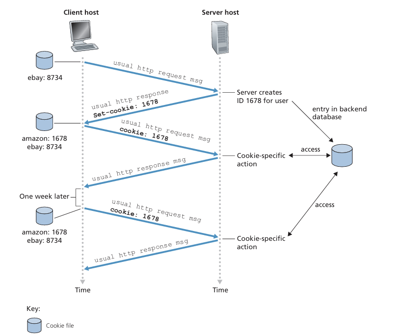
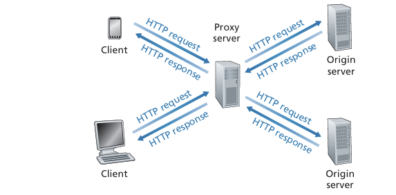
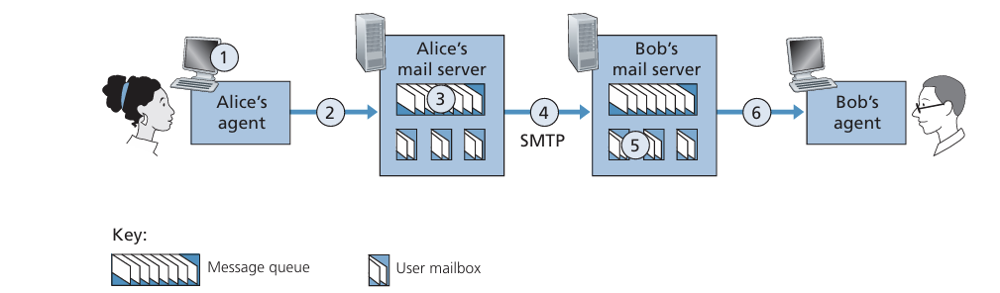
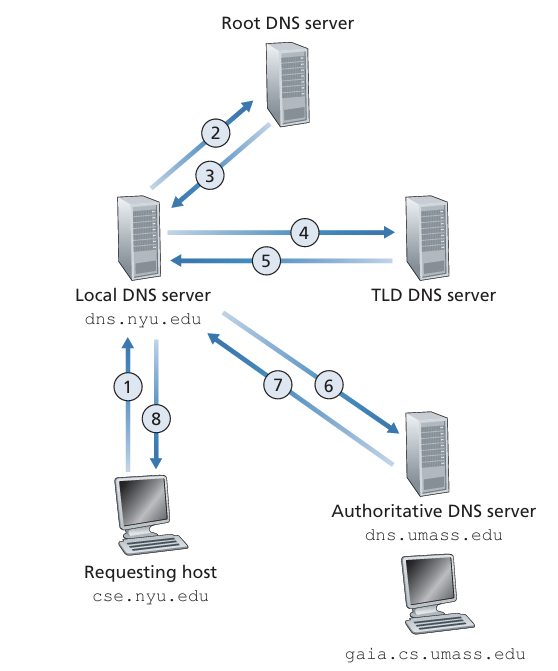
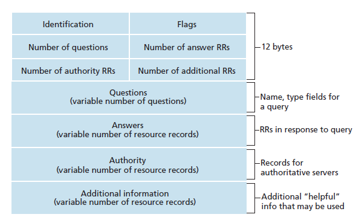
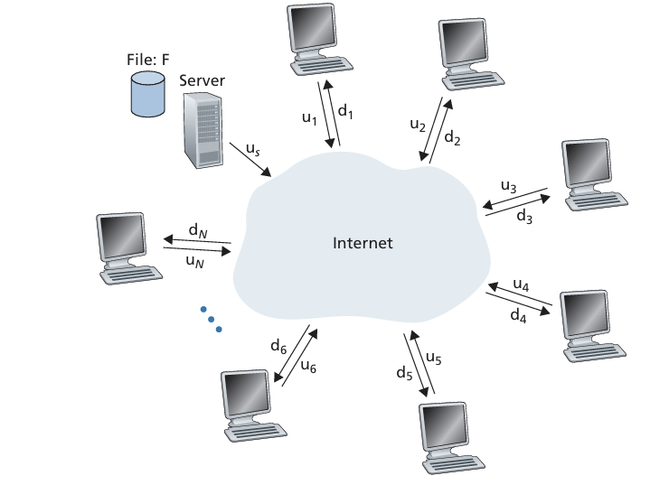
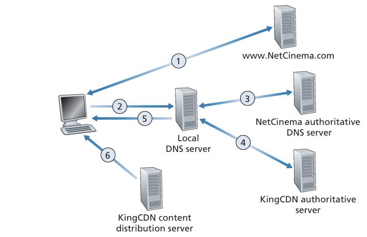

# Application
## 網路應用原理
### 網路應用架構

應用架構(application architecture) 由開發者設計，定義了如何在各個系統上整合應用程式。

當前有兩個主流體系:

1. 客戶-服務器架構(client-server architecture)

會有一個總是啟動的主機，其是*服務器*。它服務來自於許多其它稱為*客戶*的主機請求。這存在以下特徵
- 客戶之間互不直接通訊
- 服務器有一個周知的 IP 地址


當只有一台服務器時，可能是搜尋引擎等。它可能無法處理成千上萬的客戶請求。因此可藉由託管大量主機即*數據中心(data center)* 來解決該問題。


2. P2P 架構(P2P architecture)

- 不再大量依賴位於資料中心的專用伺服器，而是讓網路中的使用者端（Peers）彼此直接通訊
- 這些 Peers 為個人擁有的桌上型電腦或筆電，分散於家中、學校、辦公室等地，而非服務提供者所管理
- 因為不經過專用伺服器而是 Peer 間直連傳輸，因此稱為「Peer-to-Peer」
- 不需大規模伺服器基礎設施與高頻寬的資料中心，相較傳統 Client-Server 模式*更省成本*

特性:

- P2P 自我延展(Self-Scalability)
  - 在檔案分享應用（如 BitTorrent）中，雖然每個 Peer 會產生需求（下載檔案），卻也同時提供上傳能力（為其他 Peer 分發檔案）
  - 因此整體服務能力會隨著 Peer 數量增加而提升，具有良好的可擴充性

面臨挑戰:

- 安全性 (Security)：高度分散的架構使得管理與防護更困難
- 效能 (Performance)：節點連線品質不一、Peer 上線/離線不穩定，導致整體效能波動大
- 可靠度 (Reliability)：缺乏中央伺服器，可能造成檔案來源不足、分散節點故障等問題

### 行程通訊(Processes Communicating)

在作業系統中，進行通訊的是行程(process)而不是程式。然而被運行的程式為作業系統中的行程。

- 同一端系統上的程序通訊
    - 程序彼此間使用「行程間通訊 (IPC)」交換資料。
    - 行程間通訊規則由作業系統管理。

- 跨主機（端系統）通訊的重點
    - 透過跨越計算機網路交換訊息(message)相互通訊


##### 1. 客戶端與伺服器端程序

- 網路應用程式的通訊形態
    - 由一對對的行程(process)相互透過網路傳送訊息所構成（例如：Web、P2P 檔案共享）。

- 客戶端與伺服器的基本概念
    - 在每對通訊程序中，一方標記為客戶端，另一方標記為伺服器。
        - Web: 瀏覽器 (客戶端) <-> 網頁伺服器 (伺服器)
        - P2P: 下載端 (客戶端) <-> 上傳端 (伺服器)
- *角色定義*
    - 客戶端：在通訊連線開始時，主動聯繫另一方的行程
    - 伺服器：在通訊連線開始時，等待對方聯繫的行程

>P2P 行程可同時上傳與下載，在不同會話可同時扮演客戶端與伺服器，但一條特定連線中仍可清楚區分客戶端與伺服器。

##### 2. 行程與網路之間的介面

應用程式通常是行程對組成，因此可互相通訊。它們之間之間通訊需透過網路。

- 行程之間通訊
    - 透過 `socket` 從網路收發訊息
- socket 概念
    - 位於主機的應用層和傳輸層之間
    - socket 是應用程式和網路之間的應用程式介面 (Application Programming Interface,API) 
- 開發者的控制範圍
    - 應用層端：開發者能自由掌控程式邏輯與運行方式
    - 傳輸層端：開發者只能設定少部分參數，例如：
        - 選擇傳輸協定 (TCP、UDP...)
        - 設定傳輸層的少數參數（如最大緩衝區大小、最大分段大小）。


##### 行程尋址

1. 目的地位址的必要性

- 就像郵件需要寄往「郵寄地址」，網路中的封包也需指定目標主機的位址，以及該主機上的特定程式。

2. 主機位置就是 IP 

3. 應用程式（或 socket）識別：埠號 (port number)
- 在同一台主機上，可同時跑多個網路應用程式
- 為區分不同應用的流程，需要用埠號來標記特定的接收程序
    - 例如：Web 伺服器使用埠號 80，SMTP（郵件伺服器）使用埠號 25

### 給應用程式的運輸服務
大體可分類為以下

##### 1. 可靠數據傳輸(reliable data transfer)

1. 封包遺失的可能性
- 封包在路由器緩衝區滿溢、位元損毀等情況下可能被丟棄

2. 可靠傳輸
- 許多應用（郵件、檔案傳輸、遠端登入、Web 文件傳輸、金融交易等）都需要高度可靠的資料傳送

3. 非可靠傳輸的容忍度
- 若協定不提供可靠傳輸，部分資料可能永遠遺失
- 某些「容忍遺失」的多媒體應用（如視訊、音訊串流）可接受少量遺失而不嚴重影響使用者體驗

4. 傳輸層的關鍵服務
- 傳輸層可能為應用提供行程對行程的可靠資料傳輸服務
- 未提供該服務時，就必須由應用層或其他機制去處理可能的資料遺失問題


##### 2. 吞吐量(throughput)

1. 可用吞吐量 (Available Throughput)
- 也就是在兩個程序於網路路徑進行通訊時，傳送端能以多快的速率將資料位元送達接收端
- 由於與其他連線共享頻寬，而且連線會進進出出，可用吞吐量隨時間變動

2. 保證吞吐量 (Guaranteed Throughput) 需求
- 為傳輸層的一種潛在服務：允許應用程式請求並保證一個最低傳輸速率 $r$ bps
- 適用於對頻寬需求嚴格的應用，如網際網路語音 (Internet telephony) 或其他多媒體應用

3. 對頻寬敏感 (Bandwidth-Sensitive) 應用
- 有明確的吞吐量需求，若拿不到足夠頻寬便無法正常運作
    - 32 kbps 網路電話若收不到至少 32 kbps 的頻寬，可能必須轉用更低編碼率或放棄服務
4. 彈性 (Elastic) 應用
- 可以彈性使用「當下可用」的任意吞吐量，不會因頻寬不足而導致完全不可用
    - 電子郵件、檔案傳輸、Web 下載皆屬此類，可用頻寬越高，傳輸速度就越快，但即使頻寬較低，也仍可正常進行


##### 3. 定時(timing)

1. 時間 (timing) 保證概念
- 傳輸層可定義各種形式的時間保證，例如「在一定毫秒內保證資料抵達」等

2. 適用的應用情境
- 交互式即時應用（如網路電話、虛擬實境、視訊會議、多玩家遊戲等）需要嚴格的時間約束，確保使用者體驗自然、即時

3. 時間延遲對使用體驗的影響
- 網路電話的通話延遲過高會造成對話不流暢
- 多人遊戲或虛擬環境中，延遲過大會讓動作與回應時間差過長，影響沉浸感與真實感

4. 非即時應用
- 雖然延遲越低體驗越佳，但並不需要像即時應用那樣的「硬性時間限制」

##### 4. 安全性(security)
1. 安全性服務 (Security Services)

- 傳輸層可以對傳送資料進行加密，並在接收時解密，保障傳輸過程中的保密性
- 此外還可實作資料完整性、終端驗證等功能

2. 應用場景

- 若應用需要確保資料不被竊聽或竄改，可使用傳輸層協定的加密/解密功能
- 這使得資料即使在網路傳輸中被截取，也無法輕易被解讀

### 網際網路提供的運輸服務

##### 1. TCP
- 面向連接的服務
  - 傳輸層在應用程式消息傳送前，先由客戶端與伺服器互換控制資訊，稱為「握手 (handshaking)」程序。
  - 握手完成後，即在兩端的套接字之間建立起一條 TCP 連線。
  - 全雙工 (Full-duplex) 通訊
    - 一旦連線建立，雙方可同時在這條連線上彼此傳送消息。
  - 連線終止 (Tear-down)
    - 當應用程式完成消息傳送後，必須主動中斷並拆除該 TCP 連線。

- 可靠的數據傳輸服務
    - 可靠性：TCP 保證所有傳送的資料都能正確到達，不會遺失。
    - 順序性：TCP 確保資料以傳送時的順序交付給接收端。
    - 無重複：TCP 不會交付重複的位元組。
    - 流式傳輸：應用程式可以視為在兩端之間傳輸連續的位元組流，而不需擔心底層的分段或重組問題。

- 擁塞控制機制 (Congestion Control)
  - TCP 內建擁塞控制，以維護整個網際網路的運作穩定，而非僅服務於單一連線。

- 節流 (Throttling)
  - 當網路在傳送端與接收端之間發生擁塞時，TCP 會主動限制傳送速率，避免進一步惡化擁塞情況。

- 公平分享 (Fair Share)
  - TCP 的擁塞控制演算法會嘗試讓每條連線都能取得「公平份額」的網路頻寬，避免某些連線過度耗用資源。

##### 2. UDP

- 輕量無附加功能
  - UDP 設計簡單，只提供最低限度的傳輸服務

- 無連線 (Connectionless)
  - 不需握手過程：兩端直接發送和接收訊息

- 不可靠傳輸 (Unreliable)
  - 不保證訊息到達接收端
  - 可能造成封包遺失
  - 可能導致封包順序錯亂

- 無擁塞控制
  - 發送端可任意速率傳送資料，不會主動節流
  - 實際吞吐量仍受路徑容量與擁塞影響

### Application-Layer Protocols

- 應用層協定的目的
  - 定義跨主機應用程序間訊息的結構與交換流程。
- 訊息種類 (Message Types)
  - 常見有「請求訊息」與「回應訊息」兩大類。
- 訊息語法 (Syntax)
  - 規範每種訊息有哪些欄位，欄位順序、格式，以及如何分隔。
- 欄位語意 (Semantics)
  - 每個欄位代表什麼資訊，例如資源名稱、狀態碼、時間戳記、資料長度等。
- 交換規則 (Rules)
  - 定義「何時送出」與「如何回應」——包括請求／回應的時機、重傳機制、錯誤處理等。

### HTTP
由 client 和 server 端程式實現。HTTP 定義了兩端的 message 結構和交換方式。


上圖示 client 和 server 交互過程。使用者請求一個頁面時，瀏覽器向 server 發出對該頁面所包含對象的 HTTP 請求 message，server 接收到請求並用包含這些對象的 HTTP 回應 message 進行回應。

因為 HTTP server 並不儲存關於 client 端的訊息，所以是一個**無狀態協定(stateless protovol)**。

##### 非持續連接和持續連接
- 非持續連接(non-persistent connection)
    - 每個請求和回應是經過一個單獨的 TCP 連接發送
- 持續連接(persistent connection)
    - 請求和回應經過相同的 TCP 連接發送

##### 非持續連接 HTTP
file and 10 JPEG images, and that all 11 of these objects reside on the same server. Further suppose the URLfor the base HTMLfile is

http://www.someSchool.edu/someDepartment/home.index

1. HTTP client 在 80 port 上發起一個到 www.someSchool.edu 的 TCP 連接。在 server 和 client 分別有 socket 該連接相關聯。
2. HTTP client 經由 socket 向 server 發送 HTTP message 請求，包含請求路徑、主機等資訊
3. HTTP server 經由 socket 接收該請求，從儲存裝置(RAM 或 Disk) 中檢所出請求對象，在一個 HTTP 回應 message 中封裝對象，並透過 socket 向 client 回應 message
4. HTTP server 的 process 通知 TCP 斷開與 client 的連接。(必須直到 client 完整接收到該回應訊息)
5. HTTP client 接收到回應訊息，TCP 連接關閉。該 message 封裝的是一個 HTML 檔案，並得到對 10 個 JPEG 圖檔的引用
6. 對每個引用的 JPEG 圖型對象，重複 1 ~ 4 步驟

從上面可知需要 11 個 TCP 請求，因為使用**非持續連接**。但在現代，大部分瀏覽器都可開啟 5 ~ 10 個並行 TCP 連接，縮短回應時間。

從上面步驟，可估算出 client 請求 HTML 到收到整個檔案所花費時間。這邊給出**往返時間(Round-Trip Time, RTT)** 的定義，RTT 包含封包傳播延遲、封包在中間路由和交換器上的隊列延遲和封包處裡延遲。


##### 持續連接 HTTP

**HTTP 持續性連線的背景與優點**

在介紹 HTTP 持續性連線之前，來源指出非持續性連線存在一些缺點：
*   **資源負擔**：對於每個請求的物件，都必須建立和維護一個全新的連線。這會導致客戶端和伺服器都需要分配 TCP 緩衝區和 TCP 變數，對 Web 伺服器造成顯著負擔。
*   **延遲增加**：每個物件的傳輸都需經歷兩次往返時間 (RTT) 的延遲，其中一次用於建立 TCP 連線，另一次用於請求和接收物件。

為了解決這些問題，HTTP/1.1 引入了持續性連線 (Persistent Connections)。

**HTTP 持續性連線的特點**

HTTP/1.1 的持續性連線具有以下主要特點和優勢：
*   **連線保持開放**：伺服器在發送回應後會保持 TCP 連線開啟，而不是立即關閉。
*   **重複使用連線**：同一個客戶端和伺服器之間後續的請求和回應可以透過同一個 TCP 連線發送。
*   **傳輸整個網頁**：一個完整的網頁（例如基礎 HTML 檔案和多個圖片）可以透過單一的持續性 TCP 連線傳輸。
*   **多個網頁傳輸**：儲存在同一伺服器上的多個網頁也可以透過單一的持續性 TCP 連線發送給同一個客戶端。
*   **管線化 (Pipelining)**：物件請求可以連續發送，無需等待之前請求的回覆，實現管線化。
*   **可設定逾時關閉**：HTTP 伺服器通常會在連線閒置一段時間後（可配置的逾時區間）關閉連線。
*   **預設模式**：HTTP 的預設模式就是使用帶有管線化的持續性連線。

透過使用持續性連線，可以顯著減少 TCP 連線建立和關閉所帶來的開銷和延遲，從而提高 Web 應用程式的性能。HTTP/2 更進一步透過單一 TCP 連線上的請求和回應多工來減少延遲，並提供請求優先級和伺服器推送功能。

根據您提供的資料，「2.2.3 HTTP 訊息格式 (HTTP Message Format)」章節的重點整理如下：

###  HTTP Message Format

HTTP 規範 ([RFC 1945], [RFC 7230], [RFC 7540]) 定義了兩種 HTTP 訊息類型：請求訊息 (request messages) 和回應訊息 (response messages)。這些訊息都是以普通的 ASCII 文字寫成，方便人類閱讀。

**HTTP 請求訊息 (HTTP Request Message)**

*   **結構**：HTTP 請求訊息通常由以下部分組成：
    *   **請求行 (Request Line)**：這是訊息的第一行，包含三個欄位。
        *   **方法欄位 (Method Field)**：指定客戶端希望伺服器執行的動作，常見的值包括 `GET`、`POST`、`HEAD`、`PUT` 和 `DELETE`。其中 `GET` 方法最常用於瀏覽器請求物件，物件的識別透過 URL 欄位進行。
        *   **URL 欄位 (URL Field)**：指定請求物件的統一資源定位符。
        *   **HTTP 版本欄位 (HTTP Version Field)**：指示客戶端使用的 HTTP 協定版本，例如 `HTTP/1.1`。
    *   **標頭行 (Header Lines)**：在請求行之後，每行一個，包含額外資訊。常見的標頭行包括：
        *   `Host: www.someschool.edu`：指定物件所在的伺服器主機，對 Web 代理快取很重要。
        *   `Connection: close`：告知伺服器在發送完請求的物件後關閉 TCP 連線，不使用持續性連線。
        *   `User-agent: Mozilla/5.0`：指定使用者代理（即瀏覽器類型），伺服器可據此發送不同版本的物件。
        *   `Accept-language: fr`：指示使用者偏好的物件語言版本。
    *   **空行 (Blank Line)**：標頭行之後跟著一個空行。
    *   **實體主體 (Entity Body)**：在 `GET` 方法中通常是空的，但若使用 `POST` 方法 (例如使用者填寫表單時)，則實體主體會包含使用者輸入的表單資料。
    
    ```
    GET /somedir/page.html HTTP/1.1
    Host: www.someschool.edu
    Connection: close
    User-agent: Mozilla/5.0
    Accept-language: fr
    ```

    

**HTTP 回應訊息 (HTTP Response Message)**

*   **結構**：HTTP 回應訊息由以下三個主要部分組成：
    *   **狀態行 (Status Line)**：這是訊息的第一行，包含三個欄位。
        *   **協定版本欄位 (Protocol Version Field)**：伺服器使用的 HTTP 協定版本。
        *   **狀態碼 (Status Code)**：一個三位數的數字，指示請求的結果。
        *   **對應的狀態訊息 (Corresponding Status Message)**：狀態碼的文字解釋。
        *   **常見狀態碼**：
            *   **`200 OK`**：請求成功，資訊在回應中返回。
            *   `301 Moved Permanently`：請求的物件已永久移動，新的 URL 在 `Location:` 標頭中指定。
            *   `400 Bad Request`：伺服器無法理解請求的通用錯誤碼。
            *   `404 Not Found`：請求的文件在伺服器上不存在。
            *   `505 HTTP Version Not Supported`：伺服器不支援請求的 HTTP 協定版本。
    *   **標頭行 (Header Lines)**：在狀態行之後，包含額外資訊。常見的標頭行包括：
        *   `Connection: close`：告知客戶端伺服器在發送訊息後將關閉 TCP 連線。
        *   `Date:`：HTTP 回應被伺服器創建和發送的時間和日期。
        *   `Server:`：生成訊息的 Web 伺服器類型（例如 `Apache`）。
        *   `Last-Modified:`：物件創建或最後修改的時間和日期，對快取很重要。
        *   `Content-Length:`：發送物件的位元組數。
        *   `Content-Type:`：實體主體中物件的類型（例如 `text/html`）。
    *   **空行 (Blank Line)**：標頭行之後跟著一個空行。
    *   **實體主體 (Entity Body)**：包含請求的物件本身（例如 HTML 檔案的內容）。


**其他要點**

*   HTTP 規範定義了許多其他標頭行，瀏覽器和 Web 伺服器會根據類型、版本、使用者配置以及快取狀態等因素決定包含哪些標頭。
*   使用者可以透過 Telnet 連線到 Web 伺服器並手動發送請求訊息，以查看實際的 HTTP 回應訊息。
*   Wireshark 實驗室也提供了探索 HTTP 協定不同層面的機會，包括 GET/回覆互動、訊息格式、持續性與非持續性連線等。

###  User-Server Interaction: Cookies

Cookies 技術被用於**網站追蹤使用者**，因為 HTTP 伺服器是無狀態的，而這簡化了伺服器設計，使其能夠處理數千個同時的 TCP 連線。然而，網站通常需要識別使用者，以便限制使用者存取或根據使用者身份提供內容。

Cookies 技術包含以下**四個主要元件**：
1.  **HTTP 回應訊息中的 Cookie 標頭行**。
2.  **HTTP 請求訊息中的 Cookie 標頭行**。
3.  **儲存於使用者終端系統上並由使用者瀏覽器管理的 Cookie 檔案**。
4.  **網站後端資料庫**。

**Cookies 的運作方式範例** (以 Susan 第一次造訪 Amazon.com 為例)：
1.  Susan 的瀏覽器向 Amazon.com 發送請求時，Amazon Web 伺服器會建立一個**獨特的識別號碼**，並在後端資料庫中建立一個以此識別號碼索引的條目。
2.  Amazon Web 伺服器回應 Susan 的瀏覽器時，會在 HTTP 回應中包含一個 `Set-cookie:` 標頭，其中包含此識別號碼 (例如 `Set-cookie: 1678`)。
3.  Susan 的瀏覽器收到 HTTP 回應訊息後，會在其管理的特殊 **cookie 檔案中追加一行**，包含伺服器的主機名稱和 `Set-cookie:` 標頭中的識別號碼。
4.  當 Susan 繼續瀏覽 Amazon 網站時，每次她請求網頁，她的瀏覽器都會查詢她的 cookie 檔案，提取該網站的識別號碼，並在 HTTP 請求中加入一個 **Cookie 標頭行** (例如 `Cookie: 1678`)。



透過這種方式，Amazon 伺服器能夠**追蹤 Susan 在網站上的活動**。即使 Amazon 不一定知道 Susan 的姓名，它也知道使用者 1678 訪問了哪些頁面、順序和時間。Cookies 可以用來提供購物車服務，並根據使用者過去訪問的網頁推薦產品。如果使用者註冊並提供個人資訊，Amazon 就可以將這些資訊與其識別號碼關聯起來，實現「一鍵購物」等便利功能。

Cookies 可以用於在**無狀態的 HTTP 上建立使用者會話層**，例如在基於網路的電子郵件應用程式中，瀏覽器發送 cookie 資訊到伺服器，使伺服器能夠在整個會話期間識別使用者。

儘管 Cookies 通常能**簡化使用者的網路購物體驗**，但它們也存在**爭議**，因為可能被視為**侵犯隱私**。透過結合 Cookies 和使用者提供的帳戶資訊，網站可以了解大量使用者資訊，並可能將這些資訊出售給第三方。

### Web Caching

**網站快取（Web Caching），也稱為代理伺服器（proxy server），是一種網路實體，負責代表原始網站伺服器（origin Web server）處理 HTTP 請求**。

**運作原理與元件**：
1.  網站快取擁有自己的磁碟儲存空間，並**存放近期請求過的物件副本**。
2.  使用者的瀏覽器可以被設定，將**所有的 HTTP 請求首先導向網站快取**。
3.  **當瀏覽器請求一個物件時，流程如下**：
    *   瀏覽器與網站快取建立 TCP 連線，並向快取發送該物件的 HTTP 請求。
    *   **快取檢查其本地儲存空間**。如果找到物件副本，快取會將物件放入 HTTP 回應訊息中，並傳回給用戶端瀏覽器。
    *   如果快取沒有該物件，它會與原始伺服器建立 TCP 連線，並向原始伺服器發送該物件的 HTTP 請求。
    *   原始伺服器收到請求後，將物件放入 HTTP 回應中傳送給網站快取。
    *   網站快取收到物件後，會在本地儲存一個副本，同時將副本傳送給用戶端瀏覽器。




**網站快取身兼二職**：
*   當它從瀏覽器接收請求並發送回應時，它是一個**伺服器**。
*   當它向原始伺服器發送請求並從其接收回應時，它是一個**用戶端**。

**部署方式**：
*   通常由網際網路服務供應商（ISP）購買和安裝。例如，大學可能會在其校園網路中安裝快取，並將所有校園瀏覽器設定為指向該快取。大型住宅 ISP 也可能在其網路中安裝快取。

**網站快取的優點**：
1.  **顯著縮短用戶端請求的回應時間**：特別是當用戶端與原始伺服器之間的瓶頸頻寬遠低於用戶端與快取之間的頻寬時。如果用戶端與快取之間有高速連線，且快取有請求的物件，則可以快速將物件傳送給用戶端。
2.  **顯著減少機構對網際網路存取鏈路上的流量**：透過減少流量，機構（如公司或大學）無需迅速升級頻寬，從而降低成本。這也有助於**改善整個網際網路的網站流量，從而提升所有應用程式的效能**。
3.  **具成本效益**：相較於升級網路鏈路，購買和安裝網站快取的成本通常較低，許多快取甚至使用在廉價個人電腦上執行的公共領域軟體。

**快取的物件新舊檢驗：條件式 GET（Conditional GET）**：
*   快取雖然可以減少回應時間，但可能會有物件副本過期的問題。HTTP 提供了一個機制來驗證快取的物件是否為最新。
*   **條件式 GET**：這是一種 HTTP 請求訊息，使用 GET 方法並包含 `If-Modified-Since:` 標頭行。
*   **運作方式**：
    1.  快取收到物件後，會將物件連同其 `Last-Modified` 日期一併儲存。
    2.  當用戶端再次請求相同物件時，快取會發出一個條件式 GET，其 `If-Modified-Since:` 標頭的值與之前伺服器傳送的 `Last-Modified:` 值相同。
    3.  如果物件自指定日期以來未被修改，網站伺服器會傳送一個 **`304 Not Modified`** 回應訊息，但不包含請求的物件內容。這可以**節省頻寬並減少使用者感知到的回應時間**。

**與內容傳遞網路（CDN）的關係**：
*   網站快取在內容傳遞網路（CDN）中扮演著越來越重要的角色。CDN 公司在網際網路中部署了許多地理分佈的快取，從而將大部分流量本地化。

### HTTP/2

身為一位資深網路架構師，並具備紮實的計算機科學知識，我將為您重點整理來源中 2.2.6 章節關於 HTTP/2 的內容。

HTTP/2 是自 1997 年 HTTP/1.1 標準化以來，於 2015 年推出的第一個新版 HTTP 協定，並且在 2020 年已廣泛部署，前 1000 萬個網站中有超過 40% 支援 HTTP/2，主流瀏覽器也皆支援。

**HTTP/2 的主要目標與動機**

HTTP/2 的核心目標是*降低感知延遲*，並透過以下機制達成：
*   在*單一* TCP 連線中實現請求與回應的多工 (multiplexing)。
*   提供請求優先級 (request prioritization)。
*   支援伺服器推播 (server push)。
*   高效壓縮 HTTP 標頭欄位。

HTTP/2 的提出是為了解決 HTTP/1.1 存在的限制。HTTP/1.1 雖然使用了持久連線 (persistent connections) 讓網頁物件可以透過單一 TCP 連線傳輸，但當網頁包含多個物件時，特別是當有大型物件（如影片）在隊列頭部時，會產生「隊頭阻塞 (Head of Line, HOL) blocking」問題。這會導致小型物件被延遲，使用者感知到的延遲增加。為規避此問題，*HTTP/1.1 的瀏覽器通常會開啟多個並行 TCP 連線，這不僅有助於繞過 HOL 阻塞，也意外地讓瀏覽器能夠「佔用」更多頻寬*，因為 TCP 擁塞控制機制會嘗試公平分配頻寬給每個連線。

**HTTP/2 的解決方案與主要特性**

1.  **HTTP/2 Framing 以解決 HOL 阻塞**：
    *   HTTP/2 的解決方案是將每個 HTTP 訊息拆分成小的「幀 (frames)」，並在同一個 TCP 連線上交錯 (interleave) 請求和回應訊息。
    *   例如，一個包含一個大型影片和八個小型物件的網頁，伺服器會收到 9 個並行且相互競爭請求。透過幀交錯，伺服器可以先傳送影片的一個幀，然後傳送每個小型物件的第一個幀，接著再傳送影片的第二個幀，然後是每個小型物件的最後一個幀。這樣可以顯著減少使用者感知到的延遲。
    > For each of these requests, the server needs to send 9 competing HTTP response messages to the browser.  Suppose all frames are of  fixed length, the video clip consists of 1000 frames, and each of the smaller objects consists of two frames. With frame interleaving, after sending one frame from the video clip, the first frames of each of the small objects are sent. Then after sending the second frame of the video clip, the last frames of each of the small objects are sent. Thus, all of the smaller objects are sent after sending a total of 18 frames. 
    *   此分幀功能由 HTTP/2 協定的分幀子層 (framing sub-layer) 完成，它也負責將幀二進制編碼 (binary encoding)，以提高解析效率，減少幀大小，並降低錯誤率。

2.  **訊息優先級 (Message Prioritization)**：
    *   允許開發人員自定義請求的相對優先級，以優化應用程式性能。
    *   客戶端可以為每個訊息分配一個 1 到 256 之間的權重，數字越高表示優先級越高。伺服器會根據這些權重優先傳送優先級最高的訊息幀。
    *   客戶端還可以指定訊息之間的依賴關係，進一步細化優先級策略。

3.  **伺服器推播 (Server Push)**：
    *   HTTP/2 允許伺服器針對單一客戶端請求傳送多個回應。
    *   伺服器可以在客戶端明確請求之前，主動推播額外的物件到客戶端。由於 HTML 基礎頁面通常會指明渲染完整網頁所需的其他物件，伺服器可以分析 HTML 頁面，識別所需物件，*並在收到顯式請求前將其傳送給客戶端*。這消除了等待請求的額外延遲。

**HTTP/3 與 QUIC 協定**

*   HTTP/3 是另一個新的 HTTP 協定，設計運行在 QUIC (Quick UDP Internet Connections) 協定之上。
*   QUIC 是一個在應用層實現的「傳輸」協定，它直接運行在 UDP 協定之上，並提供多項 HTTP 所需的功能，例如訊息多工 (interleaving)、每個串流的流量控制 (per-stream flow control) 和低延遲連線建立 (low-latency connection establishment)。
*   HTTP/3 的設計因此可以更簡潔，因為許多 HTTP/2 的功能（如訊息交錯）已被 QUIC 吸納。

總結來說，HTTP/2 是網路協定演進中的重要一步，透過分幀、優先級和伺服器推播等機制，顯著改善了 HTTP/1.1 在多物件網頁傳輸中的效能瓶頸，尤其解決了 HOL 阻塞問題，並為下一代 HTTP/3 與 QUIC 協定的發展奠定了基礎。

## Electronic Mail in the Internet

網際網路電子郵件系統是當今最重要且應用最廣泛的應用程式之一，它的設計涵蓋了幾個關鍵的應用層協定，以實現非同步通訊。整個系統主要由三個核心元件構成：使用者代理（User Agents）、郵件伺服器（Mail Servers）和簡易郵件傳輸協定（Simple Mail Transfer Protocol, SMTP）。

### 網際網路郵件系統的核心元件

1.  **使用者代理 (User Agents)**:
    *   這是使用者介面，允許使用者進行郵件的閱讀、回覆、轉寄、儲存以及撰寫等操作。
    *   常見的例子包括 Microsoft Outlook、Apple Mail、基於網頁的 Gmail 介面，以及智慧型手機上的 Gmail 應用程式等。
    *   當使用者（例如 Alice）撰寫完郵件後，她的使用者代理會將訊息傳送至她的郵件伺服器。

2.  **郵件伺服器 (Mail Servers)**:
    *   郵件伺服器是電子郵件基礎設施的核心。
    *   每個收件人（例如 Bob）都有一個郵件信箱儲存在其中一個郵件伺服器上，負責管理和維護發送給他的訊息。
    *   郵件伺服器會處理傳出郵件佇列（outgoing message queue），並在傳輸失敗時進行重新嘗試。例如，如果 Alice 的伺服器無法將郵件傳遞給 Bob 的伺服器，郵件會在 Alice 的伺服器訊息佇列中保留，並定期（例如每 30 分鐘）嘗試重新傳輸。如果數天後仍未成功，伺服器會將訊息移除並通知寄件人。
    *   使用者代理在存取郵件信箱時，郵件伺服器會負責驗證使用者的身份（透過使用者名稱和密碼）。

3.  **簡易郵件傳輸協定 (SMTP)**:
    *   SMTP 是網際網路電子郵件的核心應用層協定。
    *   它利用 TCP 的可靠數據傳輸服務，將郵件從寄件人的郵件伺服器傳輸至收件人的郵件伺服器。
    *   SMTP 協定分為客戶端（client side）和伺服器端（server side）。當郵件伺服器發送郵件時，它充當 SMTP 客戶端；當接收郵件時，則充當 SMTP 伺服器。所有郵件伺服器都執行這兩部分功能。

### SMTP 的基本運作流程

讓我們以 Alice 發送一封 ASCII 訊息給 Bob 為例，來深入了解 SMTP 的運作流程：

1.  **訊息撰寫與提交**: Alice 透過她的使用者代理撰寫訊息，並提供 Bob 的電子郵件地址（例如 bob@someschool.edu），然後指示代理發送訊息。
2.  **提交至寄件人郵件伺服器**: Alice 的使用者代理將訊息傳送至她的郵件伺服器，訊息會被放入郵件伺服器的訊息佇列中。這一步通常透過 SMTP 或 HTTP 進行。
3.  **建立 TCP 連線**: Alice 郵件伺服器上運行的 SMTP 客戶端發現佇列中有訊息，會嘗試開啟一個到 Bob 郵件伺服器 SMTP 伺服器端的 TCP 連線，預設使用埠號 25。
4.  **SMTP 握手**: 連線建立後，SMTP 客戶端和伺服器會進行應用層的握手（handshaking）。這個過程類似於人類在交流前會先互相介紹。客戶端會在此階段指示寄件人的電子郵件地址和收件人的電子郵件地址。
    *   例如，伺服器會回應 `S: 220 hamburger.edu`，客戶端會發送 `C: HELO crepes.fr`，伺服器再回覆 `S: 250 Hello crepes.fr, pleased to meet you`。
    *   客戶端隨後發送 `MAIL FROM:` 和 `RCPT TO:` 命令來指定寄件人和收件人。
5.  **訊息傳輸**: 握手完成後，SMTP 客戶端透過 TCP 連線發送 Alice 的訊息。訊息內容結束時，會發送一個包含單獨句點的行（`C: .`）。
6.  **訊息接收與儲存**: Bob 郵件伺服器上的 SMTP 伺服器端收到訊息後，會將訊息存入 Bob 的郵件信箱。
7.  **收件人讀取**: Bob 隨後透過他的使用者代理，在方便時讀取訊息。



值得注意的是，SMTP 通常不使用中間郵件伺服器來傳送郵件，即使兩個郵件伺服器相距遙遠，TCP 連線也是在寄件伺服器和收件伺服器之間直接建立的。SMTP 也使用持久連線（persistent connections），這意味著如果寄件伺服器有多封郵件要傳送給同一個收件伺服器，它可以透過同一個 TCP 連線傳送所有訊息。

### SMTP 的特性與限制

*   **歷史悠久**: SMTP 比 HTTP 更早出現，其原始 RFC 可追溯至 1982 年。
*   **7 位元 ASCII 限制**: SMTP 的一個「古老」特性是它限制所有郵件訊息的內容（不僅是標頭）為簡單的 7 位元 ASCII 格式。這在早期頻寬稀缺的年代有其道理，但對於現今的多媒體內容，需要將二進位資料編碼為 ASCII 再進行傳輸，接收端再解碼回二進位，這增加了額外的複雜性。相對地，HTTP 則沒有此限制。

### 郵件訊息格式

電子郵件訊息包含一個標頭（header）和訊息主體（body），兩者之間由一個空白行分隔（即 CRLF.CRLF）。標頭行由 RFC 5322 定義，包含可讀的文字，格式為「關鍵字: 值」，例如 `From:`、`To:` 和 `Subject:`。這些標頭行與 SMTP 握手期間的命令（例如 MAIL FROM）是不同的概念。

### 郵件存取協定 (Mail Access Protocols)

當 SMTP 將訊息從 Alice 的郵件伺服器傳遞到 Bob 的郵件伺服器後，訊息會被放置在 Bob 的信箱中。由於使用者通常在本地主機（例如智慧型手機或個人電腦）上執行使用者代理，因此需要一種機制讓收件人從郵件伺服器中「提取」訊息。

SMTP 本身是一種「推」（push）協定，用於將郵件從伺服器推送到伺服器。因此，使用者代理不能直接使用 SMTP 來「拉」（pull）取郵件。為此，網際網路提供了兩種主要的郵件存取協定：

1.  **HTTP**:
    *   如果 Bob 使用基於網頁的電子郵件服務（例如 Gmail 或 Hotmail）或智慧型手機應用程式，他的使用者代理會使用 HTTP 來檢索郵件。這要求 Bob 的郵件伺服器同時具備 HTTP 介面和 SMTP 介面。
2.  **IMAP (Internet Mail Access Protocol)**:
    *   這是一種常用的郵件客戶端協定，例如 Microsoft Outlook 等郵件客戶端通常使用 IMAP 協定（RFC 3501）。
    *   HTTP 和 IMAP 這兩種方式都允許使用者在郵件伺服器上管理資料夾、移動訊息、刪除訊息以及標記重要訊息等操作。

最後，值得一提的是，郵件傳送過程通常是兩階段的：首先，Alice 的使用者代理將郵件傳遞給 *她自己的* 郵件伺服器（使用 SMTP 或 HTTP），然後 *她的* 郵件伺服器再使用 SMTP 將郵件轉發給 Bob 的郵件伺服器。這種兩階段程序確保了即使 Bob 的郵件伺服器暫時無法到達，Alice 的郵件伺服器也能夠重複嘗試傳送。

理解電子郵件在網際網路中的運作機制，對於任何計算機科學專業人士都是至關重要的，它展示了應用層協定如何協同底層傳輸層（如 TCP）提供可靠且功能豐富的服務。

## DNS

### 核心概念與運作機制

本章節主要闡述了域名系統 (DNS) 的定義、必要性、提供的服務、其分散式架構、查詢機制、記錄類型以及潛在的安全漏洞。

#### 1. DNS 的基本定義與必要性
*   **定義**：DNS 是一個**分散式資料庫**，以層級結構實作在多個 DNS 伺服器中。它同時也是一個**應用層協定**，允許主機查詢這個分散式資料庫。DNS 伺服器通常運行在 UNIX 機器上，並使用 Berkeley Internet Name Domain (BIND) 軟體。DNS 協定運行在 UDP 上，使用埠號 53。
*   **必要性**：
    *   **人類偏好與路由器需求**：人們偏好使用易於記憶的**主機名稱(hostname)**（如 `www.facebook.com`），而路由器則需要固定長度、具有階層結構的 **IP 位址**（如 `121.7.106.83`）進行封包轉發。DNS 的主要任務就是協調這兩種偏好，將主機名稱翻譯成 IP 位址。
    *   **IP 位址的結構**：IP 位址由四個位元組組成，具有嚴格的階層結構，從左到右掃描位址可獲得越來越精確的主機位置資訊。

#### 2. DNS 提供的服務
除了最主要的主機名稱到 IP 位址翻譯服務外，DNS 還提供以下重要服務：
*   **主機別名 (Host Aliasing)**：允許一個複雜的主機名稱擁有一或多個別名。DNS 可以為應用程式提供別名主機名稱的規範主機名稱 (canonical hostname) 及其 IP 位址。例如，`www.enterprise.com` 可能是 `relay1.west-coast.enterprise.com` 的別名。
*   **郵件伺服器別名 (Mail Server Aliasing)**：允許郵件伺服器擁有易於記憶的別名。例如，`bob@yahoo.com` 的郵件伺服器名稱可能比其實際的規範主機名稱（如 `relay1.west-coast.yahoo.com`）更簡潔。MX 記錄（後述）允許公司郵件伺服器與網站伺服器共享相同的別名主機名稱。
*   **負載分配 (Load Distribution)**：DNS 也用於在多個副本伺服器（如多個 Web 伺服器）之間進行負載分配。當客戶端查詢一個映射到多個 IP 位址的別名主機名稱時，DNS 伺服器會返回所有 IP 位址，但會輪換其順序，使客戶端通常會連接到列表中的第一個 IP 位址，從而實現流量分配。

#### 3. DNS 的運作概覽
當應用程式（如網頁瀏覽器或郵件客戶端）需要將主機名稱翻譯為 IP 位址時，其運作流程如下：
1.  應用程式呼叫 DNS 客戶端，指定要翻譯的主機名稱。
2.  DNS 客戶端將包含主機名稱的查詢訊息發送給 DNS 伺服器，使用 UDP 埠 53。
3.  DNS 客戶端最終會收到一個包含所需 IP 位址的回覆。
儘管 DNS 查詢會引入額外延遲，但透過**快取 (caching)** 機制，可以顯著減少 DNS 流量和平均延遲。

#### 4. 分散式階層式資料庫
鑑於網際網路龐大的主機數量，單一集中式 DNS 伺服器將面臨以下問題，因此 DNS 被設計為分散式的：
*   **單點故障 (Single Point of Failure)**：單一伺服器故障將導致整個網際網路癱瘓。
*   **流量過大 (Traffic Volume)**：單一伺服器需要處理所有 DNS 查詢，流量巨大。
*   **距離中央資料庫遙遠 (Distant Centralized Database)**：查詢客戶端無法都「靠近」單一伺服器，導致顯著延遲。
*   **維護困難 (Maintenance)**：維護一個包含所有網際網路主機記錄的巨大且需頻繁更新的中央資料庫極為困難。

為了解決這些問題，DNS 採用了大量以階層方式組織並分佈在全球各地的伺服器。

#### 5. DNS 伺服器的類型
DNS 伺服器主要分為三類，共同構成階層結構，另有一種特殊的伺服器稱為「本地 DNS 伺服器」：
*   **根 DNS 伺服器 (Root DNS Servers)**：全球有超過 1000 個根伺服器實例，由 12 個不同組織管理。它們不直接提供主機名稱到 IP 位址的轉換，而是提供**頂級域名 (TLD) 伺服器**的 IP 位址。
*   **頂級域名 (TLD) 伺服器 (Top-Level Domain (TLD) Servers)**：每個頂級域名（如 `.com`、`.org`、`.net`、`.edu`，以及國家頂級域名如 `.uk`、`.fr`）都有其 TLD 伺服器集群。它們提供**權威 DNS 伺服器**的 IP 位址。
*   **權威 DNS 伺服器 (Authoritative DNS Servers)**：每個擁有公開可訪問主機（如 Web 伺服器、郵件伺服器）的組織都必須提供 DNS 記錄，將這些主機的名稱映射到 IP 位址。這些記錄儲存在組織自己的權威 DNS 伺服器中，或由服務提供商代為託管。
*   **本地 DNS 伺服器 (Local DNS Server)**：不嚴格屬於 DNS 伺服器階層，但在 DNS 架構中扮演核心角色。每個 ISP（無論是住宅型還是機構型）都設有本地 DNS 伺服器。當主機連接到 ISP 時，ISP 會提供一個或多個本地 DNS 伺服器的 IP 位址。本地 DNS 伺服器通常「靠近」主機，並充當代理，將查詢轉發到 DNS 伺服器階層中。


#### 6. DNS 查詢流程範例
以主機 `cse.nyu.edu` 查詢 `gaia.cs.umass.edu` 的 IP 位址為例：
1.  `cse.nyu.edu` 向其本地 DNS 伺服器 `dns.nyu.edu` 發送查詢。
2.  本地 DNS 伺服器將查詢轉發給**根 DNS 伺服器**。
3.  根 DNS 伺服器根據 `.edu` 後綴，返回負責 `.edu` 頂級域名的 TLD 伺服器列表的 IP 位址。
4.  本地 DNS 伺服器向其中一個 TLD 伺服器重新發送查詢。
5.  TLD 伺服器根據 `umass.edu` 後綴，返回麻薩諸塞大學權威 DNS 伺服器 `dns.umass.edu` 的 IP 位址。
6.  最後，本地 DNS 伺服器直接向 `dns.umass.edu` 重新發送查詢。
7.  `dns.umass.edu` 返回 `gaia.cs.umass.edu` 的 IP 位址。



這個過程可能涉及多個查詢和回覆訊息，多達 8 或 10 個。
*   **遞迴查詢 (Recursive Queries)**：從請求主機到本地 DNS 伺服器的查詢是遞迴查詢，表示本地 DNS 伺服器代表主機獲取映射。
*   **迭代查詢 (Iterative Queries)**：後續的查詢（從本地 DNS 伺服器到其他階層伺服器）是迭代查詢，表示每個伺服器直接向發起查詢的本地 DNS 伺服器返回結果。

#### 7. DNS 快取 (DNS Caching)
*   DNS 廣泛利用快取來提高延遲性能並減少網路中的 DNS 訊息數量。
*   當 DNS 伺服器收到一個 DNS 回覆（包含主機名稱到 IP 位址的映射）時，它會將此映射*快取在其本地記憶體中*。
*   當再次收到相同主機名稱的查詢時，DNS 伺服器可以直接提供 IP 位址，即使它不是該主機名稱的權威伺服器。
*   快取資訊會在一固定時間（通常為兩天）後失效。由於快取，根伺服器在絕大部分 DNS 查詢中都被繞過。

#### 8. DNS 記錄與訊息
*   **資源記錄 (Resource Records, RRs)**：DNS 伺服器儲存資源記錄，包括主機名稱到 IP 位址的映射。每個 DNS 回覆訊息包含一或多個資源記錄。資源記錄是一個包含以下四個欄位的元組：`(Name, Value, Type, TTL)`
    *   `TTL (Time To Live)`：資源記錄的存活時間，決定何時從快取中移除。
    *   `Type=A`：名稱是主機名稱，值是 IP 位址。例如: `(relay1.bar.foo.com, 145.37.93.126, A)`
    *   `Type=NS`：名稱是域名，值是該域名權威 DNS 伺服器的主機名稱。例如: `(foo.com, dns.foo.com, NS)`
    *   `Type=CNAME`：值是別名主機名稱的規範主機名稱。例如: `(foo.com, relay1.bar.foo.com, CNAME)`
    *   `Type=MX`：值是擁有別名主機名稱的郵件伺服器的規範主機名稱。例如:`(foo.com, mail.bar.foo.com, MX)`
*   **DNS 訊息格式**：查詢和回覆訊息格式相同。
    *   **標頭區段 (Header Section)**：12 位元組，包含查詢識別碼和各種旗標（如查詢/回覆旗標、權威旗標、遞迴期望旗標、遞迴可用旗標），以及表示後續四種資料區段數量的欄位。
    *   **問題區段 (Question Section)**：包含查詢的主機名稱和查詢類型 (Type A 或 Type MX)。
    *   **回答區段 (Answer Section)**：包含查詢名稱的資源記錄。
    *   **授權區段 (Authority Section)**：包含其他權威伺服器的記錄。
    *   **額外資訊區段 (Additional Information Section)**：包含其他有用的記錄。




#### 9. 將記錄插入 DNS 資料庫
要將新記錄插入 DNS 資料庫，例如為新公司註冊域名：
1.  向**註冊商 (registrar)** 註冊域名（如 `networkutopia.com`）。
2.  向註冊商提供主要和次要權威 DNS 伺服器的名稱和 IP 位址。
3.  註冊商會在 TLD `.com` 伺服器中插入 Type NS 和 Type A 記錄。
4.  在自己的權威 DNS 伺服器中，需要包含 Web 伺服器 (Type A) 和郵件伺服器 (Type MX) 的資源記錄。
完成這些步驟後，外部使用者便可透過 DNS 系統查詢並訪問公司的 Web 伺服器和郵件伺服器。

#### 10. DNS 的安全漏洞
DNS 作為網際網路的關鍵基礎設施，面臨多種攻擊：
*   **DDoS 頻寬洪泛攻擊 (DDoS Bandwidth-Flooding Attacks)**：攻擊者向 DNS 根伺服器或 TLD 伺服器發送大量封包，使其無法響應合法查詢。例如，2002 年對 DNS 根伺服器的攻擊，以及 2016 年對 TLD 服務提供商 Dyn 的攻擊。幸運的是，許多 DNS 根伺服器受到封包過濾器的保護，且本地 DNS 伺服器會快取 TLD 伺服器的 IP 位址，因此根伺服器通常能被繞過。然而，對 TLD 伺服器的攻擊則更具破壞性。
*   **中間人攻擊 (Man-in-the-Middle Attack)**：攻擊者攔截主機的查詢並返回虛假回覆。
*   **DNS 投毒攻擊 (DNS Poisoning Attack)**：攻擊者向 DNS 伺服器發送虛假回覆，欺騙伺服器將虛假記錄放入其快取。
為了防範這些攻擊，**DNS 安全擴展 (DNSSEC)** 已被設計和部署，提供更安全的 DNS 版本。


總結來說，DNS 作為網際網路的「電話簿」，將抽象的、人類友好的主機名稱映射到具體的、機器可讀的 IP 位址，是所有網路應用得以運作的基石。其分散式和階層式的設計是為了解決規模問題，而快取和各種記錄類型則確保了效率和功能的多樣性。儘管面臨安全挑戰，但透過持續的技術演進（如 DNSSEC），DNS 仍在不斷提升其韌性。

## Peer-to-Peer File Distribution

本章節探討了點對點（P2P）檔案分發的基礎、其固有的可擴展性優勢，以及目前最流行的 P2P 協議 BitTorrent 的運作機制。

#### 1. P2P 架構概覽與必要性
*   **定義**：P2P 架構的應用程式**極少（或不）依賴**位於資料中心的專用常駐伺服器。相反地，應用程式利用間歇性連線的主機（稱為**對等節點 (peers)**）之間的直接通訊。這些對等節點通常不是由服務提供商擁有，而是由使用者控制的個人電腦、筆記型電腦和智慧型手機。由於對等節點之間直接通訊而無需經過專用伺服器，這種架構被稱為點對點。BitTorrent 就是一個流行的 P2P 應用程式範例，用於檔案共享。
*   **與客戶端-伺服器架構的對比**：本章節之前討論的應用程式，如網頁、電子郵件和 DNS，都採用客戶端-伺服器架構，嚴重依賴常駐的基礎設施伺服器。

#### 2. P2P 架構的可擴展性 (Scalability)
P2P 架構最引人注目的特點之一是其固有的**自我擴展性 (self-scalability)**。
*   **機制**：在 P2P 檔案共享應用程式中，每個對等節點在請求檔案時會產生工作負載，但同時也透過向其他對等節點分發檔案，為系統增加了服務容量。
*   **成本效益**：P2P 架構具有成本效益，因為它們通常不需要大量的伺服器基礎設施和伺服器頻寬，這與客戶端-伺服器設計形成對比。
*   **挑戰**：由於高度分散的結構，P2P 應用程式在安全性、性能和可靠性方面面臨挑戰。
*   **分發時間的量化比較**：
    *   **假設**：為了比較兩種架構的檔案分發時間，假設網際網路核心頻寬充足，瓶頸主要在存取網路。伺服器和客戶端的所有上傳和下載頻寬都用於檔案分發。
    *   **客戶端-伺服器分發時間 ($D_{cs}$)**：
        *   伺服器必須向每個 N 個對等節點傳輸一個檔案副本，總共傳輸 NF 位元。因此，時間至少為 $NF/u_s$（其中 $u_s$ 是伺服器的上傳速率）。
        *   下載速率最低的對等節點（$d_{min}$）接收所有 F 位元的時間至少為 $F/d_{min}$ 秒。
        *   因此，$D_{cs} \geq \max\{NF/u_s, F/d_{min}\}$。當 N 夠大時，分發時間與對等節點數量 N 呈線性關係增長。
    *   **P2P 分發時間 ($D_{P2P}$)**：
        *   伺服器必須至少發送一次檔案中的每個位元到其存取鏈路，因此時間至少為 $F/u_s$。
        *   下載速率最低的對等節點（$d_{min}$）接收所有 F 位元的時間至少為 $F/d_{min}$ 秒。
        *   整個系統的總上傳容量為 $u_{total} = u_s + \sum_{i=1}^{N} u_i$。系統必須向每個 N 個對等節點分發 F 位元，總共 NF 位元。這不能快於 $u_{total}$ 的速率完成。因此，時間至少為 $NF/u_{total}$。
        *   因此，$D_{P2P} \geq \max\{F/u_s, F/d_{min}, NF/(u_s + \sum_{i=1}^{N} u_i)\}$。
    *   **結論**：在 P2P 架構中，最小分發時間始終小於客戶端-伺服器架構，並且對於任何對等節點數量 N，其分發時間甚至可以小於一個固定值（例如，在特定假設下小於一小時）。這種可擴展性是 P2P 對等節點既是消費者又是位元再分發者的直接結果。



#### 3. BitTorrent 協議詳述
BitTorrent 是一種流行的 P2P 檔案分發協議。
*   **術語**：
    *   **種子 (torrent)**：參與特定檔案分發的所有對等節點的集合。
    *   **塊 (chunks)**：對等節點之間下載等大小的檔案片段，典型大小為 256 KBytes。
    *   **追蹤器 (tracker)**：每個種子都有一個基礎設施節點稱為追蹤器。當對等節點加入種子時，會向追蹤器註冊並定期通知追蹤器其仍在種子中。追蹤器會追蹤所有參與種子的對等節點。
*   **運作機制**：
    1.  **加入種子**：當新對等節點（如 Alice）加入種子時，追蹤器會隨機選擇一部分參與對等節點（例如 50 個）的 IP 位址發送給 Alice。
    2.  **建立 TCP 連線**：Alice 嘗試與列表中的所有對等節點建立並行 TCP 連線，這些對等節點被稱為「鄰居對等節點」。
    3.  **交換塊列表**：Alice 定期向她的每個鄰居對等節點詢問他們擁有的塊列表。
    4.  **請求稀有塊 (Rarest First)**：Alice 根據她所沒有的塊中，在她的鄰居中最稀有的塊（即重複副本最少的塊）來決定請求哪些塊。這樣可以更快地重新分發稀有塊，使種子中每個塊的副本數量（大致）均衡。
    5.  **交易演算法 (Tit-for-Tat)**：BitTorrent 使用一種巧妙的交易演算法來決定響應哪些請求。
        *   Alice 優先向目前以最高速率向她提供數據的鄰居發送塊。她會持續測量接收位元的速率，並確定前四個上傳速率最高的對等節點。
        *   然後她會向這四個對等節點發送塊作為回報 (unchoked)。每 10 秒重新計算一次速率，並可能修改這四個對等節點的集合。
        *   此外，每 30 秒，Alice 還會隨機選擇一個額外的鄰居（稱為樂觀性非阻塞 (optimistically unchoked)）並向其發送塊。這使得新對等節點即使沒有可供交易的塊也能獲得塊，進而可以開始交易。
        *   這種激勵機制通常被稱為「以牙還牙」(tit-for-tat)。
*   **成功與漏洞**：儘管「以牙還牙」激勵方案可能被規避，但 BitTorrent 生態系統仍然非常成功，數百萬的對等節點同時活躍地在數十萬個種子中共享檔案。如果沒有這種激勵機制，大多數使用者可能會成為「搭便車者」(freeriders)，BitTorrent 可能就不會存在了。

#### 4. 分散式雜湊表 (Distributed Hash Table, DHT)
*   P2P 的另一個應用是分散式雜湊表 (DHT)。
*   DHT 是一個簡單的資料庫，其記錄分佈在 P2P 系統的對等節點上。
*   DHT 已被廣泛實施（例如在 BitTorrent 中），並且是廣泛研究的主題。


總體而言，P2P 檔案分發，尤其是 BitTorrent 協議，展示了網際網路應用程式如何透過分散式架構有效利用邊緣節點的資源，從而實現傳統客戶端-伺服器模型難以比擬的規模擴展性和成本效益，儘管它也帶來了自身的挑戰。

## Video Streaming and Content Distribution Networks

探討了如何有效地透過網路提供隨選影片串流服務，並重點介紹了內容傳遞網路 (CDN) 在其中扮演的關鍵角色。

1.  **網際網路影音 (Internet Video) 的特性與挑戰**
    *   **定義與普及度：** 串流影音應用程式，例如 Netflix、YouTube 和 Amazon Prime，預計在2020年佔據高達80%的網際網路流量。這些應用程式提供預錄影片的隨選觀看服務。
    *   **高位元率：** 影片資料最顯著的特性是其高位元率需求。低品質影片可能需要100 kbps，而高畫質電影則可能超過4 Mbps，4K串流甚至超過10 Mbps。這導致了巨大的流量和儲存需求。例如，一部2 Mbps、67分鐘的影片將消耗1 GB的儲存和流量。
    *   **壓縮與多版本：** 影片可以被高度壓縮，以在影片品質和位元率之間進行取捨。通常會建立同一影片的多個版本，每個版本具有不同的位元率和品質水平，以適應用戶不同的頻寬條件 (例如，高速光纖用戶選擇3 Mbps版本，3G智慧型手機用戶選擇300 kbps版本)。
    *   **關鍵性能指標：** 對於串流影音而言，最重要的性能指標是**平均端到端吞吐量**。為了確保影片連續播放，網路必須提供至少與壓縮影片位元率一樣高的平均吞吐量。

2.  **HTTP 串流與 DASH (Dynamic Adaptive Streaming over HTTP)**
    *   **傳統 HTTP 串流：** 最初，影片僅以普通檔案的形式儲存在 HTTP 伺服器上。客戶端透過 HTTP GET 請求影片，伺服器則盡可能快地傳送。客戶端會將接收到的位元組緩衝，當緩衝資料達到預設閾值時開始播放。這種方式的主要缺點是所有客戶端接收的是相同的影片編碼版本，*無法適應客戶端之間或同一客戶端隨時間變化的頻寬可用性*。
    *   **DASH 的出現：** 為了克服上述限制，動態自適應串流 over HTTP (DASH) 技術應運而生。
        *   **多版本編碼：** 在 DASH 中，影片被編碼成多個不同版本，每個版本具有不同的位元率和對應的品質水平。
        *   **分段請求：** 客戶端動態地請求長度為幾秒的影片片段 (chunks)。
        *   **頻寬適應：** 當可用頻寬較高時，客戶端會選擇高位元率版本的片段；當可用頻寬較低時，則選擇低位元率版本的片段。客戶端會測量接收到的頻寬並執行速率決定演算法來選擇下一個請求的片段。這種動態調整能力對於頻寬波動較大的行動用戶尤其重要。
        *   **清單檔案 (Manifest File)：** HTTP 伺服器儲存每個影片版本，每個版本都有一個不同的 URL。伺服器還提供一個清單檔案，其中包含每個版本的 URL 及其位元率。客戶端首先請求此清單檔案以了解可用的版本。

3.  **內容傳遞網路 (Content Distribution Networks, CDNs)**
    *   **需求背景：** 大規模影片串流面臨三大挑戰：
        1.  **地理距離導致的延遲與吞吐量瓶頸：** 如果客戶端距離資料中心很遠，資料包將跨越多個通訊鏈路和 ISP，任何一個環節的頻寬不足都可能導致播放卡頓。端到端吞吐量受限於瓶頸鏈路的吞吐量，且路徑中的鏈路越多，發生瓶頸的可能性越大。
        2.  **頻寬重複利用效率低：** 熱門影片可能會多次透過相同的通訊鏈路傳送，這不僅浪費網路頻寬，內容提供商還要為重複傳送的位元組支付費用。
        3.  **單點故障風險：** 單一資料中心若發生故障，將導致所有影片串流服務中斷。
    *   **CDN 的解決方案：** CDN 透過在多個地理位置分散部署伺服器、儲存影片副本，並將用戶請求導向能提供最佳用戶體驗的 CDN 位置來解決這些問題。
    *   **伺服器部署策略：**
        *   **深入接入網路 (Enter Deep)：** 以 Akamai 為代表，將伺服器叢集部署到全球各地的 ISP 接入網路中。目標是盡可能靠近終端用戶，減少用戶與 CDN 伺服器之間的鏈路和路由器數量，從而改善延遲和吞吐量。
        *   **集中式設計並「帶內容回家」 (Bring Home)：** 以 Google 為代表，通常是內容提供商自己建立大規模資料中心，並透過私有網路將內容分發到 IXP 或較低層級 ISP 中的較小型伺服器叢集。
    *   **內容複製策略：**
        *   **拉取策略 (Pull Strategy)：** 許多 CDN 不會主動將所有影片推送到其叢集。如果客戶端從一個未儲存該影片的叢集請求影片，則該叢集會從中央儲存庫或其他叢集中檢索影片，並在串流給客戶端的同時在本地儲存副本。這類似於 Web 快取機制。
        *   **推播策略 (Push Strategy)：** 某些 CDN (例如 Netflix) 會在非尖峰時段將內容主動推送到其 CDN 伺服器。
    *   **CDN 運作機制 (透過 DNS 導向)：** 大多數 CDN 利用 DNS 來截取和重新導向請求，這是一個非常巧妙的應用層協定使用方式。
        1.  用戶點擊 URL (例如 `http://video.netcinema.com/6Y7B23V`)。
        2.  用戶的本地 DNS 伺服器 (LDNS) 發送 DNS 查詢。
        3.  NetCinema 的權威 DNS 伺服器收到查詢後，返回一個 KingCDN 領域內的 hostname (例如 `a1105.kingcdn.com`)，而非 IP 位址，將控制權轉交給 CDN。
        4.  LDNS 接著查詢 `a1105.kingcdn.com`，KingCDN 的 DNS 系統最終返回一個最佳 CDN 內容伺服器的 IP 位址。
        5.  LDNS 將此 IP 位址轉發給用戶主機。
        6.  客戶端與該 CDN 伺服器建立直接 TCP 連接並發送 HTTP GET 請求，如果使用 DASH，伺服器會先發送一個清單檔案。

        

    *   **叢集選擇策略(cluster selection strategy)：** CDN 的核心是如何根據客戶端 LDNS 伺服器的 IP 位址來動態選擇最佳伺服器叢集。策略通常是專有的，可能基於*地理位置接近度* (例如，最短 RTT) 或*即時測量的延遲和丟包性能*，也可能用於負載平衡。
    *   **鄰近地理(geographically closest)**

4.  **案例研究：Netflix 與 YouTube**
    *   **Netflix：**
        *   **架構組成：** Netflix 的影片分發服務主要由兩個部分組成：Amazon 雲端和其私有的 CDN 基礎設施。
        *   **Amazon 雲端職責：** 處理用戶註冊、登錄、計費、影片目錄、推薦系統、內容擷取 (ingestion) 和處理 (將影片轉換為多種格式和位元率以支援 DASH)、以及將這些版本上傳到其 CDN。
        *   **私有 CDN：** Netflix 建立了自己的私有 CDN，將伺服器機架安裝在 IXP 和住宅 ISP 內部 (例如，在超過200個 IXP 位置和數百個 ISP 位置)。這些伺服器機架通常包含數十台伺服器，配備多個10 Gbps 乙太網路埠和超過100 TB的儲存空間。
        *   **內容填充：** Netflix 採用**推播快取 (push caching)** 策略，在非尖峰時段將影片推送到其 CDN 伺服器，而非動態拉取。對於無法儲存整個庫的位置，Netflix 只會推播最受歡迎的影片。
        *   **客戶端互動：** 當用戶選擇播放影片時，Amazon 雲端中的 Netflix 軟體會決定最佳 CDN 伺服器並直接將其 IP 位址和清單檔案發送給客戶端。客戶端與該 CDN 伺服器之間使用專有版本的 DASH 直接互動，並動態請求四秒長的影片片段。Netflix 的 CDN 設計是簡化且專為影片傳輸優化的，因此不需要使用 DNS 重新導向。
    *   **YouTube：**
        *   **規模：** 作為全球最大的影片分享網站，YouTube 每分鐘有數百小時的影片上傳，每天有數十億次的影片觀看。
        *   **Google 私有 CDN：** YouTube 利用 Google 的私有 CDN 進行影片分發，伺服器叢集部署在數百個 IXP 和 ISP 位置，以及其大型資料中心。
        *   **內容填充與導向：** YouTube 採用**拉取快取 (pull caching)** 策略，並使用 **DNS 重新導向 (DNS redirect)** 將客戶端導向到最佳叢集。叢集選擇策略通常是將客戶端導向到 RTT 最低的叢集，但也會考慮負載平衡。
        *   **串流方式：** YouTube 採用 HTTP 串流，通常提供多個不同位元率的影片版本，但用戶需手動選擇。為了節省頻寬和伺服器資源，YouTube 使用 HTTP 位元組範圍請求 (HTTP byte range request) 來限制傳輸資料量。
        *   **影片上傳與處理：** 用戶透過 HTTP 上傳影片，Google 資料中心會對影片進行處理，轉換為 YouTube 格式並建立多個不同位元率的版本。

總而言之，影片串流服務是網際網路應用中的一個巨大驅動力。其成功仰賴於像 DASH 這樣的自適應串流技術來優化用戶體驗，以及 CDN 透過地理分佈式伺服器和智慧導向策略來高效、可靠地分發內容。Netflix 和 YouTube 作為業界巨頭，雖然採用了不同的 CDN 部署和操作模式，但都充分展現了這些核心原則的實際應用。