# Transport layer

## Introduction and Transport-Layer Services

* **傳輸層的核心定位與邏輯通訊 (Logical Communication)**
  * **邏輯通訊抽象化：** 傳輸層協定為運行於不同主機上的*應用程式行程（Application Processes）*之間提供了邏輯通訊的能力。對應用程式開發者而言，就如同兩端主機直接相連一般，完全隱藏了底層實體網路（如路由器、多種鏈路類型）的複雜基礎設施細節。
  * **實作於端系統：** 傳輸層協定僅實作於網路邊緣的*端系統（End Systems/Hosts）*中，而不存在於網路核心的路由器內。在傳送端，傳輸層會將應用程式訊息封裝並加上表頭（Header）建立*傳輸層區段（Transport-layer segments）*後交由網路層傳送；路由器則僅依據網路層（IP）欄位進行轉發，不會檢查或解析傳輸層區段的內容。

  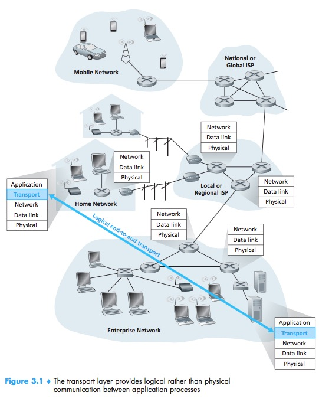

### 傳輸層與網路層的架構關聯與解耦 (Relationship Between Transport and Network Layers)
* **通訊粒度差異：** 網路層（如 IP 協定）提供的是*主機到主機（Host-to-Host）*的邏輯通訊；而傳輸層則是將此服務延伸，達成更細粒度的*行程到行程（Process-to-Process）*邏輯通訊。
    * **一個有用的比喻是：**
        * 應用程式訊息：信件
        * 進程：表兄弟姊妹（cousins）
        * 主機（端系統）：房子
        * 傳輸層協定：家中負責收發信件的安妮和比爾（他們負責將信件發給正確的人）
        * 網路層協定：郵政服務（將信件從一棟房子送到另一棟房子）
  * 傳輸協定即使在底層網路協定不可靠（即可能丟失、損壞或複製封包）的情況下，也能提供可靠的資料傳輸服務。這表示傳輸層可以為應用程式提供比網路層更強大的服務保證。

* **受限於底層服務模型：** 傳輸層能提供的服務範圍受限於底層網路層的服務模型。例如，若網路層協定無法保證封包的頻寬或最大延遲時間，傳輸層便無法為應用程式提供頻寬與延遲的保證。
* **突破底層限制的附加價值：** 儘管受限於網路層，傳輸層仍可透過演算法提供底層缺乏的服務。例如，即使底層的 IP 網路是會遺失、竄改或重複封包的*不可靠*網路，傳輸層仍可建構出*可靠的資料傳輸（Reliable Data Transfer）*機制，或是透過加密來確保通訊機密性。

### 網際網路中的傳輸層協定總覽 (Overview of the Transport Layer in the Internet)
  
* **封包命名標準：** 在網際網路標準中，傳輸層的封包統稱為*區段（Segment）*；而網路層的封包則稱為*資料報（Datagram）*。
* **基礎服務延伸：** 網際網路的網路層 IP 協定提供的是不可靠的*盡力而為傳送服務（Best-effort delivery service）*。所有的傳輸層協定（包含 UDP 與 TCP）最基礎的責任，就是將 IP 的主機到主機服務，擴展為行程到行程的交付服務（即傳輸層的*多工與解多工 (Multiplexing and Demultiplexing)*），並提供基本的資料完整性錯誤檢查。
* **UDP (User Datagram Protocol)：** 是一種提供無連線（Connectionless）且不可靠服務的輕量級協定。除了上述的多工/解多工與錯誤檢查外，它幾乎沒有對 IP 服務增加其他功能，也無法保證資料是否完整送達。
* **TCP (Transmission Control Protocol)：** 是一種提供連線導向（Connection-oriented）且可靠資料傳輸服務的複雜協定。TCP 藉由*流量控制（Flow control）*、*序號（Sequence numbers）*、*確認機制（Acknowledgments）*與*計時器（Timers）*等技術，確保資料正確且依序抵達。此外，TCP 還提供*壅塞控制（Congestion control）*，主動調節傳送端的速率以避免癱瘓整體網路鏈路，這是為了網際網路整體穩定性而設計的關鍵保護機制。

## 3.2 Multiplexing and Demultiplexing

1. 傳輸層的多工與解多工核心概念 (Multiplexing and Demultiplexing)
    * 通訊粒度的延伸： 網路層（IP）僅提供「主機到主機（Host-to-Host）」的傳輸服務，而傳輸層的核心職責是透過多工與解多工機制，將此服務延伸至「行程到行程（Process-to-Process）」的邏輯通訊。
    * Socket 介面設計： 傳輸層並不會將資料直接交給應用程式行程，而是傳遞給中介的 Socket（通訊端點）。由於一台主機可能同時運行多個網路應用程式，系統會為每個 Socket 分配一個獨一無二的識別碼。
    * 多工 (Multiplexing) 與解多工 (Demultiplexing) 定義：
        * 多工： 在發送端，傳輸層從不同的 Socket 收集資料區塊，並為每個區塊封裝上包含來源與目的埠號（Port number）的標頭資訊，生成傳輸層區段（Segment）後交給網路層。
        * 解多工： 在接收端，傳輸層檢查進入區段的標頭欄位（特別是目的埠號），並將該區段精準導向至對應的 Socket。

        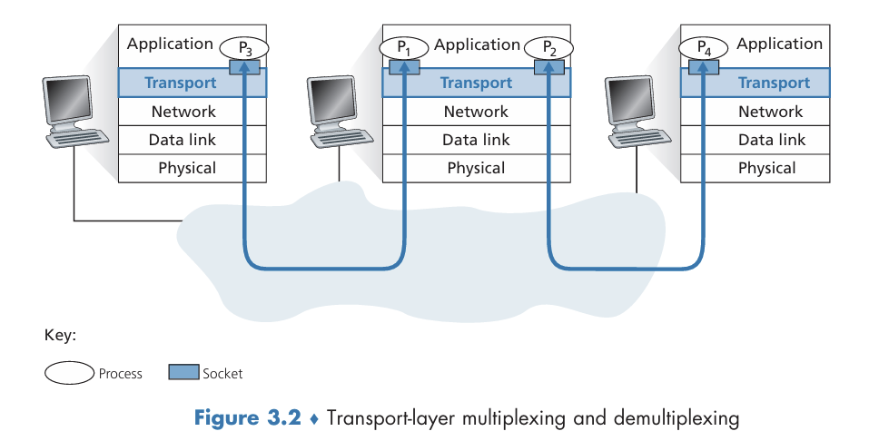

    * 埠號分配 (Port Numbers)： 埠號為一個 16 位元的數值（範圍 0 到 65535）。其中 0 到 1023 被定義為「周知埠號（Well-known port numbers）」，嚴格保留給 HTTP (80) 或 FTP (21) 等標準應用層協定使用。
    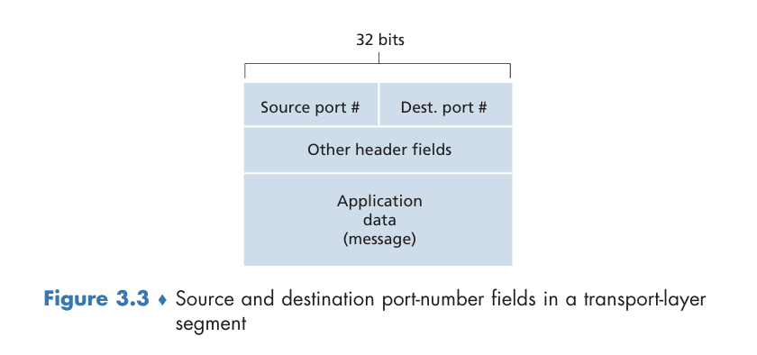

2. 無連線的多工與解多工 (Connectionless Multiplexing and Demultiplexing with UDP)
    * 二元組 (Two-Tuple) 識別機制： UDP Socket 是透過一個二元組來完全識別，即「目的 IP 位址」與「目的埠號」。
    * 資源共用特性： 只要兩個 UDP 區段擁有「相同的目的 IP 與目的埠號」，即使它們來自不同的來源主機或來源埠號，作業系統的傳輸層都會將這兩個封包導向（解多工）到接收端的同一個 Socket 與行程中。
    * 來源埠號的用途： UDP 區段標頭中的來源埠號主要作為「回郵地址（Return address）」使用。當伺服器需要回覆訊息給客戶端時，會從接收到的區段中提取該來源埠號，並將其設定為回覆區段的目的地埠號。
        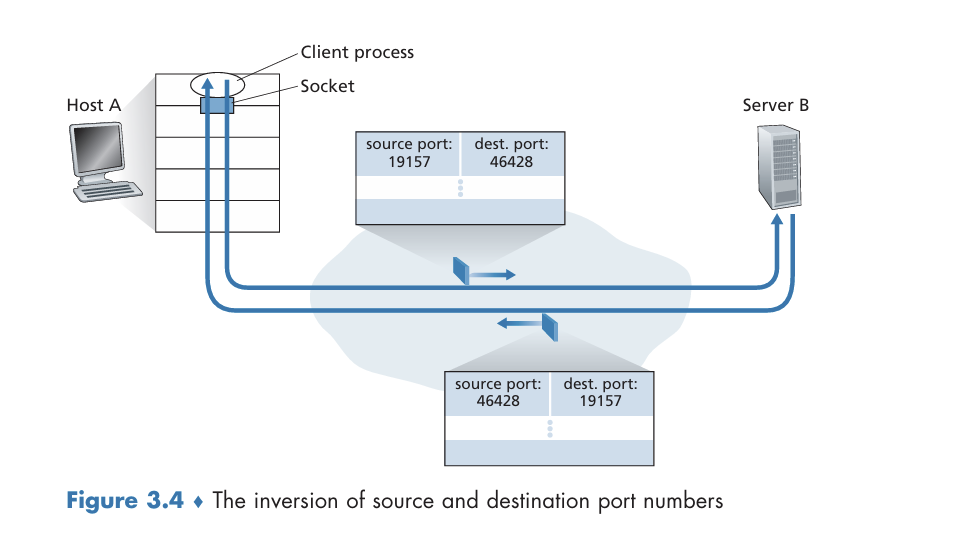

3. 連線導向的多工與解多工 (Connection-Oriented Multiplexing and Demultiplexing with TCP)
    * 四元組 (Four-Tuple) 識別機制： 與 UDP 截然不同，TCP Socket 必須透過四元組來進行精確識別，包含：*來源 IP 位址*、*來源埠號*、*目的 IP 位址*與*目的埠號*。
    * 獨立的連線 Socket： 當兩個具有不同來源 IP 或來源埠號的 TCP 區段抵達時，即使目的 IP 與目的埠號完全相同，接收端作業系統也會將它們解多工到*兩個完全不同*的 Socket 中（除了初始的連線建立請求之外）。
    * 三方交握與連線分流設計：
        * TCP 伺服器會開啟一個*歡迎 Socket (Welcoming socket)*，專門監聽特定埠號（如 12000）上的連線請求 (SYN 區段)。
        * 當作業系統收到 SYN 請求時，會動態建立一個*全新的連線 Socket (Connection socket)*專門服務該特定客戶端。
        * 後續該連線的資料傳輸都會基於完整的四元組，被精確解多工至這個專屬的連線 Socket 中。
        
        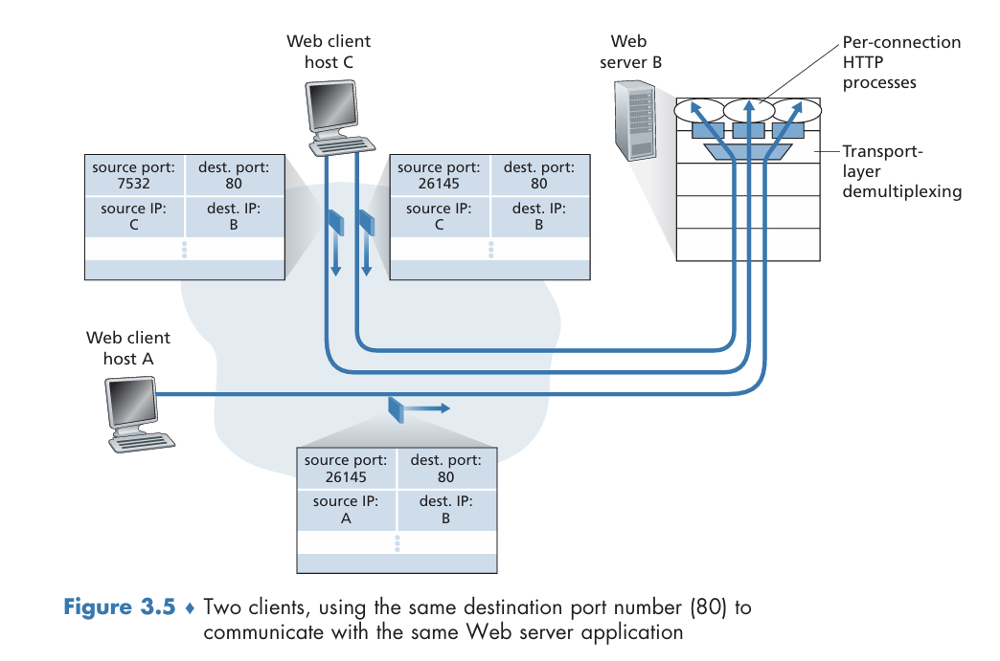

>圖 3.5 說明了以下情況：主機 C 向伺服器 B 發起了兩個 HTTP 連線，而主機 A 則向 B 發起了一個 HTTP 連線。主機 A、主機 C 和伺服器 B 各自擁有唯一的 IP 位址，分別表示為 A、C 和 B。主機 C 為其兩個 HTTP 連線指派了兩個不同的來源埠號（26145 和 7532）。由於主機 A 選擇來源埠號的過程與 C 是各自獨立的，它也可能會為其 HTTP 連線指派 26145 這個來源埠號。但這並不會造成問題，伺服器 B 仍然能夠正確區分 (demultiplex) 這兩個來源埠號相同的連線，因為這兩個連線擁有不同的來源 IP 位址。

4. 網頁伺服器與 TCP (Web Servers and TCP)
    * 多工與系統架構實務： 當大型網頁伺服器（如 Apache）在 Port 80 提供服務時，所有客戶端的 HTTP 請求皆會送往目的埠號 80。伺服器透過來源 IP 與來源埠號的差異，來區分並解多工來自數以萬計不同客戶端的連線。
    * 行程與執行緒 (Processes and Threads) 的最佳化： 現代高效能 Web 伺服器通常不再為每一個連線產生一個沉重的獨立行程（Process），而是採用單一核心行程，並為每個新的連線 Socket 建立輕量級的執行緒（Thread），大幅提升系統並發處理能力。
    * 連線生命週期對效能的衝擊： 若應用程式採用非持續性 HTTP (Non-persistent HTTP)，代表每一個請求與回覆都必須建立並關閉一個新的 TCP 連線與 Socket。這種頻繁的 Socket 創建與銷毀動作，會對高負載的網頁伺服器帶來極大的運算與記憶體開銷 (Overhead)。

5. **廣泛應用**
    * 多工和解多工的概念不僅限於網際網路的傳輸協定。在任何一層，當一個單一協定被其上一層的多個協定使用時，都需要考慮多工和解多工。

總結來說，多工與解多工是傳輸層的基礎服務，它精巧地將底層網路的主機間通訊能力，提升為應用程式行程間的精確通訊。UDP 和 TCP 在此基礎上，根據自身服務模型的不同，採用了相應的機制來實現這一功能，這正是網路設計的精妙之處。

## 3.3 Connectionless Transport: UDP

### UDP (Connectionless Transport: UDP) 

* **極簡的傳輸層協定抽象化**： UDP 被設計為一個最基礎、不加修飾的傳輸協定。除了最核心的多工與解多工（Multiplexing / Demultiplexing）功能以及輕量級的錯誤檢查外，它並未對底層的 IP 協定增加其他功能。當應用程式選擇使用 UDP 時，其實際運作幾乎等同於直接與網路層的 IP 進行通訊。

* **無連線 (Connectionless) 本質**： 在發送資料區段（Segment）之前，發送端與接收端的傳輸層實體之間不需要進行任何邏輯交握（Handshaking）程序，這正是其被稱為無連線傳輸的原因。例如，DNS 協定在查詢時，會直接將訊息交由 UDP 打包並傳遞給網路層，不需事先與目標伺服器建立連線。

* **UDP 的四大系統層面優勢：**
  * **更精細的應用層傳輸控制：** UDP 一旦接收到應用程式的資料，就會立刻封裝並送往網路層，完全不受 TCP 壅塞控制（Congestion Control）機制的速率限制，也不會為了等待 ACK 而延遲後續的傳輸。這對容忍少量掉包但要求嚴格延遲控制與穩定傳送速率的即時多媒體應用非常關鍵。
  * **消除連線建立延遲 (No connection establishment)：** UDP 不需要像 TCP 那樣耗費額外的往返時間（RTT）來進行三方交握。這不僅是 DNS 偏好 UDP 的原因，也是現代 HTTP/3 採用基於 UDP 的 QUIC 協定來縮短網頁載入延遲的核心考量。

  * **無連線狀態負擔 (No connection state)：** TCP 必須在端系統中維護接收與發送緩衝區、壅塞控制參數以及序號等複雜的狀態變數，而 UDP 則完全不需要。在相同的伺服器硬體資源下，基於 UDP 的應用伺服器能同時支援更大量的活躍客戶端連線。

  * **極小的封包標頭開銷 (Small packet header overhead)：** TCP 每個區段至少需要 20 位元組的標頭開銷，而 UDP 僅需 8 位元組，大幅提升了頻寬使用效率。

* **缺乏壅塞控制的網路風險：** 由於 UDP 不會主動降速，若網路上充斥大量無節制的高頻寬 UDP 視訊串流流量，將導致路由器緩衝區嚴重溢位，並進一步排擠那些會自動降速的合法 TCP 流量，造成嚴重的網路效能崩潰。

* **於應用層實作可靠性：** 透過 UDP 也能達成可靠資料傳輸，但架構師必須將確認與重傳機制建立在「應用程式本身」（例如 HTTP/3 的 QUIC 協定），藉此在不受 TCP 壅塞控制框架限制下，精準掌握資料傳送狀態。

### UDP 區段結構 (UDP Segment Structure)

根據 RFC 768，UDP 的標頭極其精簡，僅包含四個欄位，每個欄位長度為 2 位元組（共 8 位元組）：

* **來源埠號 (Source port #)：** 用於回傳位址。
* **目的埠號 (Dest port #)：** 用於解多工，將數據交給正確的應用程序。
* **長度 (Length)：** 指定整個 UDP 段（標頭加數據）的位元組數。
* **核對和 (Checksum)：** 用於檢測段在傳輸過程中是否產生位元錯誤。

### UDP 核對和 (Checksum) 與端對端原則

* **錯誤偵測機制：** 檢查碼的核心功能是偵測 UDP 區段在從來源端到目的端的完整傳輸路徑中，位元是否遭到意外竄改（例如受到鏈路雜訊干擾或在路由器記憶體暫存時發生錯誤）。
* **底層運算原理：** 發送端會將區段中所有 16 位元的字組（Words）進行相加，並將運算過程中產生的溢位（Overflow）進行環繞進位處理（Wrapped around），最後將此總和取「一補數（1s complement）」並填入檢查碼欄位。接收端收到後，會將所有 16 位元字組（包含檢查碼）相加；若傳輸無誤，加總結果必須為全 1（即 1111111111111111）。若有任何位元為 0，則代表資料已受損。
* **端到端原則 (End-End Principle) 的體現：** 雖然許多底層的資料鏈結層協定（如 Ethernet）已具備 CRC 錯誤檢查能力，但在跨網際網路傳輸時，無法保證路徑上的「所有」鏈路都提供錯誤檢查，且封包在路由器內部處理時也可能損壞。基於系統設計的著名「端到端原則」，如果要在端點間提供正確的資料傳輸服務，傳輸層就必須自行實作端到端的錯誤偵測。
* **無錯誤恢復能力：** UDP 的設計哲學僅提供錯誤「偵測」，並不具備錯誤「恢復」能力。當遇到受損的 UDP 區段時，多數的 UDP 網路堆疊實作會直接將該封包丟棄；少部分實作則會在產生警告的同時，將受損資料硬性傳遞給應用程式處理。

## 可靠數據傳輸原理 (Principles of Reliable Data Transfer)

可靠資料傳輸的原理 (Principles of Reliable Data Transfer)是整個計算機網路架構中最核心的基石之一。在系統設計中，底層網路（如 IP 層）往往是不可靠的，因此傳輸層必須透過各種協定機制來確保資料不遺失、不損壞且依序抵達。

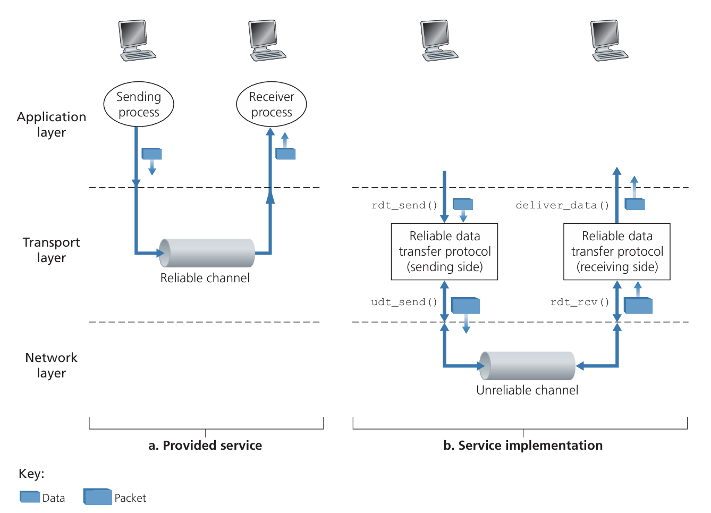

上圖是探討可靠資料傳輸協定（如 TCP）核心設計的基礎框架。該圖明確對比了「上層應用程式所看到的抽象服務」與「底層實際運作的系統實作」之間的差異與互動關係。

* **服務模型抽象化 (Service Model)**
    * 圖的左半部展示了提供給上層實體（如應用程式層）的服務抽象概念。
    * 從上層應用程式的視角來看，資料是透過一條**「完全可靠的通道 (Reliable channel)」**進行傳輸。
    * 在這種理想的服務模型中，傳輸的資料位元不會發生損壞（例如 0 變成 1，或反之）、不會遺失，且所有資料都會嚴格依照發送的順序送達接收端。這正是 TCP 協定提供給網際網路應用程式的標準服務模型。

* **服務實作挑戰 (Service Implementation)**
    * 圖的右半部揭示了系統底層的真實狀況：可靠資料傳輸協定（Reliable data transfer protocol, 簡稱 rdt）實際上是建構在一個**不可靠的通道 (Unreliable channel)**之上（例如網路層的 IP 協定）。
    * 網路架構師與協定設計者的核心任務，就是設計出能夠在這個會遺失、損壞封包的不可靠底層上，實現上述完美可靠抽象服務的傳輸層協定。

* **系統介面與函式呼叫邏輯 (Interfaces and Function Calls)**
    * 圖 3.8(b) 詳細定義了資料傳輸協定與其上下層之間的 API（應用程式介面）呼叫機制：
        * **`rdt_send()`：** 當上層發送端應用程式需要傳送資料時，會由上而下呼叫此函式，將資料交給可靠資料傳輸協定（rdt）處理。
        * **`udt_send()`：** 這是 rdt 協定用來將封包送入底層不可靠通道的函式（udt 代表 unreliable data transfer）。在傳送端與接收端的 rdt 都會透過此函式將封包發送給對方。
        * **`rdt_rcv()`：** 當底層不可靠通道有封包抵達時，會觸發此函式，將封包交由接收端（或發送端）的 rdt 協定進行處理與狀態檢查。
        * **`deliver_data()`：** 當接收端的 rdt 協定確認資料正確且依序無誤後，會呼叫此函式，將最終正確的資料向上層應用程式遞交。

* **單向資料傳輸與雙向控制 (Unidirectional Data with Bidirectional Control)**
    * 該圖主要針對「單向資料傳輸 (Unidirectional data transfer)」進行探討（即應用層資料僅從發送端流向接收端）。
    * 但在架構實作上，為了確保可靠性，發送端與接收端的協定仍必須在雙向通道上交換封包。例如，接收端必須透過 `udt_send()` 回傳確認訊息（ACK 或 NAK 等控制封包）給發送端，以便發送端掌握資料的傳送狀態。

### 建構可靠的資料傳輸協定 (Building a Reliable Data Transfer Protocol)

本節透過有限狀態機（FSM）的演進，逐步推導演算法的設計，從完美網路到充滿缺陷的真實網路環境：

* **rdt1.0（完美可靠通道）：** 假設底層通道完全不會遺失封包或發生位元錯誤，傳送端與接收端的 FSM 非常單純，只需直接發送與接收資料，不需任何回饋機制。
  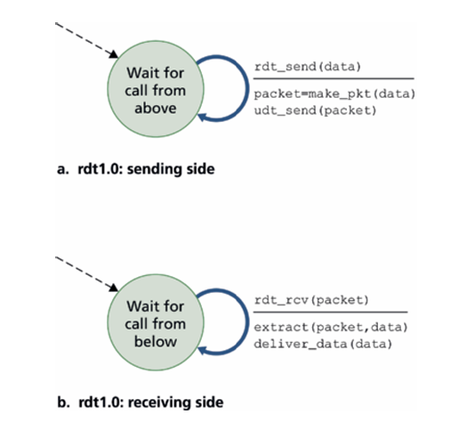
* **rdt2.0（具備位元錯誤的通道）：** 在真實環境中，封包可能在實體傳輸中發生位元翻轉，因此引入了 ARQ (Automatic Repeat reQuest) 機制。架構中增加了三個關鍵能力：第一是*錯誤偵測（Error detection）*，利用 Checksum 確認封包是否損壞；第二是*接收端回饋（Receiver feedback）*，接收端會回傳肯定確認（ACK）或否定確認（NAK）；第三是*重傳（Retransmission）*，若收到 NAK 則傳送端重傳該封包。此為一種*停等式（Stop-and-wait）*協定。然而其致命缺陷為：若 ACK 或 NAK 本身在傳輸中損壞，傳送端將無法得知接收端狀態。
  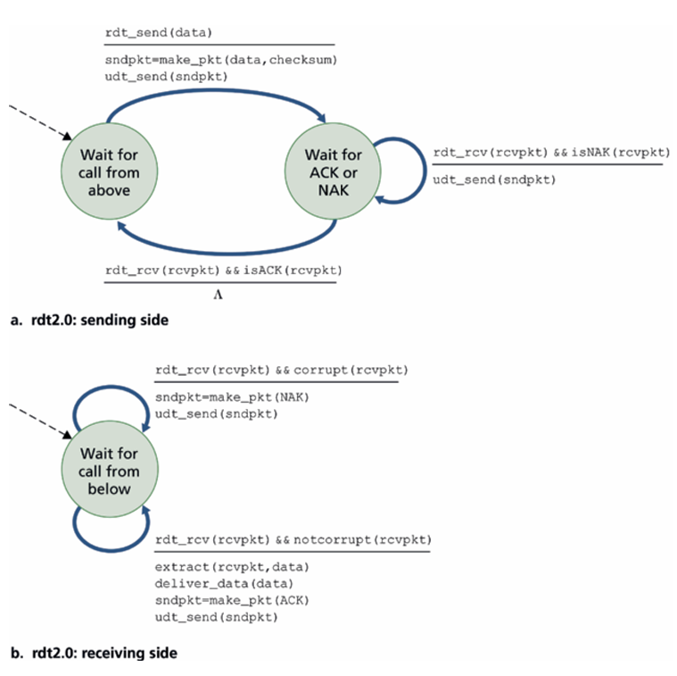
* **rdt2.1 與 rdt2.2（解決回饋損壞問題）：** 為了解決 ACK/NAK 損壞導致的重複傳送問題，rdt2.1 在封包中加入了 1 位元的「序號（Sequence number）」（0 或 1），讓接收端能分辨抵達的是新封包還是重傳封包。而 rdt2.2 則進一步優化，成為*無 NAK (NAK-free)*協定；接收端只發送 ACK，並在 ACK 中夾帶最後一次正確接收的封包序號，若傳送端收到重複的 ACK (Duplicate ACK)，其意義等同於 NAK，便觸發重傳。
  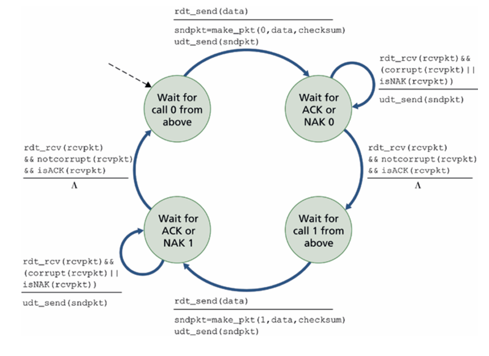
  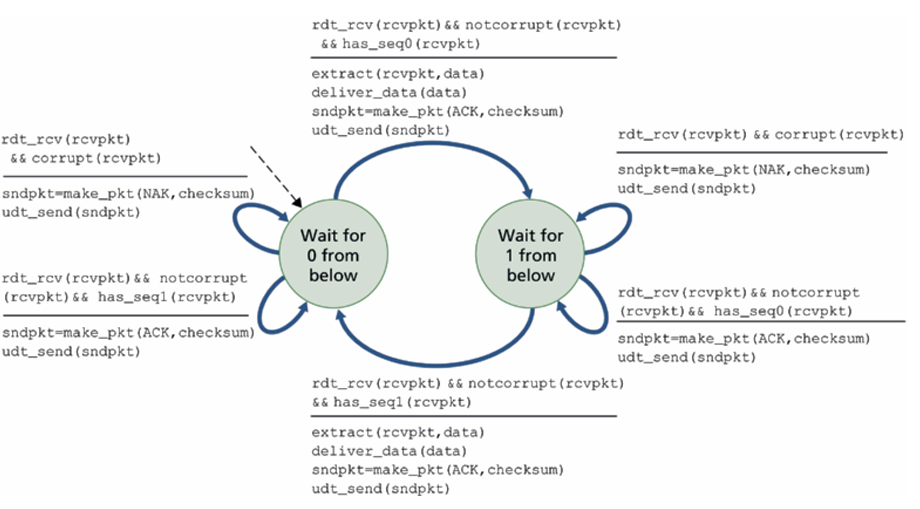
  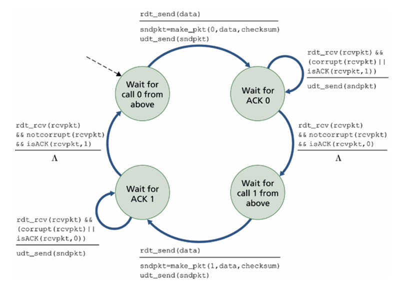
  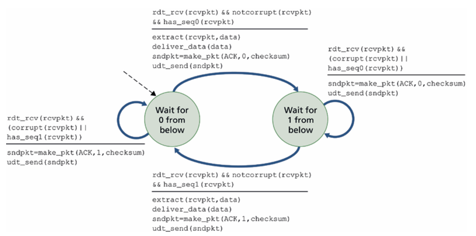
* **rdt3.0（具備錯誤與遺失的通道）：** 又稱為*交替位元協定 (Alternating-bit protocol)*。當通道可能完全*遺失*封包時，僅靠 ACK 已不足夠。架構上引入了*倒數計時器 (Countdown timer)*；傳送端在發送封包後啟動計時器，若在合理的回返時間（RTT）內未收到 ACK 而發生逾時（Timeout），傳送端會假定封包或 ACK 已遺失並主動重傳。
  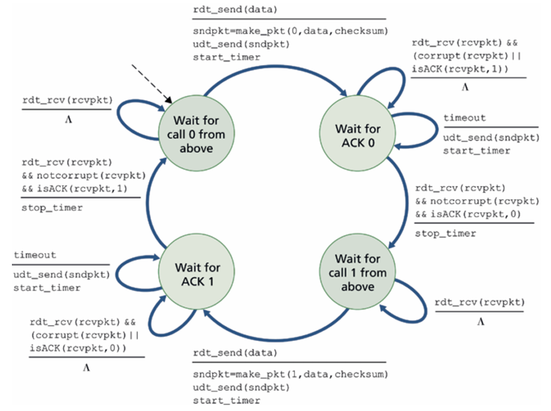
  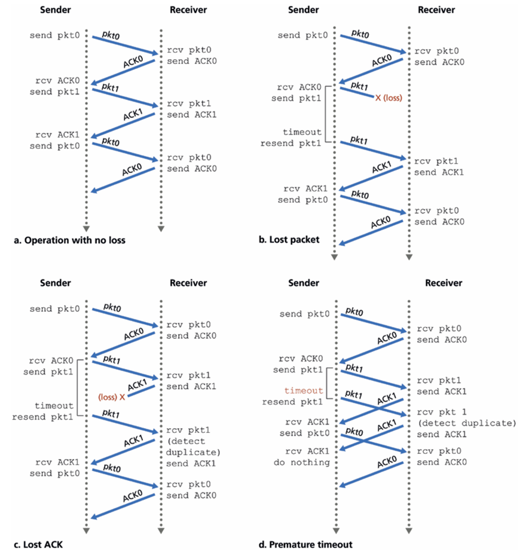

### 管線化可靠資料傳輸協定 (Pipelined Reliable Data Transfer Protocols)

* **停等式協定的效能瓶頸：** rdt3.0 雖然在邏輯上正確，但在現代高速網路上效能極差。以 1 Gbps 的跨國鏈路為例，因為傳送端每次只能送出一個封包並等待 ACK，其通道使用率（Utilization）可能慘跌至 0.027%。
  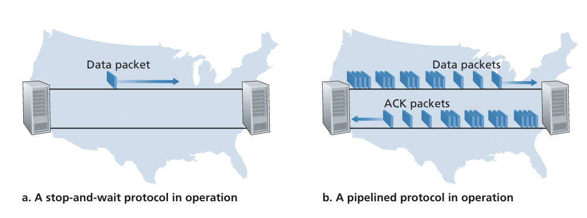

* **管線化 (Pipelining) 設計：** 架構師的解決方案是放棄停等式，允許傳送端在未收到 ACK 的情況下，連續發送多個封包來「填滿管線」。這使得傳送端與接收端必須具備更大的緩衝區 (Buffer) 來儲存傳輸中或亂序的封包，並擴增序號空間。後續衍生出兩種主要的管線化錯誤復原策略：Go-Back-N 與 Selective Repeat。
  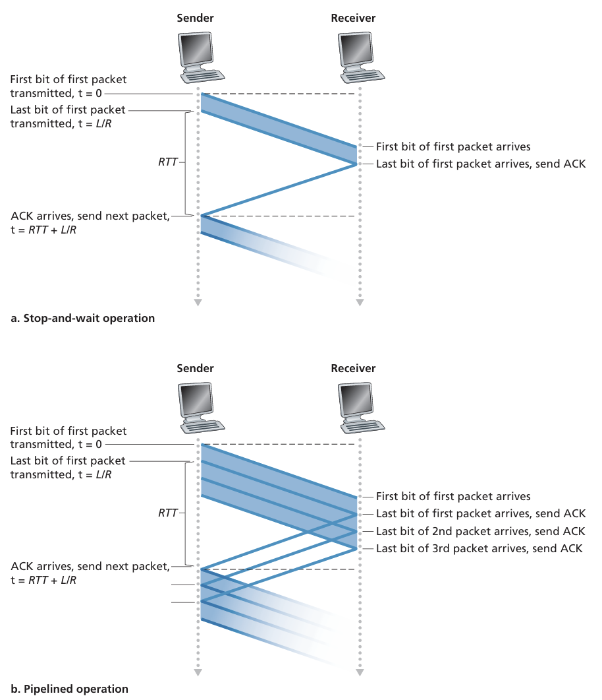

##### 範例

情境設定：橫跨美國東西岸的網路連線

* **實體距離與延遲：** 假設兩台主機分別位於美國西岸與東岸，其光速往返傳播延遲 (Round-Trip Time, RTT) 約為 30 毫秒 (msec)。
* **鏈路頻寬 ($R$)：** 兩地之間具備 1 Gbps ($10^9$ bps) 的高速傳輸能力。
* **封包大小 ($L$)：** 每個傳輸層封包大小為 1,000 bytes (包含標頭與資料，共計 8,000 bits)。

1. 未使用管線化：停等式協定 (Stop-and-Wait) 的效能災難
    * **傳輸時間計算：** 傳送端將單一封包完整推入鏈路所需的傳輸時間為 $d_{trans} = L / R = 8,000 \text{ bits} / 10^9 \text{ bps} = 8 \text{ 微秒 (microseconds)}$，也就是 0.008 毫秒。
    * **單次確認時間：** 傳送端從 $t=0$ 開始發送封包，到接收端將該封包的 ACK 送回傳送端，總共需要 $RTT + L/R = 30.008 \text{ 毫秒}$。
    * **系統使用率 (Utilization) 瓶頸：** 在這 30.008 毫秒的週期內，傳送端僅花了 0.008 毫秒在*真正傳送*資料。這導致傳送端（或通道）的使用率極低：$U_{sender} = 0.008 / 30.008 = 0.00027$。
    * **架構師視角分析：** 這意味著傳送端只有 0.027% 的時間處於忙碌狀態。即使網管人員花費鉅資建置了 1 Gbps 的高速實體鏈路，其實際有效的吞吐量 (Throughput) 卻僅剩 267 kbps。這是一個生動的例子，說明網路協定的設計缺陷會嚴重限制底層硬體應有的效能。

2. 採用管線化技術 (Pipelining) 的效能突破
    * **核心機制：** 解決此效能瓶頸的方案非常直接：允許傳送端在*尚未收到確認 (ACK)*的情況下，連續發送多個封包。
    * **效能提升：** 以前述範例為基礎，若系統允許傳送端在等待 ACK 的期間連續發送 3 個封包，則系統的使用率將直接提升為原來的三倍。由於大量傳送中 (in-transit) 但尚未被確認的封包就像是填滿了整個傳輸通道，因此這種技術在計算機科學中被稱為「管線化 (Pipelining)」。

3. 管線化設計對系統架構的額外要求
    雖然管線化完美解決了通道閒置的問題，但也對傳輸層的實作提出了三項新的系統需求：
    1. **擴充序號空間 (Sequence Numbers)：** 由於管線中會同時存在多個未確認的封包，每個傳送中的封包都必須擁有獨一無二的序號以供辨識，因此必須增加序號的範圍。
    2. **兩端點的緩衝區 (Buffering) 擴建：** 傳送端必須配備足夠的記憶體緩衝區，以保留所有「已送出但尚未被確認」的封包，以備後續可能的重傳；接收端也可能需要緩衝「提早抵達但失序 (Out-of-order)」的封包。
    3. **錯誤復原策略 (Error Recovery)：** 針對管線中封包遺失或損壞的處理，管線化架構衍生出兩種主要的錯誤復原演算法，即*選擇退後 N (Go-Back-N, GBN)*與*選擇性重傳 (Selective Repeat, SR)*。

### 選擇退後 N (Go-Back-N, GBN)

* **滑動視窗 (Sliding-window) 架構：** 傳送端最多允許 $N$ 個已傳送但未被確認的封包存在於管線中，$N$ 即為視窗大小。
* **累積確認 (Cumulative Acknowledgment)：** 接收端發出的 ACK $n$ 代表「序號 $n$ (含) 以前的所有封包」皆已正確且依序接收。
* **無亂序緩衝 (No out-of-order buffering)：** 在 GBN 的標準設計中，接收端會直接丟棄所有失序抵達的封包，並對最後一個按序送達的封包重發 ACK。
* **逾時重傳邏輯：** 傳送端僅為最舊的未確認封包維護一個計時器。一旦發生逾時，傳送端必須*退回 N 步 (Go-Back-N)*，將視窗內所有已發送但未確認的封包全部重新傳送一次。

總結

* **滑動視窗 (Sliding Window)：** 限制未確認封包的最大數量為 N。
* **累積確認 (Cumulative ACK)：** ACK n 表示序號 n 及之前的封包皆已正確收到。
* **單一計時器：** 僅為最早的未確認封包設置計時器。一旦超時，重傳視窗內「所有」已發送但未確認的封包。
* **接收方策略：** 丟棄所有失序封包，以保持接收端緩衝的簡潔性。

### 選擇性重傳 (Selective Repeat, SR)

* **解決 GBN 的效能浪費：** 當視窗 $N$ 與頻寬延遲乘積（Bandwidth-delay product）很大時，GBN 只要遺失一個封包就會導致大量後續封包被無辜重傳。SR 協定的設計目標在於*僅重傳疑似遺失或損壞的封包*。
* **獨立確認與緩衝機制：** SR 接收端會個別對每一個正確接收的封包發送獨立的 ACK，並且會使用緩衝區將*失序（Out-of-order）*抵達的封包暫存起來，直到遺失的封包補齊後，才整批依序交給上層應用程式。
* **邏輯計時器：** 傳送端必須為每一個未確認的封包維護一個獨立的邏輯計時器，逾時發生時只重傳該特定封包。
* **序號空間的安全性設計：** 在 SR 協定中，由於傳送端與接收端的視窗狀態可能不一致，如果封包序號空間太小，接收端可能會將重傳的舊封包誤認為是新一輪的新封包。此外，為了防止網路上過期滯留的封包造成錯亂，架構上需假設封包在網路中有最大存活時間。

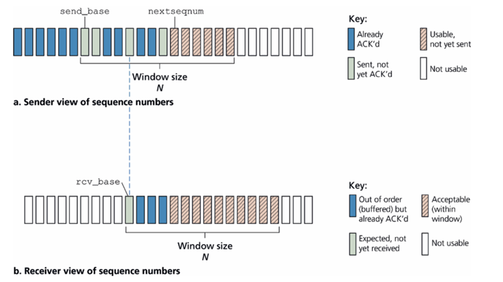

上圖是理解 SR (Selective Repeat) 協定底層緩衝區管理與狀態機運作的關鍵圖解。這張圖表的核心目的，在於具象化**獨立確認機制 (Individual Acknowledgment)**如何導致傳送端與接收端的狀態不一致，以及雙方視窗 (Window) 內部的封包狀態劃分。

* **傳送端視角 (Sender View of Sequence Numbers)**
    * **視窗架構：** 傳送端維護一個大小為 $N$ 的滑動視窗，由 `send_base`（最舊的未確認封包序號）與 `nextseqnum`（下一個要傳送的新封包序號）兩個指標來界定範圍。
    * **四種封包狀態交錯：** 在傳送端的序號空間中，封包被分為四種狀態：
        1. **已確認 (Already ACK'd)：** 包含視窗之前的封包，以及**視窗內部**已收到獨立 ACK 的封包。
        2. **已送出但未確認 (Sent, not yet ACK'd)：** 正在網路管線中傳輸，或是 ACK 在回傳途中遺失的封包。
        3. **可用但未送出 (Usable, not yet sent)：** 落在視窗範圍內，隨時可以配置給應用層資料傳送的空閒序號。
        4. **不可用 (Not usable)：** 落在視窗之外的序號，必須等待 `send_base` 向前滑動後才能使用。
    * **洞察：** 與 GBN (Go-Back-N) 協定最大的不同在於，SR 傳送端的視窗內允許存在*已確認*與*未確認*狀態交錯的碎片化情形（圖中深藍色與淺綠色區塊交錯），這正是因為 SR 針對單一封包進行確認，而非累積確認。

* **接收端視角 (Receiver View of Sequence Numbers)**
    * **視窗架構：** 接收端同樣維護一個大小為 $N$ 的視窗，起始指標為 `rcv_base`（預期收到但尚未收到的最舊封包序號）。
    * **四種封包狀態劃分：** 
        1. **預期但尚未收到 (Expected, not yet received)：** 包含 `rcv_base` 所指的封包，這是阻礙接收端視窗向前滑動的瓶頸。
        2. **失序已暫存且已發送 ACK (Out of order (buffered) but already ACK'd)：** 正確送達但序號超前的封包。接收端必須分配記憶體將其暫存，並回傳獨立 ACK。
        3. **可接受範圍內 (Acceptable, within window)：** 視窗內尚未收到的序號，若有封包抵達即可接收。
        4. **不可用 (Not usable)：** 落在視窗之外，代表接收端目前無法處理該範圍的序號。
    * **洞察：** 此視角完美展示了 SR 接收端的「失序緩衝 (Out-of-order buffering)」機制。接收端會將失序抵達的封包（圖中深藍色區塊）暫存起來，直到補齊遺失的 `rcv_base` 封包後，才會將整批資料依序向上層應用程式遞交並滑動視窗。

* **雙端狀態的非同步性 (Asymmetry of Views)**
    * 圖表上下對比呈現了一個重要的網路分散式系統難題：**傳送端與接收端對「哪些封包已正確接收」的認知並不完全一致**。
    * 這是因為控制封包 (ACKs) 在從接收端傳遞回傳送端的過程中會有網路延遲或遺失。因此，接收端視窗的 `rcv_base` 通常會超前或等於傳送端的 `send_base`，雙方的滑動視窗無法在同一時間點完全重疊 (Coincide)。

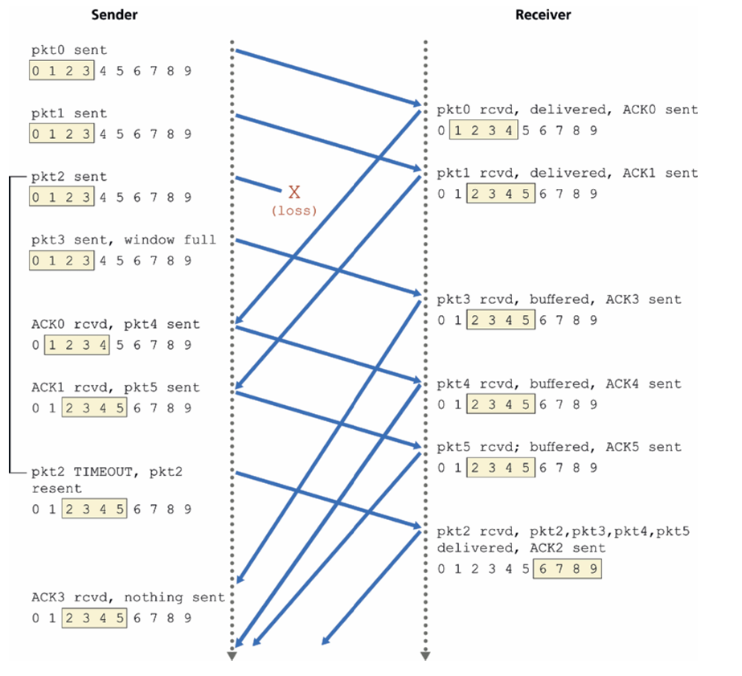

總結

* **精準重傳：** 發送方僅重傳那些被懷疑出錯（丟失或損壞）的封包。
* **獨立確認：** 接收方對每個正確收到的封包發送個別確認，無論其是否按序到達。
* **亂序緩衝：** 接收方會暫存失序封包，直到缺失的封包補齊後再一併交付上層。
* **重要限制：** 視窗大小 (N) 必須小於或等於序號空間大小的一半，否則接收方無法分辨是「新封包」還是「舊封包的重傳」。

### 架構啟示

| 機制 | 目的與功能 |
| :--- | :--- |
| **校驗和 (Checksum)** | 檢測封包中的位元錯誤。 |
| **定時器 (Timer)** | 用於檢測丟包並觸發重傳。 |
| **序號 (Sequence Number)** | 識別封包順序、檢測丟包與處理重複封包。 |
| **確認 (Acknowledgment)** | 回傳傳輸成功的訊號（累積或獨立確認）。 |
| **視窗/流水線 (Window/Pipelining)** | 提升網路吞吐量，受流控或擁塞控制限制。 |

從底層邏輯看，TCP 實際上是 GBN 與 SR 的混合體，結合了累積確認與亂序緩衝的優點。

## 連線導向的傳輸：TCP (Connection-Oriented Transport: TCP)

### TCP 連線 (The TCP Connection)

* **邏輯連線與狀態維持：** TCP 是一種連線導向 (Connection-oriented) 協定，在傳輸資料前，雙方應用程式必須先透過「三方交握 (Three-way handshake)」建立連線參數。此連線是*邏輯上*的，連線狀態（如緩衝區、變數等）僅存在於端系統 (End systems) 之中，中間的路由器對此毫無所知。
* **全雙工與點對點傳輸：** TCP 連線提供全雙工 (Full-duplex) 服務，允許資料同時雙向傳輸，且限制為點對點 (Point-to-point) 通訊，不支援多點廣播 (Multicasting)。
* **MSS 與 MTU 的關係：** TCP 會從發送緩衝區提取資料並封裝成區段。最大區段大小 (Maximum Segment Size, MSS) 是根據底層資料鏈結層的最大傳輸單元 (Maximum Transmission Unit, MTU) 來決定的，以確保封裝 IP 標頭與 TCP 標頭後，不會超過單一乙太網路訊框的限制。

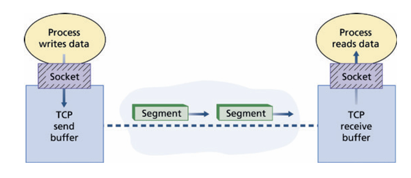

* 此圖呈現了 TCP 連線的底層記憶體管理機制。展示了應用程式如何將資料寫入發送端的*TCP 傳送緩衝區 (Send buffer)*，隨後 TCP 提取資料封裝成區段 (Segment) 送入網路。
* 在接收端，區段抵達後資料被存入*TCP 接收緩衝區 (Receive buffer)*，等待接收端應用程式讀取。

### TCP 區段結構 (TCP Segment Structure)
* **標頭與負載：** TCP 區段由標頭與資料負載組成。標準標頭大小為 20 Bytes。欄位包含來源/目的埠號 (Port number)、序號 (Sequence number)、確認號 (Acknowledgment number)、接收視窗 (Receive window，用於流量控制)、標頭長度與選項等。
* **控制旗標 (Flag Bits)：** 包含 6 個關鍵位元：ACK（確認號有效）、RST/SYN/FIN（連線建立與拆除）、PSH（立即推播資料給上層）、URG（緊急資料）。
* **位元流序號 (Byte-Stream Sequence Numbers)：** 架構師必須理解，TCP 的序號並非計算*封包的數量*，而是計算*位元流 (Byte stream 中該資料的起始位元組編號*。
* **累積確認機制 (Cumulative Acknowledgments)：** 接收端回傳的確認號，代表*它正在等待接收的下一個位元組編號*，這意味著確認號之前的所有資料皆已正確且依序收到。

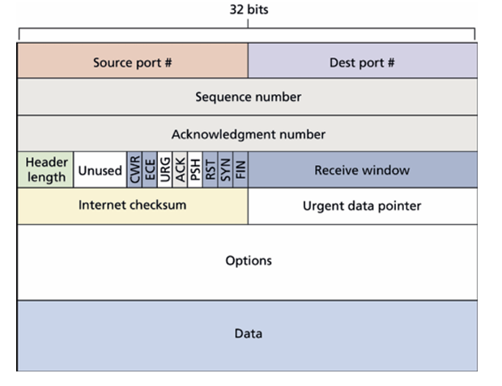

上圖清晰標示了 TCP 標頭中 32 bits 寬度的各個欄位配置，直觀展現了 TCP 比 UDP 多出的 12 Bytes 控制欄位（如序號、確認號、旗標與接收視窗等），這些是實現 TCP 可靠性與流量控制的基礎。

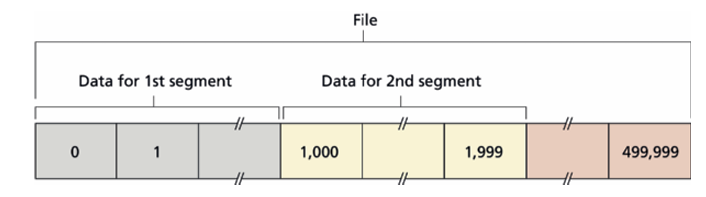

上圖中顯示一個 500000 bytes 大檔案如何被切割，假設 MSS 為 1,000 bytes。第一個區段的序號為 0，第二個為 1,000，第三個為 2,000，具象化了 TCP 序號是基於*位元組 (Bytes)*而非*封包數*的設計邏輯。

### 往返時間估計與逾時 (Round-Trip Time Estimation and Timeout)
* **動態 RTT 估計 (EstimatedRTT)：** 網路延遲是浮動的，TCP 利用指數加權移動平均 (Exponential Weighted Moving Average, EWMA) 來平滑化每一次測量到的 `SampleRTT`，計算出更穩定的 `EstimatedRTT`，公式通常為 `EstimatedRTT = 0.875 * EstimatedRTT + 0.125 * SampleRTT`。
* **RTT 變異值 (DevRTT)：** 為了應對網路抖動，TCP 額外計算 RTT 的變異程度。
* **決定逾時區間 (TimeoutInterval)：** 系統的重傳計時器設定值並非寫死，而是動態計算：`TimeoutInterval = EstimatedRTT + 4 * DevRTT`。發生逾時後，計時器區間會加倍 (Doubled)，以避免在網路壅塞時過早重傳而加劇壅塞。

> $EstimatedRTT = (1-\alpha) * EstimatedRTT + \alpha * SampleRTT$
> $\alpha = 0.125$

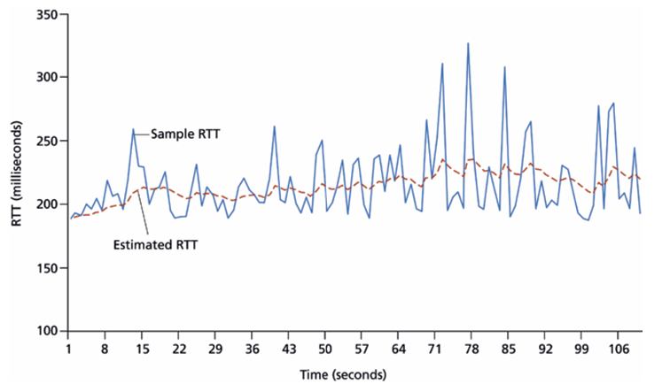

上圖主要展示了 TCP 協定如何透過數學演算法來平滑化網路延遲的波動，藉此計算出穩定的重傳計時器基準。

* **真實網路的延遲波動現象：** 圖中的藍色實線代表 `SampleRTT`（樣本往返時間）。這顯示了在真實的跨國網路連線中（圖中範例為從美國麻州 Amherst 連線至法國南部的伺服器），由於路由器緩衝區壅塞與端系統負載的動態變化，單一封包的實際往返時間會呈現劇烈的上下波動。
* **平滑化的估計指標：** 圖中的紅色虛線代表 `EstimatedRTT`（估計往返時間）。這條線明顯比實線平滑許多，其目的在於有效過濾掉網路中短暫、突發的延遲雜訊 (Noise)，為系統提供一個具備代表性的典型延遲指標。
* **系統設計的最終目的：** TCP 必須依賴這條平滑的 `EstimatedRTT` 虛線（並結合變異值 `DevRTT`）來動態推算 TCP 的*逾時區間 (TimeoutInterval)*。若計時器直接跟隨波動劇烈的 `SampleRTT` 設定，將導致逾時器過短（引發大量不必要的提早重傳）或過長（導致網路掉包時系統恢復極慢）。

底層演算法解析：

TCP 的 `EstimatedRTT` 是透過在統計學與工程界廣泛使用的**指數加權移動平均 (Exponential Weighted Moving Average, EWMA) 演算法**計算而來。其具體計算步驟與數學公式如下：

* **步驟一：採集樣本 (SampleRTT)**
　* TCP 會測量一個區段 (Segment) 從「送出（交給 IP 層）」到「接收到對應之 ACK」所經歷的時間，這個測量值即為 `SampleRTT`。
　* **防呆機制：** 為了避免判定模糊 (Ambiguity)，TCP 的實作規範中明確規定**絕對不對已經發生重傳的區段進行 `SampleRTT` 測量**，系統只採集一次性成功傳送的區段資料。
* **步驟二：套用 EWMA 公式進行更新**
　* 每當系統獲得一個新的 `SampleRTT` 樣本時，TCP 就會套用以下公式來更新整體的估計值：
        `EstimatedRTT = (1 - α) * EstimatedRTT + α * SampleRTT`
* **步驟三：權重參數 (α) 的設定標準**
　* 公式中的 `α` (Alpha) 決定了系統對「最新一次測量狀態」的敏感度。根據網際網路標準 (RFC 6298)，推薦的 `α` 預設值為 **0.125 (即 1/8)**。
　* 因此，上圖實際運作的計算公式為：
        `EstimatedRTT = 0.875 * EstimatedRTT + 0.125 * SampleRTT`
　* **洞察：** 這種 EWMA 演算法的數學特性在於，最近期的樣本權重較高，而越久遠的歷史樣本，其權重會以「指數型 (Exponentially)」的速度快速衰減。這項精妙的設計使得 TCP 既能穩定地過濾掉隨機的突發延遲雜訊，又能即時反映當下網路路徑真實的壅塞變化趨勢。

### 可靠的資料傳輸 (Reliable Data Transfer)
* **單一重傳計時器架構：** 為了降低系統運算負擔，TCP 建議僅為*最舊的未確認區段*維護單一個重傳計時器。
* **三大核心事件驅動：** TCP 傳送端主要處理三種事件：(1) 從上層接收資料並傳送、(2) 計時器逾時（重傳並加倍計時區間）、(3) 收到 ACK（更新未確認視窗，若還有未確認資料則重啟計時器）。
* **快速重傳機制 (Fast Retransmit)：** 網路架構的優化設計。由於逾時區間通常偏長，若傳送端收到*3 個重複的 ACK (Triple duplicate ACKs)*，TCP 會將其視為封包遺失的明確隱含訊號，不等計時器到期便立刻重傳遺失的區段，大幅降低端到端延遲。

### 流量控制 (Flow Control)
* **速度匹配服務 (Speed-matching)：** 流量控制的目的是防止發送端傳送過快，導致接收端應用程式來不及讀取，進而造成接收緩衝區溢位。
* **接收視窗 (Receive Window, rwnd)：** 接收端會透過計算剩餘緩衝區大小：`rwnd = RcvBuffer - [LastByteRcvd - LastByteRead]`，並將此數值放入回傳 TCP 標頭的 receive window 欄位中，動態告知發送端目前可用的空間。
    * LastByteRead: 主機 B 上的應用行程從暫存讀出的數據流的最後一個 bytes 的編號
    * LastByteRcvd: 從網路中到達的並且以放入主機 B 接受緩存中的數據流的最後一個 bytes 的編號

* **零視窗探測 (Zero-Window Probing)：** 當 `rwnd` 降至 0 時，發送端會被阻擋。為了避免接收端清出空間後卻無法通知發送端（死結），TCP 規範發送端必須持續發送 1 byte 的探測區段，直到獲取大於 0 的新 `rwnd` 值。

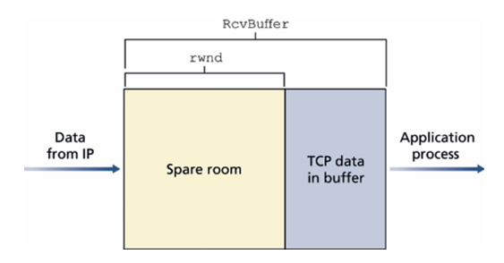

上圖具象化呈現接收端的記憶體佈局。緩衝區總大小 (`RcvBuffer`) 被劃分為「已被 TCP 接收但尚未被應用程式讀取的資料」以及「剩餘可用空間」。剩餘空間即為要宣告給發送端的 `rwnd` 大小。

TCP 不允許已分配的暫存溢出，下式必須成立：

$LastByteRcvd - LastByteRead <= RcvBuffer$

接收窗口用 `rwnd` 表示，根據暫存可用空間的數量來設置：

$rwnd = RcvBuffer - [LastByteRcvd - LastByteRead]$

空間是隨時間變化，所以 `rwnd` 是動態的。

### TCP 連線管理 (TCP Connection Management)
* **三方交握 (Three-way Handshake)：** 
    1. 用戶端發送 SYN 區段（包含初始序號 `client_isn`）。
    2. 伺服器分配資源，回傳 SYNACK 區段（包含 `server_isn` 與 `ack=client_isn+1`）。
    3. 用戶端分配資源，回傳 ACK 區段（`ack=server_isn+1`，可夾帶應用層資料）。
*   **連線拆除 (Connection Teardown)：** 雙方都可以發起關閉，流程包含互發 FIN 區段並以 ACK 確認。最後發送 ACK 的一方必須進入 `TIME_WAIT` 狀態（通常 30秒至 2分鐘），以確保最後一個 ACK 確實送達。
* **快速開啟 (TCP Fast Open) 與 0-RTT：** 為了消除建立連線的 1 RTT 延遲，現代 TCP 架構支援透過之前連線取得的 Cookie，在初次 SYN 封包中夾帶並直接傳送應用資料。
* **SYN 洪泛攻擊與防禦 (SYN Flood Attack & SYN Cookies)：** 攻擊者透過發送大量 SYN 卻不完成最後的 ACK 來耗盡伺服器資源。現代作業系統採用 `SYN Cookies` 架構防禦：伺服器不預先分配資源，而是將連線資訊透過 Hash 演算法編碼進初始序號中，待收到合法的 ACK 才正式建立連線。

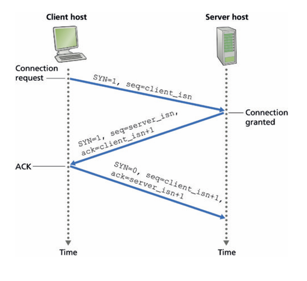

上圖以時序圖 (Timing diagram) 呈現了 SYN、SYNACK 與 ACK 的封包交換過程，明確列出了雙方初始序號 (`seq`) 與確認號 (`ack`) 的遞增變化。

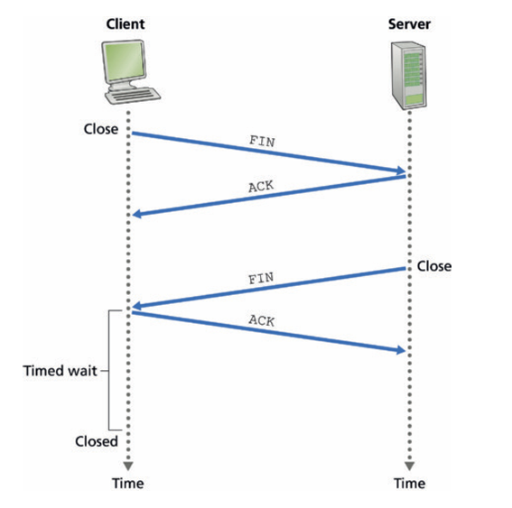

上圖以時序圖展示四次揮手（或稱互發 FIN 與 ACK）的拆線過程，並特別標示出發起端在最後會進入一段 `Timed wait` (即 TIME_WAIT) 期間後才正式關閉資源。

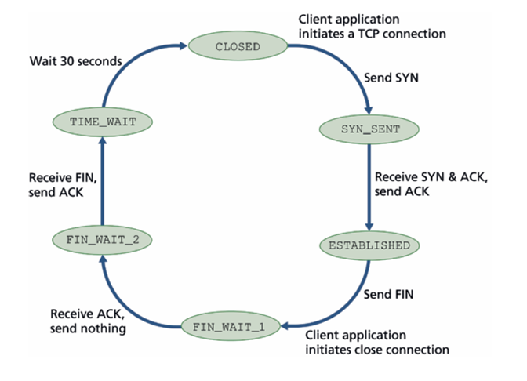
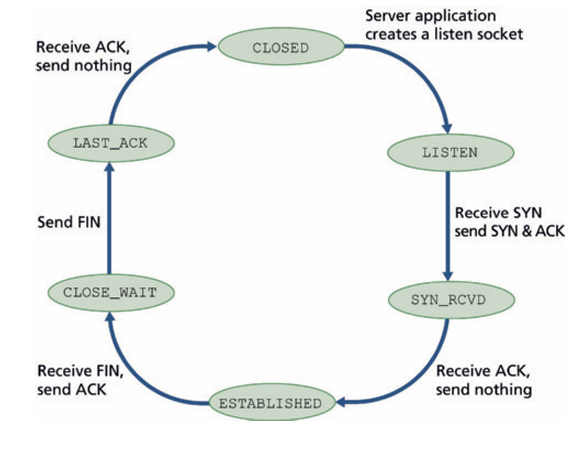

上面兩張圖，是系統架構師除錯時最重要的依據。圖表詳細定義了 TCP 生命週期中的各個狀態流轉：包含 `CLOSED`, `SYN_SENT`, `ESTABLISHED`, `FIN_WAIT_1`, `FIN_WAIT_2`, `TIME_WAIT` (客戶端)，以及 `LISTEN`, `SYN_RCVD`, `CLOSE_WAIT`, `LAST_ACK` (伺服器端)。

## Principles of Congestion Control

在網路架構中，單純的封包重傳（如可靠資料傳輸 rdt）只能解決壅塞的「症狀」（封包遺失），卻無法解決根本原因，即過多傳送端以過高的速率將資料注入網路。因此，我們必須透過壅塞控制機制來調節資料發送速率。

### 壅塞的成因與代價 (The Causes and the Costs of Congestion)

透過三個漸進複雜的網路拓樸情境，推演壅塞發生時的系統行為，並歸納出網路壅塞所帶來的沉重代價：

#### 情境一：兩個傳送端與具備無限大緩衝區的路由器

* **架構分析：** 假設路由器具有無限大的記憶體緩衝區，因此不會發生封包遺失。當兩條連線不斷提高發送速率時，其吞吐量最高只能達到鏈路頻寬的一半 ($R/2$)。
* **壅塞的代價一：** 當發送速率逼近鏈路容量時，雖然不會掉包，但封包在路由器佇列中的平均排隊延遲 (Queuing Delay) 會呈現指數型暴增，甚至趨近於無限大。

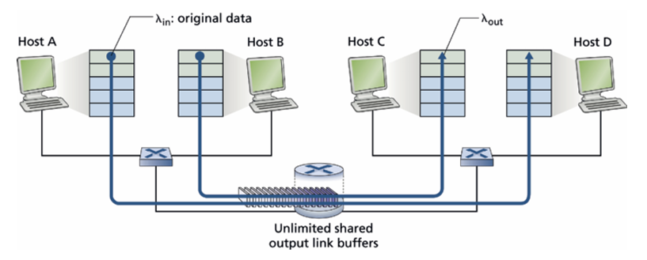

呈現了兩條連線共用一個具備無限大緩衝區路由器的簡單拓樸。

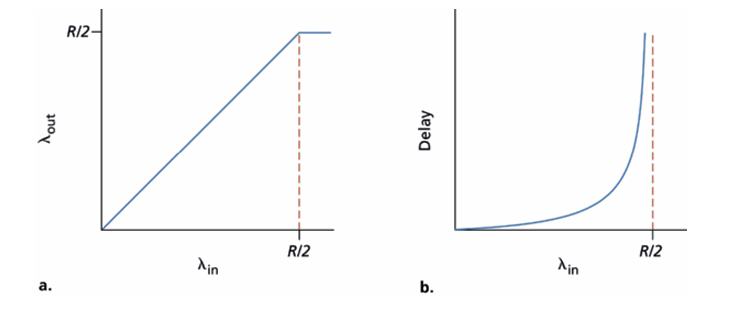

包含左右兩張折線圖。左圖呈現當發送速率提升時，吞吐量到達 $R/2$ 即封頂；右圖則呈現發送速率接近 $R/2$ 時，延遲時間會呈現漸近線式的無限飆升，具象化了第一個壅塞代價。

* **系統架構前提與假設 (System Model)**
    * 該圖表基於一個簡化的網路拓樸情境：兩台主機（Host A 與 Host B）共用單一個路由器與一條頻寬容量為 $R$ 的輸出鏈路。
    * 假設該路由器具備「無限大的記憶體緩衝區 (Infinite buffers)」，這意味著在此情境下絕對不會發生緩衝區溢位與封包遺失。
    * 兩台主機皆以 $\lambda_{in}$ (bytes/sec) 的平均速率傳送原始資料，而接收端實際收到的吞吐量為 $\lambda_{out}$。

* **左圖解析：吞吐量與發送速率的關係 (Throughput vs. Sending Rate)**
    * 左圖的 X 軸為發送速率 ($\lambda_{in}$)，Y 軸為每條連線的吞吐量 ($\lambda_{out}$)。
    * 當發送速率 $\lambda_{in}$ 介於 0 到 $R/2$ 之間時，吞吐量會等同於發送速率（呈現完美的 45 度斜線直線上升），這代表發送端送出的所有資料都能如期送達接收端。
    * 然而，一旦發送速率超過 $R/2$，由於兩條連線必須平分總頻寬容量 $R$，每條連線的吞吐量將會「封頂」並停滯於 $R/2$。無論主機將發送速率調得多高，都無法突破這個硬體物理限制。
* **右圖解析：延遲時間與發送速率的關係 (Delay vs. Sending Rate)**
    * 右圖的 X 軸同為發送速率 ($\lambda_{in}$)，Y 軸則是封包的平均延遲時間 (Delay)。
    * 當系統的發送速率逐漸逼近硬體處理極限（即 $R/2$）時，平均延遲時間並非線性增加，而是呈現漸近線式（Asymptotic）的無限飆升。
    * 若發送速率超過 $R/2$，由於路由器的緩衝區被假設為無限大，封包將會在佇列中無止盡地排隊，導致端到端（Source to destination）的平均延遲時間趨近於無限大。
* **架構師的總結與壅塞代價 (The Cost of Congestion)**
    * 表面上看，讓連線吞吐量維持在極限 $R/2$ 似乎能最大化利用鏈路資源，但從圖表可得知這會帶來災難性的延遲。
    * 這正是上圖要揭示的「第一個壅塞代價」：即使在不會掉包的完美硬體假設下，當封包到達速率接近鏈路容量時，系統仍會經歷極為龐大的排隊延遲 (Queuing delays)。這凸顯了在網路設計中，*不能僅僅追求吞吐量極大化，而必須透過壅塞控制機制來維持系統的低延遲與穩定性*。

#### 情境二：兩個傳送端與具備有限緩衝區的路由器
* **架構分析：** 實務上路由器緩衝區有限，當佇列滿載時會丟棄封包。傳送端的傳輸層必須透過逾時重傳機制來補救。
* **壅塞的代價二：** 傳送端必須執行*重傳 (Retransmissions)* 來彌補因緩衝區溢位而遺失的封包，這導致網路頻寬被用來傳送重複的資料，降低了應用層實際的有效吞吐量。
* **壅塞的代價三：** 在高延遲的網路中，傳送端可能會發生*提早逾時 (Premature timeout)*，導致將尚未遺失的封包重複送出。這使得路由器將寶貴的鏈路頻寬浪費在轉發不必要的重複封包上。

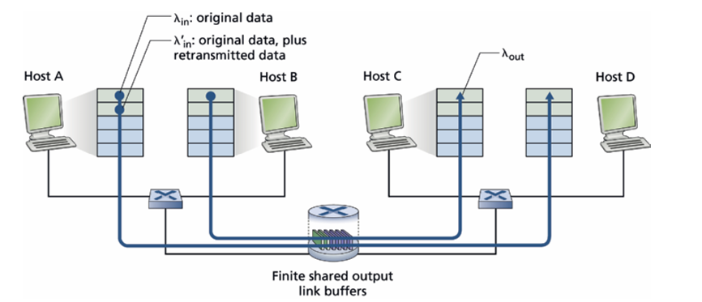

上圖呈現路由器具有有限緩衝區的網路拓樸，因此會發生封包遺失。

* **核心情境與角色定義**
    * **拓撲架構：** 兩個發送端（Host A 與 Host B）共享一台**緩衝區有限**的路由器，並將資料打往各自的接收端。出境鏈路（Outgoing link）的容量為 $R$。
    * **吞吐量指標 $\lambda_{in}$（Application Layer）：** 發送端應用程式**最初產生並交給傳輸層**的原始資料發送速率（Original data rate）。
    * **傳遞速率指標 $\lambda'_{in}$（Transport Layer）：** 傳輸層實際發送到網路中的總速率，包含**原始資料 $\lambda_{in}$ 以及因為掉包而重新傳送的資料（Retransmitted data）**。因此，$\lambda'_{in} > \lambda_{in}$。
        * 在計算機網路中被稱為「提供的負載 (Offered load)」
    * **有效吞吐量 $\lambda_{out}$（Receiver Side）：** 接收端實際收到的有效資料速率（Goodput）。在完美無掉包的理想狀況下，最大極限為 $R/2$。
    * **有限緩衝區設計 (Finite Buffers)**
        * 與理想的無限大緩衝區不同，此處路由器的記憶體緩衝區是有限的。當封包到達速率超過轉發速率且緩衝區已滿時，路由器會丟棄後續到達的封包（Buffer overflow / Packet drop）。
    * **重傳機制的介入**
        * 假設兩端的連線是可靠的資料傳輸（如 TCP）。若封包被路由器丟棄，傳送端最終會觸發重傳。

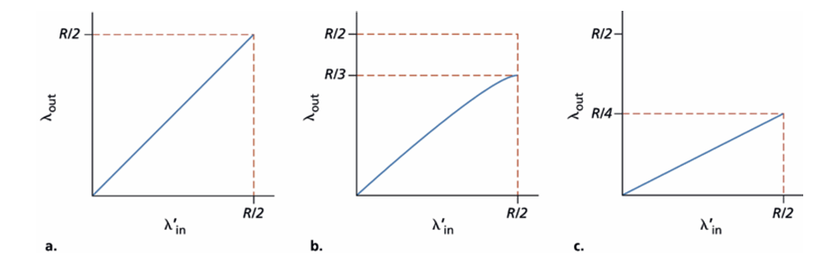

上圖描繪了在完美知悉遺失、發生掉包重傳、以及發生提早逾時等三種不同狀況下，*提供的負載 (Offered load)*與*實際吞吐量*之間的關係曲線，證明了不必要的重傳會導致實際吞吐量低於理想的 $R/2$ 上限。

這張圖透過三個子圖 (a, b, c) 推演了傳送端在不同重傳策略下，網路吞吐量 ($\lambda_{out}$) 與提供負載 ($\lambda'_{in}$) 之間的效能變化，藉此揭示壅塞的代價：

* **(a)：完美狀態下的理想吞吐量**
    * **前提假設：** 假設傳送端具備「上帝視角」，能夠精準知道路由器何時有空閒的緩衝區，並只在有空位時才發送封包。
    * **效能表現：** 在這種完美情況下，絕對不會發生封包遺失，因此 $\lambda_{in}$ 等於 $\lambda'_{in}$。吞吐量曲線呈現完美的 45 度角上升，直到達到硬體頻寬極限 $R/2$。

* **(b)：實際掉包與重傳 (揭示第二個壅塞代價)**
    * **前提假設：** 傳送端僅在封包「確切遺失」時才進行重傳。
    * **效能表現：** 當總負載 $\lambda'_{in}$ 達到 $R/2$ 時，實際有效吞吐量 ($\lambda_{out}$) 卻只有 $R/3$。在傳送的 $0.5R$ 資料中，平均有 $0.333R$ 是原始資料，而 $0.166R$ 是為了彌補掉包而重傳的資料。
    * **第二個壅塞代價：** 這揭露了壅塞的**第二個代價**傳送端必須消耗寶貴的網路頻寬來重傳因緩衝區溢位而遺失的封包，導致應用層實際的有效吞吐量低於理想值。

* **(c)：提早逾時與不必要的浪費 (揭示第三個壅塞代價)**
    * **前提假設：** 在高延遲的真實網路中，傳送端可能因為計時器設定問題發生*提早逾時 (Premature timeout)*。這會導致傳送端將在佇列中排隊但*尚未遺失*的封包重新發送一次。
    * **效能表現：** 接收端會收到兩份一樣的封包並丟棄其中一份。此圖顯示，若每個封包平均被路由器轉發兩次，當負載接近 $R/2$ 時，有效吞吐量將慘跌至 $R/4$。
    * 第三個壅塞代價：** 這揭露了壅塞的**第三個代價**面對高延遲造成的提早逾時，傳送端不必要的重傳會迫使路由器將其鏈路頻寬浪費在轉發「不必要的重複封包」上。原本可以用來轉發其他有效資料的頻寬被毫無意義地消耗掉了。

> 確切遺失 (Known for certain to be lost / Actual Loss):
> 在具備有限緩衝區 (Finite buffers) 的真實路由器中，當封包到達速率超過轉發速率導致緩衝區完全滿載時，後續抵達的封包會被路由器直接丟棄 (Dropped)。
> 提早逾時 (Premature Timeout)：
> 封包在網路中*並未遺失*，而是因為網路壅塞，導致該封包在路由器的佇列中經歷了極長的排隊延遲 (Delayed in the queue but not yet lost)。

#### 情境三：四個傳送端、有限緩衝區路由器與多躍點路徑
* **架構分析：** 這是最貼近真實網路的情境，流量必須跨越多個路由器，且不同連線會在不同的路由器上互相競爭有限的緩衝區空間。
* **壅塞的代價四 (壅塞崩潰 Congestion Collapse)：** 當網路負載極大時，某個封包如果在下游路由器因為佇列滿載而被丟棄，那麼「上游路由器為了將該封包轉發到丟棄點所消耗的所有傳輸頻寬，就全部浪費了」。在極端情況下，這會導致整個網路的端到端吞吐量降為零。

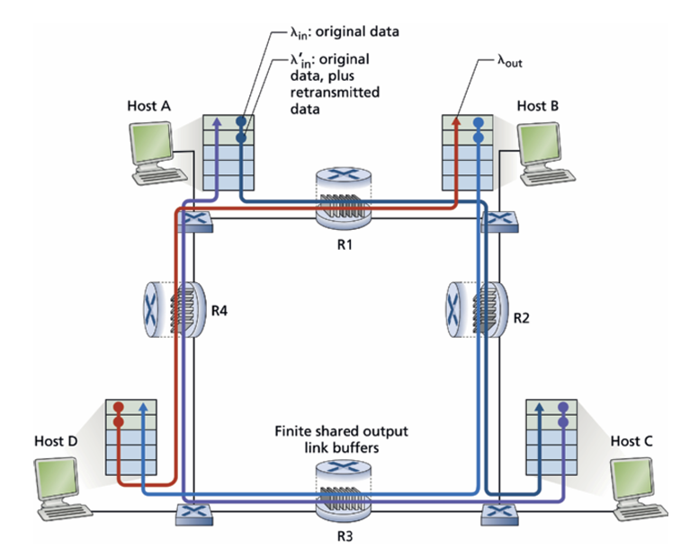

呈現四個主機透過多個路由器與多躍點路徑交叉傳送資料的拓樸，各連線在不同節點競爭資源。

    * **拓樸模型設計：** 這張圖展示了一個更複雜且真實的網路拓樸。圖中有四台主機（A、B、C、D）正在傳送封包，每條連線都會跨越「兩個」路由器（即多躍點路徑），且每條連線皆與其他連線在路由器上產生重疊與資源競爭。
    * **資源競爭關係：** 例如，A 到 C 的連線與 D 到 B 的連線共同競爭路由器 R1 的資源；同時，A 到 C 的連線又與 B 到 D 的連線共同競爭路由器 R2 的資源。所有路由器的緩衝區皆為有限，且鏈路容量均為 $R$。

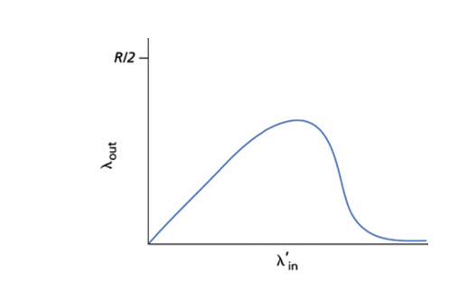

呈現了駭人的「壅塞崩潰」現象：當發送負載超過一定臨界點後，有效吞吐量曲線不僅沒有上升，反而急遽下滑甚至歸零。
    * **壅塞崩潰 (Congestion Collapse) 的視覺化：** 該圖繪製了「實際吞吐量 ($\lambda_{out}$)」與「提供的負載 ($\lambda'_{in}$)」之間的關係曲線。當網路負載極大時，有效吞吐量不僅沒有維持在極限，反而急遽下滑，在極端情況下甚至會歸零。
    * 第四個壅塞代價：** 當一個封包在多躍點路徑的下游路由器（如第二跳）因為緩衝區滿載而被丟棄時，那麼上游路由器（第一跳）為了將該封包轉發到丟棄點所消耗的所有傳輸頻寬，就全部白白浪費了。
    * **系統效能致命傷：** 路由器將寶貴的鏈路容量用於傳送最終注定被丟棄的封包，導致真正能成功抵達目的地的封包越來越少，這就是計算機科學中著名的「壅塞崩潰」現象。

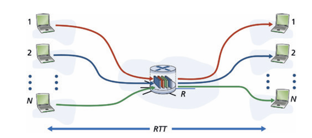

此圖展示了 $N$ 條連線共同穿過一條容量為 $R$ 的瓶頸鏈路 (Bottleneck router capacity R)。圖表重點在於帶出壅塞控制的核心目標：這 $N$ 條連線的總發送速率必須控制在「接近但不超過」瓶頸鏈路容量 $R$ 的範圍內。
    * **瓶頸鏈路 (Bottleneck Link) 概念引入：** 在經歷了上述三個壅塞情境的慘痛代價後，此圖總結了壅塞控制必須解決的根本問題。圖中展示了 $N$ 條傳輸層連線共同穿過一條容量為 $R$ 的「瓶頸鏈路」。
    * **定義與影響：** 瓶頸鏈路是指在端到端路徑中，當傳送端提高發送速率時，第一條發生壅塞與掉包的鏈路。這條鏈路的容量 $R$ 決定了這 $N$ 條連線的總和吞吐量上限。
    * **壅塞控制的核心目標：** 網路架構師設計壅塞控制機制的最終目的，就是讓這 $N$ 條連線的*總發送速率*能夠盡可能接近、但**絕對不要超過**瓶頸鏈路的容量 $R$。如果發送速率總和低於 $R$，會造成網路資源閒置浪費；但若超過 $R$，就會引發排隊延遲、掉包重傳，甚至導致上上圖的壅塞崩潰。同時，一個公平的壅塞控制機制應盡可能讓這 $N$ 條連線平均分配頻寬（即每條連線獲得 $R/N$ 的吞吐量）。

### 端到端與網路輔助的壅塞控制 (End-to-end and Network-assisted Approaches to Congestion Control)
了解壅塞的成因後，網路科學領域將壅塞控制的系統實作分為兩大架構派別：

* **端到端壅塞控制 (End-to-end congestion control)**
  * **設計哲學：** 網路層 (IP 層) 不提供任何明確的壅塞狀態支援或回饋給傳輸層。傳輸層必須依靠「端系統」自己來推斷網路是否發生壅塞。
  * **實作機制：** TCP 協定就是採用此架構的典範。端系統透過觀察「封包遺失 (如逾時或收到三個重複的 ACK)」或是「延遲時間的增加 (RTT)」，來間接推測網路已經壅塞，進而主動降低發送視窗的大小。

* **網路輔助壅塞控制 (Network-assisted congestion control)**
  * **設計哲學：** 網路層的路由器作為實際處理封包的設備，直接參與壅塞控制，並提供*明確的回饋訊號*給傳送端或接收端。
  * **實作機制：** 早期如 ATM ABR 架構會直接告知傳送端可用的最大速率。在現代 IP/TCP 架構中，則演進出*明確壅塞通知 (Explicit Congestion Notification, ECN)*機制，路由器能在封包標頭上標記壅塞狀態。

  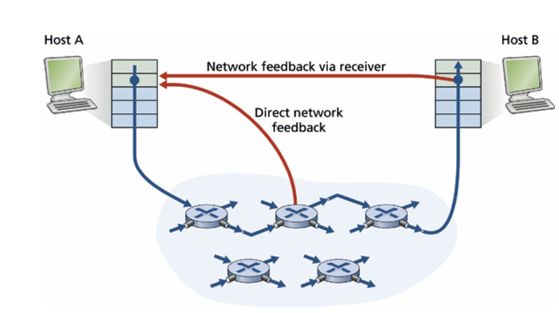

  此圖呈現了網路輔助壅塞控制的「兩條回饋路徑」。第一條是紅色實線的*直接網路回饋 (Direct network feedback)*，由壅塞的路由器直接發送扼制封包 (Choke packet) 給傳送端；第二條是藍色線的*透過接收端回饋 (Network feedback via receiver)*，壅塞的路由器在資料封包上做標記並送達接收端後，再由接收端透過回覆訊息告知傳送端網路已壅塞，這也是現代 ECN 採用的主要運作模式。

## TCP Congestion Control

在計算機網路系統設計中，單純依靠重傳機制*只能解決封包遺失的症狀，卻無法根治網路壅塞的病因*。為此，TCP 引入了複雜的壅塞控制機制。早期的「經典」TCP 採用「端到端 (End-to-End)」的設計哲學，因為底層的 IP 網路預設並不提供明確的壅塞回饋訊號。

### 經典端到端 TCP 壅塞控制 (Classic End-End TCP Congestion Control)

傳統 TCP 採用「端到端 (End-to-End)」設計，因為底層 IP 網路不提供明確的壅塞回饋，傳送端必須依靠觀察封包的「遺失（如逾時或 3 個重複 ACK）」來自主調節發送速率。

* **壅塞視窗 (Congestion Window, cwnd) 控制：** 系統會在傳送端維護一個名為 `cwnd` 的變數，它限制了傳送端在未收到確認 (ACK) 前可以送入網路的最大資料量。傳送端的發送速率大約等於 `cwnd / RTT` (bytes/sec)。
* **以遺失作為壅塞訊號 (Loss as an Indication)：** 當發生「逾時 (Timeout)」或收到「3 個重複的 ACK (Triple Duplicate ACKs)」時，TCP 會將其視為*遺失事件 (Loss event)*，並判定網路路徑上發生了緩衝區溢位與壅塞。
* **自我計時機制 (Self-clocking)：** 只要收到來自接收端的 ACK，TCP 就會將其視為網路暢通的訊號，並藉此觸發 `cwnd` 的增加。這種利用 ACK 來調整發送節奏的機制稱為自我計時。

* **核心控制機制**
  * **傳送資料量限制公式：`LastByteSent – LastByteAcked <= min{cwnd, rwnd}`**
    * **解析：** 這是不等式控制的核心。它規定了*已送出但尚未被確認的資料量 (In-flight data)*絕對不能超過 `cwnd`（壅塞視窗，代表網路的容受極限）與 `rwnd`（接收視窗，代表接收端的緩衝區剩餘空間）兩者中的較小值。
    * **傳送速率估算公式：`Rate ≈ cwnd / RTT` (bytes/sec)**
        * **解析：** 在忽略封包傳輸延遲與遺失的理想情況下，傳送端在一個往返時間 (RTT) 內能送出 `cwnd` 位元組的資料。架構師可透過調整 `cwnd` 動態控制連線的實際吞吐量。
* **壅塞控制三大階段**
    1. **慢速啟動 (Slow Start)：** 連線初期，`cwnd` 預設為 1 MSS。每收到一個 ACK，`cwnd` 增加 1 MSS，導致傳送速率在每個 RTT 呈現「指數型」翻倍暴增，以快速尋找網路頻寬上限。當發生逾時，系統會將慢速啟動門檻 `ssthresh` 設為 `cwnd/2`，並將 `cwnd` 降回 1 MSS。
    2. **壅塞避免 (Congestion Avoidance)：** 當 `cwnd` 達到 `ssthresh` 時，為避免過度激進，TCP 改為每個 RTT 僅「線性」增加 1 MSS。
    3. **快速恢復 (Fast Recovery)：** 當收到 3 個重複的 ACK（代表輕微掉包），TCP Reno 會將 `cwnd` 砍半並加上 3 MSS，接著針對後續收到的重複 ACK 增加 `cwnd`，隨後回到線性增長的壅塞避免階段。
* **TCP 巨觀吞吐量數學模型 (Macroscopic Model)**
    * **穩態平均吞吐量公式：`Average Throughput = (0.75 * W) / RTT`**
        * **解析：** 這是 TCP 加法增加、乘法減少 (AIMD) 行為的平均值。假設掉包時的最大視窗為 $W$，視窗會在 $W/2$ 到 $W$ 之間線性變動，因此平均傳輸速率為 $(W/2 + W) / 2 = 0.75 W$ 除以 RTT。
    * **頻寬、RTT 與掉包率 ($L$) 關係公式：$\text{Average Rate} \approx \frac{1.22 \cdot MSS}{RTT \cdot \sqrt{L}}$**
        * **解析：** 結合前述的視窗變化，推導出吞吐量與「RTT 以及掉包率的平方根」成反比。這解釋了為何在高延遲或易掉包的跨國網路中，傳統 TCP 的極限速度會受到嚴重的物理數學限制。

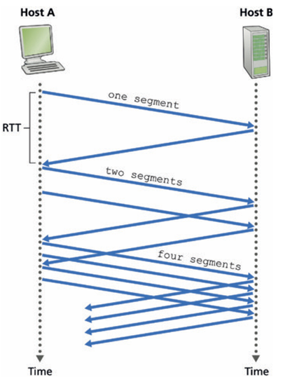

圖呈現「慢速啟動」的指數增長特性。傳送 1 個封包，收到 ACK 後發送 2 個，接著 4 個，具象化了連線初期極速填滿頻寬的過程。

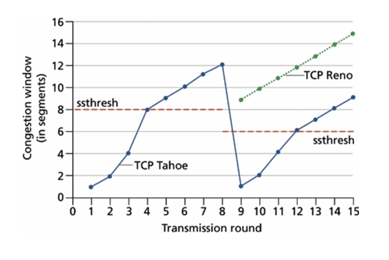

對比 TCP Tahoe 與 Reno。在第 8 輪發生 3 個重複 ACK 時，Tahoe 將視窗無情降回 1 MSS；而 Reno 僅將視窗砍半為 6 MSS 並維持線性增長，展現 Reno 較優異的效能。

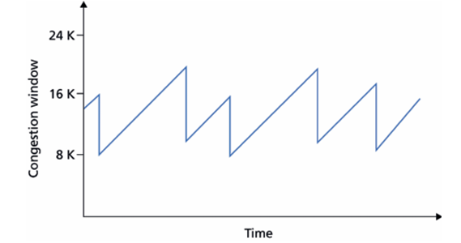

呈現 TCP 經典的「鋸齒狀 (Saw-tooth)」吞吐量曲線。傳送端線性增加速率直到碰觸網路壅塞極限，接著瞬間砍半，再重新探測。

### 近代端到端 TCP 壅塞控制演算法 (Recent End-End TCP Congestion Control Algorithms)====

因應現代高速與高延遲網路，新演算法改善了傳統 AIMD 恢復過慢的缺點。

* **TCP CUBIC：** 針對 AIMD 進行改良，利用*當前時間與上次發生壅塞時間差的立方函數 (Cubic function)* 來決定 `cwnd` 的增長。掉包後能極快恢復至接近前次最大視窗 $W_{max}$，接近時趨於平緩探測；若網路好轉，則再次快速飆升。
* **TCP Vegas (延遲導向)：** 持續測量最低延遲 $RTT_{min}$。若實際吞吐量低於預期 $cwnd/RTT_{min}$（代表封包在路由器排隊），在真正發生掉包前就主動降速，實現主動避塞。
* **BBR (Bottleneck Bandwidth and RTT)：** 由 Google 開發的現代架構，核心理念為*讓管線剛剛好滿，但不要滿出來 (Keep the pipe just full, but no fuller)*。它測量瓶頸頻寬與 RTT 的乘積 (Bandwidth-Delay Product, BDP) 來決定在途封包數 $n_{inflight}$，分為加速、巡航與減速階段，能有效避免路由器緩衝區膨脹 (Bufferbloat)。

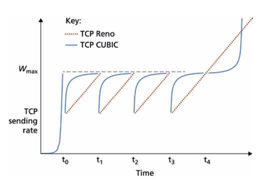

對比兩者掉包後的恢復曲線。Reno 呈現死板的線性上升（虛線）；CUBIC 則為立方曲線（實線），掉包後極速飆升回接近 $W_{max}$ 後平緩，在現代網路中提供更高吞吐量。

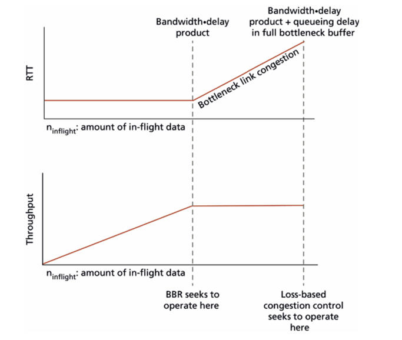

BBR 演算法的基礎直覺。圖表顯示當在途資料量超過頻寬延遲乘積時，吞吐量（下圖）達到平坦極限，而 RTT（上圖）卻因排隊延遲開始線性上升。BBR 目標就是精準運作於這兩條曲線的「轉折點」上。

**背景與痛點：** 傳統 TCP Reno 發生掉包後視窗減半，接著每個 RTT 只能「加性增（+1 MSS）」，在高頻寬延遲積（Large BDP, 如跨國光纖/5G）的環境下，這種慢慢加 1 的方式要花很久才能填滿頻寬，效率極差。

**CUBIC 的核心策略：** 當前一次發生擁塞（掉包）時的視窗大小為 $W_{max}$
    * 掉包後，CUBIC 快速將視窗乘性減半，隨後開始快速回升。
    * 高原期（Plateau）： 當視窗接近上一次發生掉包的 $W_{max}$ 時（圖中彎曲平緩的區域），它會變得非常小心，刻意放慢增長速度。因為這裡最容易再次發生擁塞，藉此達到穩定網路的目的。
    * 加速探測期： 一旦安全度過 $W_{max}$ 且沒有發生掉包，代表網路頻寬可能變大了（例如別的連線斷開了），CUBIC 就會轉為加速飆升，迅速去搶占剩餘的空白頻寬。

CUBIC 捨棄了*每過一個 RTT 視窗加 1*的傳統作法，改為依據真實時間 $t$（自上一次掉包後經過的時間）來計算擁塞視窗大小 $W(t)$：

$$W(t) = C \cdot (t - K)^3 + W_{max}$$

* $W(t)$： 當前時間點 $t$ 的擁塞視窗大小（Window size）。
* $W_{max}$： 上一次偵測到網路掉包時的視窗大小上限。
* $C$： CUBIC 的縮放常數（Scaling factor），用以調節整體增長的快慢。
* $t$： 自上一次掉包事件發生後，所經過的絕對時間（這使得 CUBIC 增長不依賴於 RTT，對長延遲鏈路非常公平）。
* $K$： 視窗重新回到 $W_{max}$ 所需要花費的時間，它是透過公式推導出來的常數：
    $$K = \left( \frac{W_{max} \cdot \beta}{C} \right)^{1/3}$$
    （其中 $\beta$ 是 CUBIC 的乘性減小係數，通常設定為 $0.2$ 或 $0.3$，即掉包時視窗縮小為原來的 $0.7$ 或 $0.8$ 倍）。

### 網路輔助明確壅塞通知 (Network-Assisted Explicit Congestion Notification)

打破純端到端的限制，透過網路層（路由器）直接提供壅塞訊號。

* **ECN 運作機制：** 路由器在緩衝區即將滿載時，會將 IP 資料報標頭中服務類型 (TOS) 欄位的 ECN 位元設為 11，標記壅塞即將發生。
* **跨層回饋：** 接收端收到標記後，在回傳的 TCP ACK 中設定 ECE (ECN Echo) 位元。傳送端收到後將 `cwnd` 砍半（形同掉包），並在下個封包設定 CWR (Congestion Window Reduced) 位元通知接收端已降速。

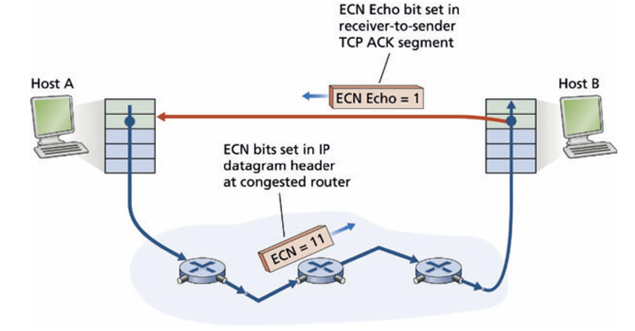

ECN 跨層與跨端點的互動路徑。壅塞的路由器標記 IP 標頭，封包抵達 Host B 後，Host B 透過 TCP ACK 的 ECE 位元將警告送回 Host A，促使 Host A 降速。

### 壅塞控制的公平性 (Fairness)
當多條 TCP 連線共用同一個瓶頸鏈路時，系統設計必須確保資源分配的公平性（平均分配頻寬 $R/K$）。

* **AIMD 的自然收斂特性：** 透過數學與幾何分析，即使多條 TCP 連線啟動時間與初始視窗不同，AIMD「同步掉包砍半、同速率線性增加」的特性，最終會引導所有連線的吞吐量自然收斂至均等分配。
* **架構上的不公平漏洞 (UDP 與平行連線)：** 
    1. 不受控的 UDP 流量：多媒體應用若使用無壅塞控制的 UDP 全速發送，會擠壓到面臨壅塞會主動降速的 TCP 流量，造成不公平。
    2. 平行 TCP 連線：Web 瀏覽器若同時開啟多條平行的 TCP 連線，便能以不公平的方式搶佔遠多於單一連線應用程式的頻寬資源。

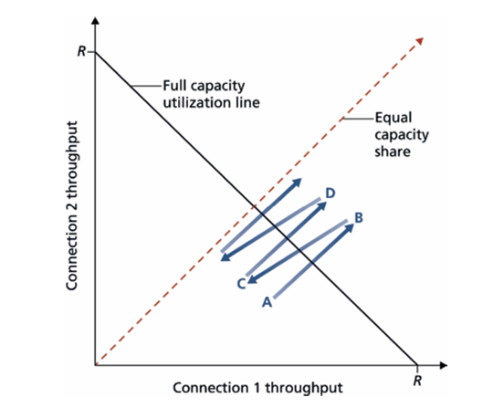

XY 軸分別代表兩條連線的吞吐量。當總頻寬超過 R 碰觸滿載線時，兩者頻寬瞬間減半（退回原點方向）；頻寬充裕時，兩者以 45 度角（等比例）線性增加。多次循環後，系統狀態完美收斂至中央的「Equal capacity share (公平分配線)」。

## 傳輸層功能的演進 (Evolution of Transport-Layer Functionality) 

在 TCP 與 UDP 統治網路界四十年後，現代網路架構如何為了解決傳統協定的僵化問題，而產生了「將傳輸層功能上移」的典範轉移。

### 傳輸層功能演進的核心概念

*   **TCP 與 UDP 的歷史侷限性：** 
    *   過去四十年間，TCP 與 UDP 一直是網際網路傳輸層的兩大「工作主力 (Work horses)」。
    *   然而，無數的實務經驗表明，這兩者在某些現代高速、低延遲或高安全需求的場景中，皆無法達到最理想的狀態。傳統 TCP 實作於作業系統核心 (OS Kernel) 中，若要修改或升級壅塞控制等演算法，需要漫長的標準化與作業系統更新週期。
*   **架構的典範轉移：傳輸層功能移轉至「應用層」：** 
    *   過去十年間發生了最具震撼性（Seismic change）的架構改變：**將 TCP 的可靠資料傳輸 (RDT)、流量控制、壅塞控制等核心服務，以「應用層模組 (Application-level modules)」的形式建立在 UDP 之上**。
    *   這賦予了應用程式開發者第三種選擇：開發者可以利用 UDP 為基底，「自己打造 (Roll their own)」專屬的傳輸層服務，這使得通訊協定的更新與迭代速度能與「應用程式更新週期 (Application-update timescales)」一致，遠快於作業系統層級的更新。
*   **QUIC 協定 (Quick UDP Internet Connections) 的崛起：** 
    *   最能代表此一演進趨勢的標準就是 QUIC 協定（廣泛應用於 HTTP/3）。
    *   **連線導向與內建安全 (Connection-Oriented and Secure)：** QUIC 在兩端點之間建立邏輯連線，並具備來源與目的連線 ID。最關鍵的是，**QUIC 將「建立連線狀態的交握」與「TLS 認證及加密的交握」合而為一**。這大幅減少了傳統 TCP 必須先花費多個 RTT 建立連線、再花費 RTT 建立 TLS 加密連線的延遲問題，實現了極速的連線建立。

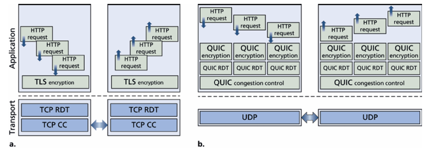

這張圖表完美對比了傳統 Web 傳輸堆疊與現代 Web 傳輸堆疊在「系統分層架構」上的根本差異。
*   **(a) 左圖：HTTP/1.1 運行於 TLS 與 TCP 之上 (傳統架構)**
    *   **資料平面：** 應用層產生 HTTP 請求後，會先交給應用層內的 TLS 模組進行加密，隨後資料被推入**傳輸層（實作於 OS Kernel）**。
    *   **底層依賴：** OS 核心中的 TCP 負責提供可靠資料傳輸 (TCP RDT) 與壅塞控制 (TCP CC)。
    *   **效能瓶頸：** 必須先完成底層的 TCP 三方交握，接著才能進行上層的 TLS 交握，層層堆疊導致初始連線延遲極高。
*   **(b) 右圖：HTTP/3 運行於 QUIC 與 UDP 之上 (現代演進架構)**
    *   **架構重構：** 圖中顯示，應用層包含了 HTTP 請求，並且**直接包含了 QUIC 模組**。QUIC 模組內部自行實作了加密 (QUIC encryption)、可靠傳輸 (QUIC RDT) 以及壅塞控制 (QUIC congestion control)。
    *   **傳輸層退化：** 真正的傳輸層只剩下最原始、無狀態、無連線的 **UDP**。
    *   **圖表重點表達：** 此圖視覺化了「傳輸控制邏輯上移」的概念。透過將 RDT 與加密全部整合在應用層的 QUIC 模組中，不僅消除了 TCP 與 TLS 分離造成的交握延遲，還解決了 TCP 傳統的隊頭阻塞 (Head-of-Line Blocking) 問題，因為 QUIC 可以自行在應用層掌控多個獨立資料流的管理。

