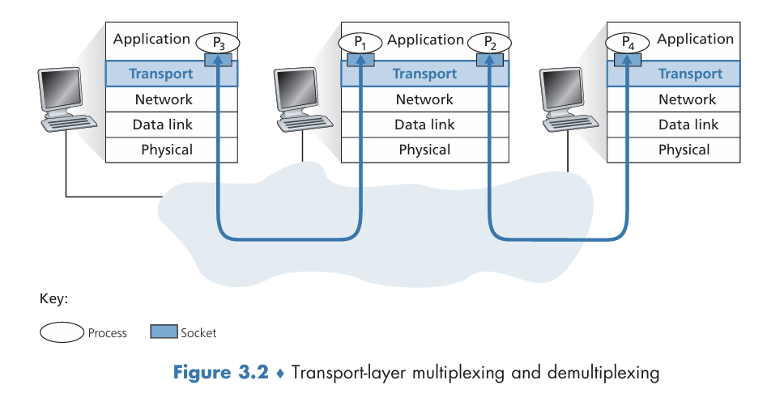
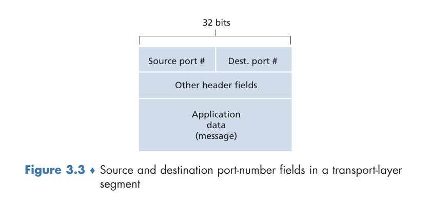
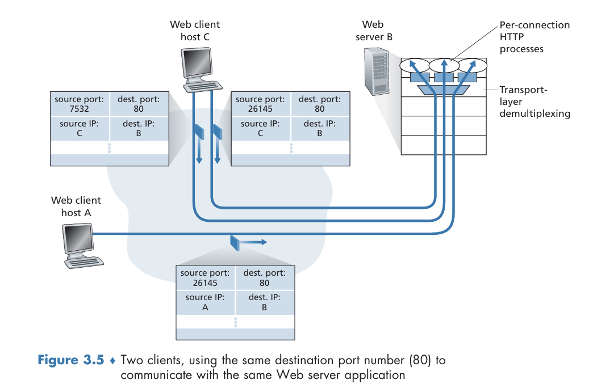

## Introduction and Transport-Layer Services
1.  **傳輸層的核心功能：邏輯通訊 (Logical Communication)**
    *   傳輸層協定提供不同主機上應用程式之間的「邏輯通訊」服務。這意味著從應用程式的角度來看，它們彷彿直接相連，無需擔心底層物理基礎設施的複雜性。即使主機在地球兩端，透過無數路由器和多種鏈路類型連接，傳輸層也能實現這種邏輯上的直接溝通。
    *   這種通訊是「端對端」（end-to-end）的，發生在應用程式進程之間，而非僅僅主機之間。

2.  **傳輸層的實作位置與職責**
    *   傳輸層協定主要實作在**端系統（end systems）**中，而非網路中的路由器（network routers）。*路由器只處理網路層的封包（即資料報），不會檢查或辨識傳輸層協定新增到應用程式訊息中的任何資訊*。
    *   在發送端，傳輸層從應用程式接收訊息，將其（可能）分割成較小的資料塊，並添加傳輸層標頭（header）以建立「傳輸層分段」（transport-layer segments）。這些分段隨後會傳遞給網路層，由網路層將其封裝到網路層封包（資料報 datagram）中發送到目的地。
    *   在接收端，網路層從資料報中提取傳輸層分段，並將其傳遞給傳輸層。傳輸層接著處理這些分段，將資料提供給接收應用程式。

### 傳輸層與網路層的關係
- 傳輸層位於協定堆疊中的網路層之上。網路層協定提供**主機到主機（host-to-host）**的邏輯通訊，而傳輸層協定則將此服務擴展為**進程到進程（process-to-process）**的邏輯通訊。
    - 一個有用的比喻是：
        - 應用程式訊息：信件
        - 進程：表兄弟姊妹（cousins）
        - 主機（端系統）：房子
        - 傳輸層協定：家中負責收發信件的安妮和比爾（他們負責將信件發給正確的人）
        - 網路層協定：郵政服務（將信件從一棟房子送到另一棟房子）
    - 傳輸協定即使在底層網路協定不可靠（即可能丟失、損壞或複製封包）的情況下，也能提供可靠的資料傳輸服務。這表示傳輸層可以為應用程式提供比網路層更強大的服務保證。

### Overview of the Transport Layer in the Internet
1.  **網際網路傳輸層概述：UDP與TCP**
    *   網際網路提供兩種主要的傳輸層協定供應用程式使用：
        *   **使用者資料報協定（User Datagram Protocol, UDP）**：提供不可靠（unreliable）、無連接（connectionless）的服務。
        *   **傳輸控制協定（Transmission Control Protocol, TCP）**：提供可靠（reliable）、面向連接（connection-oriented）的服務。
    *   應用程式開發者在設計網路應用程式時，必須在這兩種協定中做出選擇。
    *   **術語澄清**：通常將傳輸層封包稱為「分段」（segment）。然而，網際網路文獻（如RFC）有時將TCP封包稱為分段，但將UDP封包稱為「資料報」（datagram）。為了避免混淆，本書中將TCP和UDP的封包都稱為分段，並將「資料報」一詞保留給網路層封包。
    *   **IP服務模型**：網際網路的網路層協定是IP（Internet Protocol），它提供**盡力而為（best-effort）**的傳輸服務。這意味著IP不保證分段的交付、不保證按序交付、也不保證資料的完整性，因此IP被認為是**不可靠的服務**。每台主機至少有一個網路層位址，即IP位址。

2.  **UDP和TCP提供的服務模型**
    *   **UDP**：提供最基礎的服務，除了多工/解多工（將IP主機到主機交付服務擴展到進程到進程的交付）和輕量級錯誤檢查（透過校驗和）外，幾乎沒有增加任何功能。UDP也不保證資料的完整性或按序交付。
    *   **TCP**：提供多項額外服務。最重要的是**可靠資料傳輸**，它使用流量控制、序號、確認和計時器等機制，確保資料從發送進程正確、按序地傳輸到接收進程，將IP不可靠的服務轉化為可靠的資料傳輸服務。此外，TCP還提供**擁塞控制**，這是為了整個網際網路的利益而提供的服務，旨在防止任何TCP連接因過多流量而淹沒網路中的鏈路和路由器，力求使每個經過擁塞鏈路的連接公平分享頻寬。相比之下，UDP流量不受限制。
    *   提供可靠資料傳輸和擁塞控制的協定必然會更複雜。

總結來說，本章節為傳輸層奠定了基礎，強調了其作為應用程式之間邏輯通訊橋樑的角色，並解釋了UDP和TCP在可靠性、連接管理和擁塞控制方面的根本差異。理解這些概念對於深入學習網路協定至關重要。

## 3.2 Multiplexing and Demultiplexing

本章節的核心在於闡述傳輸層如何將網路層提供的「主機到主機 (host-to-host) 傳輸服務」延伸為「**行程到行程 (process-to-process) 傳輸服務**」。這是一個所有電腦網路都必需的基礎傳輸層服務。

1.  **核心概念：將主機服務擴展到行程服務**
    *   **網路層 (Network Layer)** 負責將資料從一個**主機 (host)** 傳送到另一個**主機**。這就像是郵政服務將信件從一棟房子送到另一棟房子。
    *   **傳輸層 (Transport Layer)** 則在此基礎上，將服務延伸到在這些主機上執行的**特定應用程式行程 (application processes)** 之間。延續上述比喻，這就像是家裡有個負責收發信件的人 (如 Ann 或 Bill)，他們會將收到的信件派發給家裡正確的兄弟姊妹（即應用程式行程），也會從兄弟姊妹那裡收集信件，然後交給郵差。
    *   這種「行程到行程」的資料傳送就是傳輸層多工與解多工的核心職責。

2.  **Socket (通訊端) 的角色**
    *   在主機上，應用程式行程透過一個或多個 **socket** 來與網路進行資料交換。您可以將 socket 想像成資料進出應用程式行程的「門戶」。
    *   接收端主機的傳輸層實際上是將資料傳遞給一個中間的 socket，而不是直接傳遞給應用程式行程。

3.  **解多工 (Demultiplexing)**
    *   當一個傳輸層分段 (transport-layer segment) 抵達接收端主機時，傳輸層需要檢查該分段中的特定欄位，以識別出應將資料傳遞到哪一個正確的 socket。將資料從傳輸層分段傳遞到正確 socket 的工作，就稱為 **解多工**。
    *   這個過程就像是收信員 Bill 根據信件上的收件人姓名，將信件分發給家裡對應的成員。

4.  **多工 (Multiplexing)**
    *   在發送端主機，傳輸層需要從不同的 socket 收集資料塊 (data chunks)，為每個資料塊添加標頭資訊（這些資訊稍後會用於解多工），以建立傳輸層分段，然後將這些分段傳遞給網路層。這個過程就稱為 **多工**。
    *   這個過程就像是 Ann 從家裡的兄弟姊妹那裡收集信件，然後將這些信件交給郵差。

5.  **埠號 (Port Numbers) 的作用**
    *   為了實現多工和解多工服務，有兩個關鍵要求：
        1.  每個 socket 必須擁有唯一的識別符。
        2.  每個傳輸層分段必須包含特殊的欄位，以指示該分段應傳遞到哪個 socket。
    *   這些特殊欄位就是 **來源埠號 (source port number)** 和 **目的埠號 (destination port number)**。
    *   每個埠號是一個 16 位元的數字，範圍從 0 到 65535。
    *   **知名埠號 (well-known port numbers)**：0 到 1023 的埠號是受限制的，它們保留給知名的應用程式協定使用，例如 HTTP 使用埠號 80，FTP 使用埠號 21。網際網路號碼分配機構 (IANA) 負責維護和更新這些知名埠號的列表。應用程式開發者在開發新應用程式時，必須為其分配一個埠號。

    

6.  **UDP 的多工與解多工 (Connectionless Multiplexing and Demultiplexing)**
    *   UDP 提供的是一種「無連接 (connectionless)」服務。
    *   UDP 的解多工相對簡單：當一個 UDP 分段抵達接收主機時，傳輸層檢查分段中的**目的埠號**，然後*將分段傳遞到該埠號所識別的 socket*。
    *   在 UDP 中，*一個 socket 通常由一個二元組 (destination IP address, destination port number) 來識別*。這意味著來自不同來源 IP 位址或來源埠號的 UDP 分段，只要它們的目的 IP 位址和目的埠號相同，都會被導向同一個 socket。
    *   UDP 幾乎沒有為 IP 協定增加太多功能，除了多工/解多工和輕量級的錯誤檢查之外。

    

7.  **TCP 的多工與解多工 (Connection-Oriented Multiplexing and Demultiplexing)**
    *   TCP 提供的是一種「面向連接 (connection-oriented)」服務。
    *   TCP 的解多工比 UDP 更為細緻。一個 TCP socket 是由一個**四元組 (four-tuple)** 來識別的：
        *   來源 IP 位址 (source IP address)
        *   來源埠號 (source port number)
        *   目的 IP 位址 (destination IP address)
        *   目的埠號 (destination port number)
    *   因此，*當一個 TCP 分段抵達主機時，傳輸層會使用這四個值來將分段導向（解多工）到正確的 socket*。
    *   與 UDP 不同，即使兩個 TCP 分段的目的 IP 位址和目的埠號相同，但如果它們的**來源 IP 位址或來源埠號不同**，它們將被導向兩個不同的 socket。這對於伺服器處理來自多個用戶端的並發連接至關重要。
    *   例如，一個 TCP 伺服器應用程式會有一個「歡迎 socket (welcoming socket)」，在特定埠號（如 12000）等待用戶端的連接請求。當收到連接請求時，伺服器的傳輸層會記錄請求分段中的四元組資訊，並為該連接建立一個新的連接 socket。所有後續與該連接相關的分段，其四元組必須與此記錄匹配，才能被導向到這個新的連接 socket。
    *   這使得伺服器能夠同時處理來自多個用戶端甚至同一用戶端多個連接的流量，即使這些連接可能共享相同的目的埠號 (例如，多個用戶端連接到 Web 伺服器的埠號 80)。

    

    >圖 3.5 說明了以下情況：主機 C 向伺服器 B 發起了兩個 HTTP 連線，而主機 A 則向 B 發起了一個 HTTP 連線。主機 A、主機 C 和伺服器 B 各自擁有唯一的 IP 位址，分別表示為 A、C 和 B。主機 C 為其兩個 HTTP 連線指派了兩個不同的來源埠號（26145 和 7532）。由於主機 A 選擇來源埠號的過程與 C 是各自獨立的，它也可能會為其 HTTP 連線指派 26145 這個來源埠號。但這並不會造成問題，伺服器 B 仍然能夠正確區分 (demultiplex) 這兩個來源埠號相同的連線，因為這兩個連線擁有不同的來源 IP 位址。

8.  **廣泛應用**
    *   多工和解多工的概念不僅限於網際網路的傳輸協定。在任何一層，當一個單一協定被其上一層的多個協定使用時，都需要考慮多工和解多工。

總結來說，多工與解多工是傳輸層的基礎服務，它精巧地將底層網路的主機間通訊能力，提升為應用程式行程間的精確通訊。UDP 和 TCP 在此基礎上，根據自身服務模型的不同，採用了相應的機制來實現這一功能，這正是網路設計的精妙之處。

## 3.3 Connectionless Transport: UDP