# The Network Layer: Data Plan

## 網路層概述 (Overview of Network Layer)
* **網路層的無所不在**：網路層的根本任務是將資料報 (Datagrams) 從來源主機移動至目的主機。與僅存在於端點系統的傳輸層或應用層不同，網路層的處理邏輯存在於網路基礎設施中的**每一台主機與每一台路由器**內部。
* 此圖展示了一個包含兩台主機 (H1, H2) 與多台路由器的典型網路拓撲。圖中清晰呈現了封裝與解封裝的過程：傳送端 H1 的網路層接收來自傳輸層的區段 (Segments) 並將其封裝為資料報；而路徑中的路由器僅實作了底層的三層協定疊（實體層、資料鏈結層、網路層），因此它們僅拆解並檢查網路層的標頭以進行轉發，最後由接收端 H2 的網路層提取區段並上交給傳輸層。
    
    

### 轉發與路由：資料層與控制層 (Forwarding and Routing: The Data and Control Planes)
在計算機科學與網路架構設計中，我們必須嚴格區分網路層的兩個核心功能與其對應的運作平面：
* **轉發 (Forwarding) - 資料層 (Data Plane)**：
  * **定義**：當封包抵達路由器的某個輸入介面時，路由器將其移至適當的輸出介面的*本地動作 (Router-local action)*。
  * **實作特性**：轉發必須在極短的時間尺度（通常為幾奈秒）內完成，因此在系統架構上幾乎完全由**硬體 (Hardware)** 實作。
* **路由 (Routing) - 控制層 (Control Plane)**：
  * **定義**：決定封包從來源端到目的端所經過的全網端到端路徑 (End-to-end paths) 的*網路範圍流程 (Network-wide process)*。
  * **實作特性**：路由演算法的運算涉及網路拓撲狀態，運作在較長的時間尺度（通常為秒等級），因此通常由**軟體 (Software)** 實作。
* **轉發表 (Forwarding Table)**：這是銜接控制層與資料層的關鍵資料結構。路由器透過讀取到達封包標頭的特定欄位值，將其作為索引來查詢轉發表，藉此決定封包應被導向的輸出介面。

**傳統控制層架構解析**

    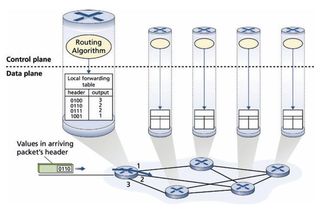

    * 此圖展示了傳統的*每路由器控制 (Per-router control)* 架構。在這種架構中，**控制層與資料層是綁定在同一台實體設備內的**。
    * 每一台路由器內部都運行著一個路由演算法元件，這些元件透過路由協定（如 OSPF 或 BGP）與其他路由器的路由元件互相溝通，並由本地端計算出該路由器的轉發表。

**SDN 控制層架構解析**：

    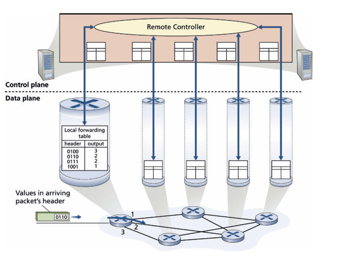

    * 此圖展示了軟體定義網路 (Software-Defined Networking, SDN) 架構。在此架構中，控制層與資料層被**明確地實體分離**。
    * 路由計算功能被移出路由器，交由一個位於遠端、邏輯上集中的*控制器 (Remote Controller)* 負責。路由器本身退化為單純執行轉發動作的資料層設備，而遠端控制器負責計算好全網的轉發表後，再透過控制通道派發並安裝至各台路由器中。

### 網路服務模型 (Network Service Model)

* **服務模型的定義**：網路服務模型決定了封包在端到端傳遞過程中的特性與行為邊界。理論上，網路層可以設計出提供各種嚴格保證的服務模型，例如：保證交付 (Guaranteed delivery)、具備延遲上限的保證交付、確保封包依序送達、保證最小可用頻寬，或提供底層加密的安全性保證。
* **網際網路的選擇：盡力而為服務 (Best-effort service)**：
  * 網際網路底層 (IP 協定) 採取了一種極簡的架構哲學，僅提供*盡力而為*的服務。這代表網路層**不保證**封包會成功送達，**不保證**到達的先後順序，也**不保證**任何端到端的延遲時間與可用頻寬。
  * **見解**：雖然表面上這是一種「不提供任何保證」的服務，但這種將複雜性推向網路邊緣（依賴上層如 TCP 提供可靠性或應用層提供緩衝適應）的設計，造就了網際網路極佳的擴展性。結合現今充足的頻寬配置 (Bandwidth provisioning) 以及自適應的應用層協定（例如 DASH 串流傳輸），盡力而為的基礎架構已經足以順暢支撐如 Netflix 或 Zoom 等對延遲與頻寬高度敏感的即時應用。

## 路由器內部架構解析 (What’s Inside a Router?)

1. 路由器的四大核心組件
  路由器主要由四個核心元件構成，並在架構上嚴格區分*資料層 (Data Plane)* 與*控制層 (Control Plane)*：
  * **輸入埠 (Input Ports)：** 負責實體層終止、資料鏈結層處理，以及最關鍵的*查表與轉發 (Lookup and Forwarding)* 功能，決定封包應被送往哪個輸出埠。
  * **交換結構 (Switching Fabric)：** 路由器內部的網路，負責將封包從輸入埠移動到正確的輸出埠。
  * **輸出埠 (Output Ports)：** 暫存從交換結構過來的封包，並執行排程、鏈結層與實體層傳輸。
  * **路由處理器 (Routing Processor)：** 負責控制層的軟體功能（如執行 OSPF/BGP 路由協定、計算轉發表，或與 SDN 控制器通訊）。

2. 硬體 vs. 軟體的實現層次

    * **資料平面（Data Plane，奈秒級 ns）：** 輸入埠、輸出埠、交換結構皆由硬體（ASIC / 專用晶片）實作，因為在極高頻寬（如 100 Gbps，處理一個 64-byte 封包僅有 5.12 ns）下，軟體完全無法負荷。
    * **控制平面（Control Plane，毫秒至秒級 ms~s）：** 路由處理器由傳統 CPU（軟體）執行，處理路由運算、網路管理等較不頻繁但複雜的任務。

3. 轉發模式（Forwarding Paradigms）

    * **基於目的地的轉發 (Destination-Based Forwarding)：** 僅根據封包的目的地 IP 決定出口。
    * **通用轉發（Generalized forwarding）：** 依據多個欄位（如來源 IP、通訊協定、埠號等）做更靈活的決策（常用於 SDN/OpenFlow）。

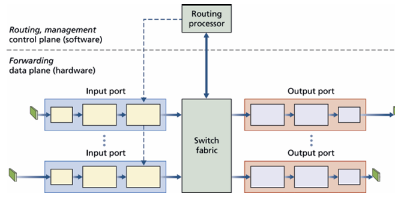

此圖展示了路由器的系統架構。上半部虛線上方為軟體實作的*路由與管理控制層*，運作於毫秒或秒級時間尺度；下半部為硬體實作的*轉發資料層*（包含輸入埠、交換結構與輸出埠），必須在奈秒級時間尺度內完成高速處理。

該圖上水平虛線分割，
  * 上方為*控制平面（軟體）*：由 Routing processor（路由處理器） 構成，負責計算與決策。
  * 下方為*資料平面（硬體）*：包含 Input ports、Switch fabric、Output ports，負責高速轉發。

在 100 Gbps 輸入鏈路傳輸 64-byte 封包時，輸入埠僅有 5.12 ns 處理時間。其計算公式如下：

* 公式：
$$\text{封包傳輸時間（Transmission Delay } t\text{）} = \frac{\text{封包大小（Packet Size } L\text{）}}{\text{鏈路傳輸速率（Transmission Rate } R\text{）}}$$
* 代入數值計算：
  * $L = 64 \text{ bytes} = 64 \times 8 \text{ bits} = 512 \text{ bits}$
  * $R = 100 \text{ Gbps} = 100 \times 10^9 \text{ bps}$
  
  $$t = \frac{512 \text{ bits}}{100 \times 10^9 \text{ bps}} = 5.12 \times 10^{-9} \text{ 秒} = 5.12 \text{ ns}$$
* 公式意涵：此計算證明在高速鏈路下，封包間隔極短。若一張線卡（Line card）整合了 $N$ 個連接埠，處理管線必須在 $\frac{5.12}{N} \text{ ns}$ 內完成單一封包處理，這也是資料平面轉發無法由傳統軟體 CPU 處理、必須全硬體加速的主因。

### 輸入埠處理與基於目的地的轉發 (Input Port Processing and Destination-Based Forwarding)

* **分散式查表：** 轉發表會從路由處理器複製到每個輸入埠的線卡 (Line card) 上，讓查表動作在本地端完成，避免中央處理器瓶頸。
* **最長前綴匹配 (Longest Prefix Matching Rule)：** 當目的 IP 位址與轉發表中多個子網路前綴重疊時，系統會選擇*匹配位元數最長*的條目進行轉發。
* **TCAM 記憶體硬體加速：** 為了在十億位元 (Gigabit) 速率下完成查表，實務上廣泛使用三態內容可定址記憶體 (TCAM)。給定一個 IP 位址，TCAM 可以在*單一個時脈週期 (One clock cycle)* 內硬體比對並回傳結果。
* **匹配加動作（Match plus Action）：** 輸入埠的本質是比對目的 IP（Match）並送入特定輸出埠（Action）。

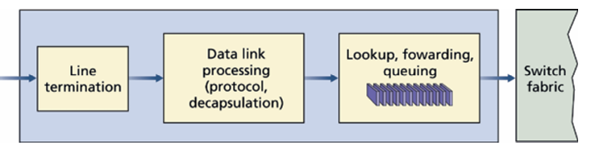

上圖展示了輸入埠內部的流水線作業，封包依序經過**線路終止**(負責實體層訊號轉換與位元流接收)、**資料鏈結處理**(負責驗證訊框協定、解封裝以取出 IP 資料包)，最後進入核心的**查表、轉發與佇列**(依轉發表決定輸出埠；若交換結構正被其他輸入埠佔用，封包會暫存於此佇列中等待排程) 單元等待進入交換結構(封包處理完畢並獲准進入後，送往交換結構進行內部傳輸)。

### 交換結構 (Switching)

交換結構是路由器的核心，常見的實作技術有三種：

* **透過記憶體交換 (Switching via memory)：** 封包由輸入埠複製到處理器記憶體，再由處理器複製到輸出埠。若記憶體頻寬為 $B$ packets/sec，則整體系統吞吐量極限為 $B/2$。

* **透過匯流排交換 (Switching via a bus)：** 輸入埠透過共用匯流排直接將封包傳至輸出埠。由於匯流排一次只能容納一個封包，整體吞吐量受限於單一匯流排的頻寬。

* **透過互連網路交換 (Switching via an interconnection network)：** 採用縱橫式 (Crossbar) 交換器，由 $2N$ 條匯流排交織而成。這是一種「無阻塞 (Non-blocking)」架構，允許多個封包平行傳輸。進階架構還能將封包切分為 $K$ 個小區塊，透過 $N$ 個平行交換結構「噴灑 (Spraying)」傳輸以提升擴展性。

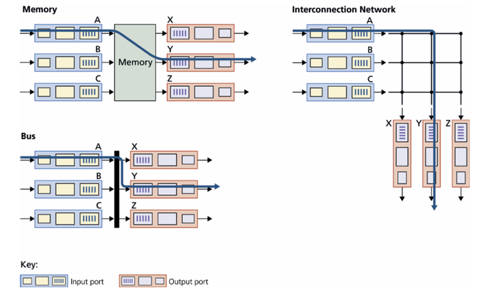

上圖像化呈現上述三種架構。Memory 顯示封包進出中央記憶體；Bus 顯示封包共用一條粗黑線；Interconnection Network 則展示了網格狀的 Crossbar 節點，封包可透過不同的交會點平行穿越。

---

### 輸出埠處理 (Output Port Processing)

* **功能流程：** 輸出埠會將來自交換結構的封包放入緩衝區（佇列），進行排程與緩衝區管理後，再進行資料鏈結層的封裝與實體層傳輸。

* **Switch fabric：** 封包自交換結構抵達。
* **Queuing (buffer management)：** 當抵達速率大於外送鏈路速率時，封包暫存於此佇列，並進行封包丟棄與排程決策。
* **Data link processing：** 負責資料鏈結層訊框封裝（Encapsulation）與協定處理。
* **Line termination：** 將位元轉換為實體訊號送上實體鏈路。

---

### 佇列發生於何處？ (Where Does Queuing Occur?)

佇列（排隊）發生的位置: 排隊可發生在輸入埠（Input Ports）或輸出埠（Output Ports），取決於流量負載、交換結構速率與線路傳輸速率。當記憶體緩衝區耗盡時，會發生封包遺失（Packet Loss / Drop）。

無輸入端排隊條件：

$$R_{\text{switch}} \ge N \cdot R_{\text{line}}$$

若交換結構傳輸速率 $R_{\text{switch}}$ 至少是單條線路速率 $R_{\text{line}}$ 的 $N$ 倍，即使 $N$ 個輸入埠同時以最大線速抵達封包，交換結構也能在下一批封包抵達前清空，因此輸入端完全不會產生排隊延遲。

佇列的堆積可能導致記憶體耗盡與封包遺失 (Packet loss)，其發生位置取決於交換結構與線路速率的比例：
* **輸入佇列與 HOL 阻塞：** 
  * 若交換結構不夠快，封包會在輸入端排隊。
  * 在 Crossbar 架構下會發生「線頭阻塞 (Head-of-the-Line, HOL) blocking」：排在佇列最前端的封包若因輸出埠壅塞而受阻，會連帶擋住其後方原本可以前往空閒輸出埠的封。系統理論證明，受 HOL 阻塞影響，只要輸入鏈路到達率達到容量的 58%，輸入佇列就會無限增長。

  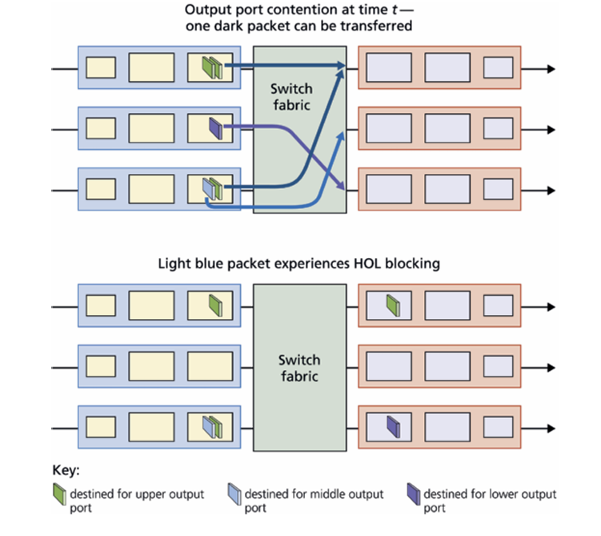
    * 上半部（時間 $t$）：上方輸入佇列前端為「深藍色封包（送往上方輸出埠）」，下方輸入佇列前端為「深綠色封包（同樣送往上方輸出埠）」。由於爭用同一輸出埠，交換結構決定傳送深藍色封包，深綠色封包被迫在輸入端等待。
    * 下半部（時間 $t$ 之後）：下方輸入佇列中，排在深綠色後面的「淺藍色封包（送往中間輸出埠）」雖然其目標輸出埠完全閒置，但因為前面的深綠色封包被卡住，導致淺藍色封包也無法被傳送，這就是 HOL（Head-of-the-Line）阻塞。

* **輸出端佇列與主動佇列管理（AQM）：**
  * 即使交換結構極快（如 $R_{\text{switch}} = N \cdot R_{\text{line}}$），若多個輸入埠同時將封包送往同一個輸出埠，封包仍會在輸出埠排隊。
  * **丟棄策略：**緩衝區滿時可採用尾端丟棄（Drop-tail），或採用主動佇列管理（Active Queue Management, AQM）演算法（如 RED、PIE、CoDel）在緩衝區完全填滿前主動丟棄或標記封包，向發送端發出壅塞警示。

  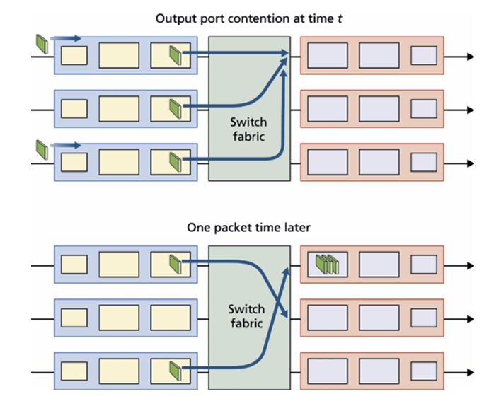

    * 時間 $t$：多個輸入埠同時將封包送往同一個上方輸出埠，交換結構將這批封包全數轉發至該輸出埠的緩衝佇列中。
    * 時間 $t$ 之後（One packet time later）：輸出端線路僅能傳送完其中一個封包，其餘封包仍在佇列排隊；同時又有新的封包持續送達，導致輸出端佇列進一步累積。

* **緩衝區大小與緩衝區膨脹（Bufferbloat）**
  * 經典經驗法則：$B = \text{RTT} \cdot C$。
    * 計算範例驗證：若 $\text{RTT} = 250 \text{ ms} = 0.25 \text{ s}$，鏈路容量 $C = 10 \text{ Gbps}$：$$B = 0.25 \text{ s} \times 10 \text{ Gbps} = 2.5 \text{ Gbits of buffer}$$
  * 多 TCP 串流法則：$B = \frac{\text{RTT} \cdot C}{\sqrt{N}}$（當有大量獨立 TCP 串流時，所需緩衝區顯著縮小）。
    * $N$ 為穿越該鏈路的獨立 TCP 連線數量。當 $N$ 很大時（如骨幹核心路由器），所需緩衝區容量可大幅縮減。
  * Bufferbloat 問題：過大的緩衝區雖然降低了封包遺失率，但會導致封包長時間排隊，造成持續且嚴重的端到端排隊延遲（Persistent Queuing Delay），對即時性應用（如電競、視訊會議）造成嚴重影響。
    * 封包大小 $L$ 在傳輸速率 $C$ 下的單一封包傳輸時間為 $20 \text{ ms}$。
    * 若 $t=0$ 時突發傳入 25 個封包，發送端每隔 $20 \text{ ms}$ 傳送一個封包。
    * 當 $\text{RTT} = 200 \text{ ms}$ 時，第一個封包的 ACK 在 $t = 200 \text{ ms}$ 抵達發送端，此時輸出端剛好傳輸完第 10 個封包，佇列剩下 $25 - 10 = 15$ 個封包。
    * 發送端收到 ACK 後觸發傳送新封包進入佇列。結果佇列會永遠維持在 5 個封包的長度，產生持續性排隊延遲：$$\text{排隊延遲} = 5 \times 20 \text{ ms} = 100 \text{ ms}$$

  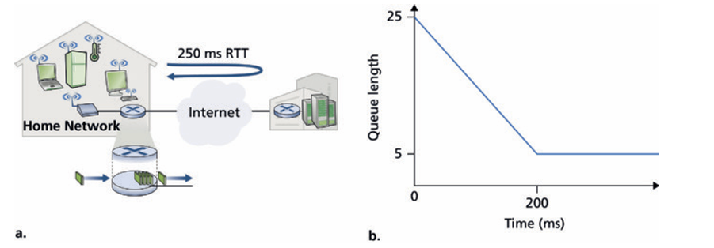
    * a：家庭網路經由家用路由器連至網際網路（$\text{RTT} = 250 \text{ ms}$），玩家傳送遊戲封包時遇到大型 TCP 突發流量。
    * b（Queue length vs. Time）：展示佇列長度在經過 $200 \text{ ms}$ 後並不會歸零，而是持續維持在非零常數（固定維持 5 個封包長度），證明過大的緩衝區會建立長期不退的排隊延遲。

---

### 4.2.5 封包排程 (Packet Scheduling)

封包排程（Packet Scheduling）核心目的是決定輸出鏈路上的排隊封包以何種順序被傳輸送到外送鏈路上。

路由器輸出埠必須決定傳送封包的順序，常見的演算法包括：

1. 先進先出（FIFO / FCFS）：完全按照封包抵達的先後順序進行服務，不區分流量類型。

  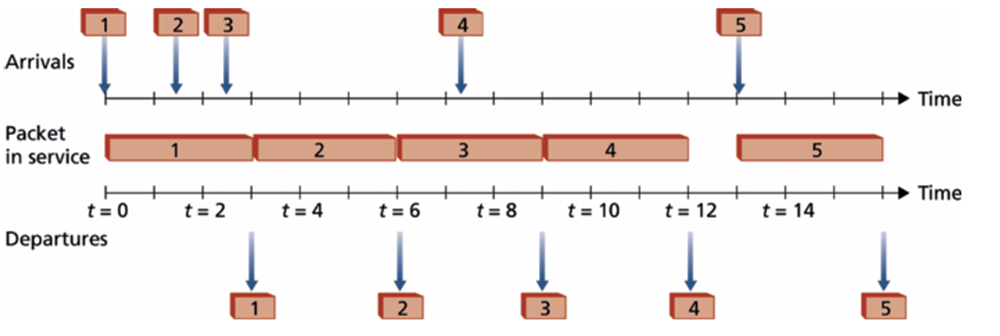
  
  * 封包 1 在 $t=0$ 到達並立即傳輸；封包 2、3 在封包 1 傳輸期間相繼到達。
  * 傳輸順序嚴格遵循抵達順序：封包 1 $\to$ 封包 2 $\to$ 封包 3 $\to$ 封包 4 $\to$ 封包 5。

2. 優先權排程（Priority Queuing, PQ）：將封包依類別分流至不同優先權佇列。只要高優先權佇列有封包，永遠優先傳送；低優先權封包可能面臨飢餓（Starvation）。具有非搶占式（Non-preemptive）特性（若低優先權封包已開始傳輸，不會被中途打斷）。

  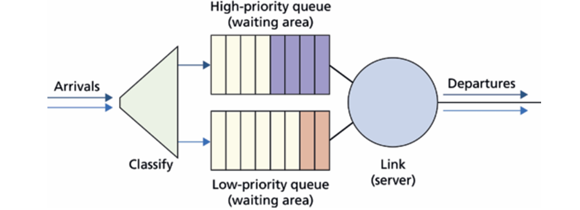

  * 到達的封包先依標頭分類（Classify），分別送入高優先權佇列或低優先權佇列。
  * 傳輸排程器（圓形）會先清空高優先權佇列，才輪到低優先權佇列。

  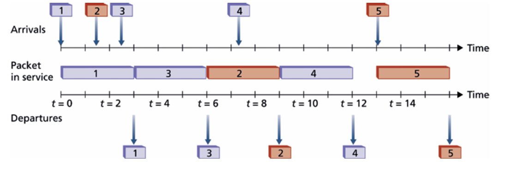
  
  * 封包 1（低優先權）於 $t=0$ 開始傳輸；封包 2（低優先權）與封包 3（高優先權）在傳輸途中抵達。
  * 由於非搶占式特性，封包 1 傳輸不會中斷。但當封包 1 傳完時，排程器優先選擇高優先權的封包 3 傳輸，之後才傳輸封包 2。

3. 循環輪詢（Round Robin, RR）：將流量分類，排程器依序在各個類別之間輪流服務（例如 1 $\to$ 2 $\to$ 1 $\to$ 2）。具備工作守恆（Work-conserving）特性，若輪到的類別無封包，會立即檢查下一個類別而不讓鏈路閒置。

  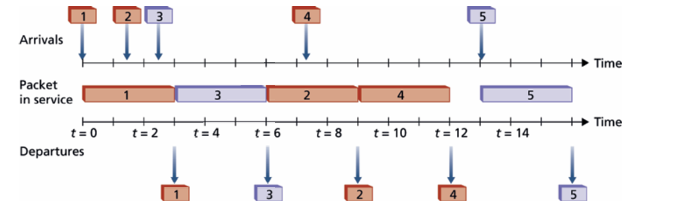

  * 類別 1 包含封包 1, 2, 4；類別 2 包含封包 3, 5。
  * 封包 1（類別 1）傳完後，輪詢排程器切換至類別 2 傳輸封包 3；接著再切回類別 1 傳輸封包 2。傳完封包 2 後，因類別 2 此時無封包，排程器發揮工作守恆特性，直接傳輸類別 1 的封包 4。

4. 加權公平佇列（Weighted Fair Queuing, WFQ）：循環輪詢的廣義泛化版本。為每個類別 $i$ 分配權重 $w_i$，使各類別依權重比例分配鏈路頻寬，保證最低頻寬服務。

  在 WFQ 機制下，假設每個類別 $i$ 分配到的權重為 $w_i$，外送鏈路的總傳輸速率為 $R$。當所有類別皆有封包等待傳輸時，類別 $i$ 保證可獲得的傳輸頻寬（Throughput）為：$$\text{Throughput}_i \ge R \cdot \frac{w_i}{\sum_j w_j}$$

  * $w_i$：類別 $i$ 的權重值。
  * $\sum_j w_j$：所有「目前有封包等待傳輸（Active）」的類別權重總和；若在最差情況（Worst-case）下，分母即為所有類別的權重總和。
  * $\frac{w_i}{\sum_j w_j}$：類別 $i$ 所獲得的頻寬分額比例（Fraction of bandwidth）。
  
  * 驗證範例：
    * 設總頻寬 $R = 10 \text{ Gbps}$，共有三個類別，權重分別為 $w_1 = 1, w_2 = 1, w_3 = 2$。
    * 權重總和 $\sum w_j = 1 + 1 + 2 = 4$。
    * 類別 3 獲得的保證頻寬為：
      $$\text{Throughput}_3 \ge 10 \text{ Gbps} \times \frac{2}{4} = 5 \text{ Gbps}$$
    * 類別 1 與 2 各保證獲得：
      $$\text{Throughput}_{1, 2} \ge 10 \text{ Gbps} \times \frac{1}{4} = 2.5 \text{ Gbps}$$

  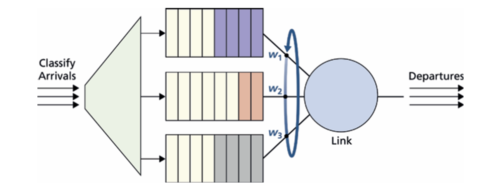
  
 * 封包到達後分類至多個佇列，每個佇列被賦予專屬權重（$w_1, w_2, w_3$）。
 * 排程器依權重比例循環服務各佇列，保證公平性與最低頻寬。

##  The Internet Protocol (IP): IPV4, Addressing, IPV6, and More

* **網際網路資料層的核心：**
    雖然我們常說 IP 層，但網際網路的網路層實際上包含三大核心元件：**IP 協定**本身、**路由協定**（如 OSPF 與 BGP）以及**網際網路控制訊息協定 (ICMP)** 。本節聚焦於核心的 IP 協定與定址架構。
* **版本並存現況：**
    目前網際網路正處於 **IPv4** 與 **IPv6** 共同部署的過渡期，理解這兩者的定址與轉換機制是建構現代大型網路必備的底層知識。

---

### IPv4 資料報格式 (IPv4 Datagram Format)
* **標頭欄位**
    * **版本號 (Version, 4 bits)：** 識別此資料報所屬的 IP 協定版本（IPv4 欄位值為 4），讓路由器能正確解析後續欄位。
    * **標頭長度 (Header Length, 4 bits)：** 用於指定 IP 標頭的實際長度（以 32 位元雙字組為單位）。
    * **服務類型 (Type of Service, TOS, 8 bits)：** 區分不同種類的資料報（如 VoIP 等即時流量與普通 FTP 流量），以便網路管理員實施差分服務策略，其中 2 bits 用於顯式壅塞通知 (ECN)。
    * **資料報長度 (Datagram Length, 16 bits)：** 包含標頭與 Payload 的總位元組數。
    **【計算數據】** 理論最大值為 $2^{16}-1 = 65,535$ 位元組，但實務上通常限制在 **1,500 位元組**以內，以完美嵌入以太網路的最大傳輸單元 (MTU) 之中，避免在鏈結層發生切割。
    * **識別碼、旗標、分段偏移 (Identifier, Flags, Fragmentation Offset)：** 用於 IPv4 資料報的分段與重組。由於高效率路由器不希望在傳輸途中進行耗時的重組，因此這些欄位在 IPv6 中已被廢除。
    * **存活時間 (Time-to-Live, TTL, 8 bits)：** 防止資料報因路由迴圈 (Routing loop) 在網路中無限循環。封包每經過一台路由器，該值便會**減 1**，歸零時封包即被捨棄。
    * **上層協定 (Protocol, 8 bits)：** 指明資料報到達終點後應交付給哪一個傳輸層協定（例如：數值 `6` 代表 TCP，數值 `17` 代表 UDP）。此欄位是網路層與傳輸層的關鍵黏合劑。
    * **標頭總和檢查碼 (Header Checksum, 16 bits)：** 利用 1 的補數加總，僅針對 **IP 標頭位元組**進行偵錯。由於 TTL 欄位在每經過一台路由器時都會改變，因此**每一站路由器都必須重新計算並寫入此檢查碼**。
    * **來源與目的 IP 位址 (Source & Destination IP, 各 32 bits)：** 封包建立時寫入的端到端定址資訊。
    * **選項 (Options)：** 允許標頭進行擴充。但因長度可變會導致路由器硬體加速處理困難，實務上極少使用，在 IPv6 中已被移除。
    * **標頭開銷與計算：**
        * **【計算數據】** 一個不包含選項的標準 IPv4 標頭長度為 **20 位元組** ``。
        * **【開銷佔比計算】** 若此 IP 封包封裝了一個標準 TCP 區段 (標頭 20 位元組)，則端到端標頭總開銷至少為 **40 位元組** ``。

---

### IPv4 定址 (IPv4 Addressing)

1. 介面與 IP 位址的基本觀念
  *  在網路架構設計中，IP 位址並非直接與「主機」或「路由器」綁定，而是與物理鏈結之間的邊界——介面(Interface) 綁定。
  * 一般終端主機 (Host) 通常僅擁有單一網路介面與一條實體鏈結；而路由器 (Router) 作為轉發樞紐，必須連接兩條或更多鏈結，因此路由器必然擁有兩個或更多個網路介面
  * 每個介面都必須配置一個全球唯一的 IP 位址（位於 NAT 後方的私有位址除外）

2. 位址長度與表示法：
  * IPv4 位址長度為 32 位元 (32-bit / 4 位元組)。
  * 全球理論位址空間上限為 $2^{32} \approx 42.9$ 億個位址。
  * 實務上採用點分十進位法 (Dotted-decimal notation) 表示，將 32 位元拆分為 4 個獨立的十進位位元組，並以點(.)分隔。範例：`11000001 00100000 11011000 00001001` 在十進位系統下映射為 `193.32.216.94`。

3. 子網路與孤島定義法則
  *  子網路 (Subnet) 的本質
    * 在不經由路由器轉發的情況下，多個主機介面與路由器介面透過實體媒介（如以太網路交換器、無線 AP）直接相連，所構成的無路由器實體網路區域，稱為一個子網路。
    * 子網路中的所有介面，其 IP 位址的前置位元（網路部分）皆完全相同。

    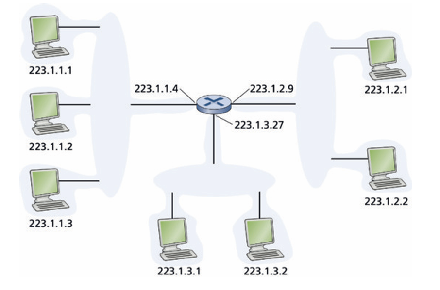

  * 子網路遮罩 (Subnet Mask)
    * 採用 `/x` (Slash-x) 的無類別表示法（例如 223.1.1.0/24），其中 `/24` 代表該 IP 位址的最左側 24 位元為網路前綴 (Network prefix)，用於標識該子網路。

    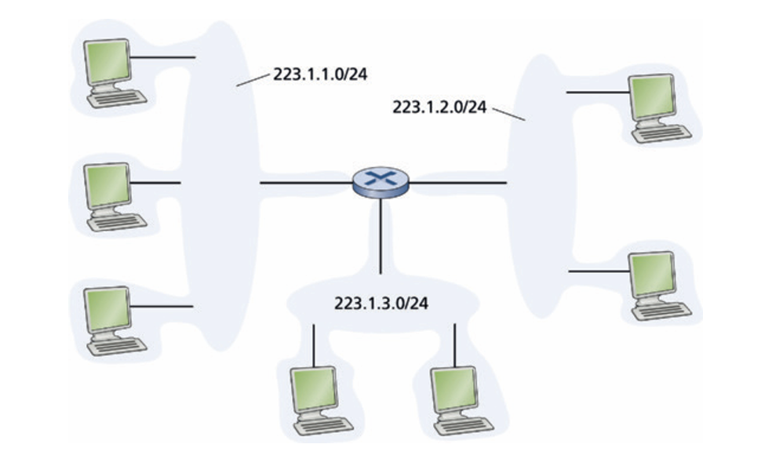

4. 無類別網域路由 (CIDR) 與歷史包袱的有類別定址 (Classful Addressing)
  * 有類別定址 (Classful Addressing)
    * 在 CIDR 誕生前，網際網路強制將子網路長度限制在 8、16 或 24 位元，即 A、B、C 類網路。
    * Class C (/24) 僅能容納 $2^8 - 2 = \mathbf{254}$ 台主機，對中型組織而言容量太小。
    * Class B (/16) 支援高達 $\mathbf{65,534}$ 台主機，對多數企業而言又過於龐大。
  * 無類別網域路由 (CIDR, Classless Interdomain Routing)
    * IDR (RFC 4632) 徹底打破了有類別的位元限制，IP 位址被定義為 **a.b.c.d/x**，其中 **/x** 的 x 可以是 1 到 31 之間的任意數值
    * 位址的前 x 位元為網路字首 (Network prefix / Prefix)，剩下 `32-x` 位元用來識別組織內部的特定主機，這極大地提升了位址空間的分配效率與利用彈性

5. 路由聚合與最長字首匹配 (Route Aggregation and Longest Prefix Matching)
  * 階層化定址與路由聚合 (Route/Address Aggregation)
    * **縮減轉發表：** 透過 CIDR 的層級化位址分配，ISP 可以將多個連續的組織子網路聚合為單一前綴向外宣告（例如將 8 個 `/23` 網段聚合為一個 `/20` 宣告）。
    * **最長前綴匹配的救贖：** 當某個組織搬遷至另一個 ISP、導致層級結構遭到破壞時，新的 ISP 會單獨為其宣告一條長度較長（更為具體）的 `/23` 路由。全球路由器會根據「最長前綴匹配原則 (LPM)」將流量精準引導至新 ISP，而無須更動原本 `/20` 的聚合路由。

6. 特殊 IP 位址與全球定址獲取
  * IP 廣播位址 (IP Broadcast Address)：
    * `255.255.255.255` 為本地子網路受限廣播位址
    * 當主機以此位址為目的端發送資料報時，訊息會被交付給同一個子網路內的所有主機。一般情況下，路由器會強制阻斷並不會轉發此廣播封包，以防止廣播風暴擴散

7. 動態主機配置協定 (DHCP) 全套流程
  * 是一種隨插即用 (Plug-and-play) 或零組態 (Zeroconf) 的應用層協定
  * 它允許新加入子網路的主機自動獲取臨時或永久的 IP 位址，並同時學習到：子網路遮罩 (Subnet Mask)、預設閘道 (Default Gateway，第一跳路由器位址)、以及本地 DNS 伺服器位址。
  * DHCP 中繼代理人 (DHCP Relay Agent)
    * 由於 DHCP 初始化請求是廣播封包，而廣播無法穿越路由器，因此若子網路內沒有實體 DHCP 伺服器，必須在第一跳路由器上配置中繼代理，將廣播請求封裝為單播 (Unicast) 送往遠端的 DHCP 伺服器。
  * DHCP 4 步驟交易時序 (FSM 狀態轉移)
    1. **DHCP 伺服器發現 (Discover)**
      * 新加入主機發送廣播發現封包
      * 套接字配置：Source IP: 0.0.0.0 (Port 68) $\rightarrow$ Destination IP: 255.255.255.255 (Port 67)。
    2. **DHCP 伺服器提供 (Offer)**
      * 子網路內的所有 DHCP 伺服器收到發現封包後，回傳建議的配置參數
        * 交易 ID (Transaction ID)、建議分配給用戶端的 IP 地址 (yiaddr)、子網路遮罩、以及地址租約時間 (Lease Time)。
    3. **DHCP 請求 (Request)**
      * 用戶端在收到的多個 Offers 中選擇一個，發送請求封包確認接受該引數 (Port 67)。
    4. **DHCP 確認 (ACK)**
      * 被選中的伺服器回傳 ACK，確認參數綁定，用戶端正式啟用該 IP 位址

  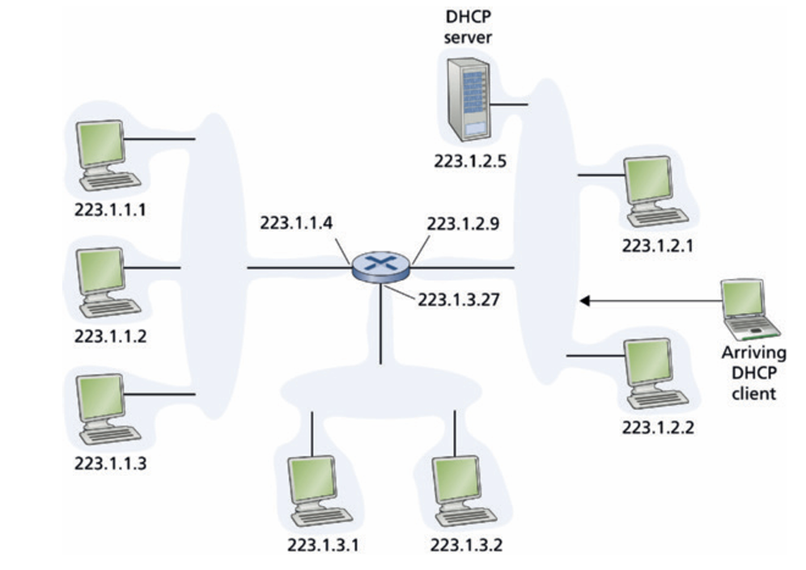

  呈現一台 DHCP 伺服器與中繼路由器的實體部署。路由器位於兩側不同的子網路（223.1.1/24 與 223.1.2/24）之間，扮演著中繼代理人 (Relay Agent) 的角色，負責在兩側轉發廣播。

  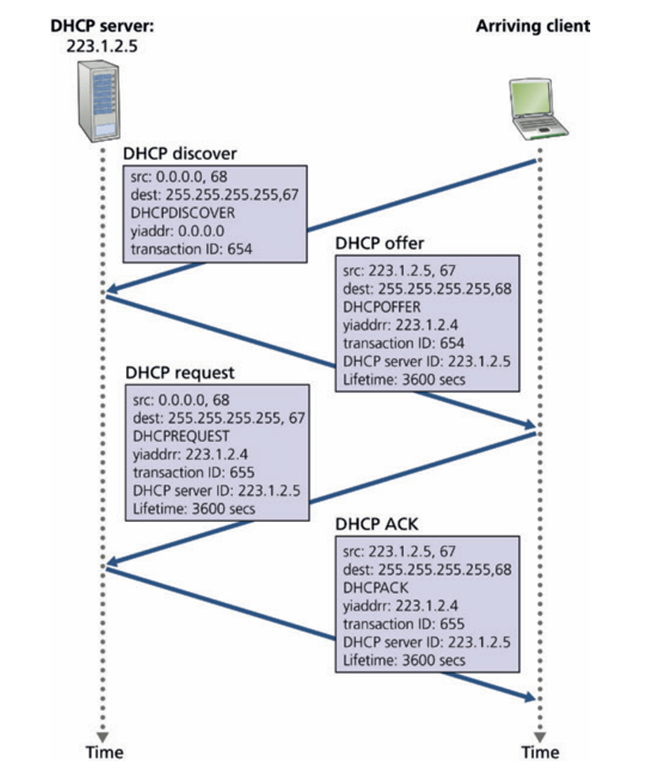

  圖中繪製出 Discover、Offer、Request、ACK 四步藍色箭頭往返。詳細列出了每次傳輸的封包內部標頭變數（包括 Source/Dest Port 67與68、Transaction ID、以及分配的臨時位址 yiaddr: 223.1.2.4、租約生命週期 Lifetime: 3600 secs），精確還原了底層控制平面的協定狀態轉移。

### 網路位址轉換 (Network Address Translation, NAT)

1. 設計初衷與私有位址空間 (Private Address Space)
  * 解決邊緣定址擴展痛點：隨著小辦公室/家庭辦公室 (SOHO) 網路及行動裝置的爆發，若為組織內的每台設備（如手機、平板、印表機等）都分配一個全球唯一的公網 IPv4 位址，在實務上是不可能的，且管理成本極高
  * 私有地址空間
    * 系統架構中特別開闢了三段*僅在區域網路 (LAN) 內部有意義、無法在公網 Internet 上進行路由*的私有位址空間 
      * 10.0.0.0/8
      * 172.16.0.0/12
      * 192.168.0.0/16
  * 私人領域 (Private Realm)：全球有數以百萬計的家庭網路同時複用相同的 10.0.0.0/24 私有網段。在 LAN 內部，主機之間可以直接利用私有位址通訊，但在跨越邊界進入 Internet 時，必須進行地址重寫轉換 

2. NAT 運作核心：埠號多工與轉換表 (NAPT & Translation Table)
  * 單一 IP 隱藏細節：對外部 Internet 而言，一整個 NAT 邊緣網路看起來就像是*單一台擁有單一公網 IP*的實體設備。所有流出該網路的封包，其來源 IP 都會被改寫為該公網 IP；所有流入的封包，其目的 IP 也必須是該公網 IP 
  * NAT 轉換表 (NAT Translation Table) 的關鍵作用：為了讓只有單一公網 IP 的路由器知道該將收到的外部封包轉發給哪一台內部私網主機，路由器利用了*「IP 位址 + 傳輸層埠號 (Port Number)」*組成的對應條目來做索引
  * 併發連線極限
    * TCP/UDP 的埠號欄位長度為 16 位元 (16-bit)
    * 這代表單一公網 IP 在配合 NAT 埠號轉譯（NAPT）時，理論上可以同時支援超過 60,000 個獨立的併發連線 (Simultaneous connections) 
 
  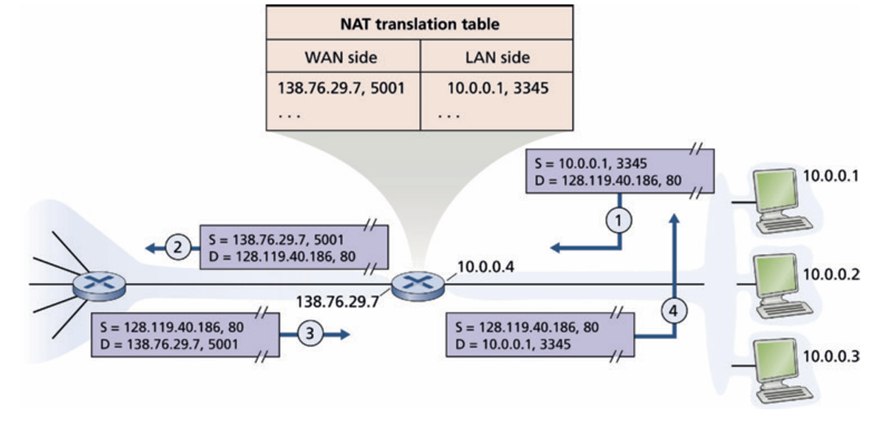

  該圖一個家用 NAT 路由器。其左側為 WAN 側公網（配置單一 IP 138.76.29.7），右側為私網 LAN（配置 10.0.0.0/24 網段，連接了 10.0.0.1 等三台 PC）。  圖上方展示了轉換表條目，其中一筆映射為 WAN 側 `138.76.29.7, 5001 <--> LAN 側 10.0.0.1, 3345`。流程:

  1. LAN 主機發送請求
    私網主機 `10.0.0.1` 欲瀏覽公網網頁伺服器 `128.119.40.186:80`，動態分配本地來源埠號 `3345`，發送封包。原始 IP/TCP 標頭：Source: 10.0.0.1:3345 $\rightarrow$ Dest: 128.119.40.186:80。 
  2. NAT 路由器重寫並查表
    路由器收到封包，將來源 IP 改寫為 WAN 側公網 IP `138.76.29.7`，並動態生成一個目前未被占用的新來源埠號 `5001`，同時將此映射記入 NAT 轉換表中，最後將封包送往公網。改寫後 IP/TCP 標頭：Source: 138.76.29.7:5001 $\rightarrow$ Dest: 128.119.40.186:80。
  3. 外部伺服器回覆
    伺服器在不知情的情況下，將回應封包發回給公網上的 NAT 路由器。伺服器回覆標頭：Source: 128.119.40.186:80 $\rightarrow$ Dest: 138.76.29.7:5001。
  4. NAT 逆向還原轉發
    路由器收到回覆後，以目的埠號 `5001` 為索引查詢 NAT 轉換表，精確匹配出應還原的目的端為 `10.0.0.1:3345`，進行改寫並轉發回私網 LAN。還原後 IP/TCP 標頭：Source: 128.119.40.186:80 $\rightarrow$ Dest: 10.0.0.1:3345 

4. 運營商級 NAT (Carrier-Grade NAT, CGNAT)
  * 雙重 NAT 架構 (Double NAT)
    * 當電信運營商 (ISP) 自身的公網 IPv4 地址塊亦面臨不足時，ISP 會在骨幹網側對多個家庭網關路由器實施二次 NAT 轉換，這稱為運營商級 NAT (CGNAT) 
    * 在此架構下，封包從終端發出到進入公網 Internet，會經歷兩層 NAT 重寫（家庭內部私網 $\rightarrow$ ISP 內部私網 $\rightarrow$ Internet 公網）
  * ISP 專用私有網段 (RFC 6598)
    * 為了防止第一級家庭 NAT 與第二級 ISP NAT 選擇了重疊的私有網段而造成定址衝突，RFC 6598 專門為運營商 CGNAT 開闢了獨立的專用私有 IP 位址塊：100.64.0.0/10

5. 計算機科學與架構爭議 
  * 違反嚴格分層原則 (Layering Violation)： 路由器在定義上是 Layer 3 (網路層) 設備，應當只處理 IP 標頭。然而，NAT 卻強行檢索並修改了屬於 Layer 4 (傳輸層) 的 TCP/UDP 埠號，嚴重越權，破壞了網路協議棧的獨立性 
  * 破壞端到端通訊原則 (End-to-End Argument)： 端到端原則要求網路核心（Core）僅負責傳輸，應由端點（Hosts）直接進行對話，中間節點不應修改通訊標頭。NAT 的介入破壞了這種透明性。
  * 阻礙 P2P 與伺服器主動連線： 由於私網主機沒有公網 IP，外部設備無法主動向私網內的伺服器（或 P2P 對等節點）發起 TCP 建立請求（SYN 封包），因為 NAT 轉換表中不存在對應的入站主動對應條目

6. NAT 穿透 (NAT Traversal)
  * STUN 技術 (Session Traversal Utilities for NAT - RFC 5389)： 允許位於 NAT 後方的客戶端向公網上的 STUN 伺服器進行探測，藉此發現自己被 NAT 轉換後的公網 IP 地址與埠號對，隨後將其通告給 Peer 端，以嘗試建立直接的打洞 (Hole Punching) 連線

---

### IP 版本 6 (IPv6)

1. IPv6 資料報格式與欄位解析
  * 超大規模定址空間： 位址長度從 32 bits 巨幅擴充至 128 bits (16 位元組)。這能提供約 $3.4 \times 10^{38}$ 個位址，使地球上每一顆沙子都擁有獨立的 IP 位址。此外，除單播 (Unicast) 與多播 (Multicast) 外，新增了*任播位址 (Anycast address)*，可將封包導向同一組伺服器中物理距離最近的節點
  * 40 位元組固定長度標頭 (40-byte Fixed Header)： 捨棄了 IPv4 的可變長度標頭，改採固定的 40 位元組，這使得高級路由器能以硬體流水線 (Pipelining) 進行極速解碼與轉發

  

  * **IPv6 標頭欄位：**
    * **Version (4 bits)：** 欄位值為 `6`。
    * **Traffic Class (8 bits)：** 類似 IPv4 的 TOS，用於 QoS 優先權區分。
    * **Flow Label (20 bits)：** 允許發送端將特定封包標註為同一個「流 (Flow)」，以便路由器提供非預設的 QoS 或實時處理。
    * **Payload Length (16 bits)：** 記錄固定 40 位元組標頭之後的資料位元組數。
    * **Next Header (8 bits)：** 類似 IPv4 的 Protocol 欄位，指明承載的是 TCP/UDP，或是 IPv6 的擴充選項（如分段選項、安全加密選項等）。
    * **Hop Limit (8 bits)：** 替代 IPv4 的 TTL，同樣是每過一站減 1。

2. 與 IPv4 標頭之關鍵差異

  | 欄位狀態 | IPv4 標頭欄位 | IPv6 轉變與對應欄位 |
  | :--- | :--- | :--- |
  | **保留欄位** | Version, TOS, Source/Dest IP, Protocol | Version, Traffic Class, Source/Dest IP, Next Header `` |
  | **重命名欄位** | Datagram Length, TTL | Payload Length, Hop Limit `` |
  | **徹底移除** | Header Checksum | **完全移除**（因 L2 與 L4 已有機制，移除可加速轉發） `` |
  | **機制移轉** | Identifier, Flags, Offset | **移除**，中間路由器不再支援分段。若封包過大，路由器會直接丟棄並回傳 ICMPv6 "Packet Too Big" 訊息 `` |
  | **外掛移轉** | Options | **移入 Next Header** 鏈路中，確保基本標頭固定為 40 位元組 `` |

3. IPv4 向 IPv6 的過渡技術：隧道技術 (Tunneling)======

  * 隧道技術的架構原理： 當兩個 IPv6 節點 (例如路由器 B 與 E) 之間隔著一片純 IPv4 路由器的網路（隧道）時，發送端 B 會將整個 IPv6 資料報完整封裝在一個外層的 IPv4 資料報 Payload 中，再將此 IPv4 封包的目的地指向隧道出口端 E。
  * 協定黏合與解析： 中間的 IPv4 路由器只會解讀外層 IPv4 標頭並進行常規轉發。當封包順利抵達 E 點時，E 點發現該 IPv4 標頭的 Protocol 欄位數值為 41 (代表 Payload 為 IPv6 資料報)，便會將外層的 IPv4 標頭拆除，露出內部的原始 IPv6 封包，並繼續在 IPv6 網域中路由。

  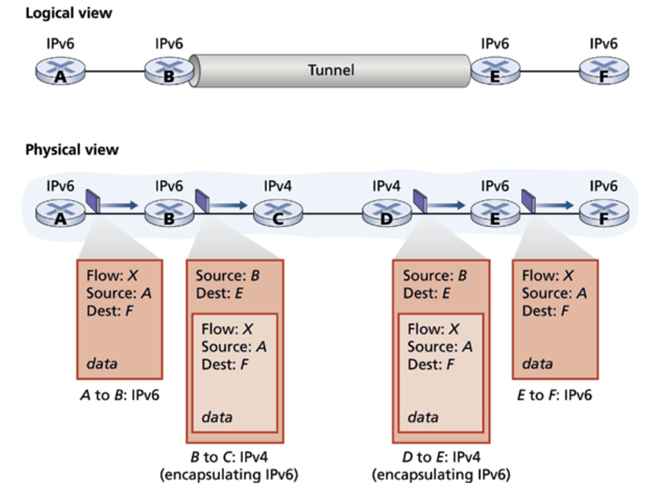
  
  此圖分為邏輯檢視（Logical view）與物理檢視（Physical view）。
  * *邏輯檢視：* 展示了 IPv6 路由器 B 與 E 之間存在一條直連的「隧道 (Tunnel)」，IPv6 資料在其中直接流通。
  * *物理檢視：* 揭露了這條隧道的真實硬體路徑。路由器 B 與 E 實際上是透過兩台老舊的 IPv4 路由器 C 與 D 互連。圖中以精緻的信封示意圖展示了「封裝 (Encapsulation)」過程：在 B 點時，原始的 IPv6 封包被完整包進了一個外層印有「Source: B, Dest: E, Protocol: 41」的 IPv4 封包中，在順利通過 C 與 D 的傳輸後，在 E 點被解封還原為 IPv6 封包傳給終端主機 F。

##  Generalized Forwarding and SDN

1. 匹配加動作（Match-plus-Action）
  * 匹配（Match）：不再侷限於*目的 IP 位址*，可跨越通訊協定堆疊中的多個層級（如網路層 IP、鏈結層 MAC、傳輸層 Port 號等）同時進行多欄位比對
  * 動作（Action）：超越傳統轉發，可包含轉發到單一/多個輸出埠、負載平衡（Load Balancing）、重寫標頭欄位（如 NAT）、阻擋/丟棄封包（如防火牆），或將封包送往特殊伺服器進行深層封包檢測（DPI）

2. 設備定位轉變：封包交換器（Packet Switches）
  * 由於此類設備能同時依據第 2 層（MAC）與第 3 層（IP）進行轉發決策，傳統*第 3 層路由器*或*第 2 層交換器*的稱呼不再精確，在 SDN（軟體定義網路）文獻中統稱為**封包交換器（Packet Switches）**

3. 控制平面與資料平面分離
  * 遠端控制器（Remote Controller）：位於控制平面，集中計算、安裝並動態更新各個交換器中的匹配加動作表
  * 封包交換器：位於資料平面，純粹根據本地儲存的流表（Flow Table）執行高速匹配與轉發

4. OpenFlow 流表（Flow Table）三大核心組成
  * 標頭欄位值（Header Field Values / Match Rules）：定義比對規則（通常由 TCAM 硬體快速完成）。若封包未匹配任何規則，可選擇丟棄或上送遠端控制器進一步處理
  * 計數器（Counters）：記錄統計數據，如匹配該規則的封包總數、位元組數，以及該條目上次被更新的時間（用於計費、監控或排錯）
  * 動作集合（Actions）：定義匹配成功後的處置方式（如轉發、丟棄、複製發送多份、重寫指定標頭欄位）

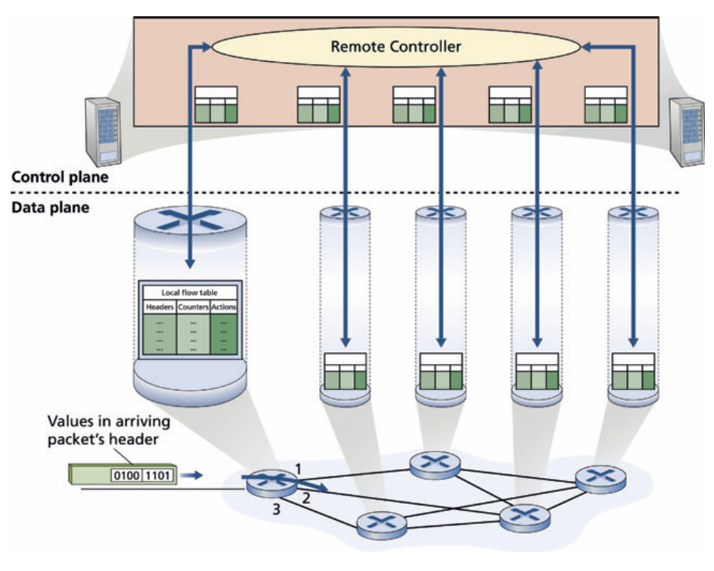

從圖來看，可以了解

* 上下平面分離：上方為控制平面（Control plane）的遠端控制器（Remote Controller）；下方為資料平面（Data plane）的封包交換器網路。
* 流表下發機制：遠端控制器統一計算規則，並透過控制通道（箭頭）將流表項目分發安裝至每個交換器的本地流表（Local flow table）。
* 交換器內部三欄結構：放大視圖顯示本地流表包含三大組成——Headers（標頭規則）、Counters（計數器）、Actions（執行動作）。
* 執行流程：到達封包提取標頭數值（Values in arriving packet's header）進行比對，匹配後依定義之 Action 透過底層交換結構轉發至指定輸出埠（介面 1, 2, 3 等）。

### Match

* 跨三層協定匹配（打破分層原則）：OpenFlow 1.0 的匹配（Match）抽象打破了傳統嚴格的分層邊界，允許同時比對來自鏈結層（Layer 2）、網路層（Layer 3）與傳輸層（Layer 4）的封包標頭欄位，加上輸入實體介面（Ingress Port），共涵蓋 12 種比對維度（在較新的 OpenFlow 規格中已擴充至 41 種）
* 多功能合一的設備能力：透過比對乙太網路 MAC 位址，該設備能作為 Layer 2 交換器轉發訊框；透過比對 IP 位址，能作為 Layer 3 路由器轉發資料包；結合傳輸層埠號則可執行防火牆或 NAT 決策
* 萬用字元（Wildcards）與優先權（Priority）：
  * 流表規則支援萬用字元（例如 `128.119.*.*` 可匹配前 16 位元吻合的所有 IP）
  * 若封包同時匹配多條流表規則，將依最高優先權（Highest Priority）的條目來執行對應動作
* 抽象化設計的權衡（Tradeoff）：並非所有標頭欄位皆可匹配（例如不支援依據 IP 的 TTL 或封包長度欄位進行匹配），這是為了在功能彈性與硬體實作複雜度（如 TCAM 容量與處理延遲）之間取得最佳平衡

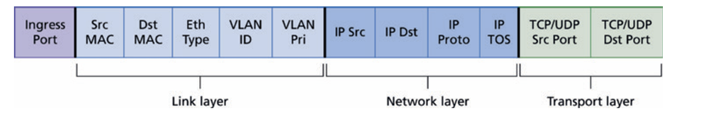

欄位結構解析: 

* 輸入埠：Ingress Port（封包進入該交換器的實體連接埠）。
* 鏈結層（Link layer / Layer 2）：
  * Src MAC（來源 MAC 位址）
  * Dst MAC（目的 MAC 位址）
  * Eth Type（乙太網路類型，指示上層載荷協定如 IPv4、ARP）
  * VLAN ID（虛擬區域網路識別碼）
  * VLAN Pri（VLAN 優先權位元）
* 網路層（Network layer / Layer 3）：
  * IP Src（來源 IP 位址）
  * IP Dst（目的 IP 位址）
  * IP Proto（IP 協定號碼，指示上層為 TCP、UDP 或 ICMP）
  * IP TOS（IP 服務類型 / DSCP 優先等級）
* 傳輸層（Transport layer / Layer 4）：
  * TCP/UDP Src Port（來源傳輸層通訊埠）
  * TCP/UDP Dst Port（目的傳輸層通訊埠）

### Action

* 動作清單執行機制（Action List Execution）：每個流表條目包含 0 個或多個動作；若設定了多個動作，交換器會嚴格按照清單中指定的順序依序執行。

* 三大核心動作（Actions）:
  * 轉發（Forwarding）：
    * 轉發至特定實體輸出埠
    * 泛洪／廣播至除了封包進入埠之外的所有連接埠（Broadcast/Flood）
    * 多播（Multicast）轉發至特定的一組輸出埠
    * 上送控制器（Send to Controller）：將封包封裝後送交遠端 SDN 控制器，由控制器決定是否安裝新的流表條目，並可將封包送回交換器以新規則繼續轉發
  * 丟棄（Dropping）
    * 若流表條目中未包含任何動作（No action），則代表符合該比對條件的封包將直接被丟棄（常見於防火牆黑名單規則）
  * 修改欄位（Modify-field）
    * 可在封包轉發至目標輸出埠之前，重寫修改其標頭數值。支援修改第 2、3、4 層中的 10 個標頭欄位（唯獨 IP Protocol 協定欄位不可修改） 

### Middleboxes

* 中間盒（Middlebox）定義（RFC 3234）：在來源端與目的端主機之間的資料路徑上，執行除了傳統標準 IP 路由器轉發功能之外的任何中介設備
* 三大服務類型
  * NAT 位址轉譯：實現私有 IP 位址轉換，重寫 IP 標頭與傳輸層 Port 號
  * 安全服務（Security Services）：包括依據標頭或 DPI 進行流量阻擋的防火牆（Firewalls）、偵測異常模式的入侵偵測系統（IDS），以及過濾垃圾郵件/釣魚威脅的應用層過濾器
  * 效能增強（Performance Enhancement）：包含資料壓縮、內容快取（Content Caching）以及在多台伺服器間分流請求的負載平衡（Load Balancing）
* 網路功能虛擬化（NFV）：為了解決專屬硬體設備昂貴、難以維護與升級的問題，NFV 提倡使用標準商用通用硬體（Commodity Hardware），配合執行於通用軟體堆疊上的專用軟體來實現中間盒功能，或直接外包至雲端執行
* 對傳統網際網路分層架構的衝擊
  * 早期架構強調「核心純轉發（L3）、邊緣端到端處理（L4-L7）」的清晰分界
  * 現代中間盒徹底打破了分層邊界（例如 NAT 修改 L3/L4 欄位、防火牆與安全閘道器檢驗 L7 應用層內容）。雖然常被視為架構上的妥協，但因其滿足了關鍵實務需求，已成為現代網路不可或缺的核心存在

##  Architectural Principles of the Internet

1. 網際網路三大極簡設計原則:
  * 目標（Goal）：實現全球互連性（Connectivity）。
  * 工具（Tool）：網際網路通訊協定（IP Protocol）。
  * 智慧放置（Intelligence）：位於端點（End-to-End），而非隱藏在網路核心之中。

2. IP 沙漏模型（The IP Hourglass）
  * 細腰（Narrow Waist）架構：上層有多種應用與傳輸協定，底層有多種鏈結與實體媒介，但中間只有唯一且必須實作的網路層協定——IP。
  * 跨越層（Spanning Layer）作用：隱藏底層傳輸媒介的差異，向上提供統一的網路服務介面，使各類異質網路（乙太網、Wi-Fi、蜂巢式、光纖等）皆能無縫接軌。
  * 細腰變粗現象：隨著中間盒（Middleboxes）的大量崛起，原本極簡的 IP 層與網路核心逐漸承擔更多功能，使「細腰」在邁入中年後有所拓寬

3. 端到端論點（The End-to-End Argument）
  * 核心主張（Saltzer 1984）：某些通訊功能若只能由位於端點的應用程式完整且正確地實現，則該功能就不應由網路通訊子系統內部來提供。
  * 對比傳統電話網：傳統電話網為聰明交換機＋愚鈍端點；網際網路則為愚鈍核心＋聰明端點（可程式化電腦）。
  * 經典範例（可靠資料傳輸）：即便底層鏈結層具備部分錯誤控制，但在路由器當機、鏈路故障等情況下仍可能掉包；因此真正的*可靠資料*傳輸必須由端點（如 TCP 協定）負責實現。