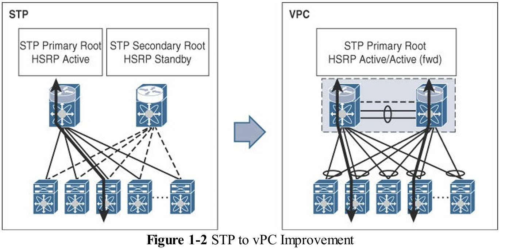
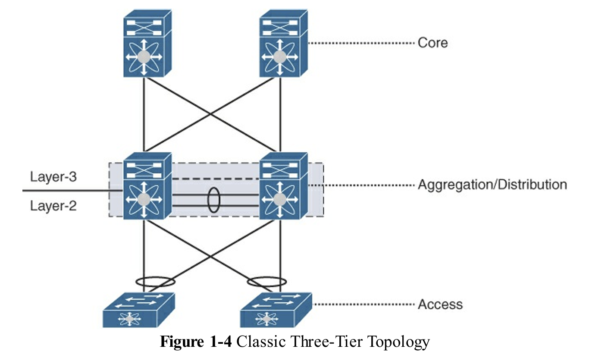
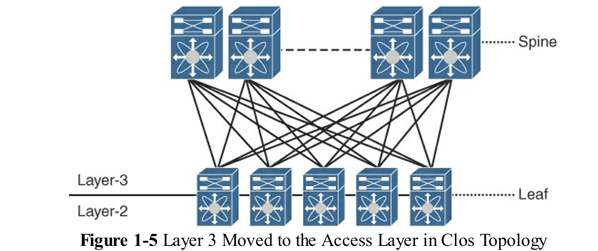
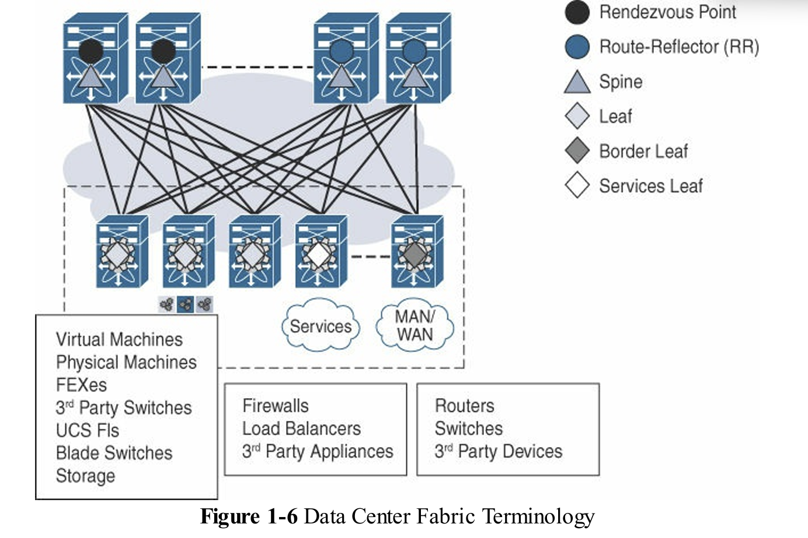
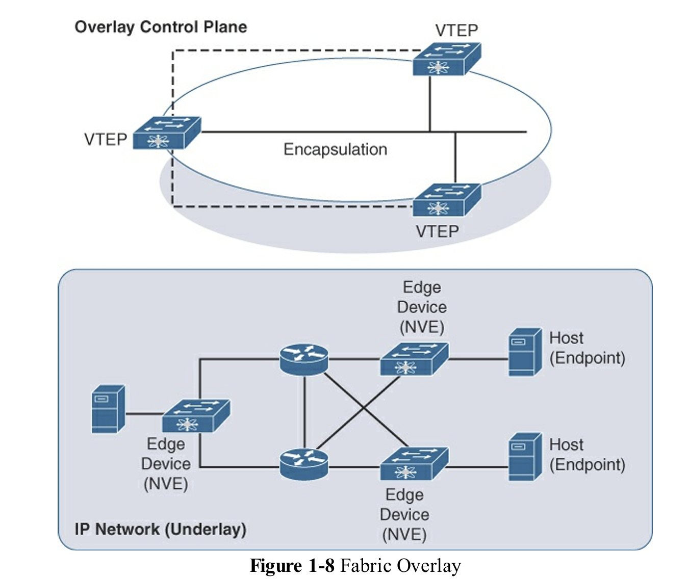
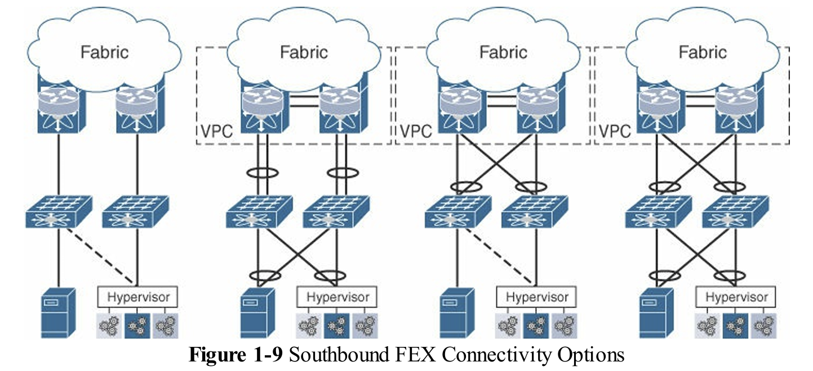

### 可程式化光纖簡介 (Introduction to Programmable Fabric)

資料中心網路（DC）自問世以來經歷了劇烈演變，主要受到虛擬化、雲端運算（私有、公有、混合雲）、軟體定義網路（SDN）和巨量資料等趨勢的驅動。傳統上，網路設備的營運模式是「單一設備管理」，如今則轉向「服務導向」的系統。思科的 VXLAN BGP EVPN 架構提供了一個整合式解決方案，使用 Nexus 交換機、NX-OS 作業系統及控制器來實現這一轉變。

### 當代資料中心的挑戰與要求 (Today’s Data Center Challenges and Requirements)

由於應用程式的期望不斷提高，資料中心面臨著嚴峻的挑戰，要求部署時間從數天縮短至數分鐘甚至數秒。當代資料中心的關鍵需求包括：

| 關鍵需求 (Requirement) | 專業說明 (Professional Description) | 來源 |
| :--- | :--- | :--- |
| **敏捷性 (Agility)** | 縮短應用程式請求的完成時間。 | |
| **可擴展性 (Scalability)** | 必須能夠承載數千租戶和數千租戶網路，突破傳統 12 位元 VLAN (4096 個網路) 的限制。 | |
| **彈性 (Elasticity)** | 能夠適應變化的需求，例如無縫增減計算或網路資源，同時不影響現有的工作負載。 | |
| **可用性 (Availability)** | 確保系統 24/7 全年無休，並支援高可用性和災難恢復（DR）機制。 | |
| **低成本 (Low Cost)** | 降低總體擁有成本（TCO），尤其要持續關注運營支出（OPEX）。 | |
| **開放性 (Openness)** | 傾向於採用開放標準解決方案，並使用白牌（white-box）或品牌白牌（Brite-box）硬體，以避免單一廠商鎖定。 | |
| **安全性 (Security)** | 確保多租戶環境中流量的完全隔離，並實施一致的應用程式及存取政策。 | |
| **解決方案導向 (Solution Orientation)** | 需要整合網路、運算、儲存協調器及服務設備的統一解決方案，並結合先進的自動化與 SDN 控制器。 | |
| **混合部署支援 (Hybrid Deployments)** | 支援在私有資料中心和公共雲之間無縫且彈性地擴展資源。 | |
| **易用性 (Ease of use)** | 易用性主要指在解決方案導向的架構中，對日常營運提供持續的管理、監控和可視性的能力。 | |
| **電源效率  (Power efficiency)** | 資料中心的營運成本（OPEX）中，有很大一部分歸因於電力需求。綠色資料中心趨勢，這促使硬體設計需要持續優化，以滿足對能源效率的要求。 | |

### 資料中心光纖演進歷程 (The Data Center Fabric Journey)

資料中心網路的演進是為了擺脫舊有協定的固有缺陷，並滿足新一代應用的規模需求。

1.  **STP (Spanning Tree Protocol) 的局限性:**
    *   **高收斂時間：** 鏈路或交換機故障時，樹狀拓撲需重新計算，導致流量延遲和丟包。
    *   **低資源利用率：** 為防止迴路，部分鏈路被置於阻塞狀態，造成網路資源浪費。
    *   **缺乏 ECMP：** 傳統 L2 網路無法利用多條等價路徑，不具備 L3 網路的優勢。
    *   **廣播風暴：** L2 封包缺乏 TTL（Time to Live）機制，一旦發生迴路故障可能導致整個網路癱瘓。
    *   **規模受限：** 12 位元 VLAN 限制了網路命名空間為 4096 個，無法支援大規模多租戶。

2.  **vPC (Virtual PortChannel) 的出現:**
    *   vPC 解決了 STP 的一些限制，提供雙歸屬（dual-homing）能力，讓伺服器可連接到一對交換機並實現**主動-主動（active-active）轉發**。然而，它仍僅限於一對交換機的範圍。

3.  **FabricPath 和 TRILL（Layer 2 疊加）:**
    *   這些技術採用 **MAC-in-MAC 封裝**，利用 Layer 2 IS-IS 協定來學習拓撲，從而提供 L2 網路的 ECMP 路由。它們將 MAC 學習限制在邊緣交換機，核心交換機僅根據外部頭部轉發，有助於提高可擴展性。

4.  **VXLAN 的問世（Layer 3 疊加）:**
    *   作為開放標準，VXLAN 使用 **MAC-in-IP/UDP 封裝**，將虛擬網路識別碼（VNI）空間擴展至 24 位元（1600 萬個網路段）。
    *   VXLAN 運行在 IP 底層之上，天然支援 L3 的 ECMP 優勢，實現了與傳輸媒介無關（transport independent）的網路架構。
    *   **VTEP（VXLAN Tunnel Endpoint）** 負責在邊緣設備上執行封裝和解封裝，而核心交換機是普通的 IP 路由器，無需特殊功能。
    *   **VXLAN F&L（Flood and Learn）：** VTEP 仍依賴 F&L 機制（通常是 IP 多播或入口複製）來學習遠端主機 MAC 地址。然而，這種機制在超大規模下仍存在擴展性挑戰。

#### 1. 網路架構的演進概覽

資料中心網路的演變主要圍繞著以下幾個技術里程碑：

1.  **STP (Spanning Tree Protocol) 網路時期：** 這是網路演進的起點，用於滿足傳統的區域網路需求。
2.  **vPC (Virtual PortChannel) 引入：** 用於解決 STP 的部分限制並提供雙宿主（dual-homing）能力。
3.  **疊加技術（Overlays）萌芽：** 引入 FabricPath 和 TRILL，使用 MAC-in-MAC 疊加封裝。
4.  **基於 IP 的疊加網路：** 導入 VXLAN，採用 MAC-in-IP 封裝。
5.  **閘道功能轉移：** Layer 3 閘道功能從集結（Aggregation）層的**集中式閘道**，轉移到**分散式閘道**實施，消除了網路瓶頸並提高了擴展性。

#### 2. STP 網路（802.1D）的限制與痛點

儘管 STP 在早期網路中廣泛採用，但其基本設計原則使其無法滿足現代資料中心的嚴苛需求：

| 限制或缺點 | 描述 (技術分析) | 影響 |
| :--- | :--- | :--- |
| **收斂問題 (Convergence Issues)** | 鏈路或設備故障時，需要重新計算整個樹狀拓撲。拓撲變化通知（TCN）會導致交換機清除 MAC 表，需要重新學習狀態。 | 隨著鏈路速度（如 10G 到 100G）增加，即使亞秒級的收斂時間也會導致大量流量丟失。 |
| **鏈路資源浪費** | STP 為了確保網路無迴路，會將冗餘鏈路置於阻塞（blocked）狀態，導致網路資源未被最佳化利用。 | 網路頻寬利用率低，無法充分發揮硬體投資的效益。 |
| **次優轉發 (Suboptimal Forwarding)** | 流量必須沿著以根橋（Root Bridge）為根的樹狀結構轉發，即使存在更短的物理路徑，也無法被利用。 | 網路傳輸延遲可能增加。 |
| **缺乏 ECMP (Equal-Cost MultiPath)** | Layer 2 網路只有一條活躍路徑，無法像 Layer 3 網路那樣利用多條等價路徑進行負載均衡。 | 限制了網路吞吐量和彈性。 |
| **廣播風暴 (Traffic Storms)** | Layer 2 標頭缺乏 TTL（Time to Live）欄位。一旦發生故障導致迴路，流量可能無限循環，最終使整個網路癱瘓。 | 嚴重限制網路的可擴展性。 |
| **缺乏原生雙宿主支援(Lack of dual-homing support)** | 設備無法同時連接到多個交換機，否則 STP 會阻塞其中一條鏈路，影響備援能力。 | 網路容錯能力受限。 |
| **網路規模(Network scale)限制** | IEEE 802.1Q（dot1q）標頭中的 VLAN 識別碼僅為 12 位元，最大僅支援 4096 個網路（4K），不足以應對大規模多租戶環境。 | 限制了雲端運算時代的規模擴展。 |

#### 3. vPC 的改進與限制

vPC（Multi-Chassis Link Aggregation [MC-LAG] 的一種）*允許下游設備連接到一對交換機（vPC peers），並將其視為單一邏輯交換機*。

*   **優勢：** 實現主動-主動（active-active）轉發，提高了鏈路利用率和冗餘性。
*   **FHRPs 整合：** 擴展了對 HSRP 和 VRRP 等協定的支援，允許兩個 vPC peers 同時轉發數據流量。
*   **限制：** 雖然 vPC 解決了部分 STP 問題，但其作用範圍仍然僅限於一對交換機。

 STP to vPC Improvement

#### 4. 疊加技術：FabricPath 與 VXLAN

隨著網路規模擴大和移動性需求增加，Layer 2 網路需要更通用的多路徑解決方案。疊加技術（Overlays）成為了解決方案的核心，它抽象了底層物理網路。

##### 1. FabricPath (MAC-in-MAC)

*   **機制：** 採用 MAC-in-MAC 封裝。
*   **控制平面：** 使用 Layer 2 IS-IS 協定分發*拓撲資訊*。
*   **功能：** 允許交換機表現得像路由器，支援 ECMP，實現最佳化轉發，且消除冗餘鏈路。
*   **限制：** FabricPath 是 Cisco 單一供應商解決方案，且 MAC-in-MAC 封裝需要依賴於底層的 Layer 1 傳輸透明性，其平面 MAC 位址空間難以大規模擴展。

> Cisco FabricPath 是一種 MAC-in-MAC 封裝技術，可以消除 Layer 2 網路中 STP 的使用。
> 在 FabricPath 中，網絡中的每個交換機都有一個唯一的交換機識別碼，或稱交換機 ID。

#### 2. VXLAN (MAC-in-IP/UDP)

VXLAN 是目前最受歡迎的疊加封裝協議：

*   **機制：** 採用 MAC-in-IP/UDP 封裝，是 Layer 2-in-Layer 3 疊加。
*   **規模擴展：** 使用 24 位元的 VNI（Virtual Network Identifier），可支援高達 1600 萬個虛擬網段，解決了 4K VLAN 的限制。
*   **底層利用：** *運行於 IP 網路之上，天然繼承了 Layer 3 的 ECMP 特性*。
*   **傳輸獨立性：** 網路從依賴特定傳輸技術（如 FabricPath）轉變為傳輸獨立性，底層轉為分層的 IP 位址方案。

### 5. VXLAN 的早期運作（F&L）與控制平面需求

在 VXLAN 的設計中，*網路邊緣設備承載 **VTEP（VXLAN Tunnel Endpoint）** 功能*，負責封裝和解封裝。核心交換機是普通的 IP 路由器，對終端設備（Endpoint）的 MAC 位址一無所知。

*   **早期學習機制 (F&L):** VTEP 學習本地終端後，通過**泛洪與學習（Flood and Learn, F&L）**機制來發現遠端終端。多點傳輸流量（BUM，包括廣播、未知單播、多播）被對應到一個多播群組 IP 或使用入口複製（Ingress Replication）進行傳輸。
*   **F&L 的缺點：** 泛洪機制本質上會隨著網路規模增加而帶來可擴展性挑戰。
*   **BGP EVPN 的引入：** 為了消除 F&L 帶來的泛洪問題，需要引入一個**控制平面**協定來分發終端可達性資訊（IP 和 MAC 到 VTEP 的綁定）。
*   **目標：** 透過 BGP EVPN，一旦 VTEP 本地學習到一個終端，該可達性資訊便可被分發到所有感興趣的 VTEP，從而實現流量的最佳化單播轉發，最大限度地減少甚至消除泛洪。

這一轉變最終奠定了 **VXLAN BGP EVPN** 作為新一代資料中心網路架構的基礎。

> 對於 VXLAN 核心，VTEP 將端點的原始第二層幀(frame)取出，並添加 VXLAN 標頭。此標頭包含外層源 IP 地址（SIP），設為其自身的 VTEP IP，以及外層目的 IP 地址（DIP），設為承載目標端點的 VTEP IP。

### Cisco 開放可程式化光纖 (Cisco Open Programmable Fabric)

為了解決傳統 F&L 在擴展性和彈性上的限制，VXLAN 引入了 BGP EVPN 作為控制平面。

1.  **BGP EVPN 的核心價值:**
    *   BGP EVPN 協議*負責分發端點（IP, MAC）與 VTEP 的綁定資訊*。*一旦端點在 VTEP 被本地學習，其可達性資訊便會透過 BGP EVPN 廣播*，從而**基本消除了未知單播流量的氾濫（flooding）**，極大地改善了可擴展性。

2.  **葉脊拓撲的必要性 (Spine-Leaf):**
    *   傳統三層拓撲（存取/匯聚/核心）由於 L3 閘道集中在匯聚層而面臨瓶頸。現代架構將 L3 閘道功能下移至存取層（現在稱為葉層），形成葉脊拓撲。
    *   **分散式 IP 任播閘道（Distributed IP Anycast Gateway）：** 允許在所有葉交換機上同時配置相同的預設閘道 IP，實現「任何工作負載可在任何地方」的目標。
        * 骨幹節點提供所需的冗餘，從而提供一個具有足夠冗餘的簡單網路拓撲。
    *   BGP EVPN 結合葉脊拓撲，確保了轉發路徑始終為源葉到目標葉的最優路徑。

3.  **光纖管理週期 (Fabric Management Cycle):**
    *   **Day 0 (部署階段):** 透過 POAP（Power On Auto Provisioning）等方式自動化網路的初始配置和開機。
    *   **Day 1 (配置階段):** 部署所需的疊加層服務配置，例如 VNI、VRF 等。
    *   **Day 2 (運營階段):** 持續的監控、可視性、故障排除以及與雲端運算和服務設備的整合。

下面是一個經典的三階層架構。為了冗餘，彙總層(aggregation layer) 交換機配置了如 HSRP 或 VRRP 等 FHRP。隨著大規模數據中心部署，三層拓撲已成為擴展瓶頸。隨著網路中端點數量的增加，聚合層交換機中存儲的 IP 與 MAC 綁定數量也隨之增加，因此需要支持大型 FIB 表。此外，這些交換機需要處理的 ARP 和 ND 刷新所帶來的控制平面開銷也顯著增加。這個問題，加上聚合層交換機可以承載的第 3 層接口數量及相應租戶 VRF 的數量，造成了巨大的問題。同時 VLAN 應用也是。

 Classic Three-Tier Topology

將預設閘道移至接取層(access layer)即 Leaf 可以降低故障域，因為接取交換機只需支援其下工作負載的第一跳協定。與單一或一對聚合交換機必須支援所有接取交換機下的端點相比，這無疑是一種更具擴展性的模型。這也促成了葉脊（leaf-spine）或脊葉（spine-leaf）拓撲的出現。匯聚或主幹交換機(spine switch)現在成為核心交換機，運作精簡，*只需在葉節點之間最佳化地轉發流量即可，完全不需要了解端點地址*。此外，*使用 BGP EVPN 控制協議後，泛洪任何未知單播流量的必要性基本上已被消除*。

 Layer 3 Moved to the Access Layer in Clos Topology

#### 網路結構相關術語 (Fabric-Related Terminology)

*   **Leaf (葉)/ToR (機架頂部)/Edge (邊緣)/NVE (網路虛擬化邊緣):** 承載 VTEP 功能的交換機，直接連接端點。
*   **Spine (脊):** 互連所有葉交換機的交換機，提供底層（Underlay）IP 路由轉發。
*   **Underlay (底層):** 負責 VTEP 之間 IP 連通性的物理傳輸網路。
*   **Overlay (疊加層):** 邏輯網路，承載 VXLAN 封裝的流量。
*   **Border Leaf/Spine (邊界葉/脊):** 位於光纖邊緣，負責與外部網路進行 Layer 2/3 連接的節點。
*   **RR ( route reflector, 路由反射器)/RP (rendezvous point, 多播匯聚點):** 通常位於脊或超級脊交換機上，協助 BGP 和多播協議的路由分發。

 Data Center Fabric Terminology

所有交換葉節點之間的流量都使用 VXLAN 封裝，並透過覆蓋網路傳送。且，來自葉節點交換機的 VXLAN 封裝流量通常會在邊界的 VTEP 上解封裝。

 Fabric Overlay

#### 資料中心網路結構屬性 (Data Center Network Fabric Properties)

*   **高雙向帶寬:** 由於 Clos 拓撲設計中，葉層與脊層之間沒有過度訂閱，確保了高容量。
*   **ECMP 轉發:** 通過多個脊交換機提供多條等價路徑，確保所有轉發路徑具有**確定性延遲**。
*   **高度彈性:** 對於鏈路或節點故障有極高的恢復能力，且故障的影響範圍小（例如，損失一個脊只減少了總帶寬的一小部分）。
*   **優異的擴展性:** 可按需獨立增加葉（增加伺服器/機架）或增加脊（增加帶寬）。

> 在鏈路故障時，流量會被重新導向可用路徑，而收斂時間取決於底層和覆蓋層協議的收斂速度。

#### 伺服器或端點連接選項 (Server or Endpoint Connectivity Options)

通常連接到葉節點的端點可能是裸機、虛擬工作負載、存儲設備或服務設備。這些端點可以直接連接到葉節點，也可以通過擴展纖維（FEX）21，或者在某些情況下通過刀片交換機連接。

*   **FEX (Fabric Extenders):** 充當遠程線卡，將管理集中到父交換機，常見於 ToR 部署。
*   **多機箱連接:** 伺服器通常通過 PortChannel 雙歸屬於一對葉交換機（vPC peers）以提供冗餘。
*   **整合儲存:** 光纖支援傳統 FC 儲存，以及 FCoE 和 IP 儲存解決方案，實現 converged southbound connectivity。

 Southbound FEX Connectivity Options

### 總結 (Summary)

VXLAN BGP EVPN 架構是應對現代資料中心高敏捷性、可擴展性和高可靠性需求的典範轉移。它透過將控制平面與數據平面分離（SDN 原則），並利用成熟的 BGP 協議來管理大規模網路狀態，從而實現了比傳統 L2 網路更優越的性能和可管理性。
