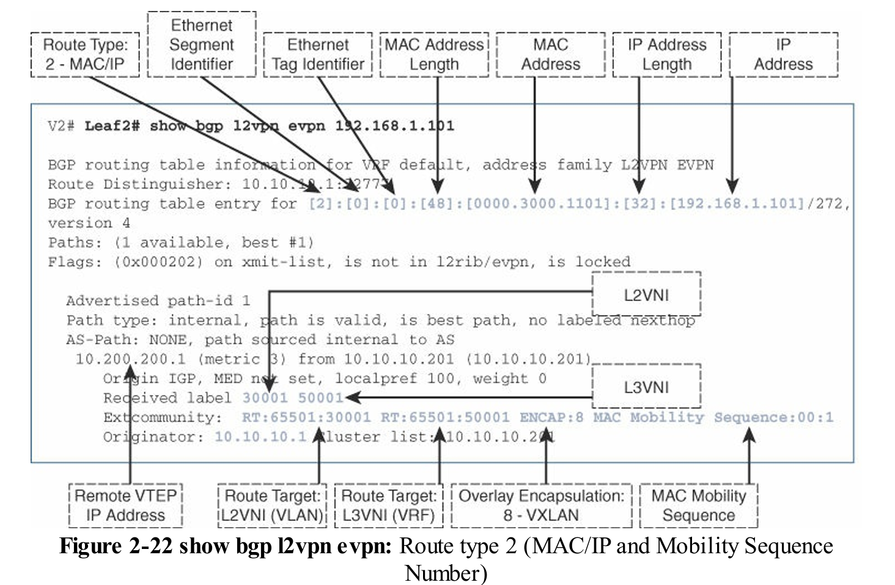

### 1. 資料中心環境的背景與挑戰 (Context and Challenges)

資料中心流量模式已從傳統的客戶端到伺服器（南北向流量）轉變為伺服器間的通訊（東西向流量），例如多層次應用程式伺服器與資料庫伺服器之間的交換。

* **VLAN 限制**：傳統網路中，虛擬區域網路（VLAN）使用 12 位元標籤，限制了廣播域的最大數量為 4096 個 (4K)。這對於需要數千個租戶網路的多租戶雲端部署來說遠遠不足。
* **主機擴展性問題**：虛擬化使得單一實體伺服器承載了數十倍於傳統網路的主機或虛擬機（VMs），導致交換器面臨 **MAC 表爆炸** 和控制平面開銷激增的問題（如處理 DHCP, ARP, ND, IGMP 等協議）。
* **STP 局限**：傳統的生成樹協定（STP）存在收斂時間長、鏈路利用率低（存在阻斷鏈路）、無法提供等價多路徑（ECMP）路由等固有缺陷，難以滿足現代資料中心的高可用性和頻寬需求。

 East–West Communication Flow

### 2. Overlays（覆蓋網路）

覆蓋網路（Overlays）是解決傳統網路挑戰的關鍵架構轉變，它提供了一個抽象層，允許網路功能與底層傳輸網路分離。

* **身份與位置分離**：覆蓋網路的核心是將終端主機的「身份」（Identity，如 MAC/IP 位址）與承載其的網路設備的「位置」（Location，如 VTEP IP）分離。
* **封裝類型**：
  * **訊框封裝（Frame Encapsulation）**：外層是 Layer 2 訊框，例如 TRILL 和 Cisco FabricPath。
  * **封包封裝（Packet Encapsulation）**：外層是 Layer 3 封包，例如 VXLAN 和 LISP。
* **底層網路（Underlay）**：負責在隧道邊緣設備（如 VTEP）之間提供連通性，通常是一個強健的 Layer 3 IP 網路。
  * 對於 VXLAN，底層傳輸網路（底層）將是一個第3層網路，用於在源端與目的端隧道邊緣設備之間傳輸 VXLAN 封裝的封包
* **VTEP（VXLAN Tunnel Endpoint）**：是*邊緣設備*上的功能，負責執行覆蓋網路標頭的封裝和解封裝。
* **VNI（Virtual Network Identifier）**：是識別覆蓋服務的標識符。

在覆蓋網路中，原始封包或幀(frame)會在邊緣設備上使用外部標頭進行封裝，然後發送到適當的目的邊緣設備。*中間的網路設備都會根據外部標頭轉發封包*，而不會察覺原始的有效載荷。在目的邊緣設備上，覆蓋標頭會被去除，然後封包會根據內部有效載荷進行轉發。

對於部署中同時存在裸機和虛擬化工作負載的情況，ToR（Top-of-Rack）交換機負責為其下各類工作負載處理覆蓋網路標頭的推送/彈出。這些稱為網路覆蓋（network overlays）。無論是主機覆蓋（host overlays）還是網路覆蓋都非常受歡迎，是*解決多租戶數據中心環境中規模挑戰的常見部署選項*。每種方案都有其優缺點，但通過使用混合覆蓋環境（hybrid overlay environments），可以實現兩全其美，該環境同時支持主機覆蓋和網路覆蓋，從而優化物理到虛擬（P2V）通訊。

 Host, Network, and Hybrid Overlays

底層傳輸網路（或稱底層網路）通常由互聯邊緣設備的中繼設備組成。邊緣設備作為底層網路的邊界設備，連接端主機以及不支援疊加的設備。在邊緣設備中，存在用於封裝和解封疊加數據流量以及構建整個疊加網路的功能。在 VXLAN 術語中，*邊緣設備上的這種功能稱為 VTEP，即 VXLAN 隧道端點*。下圖說明了 VXLAN 下層網路中涉及的關鍵術語和功能。

 Underlay Taxonomy

VXLAN，這些服務會透過虛擬網路識別碼 (VNI) 來明確識別，這大大擴展了在網路中容納更多廣播域的能力。這些特性使得 VXLAN 非常具有吸引力。下圖說明了 VXLAN 覆蓋網中涉及的關鍵術語與功能。

 Overlay Taxonomy

> 覆蓋網路每個封包/幀會產生 n 位元組的額外負載，其中 n 為覆蓋標頭及相關外部標頭的大小。原始有效負載被封裝進覆蓋標頭後，會透過底層網路傳輸；因此，底層網路必須配置適當的最大傳輸單位（MTU），以確保覆蓋流量的傳遞。

### 3. Introduction to VXLAN (VXLAN 簡介)

VXLAN 是一種 **MAC-in-IP/UDP** 封裝，是目前資料中心最流行的覆蓋協定。

* **擴展性**：VXLAN 提供了 24 位元 VNI 空間，可支援高達 1600 萬個虛擬網路段，極大地解決了 4K VLAN 的限制。
* **ECMP 支援**：由於 VXLAN 運行在 IP 網路上，它可以原生地利用底層 Layer 3 網路的 ECMP 功能，提高鏈路利用率。
* **訊框格式和開銷**：VXLAN 訊框格式包括原始的 Layer 2 訊框（內層）和新增的 VXLAN/UDP/IP/Ethernet 標頭（外層）。這會增加 50 或 54 位元組的封裝開銷。查看圖 VXLAN Frame Format Details
* **UDP 源埠熵（Entropy）**：為了在 IP Underlay 上實現流量的負載均衡（ECMP），VXLAN 根據內層封包的內容生成可變的 UDP 源埠號碼（Source Port），確保流量流經不同的等價路徑。
  * 由於 UDP 來源端口會根據內部封包/幀的內容而變化，它提供了必要的熵來為相同來源與目的 VTEP 對之間的不同終端主機流選擇不同的路徑。
* **BUM 流量處理**：VXLAN 需要機制來傳輸廣播、未知單播和多播（BUM）流量。主要方式包括：
  * **IP Multicast**：在底層網路運行 IP 多播協議（如 PIM），將 VNI 對應到一個 IP 多播組。
  * **Ingress Replication (IR)**：由源 VTEP 產生多個副本，單播給所有目標 VTEP。
* **缺乏控制平面**：最初的 VXLAN 標準定義了資料平面，但缺乏內建的控制平面來分發主機可達性信息，因此必須依賴下一節所述的 F&L 機制。

VXLAN 代表了一種二層嵌入三層的覆蓋網路(Overlay network)。邊緣設備負責通過所承載的 VTEP 功能推入和彈出 VXLAN 標頭。本質上，VXLAN 可以在三層網路上連接兩個或多個網路，同時允許這些不同網路上的工作負載或伺服器繼續*共享相同的二層廣播域*。*透過在 VXLAN 中使用三層，VTEP 之間的所有可能路徑都可以透過 ECMP 使用，這也大大提高了底層網路的利用率*。

VXLAN 標頭的內部部分指的是第 2 層組件，而外部標頭則反映第 3 層邊緣設備。VXLAN 標頭前面是外層 UDP 標頭(outer UDP header)、外層 IP 標頭(outer IP header)以及外層以太網標頭(outer Ethernet header)。外層 UDP 標頭的目的地埠號設置為 4789。

 VXLAN Frame Format

 VXLAN Frame Format Details

### 4. VXLAN Flood and Learn (F&L)

在沒有控制平面的情況下，VXLAN 使用 F&L 機制來學習遠端主機的 MAC-to-VTEP 綁定。

* **學習過程**：當 Host A 嘗試與遠端 Host B 通訊時：
  1. Host A 發送 ARP 請求（廣播）。
  2. 源 VTEP 接收 ARP 請求，將其封裝為 VXLAN，並使用對應 VNI 的多播組（或 IR）轉發給所有相關 VTEP。
  3. 所有目標 VTEP 收到 BUM 流量，並執行 Layer 2 學習，記錄 Host A 的 MAC 位址與源 VTEP 的 IP 位址綁定。
  4. Host B 回覆 ARP 響應（單播），目標 VTEP 根據學習到的 MAC-to-VTEP 綁定，將響應單播回源 VTEP。
  5. 後續流量可直接單播傳輸。

  VXLAN F&L

* **F&L 缺點**：雖然 F&L 能夠實現主機學習，但它本質上是一種**基於泛洪（Flooding）** 的機制。當廣播域跨越 Layer 3 邊界擴展時，大量泛洪會嚴重影響網路可擴展性。

與 VLAN 另外主要的區別在於 VXLAN VNI 域跨越了基於 IP 的第 3 層網路。

 VLAN-to-VNI Mapping

> 在 VXLAN 環境中處理多目的地流量的一種替代 IP 多播的方法是使用入口複製（IR），或稱端點複製。

### 5. Introduction to BGP EVPN with VXLAN (結合 BGP EVPN 的 VXLAN 簡介)

BGP EVPN 為 VXLAN 提供了標準化的控制平面，解決了 F&L 機制帶來的擴展性瓶頸。

* **控制平面角色**：BGP（邊界網關協定）是一種硬狀態協議，具有優異的擴展性。EVPN 擴展允許 BGP 作為一個數據目錄，傳輸所有 MAC/IP 地址與 VTEP 的綁定信息。
* **優勢**：
  * **減少泛洪**：一旦主機在本地 VTEP 被學習到，其可達性訊息會通過 BGP EVPN 分發給所有相關 VTEP，從而消除對未知單播流量的泛洪需求。
  * **高效轉發**：通過集成路由和橋接（IRB），EVPN 能夠同時處理 Layer 2 和 Layer 3 流量轉發。
* **注意**：BGP EVPN **並未完全消除** 泛洪，因為 ARP/DHCP 等廣播流量仍需通過底層網路的多播或 Ingress Replication 進行傳輸。但它極大地減少了由於學習過程產生的泛洪。

EVPN 在 VXLAN 中的源 VTEP 與目標 VTEP 之間傳輸信息，使用 BGP/MP-BGP 格式來標識 VTEP 背後特定 IP 和 MAC 地址目的地的可達性。總而言之，EVPN 位址族系 (address family) 允許主機的 MAC、IP、network、VRF 和 VTEP 資訊透過 MP-BGP 傳送。如此一來，只要某個 VTEP 透過 ARP/ND/DHCP 等方式學習到其連接的主機，*BGP EVPN 就會將此資訊分發並提供給網路中所有其他運行 BGP EVPN 的 VTEP*。只要來源端的 VTEP 能持續偵測到其連接的主機，它就不會發送 EVPN 更新訊息。因此，其他 VTEP 無需「老化清除」(age out) 任何遠端主機的可達性資訊。這可以防止在典型的 F&L (泛洪與學習) 情境中可能發生的任何因老化機制所引起的變動，從而大幅提升網路的可擴展性 (scalability)。

>將 BGP EVPN 與 VXLAN 結合使用，提供了一種改進的數據傳輸促進和控制方式，使網路中被識別的特定主機數量可以呈指數增長。

### 6. MP-BGP Features and Common Practices (MP-BGP 特性和常見實踐)

VXLAN BGP EVPN 解決方案基於 RFC 4760 定義的**多協定 BGP (MP-BGP)**。

* **iBGP 與 RR**：在單一自治系統（AS）內，內部 BGP (iBGP) 原則上要求全網狀（Full-Mesh）的對等關係。為了解決擴展性問題，通常部署 **路由反射器（Route Reflector, RR）** 來反射路由，避免 $N(N-1)/2$ 的會話開銷。
  * iBGP 主要用於在整個 AS 內的所有路由器之間同步交換資訊。
  * RR 被允許接收來自 iBGP 的資訊，然後將這些資訊「反射」給它的所有 RR 客戶端 (clients)——也就是所有已知的 iBGP 鄰居。
  * iBGP 和 RR 功能，從而無需再使用全網狀的架構
  iBGP with a Route Reflector

* **eBGP**：外部 BGP (eBGP) 用於不同 AS 之間的對等連接。如下圖
  * 不需要有全網狀需求，從 eBGP 鄰居收到的 BGP 可達性資訊，一律會轉發給它所有的鄰居

一個位於 AS 65500 的 BGP 路由器，可以和它那位於 AS 65501 的鄰居 BGP 路由器建立對等體關係。

 eBGP with no Route Reflector

* **路由識別碼（Route Distinguishers, RDs）**：8 位元組字段，用於確保多個租戶（VRF）即使使用重疊的 IP 地址空間，其路由條目在 BGP 表中仍然具有**唯一性**。常用的最佳實踐是針對每個 VRF 在每個路由器上使用唯一的 RD，如此一來，每個邏輯上的虛擬路由器實例都能被獨立識別。
  * MP-BGP 以其多租戶 (multitenancy) 和路由策略 (routing policy) 的能力而聞名
  * 用於唯一識別 BGP 表中條目的前綴

  Route Distinguisher Formats and Types

* **路由目標（Route Targets, RTs）**：MP-BGP 的路由策略 (route policies) 用來控制特定邏輯實例 (logical instance) 中的路由，控制路由前綴的導入和導出策略，決定哪些路由可以被特定的 VRF 實例接收。
  * 一個 RT 屬性可以被認為是識別一組 VRF

  Route Target Concept

|  |  | |
|---|---|---|
|屬性|RD (路由識別碼)|RT (路由目標)|
|目的|確保路由的唯一性|控制路由的進出口策略|
|比喻|身分證號碼|通行證 / 貨物標籤|
|作用|使重疊的 IP 位址變成全域唯一的路由|決定一條路由可以被哪些 VRF 共享或接收|

在 VXLAN 的情境中，重點則是 L2VPN EVPN 這個位址族系(address families)，它定義了如何在單一的 MP-BGP 對等體 (peering session) 上，傳輸帶有租戶識別的 Layer 2 (MAC 位址) 和 Layer 3 (IP 位址) 資訊。

> MP-BGP 的位址族系 (address families) 是用來傳輸特定類型的可達性資訊。
> iBGP 有一條嚴格的規則：從一個 iBGP 鄰居學習到的路由資訊，*絕不能再轉傳給任何其他的 iBGP 鄰居*。為了確保所有路由器都能收到所有路由，iBGP 預設需要建立**「全網狀」(full-mesh)** 的對等體關係，也就是每台路由器都必須跟其他所有路由器建立連線。

### 7. IETF Standards and RFCs (IETF 標準和 RFC)

EVPN 的通用控制平面規範於 **RFC 7432** 中定義。

* **關鍵 EVPN 路由類型**：VXLAN BGP EVPN 主要使用以下三種路由類型來實現功能：

| 路由類型 (RT, Route type) | 名稱 | 作用 | 關鍵信息 |
| :---: | :---: | :---: | :---: |
| 2 | MAC/IP 宣告路由 | 分發主機的 MAC 和 IP 可達性信息（主機路由）。 | MAC 地址、IP 地址（可選）、L2 VNI (Label 1)、L3 VNI (Label 2，路由時使用)。 |
| 3 | 包含式多播乙太網標籤路由 | 建立動態分發列表，供 Ingress Replication 使用，用於傳輸 BUM 流量。 | VTEP IP 地址、VNI。 |
| 5 | IP 前綴路由 | 傳輸 IP 子網或外部路由信息。主要用於 Layer 3 路由操作和靜默主機發現。 | IP 前綴、IP 前綴長度、L3 VNI。 |

 BGP EVPN Route types

* **VNI 標籤**：在 Route type 2 路由中，L2 VNI 使用 **MPLS Label 1**，L3 VNI 使用 **MPLS Label 2** 承載。

### 8. Host and Subnet Route Distribution (主機和子網路由分發)

#### 路由分發的基礎與目標 (Fundamentals and Goals)

路由分發的目標是將覆蓋網路（Overlay）中的終端主機或子網路的可達性資訊，與底層網路（Underlay）的拓撲資訊解耦。底層網路負責提供 VTEP 之間的 IP 可達性，而覆蓋網路的控制平面（即 BGP EVPN）則負責分發 MAC 地址、IP 地址或 IP 子網路前綴等終端資訊及其對應的 VTEP 位置。

VTEP 會將其本地學習到的 MAC/IP 資訊注入到 BGP EVPN 控制協定中，實現端到端的可達性。

#### 本地終端節點的發現與 Layer 2 宣告

當 VTEP（邊緣設備）偵測到有終端主機連接時，會依照傳統 Layer 2 MAC 學習機制（如 [VLAN, SMAC] 綁定到傳入介面）來學習 MAC 地址資訊。

##### 1. Layer 2 MAC 資訊的 BGP EVPN 宣告

一旦 MAC 地址被本地學習，VTEP 就會透過 BGP EVPN 控制協定填充並分發 **路由類型 2 (Route type 2)** 訊息，該訊息用於 MAC/IP 可達性宣告：

* **強制欄位 (Mandatory Fields):** 包含 MAC 地址及其長度（48 bits）。
* **Layer 2 VNI (L2VNI):** 必須填充一個標籤（Label 1），用於定義 VXLAN 資料平面的 Layer 2 VNI。L2 VNI 是 Layer 2 廣播域的全局唯一標識符。
* **路由識別符 (Route Distinguisher, RD):** 確保每個路由實例的唯一性。RD(Route Distinguisher) 通常由 VTEP 的 Router ID 和內部 MAC/IP VRF ID 自動推導產生。
* **路由目標 (Route Target, RT):** 用於控制路由的導入和導出，以確保路由被分發到所有感興趣的 VTEP。RT(Route Target) 通常由 BGP AS 編號和 VNI 自動推導產生。
* **IP 地址欄位 (Optional IP Address Fields):** 在純 Layer 2 宣告階段（即 MAC-only）中，IP 地址和 IP 地址長度欄位會被設為 0。

 show bgp l2vpn evpn: Route type 2 (MAC Only)

> 在 NLRI 中，純 MAC 宣告的 Route Type 2 前綴通常表示為 `/216`。

##### 2. IP 地址綁定與 Layer 3 宣告 (Route Type 2 - MAC/IP)

當本地連接的終端主機發出 ARP 請求（或 IPv6 環境中的 ND 協定）時，VTEP 會對此進行偵聽 (ARP/ND snooping)，從而學習到終端主機的 IP-MAC 綁定關係。

* **Layer 3 上下文 (VRF Context):** 接收 ARP/ND 請求的 Layer 3 介面（通常是 IRB 介面）提供了 VRF 上下文，並進而映射到 Layer 3 VNI (L3VNI)。
* **Route Type 2 (MAC/IP 模式):** VTEP 隨後會再次分發 Route Type 2 訊息，但這次會包含 IP 地址資訊，使其成為 MAC/IP 路由。
* **Layer 3 VNI (L3VNI):** 訊息中包含第二個標籤（Label 2），即 L3 VNI，用於路由租戶流量。
* **路由器 MAC (Router MAC, RMAC):** 這是進行對稱 IRB（Symmetric IRB）時的關鍵欄位。VTEP 會將自己的 RMAC 作為一個擴展社群屬性（extended community）加入到 Route Type 2 訊息中。這是因為 VXLAN 是一種 MAC-in-IP/UDP 封裝，當數據包在覆蓋網路中被路由時，需要將內部 MAC 地址重寫為目標 VTEP 的 RMAC。

 show bgp l2vpn evpn: Route type 2 (MAC/IP)

> 包含 IPv4 地址的 MAC/IP 宣告前綴為 `/272`，包含 IPv6 地址的則為 `/368`。

|特性|傳統 F&L (泛洪與學習)|BGP EVPN (控制層學習)|
|---|---|---|
|學習方式|被動監聽：透過監聽網路上的實際資料流量來學習 MAC 位址。|主動通知：VTEP 主動透過 BGP 訊息，精準地告訴其他 VTEP 有哪些主機。|
|未知流量|泛洪 (Flooding)：遇到不認識的目標 MAC 位址，只能將封包廣播到所有埠口，造成網路資源浪費。|不泛洪：直接透過 BGP 查詢目標主機在哪個 VTEP 後面，無需泛洪。|
|老化機制|計時器：一個 MAC 位址如果 5 分鐘沒動靜，就會被從表格中刪除，即使主機還在線上。|事件驅動：主機離線時，VTEP 會發送一個 BGP 撤銷 (withdraw) 訊息，精準通知大家刪除該條目。|

#### IP 前綴路由的分發 (Route Type 5)

雖然 Route Type 2 處理了單個主機的 MAC 和 IP 可達性（通常是 /32 或 /128 的主機路由），但在網路中，仍然需要傳統的 IP 子網路前綴路由，這主要通過 **路由類型 5 (Route type 5)** 來實現。

Route Type 5 允許在 EVPN 內傳輸 IPv4 和 IPv6 的可變長度 IP 前綴資訊，且不包含 Layer 2 MAC 資訊。

##### 1. Route Type 5 的 NLRI 結構

Route Type 5 的 NLRI 包含 IP 前綴、前綴長度以及 L3 VNI。同時，RMAC 和封裝類型（VXLAN, Type 8）仍會作為擴展社群加入。

> IPv4 前綴路由（子網路路由）的 Route Type 5 宣告前綴為 `/224`，IPv6 則為 `/416`。

 show bgp l2vpn evpn: Route type 5 (IP)

##### 2. Route Type 5 的應用場景

Route Type 5 在 VXLAN BGP EVPN 網路中主要有兩個關鍵用途：

**A. 支援分散式 IP 任意閘道 (Distributed IP Anycast Gateway):**
VTEP 必須宣告其本地實例化的 IP 子網路前綴（例如下圖，192.168.1.0/24）。這一點對於處理「靜默終端節點 (Silent Endpoints)」至關重要。

* **靜默主機偵測流程 (Silent Host Detection):** 如果一個終端主機尚未被發現（即其 /32 主機路由未被宣告），從遠端 VTEP 發往該靜默主機的流量會命中更不具體的子網路前綴（/24）路由。
* 該流量隨後被導向本地 VTEP。由於 VTEP 知道該子網本地存在，它會觸發 ARP 請求 (Glean Adjacency)，強制靜默主機回應並被發現。如果沒有子網路前綴的宣告，流量將會被靜默丟棄 (silently dropped)。

**B. 外部路由注入 (External Route Injection):**
從外部網路（例如，WAN 或 Campus）學習到的路由，會被邊界葉子（Border Leaf）等節點重分發（Redistributed）到 BGP EVPN 地址家族中。這些外部路由（非主機路由）也通過 Route Type 5 進行宣告。

 Integrated Route and Bridge (IRB)

##### 解決「沉默主機」問題 ?

##### 問題是什麼？

一台主機（例如伺服器）剛開機、接上網路，但它非常「安靜」，還沒有主動發送任何流量。在傳統網路中，交換器根本不知道它的存在，就像一個隱形人。此時，如果網路中的其他裝置想主動連線到這台主機，流量送到交換器後，交換器會因為在其 MAC 位址表中找不到紀錄，而直接將封包丟棄。這就是「靜默丟棄」。

##### Route Type 5 如何解決？

它採用了一個「先宣告我負責，再動態尋找」的策略：

1. 宣告負責 (Advertise Subnet): 所有擔任閘道的 VTEP，會先透過 Route Type 5 向整個網路宣告：「所有要去 192.168.1.0/24 這個網段的流量，都可以先送來我這裡！」

2. 吸引流量 (Attract Traffic): 當一筆送往沉默主機 192.168.1.100 的流量出現時，它會根據這條宣告，被送到距離來源最近的一個 VTEP。

3. 動態尋找 (Initiate Discovery): 這個 VTEP 收到封包後，發現自己其實也不知道 192.168.1.100 的 MAC 位址。但它不會丟棄封包，而是會在其負責的網段內發送一個 ARP 廣播：「誰是 192.168.1.100？請告訴我你的 MAC 位址。」

4. 完成學習 (Learn and Forward): 沉默主機收到 ARP 請求後，就會回應自己的 MAC 位址。VTEP 學習到這個 IP-MAC 綁定後，不僅能將封包正確轉發，還會立刻用 Route Type 2 將這個具體的主機資訊通告給所有其他 VTEP。

### 路由資訊的安裝與持久性

所有透過 BGP EVPN 學習到的遠端可達性資訊，最終都會被安裝到 VTEP 的硬體轉發表（FIB）中，以供資料平面使用。

1. **MAC 地址安裝 (Layer 2 Forwarding):** 遠端 MAC 地址會被安裝到 Layer 2 MAC 地址表（MAC VRF）中，並與其對應的遠端 VTEP IP 地址綁定。
2. **IP 地址安裝 (Layer 3 Forwarding):** IP 主機前綴（/32 或 /128）和子網路前綴（Route Type 5）會被安裝到 IP 轉發表（FIB）中，通常分為主機路由表（HRT，用於精確匹配）和最長前綴匹配表（LPM，用於子網路）。
3. **持久性 (Persistence):** 透過 BGP EVPN 學習到的 MAC 地址**不會**受到傳統的 MAC 地址老化機制（Aging Semantics）影響。只有當收到 BGP 協定發出的撤銷（Withdraw）訊息時，這些路由才會被移除。

這種透過控制平面驅動的精確路由分發機制，是 VXLAN BGP EVPN 能夠實現高效轉發、ARP 抑制（ARP Suppression）、以及無縫終端移動性（Endpoint Mobility）的架構基礎。

> 在所有的 BGP EVPN 前綴通告中，VTEP 都會被宣告為下一跳 (next hop)。
> 除了可達性資訊本身，BGP EVPN 還提供了各個位址所屬的上下文 (context)，從而實現了多租戶 (multitenancy)

### 9. Host Deletion and Move Events (主機刪除和移動事件)

BGP EVPN 通過序列號和軟狀態機制，高效處理主機的變動，避免傳統網路的 MAC 老化（Aging）導致的連通性問題。

* **主機刪除**：主機離線後，如果 ARP 條目超時（NX-OS 預設 1500 秒），VTEP 會嘗試 ARP 刷新。若無回應，則刪除 ARP 條目並撤回 RT-2 路由（MAC/IP）。MAC-only 的 Route type 2 路由將在 MAC 老化計時器（預設 1800 秒）超時後撤回。
* **主機移動（Mobility）**：當主機（例如 VM）從一個 VTEP 移動到另一個 VTEP 時：
  1. 新 VTEP 偵測到主機（通常通過 RARP 或 GARP(Gratuitous ARP)）。
  2. 新 VTEP 發送新的 Route type 2 消息，並在 **MAC Mobility Sequence Number** 字段中增加序列號。
  3. 序列號作為**決策依據（Tiebreaker）**，確保所有 VTEP 立即轉向新的位置，實現快速收斂。
  4. 舊 VTEP 驗證移動事件（防止重複 MAC/IP 情況），然後撤回舊的路由。
  5. BGP EVPN 也包含重複地址偵測機制（例如 180 秒內移動 5 次）。

下圖說明了典型路由類型 2 條目在主機移動事件後，MAC 移動序列號欄位已填充的樣本顯示輸出。

 show bgp l2vpn evpn: Route type 2 (MAC/IP and Mobility Sequence Number)
