## VXLAN/EVPN 轉發特性 (VXLAN/EVPN Forwarding Characteristics) 重點整理

資料中心需要在所有層級和元件中保持高可用性。同樣，資料中心網路架構也必須提供冗餘以及動態路由分配。VXLAN BGP EVPN 從多個角度提供冗餘。在 VXLAN 邊緣裝置或 VTEP 之間的第 3 層路由底層提供了韌性以及多路徑功能。

透過多機箱鏈路聚合（multichassis link aggregation）或虛擬 PortChannel（vPC）連接傳統乙太網端點，提供雙宿功能，即使在 VTEP 發生故障時，也能確保容錯。

本章節深入探討 VXLAN BGP EVPN 網路架構的核心轉發能力，包括 BUM 流量處理、透過整合路由和橋接（IRB）實現的分散式 IP Anycast 閘道，以及針對端點移動性（Endpoint Mobility）和雙歸屬（Dual-Homed）部署的優化功能。

### 多目標流量 (Multidestination Traffic)

多目標流量（BUM：廣播 Broadcast、未知單播 Unknown Unicast 和多播 Multicast）的處理是 VXLAN 網路設計的關鍵環節。VXLAN BGP EVPN 提供兩種主要機制來處理這些流量。

#### 1. 利用底層網路的多播複製 (Leveraging Multicast Replication in the Underlying Network)

此方法要求在底層網路 (Underlay) 中配置 IP 多點傳播 (IP multicast)（例如 PIM），以實現網路基礎的複製機制。

##### 核心機制與效率優勢

1. **底層多播的必要性：** 為了有效地在 VXLAN 網路中傳輸 BUM 流量，底層傳輸網路必須支援 IP 多播路由協定 (例如 PIM),。
2. **單一副本傳輸效率：** 這是該機制相較於入口複製（Ingress Replication）最大的優勢。發送端 VTEP（VXLAN Tunnel Endpoint）僅發送**單一副本**的 BUM 流量進入底層網路,。底層網路會沿著多播樹 (Multicast Tree) 進行轉發，並僅在需要的分支點上（即有接收者加入多播組時）進行複製。從網路效率的角度來看，這實現了「每條線路上的單一副本 (single-copy per-wire/link)」，是轉發 BUM 流量最有效的方式。
3. **VTEP 參與機制：** 當一個 Layer 2 VNI (L2VNI) 被設定在 VTEP 上時，該 VTEP 會發出對應的多播加入 (multicast join) 訊息，表示對該 VNI 所映射的多播組感興趣，從而加入底層的多播樹。

##### VNI 與多播組的映射策略 (Mapping Strategies)

L2 VNI 必須被映射到一個特定的 IP 多播組。這種映射在所有參與該 VNI 的 VTEP 上都必須保持**配置一致性**,。由於硬體限制，雖然 VXLAN VNI 理論上可提供 1600 萬個區段，但在實際部署中，硬體和軟體因素通常會將可用的多播組數量限制在幾百個。

因此，工程師在設計時需要權衡效率與資源消耗，主要有以下兩種策略：

1. **單一多播組共享 (Single Multicast Group for All VNIs):**
    * 將所有 L2 VNI 都映射到同一個 IP 多播組。
    * **優勢：** 大幅減少底層網路中的多播狀態 (Multicast State) 維護量。
    * **劣勢：** 轉發效率低。任何加入該多播組的 VTEP 都會收到所有 L2 VNI 的 BUM 流量，即使它對其中大部分 VNI 不感興趣，也必須默默丟棄（silently drops）不需要的流量,。

2. **範圍多播組 (Scoped Multicast Group for VNI, 推薦策略):**
    * 將一組相關的 L2 VNI 映射到一個專屬的多播組，從而達到「範圍限定」的目的。
    * **優勢：** 只有那些配置了該特定 VNI 的 VTEP 才會加入對應的多播組。這避免了不必要的 BUM 流量在不相關的 VTEP 間傳輸，從而減少了底層網路中多播輸出介面 (OIFs) 的數量，實現了**最佳複製**,。
    * **實現考量：** 可透過隨機分配 VNI 或將多播組本地化到一組 VTEP 的方式來實現。

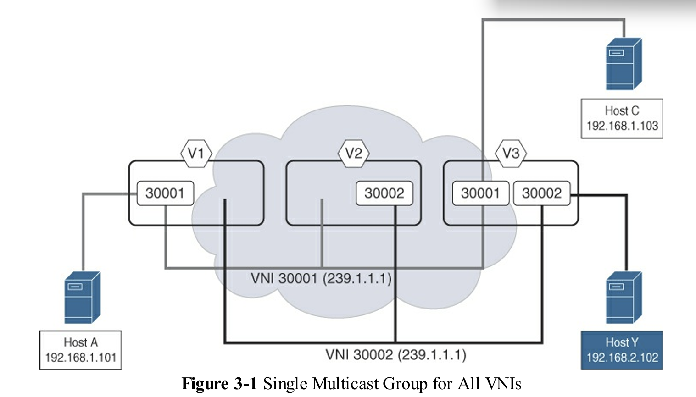 Single Multicast Group for All VNIs

在一個特定的 VXLAN 網路中，有三個邊緣設備作為 VTEP（VXLAN Tunnel End Point）參與其中。這些 VTEP 分別被標記為 V1 (10.200.200.1)、V2 (10.200.200.2) 和 V3 (10.200.200.3)。IP 子網路 192.168.1.0/24 與第二層的 VNI 30001 相關聯，而子網路 192.168.2.0/24 則與第二層的 VNI 30002 相關聯。此外，VNI 30001 和 VNI 30002 共享一個共同的多點傳播群組（Multicast Group）239.1.1.1，但這兩個 VNI 並未擴展到所有三個 VTEP 上。從圖 3-1 中可以清楚看到，VNI 30001 橫跨 VTEP V1 和 V3，而 VNI 30002 則橫跨 VTEP V2 和 V3。然而，這個共享的多點傳播群組會導致所有 VTEP 都加入同一個共享的多點傳播樹（Multicast Tree）。在圖中，當主機 A 發送一個廣播封包時，VTEP V1 會接收到這個封包，並用一個 VXLAN 標頭（VXLAN header）將其封裝起來。由於 VTEP 能夠識別出這是廣播流量（目的 MAC 位址為 FFFF.FFFF.FFFF），它會在外部 IP 標頭（outer IP header）中，將多點傳播群組位址作為目的 IP 位址。最終，這個廣播流量就被對應到相應 VNI 的多點傳播群組 (239.1.1.1) 上。

對於 VNI 30002，其操作相同，因為所有 VTEP 都使用相同的多播群組（239.1.1.1）。BUM 流量會出現在所有 VTEP 上，但如果該 VTEP 上未本地配置 VNI 30002，則流量會被丟棄。否則，流量會沿著映射到 VNI 30002 的 VLAN 中的所有乙太網埠適當地轉發。

從此範例可以清楚看出，透過為 VNI 30001 和 30002 採用不同的多播群組，可以避免不必要的 BUM 流量。VNI 30001 的流量可以限定在 VTEP V1 和 V3，VNI 30002 的流量可以限定在 VTEP V2 和 V3。下圖提供了這樣一個拓撲的範例，以說明作用域限定多播群組的概念。

Scoped Multicast Group for VNI

相同的操作也發生在 VNI 30002 上。VNI 30002 被映射到不同的多播群組（239.1.1.2），該群組在 VTEP V2 和 V3 之間使用。BUM 流量僅出現在參與 VNI 30002 的 VTEP 上——具體來說是多播群組 239.1.1.2。當 Host Z 發送廣播流量時，廣播僅會複製到 VTEP V2 和 V3，導致廣播流量被送到 Host Y。VTEP V1 不會看到這個廣播流量，因為它不屬於該多播群組。因此，在底層網路中，多播出接口（OIF）的數量得以減少。

##### 操作約束與最佳實踐

* **一致性要求：** 對於任一給定的 L2 VNI，所有 VTEP 必須採用相同的多點傳輸處理模式（即要麼全部使用多播模式，要麼全部使用入口複製模式）。
* **PIM 模式一致性：** 如果選擇多播模式，所有 VTEP 必須使用相同的 PIM 協定類型，例如 PIM Any Source Multicast (ASM) 或 BiDirectional PIM (BiDir)。
* **額外開銷：** 設定和維護多播樹需要底層網路額外的協定交換和狀態維護（例如 PIM）。
* **與 EVPN 控制平面的關係：** 在多播模式下，底層 IP 多播機制本身足以建立多播樹，因此 VXLAN BGP EVPN 控制平面**不需要**額外交換 Route Type 3 (RT-3) 訊息來信號傳遞 VTEP 成員資格，從而簡化了控制平面的工作。

> 總結來說，利用底層多播複製是處理 BUM 流量在 VXLAN 網路中實現高效率擴展的首選方法，尤其適用於預期有大量多播應用流量的場景。但是，這要求底層網路必須支援和維護穩定的多播路由環境。

* **機制與優勢：** 始發 VTEP 只發送單一 BUM 流量副本進入底層網路。網路中的路由器在必要的分支點進行複製，確保只有感興趣的 VTEP 接收到流量。這是轉發 BUM 流量最有效率的方式，因為它在網路上保持了「單一副本」。
* **VNI 與多播組的映射：** 每個 Layer 2 VNI (L2VNI) 都被映射到一個特定的 IP 多播組，此映射必須在所有參與該 L2VNI 的 VTEP 上保持一致配置。
* **配置一致性：** 所有 VTEP 必須針對同一 L2VNI 遵循相同的多目標配置模式，且在多播模式下，必須使用相同的 PIM 協定類型（ASM 或 BiDir）。

#### 2. 使用入口複製 (Using Ingress Replication, IR)

入口複製（又稱頭端複製 Head-End Replication, HER 或單播模式 Unicast Mode）是一種不依賴底層多播的*單播方法*。其核心運作原理如下：

1. **單播模擬多播：** IR(ingress replication) 機制利用底層傳輸網路的單播能力來模擬多播行為，以轉發 BUM 流量。
2. **入口 VTEP 承擔複製：** 當 BUM 封包抵達**入口 VTEP** (Ingress VTEP) 時，由該 VTEP 設備負責產生多個副本（即執行資料平面複製操作）。
3. **副本數量：** 假設一個特定的 Layer 2 VNI (L2VNI) 內有 $N$ 個 VTEP 成員，則入口 VTEP 會為每個 BUM 封包製作 $N-1$ 個副本。並將其作為單獨的單播流發送給所有擁有該 L2 VNI 成員資格的遠端 VTEP。
4. **單播傳輸：** 每個副本都會被 VXLAN 封裝，並作為**獨立的單播封包**，根據底層路由，傳送給該 VNI 內所有感興趣的遠端 VTEP。對於底層網路而言，這些副本僅被視為常規的 VXLAN 封裝單播封包。

##### 複製列表的管理與控制平面 (Control Plane Management)

為了有效執行複製操作，入口 VTEP 必須知道哪些遠端 VTEP 參與了該 L2 VNI，從而建構一個**複製列表 (replication list)**。此列表可以透過兩種方式實現：

1. **靜態配置 (Static Configuration)：** 複製列表可以靜態配置在每個 VTEP 上。然而，這種方法的可擴展性差，因為每當網路中新增 VTEP 或 VNI 時，都需要在每個相鄰的 VTEP 上手動重新配置列表。
2. **動態配置 (Dynamic Configuration) – 推薦使用：** 利用 BGP EVPN 控制平面來動態建構複製列表，這是最有效的部署方式。
    * **Route Type 3 (RT-3)：** 當 VTEP 上配置了一個 L2 VNI 時，它會透過 BGP EVPN 宣告自身的 VTEP IP 地址，並使用**路由類型 3 (Route type 3, RT-3)** 訊息，即「Inclusive Multicast Ethernet Tag (IMET) route」，來動態分發 VTEP 及其 VNI 成員資格資訊，從而建構複製列表。
    * **動態列表建構：** Route Type 3 訊息包含了 VNI 資訊和 VTEP 的下一跳 IP 地址。所有參與的 VTEP 接收這些訊息後，即可動態建立起 VNI 成員的複製列表，簡化了 VTEP 鄰居的發現過程。

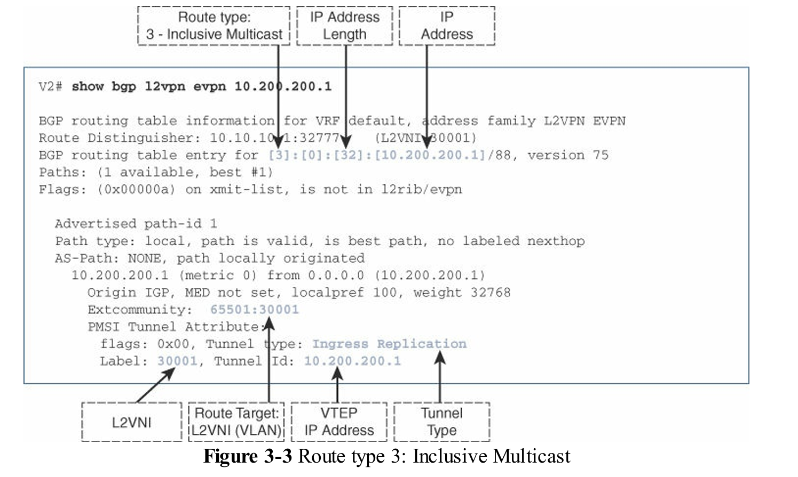 Route type 3: Inclusive Multicast

>**性能考量：** 雖然此模式簡化了底層網路的複雜性（無需運行 PIM 多播），但它會在入口 VTEP 和底層鏈路上產生巨大的流量開銷，尤其是在 VTEP 數量較多或 BUM 流量較大的環境中，效率遠不如多播模式。

### VXLAN BGP EVPN 增強功能 (VXLAN BGP EVPN Enhancements)

為了進一步減少 VXLAN 網路中不必要的廣播流量並提高轉發效率，EVPN 引入了多項優化功能。

#### ARP 抑制與未知單播抑制 (ARP Suppression and Unknown Unicast Suppression)

在傳統的 Flood and Learn 網路中，ARP 廣播是必須的，但在大規模數據中心中會嚴重影響效能。

* **ARP 抑制機制：** 透過 ARP Snooping 和 BGP EVPN 控制平面，VTEP 可以學習本地連接端點的 IP-MAC 綁定資訊。當本地端點發送 ARP 請求給已知遠端端點時，VTEP 會在本地攔截該請求，並作為 ARP Proxy 立即發送單播 ARP 回覆，從而阻止 ARP 廣播進入 VXLAN 核心網。
* **沉默端點處理：** 如果 ARP 查找結果為「遺失」（端點未知或為沉默端點），ARP 請求仍會作為 BUM 流量泛洪到 VXLAN 網路中，以便觸發目的端點回應，進而學習其資訊。
* **未知單播抑制：** 這是一個獨立功能，可以針對每個 L2 VNI 啟用，用於抑制因 DMAC 查找失敗而引起的泛洪流量進入 VXLAN 網路。

> 位址解析協定（ARP）負責在 IP 網路中將 IPv4 位址對應到 MAC 位址。ARP 透過 ARP 廣播請求中發送的 IP 位址資訊，協助獲取端點的 MAC 位址資訊。

##### ARP 抑制機制綜述 (ARP Suppression Mechanism Overview)

ARP 抑制機制的核心目標是最小化或消除 VXLAN 網路中由於位址解析協定（ARP）引起的廣播流量，從而降低泛洪對網路資源的消耗和對規模的限制。

1. **基礎功能與流量類型：** ARP 負責解析 IPv4 地址與 MAC 地址的綁定，透過廣播請求（屬於 BUM 流量中的廣播部分）進行。IPv6 環境中則使用鄰居發現協定（ND, Neighbor Discovery Protocol），透過多播的鄰居請求（NS, neighbor solicitation）和單播的鄰居通告（NA, neighbor advertisement）進行解析。
2. **控制平面依賴：** ARP 抑制完全依賴於 **BGP EVPN 控制平面**所交換的資訊。本地邊緣設備（VTEP）透過 ARP 偵聽（ARP Snooping）機制學習直連端點的 IP/MAC 綁定資訊。*一旦學習到，此資訊會透過 BGP EVPN Route Type 2 訊息，主動且快速地分發給網路上所有感興趣的遠端 VTEP*。

> ARP 抑制(ARP Suppression)不同於 Proxy ARP，其中邊緣設備或路由器可能會代表目的端點作為代理，使用其自身的路由器 MAC。ARP 抑制通過利用 BGP EVPN 控制平面資訊來減少 ARP 廣播流量。

#### ARP 抑制的運作流程 (Operational Flow of ARP Suppression)

##### 1. 成功抑制場景（目的地已知）

下圖說明了一個場景，其中 VTEP V1 的 ARP 抑制導致在 Layer 2 VNI 30001 中，對主機 192.168.1.101 發出的請求對主機 192.168.1.102 的 ARP 提前終止。重要的是要注意，ARP 抑制功能的運作是基於在 Layer 2 VNI 下啟用的控制選項，而不管葉節點是否配置了預設閘道(default gateway)。

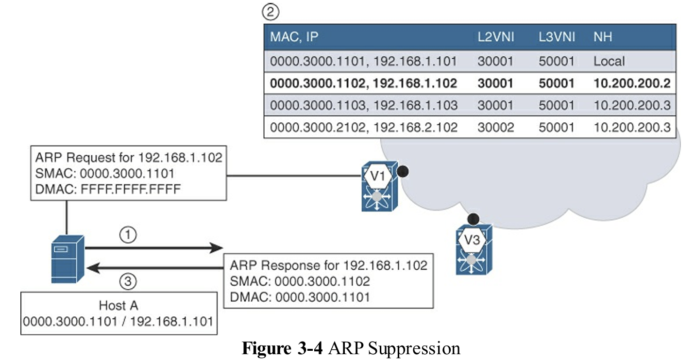 ARP Suppression

上圖在展示 VXLAN BGP EVPN 網路中的「ARP 抑制 (ARP Suppression)」機制，這是一種優化手段，用於減少廣播流量（屬於 BUM 流量）在網路核心中的泛洪，從而提高網路的可擴展性。

1. 運作情境與目標

* **情境假設：** 圖中描繪了源端點 (Host A, IP 192.168.1.101) 嘗試解析同一 Layer 2 VNI 30001 內目的地 (Host B, IP 192.168.1.102) 的 MAC 地址。
* **關鍵機制：** 運作的前提是目的端點 (Host B) 的 IP-to-MAC 綁定資訊已經透過 **BGP EVPN 控制平面**分發，並儲存在源 VTEP (V1) 的本地資料庫中。
* **目標：** 實現 ARP 請求的**及早終止 (early ARP termination)**，避免其作為廣播流量進入 VXLAN 隧道並在整個網路中泛洪。

2. 抑制流程（目的地已知的情況）

當 Host A 發出 ARP 廣播請求以查詢 Host B 的 MAC 地址時，VTEP V1 執行以下步驟：

1. **ARP 偵聽 (ARP Snooping)：** 源 VTEP (V1) 偵測並攔截到 Host A 發出的 ARP 廣播請求。
2. **控制平面查詢：** V1 根據 ARP 請求中的目標 IP (192.168.1.102)，查詢其本地儲存的端點資訊資料庫。由於 Host B 的資訊已由 BGP EVPN 預先填充，查詢結果為「已知」。
3. **ARP 代理回應：** V1 立即扮演 **ARP 代理 (ARP Proxy)** 的角色，代 Host B 生成一個單播 ARP 回應。此回應包含 Host B 的 MAC 地址，並單播返回給 Host A。

3. 機制優勢

* **流量優化：** 透過這種方式，ARP 請求在到達遠端 VTEP 之前，即在本地 VTEP 被終止 (terminated at the earliest possible point)，避免了 ARP 廣播流量在 VXLAN 網路上的傳輸。
* **配置獨立性：** 該機制是基於 Layer 2 VNI 啟用的，並且其功能獨立於葉交換器上是否配置了分散式 IP Anycast 閘道器 (default gateway)。

此 ARP 抑制機制是 VXLAN BGP EVPN 相較於傳統 Flood and Learn (F&L) 模型在 Layer 2 擴展性方面的重大改進。

> ARP 抑制是以每個 Layer 2 VNI 為單位啟用的。這樣，對於所有已知端點，ARP 請求僅在端點與本地邊緣設備/VTEP 之間發送。

##### 2. 靜默/未知端點發現場景（目的地未知）

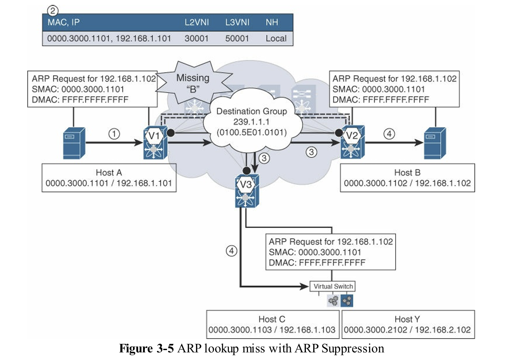 ARP lookup miss with ARP Suppression

上圖說明了一個涉及 ARP 終止 (ARP termination) 或 ARP 抑制 (ARP suppression) 的情境，其中控制平面發生了未命中 (miss)。主機 A 和主機 B 屬於同一個 IP 子網路，對應到第二層 VNI 30001。主機 A 想要與主機 B 通訊，但其 ARP 快取中尚無主機 B 的 MAC 到 IP 位址對應資訊。

因此，主機 A 發送一個 ARP 請求，以確定主機 B 的 MAC 到 IP 位址的綁定關係。VTEP V1 偵聽 (snooped) 到此 ARP 請求。VTEP V1 使用從 ARP 請求酬載中收集到的目標 IP 位址資訊，在 BGP EVPN 控制平面中查詢關於主機 B 的資料。

由於主機 B 在網路中尚為未知，這個廣播 ARP 請求會被封裝到 VXLAN 中，其目的地位址為一個多點廣播 (multicast) 群組的 IP 位址或一個單點廣播 (unicast) 的目的地 IP 位址。當底層網路 (underlay) 啟用多點廣播時，便會利用多點廣播群組。否則，如前所述，會使用前端複製 (head-end replication) 的方式，產生多個單點廣播複本並傳送給每個遠端的相關 VTEP。

傳送給 VTEP V2 和 VTEP V3 的 ARP 廣播會被適當地解封裝 (decapsulated)，其內部的廣播酬載會被轉送到所有屬於 VNI 30001 成員的乙太網路埠上。如此一來，ARP 請求便會抵達主機 B，而主機 B 會以一個單點廣播 (unicast) 的 ARP 回應回傳給主機 A。

一旦這個單點廣播 ARP 回應抵達 VTEP V2，其資訊就會被偵聽 (snooped)，控制平面 (control plane) 接著就會更新為主機 B 的 IP/MAC 位址資訊。同時，這個 ARP 回應會被封裝，並跨越 VXLAN 網路轉送給 VTEP V1。

VTEP V1 在收到 ARP 回應後，會解開封裝 VXLAN 標頭，並根據在 VNI 30001 中的第二層查詢 (Layer 2 lookup) 結果，將解封裝後的 ARP 回應轉送出去。最終，主機 A 會收到 ARP 回應，並將資訊填入 (populates) 其本地的 ARP 快取中。

從此刻起，主機 A 與主機 B 之間的雙向通訊便已啟用，因為網路中現在已經知道這兩台主機的所有 MAC 和 IP 位址資訊了。

在 VXLAN BGP EVPN 架構中，端點之間的 ARP 請求與回應流程，與傳統乙太網路或任何其他泛洪與學習 (Flood and Learn, F&L) 網路相似。然而，*控制平面與 ARP 抑制 (ARP suppression) 的優勢是透過 BGP EVPN 資訊來實現的*。*對一個端點的單次 ARP 解析，就會觸發控制平面將該端點的資訊散佈到整個網路的所有 VTEP 中。因此，任何後續針對已知端點的 ARP 請求，都會在本地得到回應，而不會在整個網路中進行泛洪*。

由於 ARP 偵聽 (ARP snooping) 會主動學習端點資訊來填充控制平面，這確實有助於減少未知單點廣播 (unknown unicast) 的流量。ARP 請求實際上只需要在端點尚未被發現的初始階段進行泛洪。然而，還有其他未知單點廣播流量的來源（例如，普通的第二層非 IP 流量，甚至是常規的第二層 IP 流量），這些流量可能會遭遇目的 MAC 位址查詢未命中 (DMAC lookup miss)，從而導致流量在整個 VXLAN 網路中被泛洪。

為了完全停用因未知單點廣播流量而導致流向 VXLAN 網路的任何泛洪，業界引入了一項稱為「未知單點廣播抑制 (unknown unicast suppression)」的新功能。這個獨立的功能可以針對每個第二層 VNI 單獨啟用。*啟用此功能後，當任何第二層流量遭遇目的 MAC 位址查詢未命中時，流量僅會在本地進行泛洪，而不會泛洪到 VXLAN 網路上*。因此，如果網路中不存在靜默主機 (silent host) 或未知主機，BGP EVPN VXLAN 網路中的泛洪便有可能被降至最低。

如果目的地端點是「靜默主機」（silent endpoint），即尚未主動發送流量來註冊其 IP/MAC 綁定資訊：

* **查詢失敗與泛洪：** VTEP 在查詢控制平面時會發生「失誤」（miss）。此時，VTEP 會將 ARP 請求作為 BUM 流量*重新注入到 VXLAN 網路*中，並透過底層的泛洪機制（多播或入口複製）轉發。
* **遠端學習與註冊：** 目的地 VTEP 收到此 ARP 請求後，該靜默端點會發出 ARP 回應。目的地 VTEP 透過 ARP 偵聽學習到該端點的 IP/MAC 綁定。
* **控制平面更新：** 目的地 VTEP 立即將此新的端點資訊透過 BGP EVPN Route Type 2 訊息通告給網路中所有其他 VTEP。
* **結果：** 儘管初次通信需要泛洪，但一旦發現靜默端點，其資訊就會網路範圍內同步。後續所有針對該端點的 ARP 請求都將在源 VTEP 處被本地抑制，而不會在整個網路中進行泛洪。

#### 相關特性與注意事項 (Related Features and Considerations)

* **配置範圍：** ARP 抑制功能是基於 **Layer 2 VNI (L2VNI)** 啟用的。
* **IPv6 等效機制：** 針對 IPv6，BGP EVPN 支援類似機制，使用 **Neighbor Discovery (ND)** 流量來填充控制平面資訊。
* **與未知單播抑制的關係：** ARP 抑制專門針對 ARP 廣播流量。即使 ARP 流量被抑制，網路中仍可能存在其他原因引起的未知單播（Unknown Unicast）流量（例如非 IP 的 Layer 2 流量）。為此，VXLAN BGP EVPN 提供了**未知單播抑制（Unknown Unicast Suppression）**功能，這是一個獨立的特性，可在每個 L2 VNI 上配置，以完全阻止因 DMAC 查詢失敗而導致的 VXLAN 網路泛洪。

總而言之，ARP 抑制是 VXLAN BGP EVPN 解決傳統乙太網路規模限制的關鍵創新之一。透過將 MAC/IP 學習從依賴數據平面泛洪轉變為依賴 BGP EVPN 控制平面主動分發，網路能夠在保持 Layer 2 橋接語義的同時，實現優異的可擴展性和更快的收斂速度。

#### 2. 分散式 IP Anycast 閘道 (Distributed IP Anycast Gateway, DIPAG)

此技術是 VXLAN BGP EVPN Fabric 的核心優勢，旨在提供高效能、高可用性的 Layer 3 服務，並消除傳統網路中的單點瓶頸。

##### 分散式 IP Anycast 閘道的核心概念與目標

分散式 IP Anycast 閘道是 VXLAN BGP EVPN Fabric 中的一項增強功能，其設計目標是將端點的默認網關功能分配到 Fabric 中的所有 Leaf/ToR 交換器上。

* **優化網路邊界**：該技術將傳統上位於聚合層 (Aggregation Layer) 的 L2/L3 邊界移動到 **Leaf/ToR 交換器**（VTEP 所在位置）。
* **消除傳統協議**：由於每個 Leaf 獨立運行網關功能，它消除了傳統 FHRP (First-Hop Redundancy Protocol)，例如 HSRP 或 VRRP，所需的 `hello` 協議或操作狀態交換，從而減少了網路和協議狀態。
* **優化轉發路徑**：該網關確保無論端點在 Fabric 中的何處移動，都能找到其默認網關，並使得橋接 (bridged) 和路由 (routed) 流量始終以最佳路徑轉發，且具有可預測的延遲。

 Gateway Placement

##### Anycast 機制與地址共享

分散式 IP Anycast 閘道的運作基於「任播 (Anycast)」的網路定址概念，即「一對最近關聯」(one to the nearest association)。

* **共享 IP 地址**：Fabric 中所有提供服務的邊緣設備（Leaf/VTEP）都可以配置**相同的默認網關 IP 地址**。
* **Anycast 網關 MAC 地址 (AGM)**：為了實現端點的無縫移動 (seamless host mobility)，所有分散式 IP Anycast 網關都會共享**相同的 MAC 地址 (AGM)**。
  * **作用**：端點的 ARP 快取中存儲了默認網關 IP 與此共享 AGM 的綁定。無論端點移動到 Fabric 中的哪個 Leaf 交換機，默認網關的 IP-to-MAC 綁定都保持不變，從而**消除流量黑洞 (black-holing)** 的可能性。
  * **ARP 處理**：當端點發送 ARP 請求以解析默認網關時，**只有本地連接**到該端點的邊緣設備 (VTEP) 會捕獲並響應 ARP 請求，並使用共享的 AGM 地址進行回覆。

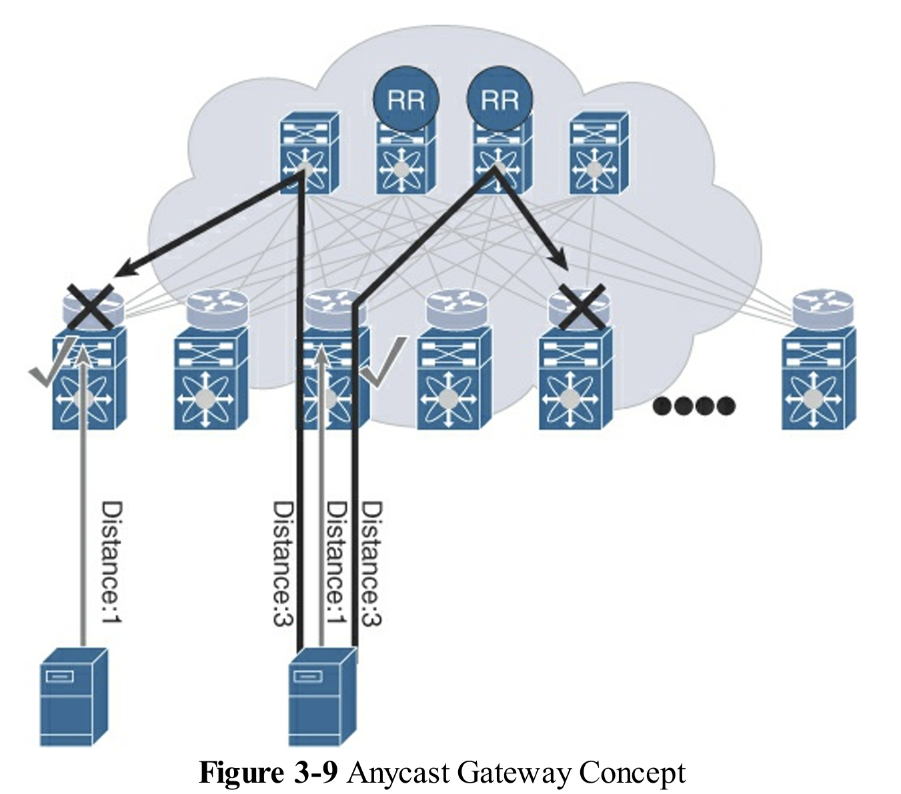 Anycast Gateway Concept

下圖在 VXLAN BGP EVPN 結構中分散式IP任播閘道的邏輯實現。

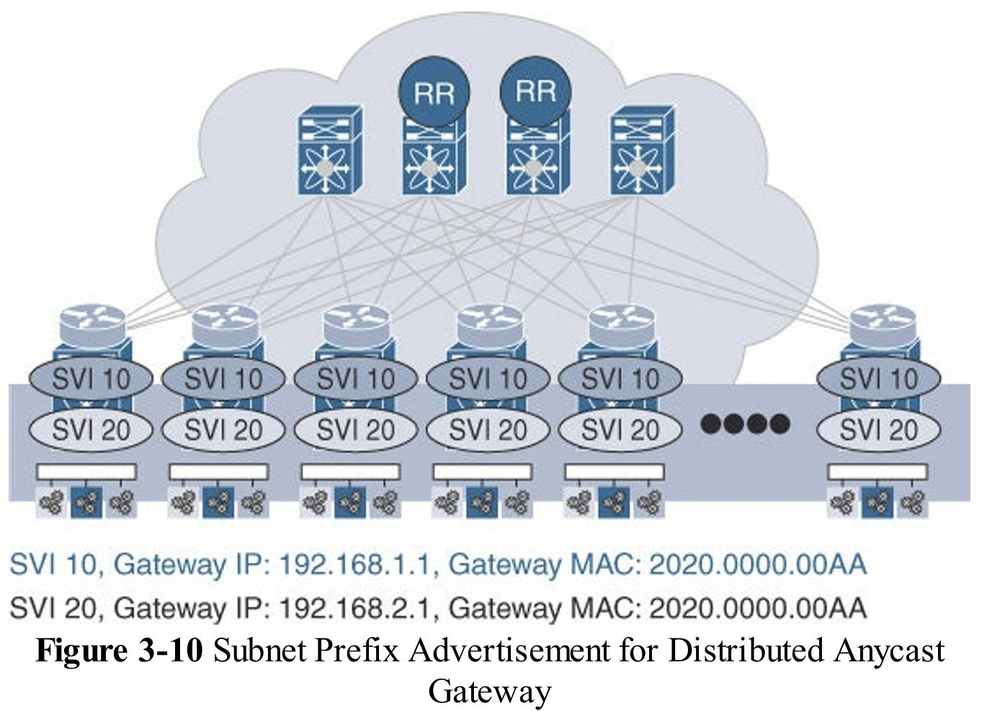 Subnet Prefix Advertisement for Distributed Anycast Gateway

> Anycast 是一種網路位址與路由方法論，資料流從終端點發出時，會在拓撲上導向同一組閘道中距離最近的節點，所有這些節點都使用相同的目的地 IP 位址。

##### 靜默端點 (Silent Endpoints) 的處理機制

靜默端點是指尚未發送 ARP 請求，因此其 IP/MAC 綁定資訊尚未被 BGP EVPN 控制平面學習到的端點。

* **傳統路由**：如果沒有該端點的 Host Route (/32 或 /128) 信息，發往該端點的流量會被丟棄（黑洞）。
* **子網前綴通告**：為解決此問題，分散式 IP Anycast 閘道會通告其所服務子網的 **IP 子網前綴路由 (Subnet Prefix Route)** (使用 BGP **Route type 5** 消息)。
* **發現流程**：
    1. 遠端 VTEP 收到發往靜默端點的流量，但由於缺乏精確的 Host Route，流量會命中更廣泛的**子網前綴路由**。
    2. 該命中會導致一個 **Glean Adjacency** 動作。
    3. VTEP 隨後會發送 ARP 請求到本地連接的 Layer 2 網路，以發現該靜默端點。
    4. 靜默端點響應後，其 Host Route 信息將被學習並透過 BGP EVPN 通告出去。

這種分散式方法基於子網前綴路由，比使用默認路由 (0.0.0.0/0) 更具可擴展性，能有效發現靜默端點。

#### 3. 整合路由和橋接 (Integrated Route and Bridge, IRB)

IRB 功能在 VTEP 處同時實現 Layer 2 橋接和 Layer 3 路由，是實現 DIPAG 的核心技術。

* **非對稱 IRB (Asymmetric IRB)：** 遵循 **橋接-路由-橋接** 的操作模式。去程和回程流量使用**不同的** Layer 3 VNI (L3VNI) 進行封裝，要求所有 VTEP 必須配置所有相關的 L2VNI，配置維護相對複雜。
* **對稱 IRB (Symmetric IRB)：** Cisco NX-OS 實作採用此模式。遵循 **橋接-路由-路由-橋接** 的操作模式。去程和回程流量都使用與 VRF 關聯的**相同** L3VNI 進行封裝。此模式允許**限定範圍的配置**（Scoped Configuration），即 L2VNI 僅需配置在有端點連接的 VTEP 上，提高了多租戶部署的靈活性和擴展性。

分散式 IP Anycast 閘道的實現依賴於 **Integrated Routing and Bridging (IRB)** 功能。IRB 提供了在 VXLAN 封裝下，路由和橋接流量的能力。

VXLAN BGP EVPN 構建下的 IRB 存在兩種主要的轉發模式：

1. 非對稱 IRB (Asymmetric IRB)

* **模式**：遵循 **Bridge–Route–Bridge** 轉發模式。
* **VNI 使用**：去程和回程流量在 VXLAN 封裝時可能使用**不同的 VNI**。例如，Host A 到 Host X 的流量可能使用 VNI 30002 轉發，而回程流量則使用 VNI 30001 轉發。
* **一致性要求**：此模式要求在所有 VTEP 上，所有涉及的 VNI 配置都必須一致，否則可能導致流量黑洞 (traffic black-holed)。

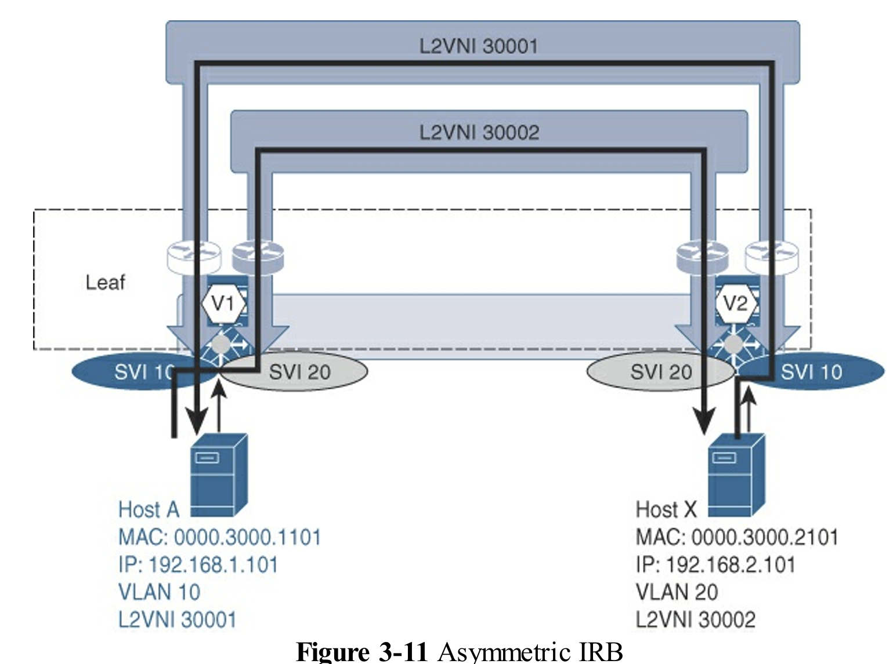 Asymmetric IRB

下圖說明了主機 A 與主機 Y 之間的流量正常流通，但主機 Y 向主機 A 的反向流量無法傳送，原因是連接主機 Y 的 VTEP 上缺少 VNI 30001 的配置。主機 A 與主機 X 之間的流量將正確轉發，因為連接的 VTEP 上同時存在兩個 IRB 介面（SVI 10 和 SVI 20）。

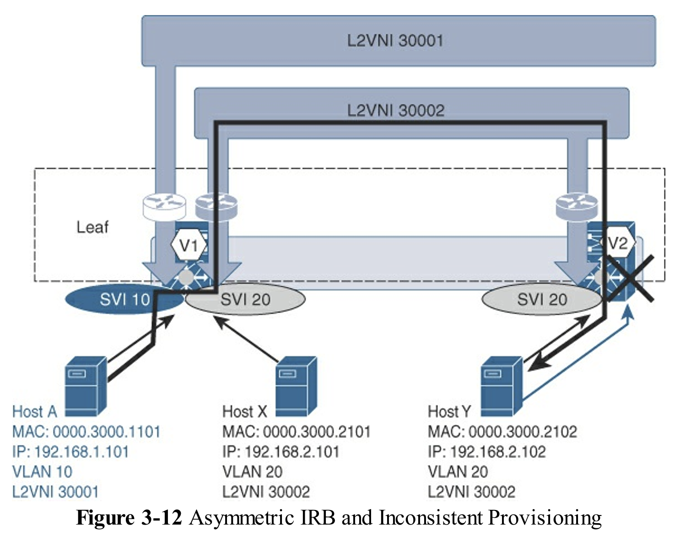 Asymmetric IRB and Inconsistent Provisioning

2. 對稱 IRB (Symmetric IRB)

* **模式**：遵循 **Bridge–Route–Route–Bridge** 轉發模式。
  * 不要求在所有 VXLAN 網路的所有邊緣設備上維持一致的配置
* **VNI 使用**：所有同一 VRF 內部的路由流量，不論方向，都會使用與該 VRF 相關聯的**相同 Layer 3 VNI (L3VNI)** 進行 VXLAN 封裝和轉發。
  * 對於特定的 VRF，相同的第 3 層 VNI 需要在所有 VTEP 上配置，因為 VRF 允許執行橋接–路由–路由–橋接的順序操作
* **Cisco 實作**：Cisco NX-OS 的實作採用**對稱 IRB 模式**。
* **L3VNI 作用**：Layer 3 VNI 代表一個**轉輸網段 (transit segment)**，用於連接不同的 VTEP，並提供 Layer 3 服務。

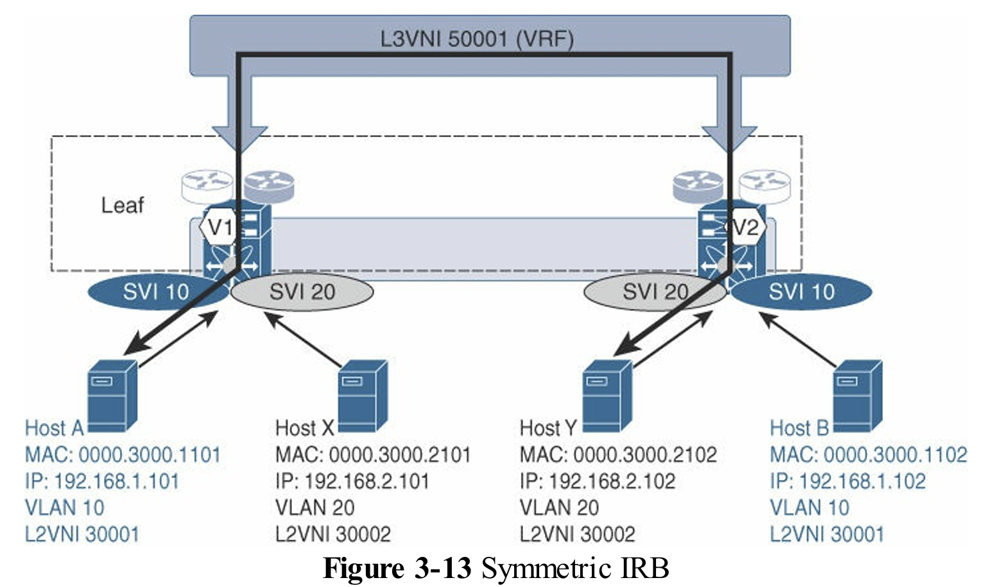 Symmetric IRB

上圖，主機 A 連接到 VTEP V1，並希望與連接到 VTEP V2 的主機 Y 通訊。主機 A 將數據流量發送到 VLAN 10 中與本地子網相關的預設閘道。從 VLAN 10 出發，流量會根據目的地 IP 查詢進行路由。查詢結果指出哪些流量需要進行 VXLAN 封裝，並將流量發送向下方有主機 Y 的 VTEP V2。封裝的 VXLAN 流量從 VTEP V1 發送到 VTEP V2，使用 VNI 50001，其中 50001 是與主機 A 和主機 Y 所在的 VRF 相關的第 3 層 VNI。一旦封裝的 VXLAN 流量到達 VTEP V2，流量會被解封裝並在 VRF 內路由到主機 Y 所在的 VLAN 20。這樣，從主機 A 到主機 Y 的流量會執行橋–路由–路由–橋的對稱序列。需要注意的是，與主機 A 和主機 Y 所在網路相關的第 2 層 VNI 不會用於對稱 IRB 選項下的路由操作。

> L2VNI 和 L3VNI 之間的區別是在 BGP EVPN 控制平面中，針對 VXLAN 標頭 24 位 VNI 欄位進行識別的。

### 端點移動性 (Endpoint Mobility)

EVPN 設計了優雅的機制來處理端點（如 VM）在 Fabric 內移動時的快速收斂和地址更新。

* **序列號 (Sequence Number)：** BGP EVPN 透過在 **Route Type 2** 訊息中包含一個 **MAC 移動性擴展社群 (MAC mobility extended community)** 和遞增的序列號。當端點移動到新 VTEP 時，新 VTEP 會發送一個序列號遞增的 Route Type 2 更新，覆蓋舊 VTEP 的宣告。
* **快速收斂：** 這種序列號機制避免了傳統網路中因 MAC/ARP 老化時間導致的服務中斷，無需等待舊路徑被撤銷，實現「即時」收斂。
* **重複地址偵測：** 該機制也用於偵測意外配置的重複 MAC/IP 地址（Duplicate Endpoints），一旦在短時間內偵測到多次移動（例如 180 秒內移動 5 次），系統會啟動凍結計時器以避免網路不穩定。

下圖展示了一個示例端點移動用例及相關的 BGP EVPN 狀態，其中端點 Host A 已從 VTEP V1 移動至 VTEP V3。

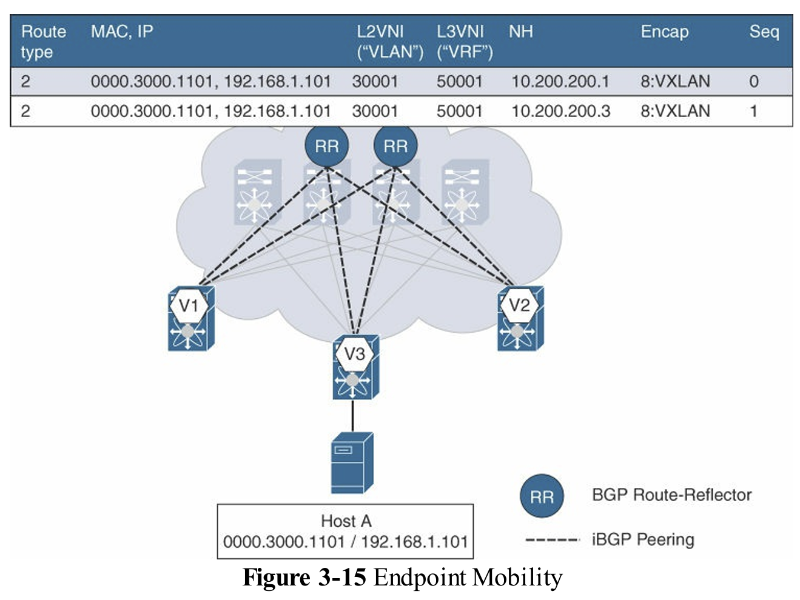 Endpoint Mobility

### 虛擬埠通道 (vPC) 在 VXLAN BGP EVPN 中的應用

vPC（Multi-Chassis Link Aggregation, MC-LAG）用於實現 Layer 2 雙歸屬和設備冗餘。

* **Anycast VTEP 概念：** 參與 vPC 的一對 VTEP 共享一個 **虛擬 IP 地址 (VIP)** 作為 Anycast VTEP。所有附屬於該 vPC 域的端點，其可達性（無論是 Route Type 2 還是 Route Type 5）都透過這個共享的 VIP 作為下一跳 (Next Hop) 進行宣告。
* **流量轉發：** 從遠端 VTEP 發往該 Anycast VTEP VIP 的流量，將依賴底層路由網路的 ECMP 機制，平均分配給 vPC 對中的兩個成員。
* **孤點端點 (Orphan Endpoints)：** 對於僅連接到 vPC 對中單一成員的孤點端點，若 ECMP 流量被導向到錯誤的 vPC 成員，流量將透過 vPC Peer Link 轉發到正確的成員，確保可達性。
* **`advertise-pip` 功能：** 為了應對某些路由特殊情況（如南向子網或 DHCP Relay），可以啟用此功能。它允許 VTEP 使用其**單獨的物理 IP 地址 (PIP)** 來宣告 Route Type 5（IP 前綴路由），而 Route Type 2（主機路由）仍使用共享 VIP。

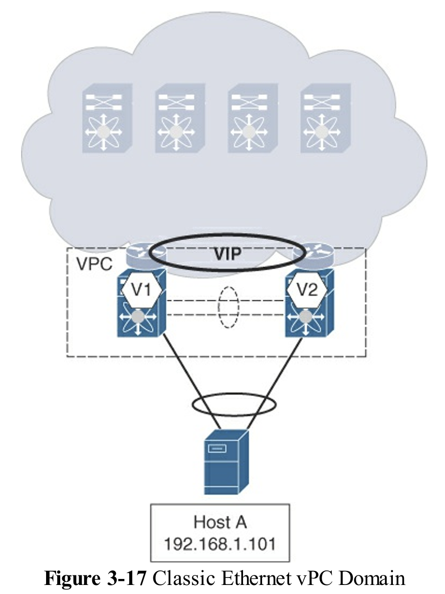 Classic Ethernet vPC Domain

 vPC with VXLAN BGP EVPN

上圖顯示了一個示例 vPC 域。VTEP V1 的 IP 地址為 10.200.200.1/32，而 VTEP V2 的 IP 地址為 10.200.200.2/32。

VIP 由兩個 vPC 成員交換機同時廣播，因此兩個 vPC 成員都可以直接接收來自任何本地連接端點的流量。遠端 VTEP 可以透過底層路由網路中的 ECMP，到達由兩個 vPC 成員交換機廣播的 VIP。這樣，只要至少有一條到任一 vPC 成員交換機或 VTEP 的路徑，雙重連接的端點就可以被到達。在兩個 VTEP 上添加了次要 IP 地址，該地址代表 VIP 或任播 IP 地址（具體為 10.200.200.254/32）。

> Anycast VTEP」這個術語不應與「anycast gateway」混淆。請記住，anycast gateway指的是給定子網的分散式 IP anycast 閘道，該閘道同時被所有 leaf（包括配置為 VPC 對等的 leaf）共享，並且 leaf 之間通過 BGP EVPN 交換終端主機可達性信息。

### 動態主機配置協定 (DHCP) 處理

在 DIPAG 環境中，DHCP 處理需要特殊調整，因為所有 VTEP 共享閘道 IP，可能導致 DHCP 響應無法返回正確的 VTEP。

* **DHCP Relay 挑戰：** 預設情況下，DHCP Relay 會在 **GiAddr 欄位**中使用閘道 IP 地址。當 DHCP 伺服器響應時，可能會因為 Anycast IP 的存在而將響應路由到錯誤的 VTEP。
* **解決方案：** 必須配置 DHCP Relay，使用 VTEP 上的 **唯一可路由 IP 地址** 來填充 GiAddr 欄位（例如使用 `ip dhcp relay source-interface` 命令）。
* **DHCP 選項 82：** 由於 GiAddr 不再用於子網範圍選擇，需要同時配置 **DHCP Option 82**（通常使用 **Link Selection** 或 **Circuit-ID** 子選項），以便 DHCP 伺服器能夠確定正確的 IP 子網範圍來分配地址。
