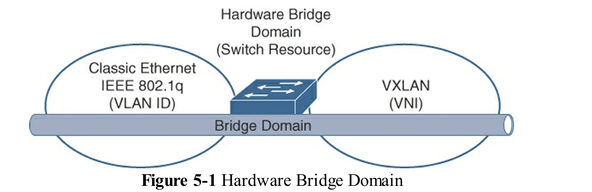
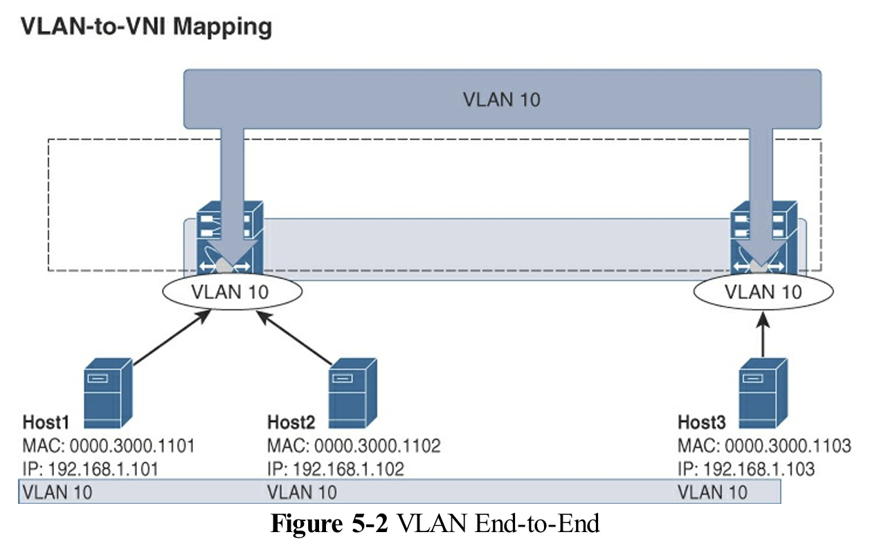
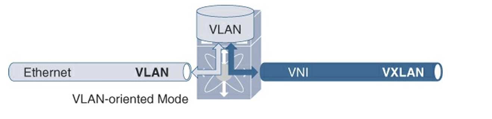
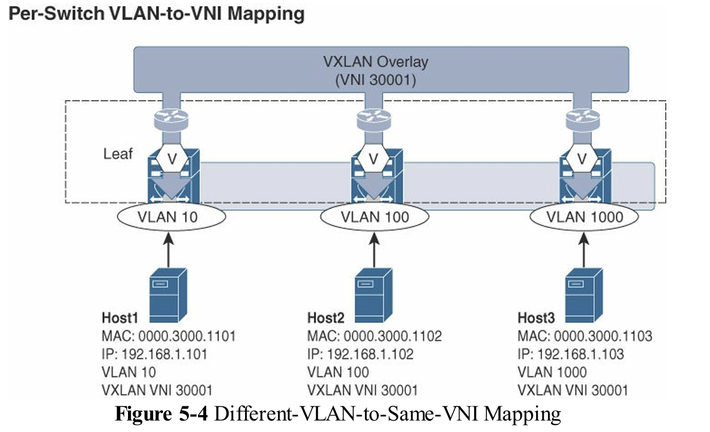
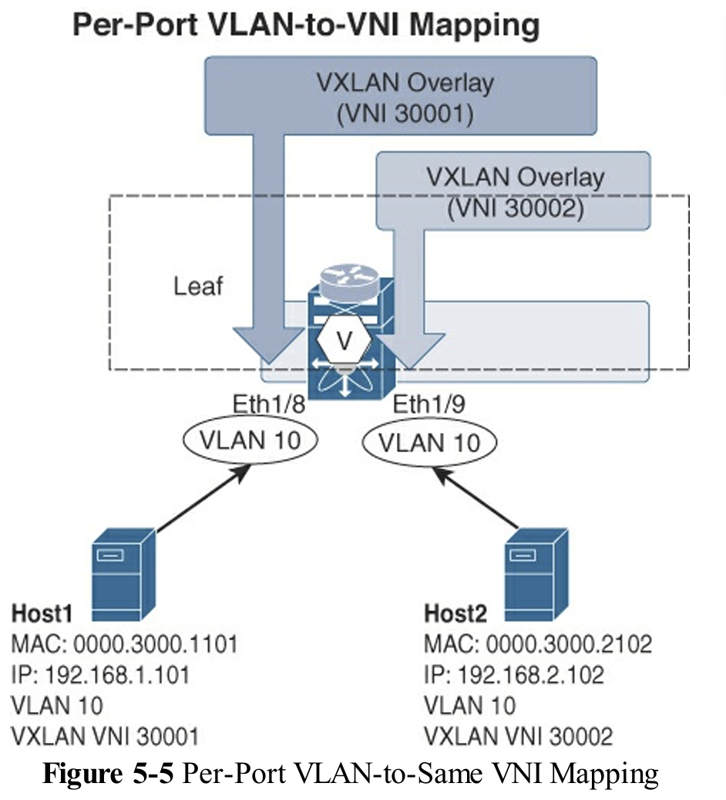
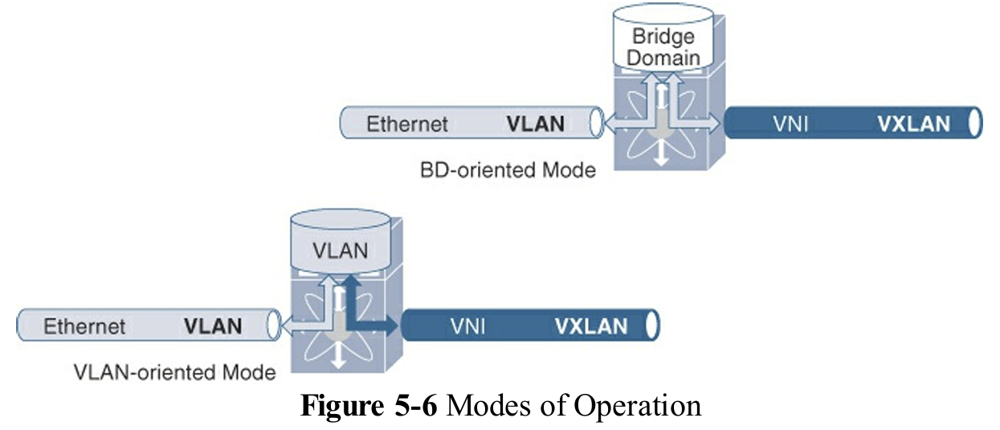
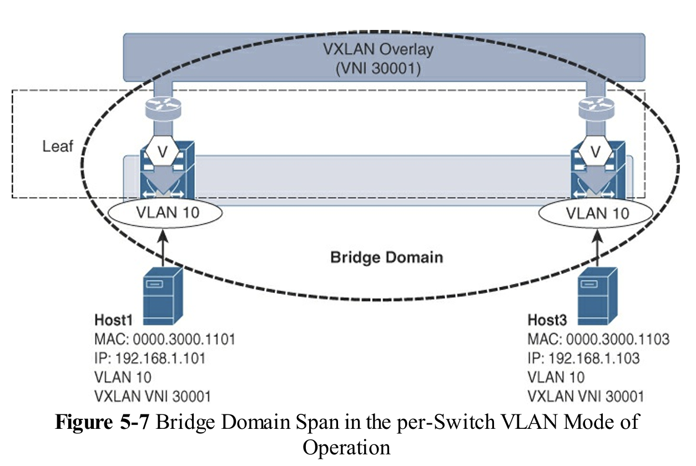

# Chapter 5 Multitenancy (多租戶) 重點整理

多租戶是一種操作模式，允許多個獨立的邏輯實例（租戶）在共享環境中運作。其核心目標是提供控制平面和數據平面的分離，以確保租戶之間保持適當的隔離，防止任何非預期的跨通信。

VXLAN 標頭有一個 24 位的標識符，稱為虛擬網路標識符（VNI）。VXLAN 封裝使用這個單一的欄位來唯一識別第 2 層或第 3 層服務。VXLAN 搭配 BGP EVPN 提供第 2 層以及第 3 層的多租戶功能，並且根據所考慮的服務類型，對應的 VNI 會使用不同的術語。每當使用第 2 層服務時，通常意味著同一子網或相同廣播域內的通信，會使用第 2 層 VNI（L2VNI）這個術語。每當使用像 VRF 這樣的第 3 層服務時，則使用第 3 層 VNI（L3VNI）或 VRF VNI 這個術語。第 2 層和第 3 層 VNI 的區分完全取決於服務，而不試圖描述 VXLAN 封裝本身中的不同欄位。

## 1. Bridge Domains (橋接域)

橋接域 (Bridge Domain, BD) 是一種在 Layer 2 運作的多租戶服務，代表 Layer 2 網路的範圍或廣播域。

* **隔離機制**：在經典乙太網路中，VLAN 是提供 L2 隔離的最常用方式。VXLAN 則使用 **VNI (Virtual Network Identifier)** 來達成相同的效果。
* **命名空間比較**：
  * IEEE 802.1Q VLAN 命名空間 (namespace) 為 12 位元，最多僅能提供 4096 個 VLAN。
  * VXLAN 命名空間為 24 位元，可提供 **1600 萬個網路區段**。
* **橋接域的組成**：在 VXLAN 環境中，一個橋接域包含三個組件：
    1. 經典乙太網路域與其 VLAN 命名空間。
    2. VXLAN 域與其 VNI 命名空間。
    3. 網路交換器中的硬體或軟體橋接域資源。
* **映射作用**：橋接域提供了將 Layer 2 服務橫跨多種封裝（VLAN 和 VNI）的能力。VTEP 在單一 VLAN 領域和 VXLAN VNI 領域之間執行映射，將兩者「縫合」(stitched) 到相同的硬體橋接域或軟體橋接域。

 Hardware Bridge Domain

## 2. VLANs in VXLAN (VXLAN 中的 VLAN)

在傳統乙太網路中，VLAN ID 具有**全域有效性** (globally significant)，在網路中從頭到尾使用單一 VLAN。但在 VXLAN 中，VLAN 的角色發生了轉變：

* **本地與全域識別符**：VLAN 變為**本地有效** (locally significant)，僅在連接端點的 VTEP 上有效。**VXLAN VNI (L2VNI)** 則成為跨 Fabric 的**全域唯一識別符**。
  * 使用 VXLAN 時，VLAN 變成區域性的意義，而全局識別符則變成 VXLAN 的 VNI。
* **映射關係**：在邊緣設備上，VLAN 會被配置並映射到對應的 VXLAN VNI (vn-segment)，通常是 **1:1 的關係**。這使得不同交換器上的不同 VLAN 也能映射到相同的 VNI。
* **每埠 VLAN 有效性 (Per-Port VLAN Significance)**：此功能允許在**每個埠基礎上**使用完整的 VLAN 命名空間，並將每個 (埠, VLAN) 組合映射到唯一的 VNI，這適用於 VLAN 重疊的應用場景。
* **BGP EVPN 實例通告**：為將 L2VNI 通告到 BGP EVPN 地址族，需要配置 EVPN Layer 2 實例 (EVI)。
  * **Route Distinguisher (RD)**：RD 用於唯一標識 EVI 實例。在每個邊緣設備上，L2 EVI 的 RD 都是獨特的。RD 通常由路由器 ID 和內部 L2 實例 ID (L2VNI) **自動推導**出來。
  * **Route Targets (RT)**：L2VNI 和 RT 在所有共享相同 Layer 2 服務的邊緣設備上必須具有**共同值**。RT 是從 BGP 自治系統編號 (ASN) 和 L2VNI **自動推導**出來的。

在經典以太網環境中，VLAN 的命名空間具有全局意義。對於給定的第二層網路，從第一個交換機到最後一個交換機，整個過程中使用單一 VLAN，如圖 5-2 所示。這使得 VLAN ID 成為基於以太網網路中的全局識別碼，並進而提供 4K 的 VLAN 邊界。

 VLAN End-to-End

在大多數情況下，VLAN 變成每台交換機的標識符。在進入網路交換機時，會將 VLAN 標識符轉換為 VXLAN VNI（L2VNI），如下圖所示。由於 VXLAN VNI 可用的位數比 dot1q 標籤更多，因此在設計整體編號方案時，可以有意義的重疊選擇。

 VLAN-to-VXLAN Mapping in an Edge Device

VLAN 成為本地標識，而 VNI 則成為全局標識。*VLAN 現在僅對該邊緣設備具有意義*。以此方式，不同邊緣設備上的不同 VLAN 可以映射到相同的 VNI。從 VLAN 映射到 VNI，再最終映射回 VLAN，現在可以靈活使用，只要 VNI 作為全局唯一標識即可。

 Different-VLAN-to-Same-VNI Mapping

下圖顯示了一個情境，在特定的邊緣設備上，兩個不同埠（Ethernet 1/8 和 Ethernet 1/9）上的相同實體 VLAN 10 分別映射到 VNI 30001 和 30002。

  Per-Port VLAN-to-Same VNI Mapping

> The IEEE 802.1Q (dot1q) standard employs a 12-bit addressing VID field, a 3-bit CoS field, and a 16-bit tag protocol identifier (TPID).

## 3. Layer 2 Multitenancy: Mode of Operation (L2 多租戶：操作模式)

Layer 2 多租戶在 NX-OS 實現中通常有兩種主要的操作模式：

 Modes of Operation

* **VLAN-Oriented Mode (VLAN 導向模式)**： 
  * **概念**：VLAN 是進行 VNI 映射的主要建構體。配置遵循傳統 VLAN 語義，包括創建 VLAN 和使用 **SVI** (Switch Virtual Interface) 進行 Layer 3 服務。
  * **限制**：由於依賴 VLAN 資源，每個交換器最多只能進行 4K 個 VLAN-to-VNI 映射。

在以「每交換器 VLAN」模式運作時，VLAN 會承載其對應的 VNI。交換器接著會根據指定的設定，執行從乙太網路到 VXLAN 的映射。一旦進行封裝，這就形成了一個橋接域 (bridge domain)，它從本地端使用 VLAN 的乙太網路區段（代表了邊緣設備中的硬體資源），一路延伸至遠端的 VNI。下圖展示了 VLAN、VNI 及交換器內部資源如何被邏輯地使用，以提供端到端的 Layer 2 服務的概念。

 Bridge Domain Span in the per-Switch VLAN Mode of Operation

* **Bridge Domain (BD)-Oriented Mode (BD 導向模式)**：
  * **概念**：此模式使用**橋接域**來取代 VLAN。它使用 **BDI** (Bridge Domain Interface) 來取代 SVI 進行 Layer 3 服務。
  * **靈活性**：配置通過**封裝配置檔** (encapsulation profile) 實現，允許將 dot1q VLAN 映射到 VXLAN VNI，從而提供了極大的靈活性，特別是支持**每埠 VLAN 有效性**。

## 4. VRF in VXLAN BGP EVPN (VXLAN BGP EVPN 中的 VRF)

VRF (Virtual Routing and Forwarding) 是一種在單一實體設備上創建邏輯分離路由器實例的結構，用於實現 Layer 3 的路徑隔離。

* **分佈式網關 (Distributed Gateway)**：VXLAN BGP EVPN 的架構旨在將 L2/L3 網路邊界移動到邊緣設備 (Leaf/ToR) 上。這種實現依賴於內嵌的 **Integrated Routing and Bridging (IRB)** 功能。
  * 使用分散式閘道器後，第一跳路由的範圍將從基於 IP 子網的路由變為基於 IP 主機的路由
* **Layer 3 VNI (L3VNI)**：在 VXLAN BGP EVPN 網路中，Layer 3 多租戶使用 **L3VNI** 作為 VRF 的識別符。當涉及路由操作時，VXLAN 標頭中的 VNI 欄位會被賦予 L3VNI 值，用以區分路由流量與 Layer 2 橋接流量 (使用 L2VNI)。
* **規模優勢**：MP-BGP EVPN 透過 RD 和 RT 機制，能夠在單一 BGP 會話中傳輸多個 VRF 實例的資訊，提供了比傳統 VRF Lite 或 MPLS L3VPN 更高的 Layer 3 多租戶規模。

## 5. Layer 3 Multitenancy: Mode of Operation (L3 多租戶：操作模式)

Layer 3 多租戶在 VXLAN 中只有一種操作模式，但需要在配置中體現 VRF 與 L3VNI 的關聯。

* **L3VNI 的唯一性**：L3VNI 在整個 VXLAN 網路結構中唯一識別 VRF。
* **配置元件**：VRF 配置必須包含 VRF 名稱、對應的 L3VNI，以及用於 BGP EVPN 策略的 RD 和 RT。
  * **RD/RT 自動推導**：與 L2 EVPN 類似，RD 和 RT 可以自動從 BGP 路由器 ID、內部 VRF 識別符和 ASN 中推導出來。
* **VTEP 關聯**：L3VNI 必須配置在 VTEP (NVE) 介面上，並使用 `associate-vrf` 命令將該 VRF 上下文關聯到 VXLAN。
* **Layer 3 介面**：Layer 3 服務需要底層的 MAC 地址來填充 VXLAN 標頭，因此必須創建一個 Layer 3 介面（SVI 或 BDI），並將其配置為 VRF 的成員。該介面提供了路由跳躍 (routing hop) 的語義。