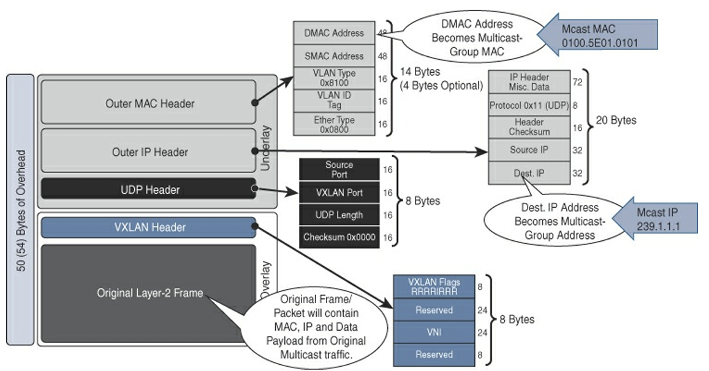
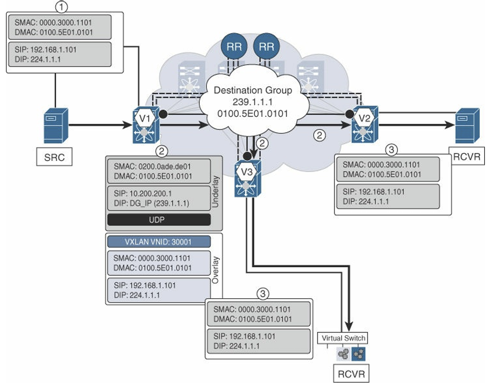
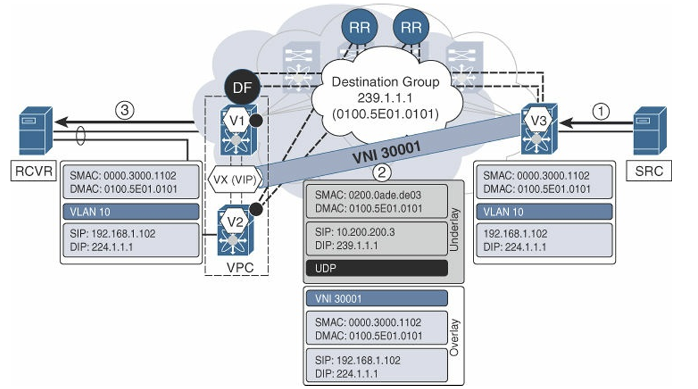
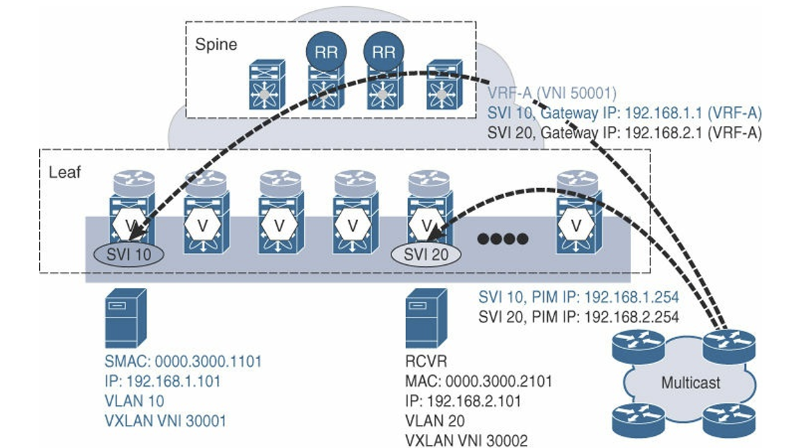

# Multicast Forwarding

* 多播的範疇 (Scope)
  * 焦點：只討論 Overlay 層面的多播（即虛擬機器 VM 到 VM 的多播行為），而非 Underlay 的實體多播設定。
  * 區別：
    * BUM Traffic (Broadcast, Unknown Unicast, Multicast)：之前的章節通常把這三者混在一起講（通常是講泛洪行為）。
    * Multicast：本章將多播獨立出來講，因為它涉及更複雜的群組成員管理（IGMP）
* 兩大轉發類型
  * L2 Multicast (Intra-Subnet)
    * 定義：來源與接收者在同一個 VLAN/VNI 內
    * 關鍵技術：IGMP Snooping。在 VXLAN 環境中，VTEP 必須能夠「偷聽」IGMP 封包，只把多播流量送給有訂閱（Join）該群組的 VTEP，而不是向所有 VTEP 廣播，以節省頻寬
    * 場景：涵蓋單機連接（Single-homed）與雙機堆疊（vPC）的複雜情況
  * L3 Multicast (Inter-Subnet / Routed Multicast)
    * 定義：來源與接收者在不同 VLAN/VNI，需要經過路由器（VTEP 路由功能）
    * 術語：在業界常被稱為 TRM (Tenant Routed Multicast)。這是 VXLAN EVPN 中較進階且實作難度較高的功能，因為它需要 VTEP 具備多播路由（PIM/IGMP Proxy）的能力

作為一位資深網路架構師，我為您整理了 Chapter 7「Multicast Forwarding」的詳細重點，內容涵蓋了 VXLAN BGP EVPN 架構中處理多點傳輸流量（特別是多播流量）的機制與優化方案。

## 1. Layer 2 Multicast Forwarding (二層多播轉發)

二層多播流量是指在相同的廣播域或 VXLAN VNI 內，從多播源傳輸到接收者的流量。VXLAN 作為 MAC-in-IP/UDP 的封裝技術，必須依賴底層網路（Underlay）來處理 BUM（Broadcast, Unknown unicast, and Multicast）流量，其中包含兩種模式：單播模式（Ingress Replication, IR）和多播模式。

* **單播模式 (Unicast Mode / IR)**：適用於 BUM 流量較小且 VTEP 數量有限的環境。在此模式下，入口 VTEP 必須為每個多點傳輸封包複製多份（N-1 份）並單獨發送給所有相關的鄰居 VTEP。BGP EVPN 通過 **Route Type 3 (Inclusive Multicast Ethernet Tag Route)** 來發佈 VTEP 對特定 Layer 2 VNI (L2VNI) 的成員資格，從而建立動態複製列表。
* **多播模式 (Multicast Mode)**：這是處理 Overlay 多播流量的更佳選擇，尤其當網路規模擴大或存在大量多播應用時。此模式在 Underlay 運行 IP 多播協議（如 PIM），將 L2VNI 對應到一個 Underlay 多播組，由網路負責複製，效率更高。
* **預設行為 (傳統 VXLAN)**：早期的 VXLAN 實作，即使在 BGP EVPN 網路中，若未啟用 IGMP Snooping，二層多播流量也會被視為 BUM 流量，無條件地在整個 L2VNI 域中泛洪 (Flooding)，造成資源浪費。

下圖為當 VTEP 把一個多播封包封裝送進 Underlay 時封包解剖

1. 笨拙的預設行為 (Without IGMP Snooping)

* 視同廣播：如果沒有 IGMP Snooping，交換器不知道誰真正想聽多播
* 全面氾濫 (Flooding)：VTEP 只要收到多播封包，就會透過 Underlay Multicast Group 送給所有有設定該 VNI 的 VTEP。
* 無條件接收：遠端 VTEP 收下來解封裝，然後再氾濫給它下面所有的 Port
* 後果：頻寬浪費，不相干的主機網卡也會收到封包（然後丟棄），浪費 CPU

2. 為什麼需要 BGP EVPN + IGMP Snooping？

* EVPN 的初衷：本來是為了減少 BUM 流量的氾濫（透過 Type-2 路由精準轉發單播）
* 如果多播還是用氾濫的方式處理，就違背了 EVPN 的初衷
* 引入 IGMP Snooping，讓 VTEP 知道「我下面有沒有人要聽？」。如果沒人要聽，我就不加入那個 Underlay Multicast Group，或者收到封包後不轉發給端點。

## 2. IGMP in VXLAN BGP EVPN Networks (VXLAN BGP EVPN 網路中的 IGMP)---

為了提升二層多播轉發的效率，避免無差別泛洪，VXLAN 網路需要利用 IGMP Snooping 僅將多播流量發送給感興趣的接收者。

* **傳統 IGMP Snooping 的局限性**：即使在接入側（Classic Ethernet 網段）啟用了 IGMP Snooping，只要遠端 VTEP 仍是該 VNI 的成員，入口 VTEP 仍可能無條件地將多播流量轉發到 VXLAN 網路核心。
* **VXLAN 增強功能**：Cisco NX-OS 引入了 `ip igmp snooping disable-nve-static-router-port` 命令，用於**條件性地**控制 VTEP 介面是否被添加到多播 OIF (Outgoing Interface) 列表。只有當遠端接收者通過 IGMP 報告信號表示興趣時，該 VTEP 介面才被啟用。
* **工作機制**：當遠端接收者發送 IGMP Join 訊息時，此訊息會通過 Overlay 泛洪到源 VTEP。源 VTEP 接收到此信號後，會為該 VNI 和多播組將 VXLAN 核心路徑加入到 OIF 列表。這確保了多播數據流僅在存在遠端接收者的 VTEP 之間傳輸，從而防止不必要的跨網段泛洪。

1. 來源 (SRC)：送出 SIP: 192.168.1.101, DIP: 224.1.1.1 的封包。

2. VTEP V1 (封裝)：

* Underlay SIP: 10.200.200.1 (V1 的 Loopback IP)。
* Underlay DIP: 239.1.1.1 (這是 VNI 30001 對應的群組，所有 VTEP 都加入了這個群組)。
* Underlay DMAC: 0100.5E01.0101 (由 239.1.1.1 轉換而來)。

3. VTEP V2/V3 (解封裝)：還原成原始封包送給接收者。

下圖是無 IGMP Snooping 的災難

* 本地災難：在 V1 下面，所有接在 VLAN 10 的電腦都會收到封包，就算它們不想看。
* 遠端災難：封包會被送到 V2。就算 V2 下面沒有任何一台電腦想看這個影片，V2 還是會收到封包，解封裝，然後發現沒人要，最後丟棄（或者氾濫給所有 Port）。

## 3. Layer 2 Multicast Forwarding in vPC (vPC 中的二層多播轉發)

在採用 Anycast VTEP 概念的 vPC 雙歸屬部署中，必須處理流量複製和指定轉發器的問題，以避免多播流量重複。

* **指定轉發器 (Designated Forwarder, DF) 選舉**：在 vPC 域中，必須選舉出一個 DF 負責 VXLAN 的封裝和解封裝，以避免重複傳輸。
  * **封裝 DF**：當 Underlay 使用 PIM ASM 時，兩個 vPC 節點都會使用 Anycast VTEP IP 作為源 IP 發送 PIM Join 訊息到 RP (Rendezvous Point)。RP 會將 PIM Join 訊息哈希到其中一個 vPC Peer，該 Peer 成為該 (S,G) 條目的 DF。
  * **解封裝節點**：通常根據到達 RP 的成本最小原則選出，或在成本相等時，選取 vPC Primary 節點。
* **雙歸屬接收者**：多播數據流量會轉發到 DF/解封裝節點。解封裝後，流量會通過本地經典乙太網路介面轉發給雙歸屬接收者。
* **孤立端點 (Orphan Endpoints)**：若多播源或接收者連接到孤立埠（Singly Attached），BUM 流量可能需要透過 **vPC Peer Link** 在兩個 vPC Peer 之間橋接，以便到達 DF 進行封裝，或從 DF 接收解封裝後的流量。

下圖展示了 **Layer 2 多播流量**在 **VXLAN vPC 環境**中的完整傳輸流程，特別強調了從「遠端來源」到「雙宿主接收者」的運作機制。流程展示了 **Symmetric Routing (對稱路由)** 與 **DF 選舉** 的完美配合：

* **V3** 負責封裝，利用 Underlay Multicast 一次送給 V1 和 V2。
* **V1/V2** 利用 DF 機制，確保只有一台設備 (V1) 負責把封包交給用戶，解決了雙機堆疊可能造成的迴圈與重複問題。

* 核心角色與設定
  * **SRC (來源)**：位於右側，連接在 VTEP V3 後面，發送多播群組 `224.1.1.1` 的流量。
  * **VTEP V3**：入口 VTEP (Ingress VTEP)。
  * **VTEP V1 & V2**：組成一個 **vPC Domain**，對外表現為一個 Anycast VTEP (VIP)。
  * **RCVR (接收者)**：位於左側，雙線連接到 V1 和 V2，想要接收 `224.1.1.1` 的資料。
  * **DF (Designated Forwarder)**：圖中 **V1** 被標記為 **DF**（黑色實心圓點），表示 V1 負責處理多播封包的解封裝與轉發。

1. 來源傳送 (Source to Ingress)

* **動作**：SRC 發送原始的多播封包。
* **封包內容**：
  * `SMAC`: SRC 的 MAC
  * `DMAC`: `0100.5E...` (多播 MAC)
  * `SIP`: `192.168.1.102` (SRC IP)
  * `DIP`: `224.1.1.1` (Overlay 多播群組)
* **接收者**：VTEP V3。

2. 封裝與穿越核心 (Ingress to Egress)

* **動作**：V3 查表發現有人訂閱，於是進行 **VXLAN 封裝**並送入底層網路。
* **封包變身 (Encapsulation)**：
  * **內層 (Overlay)**：原本的 `224.1.1.1` 封包被包在裡面。
  * **外層 (Underlay)**：
    * `SIP`: `10.200.200.3` (V3 的 IP)。
    * `DIP`: **`239.1.1.1`** (這是 **VNI 30001** 對應的 Underlay 多播群組)。
* **傳輸**：底層網路會把這個封包傳送給**所有**訂閱了 `239.1.1.1` 的 VTEP。因此，**V1 和 V2 都會收到這份封包**。

3. 解封裝與轉發 (Egress to Receiver)

這是 vPC 最關鍵的一步，為了避免 RCVR 收到兩份封包，必須進行分工：

* **V1 的行為 (DF - 贏家)**：
  * V1 是此 VLAN/VNI 的 **指定轉發者 (DF)**。
  * V1 收到封包 -> **解封裝 (Decapsulation)** -> 查表發現 RCVR 在本地 -> **轉發**給 RCVR。
* **V2 的行為 (Non-DF - 輸家)**：
  * V2 雖然也收到了封包，但它檢查自己**不是 DF**。
  * V2 **丟棄**該封包，不做解封裝，也不轉發給 RCVR。
  * *目的：防止封包重複 (Duplication)。*

## 4. Layer 3 Multicast Forwarding (三層多播轉發)

三層多播（Routed Multicast）需要在不同的 IP 子網之間轉發多播流量，這需要控制平面協議來發佈源和接收者的資訊。

* **中央化設計 (Centralized Design)**：目前（指資料來源發佈時）的解決方案通常採用中央化設計，即透過連接到 VXLAN 網路的 **外部 PIM 路由器**來提供三層多播服務。
  * 外部 PIM 路由器必須參與多播橋接域，並在流量轉發給它之前，VTEP 會移除 VXLAN 封裝。
  * 這種方式允許 VXLAN BGP EVPN Fabric 繼續提供**分散式 IP Anycast Gateway** 功能，而多播路由和 RPF（Reverse Path Forwarding）檢查則由外部 PIM 路由器處理。

* **未來分散式方案 (Tenant-Routed Multicast)**：標準（如 IETF Drafts）正在演進，目標是在 Fabric 內部實現**完全分散式**的多播路由功能，即將多播路由器功能集成到分散式 IP Anycast Gateway 上。這將消除對外部 PIM 路由器的依賴，並進一步優化轉發路徑。

1. 為什麼需要 L3 Multicast？

* 需求：來源（Source）在 VLAN 10，接收者（Receiver）在 VLAN 20。
* 限制：單純的 VXLAN 橋接（L2 VNI）無法跨越 VLAN 傳送多播，必須有 Router 幫忙做路由（Routing）。

2. 集中式路由 (Centralized Routing)

* 核心概念：VTEP 本身不做多播路由，而是把流量丟給一台外部的實體路由器 (External PIM Router)。
* 流程：
  1. VTEP (L2) -> 外部路由器 (解封裝 -> L3 Routing -> 再封裝/轉發) -> 目標 VTEP。
* 缺點：
  * Hair-pinning (髮夾彎)：流量要繞出去再繞回來，路徑不優。
  * 瓶頸：所有跨 VLAN 的多播都要經過那台外部路由器，它會變成熟效能瓶頸。
* 技術細節 (RPF Check)：外部路由器必須知道 Source IP 在哪裡，否則會因為 RPF Check 失敗而丟棄封包。

3. 現代標準方案：分散式路由 (Distributed TRM)

* 核心概念：每一台 VTEP 本身就是多播路由器。
* 特徵：
  * 整合了 Anycast Gateway：VTEP 同時做單播和多播的 Gateway。
  * BGP EVPN 整合：利用 BGP 來傳遞多播路由資訊（不再依賴傳統的 PIM 鄰居建立）。
* 優點：
  * 路徑最佳化：流量直接從 Source VTEP 路由到 Destination VTEP，不繞路。
  * 消除 L2 依賴：理想情況下，可以完全不需要 L2 VNI 的氾濫，變成純粹的 L3 轉發。