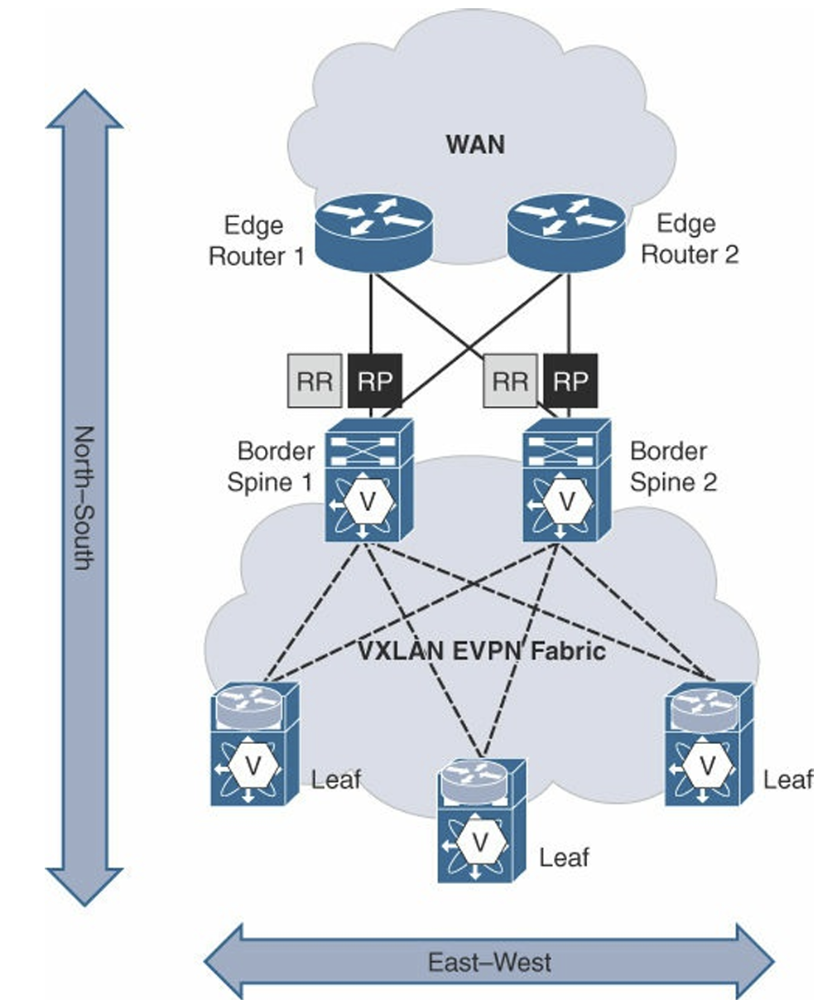
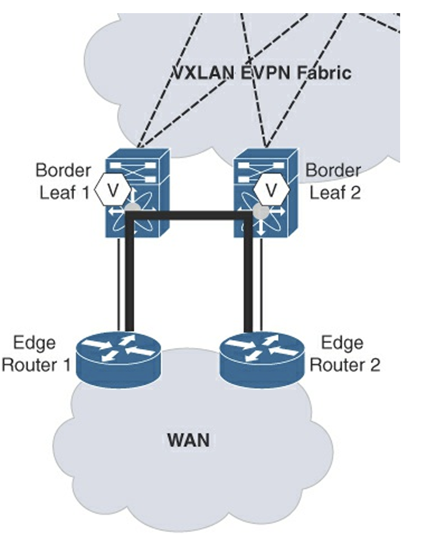
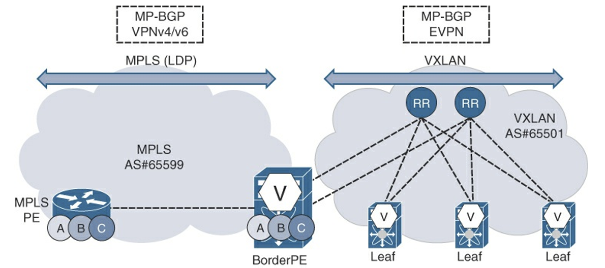
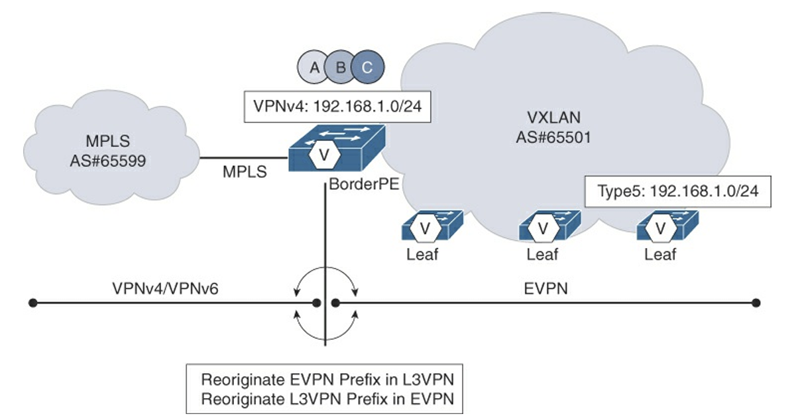
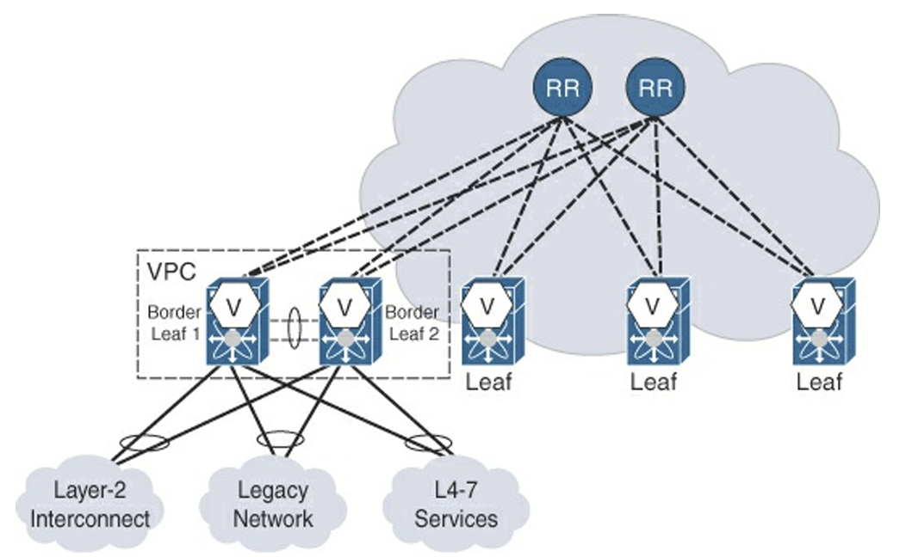
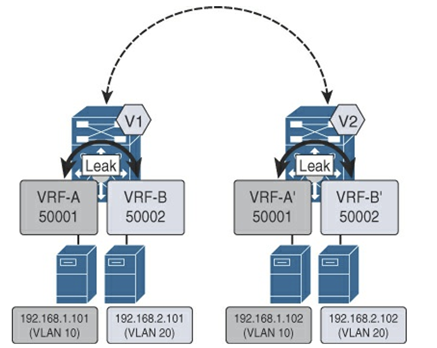
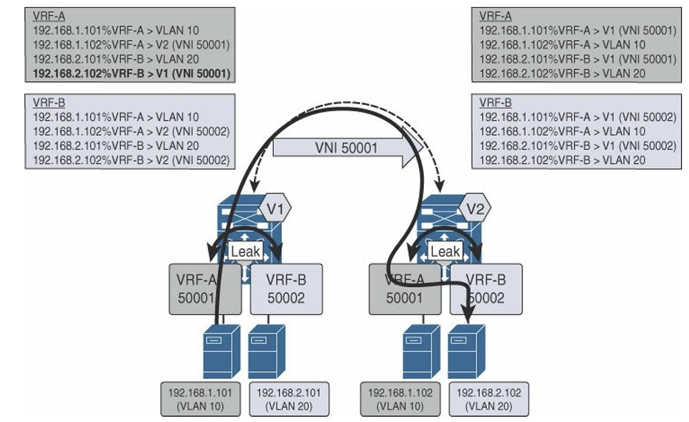

# External Connectivity

本章節概述了 VXLAN BGP EVPN 網路中，Fabric 邊界設計、Layer 2/Layer 3 互聯選項，以及跨租戶服務連線的關鍵機制。

1. 外部連接的挑戰

情境：資料中心內部的 VM/Container 需要被外部使用者存取。
關鍵問題：VXLAN 網路（Overlay）如何與傳統的外部路由網路（Underlay/WAN）交換路由？如何保持租戶隔離（Multi-tenancy）

2. Layer 3 連接選項 (路由模式)

* VRF Lite (最常見)：
  * 用途：在邊界交換器（Border Leaf）上，透過 802.1Q Tag 區分不同的 VRF，對接外部路由器或防火牆。
  * 優點：簡單、標準，幾乎所有支援 VRF 的設備都能通。

* MPLS (多協定標籤交換)：
  * 用途：通常用於 DCI (Data Center Interconnect)，連接兩個透過 MPLS 骨幹網相連的資料中心。
  * 整合：將 VXLAN EVPN 流量「交接（Handoff）」給 MPLS VPN。

* LISP (位置/身份分離協定)：
  * 用途：主要用於虛擬機遷移（VM Mobility）時保持 IP 不變，或是作為一種特殊的路由查找機制。這在 Cisco SD-Access 或特定 DC 架構較常見。

3. Layer 2 連接選項 (橋接模式)

* 場景：某些老舊應用程式（如舊版 HA Clustering）不支援 Routing，必須在同一個大二層廣播域內。
* 設計：
  * 單宿主 (Single-homed)：簡單但無備援。
  * 雙宿主 (Dual-homed / vPC)：透過 LACP 綁定兩台邊界交換器，提供高可用性。這就是前面章節提到的 vPC 在邊界上的應用。

## 外部連線能力部署位置 (External Connectivity Placement)

邊界節點（Border Node）是 Fabric 與外部網路的互聯點，它本身是一個 VTEP（VXLAN Tunnel Endpoint）裝置，負責對進出 Fabric 的南北向 VXLAN 流量進行封裝和解封裝。邊界節點的部署位置主要有兩種選擇：

* **邊界 Spine (Border Spine)**：
  * **角色與功能：** 邊界節點功能與 Spine 交換器合併。
  * **流量考量：** 所有來自 Leaf 的南北向流量只需一跳即可到達邊界節點。這種模型適用於主要流量為南北向（North–South）的設計。
  * **資源考量：** Border Spine 需要配置 VTEP，處理南北向 VXLAN 流量，同時繼續為東西向（East-West）流量提供 Underlay 路由功能。Spine 上的 BGP Route Reflector (RR) 和 Multicast Rendezvous Point (RP) 等功能也必須被納入容量規劃。

* **邊界 Leaf (Border Leaf)**：
  * **角色與功能：** 邊界節點功能放置在專用的 Leaf 交換器上。
  * **流量考量：** 邊界 Leaf 將南北向流量與核心的東西向流量（Leaf-to-Leaf）清晰分離。雖然南北向流量會增加一跳延遲，但它簡化了 Spine 的設計，使其專注於 Underlay 路由。
  * **設計差異：** 通常，Border Leaf 不會託管 BGP RR 或 Multicast RP。

左圖 (Border @ Leaf)：這是將 Border 功能放在獨立的 Leaf 層。這是目前較主流且推薦的做法，因為職責分離清楚。
右圖 (Border @ Spine)：這是本節討論的重點，將 Border 功能整合進 Spine 層。省設備，但 Spine 負擔重。

顯示了流量如何從下方的 Leaf 直接送到上方的 Spine (同時也是 Border)，然後直接出 WAN。注意圖中的 Spine 上標示了 RR (Route Reflector) 和 RP (Rendezvous Point)，強調了它身兼多職的狀態。

Spine 變單純了，

* 在 Border Spine 模式：Spine 很忙，要做 Underlay 路由，要做 VTEP 封裝，還要接外網。
* 在 Border Leaf 模式
  * Spine：回歸單純的 Underlay Router。它只需要負責快速轉發 IP 封包，完全不需要知道 VXLAN 是什麼（不需要 VTEP）。
  * Border Leaf：專門處理進出資料中心的流量。

這樣架構下優缺點

* 優點
  1. 職責分離 (Decoupling)：Spine 專注於高速背板交換；Compute Leaf 專注於接伺服器；Border Leaf 專注於接 Router/Firewall。故障排除容易。
  2. 容量規劃簡單：Border Leaf 的頻寬只需要考慮「有多少流量要上網」，不用管內部 Server 互傳的流量。
  3. 擴展性：如果上網頻寬不夠，加一對 Border Leaf 就好，不用動到核心的 Spine
  4. 相容性：Spine 可以買便宜一點、不支援 VXLAN 的設備（只要頻寬夠大、支援 BGP 即可）。
* 缺點
  1. 多一跳 (Extra Hop)：流量路徑變成 Server -> Compute Leaf -> Spine -> Border Leaf -> External。比 Border Spine 模式多經過一層設備，延遲稍微增加（微秒級，通常可忽略）。

### 外部 Layer 3 連線能力 (External Layer 3 Connectivity)

L3 外部連線旨在終止 VXLAN 封裝，並將流量轉發到外部 IP 網路，同時維持租戶（VRF）的隔離性。

#### U 型與全網狀模型 (U-Shaped and Full-Mesh Models)

這些模型描述了邊界節點與外部邊緣路由器（Edge Routers）之間的物理連線冗餘設計。

* **全網狀模型 (Full-Mesh Models)**：每個邊界節點都連線到每個邊緣路由器。
  * **優勢：** 彈性最高，單一連線故障時流量不會被黑洞 (Black-Hole)，且無需邊界節點之間的額外同步。
  * 下圖展示了邊界節點之間以全網狀的方式連線到外部的邊緣路由器，通常會使用四條或更多實體連線來確保冗餘連通性。
  
* **U 型模型 (U-Shaped Models)**：邊界節點與邊緣路由器以直通方式連線，但邊界節點之間需建立**交叉連線（Cross-Link）**作為備援路徑。
  * **優勢：** 降低了佈線複雜度，並在直通鏈路故障時提供繞行路徑。
  * 下圖展示了邊界節點之間的實體連線形成一個「U」形，確保當任一條主連線故障時，流量仍可透過交叉連線到達另一個邊界節點，最終轉發到外部。
  

#### VRF Lite/Inter-AS 選項 A (VRF Lite/Inter-AS Option A)

* **機制：** 這是最簡單的 L3 互聯選項。邊界節點為 Fabric 內部的每個 VRF 實例建立一個獨立的 L3 介面和路由對等會話（例如，使用 eBGP），將 Fabric 內的前綴資訊傳遞給外部路由器。
* **隔離：** 在單一實體鏈路上，可利用 **IEEE 802.1Q VLAN Tag** 來區隔不同 VRF 的資料流量，實現資料平面隔離。
* **實作：** 可使用 SVI (Switch Virtual Interfaces) 或子介面 (Subinterfaces) 搭配 VLAN tagging 實現。子介面（`no switchport`）結合 BFD (Bidirectional Forwarding Detection) 可提供更快的收斂速度。
* **缺點：** 由於每個 VRF 都需要獨立的 L3 介面和會話，此方案的可擴展性最差。
* **圖片描述 (Figure 8-7)：** 該圖描述了 VRF Lite 的概念，其中 Border Node 與外部路由器之間使用多個 L3 介面（或 SVI/子介面），每個介面對應一個 VRF，並可能透過 VLAN 標籤進行多工傳輸。

##### 1. 什麼是 VRF Lite (Inter-AS Option A)

這是連接兩個不同網路管理網域（AS）最直觀的方法

* 原理：把一條實體線路切成好幾條「虛擬線路」（通常用 VLAN Sub-interface）。
* 對應關係：
  * Border Leaf 的 VRF A <---> VLAN 10 <---> External Router 的 VRF A
  * Border Leaf 的 VRF B <---> VLAN 20 <---> External Router 的 VRF B
* 特徵：兩個路由器之間，針對每一個 VRF 都要建立一個獨立的 BGP Neighbor 關係。如果你有 100 個租戶，就要建立 100 個 BGP Session。

##### 為什麼推薦使用 eBGP?

雖然 OSPF 或靜態路由也能通，但文中強烈推薦使用 eBGP 作為外部連接協定：

1. 無需重分發 (No Redistribution)：EVPN 本身就是 BGP，轉成 eBGP 只是將路由從 iBGP 傳給 eBGP，不需要像 OSPF 那樣做「BGP 轉 OSPF」的重分發，減少路由迴圈風險。
2. 策略控制 (Policy Control)：BGP 擁有最強大的 Filter 功能（Route Map, Prefix List, AS-Path ACL），可以精確控制哪些路由可以出去，哪些可以進來。
3. AS 分離：明確區分「資料中心內部」與「外部網路」的邊界。

#### LISP (Locator/ID Separation Protocol)

* **角色：** 邊界節點兼作 LISP 隧道路由器（xTR）。
* **優勢：** LISP 採用**拉取式 (Pull-based)** 模型來按需查詢終端位置，相較於傳統路由的推播式，提供了更好的可擴展性。它將 ID（終端 IP）與 Locator（RLOC/VTEP IP）分離。
* **整合：** LISP 將 BGP EVPN 在 Fabric 內學到的 MAC/IP 可達性資訊匯入到 LISP Mapping Database 中。LISP 封裝是 IP-in-IP/UDP。

下圖展示了 Border Node 同時作為 VXLAN VTEP 和 LISP xTR 的單一設備解決方案，實現 Fabric（VXLAN）與 LISP 傳輸網路的無縫互連。

#### MPLS Layer 3 VPN (L3VPN)

* **角色：** 邊界節點擔任 **BorderPE**，負責 VXLAN BGP EVPN Fabric 與 MPLS L3VPN 核心網之間的互通。
* **控制平面互通：** BorderPE 必須執行控制平面路由的**重新源發（Reoriginate）**。它將 Fabric 內 BGP EVPN（L2VPN EVPN Address Family）學習到的 IP 前綴，重新源發為 VPNv4/v6 路由，並透過 MP-BGP 傳播到 MPLS 網路。
* **資料平面：** BorderPE 終止 VXLAN 封裝，並為跨越 MPLS 核心的流量加上 VPN Label 和 Per-Hop Label，以確保租戶隔離。

下圖描繪了 Border Node 扮演 BorderPE 的角色，將 VXLAN Fabric 與外部 MPLS L3VPN 雲進行連線。

##### 1. 核心概念：BorderPE (單機雙重身分)

* 角色融合：
  * 對內 (Data Center)：它是 VTEP，講 VXLAN 封裝，跑 L2VPN EVPN BGP Address Family。
  * 對外 (WAN/MPLS)：它是 PE Router，講 MPLS 標籤，跑 VPNv4/VPNv6 BGP Address Family。

* 功能：它充當翻譯官。
  * Control Plane：將 EVPN Type-5 路由（IP Prefix）轉換成 VPNv4 路由宣告給 WAN。
  * Data Plane：將 VXLAN 封包解開，剝除 VNI，換上 MPLS Label，再送入 WAN，反之亦然。

##### 2. 與 VRF Lite 的比較

|特性|VRF Lite (Figure 8-7)|BorderPE / MPLS L3VPN (Figure 8-12)|
|---|---|---|
|隔離機制|802.1Q VLAN Tag|MPLS Label (VPN Label)|
|BGP AF|IPv4/IPv6 Unicast (Per-VRF)|VPNv4/VPNv6 (Single Session)|
|擴展性|低 (每個租戶要一個 Sub-interface & BGP Session)|極高 (一條 Session 承載所有租戶路由)|
|設備要求|普通 Layer 3 Switch 即可|需支援 MPLS 功能的 Switch|
|部署模式|"""Two-box"" (Border Leaf 接 CE 接 PE)"|"""Single-box"" (Border Leaf 直接當 PE 用)"|

##### 3. 協定轉換細節 (Internetworking)

* EVPN -> MPLS：
  * BorderPE 收到 EVPN 路由 (包含 VNI)。
  * BorderPE 將其重分發 (Redistribute) 進 VPNv4 表，並分配一個 MPLS Label。
  * 透過 eBGP 傳給 WAN 端的 Route Reflector 或 PE。
* MPLS -> EVPN
  * BorderPE 收到 VPNv4 路由 (包含 Label)
  * BorderPE 將其重分發進 EVPN 表，並映射到對應的 L3 VNI
  * 透過 iBGP 傳給資料中心內部的 Leaf

下圖解釋 "BorderPE" 這個角色如何充當翻譯官，解決 VXLAN (EVPN) 與 MPLS (VPNv4) 語言不通的問題。

##### **A. 路由類型的轉換 (Route Type Translation)**

* **資料中心側 (EVPN)**：使用 EVPN **Type-5 路由**（IP Prefix Route）來傳遞網段資訊。
* **廣域網路側 (MPLS)**：使用 BGP **VPNv4 路由**（Label + IPv4）來傳遞網段資訊。
* **Re-originate (重新起源)**：
  * 這不是單純的轉發，而是 BorderPE 收到一邊的路由後，「偽裝」成該路由的發起者，將其改寫成另一種格式發送給另一邊。
  * **EVPN -> VPNv4**：BorderPE 剝除 VNI 資訊，加上 MPLS Label，改寫 Next-hop 為自己的 WAN 介面 IP，發送給 MPLS 骨幹。
  * **VPNv4 -> EVPN**：BorderPE 剝除 MPLS Label，加上 L3VNI，改寫 Next-hop 為自己的 VTEP IP，發送給資料中心內部。

##### **B. 關鍵配置要素**

1. **指令 (Re-originate command)**：文中提到的 `import l2vpn evpn reoriginate` 是 Cisco Nexus 的語法。它的作用是告訴路由器：「把你在 EVPN 學到的路由，複製一份到 VPNv4 表裡面」。
2. **Route Target (RT) Matching**：

* 這是最容易出錯的地方。
* 內部的 VRF 和外部的 VRF 必須透過 **Route Target** 來對接。
* 例如：內部的 Export RT 必須等於外部的 Import RT，反之亦然，這樣路由才能正確進入 VRF 表。

##### **C. 上圖解析**

這張圖非常清晰地展示了控制層的轉換：

* **右側 (VXLAN)**：Leaf 宣告 `Type 5: 192.168.1.0/24`。
* **中間 (BorderPE)**：執行 Re-originate 動作（中間的圓形箭頭）。
* **左側 (MPLS)**：BorderPE 向 MPLS 雲端宣告 `VPNv4: 192.168.1.0/24`。
* 這是一個 **"Single-Box"** 解決方案，一台設備同時搞定兩種協定。

## 3. 外部 Layer 2 連線能力 (External Layer 2 Connectivity)

Layer 2 連線通常用於 DCI（Data Center Interconnect）場景，例如需要傳輸 RARP 訊息以支援虛擬機熱遷移。

|特性|vPC (Virtual PortChannel)|EVPN Multihoming (ESI)|
|---|---|---|
|架構|Cisco 專有 (類似 MLAG)|IETF 標準 (RFC 7432)|
|配對限制|必須 兩台 Switch 緊密配對|可以 多台 (All-Active)，不需 Peer Link|
|Peer Link|需要 (透過 Peer Link 同步狀態)|不需要 (透過 BGP EVPN 同步狀態)|
|擴展性|限制為 2 台|可擴展至 4 台或更多同時轉發|
|適用場景|傳統 L2 備援|現代化 VXLAN Fabric 接入標準|

* **Border Leaf 1 & 2**：組成 vPC Domain，對外表現為一台邏輯 Switch。
* **中間的圓圈 (Port Channel)**：顯示外部設備（如防火牆或舊 Switch）是透過 LACP 同時接在兩台 Border Leaf 上。
* **流量流向**：
  * 外部設備送出的 Ethernet Frame (VLAN 10) -> Border Leaf。
  * Border Leaf 查表 -> 對應到 VNI 10010 -> 封裝 VXLAN -> 送往 Fabric 內部的 Compute Leaf。

##### **三大應用場景 (Use Cases)**

上圖底部畫出了三個雲，分別代表三種需要 L2 Handoff 的情況：

1. **Layer-2 Interconnect (DCI)**：
    * 透過光纖或波分設備，直接將 VLAN 延伸到另一個機房。
2. **Legacy Network (STP)**：
    * 對接舊有的傳統 Switch。這時候 Border Leaf 必須處理 STP (Spanning Tree Protocol) 的互動（通常是過濾 BPDU 或強制成為 Root，以免被舊網路影響）。
3. **L4-7 Services (Service Chaining)**：
    * 防火牆或負載平衡器以 **Transparent Mode (L2 Mode)** 運作時，Border Leaf 必須透過 Trunk 把流量「橋接」給它們清洗，然後再接回來。

##### 雙宿主技術 (vPC vs. EVPN-MH)

* 可以看到兩台 Border Leaf 組成了 **vPC**，並透過 LACP (Port-Channel) 下連到外部設備。這確保了 Layer 2 的備援，且避免了 STP 封鎖埠口。

### 經典乙太網路與 vPC (Classic Ethernet and vPC)

* **多宿主需求：** L2 連線必須具備冗餘，通常透過 **vPC** 或 EVPN Multihoming（未完全普及時）實現雙宿主。
* **STP 不相容性：** VXLAN 不原生傳輸 BPDU（Bridge Protocol Data Unit），導致 VXLAN Bridge Domain 總是處於轉發狀態。如果下游的經典乙太網路（基於 STP）雙連線到多個 VTEP 且未配置 vPC，則可能在 VXLAN 網路中引入 Layer 2 迴圈。
* **最佳實踐：** 將外部經典乙太網路透過 **vPC** 連線到 Border Node，以建立邏輯上的無迴圈拓撲。

> 在 vPC 架構下，參與的 vPC 對等設備（Peers）會共享一個共同的虛擬 VTEP IP 位址，這被稱為 Anycast VTEP IP 位址

##### 迴圈是怎麼發生的？

* 情境：一台舊 Switch (STP Root) 用兩條線分別接在 V1 和 V2 上。
* 問題根源：
  1. VXLAN 不傳 BPDU：V1 收到了 STP BPDU，但它認為這是垃圾流量或本地流量，不會將其封裝送給 V2。
  2. STP 失效：舊 Switch 認為兩條線路分別接在不同的獨立網路上（因為收不到繞回來的 BPDU），所以它把兩個 Port 都設定為 Forwarding。
  3. L2 Loop：廣播封包（如 ARP）會從左邊上去 V1，透過 VXLAN 跑到 V2，再從右邊下來回到舊 Switch，形成無限迴圈。

##### 解決方案：vPC / EVPN Multihoming

* 原理：利用 LACP (802.3ad) 將兩條物理線路綑綁成一條邏輯線路 (Port Channel)。
* 效果：
  * 對舊 Switch 而言，它只看到一條線（Logical Link）。
  * STP 不會因為有兩條線而困惑，因為邏輯上只有一條，自然沒有迴圈。
  * Forwarding：兩條線都可以同時傳送流量（Active/Active），既有頻寬效益又無環。

### 外部網路與共享服務 (Extranet and Shared Services)

當 Fabric 內部的租戶 VRF 需要存取共享服務（Shared Services VRF）或實現跨租戶通訊（Extranet）時，需要利用路由洩漏（Route Leaking）機制。

#### 本地/分散式 VRF 路由洩漏 (Local/Distributed VRF Route Leaking)

* **機制：** 透過配置 MP-BGP 路由目標（RTs），讓 VRF 實例之間交換（洩漏）彼此的前綴資訊。
* **封裝問題（非對稱性）：** 在這種模型中，流量從源 VRF-A 流向目的 VRF-B 時，**入口 VTEP** 會使用**源 VRF-A** 的 Layer 3 VNI (L3VNI) 進行封裝。
* **解封裝：** **出口 VTEP** 接收到源 VRF-A 的 VNI 流量後，在 VRF-A 中查找，然後將流量本地洩漏到目標 VRF-B，實現跨 VRF 轉發。
* **缺點：** 由於依賴源 VRF 的 VNI 進行封裝，去程和回程流量可能使用不同的 VNI，造成**非對稱轉發 (Asymmetric Forwarding)**，並要求所有參與洩漏的 VTEP 必須配置所有相關 VRF 的 RTs。

##### 什麼是 VRF Route Leaking

* 定義：在同一台設備上，將 A 路由表的路由「複製」一份到 B 路由表。
* 利用軟體指令（如 `route-target import/export`），直接在記憶體中交換路由資訊，不需要實體線路。

應用場景:

1. Shared Services (共享服務)：讓 Tenant VRF 可以存取位於 Admin VRF 的 DNS/NTP 伺服器。
2. Internet Access (上網)：所有 Tenant 透過一個公共的 Internet VRF 出去上網。

##### VXLAN 封裝的挑戰

* Control Plane (Leaking)：發生在 Ingress VTEP。VTEP 知道「要去 10.1.1.1 (VRF B)，雖然我現在在 VRF A」。
* Data Plane (Forwarding)：
  * 當封包要跨 VRF 傳輸到遠端 VTEP 時，VTEP 必須決定外層 VXLAN Header 的 VNI 要填什麼？
  * 通常使用的是 L3VNI (Layer 3 VNI)
  * 為了讓 Egress VTEP 知道這個封包是要去 VRF B 的，Ingress VTEP 必須使用 VRF B 的 L3VNI 進行封裝。
* 限制：這意味著，所有的 VTEP 都必須配置相關的 VRF 和 L3VNI，否則它看不懂飛過來的封包是要給誰的

下圖展示了封包如何從左邊的 Host (VRF-A) 走到右邊的 Host (VRF-B)。請注意這裡的封裝 VNI 是關鍵。

##### **步驟 1: Ingress (V1) - 路由查找**

* Host A (192.168.1.101) 發送封包給 Host B (192.168.2.102)。
* V1 在 **VRF-A** 中查表。
* 因為有設定 Route Leaking (Import RT)，V1 的 VRF-A 知道 `192.168.2.102` 在 V2 那邊。

##### **步驟 2: Encapsulation (封裝) - 關鍵點**

* V1 準備將封包送給 V2。
* **使用哪個 VNI？** 根據文中描述，V1 使用 **Source VNI (VNI 50001)** 來封裝封包。
  * *這意味著封包在 VXLAN Tunnel 飛行時，仍然被標記為屬於 VRF-A (VLAN 10 的延伸)。*
* 封包飛向 V2。

##### **步驟 3: Egress (V2) - 本地洩漏**

* V2 收到 VNI 50001 的封包。
* V2 解封裝，發現這是屬於 **VRF-A** 的流量。
* V2 在本地的 VRF-A 查表找 `192.168.2.102`。
* 路由表告訴 V2：「這個 IP 其實是在本地的 **VRF-B** 裡」。
* **Leak**: V2 將封包從 VRF-A 路由到 VRF-B (這是 L3 的動作)。

##### **步驟 4: Delivery**

* 封包進入 VRF-B，V2 查表發現 Host B 是直連的。
* V2 將封包送給 Host B。

##### 下游 VNI 指派 (Downstream VNI Assignment)

* **優勢：** 這是更具可擴展性且對稱的路由洩漏方案。
* **機制：** 借鑒 MPLS 的標籤交換概念。**出口 VTEP** 在 BGP EVPN Route Type 2 或 5 訊息中，將**目標 VRF** 的 Layer 3 VNI 宣告給入口 VTEP。
* **資料平面：** 入口 VTEP 據此將流量使用**目的地 VRF** 的 L3 VNI 進行封裝。
* **結果：** 實現了對稱的轉發路徑，提高了可擴展性，因為 VNI 的選擇是由 BGP EVPN 控制平面驅動，而非由入口 VTEP 的本地配置決定。這消除了傳統路由洩漏中的非對稱轉發問題。
