# Unicast Forwarding

內容涵蓋了單播轉發在採用 VXLAN BGP EVPN 架構的資料中心網路中的具體機制和流程。

## 1. 子網內單播轉發（橋接）(Intra-Subnet Unicast Forwarding (Bridging))

在 VXLAN BGP EVPN 架構中，二層服務（Layer 2 Gateway, L2GW）的提供採用 BGP EVPN 控制平面輔助的終端學習機制，以減少傳統的 ARP 處理和未知單播流量所導致的廣播流量。

* **VLAN 與 VNI 的關係：** 在這個架構中，VLAN 僅在 VTEP 本地具有意義；而 L2VNI (Layer 2 VNI) 則是全域識別符，代表整個二層網路和廣播域。
* **轉發機制：** 流量轉發基於 MAC 位址，範圍限定在特定的 L2VNI 內。
  * 在 VTEP 上，二層 MAC 位址表中的條目 ([VLAN, MAC]) 可以指向本地乙太網路介面(傳統乙太網路交換器)，也可以指向遠端 VTEP 的 IP 位址(Overlay 網路)。
  * **BGP EVPN 的角色：** VTEP 會透過 BGP EVPN Route Type 2 訊息，主動將本地學習到的終端 MAC 位址資訊（包括 L2VNI、MAC、VTEP IP）分發給所有鄰近的 VTEP。
* **ARP 抑制 (ARP Suppression)：**
  * 當啟用 ARP 抑制後，如果目的終端的 IP-to-MAC 綁定資訊已存在於 BGP EVPN 控制平面中，本地 VTEP（leaf）將會代表目的終端發送單播 ARP 回應，達成 **提前 ARP 終止 (early ARP termination)**。
  * 這項功能旨在減少網路中的 ARP 廣播流量，因為所有已知終端的 ARP 請求都會在最近的 VTEP 被終止並代理回覆。

1. 本地意義 vs. 全域意義：
    * VLAN ID 在 VXLAN 架構下只在當下的交換器（VTEP）內部有效。Switch A 的 VLAN 10 和 Switch B 的 VLAN 10 可以是完全無關的。
    * L2VNI 才是全網通用的 ID，用來串聯不同 VTEP 下的相同網段。
2. 封裝流程（Traffic Flow）：
    * Ingress (進入端): 收到封包 $\rightarrow$ 查表將 VLAN 對應成 L2VNI $\rightarrow$ 封裝 VXLAN $\rightarrow$ 傳送。
    * Egress (輸出端): 收到 VXLAN $\rightarrow$ 解開封裝 $\rightarrow$ 將 L2VNI 反向對應回當地的 VLAN $\rightarrow$ 轉發給 Server。

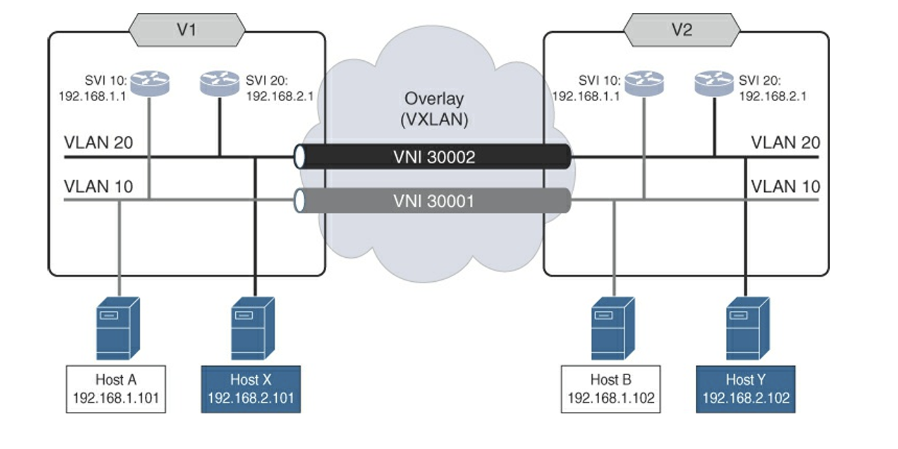

1. VTEP 角色 (V1 與 V2)：
    * 圖上方的 V1 與 V2 就是文中提到的 VTEP（VXLAN Tunnel Endpoint）。
    * 它們負責將傳統的 VLAN 封包封裝進 VXLAN 通道。
    * 文末提到的 IP (10.200.200.1 等) 就是這兩個 VTEP 用來在實體網路（Underlay）中互相通訊的地址。

2. MAC 表的變化 (從本地到遠端)：
    * 傳統行為： 當 Host A 要找同一台 Switch 下的設備時，V1 的 MAC 表會指向某個實體 Port。
    * VXLAN 行為： 當 Host A (192.168.1.101) 要傳送資料給 Host B (192.168.1.102) 時：
        * Host A 和 Host B 都在 VLAN 10。
        * V1 會發現 Host B 的 MAC 位址並不在本地，而是指向 V2 的 IP。
        * V1 將封包封裝並透過 VNI 30001（灰色通道）傳送給 V2。

3. VLAN 到 VNI 的對應 (Mapping)：
    * VLAN 10 對應到 VNI 30001 (灰色管線)。
    * VLAN 20 對應到 VNI 30002 (黑色管線)。
    * 這實現了不同租戶或網段的流量隔離。

4. ARP 抑制 (ARP Suppression)
    * 問題： 在傳統網路中，當 Host A 想找 Host B 的 MAC 時，會發出 ARP Request 廣播（Broadcast）。在 VXLAN 中，如果每個 ARP 都要廣播到所有 VTEP，網路負擔會非常重。
    * 解法：
        * 啟用 ARP Suppression 後，VTEP 會啟動 ARP Snooping（偷看經過的 ARP 封包）。
        * 當 VTEP 看到 Host A 發出的 ARP，它會記錄 Host A 的 [IP + MAC]
        * 這個 [IP + MAC] 會透過 BGP EVPN Type-2 路由 告訴其他 VTEP
        * 結果： 當遠端有人問「Host A 的 MAC 是什麼？」時，遠端的 VTEP 可以直接代為回答（Proxy ARP），而不必將廣播封包傳送到整個網路。
5. L3VNI 與分散式閘道器 (Distributed Anycast Gateway)
    * 如果配置了 Layer 3 Routing 功能（例如讓 VXLAN 網路內的 VM 可以跨網段互通）：
        * 會設定 VRF
        * 會設定 Anycast Gateway（所有 VTEP 都有相同的 Gateway IP，例如 192.168.1.1）
        * 此時，BGP 路由中的 L3VNI 欄位就會被填入數值（例如 VNI 50000）。這讓接收端知道：「如果要進行路由（Routing），請使用這個 VNI」

下表展示了 BGP EVPN Type-2 Route (MAC/IP Advertisement) 的核心內容，這是 EVPN 用來告訴遠端 VTEP 「誰在哪裡」的關鍵。

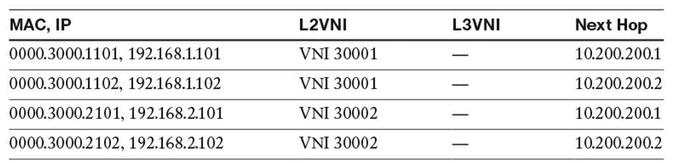

|欄位|資料範例|技術解讀|
|---|---|---|
|"MAC, IP"|"0000.3000.1101, 192.168.1.101"|這是 Host A 的資訊。BGP 會同時通告 MAC 和 IP（雖然純 L2 橋接只需 MAC，但 EVPN 通常會一併帶上 IP 以支援 ARP 抑制或 L3 轉發）。|
|L2VNI|VNI 30001|對應到 VLAN 10。這告訴接收端 VTEP，這個 MAC 屬於哪個 VXLAN 網段。|
|L3VNI|---|,注意這裡是空的。因為目前的場景是 L2 Bridging（同網段橋接），不需要用到 Layer 3 的 VNI 來做路由轉發。|
|Next Hop|10.200.200.1|這是 VTEP V1 的 IP。這告訴 V2：「如果你要找 Host A，請把封包封裝送到 V1 (10.200.200.1)」。|

下圖是 Host A 到 Host B 的 ARP 請求

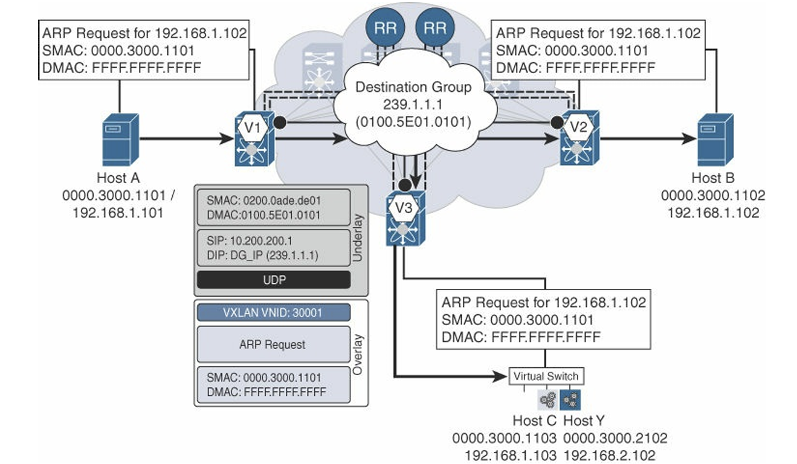

1. 封包封裝結構 (中間的灰色方塊)
    * 最內層 (Overlay / 原始 Payload)
        * ARP Request: 詢問 192.168.1.102 是誰？
        * SMAC: 0000.3000.1101 (Host A)
        * DMAC: FFFF.FFFF.FFFF (廣播地址)
        * VXLAN Header: 標記 VNI 30001，表示這是 VLAN 10 的流量。
    * 最外層 (Underlay / 傳輸層):
        * SIP (來源 IP): 10.200.200.1 (VTEP V1 的 IP)
        * DIP (目的 IP): 239.1.1.1 (重點！)
            * 因為這是廣播封包，VXLAN 不會單播給 V2，而是發送到一個*多播群組 (Multicast Group)**
            * V2 和 V3 都有加入這個群組，所以它們都會收到這個封包
        * DMAC (外層 MAC): 0100.5E01.0101 (這是由 Multicast IP 轉換而來的 Multicast MAC)
2. 學習機制 (Learning)
    * **資料平面學習 (Data Plane Learning)**: V1 從 Host A 收到封包的瞬間，透過傳統方式（看 Source MAC）學到了 Host A 在它的哪個 Port 下
    * **控制平面分發 (Control Plane Distribution)**: V1 學到 Host A 後，會將這個資訊轉成 BGP Update，告訴 Route Reflector (RR)，再由 RR 告訴 V2 和 V3：「Host A (0000.3000.1101) 在我這裡 (V1)」

3. 轉發流程
    * Host A 發出 ARP 廣播
    * V1 收到，封裝成 Multicast 封包丟入核心網路
    * 核心網路將封包複製並傳送給訂閱了該群組的 V2 和 V3
    * V2 和 V3 解開封裝，看到是 ARP 廣播，將其還原並從對應 VLAN 10 的 Port 轉發給 Host B 和 Host C

下圖是 Host B 到 Host A 的 ARP 回應

1. 為什麼是單播 (Unicast)？
    * 在 Host A 到 Host B 的 ARP 請求，ARP Request 是廣播，因為 Host A 不知道 Host B 的 MAC。
    * 在 Host B 到 Host A 的 ARP 回應，Host B 收到請求時，已經知道 Host A 的 MAC（包含在請求封包裡），所以 ARP Reply 是點對點的單播。

2. VTEP V2 如何知道往哪裡送？
    * 當 V1 最初發送 ARP 廣播時，V1 已經順便透過 BGP 告訴大家：「Host A (MAC A) 在我這裡 (IP V1)」。
    * 因此，V2 收到 Host B 的回覆封包（目的 MAC 是 Host A）時，查表發現 MAC A 對應到 VTEP V1，於是直接封裝送往 10.200.200.1。

3. BUM 流量處理機制 (BUM Handling)
    * **Multicast Group (多播群組)**: 這是最高效的方式（如 ARP 請求的圖）。核心網路（Underlay）負責複製封包。
    * **Ingress Replication (進入端複製)**如果核心網路不支援 Multicast，VTEP V1 必須自己把封包複製 N 份，分別單播送給 V2, V3, V4...（負擔較重）

下圖為 Data Plane Forwarding (資料平面轉發) 即 Unicast Bridging

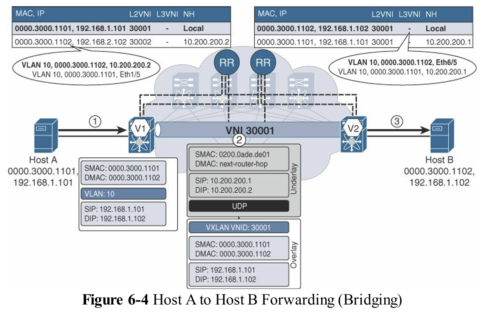

1. Ingress (進入端)
    * Host A 送出普通的乙太網路訊框（Frame）
    * VTEP V1 的判斷
        * V1 收到封包，看到來自 VLAN 10
        * V1 查 MAC Table（如圖左上角的表）：MAC 1102 在哪裡？
        * 查表結果： MAC 1102 對應的 Next Hop (NH) 是 10.200.200.2 (即 V2)，且屬於 VNI 30001
2. Transport (傳輸層)
    * VXLAN 封裝與傳輸
    * 封包結構 (中間的灰色方塊)
        * Inner Header (內層): 保持原樣 (`Src: 1101`, `Dst: 1102`)
        * VXLAN Header: 加上標籤 `VNI 30001`
        * Outer Header
            * 來源 IP (SIP): 10.200.200.1 (V1)
            * 目的 IP (DIP): 10.200.200.2 (V2)
        * Underlay Routing: 實體網路路由器根據外層 IP (10.200.200.2) 將封包路由到 VTEP V2
3. Egress
    * 解封裝與轉發
    * VTEP V2 的判斷
        * V2 收到 UDP 封包，看到目的 IP 是自己，於是拆開封包
        * 看到 `VNI 30001`，對應回本地的 `VLAN 10`
        * V2 查本地 MAC Table（如圖右上角的表）：`MAC 1102` 在哪個 Port？
        * 查表結果： Local (本地介面)
    * V2 移除 VXLAN 標頭，還原成原始乙太網路訊框，從連接 Host B 的 Port 送出

### 2. 非 IP 轉發（橋接）(Non-IP Forwarding (Bridging))

VXLAN BGP EVPN 架構同樣支援非 IP 協議的二層橋接，例如叢集複製流量或某些遺留應用程式。

* **機制依賴：** 由於缺乏 IP 位址，BGP EVPN 控制平面在這種情況下僅依賴 MAC 位址資訊來進行轉發決策。
* **BGP EVPN 內容：** BGP EVPN 仍然使用 Route Type 2 訊息發佈終端的 MAC 位址和 L2VNI 資訊，但 IP 位址相關欄位則被忽略。
* **流量流程：** 轉發決定完全基於二層 MAC 位址查詢 ([VNI, DMAC])。如果目的地未知，則流量被視為 BUM (Broadcast, Unknown Unicast, Multicast) 流量進行處理。

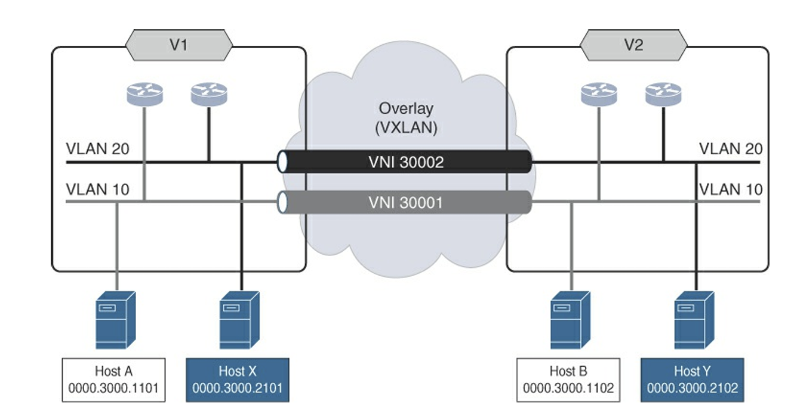

上圖為 Non-IP Forwarding，展示了純粹的 Layer 2 運作

* 主機下方只列出了 MAC 位址（例如 0000.3000.1101），而沒有列出 IP 位址
* 這通常發生在一些特殊的工業控制協定、老舊的主機（Mainframe）通訊，或是純粹的資料同步（Heartbeat），它們直接封裝在 Ethernet Frame 裡，不走 IP。
* 對 VXLAN 來說沒差。因為 VXLAN 是 MAC-in-IP，只要有內層 MAC，外層能不能包裝並傳送就不受影響。

下表是 BGP EVPN 的路由表，請特別注意以下欄位，這是與前幾張表最大的不同

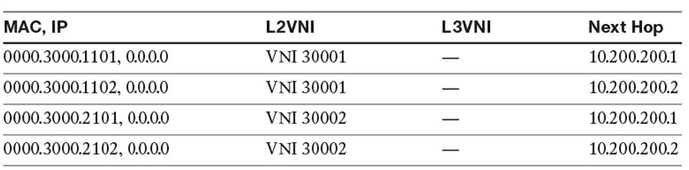

|欄位|值|描述|
|---|---|---|
|"MAC, IP"|"0000.3000.1101, 0.0.0.0"|這裡的 IP 顯示為 0.0.0.0。這代表 BGP EVPN 只通告了 MAC 位址 (MAC Advertisement)，沒有綁定任何 IP。|
|L2VNI|VNI 30001|依然有 VNI，代表這是屬於哪個 Layer 2 廣播網域。|
|L3VNI|--- |因為沒有 IP，自然不需要 Layer 3 路由功能，所以沒有 L3VNI。|

Host A 到 Host B 的無 IP 轉發流程

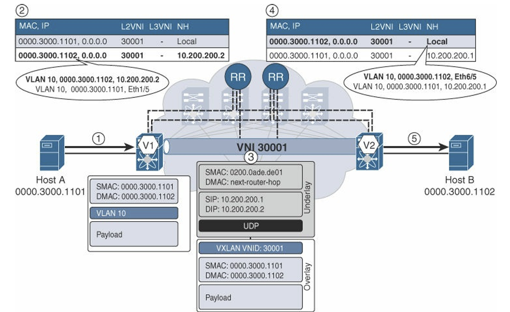

1. Host A 發送資料
    * Host A 想要傳送資料給 Host B
    * 封包內容
        * 來源 MAC (SMAC): ...1101 (Host A)
        * 目的 MAC (DMAC): ...1102 (Host B)
        * Payload
    * 封包進入 VTEP V1（進入端交換器）
2. VTEP V1 查表與決策
    * V1 收到封包，看到目的 MAC 是 ...1102
    * 查 BGP 表
        * V1 查詢 BGP EVPN 表，尋找 MAC ...1102 去哪裡
        * **發現路由**: MAC ...1102 對應的 Next Hop 是 10.200.200.2 (VTEP V2)，且位於 VNI 30001
        * BGP 表中的 IP 欄位顯示 0.0.0.0，這代表 V1 根本不在乎封包裡面有沒有 IP，它只認 MAC 位址來轉發
3. 封裝與傳輸
    * V1 將原始封包進行 VXLAN 封裝
    * 封裝結構
        * **外層 (Underlay)**： 來源 IP 是 V1 (10.200.200.1)，目的 IP 是 V2 (10.200.200.2)
        * **VXLAN 標頭**： 貼上標籤 VNI 30001
        * **內層 (Overlay)**： 原始的 Ethernet Frame (含 Non-IP Payload)
    * 封包透過實體網路傳送到 VTEP V2
4. VTEP V2 解封裝與查表
    * V2 收到封包，拆開外層 VXLAN 封裝
    * 看到 VNI 30001，知道這是屬於 VLAN 10 的資料
    * 查本地 BGP 表
        * V2 查詢本地 MAC 表：MAC ...1102 在哪裡
        * 結果: Local
5. 轉發給 Host B
    * V2 將還原後的原始封包（不含 VXLAN 表頭）從對應的連接埠送出
    * Host B 收到資料

6. 總結
    * 從 VTEP V1 後方 VLAN 10 的主機 A 到 VTEP V2 後方 VLAN 10 的主機 B 的 單播非 IP 轉發已完成。再一次的，VTEP V1 上的 VLAN 10 與 VTEP V2 上的 VLAN 10 透過 VXLAN 上的第二層服務（由 VNI 30001 識別）被串接 (Stitched) 在了一起。

### 3. 子網間單播轉發（路由）(Inter-Subnet Unicast Forwarding (Routing))

子網間單播轉發涉及 VXLAN 三層服務（Layer 3 Gateway, L3GW），主要透過**分散式 IP Anycast Gateway** 和 **對稱式整合路由與橋接 (Symmetric IRB)** 來實現。

* **L3VNI 的作用：** 所有在 VRF 內進行的路由流量都使用 L3VNI (Layer 3 VNI) 進行封裝，以確保路由域的隔離。
  * 每一個 VRF 都擁有一個唯一的 L3VNI
* **控制平面內容：** BGP EVPN 控制平面分發兩種主要的三層可達性資訊：
    1. **主機路由 (Host Routes)：** /32 (IPv4) 或 /128 (IPv6) 的精確主機位址，透過 Route Type 2 訊息通告。
    2. **子網段前綴路由 (Subnet Prefix Routes)：** 透過 Route Type 5 訊息通告。
* **分散式 IP Anycast Gateway：** 終端會將流量發送到本地 VTEP 上配置的共享 Anycast Gateway MAC (AGM) 位址。VTEP 在接收到流量後，進行路由查詢。
* **對稱式 IRB 轉發流程（Bridge-Route-Route-Bridge）：**
    1. **Bridge (本地 VTEP)：** 終端發送流量至本地 VTEP（Anycast Gateway）。
    2. **Route (本地 VTEP/Ingress VTEP)：** VTEP 執行路由查詢，命中遠端主機路由（/32）。流量被 VXLAN 封裝，VNI 設定為 **VRF 的 L3VNI**。內層 MAC 位址被重寫（來源 MAC 為 Ingress VTEP 的 RMAC，目的 MAC 為 Egress VTEP 的 RMAC）。
    3. **Route (遠端 VTEP/Egress VTEP)：** Egress VTEP 解封裝流量，在 VRF 內再次進行路由查詢，命中本地主機路由。
    4. **Bridge (遠端 VTEP)：** 流量被橋接到目的地終端。
* **優勢：** 對稱式 IRB 確保去程和回程流量使用相同的 L3VNI 進行路由，簡化了大型多租戶部署，並消除了**髮夾效應 (hair-pinning)**。

> VXLAN 本質上是一種 MAC-in-IP/UDP 的封裝格式（無論是提供第二層還是第三層服務皆然），因此其內層負載（Inner Payload）必定要包含一個 MAC 標頭

下圖為子網路間路由，為標準的 Symmetric IRB 架構

* VRF A (租戶隔離)
  * Host A, B (VLAN 10) 和 Host X, Y (VLAN 20) 都屬於同一個租戶 VRF A
  * 這表示著它們可以在 VRF A 內部互相路由通訊
* L3VNI 50001 (路由通道)
  * 專門用來讓 VTEP V1 和 V2 交換 VRF A 流量的通道
  * 不管底下是 VLAN 10 還是 VLAN 20，只要是要跨越 VTEP 的路由流量，通通都要封裝成 VNI 50001

下表為 BGP EVPN 路由表，與上圖關聯

* 上半部 (Route Type 2 - MAC/IP Advertisement):
  * MAC + IP (/32) (例如 ...1101, 192.168.1.101)
  * **L2VNI:** `30001` (告訴對方這台機器屬於哪個 Layer 2 網段)
  * **L3VNI:** `50001` (告訴對方如果要進行路由，請用這個 VNI)
  * **用途：** 這是主機路由 (Host Route)，用於精確轉發給特定主機，也支援 ARP 抑制
* 下半部 (Route Type 5 - IP Prefix Route)
  * IP Subnet (例如 192.168.1.0/24)
  * **L2VNI:** (不需要，因為這是純路由資訊)
  * **L3VNI:** 50001 (告訴對方這個網段屬於哪個 VRF)
  * **Next-Hop:** 10.200.200.1 / .2 (Anycast Gateway 的概念)
  * 這是網段路由 (Prefix Route)。如果外部網路要連進來，或者為了節省路由表空間，就會用到這個。

下圖是 Default Gateway Resolution 過程，Host A 初始化其 IP 堆疊（IP Stack）期間，或是每當它嘗試與位於不同 IP 子網段的另一個端點通訊時，過程，Host A 都會嘗試從其本地 ARP 快取中解析其預設閘道器（Default Gateway）的 IP 對 MAC 映射關係。

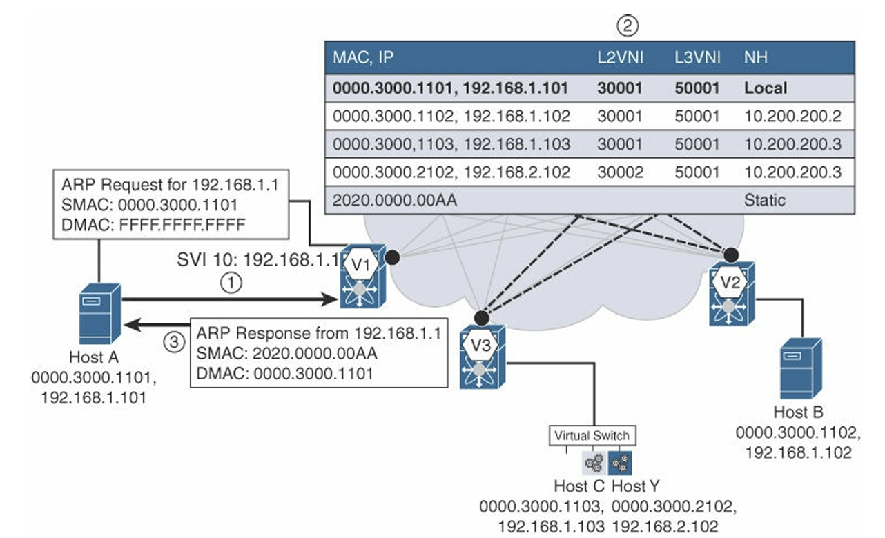

1. ARP Request

    * Host A 想上網（或跨網段），發現不知道 Gateway (192.168.1.1) 的 MAC
    * 發出廣播

2. ARP Snooping & Learning

    * VTEP V1 收到廣播，它做了兩件事
        * 回應 ARP (Data Plane): 因為 V1 本身就是 Gateway
        * 學習 (Control Plane): V1 藉機偷看封包內容，學到「喔！原來 192.168.1.101 在我這裡」
    * BGP EVPN 路由表第一行 0000.3000.1101, 192.168.1.101 被寫入，Next Hop 為 Local。這條路由隨後會透過 BGP 廣播給 V2, V3

3. ARP Reply

    * VTEP V1 回傳單播封包：192.168.1.1 is at 2020.0000.00AA
    * Host A 收到後，將此條目寫入自己的 ARP Table
    * Host A 現在可以將跨網段的封包封裝成 Dst MAC = ...00AA 送給 V1 進行路由了

下圖為內部路由，無需使用 VXLAN

* 從 Host A 出發的虛線
    1. 上行： 流量從 Host A (VLAN 10) 往上送，到達 VTEP V1 的 SVI 10 (Gateway)
    2. 路由 (Routing)： V1 發現目的 IP 192.168.2.101 其實就在自己的 SVI 20 下面
    3. 下行： 流量直接從內部轉發到 VLAN 20，送給 Host X
* 流量沒有進入上方的 VXLAN 隧道（Overlay）。它只是在 VTEP V1 下轉了一圈。這就是標準的 Inter-VLAN Routing

下圖表示了 Symmetric IRB（對稱式 IRB） 的完整運作流程 Bridge-Route-Route-Bridge 

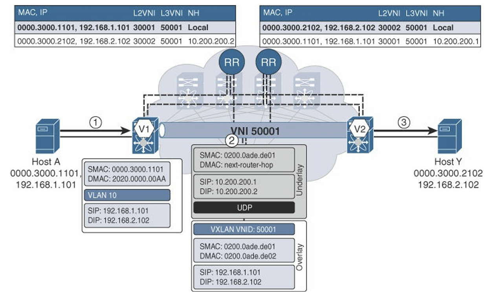

1. Bridge (L2): Host A $\rightarrow$ V1 Gateway
    * Host A 想要找 Gateway
    * DMAC: ...00AA (V1 的 Gateway MAC)
2. Route (L3 Overlay): V1 $\rightarrow$ V2 (Tunnel)
    * V1 查表發現 Host Y 在 V2
    * V1 將封包封裝進 L3VNI 50001
    * 內層的 DMAC 變成了 V2 的 Router MAC (...de02)，而不是 Host Y 的 MAC。這代表「這是給 V2 路由器的信」
3. Route & Bridge: V2 $\rightarrow$ Host Y
    * V2 收到信，拆開看到是給自己的 (Router MAC)，且 VNI 是 50001 (VRF-A)
    * V2 查 VRF-A 的路由表，找到 Host Y
    * V2 將封包重寫：Source MAC 改成自己的 Gateway MAC，Dest MAC 改成 Host Y (...2102)

下圖對應上面第二步驟封包

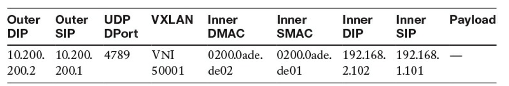

##### **為什麼 EVPN 需要「主機路由 (/32)」？**

在傳統網路（如 OSPF/EIGRP）中，我們只通告網段（例如 192.168.1.0/24）。 但在現代資料中心（VXLAN Fabric）中，同一個網段 192.168.1.0/24 可能同時存在於 VTEP 1、VTEP 2 和 VTEP 3 下面（因為 VM 可以到處跑）。

* 傳統做法
  * 路由器只知道 /24 在這三個地方都有，它可能會隨機選一條路走，結果封包到了 VTEP 2 才發現 VM 其實在 VTEP 3，這會導致流量繞路（Hair-pinning）或次佳路徑（Suboptimal Routing）。
* EVPN 的做法
  * 每個 VTEP 會告訴大家：「192.168.1.101/32 在我這裡！」
  * 這讓 Ingress VTEP 可以直接把封包封裝送給正確的 VTEP

## 4. 路由流量至靜默終端 (Routed Traffic to Silent Endpoints)

靜默終端（Silent Endpoints）指那些尚未發出 ARP 或 ND 訊息，因此其 IP/MAC 資訊尚未被 BGP EVPN 控制平面知曉的終端。

* **流量處理：** 當流量發向靜默終端時，由於精確的 /32 主機路由尚未被發佈，Ingress VTEP 的路由查詢將會命中**子網字首路由**（Route Type 5 廣告的較不精確的 /24 路由）。
* **Glean Adjacency (查詢鄰接)：** 命中子網路由會觸發一個 **Glean Adjacency**。這促使 Egress VTEP 在該子網對應的二層網域 (L2VNI) 內發起 ARP 廣播請求，從而發現靜默終端。
* **終端發現：** 靜默終端回覆 ARP 後，Egress VTEP 學習其 IP/MAC 綁定，隨即透過 BGP EVPN 發佈精確的 /32 主機路由。此後所有流量都將透過該主機路由實現最短路徑轉發。
* **子網路由的重要性：** 透過手動配置將本地 Anycast Gateway 的子網路由（非主機路由）重新發佈到 BGP EVPN 控制平面，是實現分散式 Anycast Gateway 靜默終端發現的關鍵。

下圖為 ARP Gleaning 流程，Host Y 是一個未被發現的主機

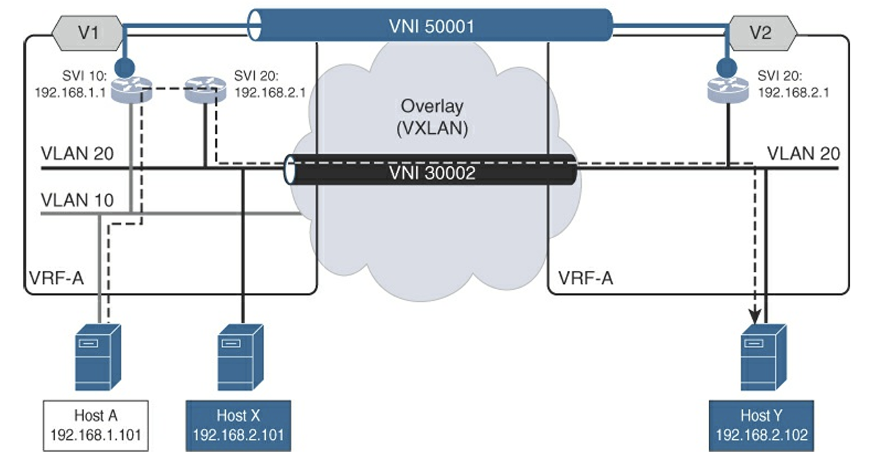

* 觸發點 (Glean Adjacency)
  * VTEP V1 收到要去 192.168.2.102 的封包
  * 查路由表：沒找到 /32 主機路由
  * 查子網段：找到了 192.168.2.0/24 是直接連接的（因為 V1 上有 SVI 20）
  * 動作： V1 認為「這台機器應該在我的直連網段裡，但我不知道 MAC」，於是觸發 ARP Request
* 路徑(圖中虛線)
  * V1 將 ARP Request 封裝進 VNI 30002 (L2VNI)，而不是 L3VNI
  * 透過 Multicast (239.1.1.1) 廣播給所有 VTEP
  * 雖然這是 Layer 3 路由需求，但「找人」的動作是透過 Layer 2 廣播完成的

下表顯示了 V1 在發送流量之前的狀態

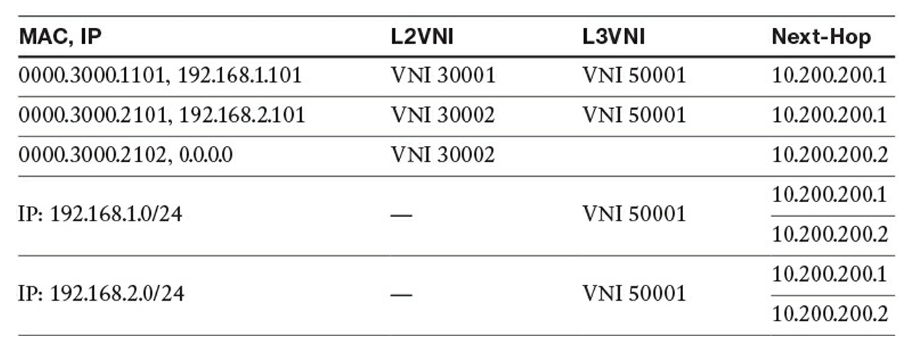

* Host Y (MAC ...2102): IP 欄位顯示 0.0.0.0。這證實了它是 Silent Host，V1 根本不知道它的 IP
* Subnet Route: 表中有 192.168.2.0/24 的路由，指向 L3VNI 50001

下表為透過 Multicast 找人的封包

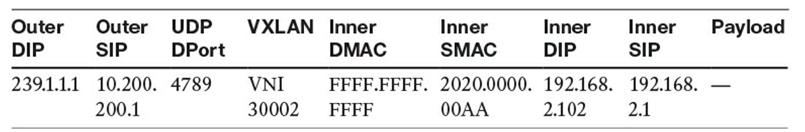

下圖是靜默主機 Y 搭配 L2VNI 呈現

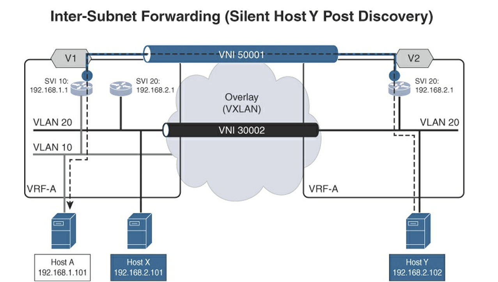

* Host Y 已被發現後
  * 跨子網通訊：這是一個 L3 路由情境，Host A (VLAN 10) 要傳送資料給 Host Y (VLAN 20)
  * L3VNI 的角色：因為是跨子網（Inter-Subnet），流量不會走 L2VNI（如 VNI 30001/30002），而是透過 L3VNI (VNI 50001) 進行封裝與路由轉發。
  * BGP EVPN 路由表資訊
    * 可以看到 Host Y (192.168.2.102) 的路由資訊中，L3VNI 欄位被標示為 VNI 50001
    * Next Hop 指向了 VTEP 的 IP (10.200.200.1 或 .2)
    
* 當沒有 Layer 2 延伸時
  * 如果入口 VTEP（Ingress VTEP，例如 V1）上面沒有配置目標 VLAN（例如 VLAN 20），它就無法在本地進行 Layer 2 的查找或廣播
  * 解決方案
    1. 依賴 IP 前綴：Ingress VTEP 會根據「目標 IP 子網前綴（Subnet Prefix）」來決定路由，將流量丟給擁有該網段的遠端 VTEP
    2. 遠端觸發 ARP：當流量到達目標 VTEP（Egress VTEP）後，由該 VTEP 負責發送 ARP 請求來找出那個「靜默」的目標主機

下圖與上一個場景最大的不同在於 VTEP V1 沒有 VLAN 20（即 Layer 2 沒有延伸到 V1）。因此，V1 只能靠「路由」把封包丟給 V2。

* 封包轉發流程
    1. Ingress (VTEP V1) 的行為
        * V1 收到封包，查表發現不知道 Host Y (192.168.2.102) 在哪，但知道 192.168.2.0/24 網段在 VTEP V2
        * 使用 L3VNI (50001) 進行封裝
        * MAC 重寫：內層 DMAC 改寫為 VTEP V2 的 Router MAC（這是 Symmetric IRB 的特徵）
        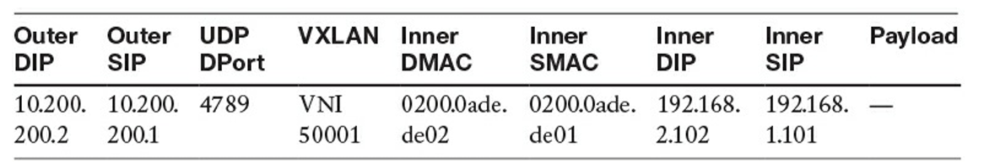
    2. Egress (VTEP V2) 的行為與 Glean 機制
        * V2 收到 L3VNI 封包，解封裝後查路由表
        * 發現目的地是直連網段 (Connected Subnet)，但 ARP 表中沒有 Host Y 的紀錄（因為它是 Silent Host）
        * 觸發 Glean：這是一個特殊的機制。當路由器知道封包屬於自己連線的網段但沒有 ARP 條目時，它會主動發送 ARP Request (Who has 192.168.2.102?)
    3. 控制層(BGP)更新
        * Host Y 回應 ARP
        * VTEP V2 學習到 Host Y 的 MAC/IP
        * V2 透過 BGP EVPN (Type-2 Route) 將 Host Y 的 /32 主機路由宣告給 V1
        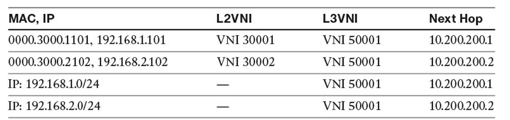

### 5. 雙宿主終端轉發 (Forwarding with Dual-Homed Endpoint)

對於連線到 vPC 網域的雙宿主終端，該 vPC 對被視為一個單一的邏輯 VTEP，稱為 **Anycast VTEP**。

* **Anycast VTEP IP (VIP)：** 該邏輯 VTEP 共享一個 IP 位址（VIP），作為 BGP EVPN Route Type 2 訊息中的下一跳位址。
* **Ingress 轉發：** 雙宿主終端將流量經由 PortChannel 傳送給其中一個 vPC Peer。無論流量從哪個 Peer 進入，VXLAN 封裝後的**外層源 IP (SIP)** 永遠是 Anycast VTEP 的 VIP。
* **Egress 轉發：** 遠端 VTEP 發往該雙宿主終端的流量，其**外層目的 IP (DIP)** 設為 VIP。Underlay 網路利用 ECMP 將流量雜湊到其中一個 vPC Peer (V1 或 V2)。被選中的 Peer 負責解封裝，並透過 PortChannel 將流量發送給終端。
* **孤點終端 (Orphan Endpoints)：** 孤點終端僅連接到 vPC 對中的單個交換器。如果發往該孤點終端的流量被 ECMP 導向了非連接該終端的 vPC Peer，則該流量在解封裝後必須跨越 **vPC Peer Link**，到達正確的 Peer，然後才能轉發給終端。

下圖表示 vPC 如何向外「偽裝」成單一裝置，以及流量進入時的處理流程

1. 場景設定
    * 來源端 (Ingress)：Host A 是一個雙宿主伺服器，同時連接到 VTEP V1 和 V2。V1 和 V2 組成了 vPC 網域
    * 共用身分 (Anycast VTEP)：V1 和 V2 對外共用一個 IP 位址，稱為 VIP (Virtual IP) 或 Anycast VTEP IP。在這個例子中是 `10.200.200.12`
    * 目的端 (Egress)：Host B 連接在遠端的 VTEP V3 後面
    * 通訊模式：圖中顯示的是同一個子網（VLAN 10 / VNI 30001）內的 L2 橋接 (Bridging)

2. 流量轉發流程
    * 流量進入與負載平衡 (Hashing)
        * 當 Host A 發送資料時，它把 V1 和 V2 的連線視為一條邏輯線路 (Port Channel)
        * 根據 Port Channel 雜湊演算法 (通常基於來源/目的 MAC 或 IP)，這個資料訊框會被隨機分配給 V1 或 V2 處理。這是第一層的負載平衡
    * VXLAN 封裝的關鍵規則
        * 不管最後是 V1 收到這個封包，還是 V2 收到這個封包，當它要進行 VXLAN 封裝傳送到遠端時，外層 IP 標頭的來源 IP (Outer SIP) 永遠都填寫那個共用的 VIP (10.200.200.12)
    * 遠端視角 (VTEP V3)
        * 當 V3 收到來自 V1 或 V2 的封包時，它查看到來源 IP 是 10.200.200.12
        * 對 V3 而言，它只知道這個封包來自一個邏輯上的 VTEP (.12)，它根本不知道（也不需要知道）背後實際上是由 V1 還是 V2 發送的。這*簡化了遠端的 MAC/ARP 學習*

下圖表示遠端 VTEP (V3) 如何將封包傳送給由兩台交換器組成的 vPC 網域 (V1/V2)

* 流量轉發機制
    1. 目的地是 VIP
        * Host B 送出封包給 Host A
        * VTEP V3 查表發現 Host A 的 Next Hop 是 `10.200.200.12` (Anycast VTEP IP)
        * V3 封裝 VXLAN 封包，外層 DIP (Destination IP) 填寫 `10.200.200.12`
    2. Underlay ECMP 負責分流
        * 底層網路 (Spine/Core routers) 看到有兩條路徑可以到達 .12 (一條去 V1，一條去 V2)
        * 透過 ECMP (Equal-Cost Multipath) 演算法，底層網路隨機（基於 Hash）選擇將封包丟給 V1 或者 V2
        * 關鍵點：這裡的負載平衡是由底層 IP 網路決定的，而不是 VXLAN 協議本身
    3. 解封裝與交付
        * 假設封包被送到了 V1
        * V1 解封裝 VXLAN header
        * V1 透過本地的 Port Channel 將原始封包送給 Host A
* 孤兒端點 (Orphan Endpoint)
  * 定義：雖然 V1 和 V2 組成了 vPC，但某些設備（例如單網卡的印表機或舊伺服器）可能只物理連接到 V1，這叫做 Orphan Port
  * 問題：
    * 在 EVPN 中，V1 和 V2 對外都宣稱"我是 .12，我連接著 Host A（或是該網段）"
    * 如果遠端 V3 發送的封包，被 ECMP 運氣不好地丟給了 V2。
    * V2 收到封包解開後，發現 Host A 根本沒接在自己身上（因為 Host A 只接在 V1）
  * 解決方案 - Peer Link 的重要性
    * V2 必須通過 Peer Link 將這個封包轉送給 V1，再由 V1 送給 Host A
    * 這解釋了為什麼即便在 VXLAN 環境下，vPC Peer Link 依然至關重要，尤其是處理單線連接設備或故障發生時

### 6. IPv6

VXLAN BGP EVPN 網路對 IPv6 具有全面的二層和三層服務支援。

* **位址解析：** IPv6 終端使用 **Neighbor Discovery Protocol (ND)** 替代 ARP 進行位址解析（包括 Neighbor Solicitation 和 Neighbor Advertisement）。
* **控制平面：** VTEP 透過 BGP EVPN 學習並通告 IPv6 主機資訊 (Route Type 2)。與 IPv4 類似，IPv6 地址（128 位）被納入 NLRI 訊息中。
* **Anycast Gateway：** IPv6 Anycast Gateway 共享相同的 Anycast Gateway MAC (AGM)。
* **Underlay 限制：** 儘管 Overlay 支援 IPv6，但目前的實作中，Underlay 傳輸網路通常仍基於 IPv4。因此，BGP EVPN Route Type 2 訊息中的 **下一跳 (Next-Hop)** 仍是 VTEP 的 **IPv4 位址**。這意味著 VXLAN 封裝在 IPv4 Underlay 上承載 IPv6 流量，保持了 Underlay 的精簡性。
