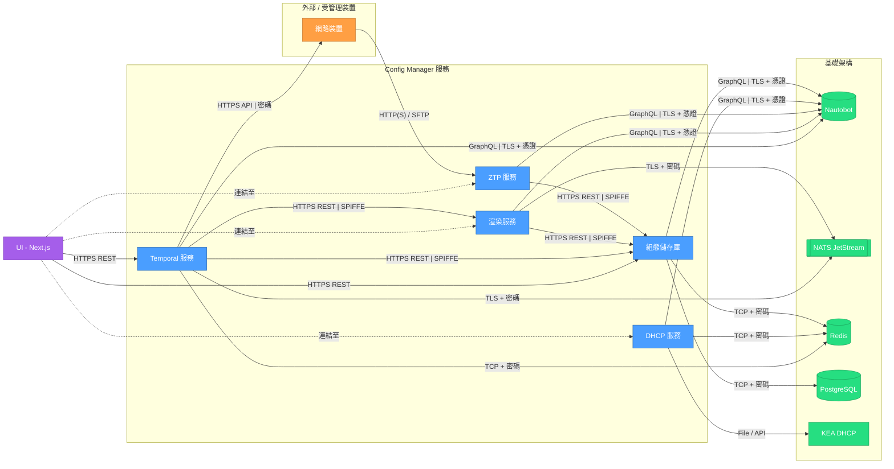

# 系統架構

NVIDIA Config Manager 針對初始網路部署（Day Zero）與持續的維運操作（Day Two）採用了不同的架構模式。

## Day Zero：網路引導 (Network Bootstrap)

Day Zero 架構負責處理新部署的初始網路資源置備（provisioning）。

**架構組件：**

```text maxLines=0
┌─────────────────┐
│ Jinja2 Config   │
│   Templates     │ (基於功能/角色定義 Function/role-based definitions)
└────────┬────────┘
         │
         ├──────────────┐
         │              │
         ▼              ▼
    ┌────────┐     ┌────────┐
    │ Render │────▶│  ZTP   │────▶ Network Devices (網路裝置)
    │Service │     │ Server │
    └────┬───┘     └────────┘
         │              │
         │              ▼
         │         ┌─────────┐
         │         │ Image   │
         │         │  Store  │
         │         └─────────┘
         ▼
    ┌─────────┐
    │  Data   │
    │  Store  │ (主機名稱、IP 位址、佈線等 Hostnames, IP addresses, cables, etc.)
    └─────────┘
```

**組件功能：**

* **Jinja2 Config Templates (Jinja2 組態範本)**：基於功能與角色的組態定義。
* **Render Service (渲染服務)**：自範本與資料生成特定裝置的組態。
* **ZTP Server (ZTP 伺服器)**：零接觸置備伺服器，負責將組態分發至新裝置。
* **Nautobot**：網路單一真理源（例如：主機名稱、IP 位址以及佈線規則）。
* **Config Store (組態儲存庫)**：已渲染組態的中央儲存庫。
* **Image Store (映像檔儲存庫)**：網路作業系統映像檔的儲存空間。

**引導流程 (Bootstrap Process)：**

每當你在 Nautobot 中進行變更時，Render Service 都會使用範本和 Data Store 生成裝置組態。接著，當新裝置加入網路時，該組態已準備就緒可隨時分發。

1. 新裝置開機並發送 DHCP 請求。
2. DHCP 將裝置導向 ZTP 伺服器。
3. ZTP 伺服器識別該裝置，並從 Image Store 中檢索適當的作業系統映像檔。
4. 裝置下載並安裝作業系統映像檔。
5. ZTP 伺服器向裝置分發組態。
6. 裝置套用組態並加入網路。

## Day Two：運營變更 (Operational Changes)

Day Two 架構透過工作流引擎處理持續的網路變更與運營維運。

**架構組件：**

```text maxLines=0
┌─────────────────┐
│ Jinja2 Config   │
│   Templates     │
└────────┬────────┘
         │
         ├──────────────┐
         │              │
         ▼              ▼
    ┌────────┐     ┌──────────┐
    │ Render │────▶│ Workflow │────▶ Network Devices (網路裝置)
    │Service │     │  Engine  │      (透過工作流 via workflows)
    └────┬───┘     └──────────┘
         │               ▲
         │               │ (人工審批 Human approvals)
         │               │
         ▼               ▼
    ┌──────────┐     ┌───────┐
    │ Nautobot │     │ User  │ (使用者)
    └──────────┘     └───────┘
```

**與 Day Zero 的關鍵差異：**

* 變更直接推送（不透過 ZTP）至運行中的裝置，且對流量無影響。
* 用於符合 SOC2 合規性的人工審批工作流。
* 變更追蹤與稽核能力。

## Nautobot 介面功能

Config Manager 透過 Nautobot 外掛程式提供網頁式介面，以進行全網（fleet-wide）裝置管理。

### 即時全網配置漂移稽核 (Instant Fleet-Wide Drift Audit)

* 將預期組態與實際裝置狀態進行比對。
* 識別整個網路中的組態漂移 (drift)。
* 依漂移狀態篩選裝置。

### 裝置管理 (Device Management)

* 檢視裝置詳細資訊與狀態。
* 追蹤待處理的部署 (pending deployments)。

### 工作流執行 (Workflow Execution)

該介面提供了多種工作流類型的存取。如需更多詳細資訊，請參閱 [工作流](https://docs.nvidia.com/switch-infrastructure/config-manager/config-manager/overview/workflows) 說明文件。

### 狀態指標 (Status Indicators)

每台裝置會顯示目前的狀態：

* **Total Config Manager Devices (Config Manager 裝置總數)**：完整的裝置庫存計數。
* **All Pending Deployments (所有待處理部署)**：等待組態變更的裝置。
* **Pending Status (待處理狀態)**：橘色的「Deploy (部署)」按鈕表示有可用的部署。
* **No Pending Deployment (無待處理部署)**：裝置組態已是最新狀態。

### Config Manager 組態詳細資訊 (單一裝置)

裝置詳細資訊檢視畫面包含一個 Config Manager Config Details 區段，顯示以下內容：

| 欄位 | 說明 |
| :--- | :--- |
| Intended Config Version (預期組態版本) | 預期組態的時間戳記 |
| Intended Config Updated By (預期組態更新者) | 上次更新組態的使用者 |
| Intended Config History (預期組態歷史記錄) | 指向 Config Store UI 中預期組態歷史記錄的連結 |
| Last Config Backup (上次組態備份) | 上次備份的時間戳記 |
| Backup History (備份歷史記錄) | 指向備份歷史記錄的連結 |
| Render Enabled (已啟用渲染) | ✅ 渲染服務是否處於作用中狀態 |
| ZTP Enabled (已啟用 ZTP) | ✅ ZTP 置備是否處於作用中狀態 |
| Deploy Enabled (已啟用部署) | ✅ 部署是否處於作用中狀態 |
| Backup Enabled (已啟用備份) | ✅ 備份工作流是否處於作用中狀態 |
| Aggregate Managed (彙總管理) | ❌ 是否由彙總進行管理 |

### 佈線驗證 (Cable Validation)

Config Manager 藉由將預期的網路拓撲與來自裝置的即時 LLDP、MAC 和 ARP 數據進行比對，以提供自動化的佈線驗證。

佈線驗證工作流：

* 消除人工登錄的庫存數據與即時數據源之間的落差。
* 深度整合，跨網路、DPU 和伺服器邊界進行驗證。
* 效能優異，可在 60 秒內完成整個站點的驗證。

有關佈線驗證工作流和報告的詳細資訊，請參閱 [佈線驗證使用者指南](https://docs.nvidia.com/switch-infrastructure/config-manager/user-guides/validation/cable-validation)。

## 服務通訊圖 (Service Communication Diagram)



---

## 重點整理

本篇說明了 NVIDIA Config Manager 的系統架構與設計細節，其核心重點整理如下：

1. **雙階段架構模式**：
   - **Day Zero（網路引導）**：專注於初始網路置備。當新裝置上電開機時，透過 DHCP 指引至 ZTP 伺服器，自動下載 OS 映像檔並套用預先由 Render Service 渲染好的組態，完成無人工干補的自動化引導。
   - **Day Two（運營變更）**：專注於運行中網路的日常變更。透過工作流引擎（Workflow Engine）直接將變更推送到裝置上而不影響流量，並結合了符合 SOC2 合規性的人工審批工作流和審計追蹤能力。

2. **Nautobot 整合與平台功能**：
   - **即時全網配置漂移稽核**：比較裝置的實際狀態與預期狀態，找出配置漂移並進行篩選。
   - **狀態與控制指標**：裝置詳細頁面提供豐富的狀態欄位（如 ZTP、Render、Deploy、Backup 是否啟用等）與歷史版本記錄。
   - **高效佈線驗證**：將預期拓撲與即時 LLDP、MAC、ARP 進行自動化比對，能在 60 秒內完成整場站點驗證，消除人工管理的資訊落差。

3. **三層式服務通訊設計**：
   - **UI 層**：基於 Next.js 網頁，透過 HTTPS REST API 呼叫後台服務。
   - **服務層**：包括 Temporal（工作流）、Render（範本渲染）、Config Store（組態庫）、ZTP 以及 DHCP 服務。
   - **基礎設施層**：Nautobot 做為 SSOT 單一真理源，NATS JetStream 處理事件廣播，PostgreSQL 與 Redis 提供儲存與快取，KEA 處理 DHCP。
