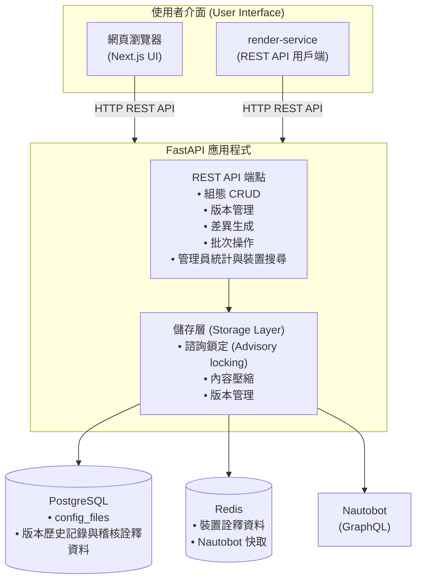
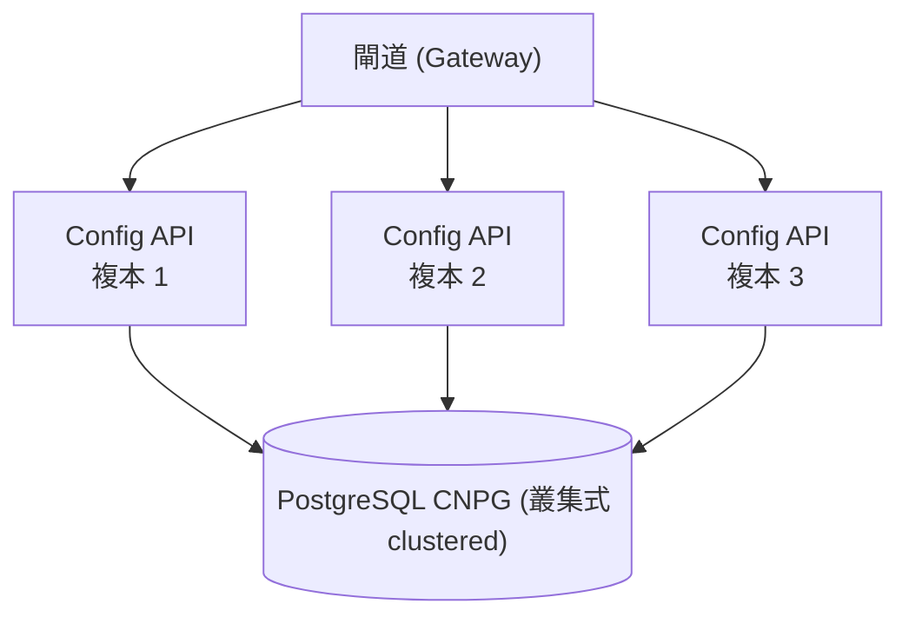

# Config Store Architecture

此文件描述 NVIDIA Config Manager 的 Config Store 服務之系統架構。

## 系統架構



### 架構組件

#### API 服務 (FastAPI)

API 服務為一個 FastAPI 應用程式，提供用於組態管理的 REST API。其功能如下：

* 版本化組態儲存，具有 1 年的保留策略。
* Gzip 壓縮（層級 6），提高儲存效率。
* PostgreSQL 諮詢鎖定（advisory locks），提供細粒度的並行控制（concurrency control）。
* 附帶 OpenAPI 文件的 RESTful API。
* 版本之間的差異生成 (Diff generation)。
* 批次操作與批次端點。

#### 網頁 UI (Web UI)

* 用於瀏覽裝置組態的 Next.js 網頁介面。
* 請參閱 [網頁 UI](https://docs.nvidia.com/switch-infrastructure/config-manager/services/config-store/overview#web-ui) 以瞭解其特色與存取說明。

#### PostgreSQL (CNPG)

* 版本化組態的主要資料儲存庫。
* 用於並行寫入的諮詢鎖。
* 依每個裝置/檔案名稱/檔案類型（device/filename/file_type）自動進行版本控制。
* 壓縮的內容儲存。

#### Redis

* Nautobot 裝置詮釋資料的快取。
* 減少 Nautobot API 的負載。

#### Nautobot

* 裝置詮釋資料（站點、平台、角色、機櫃）的單一真理源（SSOT）。
* 透過 GraphQL API 進行存取。
* 詮釋資料快取於 Redis 中以提升效能。

## 高可用性架構 (High Availability Architecture)



在此高可用性架構中：

* 任何 API 複本皆能處理任何要求。
* 若其中一個複本崩潰，其他複本會繼續提供服務。
* 細粒度鎖定允許所有複本進行並行寫入。
* 無單一故障點（SPOF）。

## 資料流 (Data Flows)

### 寫入操作流程 (Write Operation Flow)

1. 用戶端向 API 端點發送 HTTP POST 要求。
2. FastAPI 接收要求並驗證輸入內容。
3. 儲存層取得 PostgreSQL 諮詢鎖（鎖定對象為 device+filename+file_type）。
4. 內容使用 gzip（層級 6）進行壓縮。
5. 計算內容雜湊值以進行去重（deduplication）。
6. 將新版本插入到 `config_files` 資料表中。
7. 在交易提交（transaction commit）時自動釋放鎖定。
8. 傳回包含版本號的回應。

### 讀取操作流程 (Read Operation Flow)

1. 用戶端向 API 端點發送 HTTP GET 要求。
2. FastAPI 向 PostgreSQL 查詢最新版本。
3. 自儲存庫中解壓縮內容。
4. 從 Redis 快取中富化（enrich）裝置的詮釋資料（若快取未命中，則向 Nautobot 查詢）。
5. 傳回包含組態內容與詮釋資料的回應。

### 並行寫入處理 (Concurrent Write Handling)

* PostgreSQL 諮詢鎖在 device+filename+file_type 層級上提供細粒度鎖定。
* 不同的裝置可以同時進行寫入而不會互鎖。
* 預期組態（intended）與備份組態（backup）各自擁有獨立的鎖。
* 鎖定會在交易提交/回復（commit/rollback）時自動釋放。
* 失敗的交易會自動釋放鎖定。

## 儲存架構 (Storage Architecture)

### 資料庫綱要 (Database Schema)

`config_files` 資料表儲存所有版本化的組態內容：

```sql
config_files:
- id (UUID, 主鍵 primary key)
- device_uuid (UUID, 已建立索引 indexed)
- filename (檔案名稱, 文字 text)
- file_type (檔案類型, 列舉: intended|backup, 已建立索引)
- version (版本號, 整數 integer)
- content (內容, 位元組陣列 bytea, 已壓縮 compressed)
- content_hash (內容雜湊值, 文字, 未壓縮內容的 SHA256)
- author (作者, 文字, 已建立索引)
- commit_message (提交訊息, 文字)
- created_at (建立時間, 帶時區的時間戳記, 已建立索引)

唯一性約束 (Unique constraint): (device_uuid, filename, file_type, version)
索引 (Indexes): device+filename, device+filename+file_type, created_at, author
```

### 壓縮 (Compression)

* 內容在儲存前會使用 gzip level 6 進行壓縮。
* 典型的壓縮率：減少約 93% 的大小（50KB 壓縮至約 5KB）。
* 解壓縮在讀取操作時進行。
* 內容雜湊值是基於「未壓縮內容」計算，以便進行重複資料刪除。

### 版本控制 (Versioning)

* 依據每個 device/filename/file_type 組合自動遞增版本號。
* 版本號自 1 開始，按順序遞增。
* 每個版本皆是不可變的（immutable，無法修改，只能產生新版本）。
* 具備包含作者、提交訊息和時間戳記的完整審計追蹤（audit trail）。

## Nautobot 整合

透過 GraphQL 自 Nautobot 取得裝置詮釋資料，並快取至 Redis：

* 站點資訊 (Site information)
* 平台細節 (Platform details)
* 裝置角色 (Device role)
* 機櫃位置 (Rack location)
* 其他裝置屬性 (Other device attributes)

此詮釋資料富化了 API 回應，並能在網頁 UI 中呈現以裝置為中心的檢視。

**快取策略 (Caching Strategy)**：

* 詮釋資料快取於 Redis 中並設有存活時間（TTL）。
* 快取未命中（Cache misses）時，會向 Nautobot 發送 GraphQL 查詢。
* 快取重新整理服務會定期更新過期的資料項目。

## 部署架構 (Deployment Architecture)

### Kubernetes 部署

此服務做為 Kubernetes 應用程式進行部署，包含：

* **API 服務 (API Service)**：3-5 個複本（replicas）以提供高可用性。
* **PostgreSQL**：CNPG 叢集（主資料庫 + 2 個複本）。
* **Redis**：用於 Nautobot 裝置詮釋資料快取的共享服務。
* **網頁 UI (Web UI)**：選配的 Next.js 前端。
* **閘道 (Gateway)**：用於外部存取。

### 基礎設施需求 (Infrastructure Requirements)

* **PostgreSQL**：CNPG 叢集（主資料庫 + 2 個複本）
  * 記憶體：每台執行個體（instance） 16GB
  * CPU：每台執行個體 4-8 核
  * 儲存空間：200GB SSD
* **Redis**：用於 Nautobot 裝置詮釋資料快取的共享服務
* **API 複本**：3-5 個複本以提供高可用性
  * 記憶體：每個複本 1GB
  * CPU：每個複本 500m

## 監控與可觀測性 (Monitoring and Observability)

### Prometheus 指標 (Prometheus Metrics)

您可以透過運行的 `/metrics` 端點取得 Prometheus 指標。Config Store 提供預設的指標組，如 [FastAPI Instrumentator 說明文件](https://github.com/trallnag/prometheus-fastapi-instrumentator) 所載：

* `http_requests_total` — 要求總數
* `http_request_size_bytes` — 所有傳入要求內容長度的總和
* `http_response_size_bytes` — 所有傳出回應內容長度的總和
* `http_request_duration_seconds` — 要求的總持續時間（限制在少數的 buckets 區間中）
* `http_request_duration_highr_seconds` — 更高解析度的要求持續時間（具有大量的 buckets 區間）

### 健康檢查 (Health Checks)

* **健康檢查路由**：`GET /healthcheck`
* **就緒探針 (Readiness Probe)**：資料庫連線測試。
* **存活探針 (Liveness Probe)**：應用程式響應性測試。

### 日誌記錄 (Logging)

* 帶有要求 ID（request IDs）的**結構化日誌記錄**。
* 所有組態變更的**審計日誌記錄 (Audit logging)**。
* 帶有堆疊追蹤（stack traces）的**錯誤日誌記錄**。
* 針對慢速操作的**效能日誌記錄**。

---

## 重點整理

本篇說明了 NVIDIA Config Manager Config Store 服務的底層架構設計，其核心要點如下：

1. **核心技術堆疊與流程**：
   - **FastAPI**：作為 REST API 服務提供組態的 CRUD、版本與差異管理。
   - **PostgreSQL (CNPG)**：主資料庫。使用 **Gzip level 6 進行組態內容壓縮**（壓縮率高達 93%），並以 uncompressed（解壓後）的 SHA256 雜湊作為資料去重的依據。
   - **Redis**：快取來自 Nautobot（透過 GraphQL 讀取）的站點、角色、機櫃等裝置中繼資料，避免過度負載 Nautobot。

2. **高可用性與並行鎖定**：
   - 採用多複本部署（3-5 個 API Replicas、CNPG 叢集為主資料庫+2複本）。
   - 透過 **PostgreSQL Advisory Locks (諮詢鎖)** 實現細粒度的並行寫入控制（鎖定粒度為 `device+filename+file_type`），不同裝置寫入及同裝置的預期/備份寫入互不干擾，交易提交/回復時鎖會自動釋放。

3. **版本控制與可變性**：
   - 版本號自 1 開始順序遞增；任何組態一經寫入即不可變（immutable），只能產生新版本，且強制附加作者、提交訊息等稽核資料。
