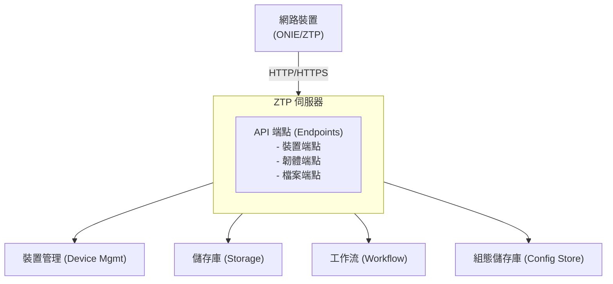

# NVIDIA Config Manager ZTP Architecture

## 概述 (Overview)

NVIDIA Config Manager ZTP 伺服器旨在促進網路裝置的零接觸部署（ZTP）。它在裝置置備（provisioning）流程中提供引導指令碼、已渲染的組態以及韌體映像檔。

## 系統架構 (System Architecture)



## API 端點 (API Endpoints)

API 主要分為三個端點群組：

* **Device Endpoints (裝置端點)**：特定裝置的引導指令碼、組態、韌體以及置備狀態的相關操作。
* **Firmware Endpoints (韌體端點)**：基於平台與版本的韌體存取。
* **File Endpoints (檔案端點)**：通用的檔案儲存與檢索操作。

## 授權流程 (Authorization Flow)

### 裝置端點授權 (Device Endpoint Authorization)

特定裝置的端點會透過以下兩種方式之一對要求進行授權：

1. 源自裝置的要求，其發送 IP 位址必須與裝置管理系統中該裝置所關聯的 IP 位址一致。
2. 源自使用者的要求，當部署啟用了單一登入（SSO）時，必須經由 Envoy 閘道作為已驗證的使用者傳入。
3. 未授權的要求將會收到 `403 Forbidden` 回應。

### 管理端點授權 (Admin Endpoint Authorization)

當部署啟用了 SSO 時，管理端點（檔案上傳、同步觸發）要求發送端必須是透過 Envoy 閘道通過驗證的使用者。

## 置備工作流 (Provisioning Workflow)

典型的 ZTP 工作流步驟如下：

```text maxLines=0
裝置開機 Device Boots
    │
    ├─→ DHCP 提供引導檔案 URL (DHCP Provides Boot File URL)
    │
    ├─→ 裝置請求引導指令碼 (Device Requests Boot Script)
    │   └─→ GET /v1/device/{uuid}/boot-script
    │
    ├─→ 裝置下載韌體 (Device Downloads Firmware)
    │   └─→ GET /v1/device/{uuid}/firmware
    │
    ├─→ 裝置載入組態 (Device Loads Configuration)
    │   └─→ GET /v1/device/{uuid}/config/{configlet}
    │
    ├─→ 裝置驗證序號 (Device Validates Serial)
    │   └─→ POST /v1/device/{uuid}/validate_serial
    │
    ├─→ 裝置標記為已置備 (Device Marks Provisioned)
    │   └─→ POST /v1/device/{uuid}/provisioned
    │       │
    │       ├─→ 更新裝置狀態 (Update Device Status)
    │       │
    │       └─→ 觸發備份工作流 (Trigger Backup Workflow)
    │
    └─→ 置備完成 Provisioning Complete
```

## 儲存庫 (Storage)

系統使用物件儲存（object storage）來存放韌體與檔案：

* 檔案依平台與版本進行分類組織。
* 韌體映像檔會被貼上標記以利識別。
* 檔案包含 SHA256 總和檢查碼用以驗證。
* 大型檔案支援高效的串流下載。

## 安全性 (Security)

### 身分驗證與授權 (Authentication & Authorization)

* 裝置端點授權允許透過來源 IP 驗證的已註冊裝置，或是在啟用 SSO 時透過 Envoy 閘道通過驗證的使用者進行連線。
* 管理（Admin）端點在啟用 SSO 時，需要透過 Envoy 閘道完成驗證的使用者存取。
* 透過序號驗證機制防止未授權的置備行為。

### 資料保護 (Data Protection)

* 敏感的組態檔案僅供已註冊的裝置或通過驗證的使用者存取。
* 提供韌體映像檔下載時，一併提供總和檢查碼以供驗證。

## 監控與指標 (Monitoring & Metrics)

系統在 `/metrics` 揭露 Prometheus 指標：

* 裝置要求指標，包含用戶端 IP、基礎 URL 與裝置 UUID 的標籤。
* 標準的 HTTP 指標（要求持續時間、數量、狀態碼）。

## 錯誤處理 (Error Handling)

API 使用標準的 HTTP 狀態碼：

* `400 Bad Request`：無效的要求參數或主體。
* `403 Forbidden`：授權失敗。
* `404 Not Found`：找不到資源。
* `500 Internal Server Error`：伺服器內部錯誤。

錯誤回應中包含了詳細的錯誤訊息，以協助診斷問題。

---

## 重點整理

本篇詳細介紹了 NVIDIA Config Manager ZTP（零接觸部署）的架構細節，其核心要點如下：

1. **模組化連接設計**：
   - ZTP 伺服器核心在於 API 端點（分成裝置、韌體、通用檔案三個群組），主要連線至底層的裝置管理、儲存庫、工作流引擎以及 Config Store，藉由 HTTP/HTTPS 與開機中的網路設備（ONIE/ZTP 狀態）進行通訊。

2. **完整置備工作流**：
   - 裝置開機 ➡️ DHCP 提供 Boot URL ➡️ 裝置下載引導指令碼（`/v1/device/{uuid}/boot-script`） ➡️ 裝置下載韌體（`/v1/device/{uuid}/firmware`） ➡️ 裝置載入組態（`/v1/device/{uuid}/config/{configlet}`） ➡️ 裝置向伺服器驗證序號（`/v1/device/{uuid}/validate_serial`） ➡️ 標記為已置備（`/v1/device/{uuid}/provisioned`）並觸發備份工作流。

3. **雙重授權與保護機制**：
   - **裝置端點**：來源 IP 必須是 Nautobot 中該設備的管理 IP，或是通過驗證的使用者（經由 Envoy 閘道 + SSO）。
   - **管理端點**：上傳韌體等操作強制要求使用者通過 Envoy 閘道驗證。
   - **儲存與防護**：敏感組態檔嚴格限制存取；韌體及通用檔案儲存於物件儲存庫，依平台與版本分類，下載時提供 SHA256 驗證。
