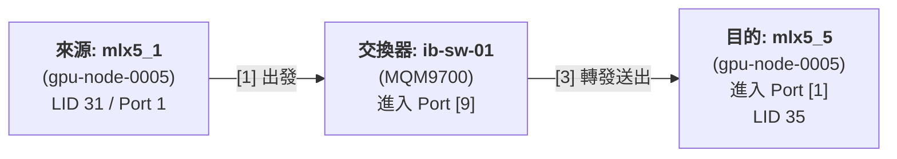

# infiniband Utilties

| 工具指令 (Command) | 用途目的 (Purpose) | 應用場景與細節 |
| :--- | :--- | :--- |
| **`ibping`** | 測試節點間的 InfiniBand 連通性 | 運作於 InfiniBand 協定層（基於 LID/GUID），而非 IP 層。用於驗證兩端節點是否能透過硬體成功傳輸封包。其輸出類似傳統 IP ping，但底層使用的是供應商管理資料報 (Vendor MADs)。 |
| **`ibnetdiscover`** | 掃描並繪製完整的 InfiniBand 網路拓樸 | 用於全域 Fabric 探索，能顯示網路中的主機通道介面卡 (HCA)、交換器、連接埠及實體線路連接狀態，並能輸出人類可讀的拓樸檔。 |
| **`iblinkinfo`** | 顯示連結層級 (Link-level) 的連線狀態 | 適用於快速進行拓樸與實體連結檢查，協助維運人員迅速掌握連接埠的狀態。 |
| **`ibtracert`** | 追蹤節點間的路由路徑 | 利用子網管理封包 (SMPs) 追蹤從來源 GID/LID 到目的地 GID/LID 所經過的所有交換器跳數 (Hops)。可用來排查路由中斷點，也支援多播 (Multicast) 路徑追蹤。 |
| **`ibhosts`** | 列出 Fabric 中所有的主機節點 | 透過掃描網路或讀取現有的拓樸檔，提取並顯示出所有的 InifniBand 主機 (CA Nodes)，用於主機盤點與探索。 |
| **`ibswitches`** | 列出 Fabric 中所有的交換器 | 透過掃描網路或讀取拓樸檔，單獨提取並顯示所有的 InfiniBand 交換器設備清單。 |
| **`ibnodes`** | 列出 Fabric 中所有的端點節點 | 提供最完整的節點全景視圖，包含所有的主機通道介面卡 (CAs) 以及交換器設備。 |
| **`ibv_devinfo`** | 顯示 HCA 的詳細硬體能力與狀態 | 用於本機端的硬體驗證，可顯示 ConnectX 網卡的韌體版本、核心架構以及各個連接埠的啟動狀態與支援規格。 |

IB 物理連線

```
┌──────────────┐          ┌──────────────┐          ┌───────────────────────────────────┐          ┌──────────────┐          ┌──────────────┐
│     HCA      │──────────│    Cable     │──────────│              Switch               │──────────│    Cable     │──────────│     HCA      │
└──────┬───────┘          └──────────────┘          └─────────────────┬─────────────────┘          └──────────────┘          └──────┬───────┘
       │                                                              │                                                             │
       │                                                 [ Mellanox InfiniBand IS5022 ]                                             │
       │                                                 • 8-Port                                                                   │
       │                                                 • Quad Small Form-factor Pluggable (QSFP)                                  │
       │                                                 • 40GB/s Switch                                                            │
       │                                                                                                                            │
┌──────┴───────┐                                                                                                             ┌──────┴───────┐
│     Node     │                                                                                                             │     Node     │
│   (Ubuntu)   │                                                                                                             │   (Ubuntu)   │
└──────────────┘                                                                                                             └──────────────┘
```

## ibping

測試 infiniBand 節點之間連通性。

1. one nofr run as server `ibping -S`
2. Another nodes sends ping request `inping -L <LID>`

## ibnetdiscover

它是一個發現和映射整個 IntiniBank 結構的工具，可以輸出以下資訊
- Nodes(HCAs)
- Switches
- Ports and connections

```bash
$ sudo ibnetdiscover
#
# Topology file: generated on Tue Sep 29 02:01:28 2026
#
# Initiated from node c470bd0300c25136 port c470bd0300c25136

vendid=0x2c9
devid=0xd2f2
sysimgguid=0x6433aa0300501740
switchguid=0x6433aa0300501740(6433aa0300501740)
Switch  65 "S-6433aa0300501740"         # "MF0;ib-sw-01:MQM9700/U1" enhanced port 0 lid 5 lmc 0
[1]     "H-e09d730300c4d366"[1](e09d730300c4d366)               # "MT41692 BlueField3 Mellanox Technologies" lid 7 4xNDR
[2]     "H-c470bd0300c25136"[1](c470bd0300c25136)               # "head-node-storage-01 mlx5_0" lid 1 4xNDR
[3]     "H-c470bd0300be24e0"[1](c470bd0300be24e0)               # "gpu-node-0005 mlx5_5" lid 35 4xNDR
[4]     "H-c470bd0300c532de"[1](c470bd0300c532de)               # "gpu-node-0005 mlx5_9" lid 36 4xNDR
[5]     "H-c470bd0300c545dc"[1](c470bd0300c545dc)               # "MT41692 BlueField3 Mellanox Technologies" lid 13 4xNDR
[6]     "H-c470bd0300c23d9e"[1](c470bd0300c23d9e)               # "MT41692 BlueField3 Mellanox Technologies" lid 9 4xNDR
[7]     "H-c470bd0300c233e8"[1](c470bd0300c233e8)               # "gpu-node-0005 mlx5_4" lid 38 4xNDR
[8]     "H-c470bd0300c52e66"[1](c470bd0300c52e66)               # "gpu-node-0005 mlx5_8" lid 37 4xNDR
[9]     "H-c470bd0300c52cc4"[1](c470bd0300c52cc4)               # "gpu-node-0005 mlx5_1" lid 31 4xNDR
[10]    "H-c470bd0300c54466"[1](c470bd0300c54466)               # "gpu-node-0005 mlx5_3" lid 32 4xNDR
[11]    "H-c470bd0300c52d74"[1](c470bd0300c52d74)               # "gpu-node-0005 mlx5_2" lid 33 4xNDR
[12]    "H-c470bd0300c5456e"[1](c470bd0300c5456e)               # "gpu-node-0005 mlx5_0" lid 34 4xNDR
[21]    "H-c470bd0300c26d2c"[1](c470bd0300c26d2c)               # "localhost HCA-1" lid 65 4xNDR
[22]    "H-c470bd0300c540a6"[1](c470bd0300c540a6)               # "localhost HCA-1" lid 68 4xNDR
[23]    "H-c470bd0300c5315a"[1](c470bd0300c5315a)               # "localhost HCA-1" lid 67 4xNDR
[24]    "H-c470bd0300bdfd36"[1](c470bd0300bdfd36)               # "localhost HCA-1" lid 66 4xNDR
[25]    "H-c470bd0300c5467e"[1](c470bd0300c5467e)               # "localhost HCA-1" lid 63 4xNDR
[26]    "H-c470bd0300c532ba"[1](c470bd0300c532ba)               # "localhost HCA-1" lid 69 4xNDR
[27]    "H-c470bd0300c5501e"[1](c470bd0300c5501e)               # "localhost HCA-1" lid 64 4xNDR
[28]    "H-c470bd0300be23ca"[1](c470bd0300be23ca)               # "localhost HCA-1" lid 70 4xNDR
[29]    "H-c470bd0300be6688"[1](c470bd0300be6688)               # "localhost HCA-1" lid 46 4xNDR
[30]    "H-c470bd0300c53026"[1](c470bd0300c53026)               # "localhost HCA-1" lid 41 4xNDR
[31]    "H-c470bd0300c5400c"[1](c470bd0300c5400c)               # "localhost HCA-1" lid 40 4xNDR
[32]    "H-c470bd0300c53f46"[1](c470bd0300c53f46)               # "localhost HCA-1" lid 42 4xNDR
[33]    "H-c470bd0300c53900"[1](c470bd0300c53900)               # "localhost HCA-1" lid 39 4xNDR
[34]    "H-c470bd0300c53cf4"[1](c470bd0300c53cf4)               # "localhost HCA-1" lid 44 4xNDR
[35]    "H-c470bd0300c206fe"[1](c470bd0300c206fe)               # "localhost HCA-1" lid 45 4xNDR
[36]    "H-c470bd0300c54f9a"[1](c470bd0300c54f9a)               # "localhost HCA-1" lid 43 4xNDR
[37]    "H-c470bd0300c531c8"[1](c470bd0300c531c8)               # "localhost HCA-1" lid 54 4xNDR
[38]    "H-c470bd0300c553a4"[1](c470bd0300c553a4)               # "localhost HCA-1" lid 52 4xNDR
[39]    "H-c470bd0300c5437c"[1](c470bd0300c5437c)               # "localhost HCA-1" lid 48 4xNDR
[40]    "H-c470bd0300c55f80"[1](c470bd0300c55f80)               # "localhost HCA-1" lid 49 4xNDR
[41]    "H-c470bd0300c545a2"[1](c470bd0300c545a2)               # "localhost HCA-1" lid 51 4xNDR
[42]    "H-c470bd0300c54022"[1](c470bd0300c54022)               # "localhost HCA-1" lid 47 4xNDR
[43]    "H-c470bd0300c5449a"[1](c470bd0300c5449a)               # "localhost HCA-1" lid 50 4xNDR
[44]    "H-c470bd0300c541ae"[1](c470bd0300c541ae)               # "localhost HCA-1" lid 53 4xNDR
[65]    "H-6433aa0300501750"[1](6433aa0300501750)               # "Mellanox Technologies Aggregation Node" lid 14 4xNDR

vendid=0x2c9
devid=0xa2dc
sysimgguid=0xc470bd0300c541a6
caguid=0xc470bd0300c541ae
Ca      1 "H-c470bd0300c541ae"          # "localhost HCA-1"
[1](c470bd0300c541ae)   "S-6433aa0300501740"[44]                # lid 53 lmc 0 "MF0;ib-sw-01:MQM9700/U1" lid 5 4xNDR

vendid=0x2c9
devid=0xcf09
sysimgguid=0x6433aa0300501740
caguid=0x6433aa0300501750
Ca      1 "H-6433aa0300501750"          # "Mellanox Technologies Aggregation Node"
[1](6433aa0300501750)   "S-6433aa0300501740"[65]                # lid 14 lmc 0 "MF0;ib-sw-01:MQM9700/U1" lid 5 4xNDR

vendid=0x2c9
devid=0xa2dc
sysimgguid=0xc470bd0300c54492
caguid=0xc470bd0300c5449a
Ca      1 "H-c470bd0300c5449a"          # "localhost HCA-1"
[1](c470bd0300c5449a)   "S-6433aa0300501740"[43]                # lid 50 lmc 0 "MF0;ib-sw-01:MQM9700/U1" lid 5 4xNDR

vendid=0x2c9
devid=0xa2dc
sysimgguid=0xc470bd0300c5401a
caguid=0xc470bd0300c54022
Ca      1 "H-c470bd0300c54022"          # "localhost HCA-1"
[1](c470bd0300c54022)   "S-6433aa0300501740"[42]                # lid 47 lmc 0 "MF0;ib-sw-01:MQM9700/U1" lid 5 4xNDR

vendid=0x2c9
devid=0xa2dc
sysimgguid=0xc470bd0300c5459a
caguid=0xc470bd0300c545a2
Ca      1 "H-c470bd0300c545a2"          # "localhost HCA-1"
[1](c470bd0300c545a2)   "S-6433aa0300501740"[41]                # lid 51 lmc 0 "MF0;ib-sw-01:MQM9700/U1" lid 5 4xNDR

vendid=0x2c9
devid=0xa2dc
sysimgguid=0xc470bd0300c55f78
caguid=0xc470bd0300c55f80
Ca      1 "H-c470bd0300c55f80"          # "localhost HCA-1"
[1](c470bd0300c55f80)   "S-6433aa0300501740"[40]                # lid 49 lmc 0 "MF0;ib-sw-01:MQM9700/U1" lid 5 4xNDR

vendid=0x2c9
devid=0xa2dc
sysimgguid=0xc470bd0300c54374
caguid=0xc470bd0300c5437c
Ca      1 "H-c470bd0300c5437c"          # "localhost HCA-1"
[1](c470bd0300c5437c)   "S-6433aa0300501740"[39]                # lid 48 lmc 0 "MF0;ib-sw-01:MQM9700/U1" lid 5 4xNDR

vendid=0x2c9
devid=0xa2dc
sysimgguid=0xc470bd0300c5539c
caguid=0xc470bd0300c553a4
Ca      1 "H-c470bd0300c553a4"          # "localhost HCA-1"
[1](c470bd0300c553a4)   "S-6433aa0300501740"[38]                # lid 52 lmc 0 "MF0;ib-sw-01:MQM9700/U1" lid 5 4xNDR

vendid=0x2c9
devid=0xa2dc
sysimgguid=0xc470bd0300c531c0
caguid=0xc470bd0300c531c8
Ca      1 "H-c470bd0300c531c8"          # "localhost HCA-1"
[1](c470bd0300c531c8)   "S-6433aa0300501740"[37]                # lid 54 lmc 0 "MF0;ib-sw-01:MQM9700/U1" lid 5 4xNDR

vendid=0x2c9
devid=0xa2dc
sysimgguid=0xc470bd0300c54f92
caguid=0xc470bd0300c54f9a
Ca      1 "H-c470bd0300c54f9a"          # "localhost HCA-1"
[1](c470bd0300c54f9a)   "S-6433aa0300501740"[36]                # lid 43 lmc 0 "MF0;ib-sw-01:MQM9700/U1" lid 5 4xNDR

vendid=0x2c9
devid=0xa2dc
sysimgguid=0xc470bd0300c206f6
caguid=0xc470bd0300c206fe
Ca      1 "H-c470bd0300c206fe"          # "localhost HCA-1"
[1](c470bd0300c206fe)   "S-6433aa0300501740"[35]                # lid 45 lmc 0 "MF0;ib-sw-01:MQM9700/U1" lid 5 4xNDR

vendid=0x2c9
devid=0xa2dc
sysimgguid=0xc470bd0300c53cec
caguid=0xc470bd0300c53cf4
Ca      1 "H-c470bd0300c53cf4"          # "localhost HCA-1"
[1](c470bd0300c53cf4)   "S-6433aa0300501740"[34]                # lid 44 lmc 0 "MF0;ib-sw-01:MQM9700/U1" lid 5 4xNDR

vendid=0x2c9
devid=0xa2dc
sysimgguid=0xc470bd0300c538f8
caguid=0xc470bd0300c53900
Ca      1 "H-c470bd0300c53900"          # "localhost HCA-1"
[1](c470bd0300c53900)   "S-6433aa0300501740"[33]                # lid 39 lmc 0 "MF0;ib-sw-01:MQM9700/U1" lid 5 4xNDR

vendid=0x2c9
devid=0xa2dc
sysimgguid=0xc470bd0300c53f3e
caguid=0xc470bd0300c53f46
Ca      1 "H-c470bd0300c53f46"          # "localhost HCA-1"
[1](c470bd0300c53f46)   "S-6433aa0300501740"[32]                # lid 42 lmc 0 "MF0;ib-sw-01:MQM9700/U1" lid 5 4xNDR

vendid=0x2c9
devid=0xa2dc
sysimgguid=0xc470bd0300c54004
caguid=0xc470bd0300c5400c
Ca      1 "H-c470bd0300c5400c"          # "localhost HCA-1"
[1](c470bd0300c5400c)   "S-6433aa0300501740"[31]                # lid 40 lmc 0 "MF0;ib-sw-01:MQM9700/U1" lid 5 4xNDR

vendid=0x2c9
devid=0xa2dc
sysimgguid=0xc470bd0300c5301e
caguid=0xc470bd0300c53026
Ca      1 "H-c470bd0300c53026"          # "localhost HCA-1"
[1](c470bd0300c53026)   "S-6433aa0300501740"[30]                # lid 41 lmc 0 "MF0;ib-sw-01:MQM9700/U1" lid 5 4xNDR

vendid=0x2c9
devid=0xa2dc
sysimgguid=0xc470bd0300be6680
caguid=0xc470bd0300be6688
Ca      1 "H-c470bd0300be6688"          # "localhost HCA-1"
[1](c470bd0300be6688)   "S-6433aa0300501740"[29]                # lid 46 lmc 0 "MF0;ib-sw-01:MQM9700/U1" lid 5 4xNDR

vendid=0x2c9
devid=0xa2dc
sysimgguid=0xc470bd0300be23c2
caguid=0xc470bd0300be23ca
Ca      1 "H-c470bd0300be23ca"          # "localhost HCA-1"
[1](c470bd0300be23ca)   "S-6433aa0300501740"[28]                # lid 70 lmc 0 "MF0;ib-sw-01:MQM9700/U1" lid 5 4xNDR

vendid=0x2c9
devid=0xa2dc
sysimgguid=0xc470bd0300c55016
caguid=0xc470bd0300c5501e
Ca      1 "H-c470bd0300c5501e"          # "localhost HCA-1"
[1](c470bd0300c5501e)   "S-6433aa0300501740"[27]                # lid 64 lmc 0 "MF0;ib-sw-01:MQM9700/U1" lid 5 4xNDR

vendid=0x2c9
devid=0xa2dc
sysimgguid=0xc470bd0300c532b2
caguid=0xc470bd0300c532ba
Ca      1 "H-c470bd0300c532ba"          # "localhost HCA-1"
[1](c470bd0300c532ba)   "S-6433aa0300501740"[26]                # lid 69 lmc 0 "MF0;ib-sw-01:MQM9700/U1" lid 5 4xNDR

vendid=0x2c9
devid=0xa2dc
sysimgguid=0xc470bd0300c54676
caguid=0xc470bd0300c5467e
Ca      1 "H-c470bd0300c5467e"          # "localhost HCA-1"
[1](c470bd0300c5467e)   "S-6433aa0300501740"[25]                # lid 63 lmc 0 "MF0;ib-sw-01:MQM9700/U1" lid 5 4xNDR

vendid=0x2c9
devid=0xa2dc
sysimgguid=0xc470bd0300bdfd2e
caguid=0xc470bd0300bdfd36
Ca      1 "H-c470bd0300bdfd36"          # "localhost HCA-1"
[1](c470bd0300bdfd36)   "S-6433aa0300501740"[24]                # lid 66 lmc 0 "MF0;ib-sw-01:MQM9700/U1" lid 5 4xNDR

vendid=0x2c9
devid=0xa2dc
sysimgguid=0xc470bd0300c53152
caguid=0xc470bd0300c5315a
Ca      1 "H-c470bd0300c5315a"          # "localhost HCA-1"
[1](c470bd0300c5315a)   "S-6433aa0300501740"[23]                # lid 67 lmc 0 "MF0;ib-sw-01:MQM9700/U1" lid 5 4xNDR

vendid=0x2c9
devid=0xa2dc
sysimgguid=0xc470bd0300c5409e
caguid=0xc470bd0300c540a6
Ca      1 "H-c470bd0300c540a6"          # "localhost HCA-1"
[1](c470bd0300c540a6)   "S-6433aa0300501740"[22]                # lid 68 lmc 0 "MF0;ib-sw-01:MQM9700/U1" lid 5 4xNDR

vendid=0x2c9
devid=0xa2dc
sysimgguid=0xc470bd0300c26d24
caguid=0xc470bd0300c26d2c
Ca      1 "H-c470bd0300c26d2c"          # "localhost HCA-1"
[1](c470bd0300c26d2c)   "S-6433aa0300501740"[21]                # lid 65 lmc 0 "MF0;ib-sw-01:MQM9700/U1" lid 5 4xNDR

vendid=0x2c9
devid=0xa2dc
sysimgguid=0xc470bd0300c5456e
caguid=0xc470bd0300c5456e
Ca      1 "H-c470bd0300c5456e"          # "gpu-node-0005 mlx5_0"
[1](c470bd0300c5456e)   "S-6433aa0300501740"[12]                # lid 34 lmc 0 "MF0;ib-sw-01:MQM9700/U1" lid 5 4xNDR

vendid=0x2c9
devid=0xa2dc
sysimgguid=0xc470bd0300c52d74
caguid=0xc470bd0300c52d74
Ca      1 "H-c470bd0300c52d74"          # "gpu-node-0005 mlx5_2"
[1](c470bd0300c52d74)   "S-6433aa0300501740"[11]                # lid 33 lmc 0 "MF0;ib-sw-01:MQM9700/U1" lid 5 4xNDR

vendid=0x2c9
devid=0xa2dc
sysimgguid=0xc470bd0300c54466
caguid=0xc470bd0300c54466
Ca      1 "H-c470bd0300c54466"          # "gpu-node-0005 mlx5_3"
[1](c470bd0300c54466)   "S-6433aa0300501740"[10]                # lid 32 lmc 0 "MF0;ib-sw-01:MQM9700/U1" lid 5 4xNDR

vendid=0x2c9
devid=0xa2dc
sysimgguid=0xc470bd0300c52cc4
caguid=0xc470bd0300c52cc4
Ca      1 "H-c470bd0300c52cc4"          # "gpu-node-0005 mlx5_1"
[1](c470bd0300c52cc4)   "S-6433aa0300501740"[9]         # lid 31 lmc 0 "MF0;ib-sw-01:MQM9700/U1" lid 5 4xNDR

vendid=0x2c9
devid=0xa2dc
sysimgguid=0xc470bd0300c52e66
caguid=0xc470bd0300c52e66
Ca      1 "H-c470bd0300c52e66"          # "gpu-node-0005 mlx5_8"
[1](c470bd0300c52e66)   "S-6433aa0300501740"[8]         # lid 37 lmc 0 "MF0;ib-sw-01:MQM9700/U1" lid 5 4xNDR

vendid=0x2c9
devid=0xa2dc
sysimgguid=0xc470bd0300c233e8
caguid=0xc470bd0300c233e8
Ca      1 "H-c470bd0300c233e8"          # "gpu-node-0005 mlx5_4"
[1](c470bd0300c233e8)   "S-6433aa0300501740"[7]         # lid 38 lmc 0 "MF0;ib-sw-01:MQM9700/U1" lid 5 4xNDR

vendid=0x2c9
devid=0xa2dc
sysimgguid=0xc470bd0300c23d9e
caguid=0xc470bd0300c23d9e
Ca      1 "H-c470bd0300c23d9e"          # "MT41692 BlueField3 Mellanox Technologies"
[1](c470bd0300c23d9e)   "S-6433aa0300501740"[6]         # lid 9 lmc 0 "MF0;ib-sw-01:MQM9700/U1" lid 5 4xNDR

vendid=0x2c9
devid=0xa2dc
sysimgguid=0xc470bd0300c545dc
caguid=0xc470bd0300c545dc
Ca      1 "H-c470bd0300c545dc"          # "MT41692 BlueField3 Mellanox Technologies"
[1](c470bd0300c545dc)   "S-6433aa0300501740"[5]         # lid 13 lmc 0 "MF0;ib-sw-01:MQM9700/U1" lid 5 4xNDR

vendid=0x2c9
devid=0xa2dc
sysimgguid=0xc470bd0300c532de
caguid=0xc470bd0300c532de
Ca      1 "H-c470bd0300c532de"          # "gpu-node-0005 mlx5_9"
[1](c470bd0300c532de)   "S-6433aa0300501740"[4]         # lid 36 lmc 0 "MF0;ib-sw-01:MQM9700/U1" lid 5 4xNDR

vendid=0x2c9
devid=0xa2dc
sysimgguid=0xc470bd0300be24e0
caguid=0xc470bd0300be24e0
Ca      1 "H-c470bd0300be24e0"          # "gpu-node-0005 mlx5_5"
[1](c470bd0300be24e0)   "S-6433aa0300501740"[3]         # lid 35 lmc 0 "MF0;ib-sw-01:MQM9700/U1" lid 5 4xNDR

vendid=0x2c9
devid=0xa2dc
sysimgguid=0xe09d730300c4d366
caguid=0xe09d730300c4d366
Ca      1 "H-e09d730300c4d366"          # "MT41692 BlueField3 Mellanox Technologies"
[1](e09d730300c4d366)   "S-6433aa0300501740"[1]         # lid 7 lmc 0 "MF0;ib-sw-01:MQM9700/U1" lid 5 4xNDR

vendid=0x2c9
devid=0xa2dc
sysimgguid=0xc470bd0300c25136
caguid=0xc470bd0300c25136
Ca      1 "H-c470bd0300c25136"          # "head-node-storage-01 mlx5_0"
[1](c470bd0300c25136)   "S-6433aa0300501740"[2]         # lid 1 lmc 0 "MF0;ib-sw-01:MQM9700/U1" lid 5 4xNDR
```

### 拓撲檔案全域標頭（Global File Header）

```text
# Topology file: generated on Tue Sep 29 02:01:28 2026
# Initiated from node c470bd0300c25136 port c470bd0300c25136
```

* 產生時間：執行探索的時間戳記。
* 發起端資訊：本次指令是從 GUID 為 c470bd0300c25136 的節點發起的（對照後續日誌為 head-node-storage-01）。

輸出內容主要分為 **節點標頭（Node Header）**、**節點屬性（Node Attributes）** 與 **連接埠對接關係（Port Link Entries）** 三大區塊。

### 節點標頭列 (Node Header)

宣告當前掃描到的裝置類型與基本識別：
* **`Switch` / `Ca` / `Rt` (Node Type)**：節點硬體類型。
  * `Switch`：InfiniBand 交換器（如 NVIDIA Quantum / Quantum-2 系統）。
  * `Ca`：Channel Adapter（主機通道適配器，即 ConnectX HCA 或 BlueField DPU 等主機端網卡）。
  * `Rt`：InfiniBand 路由器（Router）。
* **`36` / `2` (Port Count)**：該硬體設備所具備的**總實體連接埠數量**（例如 36-Port 交換器或 2-Port HCA）。
       ```
       # 65-Port 交換器
       Switch  65 "S-6433aa0300501740"         # "MF0;ib-sw-01:MQM9700/U1" enhanced port 0 lid 5 lmc 0
       ```
       ```
       # 1 port HCA
       Ca      1 "H-c470bd0300c532de"          # "gpu-node-0005 mlx5_9"
       ```
* **`"S-6433aa0300501740"` (Node ID / Description)**：該節點在系統內的識別字串，通常包含前詞標籤（`S-` 代表 Switch，`H-` 代表 Host/CA）與硬體 Node GUID。
       ```
      
       Switch  65 "S-6433aa0300501740"         # "MF0;ib-sw-01:MQM9700/U1" enhanced port 0 lid 5 lmc 0
              [1]     "H-e09d730300c4d366"[1](e09d730300c4d366)               # "MT41692 BlueField3 Mellanox Technologies" lid 7 4xNDR
              [2]     "H-c470bd0300c25136"[1](c470bd0300c25136)               # "head-node-storage-01 mlx5_0" lid 1 4xNDR
       ```

### 節點屬性與管理資訊 (Node Attributes)

定義該硬體設備的底層硬體資訊與全球唯一識別碼（GUID）。

交換器

```
vendid=0x2c9
devid=0xd2f2
sysimgguid=0x6433aa0300501740
switchguid=0x6433aa0300501740(6433aa0300501740)
```

網卡 Ca

```
vendid=0x2c9
devid=0xa2dc
sysimgguid=0xc470bd0300c541a6
caguid=0xc470bd0300c541ae
```

|欄位名稱|說明|實例|
|---|---|---|
|vendid	|Vendor ID（廠商識別碼）|	0x2c9 代表 Mellanox Technologies（現為 NVIDIA Networking）。|
|devid	|Device ID（晶片/型號識別碼）	|0xd2f2 為 Quantum-2（400G NDR 交換器晶片）。0xa2dc 為 ConnectX-7 / BlueField-3 晶片。|
|sysimgguid	|System Image GUID（系統映像 GUID）|	整個硬體機箱或子系統共用的 GUID。若是單卡多埠或交換器，各埠會共用相同的 sysimgguid。|
|switchguid / caguid	|Node GUID（節點 GUID）	|該交換器或通道適配器（HCA）本體的獨立 GUID。括號內是別名或十六進制表示。|

標頭右側經 `#` 註解欄位，提供該設備的底層管理定址：

```
# "MF0;ib-sw-01:MQM9700/U1" enhanced port 0 lid 5 lmc 0
```

* NodeDescription：設備描述字串（例如 "MF0;ib-sw-01:MQM9700/U1" 代表機型為 MQM9700、主機名為 ib-sw-01；"gpu-node-0005 mlx5_0" 代表 GPU 節點上的第 0 號網卡）。
* enhanced port 0：（僅 Switch）交換器具備增強型 Port 0 管理功能。
* lid <數字>：Local Identifier，由 Subnet Manager 分配的本機二層位址（例如此交換器的 LID 為 5）。
* lmc <數字>：LID Mask Control，通常為 0（表示一個連接埠只分配 1 個單一 LID）。

### 連接埠對接關係列 (Port Link Entries)

條列該設備每一個已連線對接的 Port 詳細狀態（格式：`[本地埠號] "對端節點標識"[對端埠號](對端埠GUID) # "對端說明" lid 對端LID 速率寬度`）

從 Switch 的角度看（Switch Port -> HCA Port）:

```text
[3]     "H-c470bd0300be24e0"[1](c470bd0300be24e0)               # "gpu-node-0005 mlx5_5" lid 35 4xNDR
```
* [3]：本地埠號。交換器上的第 3 號實體連接埠。
* "H-c470bd0300be24e0"[1]：對端節點與對端埠號。連到代號為 H-c470bd0300be24e0 的主機，接在該主機的第 1 號埠。
* (c470bd0300be24e0)：對端連接埠的 Port GUID。
* # "gpu-node-0005 mlx5_5"：對端設備的 NodeDescription。
  * lid 35：對端該連接埠獲配的 LID。
  * 4xNDR：鏈路寬度與速度。4 通道 NDR（Next Data Rate），即 400 Gbps。

從 HCA 的角度看（HCA Port -> Switch Port）:

```text
[1](c470bd0300c541ae)   "S-6433aa0300501740"[44]                # lid 53 lmc 0 "MF0;ib-sw-01:MQM9700/U1" lid 5 4xNDR
```

* [1](c470bd0300c541ae)：本地為第 1 號埠，其 Port GUID 為 c470bd0300c541ae。
* "S-6433aa0300501740"[44]：對端為交換器 S-6433aa0300501740 的第 44 號埠。
* # lid 53 lmc 0：本地埠獲得的 LID 為 53。
* "MF0;ib-sw-01:MQM9700/U1"：對端交換器的名稱。
* lid 5：對端交換器的 LID。
* 4xNDR：鏈路速度為 400 Gbps。

## iblinkinfo

```bash
$ sudo iblinkinfo
CA: localhost HCA-1:
      0xc470bd0300c541ae     53    1[  ] ==( 4X        106.25 Gbps Active/  LinkUp)==>       5   44[  ] "MF0;ib-sw-01:MQM9700/U1" ( )
CA: Mellanox Technologies Aggregation Node:
      0x6433aa0300501750     14    1[  ] ==( 4X        106.25 Gbps Active/  LinkUp)==>       5   65[  ] "MF0;ib-sw-01:MQM9700/U1" ( )
CA: localhost HCA-1:
      0xc470bd0300c5449a     50    1[  ] ==( 4X        106.25 Gbps Active/  LinkUp)==>       5   43[  ] "MF0;ib-sw-01:MQM9700/U1" ( )
CA: localhost HCA-1:
      0xc470bd0300c54022     47    1[  ] ==( 4X        106.25 Gbps Active/  LinkUp)==>       5   42[  ] "MF0;ib-sw-01:MQM9700/U1" ( )
CA: localhost HCA-1:
      0xc470bd0300c545a2     51    1[  ] ==( 4X        106.25 Gbps Active/  LinkUp)==>       5   41[  ] "MF0;ib-sw-01:MQM9700/U1" ( )
CA: localhost HCA-1:
      0xc470bd0300c55f80     49    1[  ] ==( 4X        106.25 Gbps Active/  LinkUp)==>       5   40[  ] "MF0;ib-sw-01:MQM9700/U1" ( )
CA: localhost HCA-1:
      0xc470bd0300c5437c     48    1[  ] ==( 4X        106.25 Gbps Active/  LinkUp)==>       5   39[  ] "MF0;ib-sw-01:MQM9700/U1" ( )
CA: localhost HCA-1:
      0xc470bd0300c553a4     52    1[  ] ==( 4X        106.25 Gbps Active/  LinkUp)==>       5   38[  ] "MF0;ib-sw-01:MQM9700/U1" ( )
CA: localhost HCA-1:
      0xc470bd0300c531c8     54    1[  ] ==( 4X        106.25 Gbps Active/  LinkUp)==>       5   37[  ] "MF0;ib-sw-01:MQM9700/U1" ( )
CA: localhost HCA-1:
      0xc470bd0300c54f9a     43    1[  ] ==( 4X        106.25 Gbps Active/  LinkUp)==>       5   36[  ] "MF0;ib-sw-01:MQM9700/U1" ( )
CA: localhost HCA-1:
      0xc470bd0300c206fe     45    1[  ] ==( 4X        106.25 Gbps Active/  LinkUp)==>       5   35[  ] "MF0;ib-sw-01:MQM9700/U1" ( )
CA: localhost HCA-1:
      0xc470bd0300c53cf4     44    1[  ] ==( 4X        106.25 Gbps Active/  LinkUp)==>       5   34[  ] "MF0;ib-sw-01:MQM9700/U1" ( )
CA: localhost HCA-1:
      0xc470bd0300c53900     39    1[  ] ==( 4X        106.25 Gbps Active/  LinkUp)==>       5   33[  ] "MF0;ib-sw-01:MQM9700/U1" ( )
CA: localhost HCA-1:
      0xc470bd0300c53f46     42    1[  ] ==( 4X        106.25 Gbps Active/  LinkUp)==>       5   32[  ] "MF0;ib-sw-01:MQM9700/U1" ( )
CA: localhost HCA-1:
      0xc470bd0300c5400c     40    1[  ] ==( 4X        106.25 Gbps Active/  LinkUp)==>       5   31[  ] "MF0;ib-sw-01:MQM9700/U1" ( )
CA: localhost HCA-1:
      0xc470bd0300c53026     41    1[  ] ==( 4X        106.25 Gbps Active/  LinkUp)==>       5   30[  ] "MF0;ib-sw-01:MQM9700/U1" ( )
CA: localhost HCA-1:
      0xc470bd0300be6688     46    1[  ] ==( 4X        106.25 Gbps Active/  LinkUp)==>       5   29[  ] "MF0;ib-sw-01:MQM9700/U1" ( )
CA: localhost HCA-1:
      0xc470bd0300be23ca     70    1[  ] ==( 4X        106.25 Gbps Active/  LinkUp)==>       5   28[  ] "MF0;ib-sw-01:MQM9700/U1" ( )
CA: localhost HCA-1:
      0xc470bd0300c5501e     64    1[  ] ==( 4X        106.25 Gbps Active/  LinkUp)==>       5   27[  ] "MF0;ib-sw-01:MQM9700/U1" ( )
CA: localhost HCA-1:
      0xc470bd0300c532ba     69    1[  ] ==( 4X        106.25 Gbps Active/  LinkUp)==>       5   26[  ] "MF0;ib-sw-01:MQM9700/U1" ( )
CA: localhost HCA-1:
      0xc470bd0300c5467e     63    1[  ] ==( 4X        106.25 Gbps Active/  LinkUp)==>       5   25[  ] "MF0;ib-sw-01:MQM9700/U1" ( )
CA: localhost HCA-1:
      0xc470bd0300bdfd36     66    1[  ] ==( 4X        106.25 Gbps Active/  LinkUp)==>       5   24[  ] "MF0;ib-sw-01:MQM9700/U1" ( )
CA: localhost HCA-1:
      0xc470bd0300c5315a     67    1[  ] ==( 4X        106.25 Gbps Active/  LinkUp)==>       5   23[  ] "MF0;ib-sw-01:MQM9700/U1" ( )
CA: localhost HCA-1:
      0xc470bd0300c540a6     68    1[  ] ==( 4X        106.25 Gbps Active/  LinkUp)==>       5   22[  ] "MF0;ib-sw-01:MQM9700/U1" ( )
CA: localhost HCA-1:
      0xc470bd0300c26d2c     65    1[  ] ==( 4X        106.25 Gbps Active/  LinkUp)==>       5   21[  ] "MF0;ib-sw-01:MQM9700/U1" ( )
CA: gpu-node-0005 mlx5_0:
      0xc470bd0300c5456e     34    1[  ] ==( 4X        106.25 Gbps Active/  LinkUp)==>       5   12[  ] "MF0;ib-sw-01:MQM9700/U1" ( )
CA: gpu-node-0005 mlx5_2:
      0xc470bd0300c52d74     33    1[  ] ==( 4X        106.25 Gbps Active/  LinkUp)==>       5   11[  ] "MF0;ib-sw-01:MQM9700/U1" ( )
CA: gpu-node-0005 mlx5_3:
      0xc470bd0300c54466     32    1[  ] ==( 4X        106.25 Gbps Active/  LinkUp)==>       5   10[  ] "MF0;ib-sw-01:MQM9700/U1" ( )
CA: gpu-node-0005 mlx5_1:
      0xc470bd0300c52cc4     31    1[  ] ==( 4X        106.25 Gbps Active/  LinkUp)==>       5    9[  ] "MF0;ib-sw-01:MQM9700/U1" ( )
CA: gpu-node-0005 mlx5_8:
      0xc470bd0300c52e66     37    1[  ] ==( 4X        106.25 Gbps Active/  LinkUp)==>       5    8[  ] "MF0;ib-sw-01:MQM9700/U1" ( )
CA: gpu-node-0005 mlx5_4:
      0xc470bd0300c233e8     38    1[  ] ==( 4X        106.25 Gbps Active/  LinkUp)==>       5    7[  ] "MF0;ib-sw-01:MQM9700/U1" ( )
CA: MT41692 BlueField3 Mellanox Technologies:
      0xc470bd0300c23d9e      9    1[  ] ==( 4X        106.25 Gbps Active/  LinkUp)==>       5    6[  ] "MF0;ib-sw-01:MQM9700/U1" ( )
CA: MT41692 BlueField3 Mellanox Technologies:
      0xc470bd0300c545dc     13    1[  ] ==( 4X        106.25 Gbps Active/  LinkUp)==>       5    5[  ] "MF0;ib-sw-01:MQM9700/U1" ( )
CA: gpu-node-0005 mlx5_9:
      0xc470bd0300c532de     36    1[  ] ==( 4X        106.25 Gbps Active/  LinkUp)==>       5    4[  ] "MF0;ib-sw-01:MQM9700/U1" ( )
CA: gpu-node-0005 mlx5_5:
      0xc470bd0300be24e0     35    1[  ] ==( 4X        106.25 Gbps Active/  LinkUp)==>       5    3[  ] "MF0;ib-sw-01:MQM9700/U1" ( )
CA: MT41692 BlueField3 Mellanox Technologies:
      0xe09d730300c4d366      7    1[  ] ==( 4X        106.25 Gbps Active/  LinkUp)==>       5    1[  ] "MF0;ib-sw-01:MQM9700/U1" ( )
Switch: 0x6433aa0300501740 MF0;ib-sw-01:MQM9700/U1:
           5    1[  ] ==( 4X        106.25 Gbps Active/  LinkUp)==>       7    1[  ] "MT41692 BlueField3 Mellanox Technologies" ( )
           5    2[  ] ==( 4X        106.25 Gbps Active/  LinkUp)==>       1    1[  ] "head-node-storage-01 mlx5_0" ( )
           5    3[  ] ==( 4X        106.25 Gbps Active/  LinkUp)==>      35    1[  ] "gpu-node-0005 mlx5_5" ( )
           5    4[  ] ==( 4X        106.25 Gbps Active/  LinkUp)==>      36    1[  ] "gpu-node-0005 mlx5_9" ( )
           5    5[  ] ==( 4X        106.25 Gbps Active/  LinkUp)==>      13    1[  ] "MT41692 BlueField3 Mellanox Technologies" ( )
           5    6[  ] ==( 4X        106.25 Gbps Active/  LinkUp)==>       9    1[  ] "MT41692 BlueField3 Mellanox Technologies" ( )
           5    7[  ] ==( 4X        106.25 Gbps Active/  LinkUp)==>      38    1[  ] "gpu-node-0005 mlx5_4" ( )
           5    8[  ] ==( 4X        106.25 Gbps Active/  LinkUp)==>      37    1[  ] "gpu-node-0005 mlx5_8" ( )
           5    9[  ] ==( 4X        106.25 Gbps Active/  LinkUp)==>      31    1[  ] "gpu-node-0005 mlx5_1" ( )
           5   10[  ] ==( 4X        106.25 Gbps Active/  LinkUp)==>      32    1[  ] "gpu-node-0005 mlx5_3" ( )
           5   11[  ] ==( 4X        106.25 Gbps Active/  LinkUp)==>      33    1[  ] "gpu-node-0005 mlx5_2" ( )
           5   12[  ] ==( 4X        106.25 Gbps Active/  LinkUp)==>      34    1[  ] "gpu-node-0005 mlx5_0" ( )
           5   13[  ] ==(                Down/ Polling)==>             [  ] "" ( )
           5   14[  ] ==(                Down/ Polling)==>             [  ] "" ( )
           5   15[  ] ==(                Down/ Polling)==>             [  ] "" ( )
           5   16[  ] ==(                Down/ Polling)==>             [  ] "" ( )
           5   17[  ] ==(                Down/ Polling)==>             [  ] "" ( )
           5   18[  ] ==(                Down/ Polling)==>             [  ] "" ( )
           5   19[  ] ==(                Down/ Polling)==>             [  ] "" ( )
           5   20[  ] ==(                Down/ Polling)==>             [  ] "" ( )
           5   21[  ] ==( 4X        106.25 Gbps Active/  LinkUp)==>      65    1[  ] "localhost HCA-1" ( )
           5   22[  ] ==( 4X        106.25 Gbps Active/  LinkUp)==>      68    1[  ] "localhost HCA-1" ( )
           5   23[  ] ==( 4X        106.25 Gbps Active/  LinkUp)==>      67    1[  ] "localhost HCA-1" ( )
           5   24[  ] ==( 4X        106.25 Gbps Active/  LinkUp)==>      66    1[  ] "localhost HCA-1" ( )
           5   25[  ] ==( 4X        106.25 Gbps Active/  LinkUp)==>      63    1[  ] "localhost HCA-1" ( )
           5   26[  ] ==( 4X        106.25 Gbps Active/  LinkUp)==>      69    1[  ] "localhost HCA-1" ( )
           5   27[  ] ==( 4X        106.25 Gbps Active/  LinkUp)==>      64    1[  ] "localhost HCA-1" ( )
           5   28[  ] ==( 4X        106.25 Gbps Active/  LinkUp)==>      70    1[  ] "localhost HCA-1" ( )
           5   29[  ] ==( 4X        106.25 Gbps Active/  LinkUp)==>      46    1[  ] "localhost HCA-1" ( )
           5   30[  ] ==( 4X        106.25 Gbps Active/  LinkUp)==>      41    1[  ] "localhost HCA-1" ( )
           5   31[  ] ==( 4X        106.25 Gbps Active/  LinkUp)==>      40    1[  ] "localhost HCA-1" ( )
           5   32[  ] ==( 4X        106.25 Gbps Active/  LinkUp)==>      42    1[  ] "localhost HCA-1" ( )
           5   33[  ] ==( 4X        106.25 Gbps Active/  LinkUp)==>      39    1[  ] "localhost HCA-1" ( )
           5   34[  ] ==( 4X        106.25 Gbps Active/  LinkUp)==>      44    1[  ] "localhost HCA-1" ( )
           5   35[  ] ==( 4X        106.25 Gbps Active/  LinkUp)==>      45    1[  ] "localhost HCA-1" ( )
           5   36[  ] ==( 4X        106.25 Gbps Active/  LinkUp)==>      43    1[  ] "localhost HCA-1" ( )
           5   37[  ] ==( 4X        106.25 Gbps Active/  LinkUp)==>      54    1[  ] "localhost HCA-1" ( )
           5   38[  ] ==( 4X        106.25 Gbps Active/  LinkUp)==>      52    1[  ] "localhost HCA-1" ( )
           5   39[  ] ==( 4X        106.25 Gbps Active/  LinkUp)==>      48    1[  ] "localhost HCA-1" ( )
           5   40[  ] ==( 4X        106.25 Gbps Active/  LinkUp)==>      49    1[  ] "localhost HCA-1" ( )
           5   41[  ] ==( 4X        106.25 Gbps Active/  LinkUp)==>      51    1[  ] "localhost HCA-1" ( )
           5   42[  ] ==( 4X        106.25 Gbps Active/  LinkUp)==>      47    1[  ] "localhost HCA-1" ( )
           5   43[  ] ==( 4X        106.25 Gbps Active/  LinkUp)==>      50    1[  ] "localhost HCA-1" ( )
           5   44[  ] ==( 4X        106.25 Gbps Active/  LinkUp)==>      53    1[  ] "localhost HCA-1" ( )
           5   45[  ] ==(                Down/ Polling)==>             [  ] "" ( )
           5   46[  ] ==(                Down/ Polling)==>             [  ] "" ( )
           5   47[  ] ==(                Down/ Polling)==>             [  ] "" ( )
           5   48[  ] ==(                Down/ Polling)==>             [  ] "" ( )
           5   49[  ] ==(                Down/ Polling)==>             [  ] "" ( )
           5   50[  ] ==(                Down/ Polling)==>             [  ] "" ( )
           5   51[  ] ==(                Down/ Polling)==>             [  ] "" ( )
           5   52[  ] ==(                Down/ Polling)==>             [  ] "" ( )
           5   53[  ] ==(                Down/ Polling)==>             [  ] "" ( )
           5   54[  ] ==(                Down/ Polling)==>             [  ] "" ( )
           5   55[  ] ==(                Down/ Polling)==>             [  ] "" ( )
           5   56[  ] ==(                Down/ Polling)==>             [  ] "" ( )
           5   57[  ] ==(                Down/ Polling)==>             [  ] "" ( )
           5   58[  ] ==(                Down/ Polling)==>             [  ] "" ( )
           5   59[  ] ==(                Down/ Polling)==>             [  ] "" ( )
           5   60[  ] ==(                Down/ Polling)==>             [  ] "" ( )
           5   61[  ] ==(                Down/ Polling)==>             [  ] "" ( )
           5   62[  ] ==(                Down/ Polling)==>             [  ] "" ( )
           5   63[  ] ==(                Down/ Polling)==>             [  ] "" ( )
           5   64[  ] ==(                Down/ Polling)==>             [  ] "" ( )
           5   65[  ] ==( 4X        106.25 Gbps Active/  LinkUp)==>      14    1[  ] "Mellanox Technologies Aggregation Node" ( )
CA: head-node-storage-01 mlx5_0:
      0xc470bd0300c25136      1    1[  ] ==( 4X        106.25 Gbps Active/  LinkUp)==>       5    2[  ] "MF0;ib-sw-01:MQM9700/U1" ( )
```

iblinkinfo 更專注於**連線即時狀態（Link Status）、連線速率與寬度（Speed & Width）以及未連線埠（Down Ports）的健康排查**。

每條連線都遵循一個標準的「本端 → 鏈路狀態 → 對端」結構，以下取一條典型的連線為例：

```text
CA: localhost HCA-1:
      0xc470bd0300c541ae     53    1[  ] ==( 4X        106.25 Gbps Active/  LinkUp)==>       5   44[  ] "MF0;ib-sw-01:MQM9700/U1" ( )
      \________________/    \__/  \____/    \___________________________________/     \__/  \____/  \________________________/
         本端 GUID           LID   Port號                 鏈路狀態與速率               對端LID 對端Port號       對端設備名稱
```

1. 本端資訊（Local Port）
    * `0xc470bd0300c541ae`：本端網卡（HCA）連接埠的 Port GUID（交換器段落則通常簡化為顯示 Switch LID）。
    * `53`：Local ID (LID)。由 Subnet Manager (SM) 分配給該連接埠的二層轉發位址。
    * `1[  ]`：本端的連接埠編號（Port 1）。中括號 [  ] 內若有標記通常代表虛擬化或特殊屬性。
2. 鏈路狀態核心（Link State & Speed）
    `==( 寬度 速率 邏輯狀態 / 實體狀態 )==>`
    * `4X`（Link Width，鏈路寬度）：代表使用 4 條通道（Lanes） 同時傳輸
    * `106.25 Gbps`（Link Speed，單通道速率）：
        >[!TIP]
        > 為什麼不是 400 Gbps？
        > 這是 NDR (Next Data Rate) 的底層標準標示法。NDR 採用 PAM4 調變技術，單一通道（Lane）的實體傳輸鮑率就是 106.25 Gbps（編碼後有效速率約 100 Gbps）。
        > 因此 **$4\text{X} \times 106.25\text{ Gbps} = 400\text{ Gbps}$**，代表目前跑滿 NDR 400G 滿速
    * **`Active / LinkUp`（運作狀態）**：
      * **邏輯狀態（Logical State）= `Active`**：代表 Subnet Manager 已配置完成，處於可正常傳輸封包的資料就緒狀態。
      * **實體狀態（Physical State）= `LinkUp`**：代表光纖/銅線實體層信號已建立同步。
    * 若為 **`Down / Polling`**：
      * `Down`：邏輯上未建立連線。
      * `Polling`：實體層正在輪詢尋找對端訊號（通常是該連接埠**未插線**、**線材鬆脫**或**對端設備關機**）。
     
3. 對端資訊（Remote Peer）
    * `5`：對端設備的 LID（此處 LID 5 為 MQM9700 交換器）。
    * `44[  ]`：接在對端設備的**第 44 號連接埠**。
    * `"MF0;ib-sw-01:MQM9700/U1"`：對端設備的描述名稱（NodeDescription）。
  
### 終端網卡段落 （`CA: <名稱>:`）

顯示各台伺服器主機、GPU 卡、DPU 或儲存設備的網卡連線。
```text
CA: gpu-node-0005 mlx5_0:
      0xc470bd0300c5456e     34    1[  ] ==( 4X        106.25 Gbps Active/  LinkUp)==>       5   12[  ] "MF0;ib-sw-01:MQM9700/U1" ( )
```
* GPU 節點 `gpu-node-0005` 上的 `mlx5_0` 網卡（LID 34, Port 1），連到了交換器（LID 5）的第 12 號埠，速度為 400G NDR。

###  交換器段落（`Switch: <GUID> <名稱>:`）


列出該交換器上**所有連接埠（包含在線與未在線）**的完整清單。

```text
Switch: 0x6433aa0300501740 MF0;ib-sw-01:MQM9700/U1:
           5    1[  ] ==( 4X        106.25 Gbps Active/  LinkUp)==>       7    1[  ] "MT41692 BlueField3 Mellanox Technologies" ( )
           ...
           5   13[  ] ==(                Down/ Polling)==>             [  ] "" ( )
```
* 第一個數字 `5`：代表本交換器的 LID 是 5。
* 第二個數字 `1`、`13` ...：代表交換器的 Port 1、Port 13 ...。


### 輸出看當前網路健康狀態與佈線分佈

透過 `iblinkinfo`，可以快速掌握這台 64 埠 400G 交換器（MQM9700）的使用狀態：

| 交換器連接埠區間 | 狀態 | 連接對象與說明 |
| :--- | :--- | :--- |
| **Port 1 ~ 12** | `Active / LinkUp` (400G) | **算力與儲存混用區**：<br>• Port 1, 5, 6：BlueField-3 DPU<br>• Port 2：`head-node-storage-01` 儲存頭節點<br>• Port 3, 4, 7~12：`gpu-node-0005` 上的 8 張 CX7 網卡 (`mlx5_0`~`mlx5_9`) |
| **Port 13 ~ 20** | `Down / Polling` | **閒置空埠**（共 8 個埠未插線或對端關機） |
| **Port 21 ~ 44** | `Active / LinkUp` (400G) | **密集主機區**（共 24 個埠全滿，全數連向 `localhost HCA-1` 系列網卡） |
| **Port 45 ~ 64** | `Down / Polling` | **閒置空埠**（共 20 個埠未插線） |
| **Port 65** | `Active / LinkUp` (400G) | **交換器內部虛擬埠**：連向 `Mellanox Technologies Aggregation Node`（SHARP 集合通訊加速引擎） |

## ibtracert

是 InfiniBand 環境中的 traceroute 工具。它會查詢交換器的線性轉發表（Linear Forwarding Table, LFT），印出封包從來源端 LID 傳送到目的端 LID 所經過的完整路徑與連接埠跳數（Hops）。

```bash
~$ sudo ibtracert 31 35 # Lid 31 -> Lid 35
From ca {0xc470bd0300c52cc4} portnum 1 lid 31-31 "gpu-node-0005 mlx5_1"
[1] -> switch port {0x6433aa0300501740}[9] lid 5-5 "MF0;ib-sw-01:MQM9700/U1"
[3] -> ca port {0xc470bd0300be24e0}[1] lid 35-35 "gpu-node-0005 mlx5_5"
To ca {0xc470bd0300be24e0} portnum 1 lid 35-35 "gpu-node-0005 mlx5_5"
```

這段輸出描述了封包的實體轉發流程：



1. 起點（From）

```text
From ca {0xc470bd0300c52cc4} portnum 1 lid 31-31 "gpu-node-0005 mlx5_1"
```
* **`From ca`**：起點是一張通道適配器（Channel Adapter / HCA 網卡）。
* **`{0xc470bd0300c52cc4}`**：來源網卡的 Port GUID。
* **`portnum 1`**：從網卡的第 1 號連接埠送出。
* **`lid 31-31`**：該埠獲配的 LID 為 31（寫成 `31-31` 代表 LMC=0，沒有多餘的 LID 遮罩範圍）。
* **`"gpu-node-0005 mlx5_1"`**：來源設備名稱，即 GPU 節點上的 `mlx5_1` 網卡。

2. 第一跳（Hop 1：進入交換器）
```text
[1] -> switch port {0x6433aa0300501740}[9] lid 5-5 "MF0;ib-sw-01:MQM9700/U1"
```
* **`[1] ->`**：封包由來源網卡的 **Port 1** 傳出。
* **`switch port {0x...}[9]`**：進入交換器（GUID 為 `0x6433aa0300501740`）的**第 9 號連接埠**（完全對應上一篇 `iblinkinfo` 中 Port 9 接 `mlx5_1` 的設定）。
* **`lid 5-5`**：交換器的 LID 為 5。
* **`"MF0;ib-sw-01:MQM9700/U1"`**：交換器名稱為 `ib-sw-01`（MQM9700）。

3. 第二跳（Hop 2：走出交換器，抵達對端）
```text
[3] -> ca port {0xc470bd0300be24e0}[1] lid 35-35 "gpu-node-0005 mlx5_5"
```
* **`[3] ->`**：交換器根據轉發表（LFT）判斷目標 LID 35 位於它的 **第 3 號連接埠**，因此將封包從 **Port 3** 送出。
* **`ca port {0x...}[1]`**：封包進入目標網卡的 **Port 1**。
* **`lid 35-35`**：目標連接埠的 LID 為 35。
* **`"gpu-node-0005 mlx5_5"`**：目標設備名稱為 `mlx5_5`。

4. 終點確認（To）
```text
To ca {0xc470bd0300be24e0} portnum 1 lid 35-35 "gpu-node-0005 mlx5_5"
```
* 總結確認封包已成功交付給目標節點。

## ibhosts

```bash
$ sudo ibhosts
Ca      : 0xc470bd0300c541ae ports 1 "localhost HCA-1"
Ca      : 0x6433aa0300501750 ports 1 "Mellanox Technologies Aggregation Node"
Ca      : 0xc470bd0300c5449a ports 1 "localhost HCA-1"
Ca      : 0xc470bd0300c54022 ports 1 "localhost HCA-1"
Ca      : 0xc470bd0300c545a2 ports 1 "localhost HCA-1"
Ca      : 0xc470bd0300c55f80 ports 1 "localhost HCA-1"
Ca      : 0xc470bd0300c5437c ports 1 "localhost HCA-1"
Ca      : 0xc470bd0300c553a4 ports 1 "localhost HCA-1"
Ca      : 0xc470bd0300c531c8 ports 1 "localhost HCA-1"
Ca      : 0xc470bd0300c54f9a ports 1 "localhost HCA-1"
Ca      : 0xc470bd0300c206fe ports 1 "localhost HCA-1"
Ca      : 0xc470bd0300c53cf4 ports 1 "localhost HCA-1"
Ca      : 0xc470bd0300c53900 ports 1 "localhost HCA-1"
Ca      : 0xc470bd0300c53f46 ports 1 "localhost HCA-1"
Ca      : 0xc470bd0300c5400c ports 1 "localhost HCA-1"
Ca      : 0xc470bd0300c53026 ports 1 "localhost HCA-1"
Ca      : 0xc470bd0300be6688 ports 1 "localhost HCA-1"
Ca      : 0xc470bd0300be23ca ports 1 "localhost HCA-1"
Ca      : 0xc470bd0300c5501e ports 1 "localhost HCA-1"
Ca      : 0xc470bd0300c532ba ports 1 "localhost HCA-1"
Ca      : 0xc470bd0300c5467e ports 1 "localhost HCA-1"
Ca      : 0xc470bd0300bdfd36 ports 1 "localhost HCA-1"
Ca      : 0xc470bd0300c5315a ports 1 "localhost HCA-1"
Ca      : 0xc470bd0300c540a6 ports 1 "localhost HCA-1"
Ca      : 0xc470bd0300c26d2c ports 1 "localhost HCA-1"
Ca      : 0xc470bd0300c5456e ports 1 "gpu-node-0005 mlx5_0"
Ca      : 0xc470bd0300c52d74 ports 1 "gpu-node-0005 mlx5_2"
Ca      : 0xc470bd0300c54466 ports 1 "gpu-node-0005 mlx5_3"
Ca      : 0xc470bd0300c52cc4 ports 1 "gpu-node-0005 mlx5_1"
Ca      : 0xc470bd0300c52e66 ports 1 "gpu-node-0005 mlx5_8"
Ca      : 0xc470bd0300c233e8 ports 1 "gpu-node-0005 mlx5_4"
Ca      : 0xc470bd0300c23d9e ports 1 "MT41692 BlueField3 Mellanox Technologies"
Ca      : 0xc470bd0300c545dc ports 1 "MT41692 BlueField3 Mellanox Technologies"
Ca      : 0xc470bd0300c532de ports 1 "gpu-node-0005 mlx5_9"
Ca      : 0xc470bd0300be24e0 ports 1 "gpu-node-0005 mlx5_5"
Ca      : 0xe09d730300c4d366 ports 1 "MT41692 BlueField3 Mellanox Technologies"
Ca      : 0xc470bd0300c25136 ports 1 "head-node-storage-01 mlx5_0"
```

是 InfiniBand 管理工具箱中專門用來**盤點主機端節點（End-Nodes / Channel Adapters）**的指令。ibhosts 的作用非常單純，過濾掉所有交換器（Switches），只列出子網內所有的「終端網卡（CA / HCA）」。

每一行代表一張被 Subnet Manager（SM）識別到的終端網卡（HCA / CA）：

```text
Ca      : 0xc470bd0300c541ae ports 1 "localhost HCA-1"
\__/      \________________/ \_____/ \________________/
類型          Node GUID       埠數量      節點描述名稱 (NodeDescription)
```

1. **`Ca`（Channel Adapter）**：
   * 節點類型，代表終端適配器（相對於交換器的 `Switch`）。
2. **`0xc470bd0300c541ae`（Node GUID）**：
   * 該網卡硬體的 64-bit 全域唯一識別碼（相當於乙太網路的 MAC Address，具備全球唯一性）。
3. **`ports 1`**：
   * 該網卡對外參與此 InfiniBand 子網的連接埠數量（此處皆為單埠連線）。
4. **`"localhost HCA-1"`（Node Description）**：
   * 設備的自定義別名。通常預設會顯示系統主機名稱與網卡代號（由驅動程式在開機時寫入）。

在日常 IB 網路維護中，通常有三個成套的節點盤點指令：

* **`ibhosts`**：只列出**終端主機 / 網卡（CAs）**。
* **`ibswitches`**：只列出**交換器（Switches）**。
* **`ibnodes`**：列出**子網內的所有節點**（CAs + Switches）。

## ibswitches

```bash
$ sudo ibswitches
Switch  : 0x6433aa0300501740 ports 65 "MF0;ib-sw-01:MQM9700/U1" enhanced port 0 lid 5 lmc 0
```

並列出子網內所有的 InfiniBand 交換器（Switches）


```text
Switch  : 0x6433aa0300501740 ports 65 "MF0;ib-sw-01:MQM9700/U1" enhanced port 0 lid 5 lmc 0
\____/    \________________/ \______/ \________________________/ \_____________/ \___/ \___/
 類型        Switch GUID       埠總數         設備描述 (名稱/型號)     內部管理埠特性    LID   LMC
```

| 欄位項目 | 欄位值 | 詳細意涵說明 |
| :--- | :--- | :--- |
| **節點類型** | `Switch` | 代表此節點為 **InfiniBand 交換器**（而非終端主機 `Ca`）。 |
| **Node GUID** | `0x6433aa0300501740` | 交換器的 **全球唯一硬體識別碼**（64-bit）。`0x6433aa` 開頭代表 NVIDIA / Mellanox 製造。 |
| **埠總數** | `ports 65` | 交換器晶片回報的總埠數為 **65 個**。<br>包含：**64 個外部實體資料埠（Port 1~64）** + **1 個內部管理埠（Port 0）**。 |
| **設備描述** | `"MF0;ib-sw-01:MQM9700/U1"` | 交換器在作業系統（MLNX-OS）中設定的描述字串：<br>• `MF0`：Mellanox Fabric 0（預設機箱前綴）<br>• `ib-sw-01`：交換器的主機名稱（Hostname）<br>• `MQM9700`：交換器型號（NVIDIA Quantum-2 64 埠 400G NDR 交換器）<br>• `U1`：機櫃安裝位置（1U 高度） |
| **管理埠特性** | `enhanced port 0` | 支援 InfiniBand 規範的**「增強型 Port 0」**。Port 0 是交換器晶片內部的虛擬管理埠，Enhanced 代表可直接處理子網管理（SMA）、效能計數器或 SHARP 集合通訊協定。 |
| **LID** | `lid 5` | **Local Identifier**。子網管理器（Subnet Manager）分配給這台交換器 Port 0 的二層路由位址是 **5**。 |
| **LMC** | `lmc 0` | **LID Mask Control = 0**。表示該交換器只使用單一 LID（$2^0 = 1$），即僅佔用 LID 5。 |


## ibnodes


```bash
$ sudo ibnodes
Ca      : 0xc470bd0300c541ae ports 1 "localhost HCA-1"
Ca      : 0x6433aa0300501750 ports 1 "Mellanox Technologies Aggregation Node"
Ca      : 0xc470bd0300c5449a ports 1 "localhost HCA-1"
Ca      : 0xc470bd0300c54022 ports 1 "localhost HCA-1"
Ca      : 0xc470bd0300c545a2 ports 1 "localhost HCA-1"
Ca      : 0xc470bd0300c55f80 ports 1 "localhost HCA-1"
Ca      : 0xc470bd0300c5437c ports 1 "localhost HCA-1"
Ca      : 0xc470bd0300c553a4 ports 1 "localhost HCA-1"
Ca      : 0xc470bd0300c531c8 ports 1 "localhost HCA-1"
Ca      : 0xc470bd0300c54f9a ports 1 "localhost HCA-1"
Ca      : 0xc470bd0300c206fe ports 1 "localhost HCA-1"
Ca      : 0xc470bd0300c53cf4 ports 1 "localhost HCA-1"
Ca      : 0xc470bd0300c53900 ports 1 "localhost HCA-1"
Ca      : 0xc470bd0300c53f46 ports 1 "localhost HCA-1"
Ca      : 0xc470bd0300c5400c ports 1 "localhost HCA-1"
Ca      : 0xc470bd0300c53026 ports 1 "localhost HCA-1"
Ca      : 0xc470bd0300be6688 ports 1 "localhost HCA-1"
Ca      : 0xc470bd0300be23ca ports 1 "localhost HCA-1"
Ca      : 0xc470bd0300c5501e ports 1 "localhost HCA-1"
Ca      : 0xc470bd0300c532ba ports 1 "localhost HCA-1"
Ca      : 0xc470bd0300c5467e ports 1 "localhost HCA-1"
Ca      : 0xc470bd0300bdfd36 ports 1 "localhost HCA-1"
Ca      : 0xc470bd0300c5315a ports 1 "localhost HCA-1"
Ca      : 0xc470bd0300c540a6 ports 1 "localhost HCA-1"
Ca      : 0xc470bd0300c26d2c ports 1 "localhost HCA-1"
Ca      : 0xc470bd0300c5456e ports 1 "gpu-node-0005 mlx5_0"
Ca      : 0xc470bd0300c52d74 ports 1 "gpu-node-0005 mlx5_2"
Ca      : 0xc470bd0300c54466 ports 1 "gpu-node-0005 mlx5_3"
Ca      : 0xc470bd0300c52cc4 ports 1 "gpu-node-0005 mlx5_1"
Ca      : 0xc470bd0300c52e66 ports 1 "gpu-node-0005 mlx5_8"
Ca      : 0xc470bd0300c233e8 ports 1 "gpu-node-0005 mlx5_4"
Ca      : 0xc470bd0300c23d9e ports 1 "MT41692 BlueField3 Mellanox Technologies"
Ca      : 0xc470bd0300c545dc ports 1 "MT41692 BlueField3 Mellanox Technologies"
Ca      : 0xc470bd0300c532de ports 1 "gpu-node-0005 mlx5_9"
Ca      : 0xc470bd0300be24e0 ports 1 "gpu-node-0005 mlx5_5"
Ca      : 0xe09d730300c4d366 ports 1 "MT41692 BlueField3 Mellanox Technologies"
Ca      : 0xc470bd0300c25136 ports 1 "head-node-storage-01 mlx5_0"
Switch  : 0x6433aa0300501740 ports 65 "MF0;ib-sw-01:MQM9700/U1" enhanced port 0 lid 5 lmc 0
```

是 InfiniBand 子網的**全節點總清單**

如果用一個最直觀的數學公式來理解：
$$\text{ibnodes} = \text{ibhosts} + \text{ibswitches}$$

它會將子網內探索到的**所有終端適配器（`Ca`）**與**所有交換器（`Switch`）**一次全部列出，不漏掉任何一個參與通訊的節點。

輸出中，總共包含了 **38 個節點**（37 個 `Ca` + 1 個 `Switch`）：

```
ibnodes 輸出 (共 38 行)
├── 終端節點 (Ca) × 37
│   ├── (localhost HCA-1) × 24
│   ├── (gpu-node-0005 mlx5_*) × 8
│   ├── (BlueField3 DPU) × 3
│   ├── (head-node-storage-01) × 1
│   └── (Aggregation Node) × 1
└── 交換器節點 (Switch) × 1
    └── 400G NDR 交換器 (MQM9700 / ib-sw-01) × 1
```

在 `ibnodes` 的輸出中，終端網卡(CA)與交換器(Switch)的欄位有些許不同：

```text
Ca      : 0xc470bd0300c541ae ports 1  "localhost HCA-1"
Switch  : 0x6433aa0300501740 ports 65 "MF0;ib-sw-01:MQM9700/U1" enhanced port 0 lid 5 lmc 0
\____/    \________________/ \______/ \________________________/ \_________________________/
 類型          Node GUID       埠數           設備描述名稱               交換器專屬屬性 (管理埠/LID)
```

| 比較項目 | 終端網卡 (`Ca`) | 交換器 (`Switch`) |
| :--- | :--- | :--- |
| **角色定義** | 負責發送/接收資料的主機端設備 | 負責封包轉發的網路設備 |
| **埠數 (`ports`)** | 通常顯示 `ports 1`（單一連線埠） | 顯示晶片總埠數 `ports 65`（64 外接 + 1 內部管理埠） |
| **LID 顯示** | **不在此處顯示**（因為 HCA 的 LID 是分配在個別 Port 上，需透過 `iblinkinfo` 或 `ibstat` 查看） | **有顯示**（`lid 5 lmc 0`）（交換器晶片的內部 Port 0 會直接獲得一個全域交換器 LID） |
| **管理特性** | 無 | 顯示 `enhanced port 0`（具備增強型子網管理轉發能力） |


## ibv_devinfo

```bash
$ sudo ibv_devinfo
hca_id: mlx5_0
        transport:                      InfiniBand (0)
        fw_ver:                         32.41.1300
        node_guid:                      c470:bd03:00c2:5136
        sys_image_guid:                 c470:bd03:00c2:5136
        vendor_id:                      0x02c9
        vendor_part_id:                 41692
        hw_ver:                         0x1
        board_id:                       MT_0000001069
        phys_port_cnt:                  1
                port:   1
                        state:                  PORT_ACTIVE (4)
                        max_mtu:                4096 (5)
                        active_mtu:             4096 (5)
                        sm_lid:                 1
                        port_lid:               1
                        port_lmc:               0x00
                        link_layer:             InfiniBand

hca_id: mlx5_1
        transport:                      InfiniBand (0)
        fw_ver:                         32.41.1300
        node_guid:                      c470:bd03:00b9:8054
        sys_image_guid:                 c470:bd03:00b9:8054
        vendor_id:                      0x02c9
        vendor_part_id:                 41692
        hw_ver:                         0x1
        board_id:                       MT_0000000965
        phys_port_cnt:                  1
                port:   1
                        state:                  PORT_ACTIVE (4)
                        max_mtu:                4096 (5)
                        active_mtu:             4096 (5)
                        sm_lid:                 0
                        port_lid:               0
                        port_lmc:               0x00
                        link_layer:             Ethernet

hca_id: mlx5_2
        transport:                      InfiniBand (0)
        fw_ver:                         32.41.1300
        node_guid:                      c470:bd03:00b9:8055
        sys_image_guid:                 c470:bd03:00b9:8054
        vendor_id:                      0x02c9
        vendor_part_id:                 41692
        hw_ver:                         0x1
        board_id:                       MT_0000000965
        phys_port_cnt:                  1
                port:   1
                        state:                  PORT_ACTIVE (4)
                        max_mtu:                4096 (5)
                        active_mtu:             4096 (5)
                        sm_lid:                 0
                        port_lid:               0
                        port_lmc:               0x00
                        link_layer:             Ethernet
```

是本機端 RDMA 核心工具。與前面查詢「整個跨設備網路拓撲」的指令（如 `ibnetdiscover`、`ibnodes`）不同，`ibv_devinfo` 是**直接查詢當前這台主機內部插了哪些 RDMA 網卡、其韌體版本、晶片型號以及目前連接埠的運作模式**。

輸出結構分為兩層：**設備層級（硬體晶片與韌體）** 與 **連接埠層級（Port 狀態與通訊協定）**。

```text
hca_id: mlx5_0                                 <-- 設備層級 (HCA Device)
        transport:              InfiniBand (0)
        fw_ver:                 32.41.1300
        node_guid:              c470:bd03:00c2:5136
        sys_image_guid:         c470:bd03:00c2:5136
        vendor_id:              0x02c9
        vendor_part_id:         41692
        hw_ver:                 0x1
        board_id:               MT_0000001069
        phys_port_cnt:          1
        port:   1                              <-- 連接埠層級 (Port 1)
                state:          PORT_ACTIVE (4)
                max_mtu:        4096 (5)
                active_mtu:     4096 (5)
                sm_lid:         1
                port_lid:       1
                port_lmc:       0x00
                link_layer:     InfiniBand
```

1. 設備層級（Device Attributes）


| 欄位名稱 | 數值含義 | 詳細說明 |
| :--- | :--- | :--- |
| **`hca_id`** | `mlx5_0` | Linux 核心 RDMA 子系統分配給該網卡的代號（mlx5 驅動）。 |
| **`transport`** | `InfiniBand (0)` | 底層傳輸架構類型為 InfiniBand。 |
| **`fw_ver`** | `32.41.1300` | 網卡晶片韌體版本（Firmware Version）。 |
| **`node_guid`** | `c470:bd03:...` | 該網卡的全球唯一識別碼（相當於 MAC 地址）。 |
| **`sys_image_guid`**| `c470:bd03:...` | 該實體板卡或模組系統的 GUID。 |
| **`vendor_id`** | `0x02c9` | 製造商代碼（`0x02c9` 為 Mellanox / NVIDIA）。 |
| **`vendor_part_id`**| `41692` | 晶片型號代碼。轉為 16 進位是 **`0xa2dc`**（對應 ConnectX-7 / BlueField-3）。 |
| **`board_id`** | `MT_0000001069` | 網卡硬體電路板型號（Board ID / PSID）。 |
| **`phys_port_cnt`** | `1` | 該 HCA 實體對外開放的連接埠數量。 |


2. 連接埠層級（Port Attributes）


| 欄位名稱 | 數值含義 | 詳細說明 |
| :--- | :--- | :--- |
| **`state`** | `PORT_ACTIVE (4)` | 連接埠狀態為 **正常運作（Active）**，已就緒可傳送資料。 |
| **`active_mtu`** | `4096 (5)` | 當前生效的最大傳輸單元為 **4096 Bytes（4KB MTU）**，達到高效能 RDMA 最佳傳輸大小。 |
| **`sm_lid`** | `1`（或 `0`） | **Subnet Manager 的二層位址**。負責掌管整個子網的 SM 位於 LID 1。 |
| **`port_lid`** | `1`（或 `0`） | **本地連接埠的二層位址**。本卡獲配的 LID。 |
| **`link_layer`** | `InfiniBand` 或 `Ethernet` | **目前運作協定**。標記這張卡是跑純 InfiniBand 還是跑乙太網（RoCE）。 |


### 輸出洞察

1. Subnet Manager
這台機器正在擔任 Subnet Manager（SM 主控節點）
* 注意看 `mlx5_0` 的兩個數值：
  * `port_lid: 1`（本地 LID 是 1）
  * `sm_lid: 1`（SM 的 LID 也是 1）
* **這表示主控整個 InfiniBand 網路大腦的 `opensm` 服務，就在目前這台機器上**

2. 混合網路模式（Hybrid Fabric：InfiniBand + RoCE/Ethernet）

主機上的 3 個介面並非全部跑純 InfiniBand：

* **`mlx5_0` $\rightarrow$ `link_layer: InfiniBand`**：
  * 連向 400G NDR 交換器（MQM9700），專供 AI 模型運算或高速儲存傳輸。
* **`mlx5_1` & `mlx5_2` $\rightarrow$ `link_layer: Ethernet`**：
  * 這兩個埠切換成了**乙太網路模式（RoCE - RDMA over Converged Ethernet）**！
  * **為什麼 `port_lid` 與 `sm_lid` 都是 0？**  
    因為乙太網路不需要 InfiniBand 的 Subnet Manager 分配 LID，它是使用 IP 位址與 MAC 位址（GID）進行定址與路由。

3. 硬體板卡配置（單埠卡 + 雙埠卡）
* **`mlx5_0`** 的 `board_id` 是 `MT_0000001069`（一張獨立的單埠 400G 網卡）。
* **`mlx5_1`** 與 **`mlx5_2`** 的 `board_id` 都是 `MT_0000000965`，且兩者的 `sys_image_guid` 完全相同（`...8054`）：
  * `mlx5_1` 與 `mlx5_2` 是插在同一個 PCIe 插槽上的**同一張雙埠網卡（Dual-port NIC）**的 Port 1 與 Port 2。

## AI 叢集的瓶頸

在建構大規模的 AI 訓練叢集（如 DGX SuperPOD）時，GPU 之間頻繁交換龐大參數所產生的「大象流 (Elephant flows)」，對於網路的延遲與無損特性有極度嚴苛的要求。
這些 InfiniBand 診斷工具的核心價值在於提供**毫秒級的底層硬體狀態洞察**。當 AI 模型訓練效能下降時，架構師可以迅速利用 `ibnetdiscover` 確認拓樸完整性，利用 `ibtracert` 排除不當的路由繞徑，或透過 `ibv_devinfo` 確保網卡驅動與韌體正常運作。這套工具鏈消除了在龐大伺服器堆疊中盲目排查的浪費，確保高昂的 Data Center GPU 算力不會因為基礎設施的連線異常而閒置。

## InfiniBand vs. Ethernet 場景

* **傳統 Ethernet 資料中心：**
    傳統網路排查依賴 `ping` (ICMP)、`traceroute` (UDP/ICMP) 與 LLDP。這些工具必須經過作業系統的 TCP/IP 軟體堆疊處理，會產生額外的中斷 (Interrupts) 與記憶體複製開銷，這導致測得的延遲（通常高達數十微秒）無法精確反映底層硬體的轉發效能。
* **AI 資料中心 (InfiniBand 網路)：**
    InfiniBand 架構徹底跳脫了 TCP/IP 的束縛。`ibping` 與 `ibtracert` 是專為高效能運算量身打造，它們利用 RDMA 網路底層的 MAD 封包直接在硬體層級進行定址與路由追蹤。這種作法能完美呈現出微秒級（1-2 µs）的極低延遲與硬體真實的轉發路徑，是維持 AI 叢集極致吞吐量與決定性延遲不可或缺的專業診斷機制。
