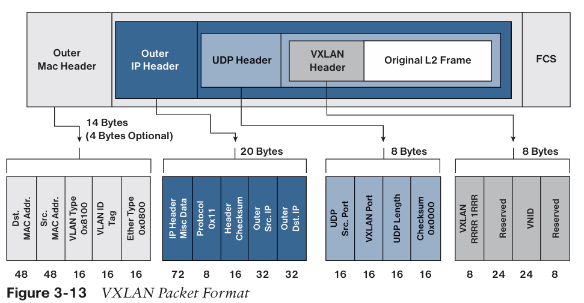
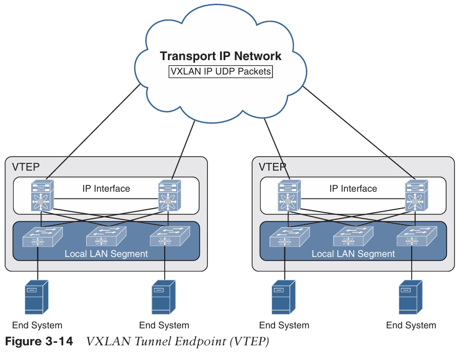
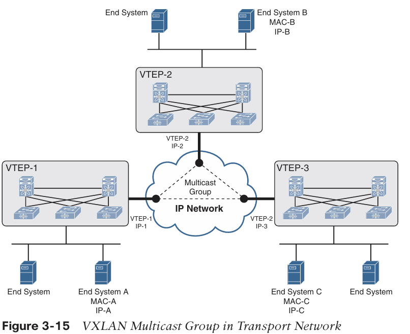
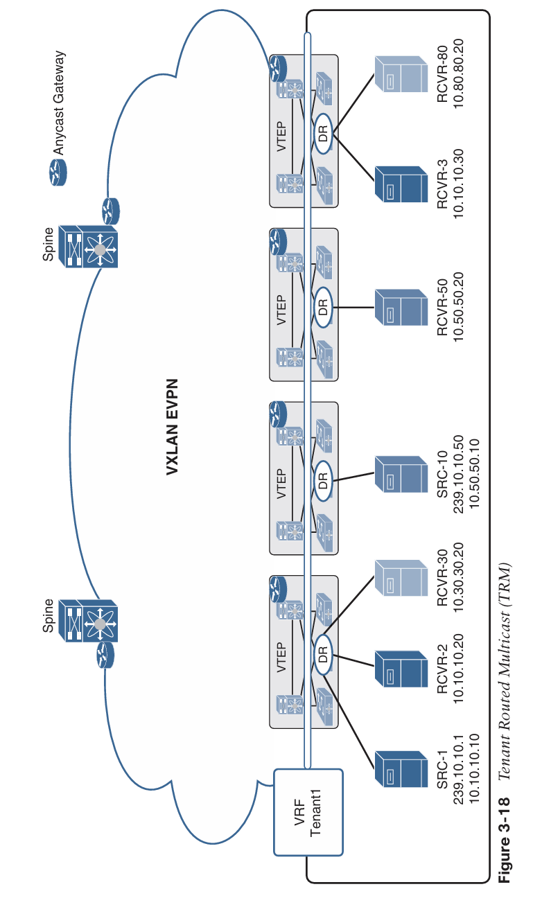

# VXLAN

VXLAN 是對第 2 層 VLAN 的擴展。它的設計目的是在提供相同 VLAN 功能的同時，具備更高的可擴展性和靈活性。VXLAN 提供以下優點：

- **VLAN flexibility in multitenant segments**：它提供了一種解決方案，以便在底層網路基礎設施上擴展第 2 層分段，使租戶工作負載可以分佈在資料中心的不同實體節點上。
- **Higher scalability**：VXLAN 使用一個 24 位元的段識別碼，稱為 VXLAN 網路標識符（VNID），這使得同一管理域中最多可以存在 1600 萬個 VXLAN 段。
- **Improved network utilization**：VXLAN 解決了第 2 層 STP 的限制。VXLAN 封包透過其第 3 層標頭在底層網路中傳輸，並能充分利用第 3 層路由、等成本多徑 (ECMP) 路由以及連結聚合協定，使用所有可用的路徑。

VXLAN 是一種解決方案，用於在共用的物理基礎設施上*支持靈活的大規模多租戶環境*。物理數據中心網絡上的*傳輸協議是 IP 加 UDP*。也定義了一種 MAC-in-UDP 封裝方案，其中原始的第 2 層幀(Frame)會添加 VXLAN 標頭，然後放入 UDP-IP 封包中。透過這種 MAC-in-UDP 封裝，VXLAN 能將第 2 層網路穿越第 3 層網路。VXLAN 封包格式如下圖所示。

## VXLAN Tunnel Endpoint

VXLAN 使用 VXLAN 隧道端點（VTEP, VXLAN Tunnel Endpoint） 來將租戶的終端設備映射到 VXLAN 段，並執行 VXLAN 的封裝與解封裝。
每個 VTEP 具有兩個介面：

一個是位於本地區域網路（LAN）段上的交換機介面，用來支援本地端節點的通訊；

另一個是連接至傳輸 IP 網路的 IP 介面。

基礎設施 VLAN（Infrastructure VLAN） 具有一個唯一的 IP 位址，用來在傳輸 IP 網路中識別 VTEP 裝置。VTEP 使用這個 IP 位址對乙太網路幀進行封裝，並透過其 IP 介面將封裝後的封包傳送至傳輸網路。

此外，VTEP 也會透過 IP 介面探索與自己同屬於相同 VXLAN 段的遠端 VTEP，並學習遠端 MAC 位址與 VTEP 的對應關係（MAC-to-VTEP 映射）。
VTEP 的功能元件與為了在傳輸 IP 網路上建立二層連通性而形成的邏輯拓撲，如下圖所示。

 VXLAN Tunnel Endpoint (VTEP)

VXLAN 段與底層網路拓撲是相互獨立的；相反地，VTEP 之間的底層 IP 網路也與 VXLAN 的覆疊網路（overlay）彼此獨立。底層網路僅根據外層 IP 標頭（outer IP header）來路由封裝後的封包，其中外層 IP 標頭的來源 IP 為起始 VTEP，目的 IP 為目標 VTEP。

## Virtual Network Identifier

虛擬網路識別碼 (VNI) 是一個用於識別資料平面中特定虛擬網路的數值。它通常是 VXLAN 標頭中的一個 24 位元數值，可支援多達 1,600 萬個獨立的網路區段。（有效的 VNI 數值範圍是 4096 到 16,777,215。）VNI 主要有兩個範圍:

### Network-wide scoped VNIs

所有網路邊緣設備會使用相同的值來識別特定的 Layer 3 虛擬網路。這種網路範圍 (network scope) 的作法在某些環境中非常有用，例如在資料中心裡，網路可以由中央編排系統 (central orchestration systems) 進行自動化部署。

為每個 VPN 使用一個統一的 VNI 是一種簡單的方法，同時也簡化了網路維運（例如故障排除）。這也意味著對網路邊緣設備（無論是實體或虛擬設備）的要求也隨之簡化。這種方法的一個關鍵要求是，鑒於其網路範圍的特性，系統必須要有非常大量的網路識別碼可供使用。

### Locally assigned VNIs

根據 RFC 4364 所支援的另一種替代方法中，識別碼對於通告該路由的網路邊緣設備只具有本地意義 (local significance)。在這種情況下，虛擬網路的擴展規模是以每個節點為基礎 (per-node basis) 來衡量的，而非以整個網路為基礎。

當識別碼是在本地範圍內有效，並且使用與 MPLS VPN 標籤相同的現有語意時，就可以採用 RFC 4364 中指定的相同轉發行為。因此，這種範圍劃分的方式允許將一個同時橫跨 IP 覆蓋網路 (overlay) 和 MPLS VPN 的 VPN 無縫地縫合 (seamlessly stitching together) 在一起。

舉例來說，這種情況可能發生在資料中心邊界，即覆蓋網路與 MPLS VPN 對接的地方。在這種情境下，識別碼可以由通告設備動態分配。

### 總結

我們可以將 Network-wide scoped VNIs (全域有效 VNI) 和 Locally assigned VNIs (本地有效 VNI) 的差異做一個清晰的總結。

簡單來說，最大的差異在於「這個號碼在哪裡有意義」以及「主要用來解決什麼問題」。

我們繼續用公司電話分機的例子來比喻，會非常清楚：

- Network-wide VNI (全域有效)：就像全球統一的員工分機號。
  - 分機號 88001 在全球任何一間辦公室撥打，都只會找到同一個人（例如，財務長）。這個號碼的意義是全公司通用的。

- Locally assigned VNI (本地有效)：就像各地辦公室的內部轉接號。
  - 紐約辦公室的總機，為了對接合作夥伴，設定了快速撥號 901 來代表夥伴公司的總機。這個 901 的意義僅限於紐約辦公室的這台總機自己知道，東京辦公室的總機可能把 901 設給了另一間合作夥伴。

這兩種方式並不是互斥的，而是在網路的不同位置各司其職。

1. 在資料中心「內部」：為了簡單和高效，大家統一說一種語言，使用 Network-wide (全域) VNIs。
2. 在資料中心的「邊界」：當需要和「外部世界」（例如，使用 MPLS 技術的電信商網路）溝通時，邊界設備就扮演翻譯官的角色，使用 Locally assigned (本地) VNIs 來做兩種不同語言（VXLAN vs. MPLS）之間的對應與轉譯。

這種組合讓網路兼具了內部的簡單性和外部的靈活性。

## VXLAN Control Plane

VXLAN 常用的兩種控制平面包括：VXLAN 泛洪與學習多播控制平面，以及 VXLAN MPBGP EVPN 控制平面。

### VXLAN Flood and Learn Multicast-Based Control Plane

Cisco Nexus 交換機利用現有的第 2 層泛洪機制和動態 MAC 位址學習來

- 傳輸廣播、未知單播和多播（BUM）流量
- 發現遠端 VTEP
- 學習每個 VXLAN 區段的遠端主機 MAC 位址和 MAC 到 VTEP 的對應關係

IP 群播 (multicast) 被用來縮小參與 VXLAN 區段的主機集合之泛洪 (flooding) 範圍。每一個 VXLAN 區段 (或 VNID) 都會被映射到傳輸 IP 網路中的一個 IP 群播群組。

每台 VTEP 設備都經過獨立設定，並透過網際網路群組管理協定 (IGMP)，像一台 IP 主機一樣加入這個群播群組。IGMP 的加入請求會觸發協定獨立多點傳播 (PIM) 在傳輸網路中針對該特定群播群組的加入信令。

接著，該群組的群播分發樹 (multicast distribution tree) 會根據參與的 VTEP 位置，在傳輸網路中建立起來。下圖展示了一個 VXLAN 區段如何透過底層 IP 網路建立起群播通道。

 VXLAN Multicast Group in Transport Network

下圖所示的群播群組，被用來在 IP 網路中傳輸 VXLAN 的廣播 (Broadcast)、未知單播 (Unknown Unicast) 和群播 (Multicast) 流量，從而將 Layer 2 的泛洪範圍，限定在那些有終端系統參與同一個 VXLAN 區段的設備上。

 VXLAN Multicast Control Plane

例如，如果 End System A 想與 End System B 通訊，它會執行以下操作：

1. 終端系統 A 發出 ARP 請求，試圖尋找終端系統 B 的 MAC 位址。
2. 當 ARP 請求到達 SW1 時，它會查詢本地表格，如果未找到資料，它將通過 VXLAN 封裝 ARP 請求，並將其發送到為特定 VNI 配置的多播群組。
3. 多播 RP 接收封包，並將一份副本轉發給所有已加入該多播群組的 VTEP。
4. 每個 VTEP 接收並解封裝 VXLAN 封包，並學習指向遠端 VTEP 位址的 System A MAC 位址。
5. 每個 VTEP 將 ARP 請求轉發給其本地目的地。
6. End System B 生成 ARP 回應。當 SW2 的 VTEP2 收到它時，會查詢本地表格並發現一條條目，其中包含發往終端系統 A 的流量必須送到 VTEP1 地址的資訊。VTEP2 將 ARP 回應封裝為 VXLAN 標頭，並單播傳送給 VTEP1。
7. VTEP1 接收並解封裝封包，然後將其傳送給 End System A。
8. 當學習到 MAC 位址信息時，額外的封包會傳送到對應的 VTEP 位址。

### VXLAN MPBGP EVPN Control Plane

EVPN 覆蓋網路 (overlay) 對基於 BGP MPLS 的 EVPN 解決方案進行了修改，使其能作為一種採用 VXLAN 封裝的網路虛擬化覆蓋網路，其特點如下：

- BGP MPLS EVPN 中描述的 PE 節點角色，等同於 VTEP/網路虛擬化邊緣 (NVE) 設備。
- VTEP 資訊是透過 BGP 來分發。
- VTEP 對於遠端 MAC 位址採用 BGP 的控制層學習/分發，而非傳統的資料層學習。
- BUM (廣播、未知單播和群播) 資料流量是使用一個共享的群播樹來發送。
- 使用 BGP 路由反射器 (RR) 來簡化 VTEP 之間的 BGP 連線，將全網狀 (full mesh) 連線縮減為 VTEP 與 RR 之間的單一連線。
- 使用路由過濾(Route filtering)和受限制的路由分發(constrained route distribution)，來確保特定覆蓋網路的控制層流量，只會被分發到屬於該覆蓋網路實例的 VTEP。
- 主機 (MAC) 移動性機制確保該覆蓋網路實例中的所有 VTEP，都清楚知道某個 MAC 位址所關聯的具體 VTEP 是哪一台。
- 虛擬網路識別碼 (VNI) 在覆蓋網路內部是全域唯一的。

用於 VXLAN 的 EVPN 覆蓋網路解決方案也可以進行修改，使其能應用於 Layer 3 流量隔離的網路虛擬化覆蓋網路。針對 Layer 3 VXLAN 的修改與 L2 VXLAN 相似，但有以下例外：

- VTEP 透過 BGP 進行控制層學習/分發的是 IP 位址（而非 MAC 位址）。
- 虛擬路由與轉發 (VRF) 實例被映射到 VNI。
- VXLAN 標頭中的內部目標 MAC 位址，不再是終端主機的 MAC，而是負責對 VXLAN 酬載 (payload) 進行路由的接收端 VTEP 的 MAC。這個 MAC 位址會透過 BGP 屬性與 EVPN 路由一同分發。

#### 總結

沒有 EVPN 的 VXLAN (傳統 F&L)

- 就像一個只有貨架編號，但沒有電腦系統的倉庫。當要找一個包裹 (目標 MAC) 時，管理員 (VTEP) 只能拿著大聲公在倉庫裡到處喊 (Flooding)，效率低下且混亂。

有了 EVPN 的 VXLAN

1. 智慧登記 (控制層學習)：
任何包裹 (主機 MAC/IP) 一進倉庫，它的確切位置就立刻被登錄到中央電腦系統 (BGP) 中。管理員再也不需要用喊的。

2. 中央查詢 (Route Reflector)：
管理員 (VTEP) 不需要和其他所有管理員都保持通話，他們只需要查詢中央電腦 (RR) 就可以知道所有資訊。

3. 包裹移位追蹤 (主機移動性)：
如果一個包裹被移到新的貨架，中央系統會立刻更新，所有管理員都能即時得知最新位置。

4. 跨部門派送 (Layer 3 路由)：
當一個「研發部」的包裹要送到「市場部」時，系統不會直接告訴快遞員要送到某個員工的座位，而是告訴他：「請把包裹交給市場部的收發室管理員 (目標 VTEP 的 MAC)」，由該管理員負責內部的最後派送。這就是 L3 模式下，內部目標 MAC 是 VTEP 的原因，流程更清晰，分工更明確。

總之，EVPN 為 VXLAN 帶來了智慧、效率和擴展性，將其從一個單純的「大二層」網路，提升為一個功能完備、可同時處理 L2 和 L3 流量的現代化資料中心網路架構。

## VXLAN Gateways

VXLAN 閘道被用來連接 VXLAN 和傳統 VLAN 區段，以建立一個共通的轉發域，讓租戶的設備可以同時存在於這兩種環境中。VXLAN 閘道的類型如下：

### Layer 2 閘道

一種能將傳統乙太網路 (CE) 訊框封裝成 VXLAN 訊框，以及將 VXLAN 訊框解封裝回 CE 訊框的設備。閘道設備能以透明的方式，將 VXLAN 的好處提供給不支援 VXLAN 的設備（無論是實體主機或虛擬機）。這些實體主機或虛擬機完全感知不到 VXLAN 封裝的存在。

### VXLAN Layer 3 閘道

與傳統在不同 VLAN 之間進行路由相似，當設備位於不同的 VXLAN 區段時，就需要一台 VXLAN 路由器來進行通訊。VXLAN 路由器會將訊框從一個 VNI 轉譯到另一個 VNI。根據來源和目的地的不同，這個過程可能需要對訊框進行解封裝和重新封裝。Cisco Nexus 設備支援解封裝、路由和封裝的所有組合，路由也可以在原生的 Layer 3 介面和 VXLAN 區段之間進行。

可以在匯聚層 (aggregation layer) 或 Cisco Nexus 設備的匯聚節點上啟用 VXLAN 路由。Spine (骨幹層) 只轉發基於 IP 的流量，並會忽略被封裝的封包。為了擴展性，通常會由少數幾個 Leaf 節點 (一對邊界葉節點, border leaves) 來執行 VNI 之間的路由。

一組 VNI 可以被群組到一個虛擬路由與轉發 (VRF) 實例（租戶 VRF）中，以啟用這些 VNI 之間的路由。如果必須在大量 VNI 之間啟用路由，您可能需要將這些 VNI 分散給多台 VXLAN 路由器處理，每台路由器負責一組 VNI 及其對應的子網路。備援則是透過 FHRP (第一跳備援協定) 來實現。

## VXLAN High Availability

為了高可用性，可以使用一對虛擬埠通道（vPC）交換機作為共享任播 VTEP 位址的邏輯 VTEP 裝置，如下圖所示。

 VXLAN High Availability

vPC 交換機提供 vPC 以實現冗餘的主機連接，同時單獨運行與底層網路上行設備之間的第 3 層協議。兩者都將加入相同 VXLAN VNI 的多播群組，並使用相同的任播 VTEP 位址作為來源，將 VXLAN 封裝的封包傳送到底層網路中的設備，包括多播會合點和遠端 VTEP 裝置。這兩個 vPC VTEP 交換機看起來像是一個邏輯 VTEP 實體。

vPC 對等設備必須具備以下相同的配置：

- VLAN 與虛擬網路區段（VN-segment）的對應映射一致
- NVE 綁定到相同的 loopback 第二個可用 IP 位址（anycast VTEP address）一致
- VNI 與群組的對應映射一致。

對於 anycast IP 位址，vPC VTEP 交換機必須在綁定到 VXLAN NVE 隧道的 loopback 介面上使用次要 IP 位址。這兩個 vPC 交換機需要擁有完全相同的次要 loopback IP 位址。

兩個設備都會在底層網路上宣告這個 anycast VTEP 位址，以便上游設備從兩個 vPC VTEP 學習 /32 路由，並能在它們之間進行 VXLAN 單播封裝流量的負載共享。

在 vPC 對等連結失效的情況下，vPC 運作中的次要交換機會關閉其綁定到 VXLAN NVE 的 loopback 介面。這個關閉動作會導致次要 vPC 交換機從其 IGP 廣告中撤回 anycast VTEP 地址，使得下層網路中的上游設備開始將所有流量僅發送到主要 vPC 交換機。這個過程的目的是在對等連結中斷時避免 vPC 的主動-主動(active-active)情況。透過此機制，當 vPC 對等連結失效時，連接到次要 vPC 交換機的孤立設備將無法接收 VXLAN 流量。

## VXLAN Tenant Routed Multicast

租戶路由多播（TRM）將多播傳送的效率引入 VXLAN 覆蓋網路。它基於標準化的下一代控制平面（ngMVPN），如 IETF RFC 6513 和 6514 所描述。TRM 能夠在多租戶網路中有效且具彈性的傳送客戶的第 3 層多播流量。

儘管 BGP EVPN 為單播路由 (unicast routing) 提供了控制層，如下圖所示，但 ngMVPN 則提供了可擴展的群播路由 (multicast routing) 功能。

 Tenant Routed Multicast (TRM)

ngMVPN 遵循一種「永遠路由 (always route)」的策略，在該策略下，每一台具備分散式 IP Anycast 閘道 (用於單播) 的邊緣設備 (VTEP)，都會成為群播的指定路由器 (DR)。

橋接式群播轉發 (Bridged multicast forwarding) 只存在於邊緣設備 (VTEP) 上，在 VTEP 上，IGMP 窺探 (IGMP snooping) 會將群播轉發優化，只傳送給感興趣的接收者。所有超出本地交付範圍的群播流量，都會被有效地路由。

在啟用 TRM (租戶路由式群播) 後，系統會利用底層網路 (underlay) 的群播轉發能力，來複製經過 VXLAN 封裝的路由式群播 (routed multicast) 流量。

系統會為每個 VRF 建立一個預設群播分發樹 (Default-MDT)。這是對現有 Layer 2 VNI 廣播、未知單播及 Layer 2 群播複製群組的額外補充。覆蓋網路 (overlay) 中的各個群播群組位址，會被映射到各自對應的底層網路群播位址，以進行複製與傳輸。採用 BGP 方法的優勢在於，TRM 可以作為一個完全分散式的覆蓋網路匯集點 (RP) 來運作，RP 的功能存在於每一台邊緣設備 (VTEP) 之上。

一個支援群播的資料中心 fabric 通常只是一個整體群播網路的一部分。群播的來源、接收者，甚至是群播匯集點 (RP) 可能位於資料中心內部，但也可能位於園區網路或透過 WAN 從外部連線。

TRM 允許與現有的群播網路進行無縫整合，它可以利用位於 fabric 外部的匯集點。此外，TRM 還允許使用 Layer 3 實體介面或子介面，來進行具備租戶感知能力的外部連線。