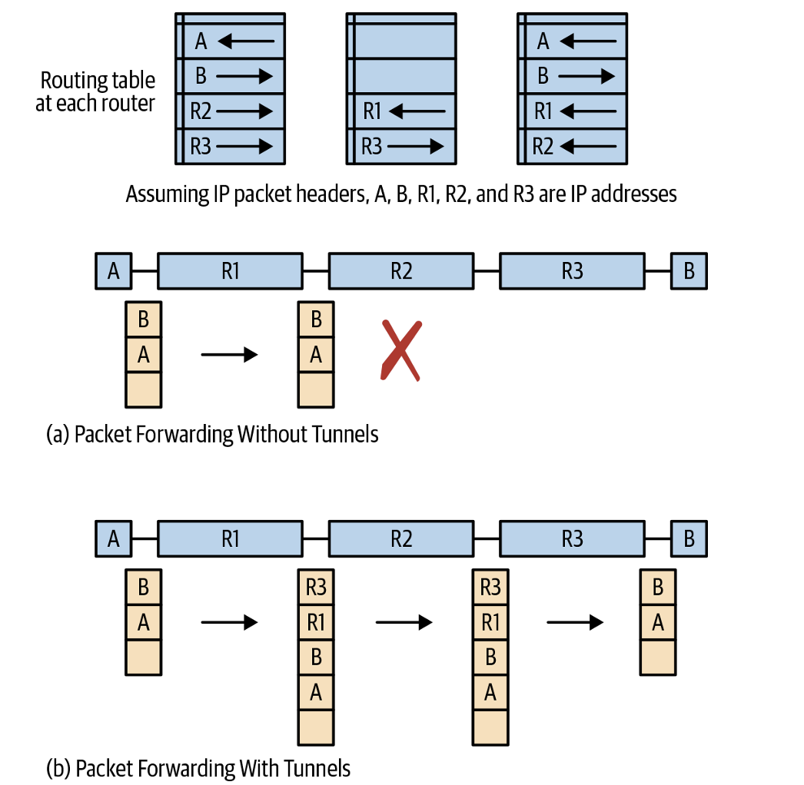
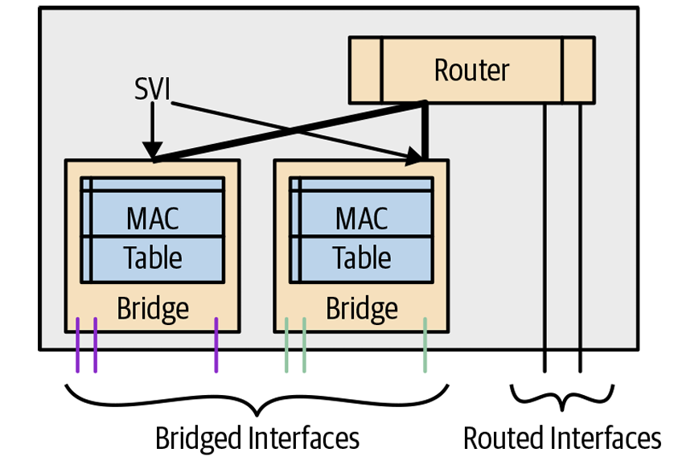
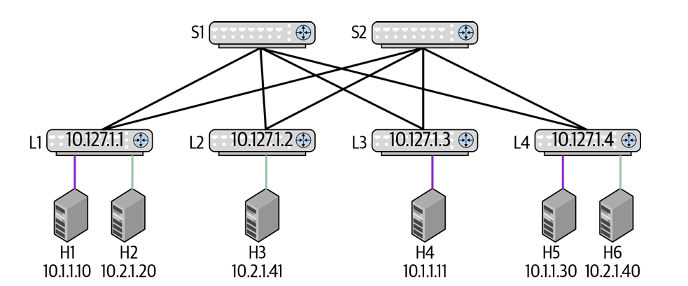
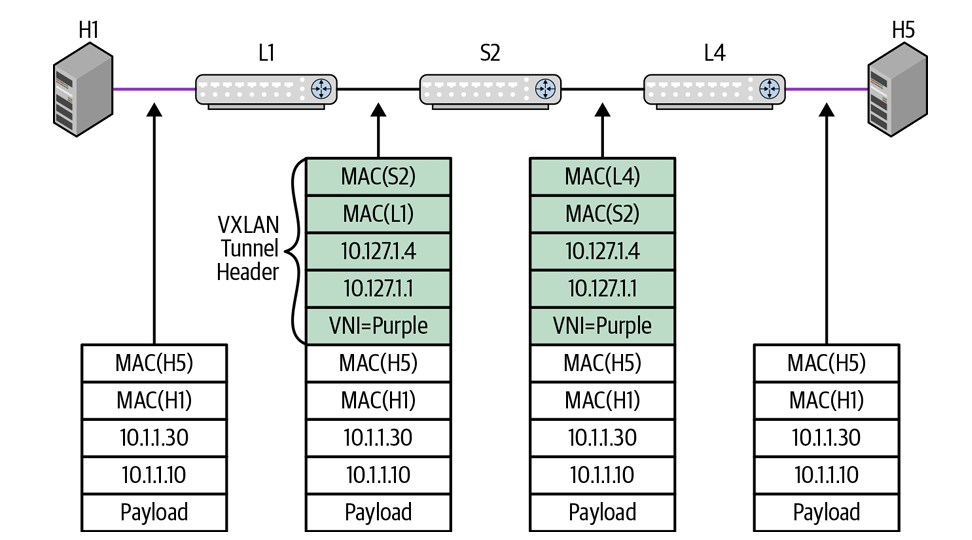
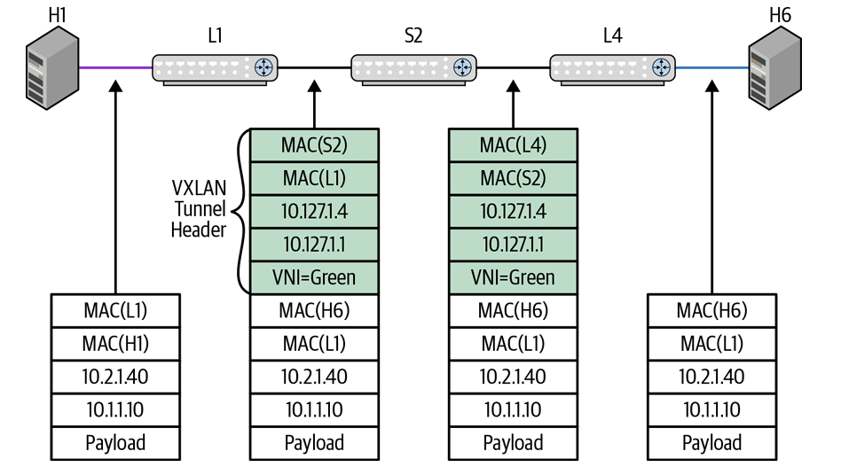
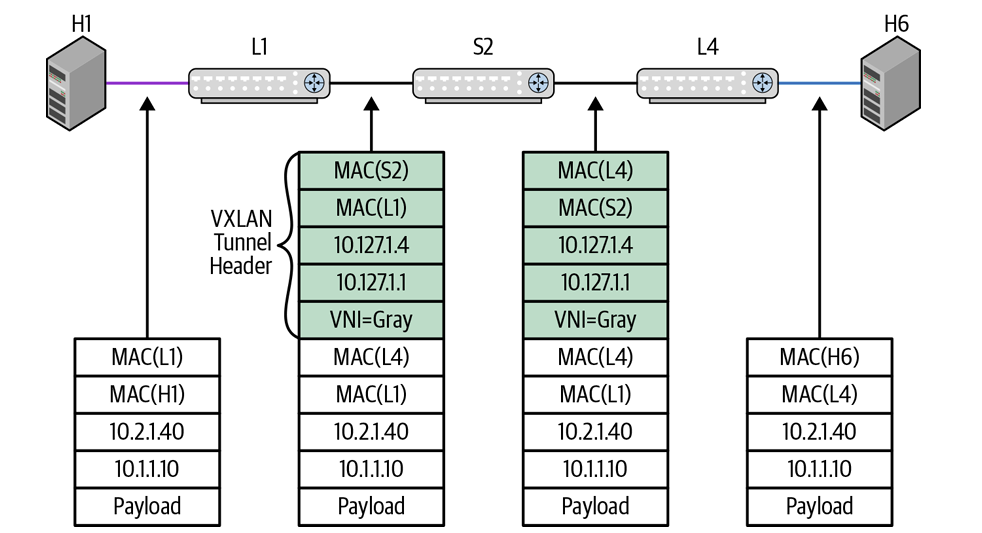
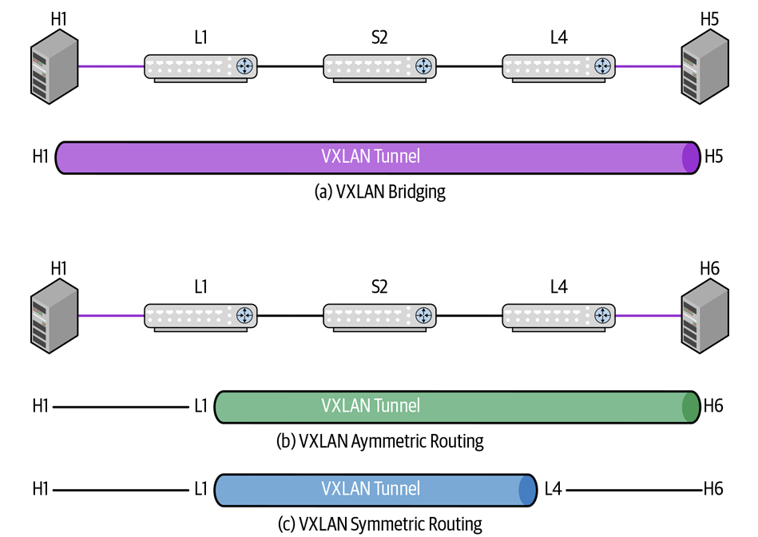

# Network Virtualization
## What Is Network Virtualization?
* **定義與伺服器虛擬化對比**：
    * 如同伺服器虛擬化（Hypervisor）將 CPU、記憶體與 I/O 抽象化為多個隔離的虛擬機器 (VM)，**網路虛擬化允許將單一實體網路基礎設施切分為多個邏輯上完全隔離的虛擬網路 (Virtual Networks)**。
    * 每個虛擬網路皆「誤以為」自己獨佔了整個網路資源與獨立的位址空間。
* **虛擬網路擁有的獨立資源**：
    1. **介面或鏈路 (Interfaces/Links)**：實體介面被動態切分為邏輯介面。
    2. **轉發表 (Forwarding Tables)**：如 MAC 表與 IP 路由表在邏輯上進行分割。
    3. **策略與控制表 (Policy Tables)**：如存取控制串列 (ACL) 與 NAT 轉換表。
    4. **封包緩衝區與佇列 (Buffers &amp; Link Queues)**：實體交換晶片上的 Buffer 資源進行動態共享分配。
* **動態分割與標籤 (VNID)**：
    * 為了在共享鏈路上區分不同虛擬網路，封包標頭必須攜帶**虛擬網路識別碼 (Virtual Network Identifier, VNID)**。
    * 不同技術對 VNID 的稱呼不同（如 VLAN ID、VRF Name、VPN ID、VXLAN VNI），實務上缺乏統一的端到端標示符

## Uses of Network Virtualization in the Data Center

1. * **強迫流量經過特定服務 (Forcing Traffic Through Certain Services)**：
    * 例如將對外服務的 Web 伺服器與內部資料庫分屬不同的虛擬網路，強制所有跨區流量必須穿過防火牆 (Firewall) 進行安全檢查。
    ```text
    ( .~-.-~. )                                  ( .~-.-~. )
     (  External  )                               (  External  )
     (  Network   )                               (  Network   )
       ( ' - ' )                                    ( ' - ' )
           |                                            |
           |                                            |
        +-----+                                      +-----+
        |  X  | Edge Router                          |  X  | Edge Router
        +--+--+                                      +--+--+
          / \                                           |
         /   \                                          |
        /     \                                      +======+
       /     +======+                                | [][#]|
      |      | [][#]| Firewall                       | [#][]| Firewall
      |      | [#][]|                                +======+
      |      +======+                                   |
      |                                                 |
      |                                              +-----+
      |                                              |  X  | Edge Router
      |                                              +--+--+
      |                                                 |
      |                                                 |
       \                                                |
       ( .~-.-~. )                                  ( .~-.-~. )
     (  Internal  )                               (  Internal  )
     (  Network   )                               (  Network   )
       ( ' - ' )                                    ( ' - ' )

    (a) Physical View of Firewall                (b) Logical View of Firewall
    Connecting to Edge Routers                   Connecting to Edge Routers

    ```
    (a)展示傳統實體防火牆連線；(b)展示在單一實體邊界路由器上切分為外網虛擬網路與內網虛擬網路，路由器內部路由表一分為二，使內外網無法直接互通，唯一的交會點即為防火牆。利用虛擬網路可實現極為彈性且符合合規性 (Compliance) 審查的服務鏈（Service Chaining）引導。
    
2. * **支援需要 Layer 2 相鄰性的應用程式 (Applications That Require L2 Adjacency)**：
    * 許多企業級應用（如 VMware vMotion 虛擬機動態遷移、集群節點心跳與 L2 多播/廣播發現機制）依賴同一個 L2 網段。
    * 由於現代 Clos 拓撲本質上是純 L3 路由網路，必須透過網路虛擬化 Overlay 在 L3 上構建 L2 延伸。
3. * **雲端多租戶隔離 (Cloud & Multitenancy)**：
    * 公有雲與私有雲服務商利用虛擬網路，在共享的實體運算與網路設備上提供完全隔離的租戶環境。
4. * **隔離交換器管理流量與資料流量 (Separating Switch Management Network from Data Traffic)**：
    * 交換器具備獨立的帶外 (Out-of-Band, OOB) 網口，專用於 SSH、SNMP、Image 下載與自動化配置。
    * **管理 VRF (Management VRF)**：資料流量與管理流量需要不同的預設閘道 (Default Route)，透過 Management VRF 將管理平面與業務資料平面徹底隔離，這是最普及的虛擬化應用。

## 網路虛擬化模型分類 (Network Virtualization Models)

1. 服務抽象層級 (Service Abstraction - L2 vs. L3)
    * **L2 虛擬網路**：提供 MAC 轉發抽象，不干涉上層 IP 位址（如 VLAN、VXLAN）。傳統 VLAN 透過 STP 構建單一樹狀轉發；而現代 EVPN/VXLAN 則打破此限制，允許單播與多目的地流量走不同的最優路徑。
    * **L3 虛擬網路**：提供獨立的 IP 路由表抽象（如 L3VPN、VRF）。最核心的技術為 **VRF (Virtual Routing and Forwarding)**，透過在路由表檢索時附加 VRFID 來維護多套獨立的路由表。
2. 實現架構 (Inline vs. Overlay)
    * **帶內模型 (Inline Model)**：傳輸路徑上的**每一個中間節點 (Every Hop)** 都必須感知虛擬網路的存在並維護其狀態（如傳統 VLAN、VRF）。
        * *缺點*：擴展性極差（核心設備記憶體爆表）、配置異動易引發全網動盪與網路切割。
    * **重疊網路模型 (Overlay Model)**：**僅有網路邊緣 (Edges / NVE) 需要維護虛擬網路狀態**，網路核心 (Core / Underlay) 僅作純粹的 IP 封包轉發。
        * *優點*：具備極致的擴展性與不變基礎設施 (Immutable Infrastructure) 特性，是現代資料中心的首選。

## 重疊網路的技術基石：網路隧道 (Network Tunnels: The Fundamental Overlay Construct)
* 隧道的運算機制與定義
    * 網路隧道透過在原始封包標頭外**再封裝一層全新的隧道標頭 (Tunnel Header)**，藉此隱藏原始標頭
    * **NVE (Network Virtualization Edge)**：隧道的起點稱為 Ingress NVE（打上隧道標頭），終點稱為 Egress NVE（解封裝剝除標頭）。連接 NVE 之間的實體網路稱為 **Underlay**。

    

    上圖 (a) 展示原始封包從 A 發往 B，中間路由器 R2 因路由表無 A/B 位址而丟棄封包；(b) 展示 R1 (Ingress NVE) 打上外層標頭 (Source: R1, Dest: R3)，R2 僅依據外層標頭將封包路由給 R3，R3 (Egress NVE) 解封裝後精確交付給 B。視覺化證明了隧道技術如何讓 Underlay 核心網路（R2）對 Overlay 私有位址完全無感，實現極佳的解耦。
* 網路隧道的四大技術缺點與工程對策
    1. **負載平衡失效 (Load Balancing / ECMP Issue)**：中間路由器僅能看到外層固定標頭，導致不同 Flow 聚集於同一條路徑
        *對策*：**採用 UDP 隧道（如 VXLAN）**，Ingress NVE 將內層 5-Tuple 進行 Hash 運算後寫入**外層 UDP Source Port**，讓傳統 ECMP 路由器能依據 UDP 埠號實現均勻分流
    2. **主機網卡卸載失效 (NIC Offload/Segmentation Issue)**：傳統網卡無法穿透隧道標頭進行 TCP 分段 (TSO) 與 Checksum 卸載，導致 CPU 負擔暴增
        * *對策*：將 VTEP 隧道起點自 Host 主機下沉至實體 Leaf 交換器（促進了 EVPN 的崛起）
    3. **有效載荷減少 (MTU Reduction)**：隧道標頭會佔用位元組，需全網啟用 **Jumbo Frames (如 MTU 9000/9164)** 以防 IP 分段
    4. **缺乏可觀測性 (Lack of Visibility)**：傳統 `traceroute` 無法穿透隧道，將整條隧道呈現為單一 Hop

## 資料中心虛擬化解決方案與實務數量限制 (Solutions & Practical Limits)
* 主流技術方案
    * **VLAN**：帶內 L2 虛擬化，限制於單一 Hop 邊緣
    * **VRF**：帶內 L3 虛擬化，每一跳皆需配置
    * **VXLAN (Virtual eXtensible Local Area Network)**：無狀態 L2 over L3 UDP 隧道，端點稱為 **VTEP (VXLAN Tunnel Endpoint)**
* **虛擬網路數量的實務瓶頸與極限因素**：
    1. **標頭 ID 長度限制**：VLAN 標頭僅 12-bit (上限 4,096)；MPLS 為 20-bit (100萬)；VXLAN / GRE 為 24-bit (1,600 萬)。
    2. **硬體 ASIC 晶片限制（最大瓶頸）**：儘管 VXLAN 標頭支援 1,600 萬，但商業交換晶片 (Merchant Silicon) 單台設備的轉發表與 ACL 空間限制，實務上僅支援 **16K 至 64K 個 VNI**。
    3. **實務部署規模範圍**：VRF 部署通常為 2~64 個（偶爾達 128）；VLAN 為 4,000 個；企業網 EVPN/VXLAN 通常部署在 **4,000 個 VNI 以內**。

## 網路虛擬化的控制平面協定 (Control Protocols for Network Virtualization)
* **集中式控制模型 (Centralized Control Model)**：
    * 將虛擬網路視為運行於實體網之上的應用程式，由中央控制器（如 VMware NSX、OVSDB / RFC 7047）統一計算並將內外層位址映射表寫入各端點的 OVS (Open Virtual Switch)。
    * **實務痛點**：在大規模部署時，中央資料庫同步與控制器維護複雜度極高。
* **分散式協定模型 (Protocol-Based / Controller-less Model)**：
    * **BGP EVPN (Ethernet VPN)**：利用網路設備自身運行的 BGP 路由協定來動態分發 MAC 位址與 VTEP 映射資訊。目前已成為業界最主流、獲最廣泛採納的「Controller-less」虛擬化控制平面。
## VXLAN 橋接與路由轉發流程深度剖析 (Illustrating VXLAN Bridging and Routing)

1. 基礎概念與轉發邏輯
    

    上圖展示交換器內部的 **Bridged Interface (L2 埠)**、綁定於 Bridge 上的 **SVI (Switched VLAN Interface - L3 邏輯閘道介面)**，以及 **Routed Interface (純 L3 埠)** 的分層關係。若入站封包的目的 MAC 為本地路由器 MAC，封包會觸發 L3 路由（交付給 SVI 或 Routed Interface）；否則僅進行 L2 橋接查表。

    現代資料中心交換晶片（Packet-Switching Silicon）同時兼具 L2 交換與 L3 路由能力。上圖視覺化呈現了封包進入交換器後，系統如何根據**介面屬性**與**目的 MAC 位址 (Destination MAC, DMAC)** 決定封包要走「純 L2 橋接」還是「升格至 L3 路由」。

    進站時，當封包由 L2 橋接介面（例如連接伺服器的 Access 或 Trunk 埠）進入時，交換器首先進行 MAC 位址比對。
    觸發 SVI，若封包的目的 MAC 位址**等於本地路由器的 MAC 位址**（例如客戶端發往預設閘道的封包），該封包不會在 L2 被直接轉發，而是被標記並交付給該 Bridge/VLAN 內部的邏輯三層介面——**SVI (Switched VLAN Interface)**。封包通過 SVI 進入 L3 路由引擎後，會進行 IP 路由表 (FIB) 查表、改寫 MAC 標頭與遞減 TTL，實現跨網段路由。

    純 L2 橋接，若目的 MAC 位址**不屬於本地路由器**（同網段主機間通訊），封包則保持在 L2 層，直接查詢 [VNI/VLAN, MAC] 轉發表進行二層轉發；若出口是 VXLAN 隧道，則打上 VXLAN 標頭送出。

    **RIOT (Routing In and Out of Tunnels)**：指封包能在「路由後進行隧道封裝」，或在「隧道解封裝後進行路由」的硬體雙向處理解耦能力

2. 拓撲情境與 VXLAN L2 橋接流程

    

    包含 Spine (S1, S2) 與 Leaf/VTEP (L1\~L4)。紫色 VNI (10.1.0.0/24) 連接主機 H1 (`10.1.1.10`) 與 H5 (`10.1.1.30`)；綠色 VNI (10.2.0.0/24) 連接 H6 (`10.2.1.40`)

    * VXLAN L2 橋接 (H1 傳送至 H5 - 同網段)
        1. H1 發送 ARP 廣播，L1 收到後查詢 MAC 表，比對紫色 VNI，發現目的 VTEP 為 L4 (`10.127.1.4`)
        2. L1 打上外層 VXLAN 標頭 (Source VTEP: L1, Dest VTEP: L4, VNI: 紫色)
        3. Underlay 核心 (S2) 僅依據外層 Dest IP (`10.127.1.4`) 進行常規 IP 路由將封包送達 L4
        4. L4 發現外層 Dest IP 為自身 VTEP，剝除 VXLAN 標頭，依據內層紫 VNI 與 MAC 將原始封包交付給 H5
        5. 下圖展示封包傳輸全程中，**內層原始 H1/H5 標頭完全未被修改**，僅在 L1~L4 之間疊加了外層 Ethernet / Outer IP / UDP / VXLAN 標頭。

        
    * **多目的地流量 (BUM) 處理機制**：
        * **頭端複製 (Head-End Replication / Ingress Replication - 主流)**：Ingress VTEP 將廣播/多播封包複製為多份單播封包，分別送給所有感興趣的 Egress VTEPs。架構簡單，無須 Underlay 執行多播協定
        * **Underlay 路由多播 (Routed Multicast)**：Underlay 運行 PIM-SM/SSM 建立多播樹。極度複雜且維運困難，絕大多數資料中心皆停用此模式。

3. VXLAN L3 路由與 RIOT 轉發流程 (H1 傳送至 H6 - 跨網段)

    * **閘道部署**：採用**分散式路由模型 (Distributed Gateway)**，每一台 Leaf/VTEP 皆作為其承載網段的預設閘道 (Anycast Gateway)。
    * **非對稱路由 (Asymmetric Routing)**：
        * **流程**：Ingress VTEP (L1) 在本地端即完成 L3 路由，直接將封包改寫並轉換為**目的地所在的綠色 VNI**，封裝後發送給 L4；L4 解封裝後僅需執行 L2 橋接即可交付給 H6。
        * 下圖 Ingress VTEP (L1) 即完成原始 MAC 改寫，外層 VXLAN 標頭直接攜帶目標綠色 VNI。
        
        * **缺點**：每一台 VTEP 都必須載入全網所有的 VLAN/VNI 資訊，記憶體浪費嚴重。
    * **對稱路由 (Symmetric Routing - 業界黃金標準)**：
        * **流程**：Ingress VTEP (L1) 將封包路由至一個專用的**中轉 L3 VNI (Transit VNI / Tenant VRF)**，外層 MAC 指向 L4 的 Router MAC；L4 解封裝後，在本地進行第二次 L3 路由，將封包路由至綠色 VNI 並交付 H6。
        * 下圖 L1 封裝時使用 L3 Transit VNI，內層 MAC 設為 L4 的 Router MAC；L4 解封裝後再次查表路由。
        
        * **優點**：VTEP 僅需維護本地存在的 VNI，擴展性極佳。
    * **圖內容與 Traceroute 視角解析**：
        
        * **畫面呈現**：**(a) L2 橋接**，`traceroute` 顯示 H1 與 H5 直連（1 Hop）；**(b) 非對稱路由**時呈現 3 Hops (`H1 -> L1 -> H6`)；**(c) 對稱路由**時呈現 4 Hops (`H1 -> L1 -> L4 -> H6`)。
        * 真實揭示了隧道遮蔽 Underlay 物理節點後，在上層應用與除錯工具視角下的邏輯路徑變化。
