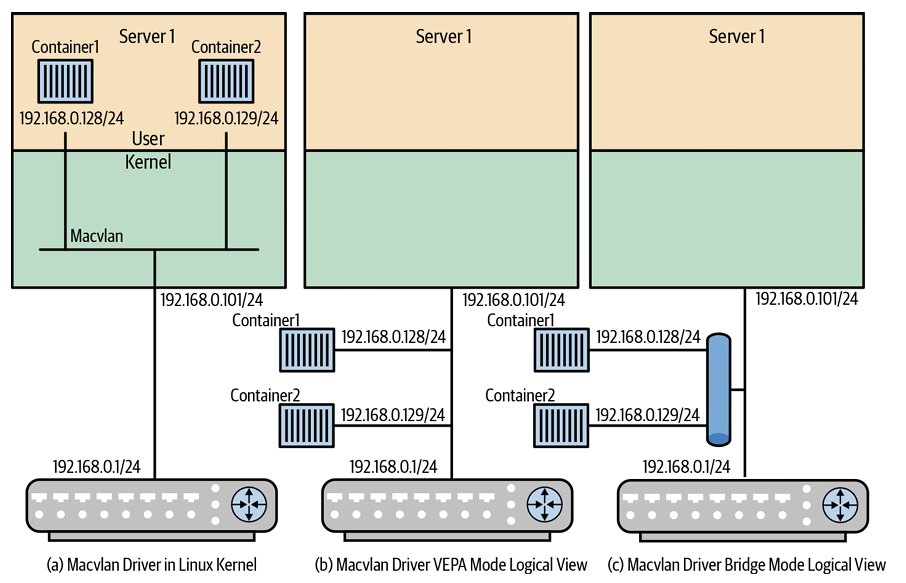
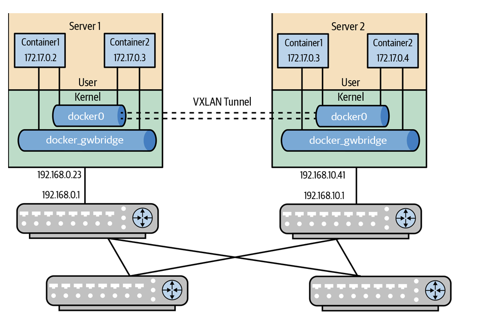
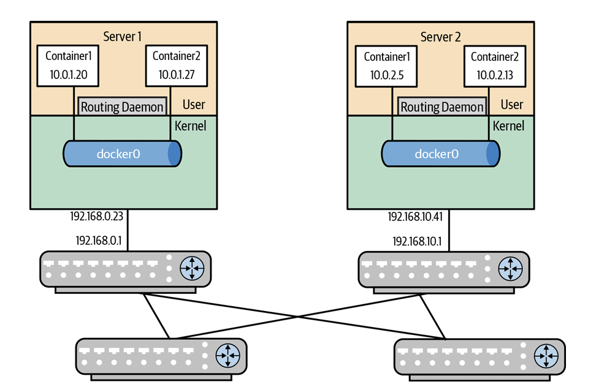

# Container Networking
## 容器技術簡介 (Introduction to Containers)
* **雙重定義模型 (Packaging vs. Execution Model)**：
  * **包裝模型 (Packaging Model)**：將應用程式程式碼、相依套件、組態檔與資料打包，使應用能跨越不同環境無縫執行。
  * **執行模型 (Execution Model)**：作為輕量化的資源隔離單元，限制 CPU、記憶體等消耗，允許在共享同個 Host OS 的伺服器上高效執行多個處理序。
* **核心底層機制**：
  * **Cgroups (Control Groups)**：Linux Kernel 的資源限制機制，用以控制處理序集合的資源耗用上限。
  * **Namespaces (命名空間)**：Linux Kernel 的資源隔離機制，提供容器獨立的系統資源視角。
* **容器網路需要回答的三大核心問題**：
  1. 容器介面如何取得 IP 位址？
  2. 容器如何與外部實體世界通訊？
  3. 容器如何與其他容器（同主機或跨主機）通訊？

## 命名空間與網路隔離 (Namespaces &amp; Network Namespaces)
**Linux Kernel 的 7 大資源虛擬化命名空間**：
    * **Cgroup**：虛擬化 `/proc/pid/cgroup` 視角，隱藏容器化狀態。
    * **IPC (Interprocess Communication)**：隔離 POSIX 訊息佇列、共享記憶體與訊號量，防止跨容器干擾。
    * **Network (netns)**：虛擬化完整網路堆疊，包含介面、Socket、路由表與 MAC 表。
    * **Mount**：虛擬化檔案系統掛載點。
    * **PID (Process ID)**：虛擬化處理序 ID 空間，每個容器擁有獨立的 PID 1 (`init`)。
    * **User**：虛擬化使用者與群組 ID，容器內部的 root 在外部僅為普通權限。
    * **UTS**：虛擬化 Hostname 與 Domain Name。
* **Network Namespaces (netns) vs. VRF (Virtual Routing and Forwarding)**
    * **netns 的強隔離特性**：包含從 L1 到 L4 的完整網路堆疊，創建時核心會自動生成 `lo` (Loopback) 介面。
    * **為何管理 VRF 需要獨立的 Kernel VRF 抽象而非 netns？**：netns 隔離過於嚴格。網管人員若在帶外管理 (Management netns) 透過 SSH 登入，想執行 `ping` 或 `traceroute` 檢測業務網路，必須手動執行 `ip netns exec` 切換，極易出錯且維運負擔重。
    * **Kernel VRF 的設計勝出**：Linux 4.14 導入原生 VRF 抽象，採用 Master Virtual Interface 架構。網管可用標準 `-I` 或 `-i` 參數直接綁定 VRF 介面，並能優雅支援跨 VRF 路由滲透 (Route Leaking)，無需透過虛擬乙太網扭曲轉發。

## 虛擬乙太網路介面 (Virtual Ethernet Interfaces - veth)

* **veth** **管道機制**：
    * `veth` 介面必定成對 (Pair) 創建（例如 `veth0@veth1`），其行為類似虛擬線纜：從一端寫入的封包會自動從另一端流出。
    * 將 `veth` 的一端推入容器內部的 `netns`（重命名為 `eth0`），另一端保留在 Host 的預設 `netns`，即可搭建容器通向外部的管道。

```
+-------------------+                      +-------------------+
|        NS1        |                      |        NS2        |
|                   |                      |                   |
|       veth0       |----------------------|       veth1       |
|                   |                      |                   |
+-------------------+                      +-------------------+

```

上圖有兩個獨立的網路命名空間（NS1 與 NS2），中間透過一對實體化的 `veth` 介面（端點為 `veth0` 與 `veth1`）進行點對點直連。視覺化展示了 `veth` 如何作為跨網路命名空間的傳輸管道，突破 `netns` 邊界實現二層資料流交換。

## 容器網路的四大運作模式 (Container Networking Operating Modes)

1. **No Network Mode (無網路模式)**：完全關閉網路，僅保留 `lo` 介面。
2. **Host Network Mode (主機網路模式)**：容器與 Host 共享同個 `netns`。無網路開銷、效能與 Host 原生相同；在 privileged 模式下可直接操作 Host 路由表（常用於 FRR 或 Mesos 容器化路由服務）。缺點是連接埠易發生衝突。
3. **Single-Host Network Mode (單主機網路模式)**：提供同一 Host 內容器間及對外通訊。
4. **Multihost Network Mode (多主機網路模式)**：支援跨不同實體主機之容器間互相通訊。

## 單主機容器網路 (Single-Host Container Networking)

1. Bridge 模式 (預設模型)
    * Docker 預設創建 `docker0` Linux Bridge，配發 `172.17.0.0/16` 網段，`172.17.0.1` 作為網關
    * 每個容器配發一對 `veth`，一端連容器 `eth0`，一端連 `docker0`

    ```
    +-------------------+             +-------------------+
    |    Container1     |             |    Container2     |
    |                   |             |                   |
    +---------+---------+             +---------+---------+
            | veth0                           | veth0
            |                                 |
            |                                 |
            | veth1                           | veth1
        .-----+---------------------------------+-----.
    (                    docker0                    )
        '---------------------------------------------'
    ```
    展現單一 Host 內部，Container 1 與 Container 2 分別透過各自的 `veth` pair 相連至中央的 `docker0` Linux Bridge。說明預設單主機網路由 `docker0` 作為二層交換樞紐，實現同一主機內容器間的二層橋接轉發。


    ```text
    +-------------------------------------------------------------+
    | Server 1                                                    |
    |  [User Space]                                               |
    |    +-------------------+      +-------------------+         |
    |    |    Container1     |      |    Container2     |         |
    |    |    172.17.0.2     |      |    172.17.0.3     |         |
    |    +---------+---------+      +---------+---------+         |
    |              | 1                        |                   |
    |  ............|..........................|.................. |
    |  [Kernel]    v                          |                   |
    |        .-----+--------------------------+-----.             |
    |       (                    docker0            )             |
    |        '---------------------+----------------'             |
    |                              | 2                            |
    |                              v                              |
    |                         +---------+                         |
    |                         |   NAT   |                         |
    |                         +----+----+                         |
    |                              |                              |
    +------------------------------|------------------------------+
                            192.168.0.23                         
                                | 3                            
                                v                              
                            192.168.0.1                         
                        +-------------------+                    
                        |   Switch/Router   |                    
                        +---------+---------+                    
                    192.168.1.1 |                              
                                | 4                            
                                v                              
                            192.168.1.2                         
                        +-----------------+                     
                        | External Server |                     
                        +-----------------+                     
    ```

    展示 Container 1 (`172.17.0.5`) 通訊至外部 Web 伺服器 (`192.168.1.2`) 的四大封包步驟：(1) 封包發往預設閘道 `docker0` (`172.17.0.1`)；(2) Linux 核心查表確定路由出站介面 (`192.168.0.1`)；(3) iptables `MASQUERADE` 模組執行 SNAT，改寫來源 IP 為 Host IP (`192.168.0.23`)；(4) 實體路由器轉發至 Web 伺服器。揭示了預設容器對外通訊依賴 SNAT 改寫來源位址，使多個容器能共享單一 Host 實體 IP 對外通訊。

2. Macvlan 模式
    * 繞過 Linux Bridge，直接將 L2 虛擬介面附著於實體網卡，Kernel 為每個 Macvlan 介面分配唯一 MAC 位址
    * 容器直接取得外部實體網段 IP，消除 SNAT/NAT 開銷。需要透過 `--ip-range` 防止與上游 DHCP 衝突

    

    展示 Macvlan 介面在 Linux 核心中的三種視角：(a) 容器直接掛載於實體介面；(b) **VEPA 模式**：同主機容器間或容器與 Host 間無法直接二層轉發，封包必須向上送往外部實體路由器再折返 (Hairpinning)；(c) **Bridge 模式 (Docker 預設)**：同 Macvlan 的容器可在核心內直接轉發，但與 Host 本身通訊仍需折返。說明 Macvlan 透過消除 Bridge 查表提升效能，但其 VEPA 模式改變了傳統二層轉發行為。

    ```text
    +-----------------------------+          +-----------------------------+
    |    TX: Veth in Container    |          |   TX: Macvlan in Container  |
    +--------------+--------------+          +--------------+--------------+
                |                                        |
                v                                        v
    +-----------------------------+          +-----------------------------+
    |  TX: Veth in Host Namespace |          |    Tx: Physical Interface   |
    +--------------+--------------+          +--------------+--------------+
                |                                        |
                v                                        v
    +-----------------------------+
    |          RX: Bridge         |
    +--------------+--------------+
                |
                v
    +-----------------------------+
    |    Tx: Physical Interface   |
    +--------------+--------------+
                |
                v

    (a) Packet Flow through veth and         (b) Packet Flow through Macvlan
        bridge in Linux kernel                   (VEPA) in Linux kernel

    ```

    對比 Bridge 模式與 Macvlan VEPA 模式的處理鏈路。Bridge 需經歷 `veth` 管道、Bridge 查表、iptables NAT 與實體網卡等多重 CPU 處理；Macvlan VEPA 則由實體介面直接接管，跳過 Bridge 查表與 NAT 改寫。視覺化證明 Macvlan 具備極短的處理路徑與低延遲，但需注意實體 NIC 的 MAC 地址過濾器限制（超過 512 個 MAC 會被迫進入 Promiscuous 混雜模式）。

## 多主機容器網路 (Multihost Container Networking)

1. Overlay 模式 (重疊網路 - 如 VXLAN / Swarm / Flannel / Weave)

    * 透過 VXLAN 隧道將不同主機上的容器構建於同一個 L2 網段（如 `172.17.0.0/24`）。需要分散式 K/V 數據庫（如 Swarm, Flannel, Weave）同步 IP/MAC 映射。

    

    展示跨 Server 1 (`192.168.0.23`) 與 Server 2 (`192.168.10.41`) 的同網段容器 (`172.17.0.0/24`) 通訊。兩端 Host 內部建立 VTEP 隧道介面並連接 Bridge（如 `docker0`），跨主機傳輸時經由 VTEP 打上 VXLAN 標頭進行 UDP/IP 封裝。展示了利用 L2-over-L3 隧道屏蔽底層實體路由拓撲，實現跨主機容器二層大扁平網路的過程。

    * **`docker_gwbridge` 雙介面機制**：Docker 在 Overlay 模式下會為容器自動創建兩個介面：`eth0` 連接 Overlay VNI 用於容器間跨主機二層通訊；`eth1` 連接至獨立的 `docker_gwbridge` Bridge，專用於 SNAT 對外網通訊。

2. Direct Routing 模式 (直接路由 - 純 L3 解決方案)
    * **關閉 NAT (`ip-masq: false`)**：關閉 iptables 的 Masquerade SNAT 規則，每個 Host 配發獨立的容器 IP 子網。
    * 伺服器端執行路由 Daemon（如 FRR BGP/OSPF、Calico、Kube-router），自動向實體 Fabric 交換器宣告本地容器子網或單個 `/32` 容器路由。

    

    展示無 NAT 的純 L3 路由容器架構。伺服器端停用 NAT，直接運行路由 Daemon（如 FRR 或 Calico），將 Container 路由直接通告給實體 Leaf 路由器。實現端到端無封裝、無 NAT 改寫的純 L3 極速轉發，是雲端原生資料中心效能最高、結構最簡潔的架構。

## 各類容器網路方案之評比 (Comparing Different Container Network Solutions)

* **效能排序與建議**：
  1. **Overlay 效能最差**：受限於 VXLAN 隧道封裝/解封裝開銷與 CPU 負擔，應儘量避免使用。
  2. **單主機最佳效能**：Macvlan (VEPA 模式)，無 Bridge 查表與 NAT 開銷。
  3. **多主機最佳效能**：**Linux Bridge + 路由 Daemon (Direct Routing)**，無 NAT、端到端純 L3 路由轉發。
* **CNI 的勝出**：容器網路外掛生態中，**CNI (Container Network Interface)** 已全面擊敗早期的 CNM，成為 CNCF 託管的核心標準規範。

##  Kubernetes 網路架構與公理 (Kubernetes Networking)

* **Pod 與 Service 概念**：
  * **Pod**：K8s 最基本調度單元，同一 Pod 內的多個容器共享同一個 `netns` 與 IP 位址。
  * **Service**：提供穩定的 Virtual IP (VIP)，透過 iptables 或 IPVS 進行 Pod 間的負載平衡轉發。
* **Kubernetes 三大無 NAT 網路基本公理**：
  1. 所有 Pod 之間皆可以直接通訊，**嚴禁使用 NAT**。
  2. 所有 Node (Host) 與所有 Pod 之間皆可以直接通訊，**嚴禁使用 NAT**。
  3. Pod 內部看到的自身 IP，與外部其他 Pod 看到的 IP **必須完全一致**。
* **Kube-router 的雲端原生哲學**：
  * Kube-router 貫徹「純粹 Linux 原生網路 Stack (Plain Good Old Linux Networking)」設計。利用 **BGP** 通告 Pod 路由，並結合 Linux Kernel 的 **IPVS** 模組提供高效能 Service 負載平衡，摒棄過度的 Overlay 與 SDN 複雜性。
