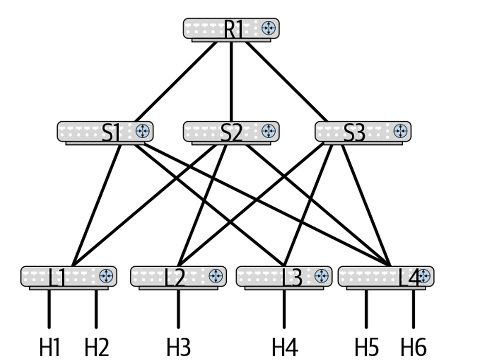
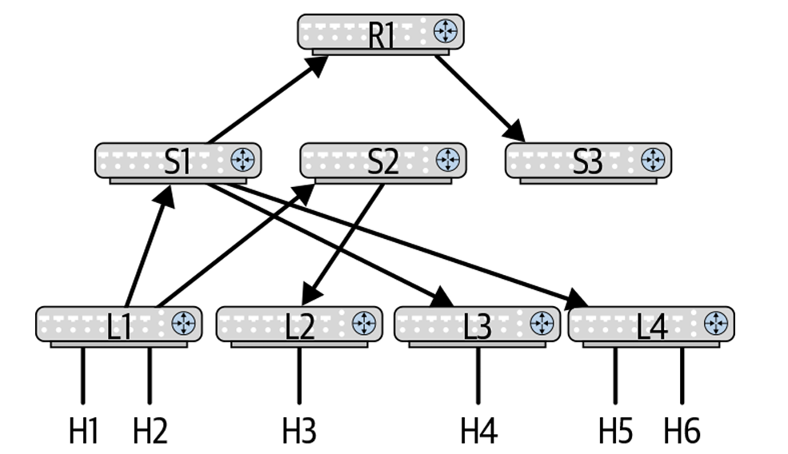
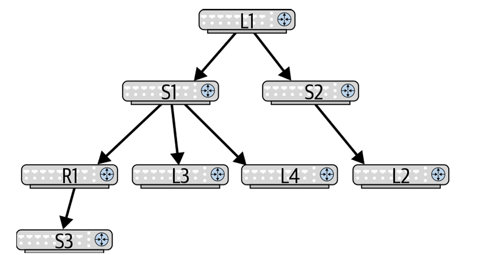
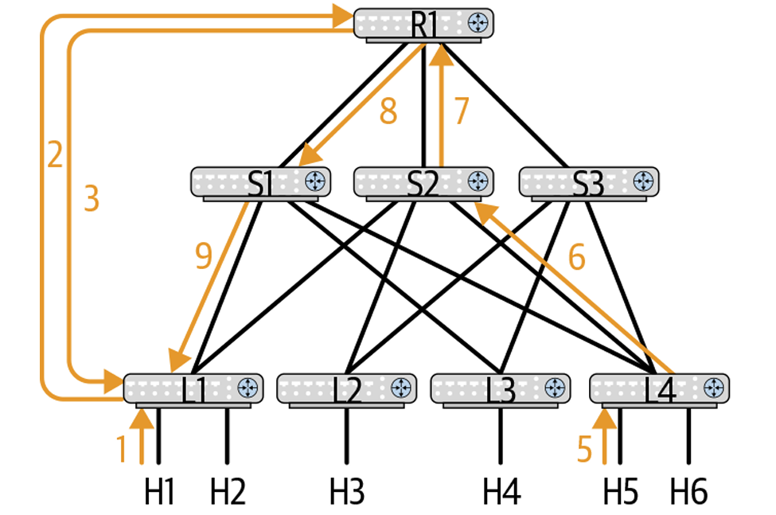
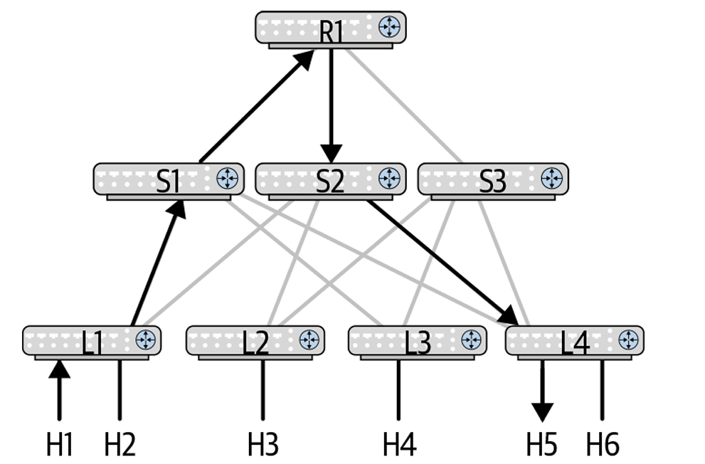
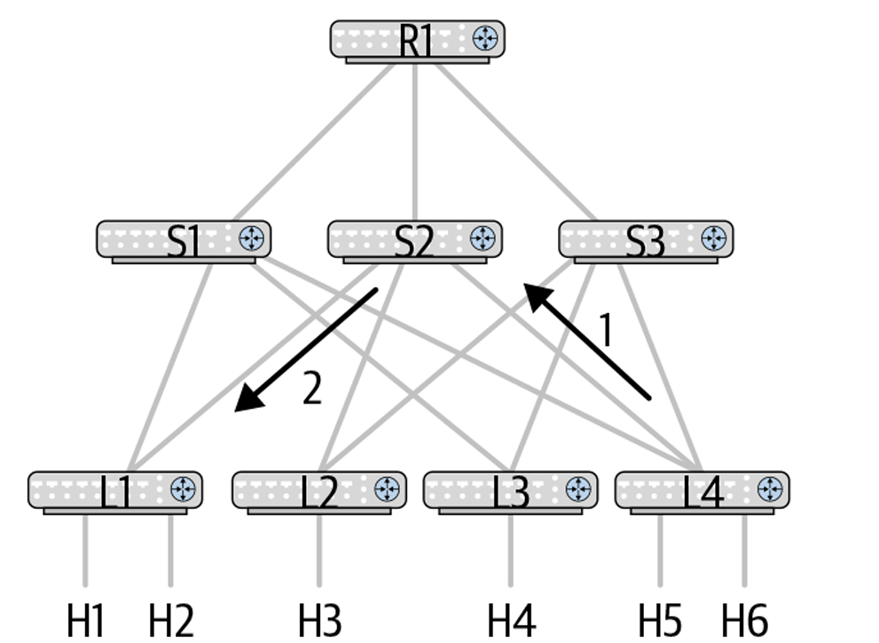
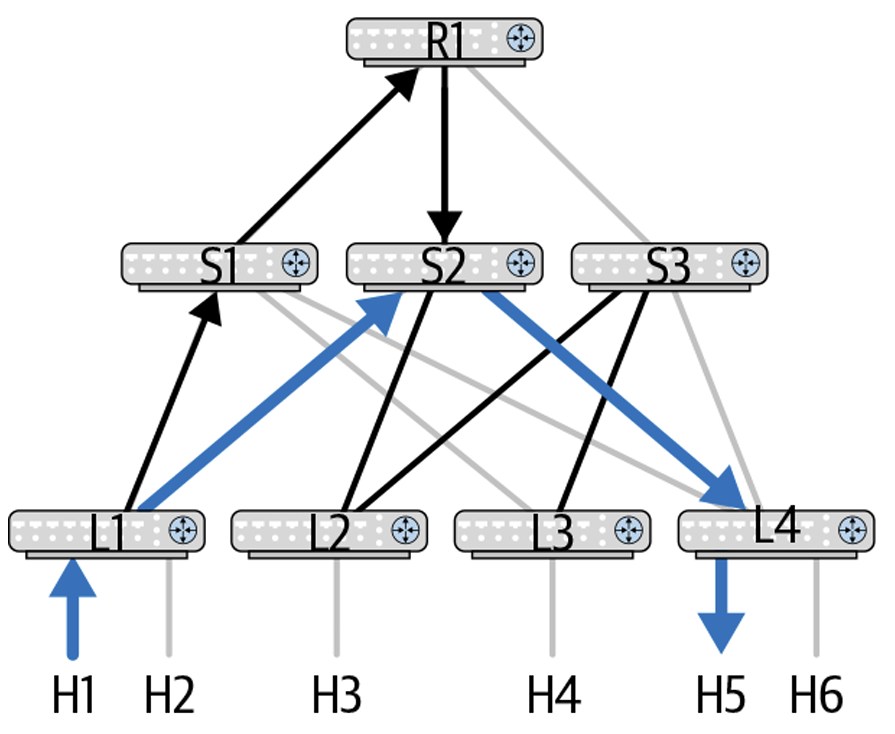
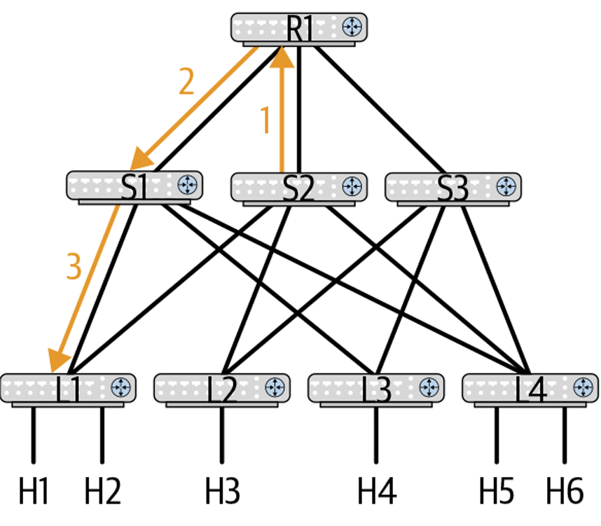
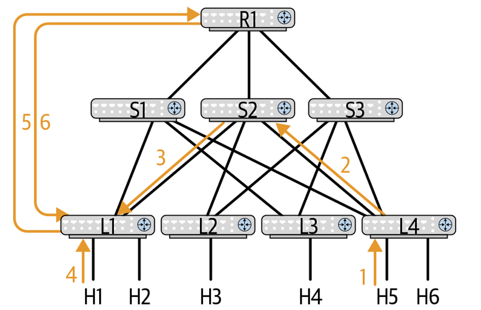
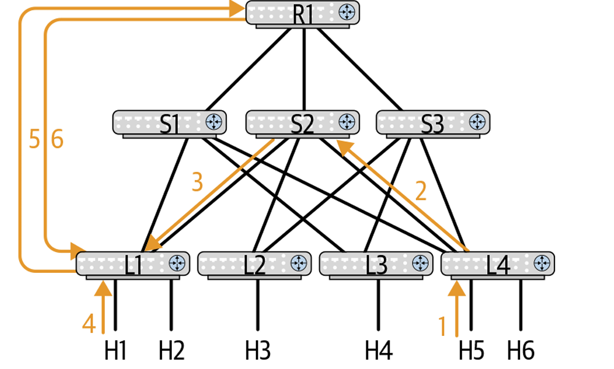

# Chapter 8: Multicast Routing in the Data Center

在現代資料中心架構中，多播路由（Multicast Routing）一直被視為控制平面中最複雜的領域之一。正如前 IETF 主釋 Fred Baker 所言：「*Multicast is a zero-billion-dollar industry*」（多播是一個零億美元的產業）。在大規模公有雲與純雲端原生環境中，多播通常被摒棄；但隨著企業網採用 Clos (Leaf-Spine) 拓撲，並結合 **EVPN (VXLAN Overlay)** 時，底層 (Underlay) 或疊加網 (Overlay) 對多播的需求再次浮現。

### 多播路由概述 (Multicast Routing: Overview)

* **頭端複製 vs. 網路多播**：
    * **頭端複製 / 入口複製 (Head-End / Ingress Replication)**：來源端將同一封包複製多份，以單播（Unicast）分別傳送給每個接收者，對來源端與網卡頻寬造成巨大負擔。
    * **多播 (Multicast)**：來源端僅發送單一封包，網路設備（交換器/路由器）僅在分叉點進行硬體級複製，極大化提升網路頻寬利用率。
* **多播定址 (Multicast Addressing)**：
    * **MAC 位址**：第一個 Octet 的最低有效位元 (LSB) 為 1（例如 `01:00:5E:xx:xx:xx`）。
    * **IPv4 位址**：Class D 區段（第一個 Octet 為 `224` 至 `239`，前 4 位元為 `1110`）。其中 `224.0.0.0/24` 為 Link-Local 多播（如 OSPFv2 的 `224.0.0.5`），僅在二層橋接不跨三層路由。
    * **IPv6 位址**：前 8 位元為 `1111 1111` (`FF00::/8`)，內含作用域（Link-Local、Node-Local、Global 等）。
* **二層橋接多播 vs. 三層路由多播**：
    * **二層橋接多播 (L2 Multicast)**：運作於單一子網（VLAN），依賴生成樹（STP）或 IGMP Snooping 進行轉發。
    * **三層路由多播 (L3 Multicast)**：跨越三層 IP 子網，必須在單播路由拓撲建立完成後，疊加構建**多播分發樹 (Multicast Distribution Tree)**。
* **多播路由條目表示法**：
    * **`(*, G)`**：共享樹路由（Shared Tree），接受來自任意來源 (S) 發往多播組 G 的流量。
    * **`(S, G)`**：來源樹路由（Source-Specific Tree / SPT），僅接受來自指定來源 S 發往多播組 G 的流量。`(S, G)` 的前綴匹配優先權高於 `(*, G)`（遵循最長前綴匹配 LPM）。
* **硬體晶片限制**：多播路由條目在交換晶片（Switching Silicon）中需要同時比對來源 IP 與目的 IP，因此**佔用的 TCAM/路由表空間為單播條目的兩倍**。

 圖 8-1

上圖，展示了 4 台 Leaf (L1–L4)、3 台 Spine (S1–S3)、1 台外部路由器 R1，以及 6 台主機 (H1–H6) 的 Clos 拓撲。
對比了當 H1 欲發送相同多播封包給 H3、H5 與 H6 時的流量路徑：
* *Ingress Replication*：H1 必須自己複製 3 份單播封包分別發往 H3, H5, H6。
* *Multicast*：H1 只需發送 1 份封包給 L1 ；L1 送至 S2；S2 進行第一次硬體複製分別發給 L2 與 L4；L2 交付給 H3；L4 進行第二次複製交付給 H5 與 H6（未訂閱的 H2 與 H4 則不會收到），完美視覺化多播對骨幹頻寬的節省效益。

---

## 多播路由需解決的核心問題 (Problems to Solve in Multicast Routing)

多播路由需回答的兩大核心問題：
1. **如何防止重複封包交付 (Prevent Duplicate Packet Delivery)？**：網格拓撲中存在多重環路，必須將實體拓撲轉換為**無環有向樹 (Directed Acyclic Graph, DAG)**。
2. **多播組的聽眾 (Listeners) 位於何處？**：路由器必須動態感知哪些介面存在感興趣的聽眾，避免將封包淹沒至無聽眾的網段。
* **多播控制協定體系**：
    * **IGMP (Internet Group Membership Protocol)**：主機與第一跳路由器（LHR）之間的成員通告協定。通常使用 **IGMPv3**（支援指定來源的 `(S,G)` 與任意來源的 `(*,G)`）。
    * **PIM (Protocol-Independent Multicast)**：路由器之間構建多播分發樹的協定。「Protocol-Independent」意指 PIM 不自行計算單播拓撲，而是完全仰賴底層單播路由表（OSPF/BGP）進行 **反向路徑轉發檢查 (RPF Check)**。
* **軟狀態 (Soft State) 機制**：多播狀態為軟狀態，聽眾必須定期發送 IGMP Join 以維持狀態；若停止發送，上游路由器逾時後會發送 **PIM Prune** 剪枝，將無聽眾的樹枝剪除。

這邊將圖 8-1 的多重環路網格拓撲轉換為以 L1 為根節點的有向無環樹（DAG），以箭頭標示資料流向，消除環路與重複封包。

從 L1 的邏輯視角重繪多播分發樹，展現拓撲從實體網格轉變為以來源側 Leaf (L1) 為根節點、向下分支至聽眾側 Leaf (L2, L4) 的層次化結構。

#### PIM Protocol Packet Types

PIM 封包直接封裝於 IP 標頭（**IP Protocol Number 103**），IPv4 目的多播位址為 `224.0.0.13` (ALL-PIM-ROUTERS)，IPv6 為 `FF02::D`。

| 封包類型 (Packet Type) | 主要用途 (Use) | 發送週期/觸發時機 | 目的 IP 位址 |
| :--- | :--- | :--- | :--- |
| **PIM Hello** | 發現 PIM 鄰居並選舉指定路由器 (DR) | 每 30 秒定期發送 | `224.0.0.13` (ALL-PIM-ROUTERS) |
| **PIM Register** | 由 FHR 將來源端第一包多播資料封裝為單播送往 RP | 新來源啟動時每 60 秒發送 | RP 的單播 IP 位址 |
| **PIM Register Stop** | 由 RP 回應給 FHR，通知停止發送 Register 封包 | 收到 Register 後回應 | FHR 的單播 IP 位址 |
| **PIM Join/Prune** | 用於構建（加入）或剪枝（撕毀）多播分發樹 | 每 60 秒定期發送 | `224.0.0.13` (ALL-PIM-ROUTERS) |
| **PIM Assert** | 網段出現重複多播流量時，仲裁唯一的轉發路由器 | 發生轉發衝突時觸發 | `224.0.0.13` (ALL-PIM-ROUTERS) |

---

## PIM 稀疏模式深剖 (Section 8.3: PIM Sparse Mode)

1. 核心概念：RP 與兩類分發樹
    * **匯合點 (Rendezvous Point, RP)**：PIM-SM 中共享樹 **`(*, G)`** 的核心根節點。管理者需預先配置 RP 位址，作為來源端與聽眾端匯合的樞紐。
    * **RP Tree (RPT / 共享樹)**：以 RP 為根節點建立的分發樹，用於傳遞 `(*, G)` 流量。
    * **Shortest Path Tree (SPT / 來源樹)**：以來源端 (S) 為根節點的直連最優路徑。聽眾端收到第一個封包後，通常會觸發 **SPT Switchover**，將路徑從 RPT 切換至最優的 SPT。

2. 多播樹動態構建流程與圖解 (Building a Multicast Distribution Tree)

    1. 情境 A：來源端先啟動 (Source Starts First)
        

        1. H1 (來源) 發送多播至 L1 (FHR)。L1 將多播封包封裝於單播 **PIM Register** 封包中送往 RP (R1)。
        2. 若目前全網尚無聽眾，RP 回應 **PIM Register Stop**，L1 直接在本地丟棄後續多播封包。
        3. H5 (聽眾) 向 L4 (LHR) 發送 IGMPv3 Join `(*, G1)`。
        4. L4 查單播路由表選擇走向 RP (R1) 的出口（如經由 S2），將該介面設為 **RPF Interface**，並發送 **PIM Join `(*, G1)`** 給 S2。
        5. S2 建立狀態並向 RP (R1) 轉發 PIM Join。
        6. RP 發現有了聽眾，開始向來源側 L1 發送 **PIM Join `(H1, G1)`**（經由 S1）。

        

        展示上述初期的 RPT 共享樹路徑：`H1 → L1 → S1 → R1(RP) → S2 → L4 → H5`（非最優的 5-Hop 長路徑）。

        

        L4 (LHR) 收到流量後，查單播路由表尋找到達來源 H1 的最短路徑 (經由 S2)，直接向 S2 發送 **PIM Join `(H1, G1)`**。

        
        
        最優 SPT 切換完成（藍線：`H1 → L1 → S2 → L4 → H5`，僅 3-Hop）。此時黑線（經過 RP 的舊路徑）仍會收到重複流量，造成頻寬浪費。

        
        
        S2 發現其 `(H1, G1)` 與 `(*, G1)` 的 RPF 介面不同，觸發 Override 定時器後向 RP (R1) 發送帶有 **`(S,G,RPT) Prune` 標記** 的 PIM Join。
        
        RP (R1) 收到後將 S2 從其出口清單 (olist) 中移除，並向 S1/L1 發送 PIM Prune，徹底終止發往 RP 的冗餘流量，實現最優切換。

    2. 情境 B：聽眾端先啟動 (Listener Starts First)
        

        1. 聽眾 H5 先發送 IGMP Join，L4 及 S2 預先向 RP (R1) 建立好 `(*, G1)` 共享樹（RP 此時 RPF 為空）。
        2. 隨後 H1 (來源) 啟動，L1 發送 PIM Register 給 RP。
        3. RP 發現已存在 `(*, G1)` 聽眾，立即向 L1 發送 PIM Join `(H1, G1)` 建立數據流，隨後 L4 同樣觸發 SPT Switchover。

        
        
        若聽眾 H5 一開始即發送指定來源的 IGMPv3 Join `(H1, G1)`，L4 與 S2 直接向 L1 建立 SPT 樹。當 H1 啟動時，L1 雖仍會向 RP 發送 PIM Register，但 RP 因無 `(*, G1)` 聽眾而立即回應 Register Stop，資料流完全行經直連 SPT。

3. 冗餘 RP 與 MSDP 協定 (Multiple RPs and MSDP)

    * **Anycast RP 與 MSDP (RFC 3618)**：單一 RP 存在單點故障。實務上會在多台 RP 上配置相同的 Anycast IP 位址。多台 RP 之間透過 **MSDP (Multicast Source Discovery Protocol)** 形成全網狀 (Full Mesh) TCP 連線，即時同步 `(S,G)` 來源資訊。
    * **控制平面 Trap 機制**：第一跳路由器 (FHR) 會設置控制平面捕獲條目，當收到新多播組的第一個封包時，將其 Trap 上送給 CPU，觸發 PIM Register 流程。

---

## 資料中心 Clos 拓撲下的 PIM-SM 部署考量 (PIM-SM in the Data Center)

* **RP 位置擺放的架構決策 (RP Placement Trade-offs)**：
    * **擺設於 Spine 交換器 (不推薦)**：
        * *病理分析*：違反了「Spine 僅作純粹轉發節點、不承載服務 (Connective Node Only)」的 Clos 哲學。若在所有 Spine 上部署 Anycast RP，需運行 MSDP，且因 BGP 預設跨 Spine 不通，需開啟 `allowas-in`，易引發 Path Hunting 路由震盪。
    * **擺設於 Exit Leaf / Border Leaf (推薦做法)**：
        * *架構優勢*：符合 Clos 將服務推向邊緣 (Edge) 的設計模型。由於 SPT Switchover 會迅速將流量切離 RP，RP 的實體頻寬負擔極低，放置於 Exit Leaf 最為穩健。
* **EVPN 與無 RP 簡化趨勢 (EVPN-Optimized Multicast)**：
    * 在 EVPN VXLAN Overlay 架構中，各 VTEP 已透過 EVPN 路由（如 Route Type 3 / Route Type 6）預先獲知了全網的 VNI 與聽眾分佈。
    * **終極簡化**：VTEP 可直接自動建立 `(S,G)` 樹，**徹底摒棄 RP 配置、摒棄 MSDP 協定，亦無需進行 RPT 到 SPT 的切換**，巨幅降低資料中心維運複雜度。
* **PIM-SM 與 無 IP 介面 (Unnumbered Interfaces)**：
    * 在 Unnumbered OSPF/BGP 環境下，PIM 必須自動借用 **Loopback 介面 IP** 作為 PIM 封包的 Source IP 進行鄰居建立與轉發。

## 現代資料中心的替代與優化方案 (Modern Alternatives)

1. **頭端複製 / 入口複製 (Ingress / Head-End Replication - IR / HER)**：
  * **機制**：摒棄 Underlay 的 IP Multicast 與 PIM 協定。當有 BUM（廣播、未知單播、多播）流量時，由 Ingress VTEP 將封包複製多份，以**標準單播 IP 隧道 (Unicast)** 發送給目標 VTEP。
  * **優勢**：Underlay 網路完全純化為標準 L3 單播路由（OSPF/BGP），無須任何 PIM / RP / MSDP 配置，維運極致簡化。
2. **BGP EVPN 控制平面優化 (Controller-less VXLAN)**：
  * 利用 **MP-BGP EVPN (Route Type 2/3/5)** 進行動態 MAC/IP 宣告與 **ARP Suppression（ARP 抑制）**，將傳統「Flood-and-Learn」流量降低 90% 以上，從根本上減少了資料中心對多播的需求。
3. **EVPN-Optimized Multicast / Tenant Routed Multicast (TRM)**：
  * 在需要跨網段多播時，利用 EVPN 通告 (如 Route Type 6/7/8) 預先獲知聽眾與來源，直接在邊緣建立端到端的 `(S, G)` 最優路徑，**徹底去除了 RP 匯合點與 MSDP 協定**。