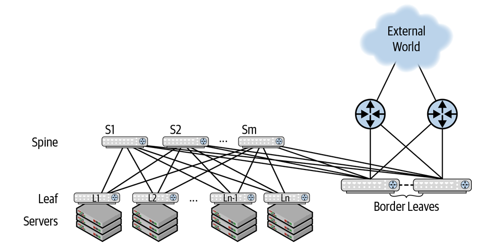
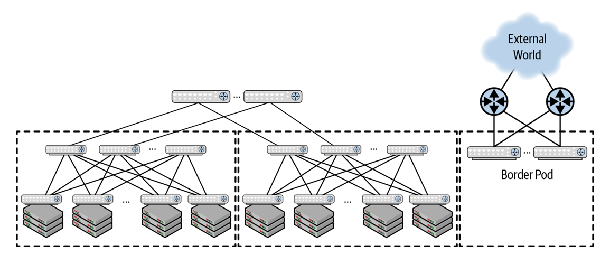
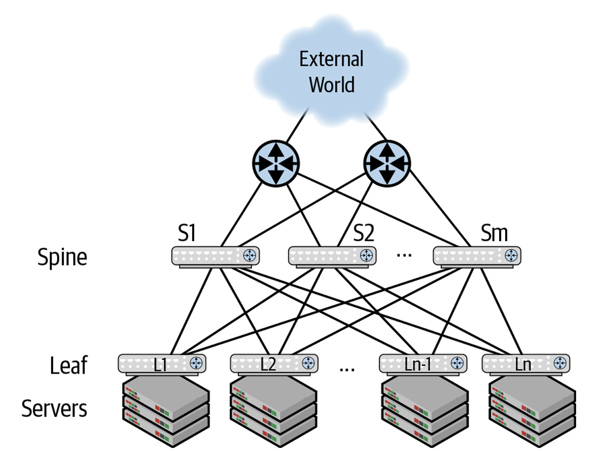
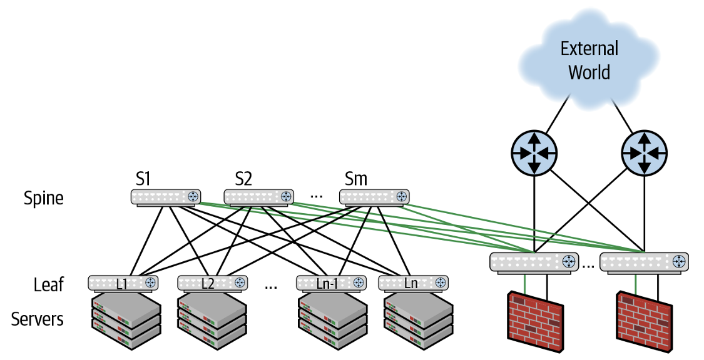
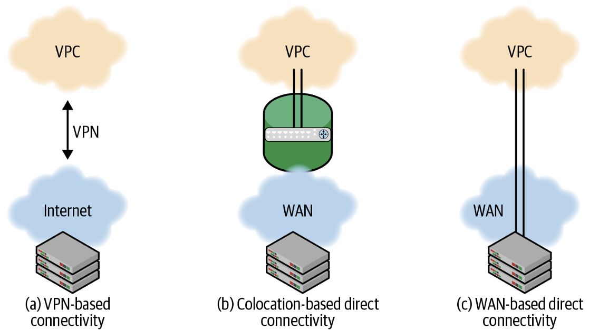
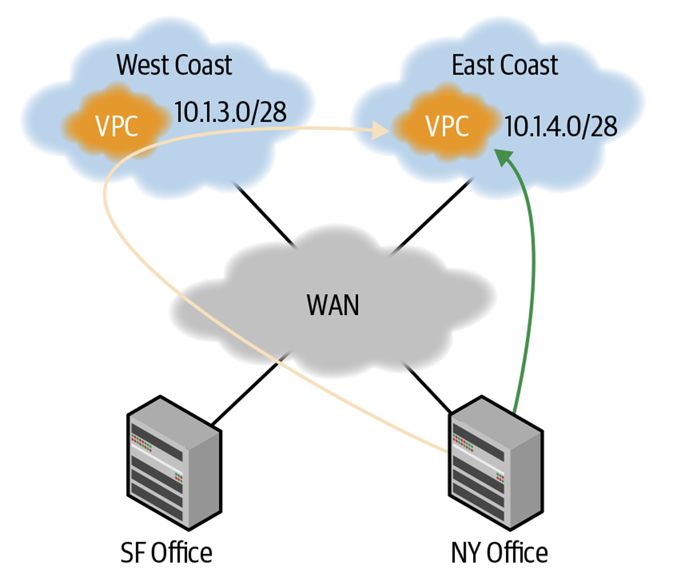

# Life on the Edge of the Data Center

### 章節定位與核心議題 (Chapter Overview & Core Questions)
* **南北向流量控制**：Clos（Leaf-Spine）拓撲優化了資料中心內部的東西向（East-West）流量，而本章聚焦於資料中心如何與外部世界連通（南北向，North-South 流量）。
* **邊界設計四考量維度**：
    1. **需求目的**：為何需要連接外部世界（服務提供、拉取資料或連接混合雲）？
    2. **頻寬需求**：南北向鏈路需要多少頻寬容量？
    3. **上游設備**：邊界交換器將對接何種外部路由器（Internet Router）？
    4. **安全與服務**：跨邊界流量需要串接哪些網路服務（如防火牆、負載平衡器）？

---

## 外部連通模型 (Connectivity Models)

### 1. 外網連接需求與頻寬考量 (Why Connect & Bandwidth Requirements)
* **連接外網三大情境**：
    * **提供外部服務**：如搜尋引擎、廣告推薦系統或內容分發（CDN）。
    * **拉取外部資料**：如網路爬蟲（Web Crawler）抓取資料以建立搜尋索引或訓練機器學習模型。
    * **連接公有雲**：建構混合雲（Hybrid Cloud）架構。
* **內部與外部頻寬非對稱性**：
    * Clos 內部的 Fabric 總頻寬極為龐大（如 16 台 Leaf 搭配 4 台 100GbE Spine 可提供數 Tbps 甚至超過 10 Tbps 總容量）。
    * 多數企業的南北向外網頻寬需求遠小於內部東西向頻寬，因此連外路由器的吞吐量通常設計得比內部 Fabric 小。

### 2. Clos 拓撲對外連接的三種實體模型 (Connecting Clos to the External World)

#### 方案 A：二層 Clos 獨立 Border Leaf 模型

* 架構呈現：在傳統二層 Leaf-Spine 拓撲中引入專用的 **Border Leaf（邊界葉交換器 / Exit Leaf）**。Border Leaf 下鏈不連接伺服器，而是連接外網 Internet 路由器；上鏈則與 **所有的 Spine 交換器保持 Full-Mesh 全互連**。
* 架構含意與設計原則：
    1. **維護流量對稱與消除熱點**：工程師常犯的錯誤是「只讓少數幾台 Spine 直接連外網」，這會破壞 Clos 流量對稱性，導致特定 Spine 承載過多流量產生熱點 (Hotspots)。
    2. **冗餘備援**：配置至少 2 台 Border Leaf 以排除單點故障（Single Point of Failure），數量可依南北向超賣比（Oversubscription Ratio）動態擴充。

#### 方案 B：三層 Clos 獨立 Border Leaf 模型

* 架構呈現：在 Super-Spine、Spine 與 Leaf 組成的三層 Clos 架構中，將 Border Leaf 的上鏈直接連接至 **Super-Spine** 層。
* 架構含意：將邊界隔離模型無縫擴展至大規模三層 Clos Fabric；若 Spine 數量超過 Border Leaf 的 Port 數上限（如超過 64 台），可再增加一層開關階層進行匯聚。

#### 方案 C：Spine 直連外網模型

* 架構含意與取捨：
    * 適用場景*：小型網路（僅 2~4 台 Spine）且對硬體成本極度敏感，或南北向流量規模幾乎等於東西向流量時。
    * 架構代價*：雖然省去了 Border Leaf 帶來的約 300ns 轉發延遲（實務上 300ns 微不足道），但 Internet 路由器介面極為昂貴；且為防止 Hotspot，**必須讓每一台 Spine 都連接至外網路由器**，總成本反而更高。

---

### 邊界路由與服務鏈引導 (Routing at the Edge & Services)

#### 1. 邊界路由策略 (Routing at the Edge)
* **路由摘要 (Route Summarization)**：內部 Clos 的細節不應暴露給外網，Border Leaf 是執行路由摘要的最佳位置（Border Leaf 與所有 Spine 相連，絕不會因單一內部鏈路中斷而遺失內部前綴）。
* **私有 ASN 剝除 (Private ASN Stripping)**：若內部 Fabric 運行 eBGP 並採用私有 ASN（如 `65000-65534`），Border Leaf 在向 ISP 宣告路由前必須執行 `remove-private-AS` 剝除私有 ASN。

#### 2. 防火牆與安全服務鏈引導 (Services & Firewalls)

* 架構呈現：Border Leaf 內部啟用兩個 VRF——**綠色 VRF（內網，`evpn-vrf`）** 與 **灰色/黑色 VRF（外網，`internet-vrf`）**。Border Leaf 透過兩條邏輯 L3 子介面（VLAN Tags）連接實體防火牆（Firewall）。防火牆跨兩個子介面分別建立獨立的 BGP Session。
* 封包處理與轉發鏈路（Step-by-Step Packet Flow）：
    1. **內網發起**：伺服器將外網封包發往本地 Leaf 預設閘道，經 Spine ECMP 送達 Border Leaf。
    2. **VRF 隔離與引導**：Border Leaf 在綠色 VRF (內網) 查表，預設路由指向防火牆的綠色鏈路，將封包發往防火牆。
    3. **防火牆檢驗**：防火牆檢查封包合規性；若通過，將封包發回 Border Leaf 的黑色鏈路（屬於黑色 VRF）。
    4. **外網轉發**：Border Leaf 在黑色 VRF 查表，將封包轉發給外網 Internet 路由器。
    5. **反向流量**：外網回包由黑色 VRF 進入 Border Leaf，強制送到防火牆，驗證後經綠色 VRF 送回內部 Fabric。
* 系統優勢：Spine 交換器與實體防火牆皆維持 **VRF-unaware（無須感知 VRF）**，完全由 Border Leaf 實現強制的端到端流量安全過濾與服務鏈引導。

---

## 混合雲連線架構 (Hybrid Cloud Connectivity)

### VPC 與公有雲網路特性

* **VPC (Virtual Private Cloud) 屬性**：完全為純 L3 路由網路，**不支援 Layer 2 延伸、不支援廣播與多播 (Broadcast/Multicast)**，且 VPC 內部不運行動態路由協定。
* **VPC 閘道 (Virtual Private Gateway)**：每個 VPC 透過虛擬專用閘道處理子網間路由、NAT 及外部存取控制。

### 三種混合雲連線模式

* 架構呈現：繪製了地端資料中心與公有雲 VPC 連接的三種途徑：
    1. **(a) IPsec VPN 隧道**：透過網際網路建立加密 IPsec 隧道。
    2. **(b) Collocation 託管直連**：在地端機房與雲端業者同址的 Collocation 設施中進行實體直連。
    3. **(c) 電信業者專線直連**：透過電信商提供之 WAN 專線（如 MPLS VPN 或 Ethernet Q-in-Q）連通。
* 三大雲端業者直連服務對照：
    *   **AWS**：Direct Connect (DX)。
    *   **Microsoft Azure**：ExpressRoute。
    *   **Google Cloud**：Cloud Interconnect。

### BGP 混合雲路由策略與非最佳路由消除

* 架構呈現：展示企業在紐約 (NYC) 與舊金山 (SFO) 設有地端機房，並同時連接公有雲的美東與美西 VPC。
    * 非最佳路由（Non-optimal Routing）問題與工程對策：
        * 問題：若未配置路由策略，NYC 存取美東 VPC 的流量可能會跨越地端 WAN 繞道至 SFO 再進入美西 VPC，造成嚴重的延遲暴增與專線費用浪費。
        * 對策：地端與 VPC 之間採用 **eBGP Multihop** 建立會話。必須透過 **Route-Maps** 設定策略（如 Local Preference、AS_PATH Prepend）強制流量優先走在地直連路徑。
        * 安全約束：BGP 策略應防止公有雲 VPC 將地端資料中心當作存取 Internet 的 Transit 轉發點。
        * BFD 微秒偵測：建議在混合雲直連鏈路上啟用 **BFD (Bidirectional Forwarding Detection)**，實現微秒級的鏈路故障切換。

---

### 最佳實踐

| 評估維度 | 建議最佳實踐 (Best Practices) | 應避免之抗模式 (Anti-Patterns) |
| :--- | :--- | :--- |
| **邊界拓撲** | 採用 **Border Leaf (Exit Leaf)** 模型，全互連至所有 Spine。 | 僅將外網路由器連接至**部分 Spine**（引發流量偏極化與 Hotspot）。 |
| **路由聚合** | 在 Border Leaf 執行路由摘要與私有 ASN 剝除 (`remove-private-AS`)。 | 在 Spine 上執行路由摘要（鏈路斷開時會引發流量黑洞）。 |
| **安全防護** | 利用 Border Leaf 的雙 VRF + 雙 BGP Session 引導流量穿過防火牆。 | 將防火牆直接插在 Spine 上，破壞 Fabric 的純粹轉轉架構。 |
| **混合雲連線** | 採用 **eBGP Multihop + Route-Maps** 控制選路，並綁定 **BFD** 偵測。 | 依賴預設選路，導致跨區域流量發生 Non-optimal 繞道。 |