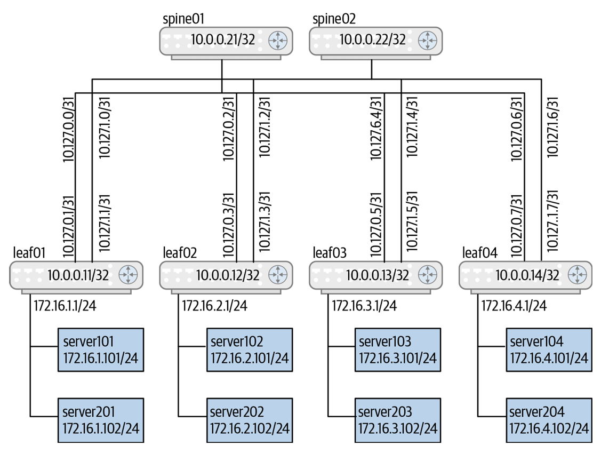
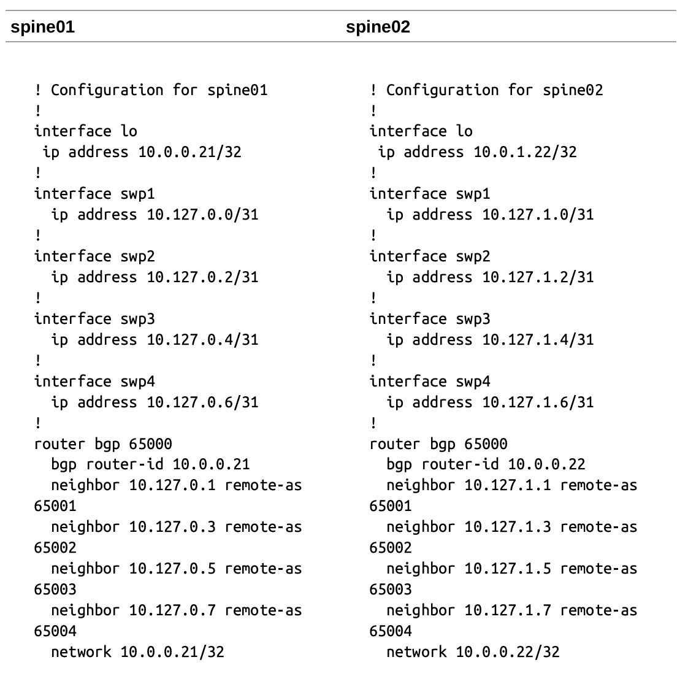
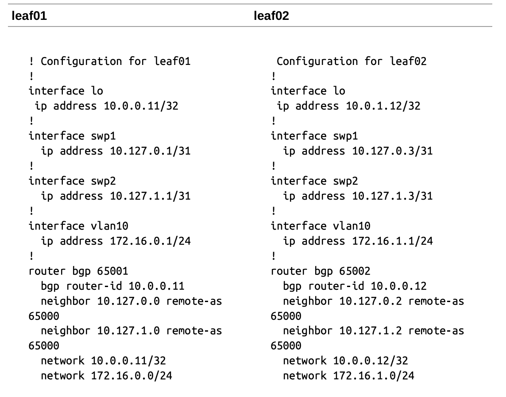

# Network Automation（網路自動化）

* **維運哲學的轉變**：雲端原生資料中心（Cloud Native Data Center）與傳統資料中心最根本的差異在於對**高效能營運 (Efficient Operations)** 與 **敏捷性 (Agility)** 的極致追求。
* **解放重複勞動**：引述 Slack 創辦人 Stewart Butterfield 的名言，網路自動化的核心目標並非取代網路工程師，而是將工程師從枯燥、重複、耗時且極易出錯的「機器行為（Mind-numbing behavior）」中解放出來。

## 何謂網路自動化？ (What Is Network Automation?)
* **定義**：利用軟體程式自動執行以往需要工程師登入單台設備逐一手動執行的網路管理任務。
* **自動化範疇階層**：
  * **日常批次維運**：例如批次進行安全性套件更新、跨設備提取 BGP 運行狀態。
  * **零天配置 (Day-Zero Provisioning)**：自動發送基礎初始設定。
  * **進階自動化**：涵蓋第二天 (Day-Two) 的自動化驗證 (Validation)、即時監控告警，最高境界為網路自我感知與自我修復 (Self-healing)。
* **企業與雲端業者的差距**：傳統企業網路多停留在手動 CLI 操作；而 AWS、Microsoft 等公有雲業者之所以能高效營運，自動化是其核心基石。

## 誰需要網路自動化？ (Who Needs Network Automation?)
* **適用規模**：**只要管理超過數台交換器，不論規模大小（從 2-Spine/8-Leaf 到大規模雲端），皆能從自動化中獲益**。
* **人為錯誤是故障主因**：多項研究顯示，工程師手動輸入指令產生的人為失誤（Human Error）是網路癱瘓的**第一或第二大主因**。
* **Clos 拓撲引發的規模效應**：Clos（葉脊）拓撲採用大量小型固定規格交換器（Fixed-form-factor Switches），導致介面與協定配置高度重複。手動配置極易產生隨機隱蔽錯誤，且極難排查；自動化是維護網路可預測性 (Predictability) 的唯一途徑。

## 網路自動化是否意味著必須學習程式設計？ (Does Network Automation Mean Learning Programming?)
* **無需成為傳統開發者**：網路工程師無需具備軟體工程師等級的深度開發技能，只需學會編寫 **YAML** 資料格式與 **Jinja2** 樣板 (Templating)，即可完成絕大多數自動化任務。
* **像 Sysadmin 一樣思考**：類似系統管理員編寫 Bash 腳本或 Python 小工具，網路工程師可藉由 Ansible 等聲明式 (Declarative) 工具無痛踏入自動化領域。

## 為什麼網路自動化如此困難？ (Why Is Network Automation Difficult?)

途中展示包含了 2 台 Spine (`spine01`, `spine02`) 與 2 台 Leaf (`leaf01`, `leaf02`) 的兩層 Clos 拓撲。

* **具號介面 (Numbered Interfaces) 的變數地獄**：傳統配置要求每條點對點介面兩端配置同個子網（如 `/31` 或 `/30`，例 `10.127.0.0/31` 與 `10.127.0.1/31`）。
* **成對變數依賴**：BGP 必須精確指定對端 IP 與獨立私有 ASN（如 Spine 65000 對接 Leaf01 65001、Leaf02 65002）。這種跨設備的成對變數依賴，是自動化腳本難以產生的主因。

#### 網路自動化的五大技術阻礙：
1. **規模化爆炸 (Scale)**：在 4-Spine / 32-Leaf 拓撲中，單是互連介面 IP 就有 256 個，再加上 Loopback 與 Server 子網，變數維護極為痛苦。
2. **協定配置複雜度 (Network Protocol Configuration Complexity)**：BGP 需要對齊 IP 與 ASN；VLAN、EVPN (RD/RT) 在兩端必須嚴格比對匹配。
3. **資訊重複輸入 (Data Duplication)**：相同的 IP 與參數在配置檔中多次出現，增加了出錯機率。
4. **缺乏程式化存取管道 (Lack of Programmatic Access)**：傳統 CLI 缺乏 JSON 等結構化輸出，傳統工具僅能透過 SSH/SNMP 與脆弱的正則表達式（Text Scraper）解析文字，且指令失敗時無標準 Error Code。
5. **傳統 NOS 的專有設備限制 (Traditional Network OS Limitations)**：專有設備 (Appliance) 模式封閉，不支援 Linux 通配符 (Globbing) 與標準程式語言。

---

## 網路開發者如何協助網路自動化？ (What Can Network Developers Do to Help Network Automation?)
* **引述 ACM Queue 論文《A Plea to Software Vendors from Sysadmins》**，提出好的網路設備應滿足之自動化友善規範：
  1. 採用 **ASCII 純文字配置檔**，而非私有二進位封包 (Binary Blobs)。
  2. 提供**程式化 API** 存取（不限於 GUI/CLI）。
  3. 提供簡潔的備份/還原機制與靜默安裝（Silent Installation）選項。
  4. 支援標準系統日誌 (Syslog) 與良好數據儀表化 (Instrumentation)。
  5. **支援自動化友善的協定配置與結構化 I/O（JSON/YAML）**。

### 網路自動化工具選型 (Tools for Network Automation)

#### 兩大自動化工具箱體系對比：
* **系統管理員工具箱 (Sysadmin Toolkit)**：Ansible、Salt、Puppet、Chef。
* **網路管理員工具箱 (Network Administrator Toolkit)**：NETCONF、YANG、RESTCONF。

#### 破除「統一數據模型 (YANG / Uniform Data Model)」的鏡花水月：
* **標準化的迷思**：網路業界試圖推動跨廠商統一資料模型（從 SNMP、OpenFlow 到 YANG），但各廠商會因新功能添加專有擴充，導致標準討論耗時數年，最終淪為紙上談兵。
* **伺服器模型的成功經驗**：Linux 系統管理（Red Hat 與 Debian）從不強求統一資料模型，而是讓各工具切實解決問題。

#### 為何推薦 Ansible 作為網路自動化首選工具？：
1. **業界心智佔有率 (Mindshare) 最高**，社群資源極其龐大。
2. **無 Agent (Agentless) 架構**：無需在交換器安裝代理程式，透過 SSH、REST API 或 NETCONF 即可運作。
3. **語法簡單**：基於 YAML 與 Jinja2 樣板，幾乎無需傳統程式設計知識。
4. **跨平台與開源**：支援 Linux、macOS 與 Windows。

### 自動化最佳實踐 (Automation Best Practices)
1. **從簡單開始 (Start simple)**：先自動化備份、讀取序列號或配置 Loopback IP。
2. **程式碼與資料分離 (Separate code from data)**：將執行邏輯 (Code) 與設備變數 (Data/IPs) 解耦，獨立存放於 YAML 檔。
3. **預先驗證 (Validate)**：發送前進行語法與邏輯檢查，並透過 Vagrant 模擬驗證。
4. **版本控制 (Git it in your soul)**：使用 Git 記錄每一次配置變更，方便隨時 Rollback。
5. **滾動式更新 (Do rolling updates)**：利用 Clos 拓撲限制故障半徑，先套用至單一 Spine/Leaf 測試無誤後再擴大。
6. **選用一致的工具與語言**：如 Ansible 搭配 Python。
7. **持續疊代 (Iterate) 與擁抱社群 (Engage the community)**。

### 八、 Ansible 核心架構與概念 (Section 10.8: Ansible: An Overview)

#### Ansible 四大核心組件：
1. **Inventory (設備清單)**：位於 `/etc/ansible/hosts`，定義節點名稱、連線 IP (`ansible_host`)、設備群組 (`[servers]`, `[cumulus]`, `[arista]`) 及群組變數 (`[all:vars]`) 。
2. **Playbooks (劇本)**：採用 YAML 撰寫的任務流程。由 Play（指定目標主機）與 Tasks（具體執行的模組指令）組成，配合 `register` 捕捉輸出與 `debug` 印出結果。
3. **Ad Hoc Commands (單行臨時指令)**：無需撰寫劇本，直接在命令列對全網執行一次性批次指令。
4. **目錄結構與 Roles (角色)**：
   * 標準目錄結構：包含 `ansible.cfg`、`group_vars/`（群組變數）、`host_vars/`（主機獨立變數）、`inventory` 與 `roles/`。
   * **Role (角色)**：將任務、變數、Handlers 與 Jinja2 樣板 (`templates/`) 模組化打包，達到程式碼重用。

### 典型的自動化演進之旅 (A Typical Automation Journey)

企業導入網路自動化的四階段演進歷程：

1. **階段 1：光榮的檔案複製員 (Glorified File Copy)**：
   手動撰寫好少數設備的 `interfaces` 與 `frr.conf` 配置，利用 Ansible 的 `copy` 模組推送到設備，先建立對工具的信任感。
2. **階段 2：抽離通用非設備專屬配置 (Automate Non-Device Specific Config)**：
   將 NTP、Syslog、FRR Daemons 等全網共通的配置搬移至 `config/common/` 統一發送。
3. **階段 3：路由與介面配置樣板化 (Template the Routing and Interface Config)**：
   結合 **BGP Unnumbered (RFC 5549)**，利用 Jinja2 樣板 (`.j2`) 與 `host_vars`（僅定義 `loopback_ip`），實現整台 Spine 路由配置的自動生成。
4. **階段 4：引進 Role 與高階模組 (More Templating and Roles)**：
   將介面與路由任務重構成獨立的 Roles，並結合外部 CMDB (如 NetBox) 作為 SSOT。

#### 網路自動化的秘密武器：無 IP 介面 (Unnumbered Interfaces)
* **自動化救星**：Unnumbered 介面無需為點對點鏈路配置獨立 IP，**整台交換器只需配置 1 個 Loopback IP**！

### 驗證配置與網路測試 (Validating the Configuration)

1. **單一真實來源 (Single Source of Truth, SSOT)**：
   在自動化時代，Git 儲存庫中的 Playbooks 與樣板即為全網狀態的**唯一真實來源**。嚴禁工程師登入設備進行手動修改，否則會產生配置漂移 (Configuration Drift)。
2. **自動化時代的 Commit / Rollback**：
   在推送配置前，利用 Ansible 的 `validate` 關鍵字執行語法預檢（例如推送 FRR 配置前先執行 `/usr/bin/vtysh -C -f %s`），並開啟 `backup: yes` 實現自動備份與失敗還原。
3. **Vagrant 虛擬網路預檢 (Vagrant and Network Testing)**：
   利用 **Vagrant** 結合 VirtualBox/KVM，在本地電腦上啟動與生產環境完全相同的真實交換器 OS (Cumulus VX, Arista vEOS, Junos) 拓撲，**在實際推送至實體機房前，完成 100% 的邏輯與路由預檢**。
4. **自動化狀態驗證 (Automating Verification)**：
   部署後透過 Ansible 自動執行 JSON 狀態檢測（例如 `vtysh -c 'sh ip bgp summary json'`），寫入 Playbook 斷言 (`assert`) 自動比對全網 BGP Peer 數量與狀態是否均處於 `Established`。
