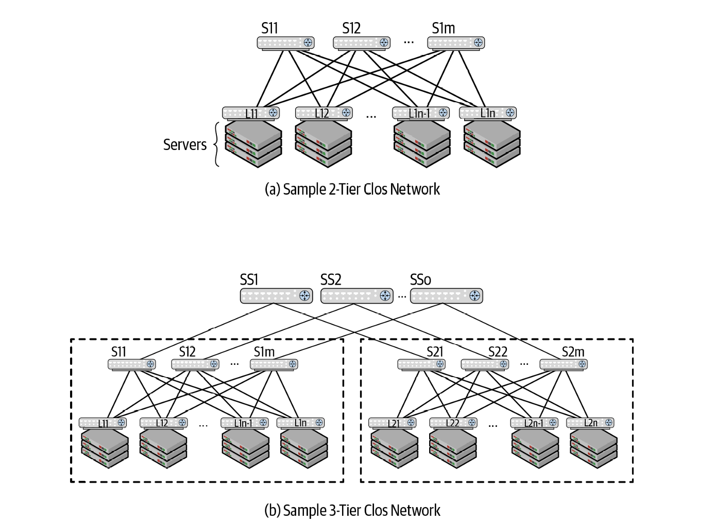
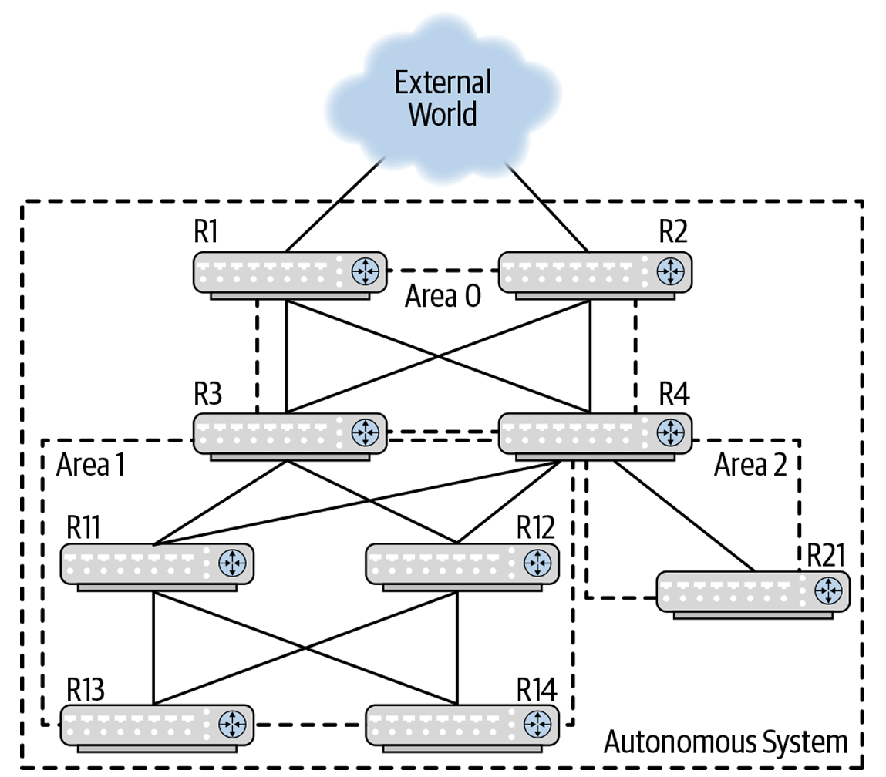
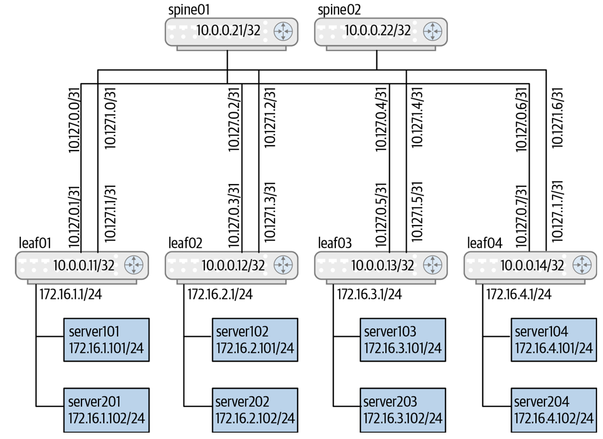
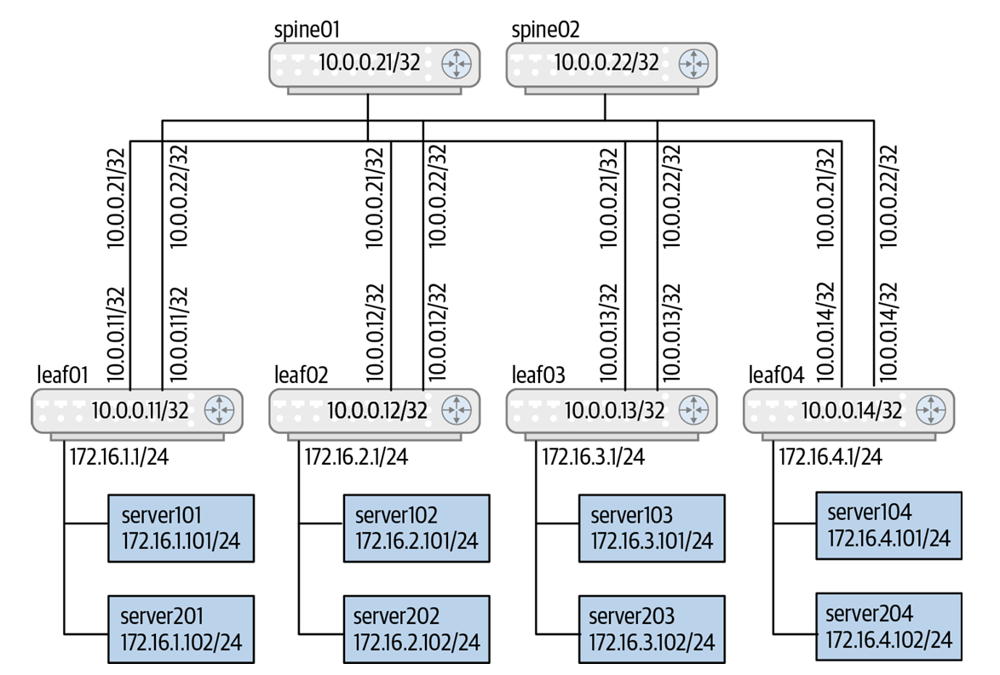
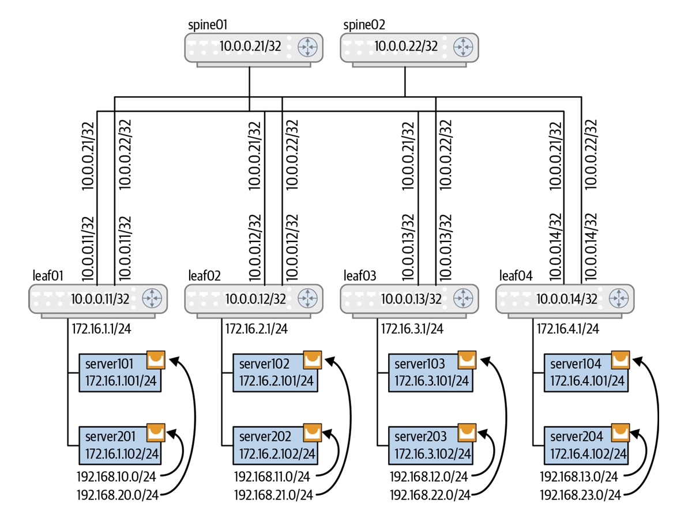

# Deploying OSPF（部署 OSPF）

### 章節定位與設計哲學
* **演算法初衷**：引述荷蘭計算機科學家Edsger Dijkstra 的名言：「*It was 20-minute invention... Without pencil and paper you’re forced to avoid all avoidable complexities.*」（這是一個 20 分鐘的發明……沒有紙和筆，你被迫避免所有可以避免的複雜性）。OSPF 採用 Dijkstra 的最短路徑優先 (SPF) 演算法來建立路由表。
* **定位與適用場景**：儘管 BGP 是現代資料中心的主流，但 OSPF 是企業網管最熟悉的 Interior Gateway Protocol (IGP)。對於**前綴數量少於 32,000 條**的中小型資料中心，或是作為 **EVPN 網路虛擬化 (VXLAN) 的 Underlay 路由**，OSPF 依然是極佳且穩健的選擇。

---

## 為什麼選擇 OSPF？
* **條列重點與架構剖析**：
  * **熟悉度高**：多數企業網路管理員對 IGP (OSPF) 的掌握度遠高於 BGP。
  * **EVPN Underlay 的傳統模型**：在傳統電信/服務提供者模型中，常用 IGP (OSPF) 構建底層實體路由 (Underlay)，再搭配 BGP 構建疊加虛擬網路 (Overlay)。
  * **規模限制**：適合前綴數量小於 32,000 條的網路；若超過此規模，BGP 仍為首選。
  * **IPv4 / IPv6 策略**：OSPFv2 處理 IPv4，OSPFv3 處理 IPv6。若設備軟體堆疊支援，建議優先採用**多位址族群 (Multiprotocol) OSPFv3**，只需單一協定即可同時管理 IPv4 與 IPv6。

---

## 需解決的核心問題與拓撲設計 (The Problems to Be Addressed)

* 展示了兩種 Clos 拓撲結構：
    * **(a)**：兩層 Leaf-Spine 拓撲（由 Leaf 1..Ln 與 Spine 1..Sm 組成）。
    * **(b)**：三層 Pod / Cluster 拓撲（由多個 Pod 1..k、Spine 1..Sm 與 Super-Spine 1..Sp 組成）。
* **架構意涵解析**：
    * **兩層 Clos**：所有交換器間的鏈路皆屬於同一**骨幹區域 (Backbone Area / Area 0)**。
    * **三層 Clos**：Pod 內部的 Leaf 與 Spine 劃歸為**非骨幹區域 (Non-backbone Area 1)**；連接各 Pod 的 Spine 與 Super-Spine 鏈路則劃歸為**骨幹區域 Area 0**。

1. **確定 LSA 氾濫區域 (Determining Link-State Flooding Domains)**：
    *   OSPF 透過區域 (Area) 限制 LSA 氾濫範圍，降低記憶體與 CPU 開銷。
    *   區域以 32-bit 數字表示（如 `0` 或 `0.0.0.0`）。骨幹區域 (Area 0) 必須連續且不能被切碎。
2. **具號介面 vs. 無號介面 (Numbered Versus Unnumbered OSPF)**：
    *   **具號介面 (Numbered)**：實體點對點鏈路配置 `/30` 或 `/31` 子網 IP。增加自動化變數複雜度、膨脹 FIB 路由表，並增加攻擊面。
    *   **無號介面 (Unnumbered OSPFv2)**：實體介面無獨立 IP，**直接借用 Loopback 的 `/32` IP**。大幅簡化 Ansible 自動化變數，且鏈路斷開時不引發全網路由表震盪。
3. **在伺服器/容器上執行 OSPF (Requirements for Running OSPF on Servers)** ：
    *   Kubernetes (Kube-router) 環境可直接在 Server 端執行 OSPF 發布容器 IP。
    *   **避免二層 Bridge 災難**：若 Server 接在二層 Bridge，每機櫃 40 台 Server 會產生 **1,600 個全網狀 Peering** 且伴隨劇烈 Chatter。
    *   **架構解法**：將 Leaf 的 Server 埠改為**純三層路由埠 (Routed Ports)**，Server 只與直連 Leaf 建鄰居；並將 Server 劃入 **Totally Stubby Area**，僅向 Server 發送預設路由 (Default Route)，防止 Server CPU 被全網 LSA 淹沒。

---

## OSPF 路由類型與 Stub 區域 (OSPF Route Types & The Messiness of Stubbiness)

* 展示包含了 Autonomous System (AS) 邊界、頂層 Backbone Area (R1–R4)、Area 1 (R11–R14, R3, R4) 以及 Area 2 (R21, R4) 的完整 OSPF 區域架構。R1/R2 對外連接 AS 外網，R3/R4 為跨區域的 ABR。
*   **架構解析**：
    *   **ASBR (Autonomous System Border Router)**：如 R1/R2，將外部路由（BGP/Static）**重分佈 (Redistribute)** 進入 OSPF，生成 **Type-5 External LSA**。
    *   **ABR (Area Border Router)**：如 R3/R4，連接 Backbone 與 Non-backbone Area，生成 **Type-3 Summary LSA**。
    *   **選路優先順序**：**Intra-area (區域內) > Inter-area (區域間) > External (外部路由)**。

*   **Stub 區域的複雜性 (The Messiness of Stubbiness)**：
    *   **Totally Stubby Area**：ABR 僅向區內發送一條 Type-3 預設路由，阻斷所有外部與區域間路由。**禁止在區內執行 `redistribute`**，極度適合 Server 節點。
    *   **NSSA (Not-So-Stubby Area)**：允許區內 ASBR 引入 Type-7 LSA，再由 ABR 轉換為 Type-5 LSA 轉發至骨幹區。

---

## OSPF 定時器與狀態機 (OSPF Timers & States)
* **條列重點與架構剖析**：
    * **核心定時器 (Timers)**：
        * **Hello Interval**（預設 10s）：心跳時間。建議維持預設，將極速故障捕捉交由 **BFD (微秒級)** 處理，避免推高 CPU 負載。
        * **Dead Interval**（預設 40s）：逾時未收到 Hello 判定鄰居死亡。
        * **SPF Computation Timers**：傳統等待 200ms；FRR 在現代高效能 CPU 與 **Incremental SPF (增量 SPF)** 支援下，將 SPF Delay 降為 `0ms`，Max Hold 降為 `5s`，Hold 降為 `50ms`。
    * **鄰居狀態機 (Neighbor States )**：
        * `Down` \\(\rightarrow\\) `Init` \\(\rightarrow\\) `2-Way` \\(\rightarrow\\) `ExStart` \\(\rightarrow\\) `Exchange` \\(\rightarrow\\) `Loading` \\(\rightarrow\\) **`Full`**（完全同步狀態）。

---

## 剖析 OSPF 配置範例與演進 (Dissecting an OSPF Configuration)

* 傳統具號介面 (Numbered) 配置拓撲。兩層 Clos 拓撲中，Spine 與 Leaf 的實體介面皆指派獨立 `/31` 子網 IP（如 `10.127.0.0/31`），伺服器端配置 VLAN10。
*   **架構痛點**：展示了傳統常見的抗模式（Anti-pattern）——重複在 `network` 宣告 IP、使用 `redistribute connected` 導致路由重複傳播，且未設定 `point-to-point` 觸發無謂的 DR/BDR 選舉。

#### 演進一：更乾淨的具號配置 (Cleaner Numbered OSPF)
*   加上 `ip ospf network point-to-point`：跳過 DR/BDR 選舉，加速收斂。
*   介面上直接宣告 `ip ospf area 0`：取代 `router ospf` 區塊內的 `network` 宣告。
*   移除 `redistribute connected`，改用 `passive-interface` 宣告：減少外部路由開銷。

#### Sample OSPF unnumbered interface setup

*   無號介面 (Unnumbered) 配置拓撲。交換器所有實體互連介面（`swp1`–`swp4`）**完全不指派獨立 IP，而是統一借用 Loopback0 IP (`10.0.0.21/32`)**。
*   **架構優勢**：整台 Spine 或 Leaf **只需維護 1 個 Loopback IP 變數**，搭配 Ansible Jinja2 樣板 (`frr.j2`)，可削減 87%–96% 的自動化變數數量。

#### Sample setup with servers running OSPF

*   伺服器執行 OSPF 的拓撲圖。Leaf 伺服器端埠改為純 L3 路由埠（`swp3`, `swp4`）劃入 Area 1。Server101 (`172.16.0.101`) 的 `eth1` 與 `docker0` 劃入 Area 1，Leaf 宣告 `area 1 stub no-summary`。
*   **轉發與摘要比較**：展示了 Leaf 上配置路由摘要 `area 1 range 172.16.1.0/24 advertise` 後，Spine 路由表僅需載入 `/24` 網段，避免被無數 `/32` 容器 IP 塞爆。

---

## OSPF 與軟體升級 (OSPF and Upgrades)

* **流量排水 (Traffic Draining)**：
    * **OSPFv2 `max-metric`**：將設備所有鏈路的 Cost 改為最大值 (`65535`)，強制全網其他節點自動繞道 (Route Around)，將流量優雅引離後再進行 Reload 升級。
    * **OSPFv3 `stub-router`**：透過清空 LSA 中的 R-bit 與 V6-bit，告知全網將其排除於 IPv6 路徑計算之外。

---

## OSPF 最佳部署實踐 (OSPF Best Practices)
*   **最佳實踐條列**：
    1.  **優先選用 Unnumbered Interfaces（無號介面）**。
    2.  **極簡區域劃分**：Pod 或 Server 區域號碼可重複使用，全網只需 **Area 0 (骨幹)** 與 **Area 1 (Pod/Server)**。
    3.  **採用 `ip ospf area` 介面宣告**，取代傳統 `network` 語法。
    4.  **Loopback IP 必須宣告為 Passive Interface**。
    5.  **預設啟用 BFD (微秒級捕捉)**，保持 Hello 定時器為預設值。
    6.  **顯式開啟 `log-adjacency-changes detail`** 記錄鄰居狀態變更。
    7.  **嚴禁使用 `redistribute connected`**，避免產生 Duplicate / External 路由。
    8.  **貫徹極簡主義 (Keep OSPF configuration to the minimum)**。

---

### 雲端原生資料中心 OSPF 配置範例對比總結

| 配置模式 | 介面 IP 變數管理 | DR/BDR 選舉 | 自動化友善度 | 路由表規模與安全性 |
| :--- | :--- | :--- | :--- | :--- |
| **傳統具號介面 (Numbered + Network)** | 繁瑣（每鏈路需 `/30`/`/31`，重複宣告） | 預設開啟（延遲收斂） | **極差**（每台配置皆不同） | 膨脹（包含大量介面互連 IP） |
| **乾淨具號介面 (P2P + Passive)** | 繁瑣（需維護介面 IP） | **關閉 (P2P)** | 中等 | 清爽（不宣播 Duplicate 路由） |
| **現代無號介面 (Unnumbered OSPFv2)** | **極簡（全機僅 1 個 Loopback IP）** | **關閉 (P2P)** | **極佳（完美搭配 Ansible）** | **最簡（僅含 Loopback 與 Server 子網）** |
| **IPv6 OSPFv3 (Link-Local)** | **零介面 IP（自動生成 fe80:: LLA）** | **關閉 (P2P)** | **極佳（原生 Unnumbered）** | **最簡（純粹 L3 轉發）** |

