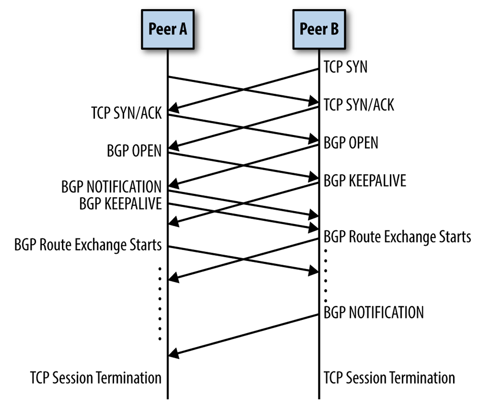
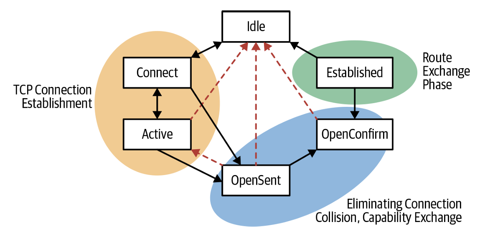
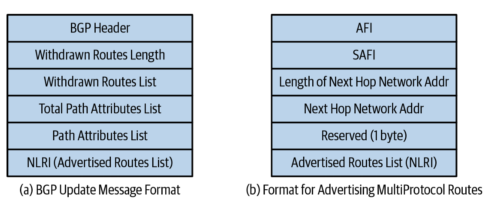
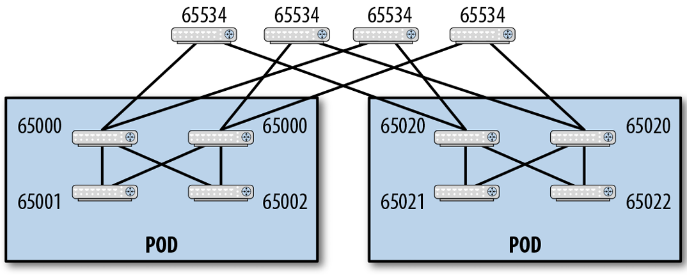
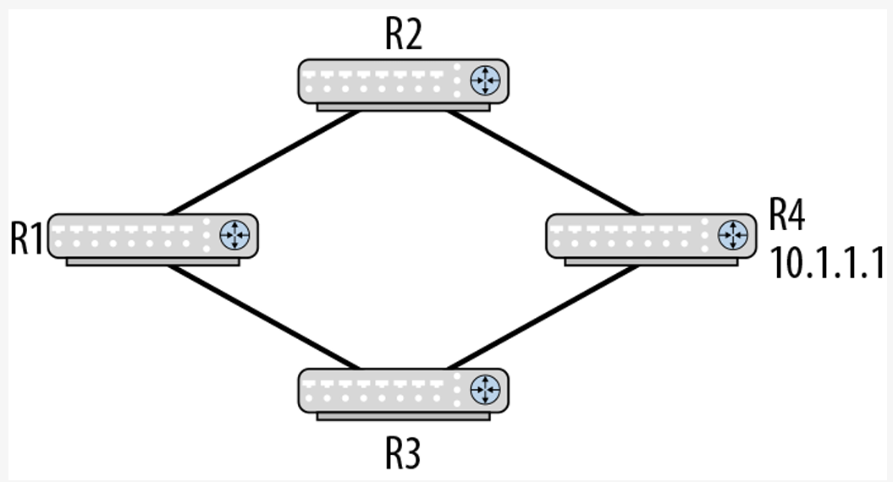
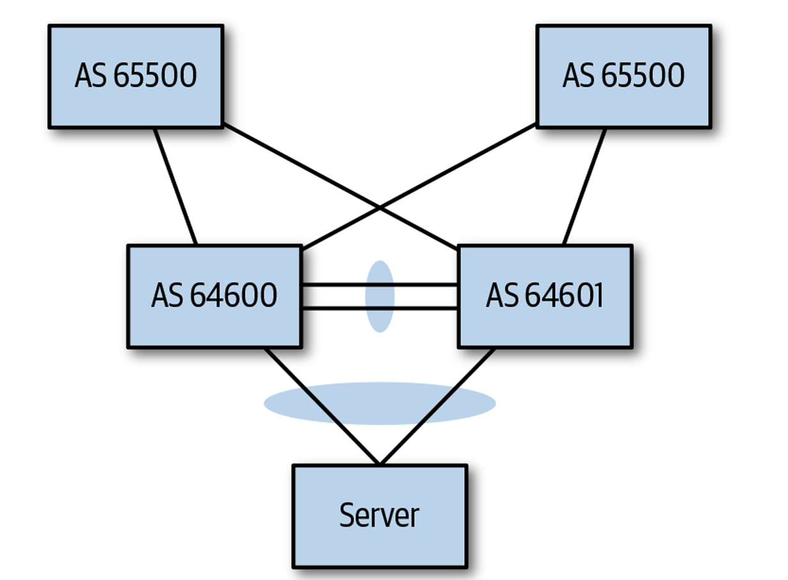

# BGP in the Data Center

* **歷史演進與神話**：BGP 誕生於 1989 年（替代舊有的 EGP），是建構全球網際網路的核心路徑向量協定。傳統上 BGP 常被誤解為極度複雜且收斂緩慢；然而在現代雲端原生資料中心（Clos 拓撲）中，經過簡化與參數調校後的 eBGP 已成為最簡潔、高效且具備極佳擴展性的 Underlay 路由協定。

---

## BGP 基礎概念 (Basic BGP Concepts)

#### 1. BGP 協定概觀 (BGP Protocol Overview)
* **路徑向量協定 (Path Vector Protocol)**：BGP 屬於路徑向量協定，傳遞包含 Autonomous System (AS) 列表的路徑向量，用以追蹤路由傳播歷程。
* **基於 TCP 傳輸 (TCP Port 179)**：BGP 是唯一直接運行於 TCP（Port 179）之上的路由協定，將封包分段、重傳與可靠交付完全交由 TCP 協議棧處理。
* **多協定支援 (Multiprotocol BGP / MP-BGP)**：能同時傳遞 IPv4、IPv6、MPLS 及 EVPN (VXLAN) 等多種位址族群的路由資訊。
* **eBGP vs. iBGP**：跨自治系統 (AS) 的對等建立稱為 **External BGP (eBGP)**；同自治系統內部的對等建立稱為 **Internal BGP (iBGP)**，兩者適用不同的選路與通告規則。

#### 2. BGP 會話建立與連線衝突 (BGP Peering)
* **對等實體關係 (Peer-to-Peer)**：BGP 採用 Peer-to-Peer 模式，兩端皆可發起 TCP 連線。
* **連線衝突解決 (Connection Collision Resolution)**：
  * 當兩端同時發起 TCP 連線時，會產生「連線衝突 (Connection Collision)」。
  * BGP 依據 **Router-ID（無符號 32 位元整數）** 進行仲裁：由 **Router-ID 較高者發起的 TCP 連線勝出**，另一條連線則會被直接關閉。
* **被動連線 (Passive Connection)**：允許特定端點（如 Server 端的 Kube-router）僅被動等待路由器發起連線。

#### BGP peering timeline sequence diagram

* 展示了兩台 BGP 路由器 (Router A 與 Router B) 從發起 TCP 建立、解決連線衝突，到互相交換 BGP Open 與 Keepalive 訊息的完整時間軸時序圖。
* 說明了雙向同時發起 TCP 179 連線時，系統如何比對 Router-ID 並保留單一 TCP 管道，隨後透過 OPEN 訊息協商 Capabilities 並轉入 Established 狀態。

#### 3. BGP 狀態機 (BGP State Machine)
* **三大階段**：TCP 連線建立、能力協商與衝突消除、路由資訊交換。
* **核心狀態演進**：`Idle` \\(\rightarrow\\) `Connect` \\(\rightarrow\\) `Active` \\(\rightarrow\\) `OpenSent` \\(\rightarrow\\) `OpenConfirm` \\(\rightarrow\\) **`Established`**（成功建立路由交換）。

#### BGP state machine

* 狀態轉移圖。實線標示正常狀態演進（Idle 至 Established），虛線標示發生錯誤（如 Connect/Hold Timer 逾時、TCP 握手失敗）時退回 Idle 狀態的事件路徑。
* 為維運人員進行排錯（Troubleshooting）提供標準參考，當 CLI 顯示狀態卡在 `Active` 或 `Connect` 時，能精確推導出 TCP 握手或防火牆配置的異常。

#### 4. 自治系統號碼 (Autonomous System Number, ASN)
* **定義**：全球唯一的 32 位元識別碼，用以標示單一管理域與路徑策略。
* **格式類型**：包含 2-byte ASN（如 `65000`）與 4-byte ASN（如 `4200000000`）。資料中心內部廣泛採用**私有 ASN (Private ASNs)**。

#### 5. BGP 能力協商 (BGP Capabilities)
* 基於 **RFC 5492**，在 BGP OPEN 訊息中動態協商雙方支援的位址族群 (AFI/SAFI) 與擴展功能。

#### 6. BGP 屬性與社群 (Attributes, Communities, Extended Communities)
* **路徑屬性 (Path Attributes)**：採用 **TLV (Type-Length-Value)** 格式封裝（如同貼在路由上的「Post-it notes」便條紙），用於最優路徑計算（如 `AS_PATH`）。
* **Standard Communities (4-byte)**：由 2-byte ASN 與 2-byte 管理標籤組成，用於對路由進行邏輯分組與策略控制。
* **Extended Communities (8-byte) & Large Communities (12-byte)**：擴展支援 4-byte ASN，EVPN/VXLAN 即大量採用 Extended Communities 傳遞 Router MAC 與 Route Target (RT)。

#### 7. BGP 最優路徑決策機制 (BGP Best-Path Computation)
* **記憶口訣 (Denise Fishburne Mnemonic)**：
  > *"**W**ise **L**ip **L**overs **A**pply **O**ral **M**edication **E**very **N**ight"*

####  BGP 最優路徑評比指標對照
| 口訣首字 | BGP 評比指標 (Metric) | 資料中心實務關注度 |
| :--- | :--- | :--- |
| **W**ise | **Weight** (Cisco 私有) | 很少使用 |
| **L**ip | **LOCAL_PREFERENCE** | 僅用於 Graceful Shutdown |
| **L**overs | **Locally originated** (本地宣告路由) | **關鍵關注點**（優先於 BGP 學習路由） |
| **A**pply | **AS_PATH Length** (AS 路徑長度) | **關鍵關注點**（路徑最短者勝出） |
| **O**ral | **ORIGIN** (IGP < EGP < Incomplete) | 預設對齊 |
| **M**edication | **MED** (Multi-Exit Discriminator) | 很少使用 |
| **E**very | **eBGP over iBGP** | 純 eBGP 架構下不適用 |
| **N**ight | **Nexthop IGP Cost** | 相同 |

* **資料中心極簡原則**：在 Clos 拓撲中，**僅使用 Locally Originated 與 AS_PATH 長度** 進行選路比較。

#### 8. BGP 訊息類型與 Update 格式 (BGP Messages)

#### BGP 訊息類型與用途
| 訊息類型 (Message Type) | 主要用途 (Use) | 發送週期 (Periodicity) |
| :--- | :--- | :--- |
| **Open** | 建立會話、交換 Router-ID 與 Capabilities | 僅會話建立時發送一次 |
| **Update** | 宣告新路由 (NLRI) 或撤銷舊路由 (Withdraws) | 僅在路由資訊變更時觸發 |
| **Keepalive** | 保持會話存活的心跳訊號 | 定期發送（預設 60 秒，DC 調為 3 秒） |
| **Notification** | 發生錯誤或主動關閉連線時發送告警 | 錯誤或關閉時發送 |
| **Route Refresh** | 請求對等節點重新發送全量路由資訊 | 按需發送 |

#### BGP update message and format for multiprotocol network addresses

* **(a)**：展示標準 IPv4 BGP Update 封包結構，包含 Withdrawn Routes、Path Attributes List (含 Communities) 及 NLRI (IPv4 前綴)。
* **(b)**：展示 MP_REACH_NLRI (RFC 4760) 擴展屬性結構，將 AFI/SAFI、Next-Hop 位址（如 IPv6 或是 VTEP IP）以及多協定 NLRI 統一封裝於 Path Attribute 內部。
* 說明了 BGP 如何透過 MP_REACH_NLRI 實現單一 Update 封包同時攜帶 IPv4、IPv6 與 EVPN 虛擬網路路由的能力。

---

## 針對資料中心優化與改造 BGP (Adapting BGP to the Data Center)

#### 1. 全網採用 eBGP 替代 iBGP (eBGP Versus iBGP & Flying Solo)
* **揚棄 iBGP 的理由**：iBGP 具備複雜的水平分割 (Split Horizon) 限制，需配置全網狀 (Full Mesh) 或 Route Reflectors (RR)。其選路規則極其繁瑣且容易產生 Vendor Lock-in。
* **eBGP 獨挑大樑 (Flying Solo)**：在資料中心內，**eBGP 作為唯一的內部路由協定 (IGP)**，完全不需要搭配 OSPF 或 IS-IS。

#### 2. 私有 ASN 規劃 (Private ASNs)
* **範圍**：
  * 2-byte 私有 ASN：`64512 – 65534`（共 1,023 個）。
  * 4-byte 私有 ASN：`4200000000 – 4294967294`（約 9,500 萬個，絕不枯竭）。
* **嚴禁使用公有 ASN 的理由**：避免人為配置錯誤將內部路由洩漏 (Leak) 至網際網路，引發全球 BGP 路由劫持災難（如誤用 Twitter 的公有 ASN）。

#### 3. BGP 在 Clos 拓撲中的 ASN 分配模型 (BGP's ASN Numbering Scheme)
* **黃金分配規】**：
  * **Leaf (ToR)**：每台 Leaf 交換器配置**獨立的私有 ASN**。
  * **Spine (Pod 內)**：同一 Pod 內的所有 Spine 配置**相同的私有 ASN**。
  * **Super-Spine**：全網所有 Super-Spine 配置**相同的私有 ASN**。

#### BGP ASN numbering in a three-tier Clos topology

* 展示了三層 Clos 拓撲的 ASN 劃分。Pod 1 的 Spine (S11, S12) 均為 `ASN 65100`；Pod 2 的 Spine (S21, S22) 均為 `ASN 65200`；頂層 Super-Spine (SS1–SS4) 均為 `ASN 65000`；底層各 Leaf 擁有獨立 ASN（`65001`, `65002` ...）。
* **架構解析**：
  * **防環與「自頂向下 (Top-Down)」選路**：由於同層 Spine 擁有相同 ASN，BGP 的 `AS_PATH` 防環機制會自動阻斷同層間的橫向對彈。
  * **解決 Path Hunting 爆發**：當某台 Leaf 斷線時，撤銷訊息僅局部傳播至直連 Spine，不會在 Spine 之間引發無休止的路徑搜尋震盪。

#### Sample topology to illustrate path hunting

* 展示 R1 至 R4 四台路由器的獨立 ASN 網格拓撲。當 R4 節點死亡時，R1 尚未收到 R2 的撤銷訊息前，會誤以為經由 R2 仍可到達 R4，進而在 R1-R2-R3 之間展開路徑搜尋 (Path Hunting)。
* 說明了若未正確規範 ASN（例如讓所有 Leaf/Spine 亂配不同 ASN），當節點故障時，BGP 會陷入類似 Distance Vector 的 Count-to-Infinity 路徑搜尋，導致全網 CPU 與訊息暴增。

#### 4. 多路徑選路與放寬 AS_PATH 比對 (Multipath Selection)
* **傳統 ECMP 限制**：預設 BGP 要求 `AS_PATH` 長度相同**且裡面的 ASN 必須完全一致**才能進行 ECMP 負載分流。
* **雙掛伺服器與多活服務的痛點**：當伺服器雙掛 (Dual-attached) 到兩台不同 ASN 的 Leaf 時，上層 Spine 收到兩條路由長度相同但 ASN 不同的更新，預設會放棄 ECMP 僅選一條。

#### The need for looking at AS_PATH lengths only

* 展示 Server 雙掛至 Leaf 1 (`ASN 64600`) 與 Leaf 2 (`ASN 64601`)。Spine 收到來自 Leaf 1 (`AS_PATH: 64600`) 與 Leaf 2 (`AS_PATH: 64601`) 的 `10.1.1.0/24` 宣告。
* **架構與解法 (`bestpath as-path multipath-relax`)**：
  * *問題*：預設 BGP 拒絕跨不同 ASN 進行 ECMP 分流。
  * *解法*：必須在全網交換器顯式開啟 **`bestpath as-path multipath-relax`** 選項，強制 BGP **只要 `AS_PATH` 長度相等即視為等價路徑**，解開 ECMP 負載分流限制。

#### 5. 壓榨極速收斂：BGP 定時器微調 (Fixing BGP's Convergence Time)
傳統電信網 BGP 追求「穩定高於一切」；而資料中心 BGP 則追求「極速故障捕捉與收斂」：

1. **通告間隔定時器 (Advertisement Interval)**：
   * *傳統預設*：30 秒（抑制更新頻率）。
   * **資料中心調校**：**必須強制設為 `0` 秒**！一旦路由發生變更立即發送 Update，使 eBGP 收斂速度完全媲美 OSPF/IS-IS。
2. **心跳與保持定時器 (Keepalive & Hold Timers)**：
   * *傳統預設*：Keepalive 60 秒，Hold Timer 180 秒（需 3 分鐘才判定 Peer 死亡）。
   * **資料中心調校**：**設定 Keepalive 3 秒，Hold Timer 9 秒**。
   * **結合 BFD**：實體鏈路斷開由 **BFD（微秒級）** 捕捉；3s/9s 定時器則專門用以捕捉 BGP 進程卡死 (Hang) 的軟體異常。
3. **重新連線定時器 (Connect Timer)**：
   * *傳統預設*：60 秒。
   * **資料中心調校**：**降為 10 秒**，加速鏈路復原後的連線重建。

---

### 資料中心 BGP 最佳實踐參數總結表

| 配置維度 | 傳統電信網 / WAN 預設值 | 資料中心 (Clos) 最佳實踐 | 修正目的與效益 |
| :--- | :--- | :--- | :--- |
| **協定架構** | eBGP + iBGP + IGP (OSPF) | **僅使用 eBGP (Flying Solo)** | 消除 iBGP RR 與多協定維運複雜度 |
| **ASN 空間** | 全球公有 ASN | **私有 ASN (2-byte / 4-byte)** | 防止內部路由洩漏導致網際網路劫持 |
| **ASN 拓撲規劃** | 隨意指派 | **Leaf 獨立，Spine 按 Pod 統一** | 強制自頂向選路，消除 Path Hunting |
| **ECMP 選路** | 嚴格比對相同 ASN | **開啟 `multipath-relax`** | 允許不同 Leaf/Server 之間進行多路徑分流 |
| **Advertisement Interval** | 30 秒 | **`0` 秒** | 實現毫秒級路由更新與極速收斂 |
| **Keepalive / Hold Timer** | 60 秒 / 180 秒 | **3 秒 / 9 秒 (搭配 BFD)** | 微秒級捕捉硬體故障，3 秒捕捉軟體卡死 |
