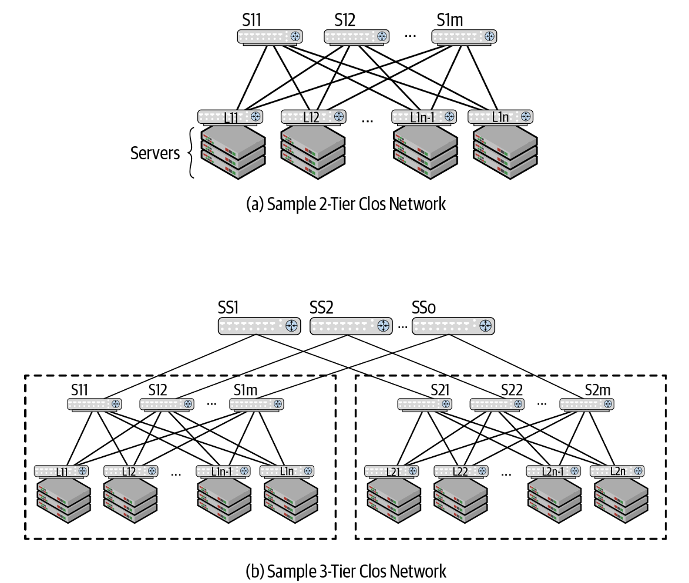
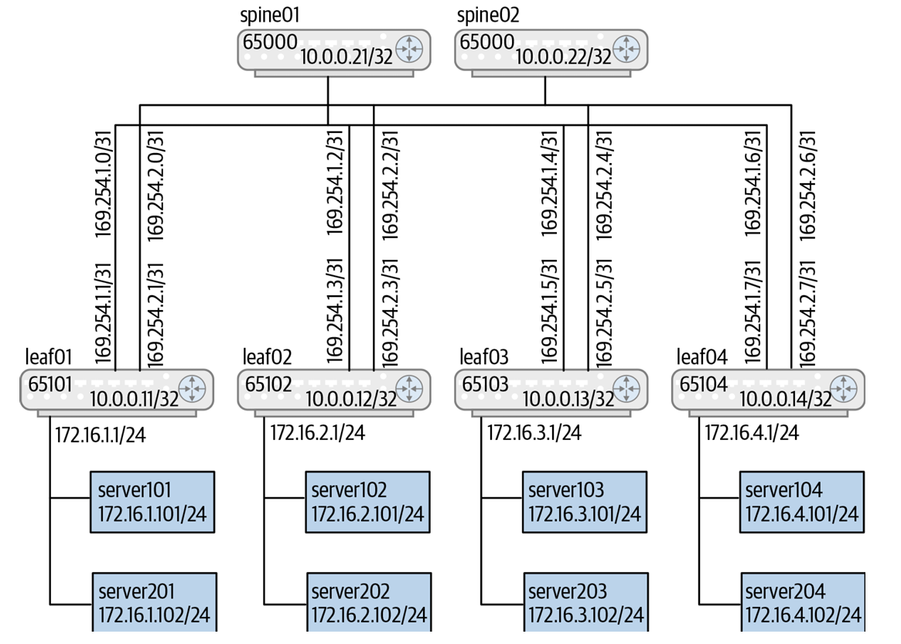
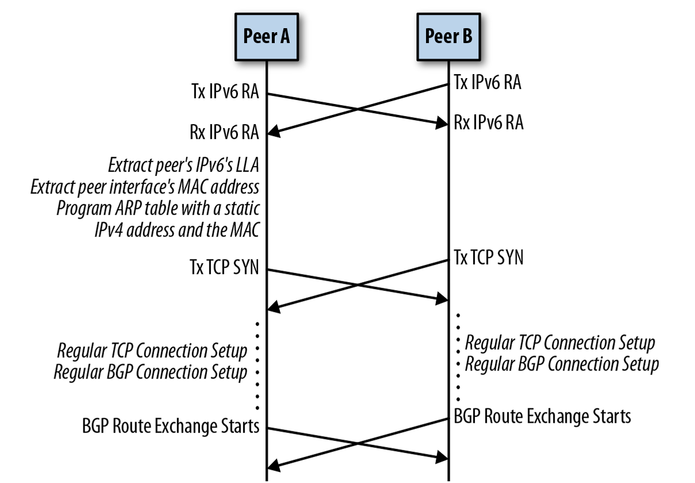
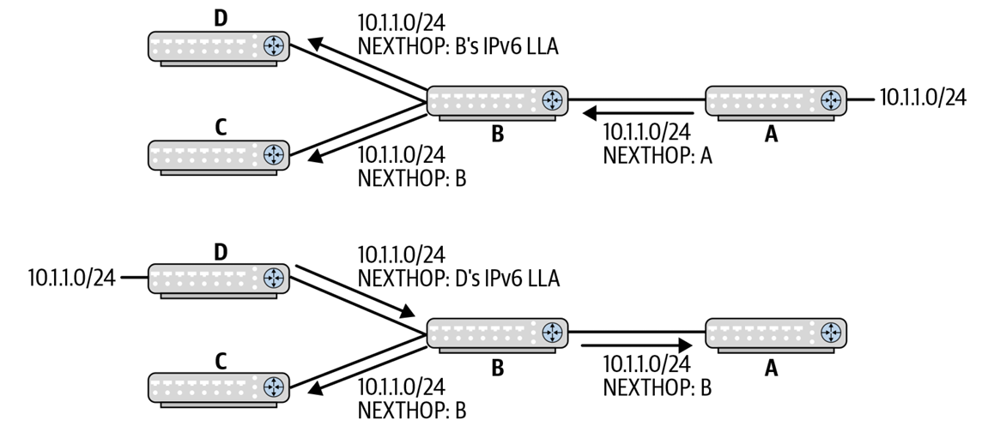
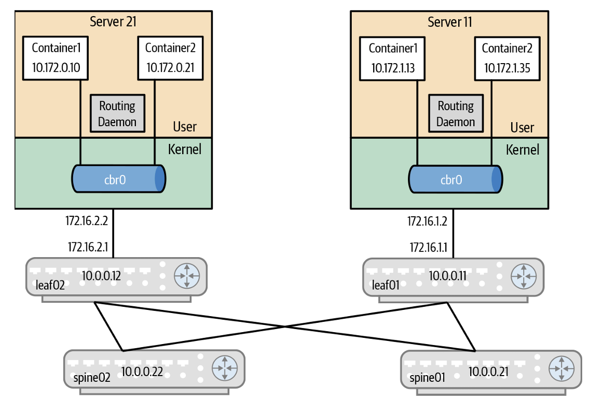

# Deploying BGP（部署 BGP 協定）

* **引言思考**：引用 Scott Adams 的名言：*「Tell me what you need, and I’ll tell you how to get along without it.（告訴我你需要什麼，我就能教你如何在沒有它的情況下運作。）」*。
* **章節目標**：本章旨在指引網路工程師與架構師如何在實務中設定與維運資料中心 Clos 拓撲下的 BGP 協定，對比傳統具號配置與現代 Unnumbered 介面，並深入探討多租戶 VRF、K8s 容器對等及平滑升級排水機制。

---

## BGP 核心配置概念 (Core BGP Configuration Concepts)

* **BGP 配置的三層階層結構**：
  1. **全局 BGP 配置 (Global BGP Configuration)**：包含 `router-id` 定義、全局 Timers、鄰居建立基礎參數及全局路由策略。
  2. **鄰居特定配置 (Neighbor-Specific Configuration)**：包含非全局的 Timers、單一對等點的連線屬性與位址族群無關之參數。
  3. **位址族群特定配置 (Address-Family-Specific Configuration / AFI/SAFI)**：針對特定位址族群 (如 IPv4 Unicast、IPv6 Unicast、L2VPN EVPN) 進行 Neighbor 激活 (`activate`)、路由發布 (宣告) 以及套用過濾策略 (Route-Maps)。

#### Clos topologies used for BGP configuration

* 展示了兩種用於 BGP 部署示範的 Clos 拓撲結構：
  * **(a)**：兩層 Leaf-Spine 拓撲（由 Leaf 1..Ln 與 Spine 1..Sm 組成）。
  * **(b)**：三層 Pod / Cluster 拓撲（由 Pod 1..k、Spine 1..Sm 與 Super-Spine 1..Sp 組成）。
* **架構解析**：確立了全章配置的拓撲藍圖。在兩層拓撲中，Spine 共享同個私有 ASN，Leaf 擁有各自獨立的私有 ASN；在三層拓撲中，Pod 內 Spine 共享 ASN，Super-Spine 共享獨立 ASN，此規劃能確保自頂向下選路並防止 Path Hunting 路由震盪。

---

## 傳統兩層 Clos 拓撲 IPv4 BGP 配置 (Traditional Configuration for a Two-Tier Clos Topology: IPv4)

#### A traditional BGP setup

* 傳統具號介面 (Numbered Interfaces) 的兩層 Clos BGP 拓撲。Spine01/Spine02 配置 `ASN 65000`；Leaf01 至 Leaf04 分別配置獨立 `ASN 65011` 至 `65014`。交換器間的點對點實體介面配置了 `/31` 網段 IP (如 `169.254.1.0/31`)，伺服器連接在 Leaf 的 VLAN10 (`172.16.1.1/24`) 下。
* **架構解析**：展現了傳統具號 BGP 的典型佈局。採用 eBGP Peering 時，每台 Spine 必須明確寫出對端 Leaf 的實體 `/31` IP 與對應的遠端 ASN (`remote-as`)。

#### 傳統具號 BGP 配置的五大維運痛點

1. **自動化極其困難**：每台 Spine 與 Leaf 的 IP 位址與 ASN 皆不同，無法撰寫統一的變數樣板。
2. **強依賴對端 IP 與 ASN**：必須精確配對對端 IP 與遠端 ASN，人為輸入錯誤時連線直接失敗。
3. **無謂的重複宣告**：必須對每個 Neighbor 重復寫入 `advertisement-interval`、`bfd`、`activate` 等指令。
4. **路由表膨脹**：使用 `redistribute connected` 會將無用的點對點介面 `/31` IP 散播至全網，增加 RIB/FIB 負擔與處理開銷。
5. **預設無 ECMP 多路徑**：BGP 與 OSPF 不同，必須顯式配置 `maximum-paths` 才能開啟 ECMP 多路徑負載分流。

---

## 鄰居範本與 Peer Group 簡化 (Peer Group)

* **Peer Group 運作機制**：
  * **屬性繼承 (Templating)**：定義一個具名的 Peer Group（如 `ISL`），將共通的連線參數（如 `bfd`、`advertisement-interval 0`、AFI/SAFI `activate`）綁定在 Peer Group 上。
  * **簡化寫入**：具體 Neighbor 只需指派 `neighbor <IP> peer-group ISL` 即可繼承所有屬性，大幅減少設定檔行數。
  * **限制**：在傳統具號模型下，由於每台 Leaf 的遠端 ASN 不同，`remote-as` 仍無法放入 Peer Group 內部。

---

## 路由策略與 Route Maps (Routing Policy & Route Maps)

* **路由策略本質**：由一連串 `if-then-else` 邏輯組成，用以決定路由的接受 (Accept)、拒絕 (Reject) 或屬性修改。
* **Route Maps 分類器 (Classifiers)**：
  * 支援 `as-path`、`ip` (Prefix-list)、`ipv6`、`interface` 及 `peer` 等匹配條件。
* **安全寫入原則 (Writing Secure Route Maps)**：
  * **「明確許可，其餘隱式拒絕 (Explicit Permit, Implicit Deny)」**：只寫入明確允許的網段或介面（如 Loopback `lo` 與伺服器 VLAN），其餘一律由預設末端的 Deny 擋下，可避免將點對點互連 IP 洩漏出去。
* **對系統效能與 CPU 的影響 (Dynamic Update Groups)**：
  * 當對等點極多時，逐一為每個 Peer 執行 Route Map 會極度消耗 CPU 並拉長收斂時間。
  * 現代 BGP 引擎 (如 FRR) 支援 **Dynamic Update Group**，能將擁有相同出站策略與 Capabilities 的 Peers 自動動態歸類為同組，僅執行一次 Route Map 運算即可廣播給全組，實現萬級 scaling。

---

## 提供資料中心合理的預設值 (Providing Sane Defaults for the Data Center)

* **擺脫電信網包袱**：傳統 BGP 預設值是為跨網際網路/電信網設計（強調穩定防震），用於資料中心時顯得極度笨重與不合時宜。
* **`frr defaults datacenter` 預設優化組合**：
  1. **預設啟用 eBGP 與 iBGP ECMP 多路徑 (Multipath)**。
  2. **通告間隔定時器 (Advertisement Interval) 歸零**（觸發極速更新）。
  3. **Keepalive / Hold Timers 調降為 3 秒 / 9 秒**。
  4. **預設開啟鄰居狀態變更日誌 (`log-neighbor-changes`)**。

---

## BGP Unnumbered：徹底消除介面 IP 變數 (BGP Unnumbered: Eliminating Pesky Interface IP Addresses)

#### 1. 兩大自動化突破：
* **`remote-as external`**：自動判定對端 ASN，只要與本地 ASN 不同即認定為 eBGP，無需寫死對端 ASN 數值。
* **直接綁定介面名稱 (`neighbor swp1 interface peer-group ISL`)**：徹底消除所有點對點互連介面的 IP 位址配置！

#### 2. BGP Unnumbered 的四大底層運作機制 (RFC 5549)：
1. **IPv6 Link-Local Address (LLA)**：介面啟用後自動生成 `fe80::` 區域連線位址。
2. **IPv6 Router Advertisement (RA)**：透過 IPv6 NDP 的 RA 訊息（多播發送）自動宣告與發現鄰居的 LLA 位址與 MAC 位址。
3. **TCP 179 握手**：直接利用對端的 IPv6 LLA 位址建立 TCP 179 BGP 會話。
4. **RFC 5549 (Extended Next Hop)**：在 BGP OPEN 訊息中協商能力，利用 **MP_REACH_NLRI** 傳遞「以 IPv6 LLA 作為下一跳的 IPv4 路由 NLRI」。
5. **軟體 dummy 介面轉發**：控制平面 RIB/Zebra 接收到 IPv6 LLA 下一跳後，在 Kernel FIB 中填入虛擬的 `169.254.0.1` 下一跳，並自動寫入對應的靜態 ARP 表條目，使硬體晶片與 Linux 轉發完全正常運作。

#### Packet sequence timeline for unnumbered BGP in FRR

* 時序圖展示：(1) 兩端交換 IPv6 RA 獲取對端 LLA 與 MAC；(2) 觸發 TCP 179 握手並發送 BGP OPEN 協商 RFC 5549 Capabilities；(3) 發送帶有 MP_REACH_NLRI 的 BGP UPDATE；(4) Zebra 在 Linux Kernel 寫入路由與 `169.254.0.1` 靜態 ARP。
* 完整還原了 BGP Unnumbered 從底層 LLA 探測到高層 IPv4 路由建立的零人工干預過程。

#### Sample topology to illustrate interoperability with RFC 5549

* 展示了異構網路互通拓撲。路由器 B 與 D 支援 RFC 5549，A 與 C 為不支援的傳統路由器。
* 證明了 RFC 5549 具備極佳的逐跳 (Hop-by-Hop) 互通性：當 Router B 將來自 A 的 IPv4 路由發給 D 時，自動將 Next-Hop 改寫為 IPv6 LLA；當把來自 D 的路由發給 C 時，則自動將 Next-Hop 改寫為傳統 IPv4 位址。

---

## 配置 IPv6 (Configuring IPv6)

* **單一 Session 雙棧傳送**：開啟 `address-family ipv6 unicast` 並激活鄰居。
* **優勢**：在現代 BGP 堆疊下，**只需建立單一 TCP BGP Session**，即可透過 MP_REACH_NLRI 同時攜帶 IPv4 與 IPv6 路由，無須像早期因軟體 Bug 而分開建立兩條會話。

---

## BGP 與 VRF 多租戶隔離 (BGP and VRFs)

* **非 VPN 模式下 (Hop-by-Hop VRF) 的多實例語法**：
  * 每一個 VRF 需獨立宣告一個 BGP 實例：`router bgp <ASN> vrf <VRF_NAME>`。
  * 實體介面/VLAN 子介面必須在 Linux OS 層先完成 VRF 綁定（如 `swp1.100` 綁定至 `private` VRF）。
* **設計問答 (FAQ)**：
  * *Router-ID 選用*：取用該 VRF 內部的 Loopback/邏輯介面 IP。
  * *ASN 選用*：同台交換器上的所有 VRF **建議統一使用相同的私有 ASN**（ASN 無需按 VRF 切分）。

---

## 與 Host/伺服器端 BGP 進行對等 (Peering with BGP Speakers on the Host)

#### Sample topology to illustrate Kube-router and leaf BGP peering

* 展示 Kubernetes 集群架構。Server11 與 Server21 執行 Kube-router (配發 `ASN 64512`)，內部 `cbr0` Bridge 分別為 Pod 配發 `10.172.1.0/24` 與 `10.172.2.0/24` 子網。Server 雙向建立 iBGP Mesh，並向上與 Leaf01/Leaf02 建立 eBGP Peering。
* 說明了雲端原生容器網路如何透過 BGP 將 Pod 路由直通實體 Fabric，實現無 NAT 的極速轉發。

#### BGP Dynamic Neighbors (動態鄰居技術)

* **解決 40+ 伺服器列舉痛點**：若機櫃有 40 台 Server，傳統設定需手動寫入 40 行 Neighbor IP，且未開機時會引發 Session 失敗告警。
* **被動開口模式 (Listen Range)**：
  * 在 Leaf 設定 `bgp listen range 172.16.1.0/24 peer-group SERVERS`。
  * Leaf 端轉為被動 (Passive) 狀態，僅靜態監聽來自該網段的 TCP 179 連線；並搭配 `bgp listen limit 20` 限制最大動態連線數以保護 CPU。

---

## BGP 與平滑升級維護 (BGP and Upgrades)

* **流量優雅引離 (Traffic Draining) 三大機制**：
  1. **`AS_PATH Prepend` (最常用)**：在發往 Neighbor 的 Outbound Route-Map 中設定 `set as-path prepend <ASN> <ASN>`，人為拉長 `AS_PATH` 長度，引導全網其他交換器自動將流量切離該節點。
  2. **`GRACEFUL_SHUTDOWN` Community (RFC 8326)**：對外通告帶有 `GRACEFUL_SHUTDOWN` 社群標籤的路由；收到此標籤的對等點會自動將該路由的 **`LOCAL_PREF` 調降為 0**，使其失去優先權。
  3. **`Max-MED`**：開啟 `bgp max-med administrative`，將 MED 值推至最大，降低其選路吸引力。

---

## 資料中心 BGP 部署最佳實踐 (Best Practices)

#### 11 大黃金部署準則：
1. **貫徹標準 ASN 規劃**（Leaf 獨立 ASN，Pod 內 Spine 共享 ASN）。
2. **全面優先採用 Unnumbered BGP**（徹底擺脫介面 IP 配置）。
3. **確保 Loopback 介面擁有合法 IP 並將其宣告至 BGP**。
4. **顯式開啟 ECMP 多路徑分流 (`maximum-paths`)**。
5. **強制開啟 `bgp bestpath as-path multipath-relax`**（允許長度相同但內容不同 ASN 的等價分流）。
6. **開啟鄰居變更詳細日誌 (`log-neighbor-changes`)**。
7. **採用單一 eBGP Session 承載多個 Address Families (IPv4/IPv6/EVPN)**。
8. **預設開啟 BFD**（捕捉實體單向與纜線異常）。
9. **對 Host/Server 建立 Route-Maps 防護**（嚴禁接收未授權之伺服器前綴）。
10. **對 Host 使用 BGP Dynamic Neighbors 並限制連線上限 (`listen limit`)**。
11. **絕不在 Spine 上執行路由摘要 (Summarization)，僅在 Leaf/Exit 邊界摘要**。
    * 在 Leaf-Spine 網路中，IP 路由前綴的聚合/摘要（Route Summarization / CIDR Aggregation）只能在最邊緣的 Leaf（葉交換器，包含 Border Leaf）上執行，絕對禁止在中間層的 Spine（脊交換器）或 Super-Spine 上進行路由摘要。
    
## 補充

#### 為什麼只在 Leaf 交換器做路由摘要是安全的？

* **點位址的完全直連 (Direct Attachment & Full Upstream Reachability)**
    * Leaf (ToR) 交換器是伺服器與子網直接附著的門戶。Leaf 掌握了其底下實體主機與容器的精確連通性
    * Leaf 上鏈連接了**所有的 Spine**。只要 Leaf 本身運作正常，即使它到某一台 Spine 的鏈路斷開，它仍可經由其他多條等價路徑（ECMP）保持與全網的連通。因此，Leaf 向上宣告摘要路由永遠不會因為單一上鏈中斷而誤導全網。
* 隔離控制平面複雜度 (Containing Control Plane Complexity)
    * 將子網與容器前綴的摘要限制在機櫃（Rack）或 Pod 邊緣（Border Leaf / Exit Leaf），能確保 Spine 骨幹層只需載入極簡的網段摘要，無須載入萬級的明細 `/32` 主機路由，實現極致的擴展性

#### 實務選型與部署建議 (Architectural Best Practices)
* **機櫃級網段收斂 (Subnet per Rack)**：盡可能將 IP 子網限制在單一機櫃（Leaf）內部，由 Leaf 直接向上宣告網段前綴
* **邊界邊緣摘要 (Border Leaf Summarization)**：在南北向出口（Exit Leaf / Border Leaf）執行路由摘要與私有 ASN 剝除，避免將資料中心 Fabric 內部的複雜路由暴露給外部 ISP 或 WAN
* **EVPN Overlay 架構下的權衡**：在 EVPN / VXLAN 環境中，雖然需要在 Leaf 間傳遞主機 `/32` MAC/IP (RT-2)，但在跨 Pod 或對外連接時，仍應在 Pod Exit Leaf 或 Border Leaf 上進行 RT-5 / 網段摘要宣告，嚴禁將廣播域無限延伸至 Spine