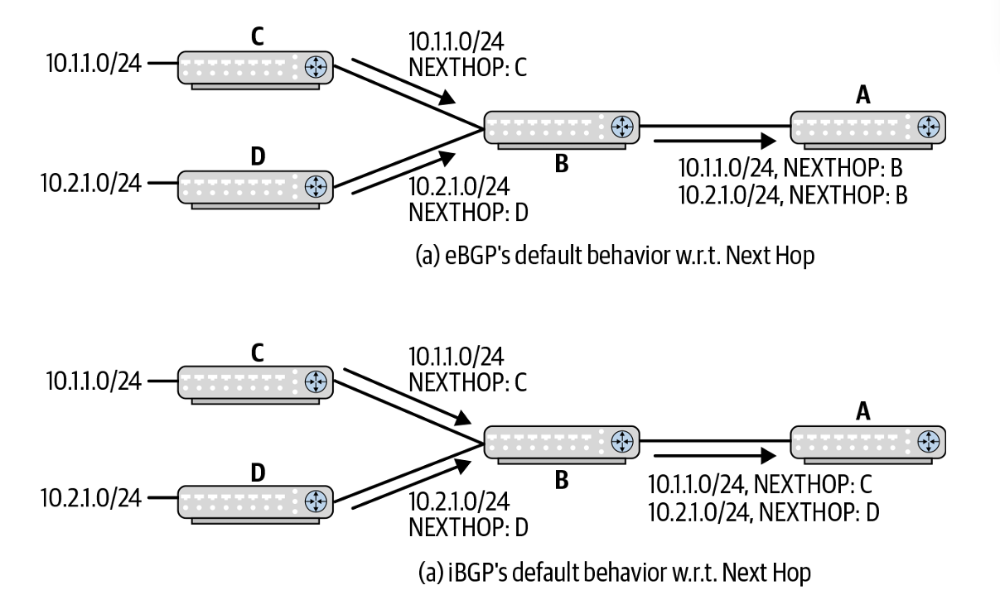
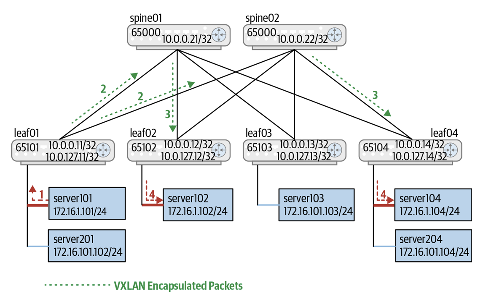
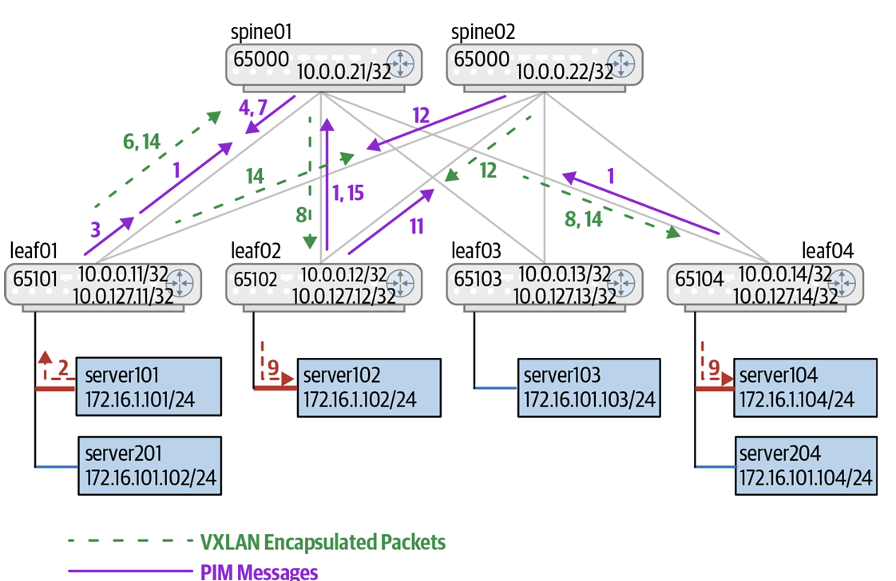
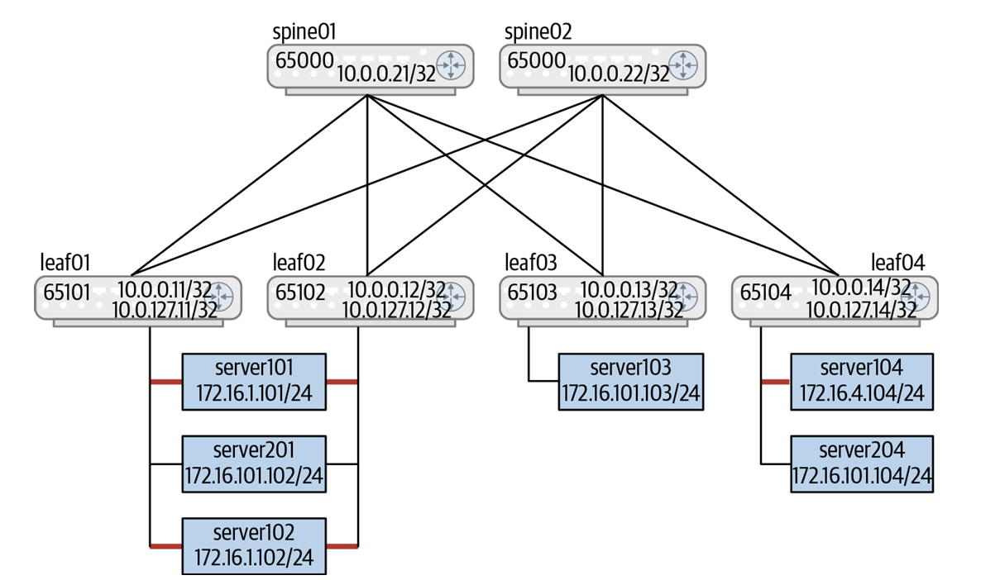
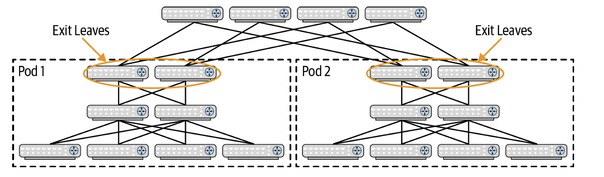

# EVPN in the Data Center

* **核心定義**：EVPN (Ethernet Virtual Private Network) 是網路虛擬化的控制平面（Control Plane）標準。其本質是在三層（L3）路由網路上，透過 BGP 協定建立虛擬的二層（L2）Overlay 重疊網路；在資料中心內部，EVPN 採用 **VXLAN** 作為資料平面（Data Plane）的封裝協定。
* **歷史背景**：EVPN 最初誕生於電信服務提供者（Service Provider）網路，用以替代傳統的 VPLS 協定。透過 IETF NVO3 與 L2VPN 工作小組的標準化（如 RFC 7432、RFC 8365），EVPN 已成為現代資料中心「無控制器 (Controller-less) VXLAN」的最佳解法。

---

## 為何 EVPN 如此流行？ (Why Is EVPN Popular?)
* **成熟控制協定與硬體支援**：EVPN 利用早已高度成熟且穩健的 **MP-BGP** 交換虛擬網路的可達性資訊，並在 2017 年獲得廣泛的商用交換晶片（Merchant Silicon，如 Broadcom Trident2+/Trident3、Mellanox Spectrum）對 **RIOT (Routing In and Out of Tunnels)** 的硬體級卸載支援。
* **擺脫集中式控制器鎖定**：企業無需依賴昂貴且維運複雜的集中式 SDN 控制器（如 OVSDB 模型），即可透過開源路由套件（如 FRR）實現標準化的分散式 Overlay 控制平面。

---

## 控制平面必須解決的核心問題 (The Problems Control Plane Must Address)
* **Overlay 控制平面的四大基本問題**：
  1. 提供內層位址（MAC/IP）與外層隧道位址（VTEP IP）的映射關係。
  2. 識別封包所屬的虛擬網路 (VNI)。
  3. 識別採用的隧道封裝型態（如 VXLAN）。
  4. 精確告知哪些 VTEP 對哪些虛擬網路感興趣，使 **BUM（廣播、未知單播、多播）** 流量僅精準分發給感興趣的端點。
* **EVPN 的進階擴展能力**：
  * **ARP/ND 抑制 (ARP/ND Suppression)**：減少跨全網的廣播淹沒。
  * **對稱式/非對稱式 Overlay 路由 (Inter-VXLAN Routing)**。
  * **多雙歸多路徑 (Multihomed Nodes / Multi-homing)**：原生取代專有 MLAG。
  * **L3 多播支援**。

---

## VTEP 的最佳部署位置 (Where Does a VTEP Reside?)
* **Host 端 VTEP (公有雲模式)**：將 VTEP 下沉至伺服器/Hypervisor 端，使 Spine/Leaf 交換器僅作純粹的 L3 實體路由，達到極致的基礎設施不可變性（Immutable Infrastructure）與高擴展性（公有雲 AWS/Azure 的 VPC 模型）。
* **Leaf 端 VTEP (實體資料中心主流)**：在 Clos 拓撲中，最理想的實體 VTEP 位置是 **Leaf (ToR) 交換器**。Spine 與 Super-Spine 完全無需感知虛擬網路狀態，僅專注於 Underlay 封包的高速轉發。

---

## Underlay 與 Overlay 協定組合架構 (One Protocol to Rule Them All, Or…?)

#### 1. iBGP 特性 (iBGP Characteristics)
* **全網狀瓶頸與 Route Reflector (RR)**：iBGP 具備水平分割限制，全網狀對等（Full Mesh）無法擴展。必須引入 **路由反射器 (Route Reflector, RR)** 進行 Hub-and-Spoke 匯聚。



* 展示 eBGP 與 iBGP 宣告路由時 Next-Hop 的改寫差異。eBGP 預設會執行 `next-hop self` 改寫為宣告者的 IP；而 iBGP 在 RR (B) 反射路由給 A 時，**不會修改原始 Next-Hop**，使 A 可繞過 B 直接與 C 建立資料通道。


```text
               +--------------------------+          +--------------------------+
               |  Route Reflector Server  |   ...    |  Route Reflector Server  |
               +------------+-------------+          +------------+-------------+
                             \                           /
                              \                         /
                       +-------+-----------------------+-------+
                       |                                       |
                       |            L3 Clos Network            |
                       |                                       |
                       +-------+-----------+-----------+-------+
                              /            |            \
                             /             |             \
              +-------------+       +------+------+       +-------------+
              | Compute Srv |       | Compute Srv |       | Compute Srv |
              +-------------+       +-------------+       +-------------+
              | Compute Srv |       | Compute Srv |       | Compute Srv |
              +-------------+       +-------------+       +-------------+
              | Compute Srv |       | Compute Srv |       | Compute Srv |
              +-------------+       +-------------+       +-------------+
              \_________________________________________________________/
                           Compute Servers Acting as VTEP,
                                    Running EVPN
```

* 展示將 Spine 作為 iBGP Route Reflector，Leaf 之間透過 RR 交換 Overlay 路由，而 Underlay 純粹進行 L3 IP 轉發的架構。

#### 2. 獨立與統一協定模式對比 (Separate Protocols vs. eBGP Only)
* **傳統雙協定模式 (OSPF/IS-IS + iBGP)**：傳統廠商習慣以 OSPF/IS-IS 建立 Underlay，以 iBGP (Spine 作為 RR) 建立 Overlay。缺點是維運協定過多、排錯困難，且更換 Underlay 極具破壞性。
* **純單一 eBGP 模式 (eBGP Only - 最佳實踐)**：由 FRR 率先實現，**僅建立單一 eBGP Session**，同時攜帶 IPv4/IPv6 Underlay 路由與 L2VPN EVPN Overlay 路由。Spine 透過自動保留 Overlay 資訊（如 Cisco 的 `retain-route-target-all`）傳遞給其他 Leaf，極大地簡化了架構與配置。

---

## 支援虛擬網路路由的 BGP 構件 ( BGP Constructs)

由於不同虛擬網路（VNI）可能存在重疊的私有 IP 或 MAC 位址（Overlapping Addresses），BGP 導入了 **RD** 與 **RT** 構件來確保全網唯一性與精確的路由導入/匯出。

#### 1. 路由區別符 (Route Distinguisher, RD)
* **長度與作用**：8 位元組（8-byte）數值，附加於虛擬網路位址前，將私有位址轉換為全球唯一的 VPN 位址。

```text
0               15 16                            31
+-+-+-+-+-+-+-+-+-+-+-+-+-+-+-+-+-+-+-+-+-+-+-+-+-+-+
|       Type       | Device Loopback's IPv4 Address |
|     (2 Bytes)    |         (Upper 2 Bytes)        |
+-+-+-+-+-+-+-+-+-+-+-+-+-+-+-+-+-+-+-+-+-+-+-+-+-+-+
| Device Loopback's|                                |
|   IPv4 Address   |          VNI-Specific          |
|  (Lower 2 Bytes) |           (2 Bytes)            |
+-+-+-+-+-+-+-+-+-+-+-+-+-+-+-+-+-+-+-+-+-+-+-+-+-+-+
```

* 展示 EVPN 的 RD 結構（Type 1，8 字節）：包含 2-byte Type、**4-byte Router IPv4 Address（路由器 Loopback IP）** 以及 **2-byte Local VNI Encoding**。
* 透過將路由器的 Loopback IP 融入 RD 中，即使不同 Leaf 擁有相同的 VNI 或主機 IP，其生成的 RD 在全網依然絕對唯一。

#### 2. 路由目標 (Route Target, RT)


* **長度與作用**：8 位元組（8-byte）BGP 擴展社群（Extended Community），標示該路由屬於哪一個虛擬網路，控制路由導入（Import RT）與匯出（Export RT）至本地 VRF/VNI 表格。

```text
0               15 16 17  19 20  23 24           31
+-+-+-+-+-+-+-+-+-+-+-+-+-+-+-+-+-+-+-+-+-+-+-+-+-+-+
|      ASN          |A| Type | D-ID  |  Service ID  |
|   (2 Bytes)       | | (3b) | (4b)  |   (1 Byte)   |
+-+-+-+-+-+-+-+-+-+-+-+-+-+-+-+-+-+-+-+-+-+-+-+-+-+-+
|    Service ID     |
|    (2 Bytes)      |
+-+-+-+-+-+-+-+-+-+-+

```

* 展示 EVPN-VXLAN 的 RT 結構：包含 **2-byte ASN**、**1-bit Auto-derived (A) bit**、**3-bit Type (VXLAN 為 1)**、**4-bit Domain-ID** 以及 **3-byte (24-bit) Service ID (VNI)**。


1. ASN (2 Bytes / 16 bits)：
    * 自治系統號碼（Autonomous System Number），通常填入資料中心內部運行的 2 位元組 BGP AS 號。
2. A（1 bit）：
    * 標記位元（Flag / Attribute bit），通常用於識別特定的位址族屬性或自訂策略。
3. Type（3 bits）：
    * 一個 3 位元的欄位，用以指示 EVPN 中所使用的封裝技術。若為 VXLAN 則其值為 1，若為 VLAN 則為 0。
4. D-ID（Domain ID，4 bits）：
    * 4 個位元，通常為 0。在某些情況下，若 VXLAN 編號空間存在重疊（Overlap），此欄位可用於限定該 VNI 所隸屬的管理網域（Administrative domain）。
5. Service ID（共 3 Bytes / 24 bits）：
    * 共 3 個位元組，包含虛擬網路識別碼（Virtual network identifier）。若為 VXLAN，則填入 3 位元組的 VNI；若為 VLAN，則為 12 個位元（佔用該 3 位元組欄位的低位 12 bits）。

#### 3. EVPN 5 大核心路由類型 (EVPN Route Types)

| 路由類型 (Route Type) | 攜帶內容 (NLRI Payload) | 資料中心主要用途 (Primary Use) |
| :--- | :--- | :--- |
| **RT-1 (Ethernet Segment Auto-Discovery)** | Ethernet Segment ID (ESI), Label | 多雙歸 (Multihoming) 節點自動發現與 ES 狀態宣告 |
| **RT-2 (MAC/IP Advertisement)** | MAC Address, VNI, IP Address | **最核心條目**：宣告特定 VNI 內的 {MAC, IP} 綁定與 VTEP 映射 |
| **RT-3 (Inclusive Multicast Ethernet Tag)** | VNI, VTEP IP, PMSI Attribute | **BUM 流量分發**：宣告 VTEP 對特定 VNI 的加入意願及 BUM 複製模式 |
| **RT-4 (Designated Forwarder Election)** | ESI, VTEP IP | **指定轉發者選舉**：確保多雙歸介面上僅有一台 VTEP 轉發 BUM 流量 |
| **RT-5 (IP Prefix Route)** | IP Prefix, Subnet Mask, L3 VNI | **網段與網關路由**：宣告網段摘要路由、預設路由 (`0.0.0.0/0`) 或跨 VRF 路由 |
| **RT-6 (BGP Router MAC advertisement)** | 群播群組成員資格 (Multicast group membership) | 包含連接至 VTEP 的端點對哪些群播群組感興趣之資訊（IGMP 加入訊息宣告） |

## EVPN 與橋接轉發流程 (EVPN and Bridging)

#### Sample EVPN bridging topology



* 跨 Leaf01~Leaf04 的 Overlay 橋接拓撲。紅色 VNI (172.16.1.0/24) 覆蓋 Leaf01, Leaf02, Leaf04；藍色 VNI (172.16.101.0/24) 覆蓋 Leaf03, Leaf04。Spine01/Spine02 純作 Underlay 路由。
* 頭端複製 Ingress Replication 轉發步驟：
  1. Server101 發送 ARP 廣播，Leaf01 收到後在本地學習 MAC，透過 RT-3 確定只有 Leaf02 與 Leaf04 訂閱了紅色 VNI。
  2. Leaf01 執行**頭端複製 (Ingress Replication)**，封裝兩份 VXLAN 單播封包分別發往 Leaf02 與 Leaf04 的 VTEP IP (`10.0.127.12` 與 `.14`)。
  3. Leaf02/Leaf04 解封裝後執行 **Split-Horizon (水平分割) 檢查**，僅向本地實體 Server 介面轉發，嚴禁將封包再次淹沒回 VXLAN Overlay。
  4. Leaf01 與 Leaf04 分別透過 **BGP UPDATE (RT-2)** 向全網宣告各自學到的本地 MAC，各 VTEP 據此填入遠端 MAC 表，後續單播流量直接以 VXLAN 隧道精確對彈。

#### EVPN bridging packet sequence with routed multicast underlay


* 採用 Underlay IP 多播（PIM-SM Anycast RP）處理 BUM 流量的複雜時序圖。
* 痛點：VTEP 需發送 PIM Join/Register，並經歷 RPT 到 SPT 的切換；因其極度複雜且容易引發 PIM 軟狀態不一致，**現代資料中心一律強烈建議採用頭端複製 (Ingress Replication)**。

#### Format of MAC Mobility extended community

```text
0             7 8            15 16          23 24 25         31
+-+-+-+-+-+-+-+-+-+-+-+-+-+-+-+-+-+-+-+-+-+-+-+-+-+-+-+-+-+-+-+-+
|     Type      |    Subtype    |     Rsvd      |S|    Rsvd     |
|   (= 0x06)    |   (= 0x00)    |   (= 0x00)    | |  (= 0x00)   |
+-+-+-+-+-+-+-+-+-+-+-+-+-+-+-+-+-+-+-+-+-+-+-+-+-+-+-+-+-+-+-+-+
|                        Sequence Number                        |
|                           (4 Bytes)                           |
+-+-+-+-+-+-+-+-+-+-+-+-+-+-+-+-+-+-+-+-+-+-+-+-+-+-+-+-+-+-+-+-+
```
* 標頭格式：8-byte 擴展社群，包含 Type (0x06)、Subtype (0x00)、Flags (含 **Static 'S' bit**) 以及 **32-bit Sequence Number**。
* 運作原理：當 VM 從 Leaf01 熱遷移至 Leaf02，Leaf02 檢測到本地 MAC 衝突，會將 Sequence Number 加 1 後發送 RT-2；全網 VTEP 收到後比對 Sequence Number，自動更新 Next-Hop 為 Leaf02，完美解決二層漂移問題。

---

## 雙掛主機與多雙歸架構 (Support for Dual-Attached Hosts)


### 雙掛主機（Dual-Attached Hosts）的架構背景與設計目的
* **防範單點故障與無感升級**：在企業資料中心中，伺服器（Compute Nodes）通常會同時連接至兩台不同的 Leaf 交換器（如 Leaf01 與 Leaf02）。此設計的核心目的在於避免單一網卡、實體纜線或 Leaf 交換器故障導致整個機櫃的伺服器網路隔離，並允許維運團隊在進行交換器韌體升級時無需中斷伺服器業務。
* **核心處理難題**：雙掛拓撲引入了四個必須由控制平面（EVPN）與資料平面（VXLAN）協調解決的關鍵問題：
  1. 主機與雙 Leaf 交換器之間如何進行二層介面綁定？
  2. 遠端 VTEP 交換器（如 Leaf03/Leaf04）如何看待這台雙掛主機的位址與位置？
  3. 當主機與其中一台 Leaf 間的單邊鏈路中斷時，流量如何正確切換與繞道？
  4. 如何防止 BUM（廣播、未知單播、多播）流量因兩台 Leaf 同時轉發而產生重複封包（Duplicate Frames）？


### 主機與交換器介面互連模型 (Host-Switch Interconnect Model)
* **雙活綁定模式 (Active-Active Bonding / Port-Channel)**：
  * **LACP (IEEE 802.3ad)**：最常見的部署方式，伺服器將兩條網卡視為單一邏輯 Bond 介面，並啟用標準 LACP 進行雙向鏈路彙聚與故障偵測。LACP 能精確捕捉纜線錯拔（如誤插至 Leaf03）或單向光纖故障。
  * **靜態綁定 (Static Bonding)**：若主機端作業系統或 Hypervisor 授權未包含 LACP，可採用無 LACP 協定握手的靜態 Bonding。
* **主備模式 (Active-Standby / NIC Teaming)**：
  * 平時僅有一條鏈路承載流量，當主用鏈路故障時備用鏈路才接管。此模式雖然簡單，但會浪費一半的實體上鏈頻寬。


### EVPN/VXLAN 之 VTEP 位址模型 (VXLAN Model for Dual-Attached Hosts)
* **共享 Anycast VTEP IP 模型（Shared VTEP IP - 業界主流）**：
  * **硬體限制因素**：商業交換晶片（Merchant Silicon）與 Linux 核心的 MAC 轉發表（FDB）預設僅支援將單一 MAC 位址對映至**單一轉發出口（Single Port of Exit / VTEP IP）**。
  * **機制**：Leaf01 與 Leaf02 被配置相同的 **Shared Anycast VTEP IP**，並透過 BGP 向全網宣告。遠端 VTEP（Leaf03/Leaf04）將這兩台 Leaf 視為同一個虛擬 VTEP，並利用 Underlay 的 ECMP 多路徑將流量均勻分流至兩台 Leaf。

---

### 交換器對等架構選擇：MLAG vs. Native EVPN Multihoming
* **1. MLAG 方案 (Multichassis Link Aggregation - 傳統/專有模式)**：
  * **專有協定**：傳統 LACP 不支援跨實體設備的點對多點綁定，因此各廠商開發了專有協定（如 Cisco vPC、Cumulus CLAG、Arista MLAG）來偽裝成單一邏輯交換器。
  * **對等鏈路 (Peer-Link)**：大多數 MLAG 實作需要兩台 Leaf 之間連接一條實體或邏輯的 **Peer-Link**，用於同步 MAC 表與轉發單邊故障流量。
* **2. EVPN 原生多雙歸方案 (EVPN Native Multihoming - 現代標準模式)**：
  * **去 Peer-Link 與標準化**：基於 IETF **RFC 7432** 與 **RFC 8365** 標準，徹底擺脫專有 MLAG 協定與實體 Peer-Link 纜線。
  * **RT-1 (Ethernet Segment Auto-Discovery Route)**：利用 **ESI (Ethernet Segment Identifier)**（通常取自 LACP System ID）宣告特定主機的連接狀態與拓撲，讓遠端 VTEP 自動感知多雙歸節點。
  * **RT-4 (Designated Forwarder Election Route)**：在 Leaf01 與 Leaf02 之間進行控制平面協商，競選出唯一的 **指定轉發者 (Designated Forwarder, DF)**。

---

### 單邊鏈路故障處理機制 (Handling Link Failures)
* **MLAG 架構下的故障處理**：
  * 當 Server102 到 Leaf01 的連線中斷時，Leaf01 撤銷其宣告；但因遠端交換器仍透過 Shared Anycast VTEP IP 路由，流量仍可能由 ECMP 送達 Leaf01。
  * **Peer-Link 解封裝轉發**：Leaf01 收到封包並解封裝後，發現無法直連 Server102，遂透過 **Peer-Link** 將原始封包送給 Leaf02，再由 Leaf02 交付給 Server102。
* **EVPN Native Multihoming 架構下的故障處理**：
  * 當鏈路中斷時，Leaf01 立即撤銷該 ESI 對應的 **RT-1** 與 **RT-4** 路由。
  * Leaf02 收到 RT-4 撤銷通告後，自動將自身提升為該網段的 **DF (Designated Forwarder)**；收到 RT-1 撤銷後，確定該主機已退化為單掛於 Leaf02，進而確保流量無縫切換。

---

### 多目的地流量 (BUM) 抑制與重複封包防範 (Avoiding Duplicate Multidestination Frames)
* **BUM 重複問題**：廣播、未知單播與多播（BUM）封包若由 Leaf01 與 Leaf02 同時發送給雙掛主機，會造成主機接收到重複封包，甚至干擾上層應用（如非 TCP 協議）。
* **防範機制**：
  * **Anycast IP + Ingress Replication 模式**：遠端 VTEP 透過 ECMP 雜湊演算法，只會將 BUM 封包發送給 Leaf01 或 Leaf02 其中一台 Anycast VTEP 處理。
  * **EVPN RT-4 指定轉發者 (DF) 屏障**：在 EVPN 原生多雙歸架構中，嚴格由 **RT-4 選出的 DF (Designated Forwarder)** 接管 BUM 流量的下送交付；非 DF (Non-DF) 交換器會自動阻斷 BUM 流量的轉發，從根本上杜絕重複封包與二層迴圈。

#### Topology with dual-attached hosts



* *展示 Server101, Server201, Server102 透過 Bonding 雙鏈路跨掛至 Leaf01 與 Leaf02 兩台交換器。
* **解決方案對比**：
  1. **Shared Anycast VTEP IP 模型 (MLAG 模式)**：Leaf01 與 Leaf02 被賦予相同的 Anycast VTEP IP。遠端 Leaf03/Leaf04 視其為單一 VTEP；當 Leaf01 到 Server102 的實體鏈路斷開時，Leaf01 解封裝後透過 **Peer-Link** 將封包轉給 Leaf02 交付。
  2. **EVPN Native Multihoming (無 Peer-Link 模式)**：利用 **RT-1 (ESI)** 宣告各節點連線狀態，利用 **RT-4** 在 Leaf01 與 Leaf02 之間競選出唯一的 **Designated Forwarder (DF)** 負責轉發 BUM 流量，徹底擺脫專有 MLAG 協定與 Peer-Link 實體線纜。


## ARP/ND 抑制與 RT-2 訊息解構 (ARP/ND Suppression)

* **ARP/ND 抑制原理**：Leaf/VTEP 會監聽並快取全網由 RT-2 宣告的 {IP, MAC} 綁定表。當本地伺服器發起 ARP 廣播請求時，Leaf 在本地直接進行代答（Proxy ARP），**阻斷 ARP 廣播封包穿過 Overlay Fabric**。

```text
+------------------------------------+
|              RD (8B)               |
+------------------------------------+
|              ESI (10B)             |
+------------------------------------+
|        Ethernet Tag ID (4B)        |
+------------------------------------+
|         MAC Addr Len (1B)          |
+------------------------------------+
|           MAC Addr (6B)            |
+------------------------------------+
|          IP Addr Len (1B)          |
+------------------------------------+
|         IP Addr (0/4/16B)          |
+------------------------------------+
|         MPLS Label1 (3B)           |
+------------------------------------+
|        MPLS Label2 (0/3B)          |
+------------------------------------+
```


* *結構*：詳細呈現 RT-2 NLRI 欄位：RD (8B)、ESI (10B)、Ethernet Tag ID (4B)、MAC Addr Length (1B)、MAC Addr (6B)、IP Addr Length (1B)、IP Addr (4B/16B)、**MPLS Label1 (4B, 用於 L2 VNI)**、**MPLS Label2 (4B, 用於 L3 VNI)**。
* *轉發意義*：在對稱式路由下，Label1 帶 L2 VNI，Label2 帶 L3 VNI；結合 Router MAC Extended Community，提供了跨網段路由所需的全部元數據。

---

## EVPN 路由與三層轉發架構 (EVPN and Routing)


### 集中式路由 vs. 分散式路由 (Centralized vs. Distributed Routing)

* **分散式路由 (Distributed Anycast Gateway - 業界首選與最佳實踐)**[拓撲範例](#distributed-anycast-gateway-的典型-leaf-spine-clos-拓撲範例)：
  * **閘道下沉與就近轉發**：每一台承載該 VLAN/VNI 的 Leaf (VTEP) 交換器皆配置相同的 Anycast 預設閘道 IP 與 MAC 位址。
  * **消除對折流量 (No Hairpinning)**：跨網段流量在第一跳入口 Leaf (Ingress VTEP) 即可直接完成 L3 路由與 VXLAN 封裝，直達目的 Leaf，徹底避免流量繞道至中央網關的非最佳路徑。
* **集中式路由 (Centralized Routing)**：
  * **特定節點匯聚**：僅由少數特定的交換器（如 Exit Leaf / Border Leaf）擔任全網或特定 VNI 的集中式路由閘道。
  * **適用場景與限制**：主要用於舊型設備不支援 RIOT (Routing In and Out of Tunnels) 硬體解封裝路由、或是專門用於南北向 (North-South) 出口流量與防火牆服務鏈 (Service Chaining) 的集中引導。
  * **多活網關的重複封包問題 (Duplicate Packets)**：當多台 Exit Leaf 同時作為 Active 網關時，若收到未知的廣播/淹流 (Flooded) 封包，多台網關會同時執行路由並造成目的端收到重複封包。
  * **集中式防重對策**：推薦採用 **VTEP Anycast IP 搭配頭端複製 (Ingress Replication)** 模型，確保單一淹流封包僅由一台網關接收並處理。

---

### 對稱式路由 vs. 非對稱式路由 (Symmetric vs. Asymmetric Routing)

* **對稱式路由 (Symmetric IRB - 業界標準選型)**：
  * **雙向對稱轉發**：封包在入口 Leaf (Ingress VTEP) 進行第一次 L3 路由，進入專用的**中轉三層 VNI (Transit L3 VNI / Tenant VRF)**；出口 Leaf (Egress VTEP) 解封裝後，在本地 Tenant VRF 內進行第二次 L3 路由，交付給目的主機。
  * **標頭封裝特徵**：隧道內層的目的 MAC (DMAC) 被改寫為遠端 Egress VTEP 的 **Router MAC**，VXLAN 標頭攜帶的是 **L3 VNI**。
  * **優點與擴展性**：每台 Leaf **僅需維護本地實體存在 (Locally Attached) 的 VNI 資訊**，無須載入全網所有 VNI，極大地節省了交換晶片的 TCAM 與記憶體資源，且獲所有主流商業晶片廠商全面支援。
* **非對稱式路由 (Asymmetric IRB)**：
  * **單向非對稱轉發**：入口 Leaf (Ingress VTEP) 在本地直接將封包路由並改寫為**目的地所在的 L2 VNI**，直接封裝送往遠端 VTEP；遠端 Exit VTEP 收到後僅需執行二層橋接 (Bridging) 即可交付。
  * **缺點與擴展性瓶頸**：每台 Leaf **必須預先載入全網所有的 VLAN/VNI 配置與 ARP/MAC 表格**，當網路規模擴大時會造成硬體表格瞬間爆表，擴展性極差。

---

### BGP 路由宣告與訊息格式 (Route Advertisements: RT-2 & RT-5)

* **RT-2 訊息（MAC/IP Advertisement Route）在對稱式路由中的擴展**：
  * **雙 VNI 宣告**：RT-2 訊息除了攜帶 {MAC, IP} 綁定外，在對稱式路由下會同時攜帶 **Label1 (L2 VNI)** 與 **Label2 (L3 Transit VNI)**。
  * **Router MAC Extended Community**：附加此擴展社群屬性，用以告知全網 VTEP 在執行對稱式三層封裝時，內層 DMAC 應填入該 Egress VTEP 的 Router MAC 位址。
* **RT-5 訊息（IP Prefix Route）的網段與預設路由宣告**：
  * **純 IP 前綴宣告**：用於宣告無 MAC 綁定的 IP 網段路由、網段摘要路由（Summarized Routes）或是出口預設路由 (`0.0.0.0/0`)。
  * **必須綁定 L3 VNI**：RT-5 宣告永遠會在特定 **Tenant VRF / L3 VNI** 的上下文之中傳遞，遠端 VTEP 接收後直接填入對應 VRF 的路由表 (FIB)。


### VRF 的應用與架構必要性 (The Use of VRFs)

* **控制平面與資料平面的維度隔離**：
  * **Underlay** 路由表運作於實體交換器的 Default/Global 路由表。
  * **Overlay** 租戶的三層路由完全隔離於各自獨立的 **Tenant VRF (Virtual Routing and Forwarding)** 路由表中。
* **一致性路由模型 (Uniform Routing Model)**：
  * 由於對稱式路由（Symmetric IRB）與前綴路由（RT-5）皆依賴 L3 VNI 將路由映射至本地的 VRF 表格，**強烈建議在部署 EVPN 路由時，全面採用 VRF 模型**，以確保架構的一致性、安全性與多租戶隔離能力。

### 💡選型決策總結

| 評估維度 | **分散式 + 對稱式路由 (Symmetric IRB + Distributed Gateway)** | **集中式 / 非對稱式路由 (Asymmetric / Centralized)** |
| :--- | :--- | :--- |
| **推薦程度** | **黃金標準 (Best Practice)** | 僅限特定舊型設備或特殊出口引導 |
| **轉發效率** | **最高**（第一跳就地路由，無繞道） | 較低（流量需集中對折至中央網關） |
| **硬體 TCAM 消耗** | **極低**（僅需載入本地存在 VNI 的條目） | **極高**（需載入全網所有 VNI/ARP 條目） |
| **BGP 宣告類型** | **RT-2 (帶 L3 VNI & Router MAC) + RT-5** | RT-2 (僅帶 L2 VNI) |
| **VRF 隔離能力** | 原生整合 Tenant VRF 與 L3 VNI | 隔離能力較弱或配置繁瑣 |


## 在大型三層 Clos 網路中部署 EVPN (Deploying EVPN in Large Networks)

#### EVPN deployment with three-tier networks



* 展示了大規模 3-Tier Clos 架構。Pod 1 與 Pod 2 頂層引入了專用的 **Pod Exit Leaves**。
* **架構設計**：
  * **阻斷 `/32` 主機路由污染**：EVPN 預設會在全網廣播 `/32` 主機路由，若在 3-Tier 網路中直連，Super-Spine 表格會爆表。
  * **Pod 邊界摘要**：利用 Pod Exit Leaves 作為隔離屏障，在 Pod Exit Leaf 上執行 **RT-5 網段摘要** 後向上通告給 Super-Spine，並向 Pod 內部發送預設路由。
  * **嚴禁跨 Pod 拉伸二層 VNI**：所有跨 Pod 通訊應回歸 Pod Exit Leaf 的純 L3 路由。

---

### 最佳實踐 (Best Practices Summary)

1. **極簡原則 (KISS)**：保持 EVPN 配置盡可能簡單，拒絕廠商推銷的過度複雜功能。
2. **路由模型**：全面採用**分散式閘道 (Distributed Gateway)** 與 **對稱式路由 (Symmetric IRB)**。
3. **單一 BGP Session**：優先採用 FRR 的 **單一 eBGP Session (eBGP Only)** 同時傳遞 Underlay 與 EVPN Overlay 路由。
4. **拒絕多播 Underlay**：以 **頭端複製 (Ingress Replication)** 替代複雜的 IP 多播 Underlay。
5. **防火牆引導**：邊界 Exit Leaf 採用獨立的 `internet-vrf` 與不同的 ASN，避免使用過度的 `allowas-in`。


## Distributed Anycast Gateway 的典型 Leaf-Spine (Clos) 拓撲範例

在分散式 Overlay 網路（如 **VXLAN EVPN** 或 **Cisco ACI**）中，**分散式任播閘道 (Distributed Anycast Gateway)** 是解決跨網段（Inter-Subnet）三層路由繞道問題的核心架構。

拓撲架構圖 (Topology Diagram)

```text
                  +-------------------+       +-------------------+
                  |   Spine 1 (S1)    |       |   Spine 2 (S2)    |
                  +---------+---------+       +---------+---------+
                            |                           |
        ====================+===========================+====================  <-- L3 Underlay Fabric
                            |                           |                          (OSPF / BGP)
                  +---------+---------+       +---------+---------+
                  |   Leaf 1 (VTEP1)  |       |   Leaf 2 (VTEP2)  |
                  +---------+---------+       +---------+---------+
                            |                           |
                            +-------------+-------------+
                                          |
                        +-----------------+-----------------+
                        |     L2/L3 Overlay Network         |
                        |  (Subnet A & Subnet B Everywhere) |
                        +-----------------+-----------------+
                                          |
             +----------------------------+----------------------------+
             |                                                         |
   [ Subnet A: 10.1.10.0/24 ]                                [ Subnet B: 10.1.20.0/24 ]
   Anycast Gateway: 10.1.10.1                                Anycast Gateway: 10.1.20.1
   Anycast MAC: 00:00:5E:00:01:01                            Anycast MAC: 00:00:5E:00:01:01
             |                                                         |
   +---------+---------+                                     +---------+---------+
   |  Host A1 (VM 1)   |                                     |  Host B1 (VM 2)   |
   | IP: 10.1.10.10/24 |                                     | IP: 10.1.20.20/24 |
   | GW: 10.1.10.1     |                                     | GW: 10.1.20.1     |
   +-------------------+                                     +-------------------+
```

---

### 拓撲元件與角色拆解 (Topology Components)

*   **Spine 層 (Spine Switches / S1, S2)**：
    *   **角色**：純粹的 **L3 Underlay 轉發骨幹**。
    *   **特性**：不維護 Overlay 租戶的 MAC/IP 位址與 VNI 狀態，僅依據外層 IP (VTEP IP) 進行高速 ECMP 最短路徑路由。

*   **Leaf / VTEP 層 (Leaf Switches / VTEP1, VTEP2)**：
    *   **角色**：扮演 **VXLAN Tunnel Endpoint (VTEP)** 與 **Distributed Anycast Gateway** 的載體。
    *   **Anycast Gateway 配置**：
        *   所有承載該租戶網段的 Leaf 交換器，皆在對應的 SVI / Bridge Domain 上配置**完全相同的預設閘道 IP** 與 **全網統一的虛擬 MAC (vMAC / Anycast MAC)**。
        *   **Subnet A 閘道**：`10.1.10.1/24`，vMAC：`00:00:5E:00:01:01`（配置於 Leaf 1 與 Leaf 2）。
        *   **Subnet B 閘道**：`10.1.20.1/24`，vMAC：`00:00:5E:00:01:01`（配置於 Leaf 1 與 Leaf 2）。

*   **主機 / 終端層 (Hosts / Endpoints)**：
    *   **Host A1 (VM 1)**：連接至 Leaf 1，IP 為 `10.1.10.10/24`，預設閘道指向 `10.1.10.1`。
    *   **Host B1 (VM 2)**：連接至 Leaf 2，IP 為 `10.1.20.20/24`，預設閘道指向 `10.1.20.1`。

---

### 跨網段資料轉轉流程 (Inter-Subnet Packet Flow)

當 **Host A1 (`10.1.10.10`)** 欲傳送封包給位於不同網段的 **Host B1 (`10.1.20.20`)** 時：

1.  **第一跳閘道就近路由 (Ingress Local Gateway Routing)**：
    *   Host A1 發現目的 IP (`10.1.20.20`) 屬於跨網段流量，將封包發往本地預設閘道 `10.1.10.1`（目的 MAC 為 Anycast MAC `00:00:5E:00:01:01`）。
    *   **Leaf 1 (VTEP1)** 收到封包後，在其本地 Tenant VRF 內完成 L3 路由改寫，將封包的目的網段轉換為 Subnet B，並確定目標 VTEP 為 **Leaf 2 (VTEP2)**。
2.  **Overlay 隧道封裝 (VXLAN Encapsulation)**：
    *   Leaf 1 將封包打上 VXLAN 標頭（採用代表 Tenant VRF 的 **L3 Transit VNI** - 對稱式路由 Symmetric IRB 模式），外層 IP 標頭設為 `Source: VTEP1_IP, Dest: VTEP2_IP`。
3.  **Underlay 極速轉發 (Underlay Transport)**：
    *   封包經由 Spine 交換器以標準 IP 路由送到 Leaf 2，Spine 完全無須感知內層的跨網段路由細節。
4.  **解封裝與終端交付 (Egress Decapsulation & Local Delivery)**：
    *   **Leaf 2 (VTEP2)** 收到封包後剝除 VXLAN 標頭，在本地 Tenant VRF 內執行第二次查表，直接將原始封包交付給直連的 Host B1。

---
