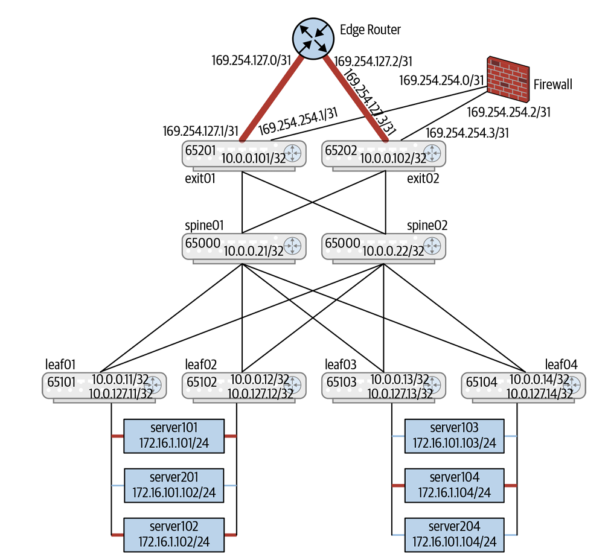
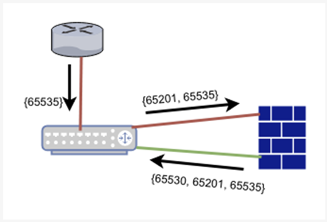

# Deploying Network Virtualization（部署網路虛擬化）

* **引言思考**：引用圖靈獎得主 Tony Hoare 的名言：*「The unavoidable price of reliability is simplicity.（可靠性不可避免的代價是簡潔）」*。
* **核心宗旨**：本章旨在指引網路架構師如何在實務中設定與維運資料中心 Clos 拓撲下的網路虛擬化 Overlay，以 **EVPN** 作為控制平面（Control Plane）、**VXLAN** 作為資料平面（Data Plane）封裝，並落實「分散式對稱式路由 (Distributed Symmetric IRB)」與「極簡主義 (KISS)」的雲端原生原則。

---

## 三大部署情境與範例拓撲 (The Configuration Scenarios)

* **三大核心部署情境 (High-Level Configurations)**：
  1. **單一 eBGP 會話模式 (Single eBGP Session for Underlay & Overlay)**：Underlay 與 EVPN Overlay 共享同一個 eBGP Session（FRR 獨創極簡架構）。
  2. **OSPF Underlay + iBGP Overlay + 頭端複製 (Ingress Replication)**：標準電信與傳統廠商架構，OSPF 負責 Underlay 路由，iBGP 搭配 Spine 作為 Route Reflector (RR) 負責 EVPN。
  3. **OSPF Underlay + iBGP Overlay + 底層多播 (Routed Multicast Underlay)**：利用 PIM-SM / MSDP 在 Underlay 處理 BUM（廣播、未知單播、多播）流量。

#### Topology used for EVPN configuration examples



* 展示了包含了 2 台 Spine (`spine01`, `spine02`)、2 台 Leaf (`leaf01`, `leaf02`) 及 2 台 Exit Leaf (`exit01`, `exit02`) 的二層 Clos 拓撲。
* 底端伺服器 (Server) 透過 MLAG/CLAG 雙歸 (Dual-attached) 連接至 Leaf01 與 Leaf02。
* Exit Leaf 向外連接實體 **Firewall (防火牆)** 與 **Edge Router (外網路由器)**。
* **【架構解析】**：
  * **三層 VRF 隔離架構**：
    1. **Default VRF**：用於 Underlay 實體路由，傳遞 VTEP IP。
    2. **`evpn-vrf` (黑色 VRF)**：資料中心內部租戶網路，所有內部流量皆經過 VXLAN 封裝。
    3. **`internet-vrf` (紅色 VRF)**：Exit Leaf 對外連接外網的路由表。
  * **安全服務鏈引導**：所有南北向流量在 Exit Leaf 上必須強制穿越 Firewall 進行 `evpn-vrf` 與 `internet-vrf` 之間的安全檢查。

---

## 設備本地非路由配置 (Device-Local Configuration)

### Linux 設備本地端配置（Device-Local Configuration）

```bash
auto all 
iface lo inet loopback 
  address 10.0.0.11/32 
  clagd-vxlan-anycast-ip 10.0.0.112
  vxlan-local-tunnelip 10.0.0.11
iface vni13 
  mtu 9164 
  vxlan-id 13
  bridge-access 13
  bridge-learning off
iface vni24
  mtu 9164 
  vxlan-id 24
  bridge-access 24
  bridge-learning off
iface vlan13
   mtu 9164
   address 10.1.3.11/24
   address-virtual 44:39:39:ff:00:13 10.1.3.1/24
   vlan-id 13
   vlan-raw-device bridge
   vrf evpn-vrf
iface vlan24
   mtu 9164
   address 10.2.4.11/24
   address-virtual 44:39:39:ff:00:13 10.2.4.1/24
   vlan-id 24
   vlan-raw-device bridge
   vrf evpn-vrf
# 
# This is the L3 VNI definition that we need for symmetric configuration. 
# This is used to transport the EVPN-routed packet between the VTEPs. 
# 
iface vxlan4001                                         
    vxlan-id 104001 
    bridge-access 4001 
iface vlan4001                                          
    hwaddress 44:39:39:FF:40:94 
    vlan-id 4001 
    vlan-raw-device bridge 
    vrf evpn-vrf 
```

#### Loopback 介面與 Anycast VTEP 來源位址配置 (`iface lo`)
* **本地獨立 IP (`address 10.0.0.11/32`)**：配置於 Loopback (`lo`) 介面上的實體 Router ID 與本地獨立 VTEP IP，用以標示該實體交換器節點。
* **共享 Anycast VTEP IP (`clagd-vxlan-anycast-ip 10.0.0.112`)**：在伺服器雙掛（Dual-Attached）的 MLAG/CLAG 架構下，兩台對等 Leaf 交換器會被賦予相同的 **Anycast VTEP 來源 IP**。當雙歸鏈路與 CLAG 服務正常運作時，所有經由 VXLAN 隧道封裝送出的流量皆以此 Anycast IP 作為 Outer Source IP。
* **退回機制 (`vxlan-local-tunnelip 10.0.0.11`)**：指定當 CLAG 服務異常或對等鏈路中斷時，VTEP 自動退回（Fallback）使用的本地獨立 VTEP IP。
* **配置原則**：若已在 `ifupdown2` 的介面檔中定義了 IP 位址，切勿在 FRR 路由協定設定檔中重複宣告，以防位址競爭或重複配置。

#### L2 VNI 虛擬隧道介面配置 (`iface vni13`, `iface vni24`)
* **VNI 設備抽象化 (`vxlan-id 13` / `24`)**：定義全網唯一的二層 VXLAN Network Identifier (L2 VNI)。Linux 核心（Kernel 4.14+）將每一個 VNI 抽象為一個獨立的邏輯網卡設備。
* **VLAN 映射 (`bridge-access 13` / `24`)**：將特定的 L2 VNI 邏輯介面與本地的 802.1Q VLAN（VLAN 13/24）進行 Access 綁定，實現 VLAN-to-VNI 的映射。
* **關閉二層 MAC 學習 (`bridge-learning off`)**：**極為關鍵的效能與控制優化**。顯式關閉 Linux 資料平面（Data-Plane）傳統的二層 MAC 位址自學習功能。因為在 EVPN 架構下，遠端 MAC 位址的發現與宣告已完全由控制平面（BGP RT-2 訊息）接管，關閉資料平面學習可避免無謂的二層廣播淹流與 CPU 負擔。
* **巨型訊框設定 (`mtu 9164`)**：由於 VXLAN 隧道封裝會為內層封包外加 50 Bytes 的標頭（Outer IP + UDP + VXLAN Header），為防止封包在傳輸路徑上發生 IP 分段（Fragmentation）導致轉發效能急劇下降，必須將邏輯介面與實體鏈路的 MTU 強制調高至 **9164**。

#### SVI 閘道與分散式任播閘道配置 (`iface vlan13`, `iface vlan24`)
* **本地管理 IP (`address 10.1.3.11/24`)**：該 Leaf 交換器在該 SVI/VLAN 網段上的**本地唯一 IP 位址**，專供網管人員由 Leaf 本身發起 `ping` 或 `traceroute` 等診斷指令。
* **分散式任播閘道 (`address-virtual 44:39:39:ff:00:13 10.1.3.1/24`)**：**Distributed Anycast Gateway 核心落地**。跨所有 Leaf 交換器配置完全相同的虛擬 MAC (vMAC) 與預設閘道 IP（`10.1.3.1`）。這使得跨機櫃遷移的虛擬機/容器在飄移後，無需重新刷洗 ARP 或變更預設閘道，即可就近進行第一跳 L3 路由。
* **綁定 VLAN-Aware Bridge (`vlan-raw-device bridge`)**：指定該 SVI 附著的 Linux 802.1Q Bridge 設備。因 Linux 支援存在多個 Bridge，此宣告可精確消除 VLAN 歧義。
* **劃入租戶 VRF (`vrf evpn-vrf`)**：將該 SVI 歸屬劃入特定的租戶三層路由表 (`evpn-vrf`)，實現多租戶的 L3 網路隔離。

#### 對稱式路由 (Symmetric IRB) 之 L3 Transit VNI 配置 (`iface vxlan4001`, `iface vlan4001`)
* **中轉 L3 VNI 定義 (`iface vxlan4001`)**：設定 `vxlan-id 104001` 與 `bridge-access 4001`。在對稱式路由架構中，此 L3 VNI 專門作為跨網段流量在入口 VTEP 與出口 VTEP 之間的中轉通道。
* **Tenant VRF 綁定 (`iface vlan4001`)**：將 L3 VNI 在本地的 SVI 實例綁定至租戶 VRF (`vrf evpn-vrf`) 並指派本地 Router MAC (`hwaddress`)。出口 Leaf 收到帶有 L3 VNI 的 VXLAN 封包後，即在此 VRF 上進行第二次 L3 路由，並交付給目的二層網段。

---

### Linux (`ifupdown2`) 網路物件抽象對照表

| Linux 網路物件 | 剖析對應之實體/邏輯概念 | 主要配置指令 (In `ifupdown2`) |
| :--- | :--- | :--- |
| **`iface lo`** | 實體 Router ID / 本地與 Anycast VTEP 來源 IP | `clagd-vxlan-anycast-ip`, `vxlan-local-tunnelip` |
| **`iface vniX`** | L2 VNI 隧道介面（關閉 Data-Plane 學習） | `vxlan-id X`, `bridge-learning off`, `mtu 9164` |
| **`iface vlanX`** | SVI / 分散式 Anycast 預設閘道 | `address-virtual <vMAC> <GW-IP>`, `vrf <VRF-Name>` |
| **`iface vxlanL3`**| 對稱式路由 (Symmetric IRB) 中轉 L3 VNI | `vxlan-id <L3-VNI>`, 綁定至 Tenant VRF |


Linux 在 4.14/4.18 核心之後，將 **VRF Master Interface**、**VXLAN Device** 與 **Switchdev 晶片卸載** 完整原生化。透過 `ifupdown2` 工具，網路工程師只需利用極簡的 YAML/ASCII 設定檔，即可完成包含 **MLAG Anycast VTEP**、**分散式 Anycast Gateway** 與 **對稱式 L3 Transit VNI** 的完整本地端基礎設施定型，為上層 FRR 的 BGP EVPN 控制平面奠定堅實的資料平面基礎。

---

## 單一 eBGP 會話模式部署 (Single eBGP Session)
* **架構特徵**：由 FRR 率先推出，**僅需建立一組 eBGP Session**，即可同時傳遞 IPv4 Unicast Underlay 路由與 L2VPN EVPN Overlay 路由，大幅簡化 BGP Session 數量。

#### BGP 宣告關鍵指令解析

```bash
! 
! ========================= 
! Configuration for spine01 
! ========================= 
! 
interface lo 
  ip address 10.0.0.21/32 
! 
router bgp 65000 
    bgp router-id 10.0.0.21 
    bgp bestpath as-path multipath-relax 
    neighbor peer-group ISL 
    neighbor ISL remote-as external 
    neighbor swp1 interface peer-group ISL 
    neighbor swp2 interface peer-group ISL 
    neighbor swp3 interface peer-group ISL 
    neighbor swp4 interface peer-group ISL 
    neighbor swp5 interface peer-group ISL 
    neighbor swp6 interface peer-group ISL 
    address-family ipv4 unicast 
        neighbor ISL activate 
        redistribute connected route-map LOOPBACKS 
    address-family l2vpn evpn 
        neighbor ISL activate                                          
g
! 
route-map LOOPBACKS permit 10 
    match interface lo 
!
! 
! ======================== 
! Configuration for leaf01 
! ======================== 
! 
interface lo 
   ip address 10.0.0.11/32 
! 
! This VRF definition is needed only for symmetric EVPN routing configuration 
vrf evpn-vrf                                                           
      vni 104001 
! 
router bgp 65011 
    bgp router-id 10.0.0.11 
    bgp bestpath as-path multipath-relax 
    neighbor fabric peer-group 
    neighbor fabric remote-as external 
    neighbor swp1 interface peer-group fabric 
    neighbor swp2 interface peer-group fabric 
    address-family ipv4 unicast 
        neighbor fabric activate 
        redistribute connected route-map LOOPBACKS 
    ! 
    address-family l2vpn evpn 
        neighbor fabric activate 
        advertise-all-vni                                              
  advertise-svi-ip                                               
    ! 
! 
route-map LOOPBACKS permit 10                                          
    match interface lo 
!
! 
! ======================== 
! Configuration for exit01 
! ======================== 
! 
interface lo 
  ip address 10.0.0.101/32 
! 
interface swp3 
  ip address 169.254.127.1/31 
! 
interface swp4.2 
p
  ip address 169.254.254.1/31 
! 
interface swp4.3 
  ip address 169.254.254.3/31 
! 
interface swp4.4 
  ip address 169.254.254.5/31 
! 
vrf evpn-vrf 
   vni 104001 
! 
! default VRF peering with the underlay and the firewall 
! 
router bgp 65201                                                       
    bgp router-id 10.0.0.101 
    bgp bestpath as-path multipath-relax 
    neighbor fabric peer-group 
    neighbor fabric remote-as external 
    ! These two are peering with the spine 
    neighbor swp1 interface peer-group fabric 
    neighbor swp2 interface peer-group fabric 
    ! This is peering with the firewall to announce the underlay 
    ! routes to the edge router (via the firewall) and receive the 
    ! default route from the edge router (also via the firewall) 
    neighbor swp4.2 interface remote-as external 
    address-family ipv4 unicast 
        neighbor fabric activate 
  neighbor swp4.2 activate 
        neighbor swp4.2 allowas-in 1                                   
        redistribute connected route-map LOOPBACKS 
    ! 
    address-family l2vpn evpn 
        neighbor fabric activate 
        advertise-all-vni                                              
    ! 
! 
route-map LOOPBACKS permit 10 
    match interface lo 
! 
! evpn vrf peering to announce default route to internal net 
! 
router bgp 65201 vrf evpn-vrf                                          
    bgp router-id 10.0.0.101 
    neighbor swp4.3 interface remote-as external 
    address-family ipv4 unicast 
       neighbor swp4.3 activate 
       ! The following two network statements are for 
       ! distributing the summarized route to the firewall 
g
       aggregate-address 10.1.3.0/24 summary-only                      
       aggregate-address 10.2.4.0/24 summary-only 
       neighbor swp4.3 allowas-in 1 
    exit-address-family 
    ! 
    ! This config ensures we advertise the default route 
    ! as a type 5 route in EVPN in the main BGP instance. 
    ! The firewall peering is to get the default route 
    ! in the evpn-vrf from the internet-vrf. Firewall 
    ! does not peer for l2vpn/evpn. 
    ! 
    address-family l2vpn evpn                                          
      advertise ipv4 unicast 
! 
! internet vrf peering to retrieve the default route from the 
! internet facing router and give it to the firewall. 
! 
router bgp 65201 vrf internet-vrf                                      
    bgp router-id 10.0.0.101 
    bgp bestpath as-path multipath-relax 
    neighbor internet peer-group 
    neighbor internet remote-as external 
    neighbor swp4.4 interface peer-group internet 
    neighbor swp3 interface peer-group internet 
    address-family ipv4 unicast 
        neighbor internet activate 
        neighbor swp4.4 allowas-in 1 
  neighbor swp3 remove-private-AS                                
        redistribute connected route-map INTERNET 
    ! 
! 
route-map INTERNET permit 10 
    match interface internet-vrf 
!----
```

```bash
#  exit01’s FRR configuration for centralized routing
router bgp 65201 
    bgp router-id 10.0.0.101 
    bgp bestpath as-path multipath-relax 
    neighbor fabric peer-group 
    neighbor fabric remote-as external 
    neighbor swp1 interface peer-group fabric 
    neighbor swp2 interface peer-group fabric 
    ! This is peering with the firewall to announce the underlay 
    ! routes to the edge router (via the firewall) and receive the 
    ! default route from the edge router (also via the firewall) 
    neighbor swp4.2 remote-as external 
    address-family ipv4 unicast 
        neighbor fabric activate 
        neighbor swp4.2 allowas-in 1 
        redistribute connected route-map LOOPBACKS 
    ! 
    address-family l2vpn evpn 
        neighbor fabric activate 
        advertise-all-vni 
        advertise-default-gw                                           
    ! 
 
! 
route-map LOOPBACKS permit 10 
    match interface lo 
! 
! evpn vrf peering to steer internal traffic through firewall 
! for external connectivity 
! 
router bgp 65201 vrf evpn-vrf                                          
    bgp router-id 10.0.0.101 
    neighbor swp4.3 remote-as external 
    address-family ipv4 unicast 
       neighbor swp4.3 activate 
       ! The following two network statements are for 
       ! distributing the summarized route to the firewall 
       aggregate-address 10.1.3.0/24 summary-only 
       aggregate-address 10.2.4.0/24 summary-only 
       neighbor swp4.3 allowas-in 1 
    exit-address-family 
 
router bgp 65201 vrf internet-vrf 
    bgp router-id 10.0.0.101 
    bgp bestpath as-path multipath-relax 
    neighbor internet peer-group 
    neighbor internet remote-as external 
    neighbor swp3 interface peer-group internet 
    neighbor swp4.4 interface peer-group internet 
    address-family ipv4 unicast 
        neighbor internet activate 
        neighbor swp4.4 allowas-in 1 
        redistribute connected route-map INTERNET 
! 
route-map INTERNET permit 10 
    match interface internet-vrf 
!
```
* **Spine 端**：
  * `router bgp 65000` + `bgp bestpath as-path multipath-relax`
  * `address-family l2vpn evpn` 下配置 `advertise-all-vni`（自動宣告所有 VNI）與 `advertise-svi-ip`（宣告 SVI 的本地唯一 IP/MAC 綁定，支援遠端 ping/traceroute 排錯）。
* **Exit Leaf 端 (三段式 BGP 設定)**：
  1. **Default VRF Peering**：與 Spine 建立 Underlay/EVPN Session，並與 Firewall 建立點對點會話。
  2. **`internet-vrf` Peering**：經由 Firewall 與 Edge Router Peering 接收外網預設路由 (`0.0.0.0/0`)。
  3. **`evpn-vrf` Peering**：將內部流量經由防火牆引導至外網。


### 核心運轉與轉發機制

* **下一跳（Next-Hop）的分流處理**：
  * **Underlay 路由 (IPv4/IPv6 Unicast)**：遵從標準 eBGP 行為，每經過一跳（Hop）自動改寫 `NEXT_HOP` 為本地對等介面 IP（`next-hop self`），確保實體 VTEP IP 的三層可達性。
  * **Overlay 路由 (L2VPN EVPN)**：FRR 等路由器會在控制平面自動阻斷 EVPN 路由的 `NEXT_HOP` 改寫（`next-hop unchanged`），保持原始發起端 VTEP IP 不變，使入口 VTEP 能直接建立跨 Fabric 的端到端 VXLAN 隧道。
* **Spine 交換器的「透明中轉」角色**：
  * Spine 無須感知任何租戶的二層/三層 VNI 或 MAC/IP 資訊，僅需開啟 `address-family l2vpn evpn`。
  * Spine 會自動保留並轉發收到的 RT-2 / RT-5 路由（在傳統設備上需開啟 `retain-route-target-all`），充當 EVPN 訊息的 BGP 交換樞紐，自身僅進行純粹的 Underlay L3 封包轉發。


### 各節點角色與配置重點 (Role-Based Configurations)

#### 1. Spine (脊交換器)
* **極簡設定**：僅需宣告全局 eBGP（搭配 **BGP Unnumbered**）與 `bgp bestpath as-path multipath-relax`。
* **位址族群**：同時激活 `address-family ipv4 unicast`（傳遞 Loopback/VTEP IP）與 `address-family l2vpn evpn`（透明中轉 Overlay 路由）。

#### 2. Leaf (葉交換器)
* **VNI 自動宣告**：在 `address-family l2vpn evpn` 下配置：
  * **`advertise-all-vni`**：自動向 Fabric 宣告本地創立的所有 L2/L3 VNI。
  * **`advertise-svi-ip`**：宣告 SVI 的本地唯一 IP/MAC 繫結，支援遠端進行網關診斷 (`ping`/`traceroute`)。

#### 3. Exit Leaf (邊界葉交換器) 與多 VRF 防火牆引導
* **三段式 VRF 路由隔離 (Three-VRF Architecture)**：
  1. **Default VRF**：處理 Fabric 內部的 Underlay 實體路由與 EVPN Overlay 訊息。
  2. **`evpn-vrf` (租戶內網 VRF)**：承載資料中心內部租戶流量，透過 **RT-5 (IP Prefix Route)** 向內網發布外網預設路由 (`0.0.0.0/0`)，並向外網發送內網摘要路由（`aggregate-address summary-only`）。
  3. **`internet-vrf` (外網 VRF)**：直連外部 Edge Router 接收外網路由，並執行 **`remove-private-AS`** 剝除私有 ASN。

---

### 防火牆流量引導與 `allowas-in 1` 防環機制

* **問題背景 (AS_PATH Loop)**：
  * Exit Leaf 透過 `internet-vrf` 將路由發給實體 Firewall，Firewall 檢驗後將路由發回 Exit Leaf 的 `evpn-vrf`。
  * 由於 Exit Leaf 的兩個 VRF 共享相同的私有 ASN（如 `ASN 65201`），當 `evpn-vrf` 收到防火牆傳回的 Update 時，會發現 `AS_PATH` 中已包含自身的 ASN，觸發 BGP 防環機制而**直接丟棄該路由 (Denied)**。
* **工程解法 (`allowas-in 1`)**：
  * 在 Exit Leaf 對接防火牆的 BGP Session 上顯式配置 **`allowas-in 1`**，指令告知 BGP **允許自身的 ASN 在 `AS_PATH` 中出現 1 次**，確保流量成功穿過防火牆進行安全檢測。

---

### Single eBGP 與傳統 OSPF+iBGP 部署對比表

| 評估維度 | **Single eBGP Session 模式 (雲端原生首選)** | **OSPF Underlay + iBGP Overlay (傳統模式)** |
| :--- | :--- | :--- |
| **控制平面協定** | **僅需要 1 個 eBGP Session** | 需運行動態 OSPFv2/v3 + iBGP Session |
| **Spine 交換器角色** | 純粹 eBGP 對等中轉節點 | **必須擔任 iBGP Route Reflector (RR)** |
| **介面 IP 管理** | 完美結合 **BGP Unnumbered (RFC 5549)**，零介面 IP | 需要為點對點鏈路配置 `/30` 或 `/31` IP |
| **BUM 流量處理** | 預設搭配 **頭端複製 (Ingress Replication)** | 需配置複雜的 PIM-SM / MSDP 底層多播 |
| **維運複雜度** | **極低**（除錯介面與設定檔高度統一） | **高**（需同時排查 OSPF 與 iBGP 狀態） |

---

Single eBGP Session 模式代表了資料中心網路設計的**精簡主義 (Essentialism)**。透過將 Underlay 與 EVPN Overlay 整合於單一 BGP 會話中，結合 BGP Unnumbered 與 Ingress Replication，網路團隊得以消除 OSPF、iBGP RR 與 PIM 多播的龐大複雜度，構建出具備極致敏捷性與高可靠性的雲端原生 Fabric。

#### Illustrating the AS_PATH loop with VRFs




* 展示路由傳播路徑：Edge Router (`ASN 65535`) -> Exit Leaf 的 `internet-vrf` (`ASN 65201`) -> Firewall -> 傳回 Exit Leaf 的 `evpn-vrf` (`ASN 65201`)。
* 架構痛點與解法 (`allowas-in 1`)**：
  * 問題 (AS_PATH Loop)：Exit Leaf 在 `evpn-vrf` 收到防火牆傳回的路由時，發現 `AS_PATH` 中已包含自身的 `ASN 65201`，BGP 防環機制會認定這是路由環路並直接**丟棄該路由 (Reject)**。
  * 解法：在 Exit Leaf 對接防火牆的 BGP Session 上，必須顯式配置 **`allowas-in 1`**（允許自身 ASN 出現 1 次）；或者在 `internet-vrf` Peering 時採用獨立的私有 ASN。

* **集中式路由變體 (Centralized Routing Option)**：
  * 若 Leaf 僅執行純二層 EVPN Bridging，則由 Exit Leaf 擔任集中式 L3 閘道，Exit Leaf 需宣告 **`advertise-default-gw`** 向全網 VTEP 通告預設閘道 MAC/IP。

---

## OSPF Underlay + iBGP Overlay 部署 (OSPF Underlay, iBGP Overlay)

* **架構特徵**：
  * **Underlay**：OSPF Area 0 宣告交換器間點對點鏈路與 Loopback0，實現全網 VTEP IP 的 L3 連通。
  * **Overlay**：所有 Leaf 與 Spine 採用相同的 `ASN 65000` 建立 iBGP；Spine 交換器配置為 **Route Reflector (RR)**，Leaf 作為 RR Client。
* **PIM-SM / MSDP 多播配置 (底層多播模式)**：
  * 若採用 Underlay IP 多播分發 BUM 流量，需要在所有 Spine 上配置 **Anycast RP (`ip pim rp 10.0.10.1`)**。
  * Spine 之間需建立 **MSDP Mesh Group (`ip msdp mesh-group`)**，透過全網狀 TCP 連線同步跨 Spine 的 `(*,G)` 與 `(S,G)` 來源狀態。

---

## 主機端 EVPN (EVPN on the Host)

* **進階極致架構 (Hyperscaler Model)**：
  * 將 VTEP 下沉至伺服器/Hypervisor (如 Linux eBPF / FRR on Host)，實體網絡僅作純粹的 L3 Underlay。
  * **iBGP RR 匯聚**：伺服器不與 Leaf 交換器建 BGP，而是直接與集中式的伺服器 Route Reflector 對等，使 Fabric 設備無須維護任何租戶 Overlay 狀態。
  * **硬體網卡要求**：伺服器網卡必須支援 **VXLAN TCP/UDP Offloads**，否則 CPU 會因封裝/解封裝而面臨嚴重效能滑坡。

---

## 最佳實踐準則 (Best Practices)

* **資深架構師 6 大黃金原則**：
  1. **貫徹極簡原則 (KISS - Keep It Simple, Stupid)**：嚴防 EVPN 帶來過度複雜的配置。
  2. **全面採用對稱式分散式路由 (Distributed Symmetric IRB)**。
  3. **首選單一 eBGP Session 模型 (FRR Style)**，降低維運與排錯成本。
  4. **儘量摒棄 Underlay 路由多播 (Routed Multicast Underlay)**，優先採用**頭端複製 (Ingress Replication)**。
  5. **防火牆 Peering 策略**：優先採用不同 ASN，替代 `allowas-in 1` 配置。
  6. **Host VTEP 禁絕 BUM**：若在主機端運行 EVPN，應完全消除二層 BUM 流量。

---

### 三大 EVPN 部署模型綜合對比表

| 評估維度 | 模型 1：單一 eBGP Session | 模型 2：OSPF Underlay + iBGP Overlay (IR) | 模型 3：OSPF Underlay + iBGP Overlay (Multicast) |
| :--- | :--- | :--- | :--- |
| **Underlay 協定** | eBGP (Unnumbered) | OSPFv2 / OSPFv3 | OSPFv2 / OSPFv3 |
| **Overlay 協定** | eBGP (單一 Session) | iBGP (Spine 做 Route Reflector) | iBGP (Spine 做 Route Reflector) |
| **BUM 流量機制** | **頭端複製 (Ingress Replication)** | **頭端複製 (Ingress Replication)** | **Underlay IP Multicast (PIM-SM + MSDP)** |
| **維運複雜度** | **最低 (黃金標準)** | 中等 (雙路由協定) | **極高** (需除錯 PIM 軟狀態與 MSDP) |
| **對端 ASN 設定** | `remote-as external` | `remote-as internal` | `remote-as internal` |
