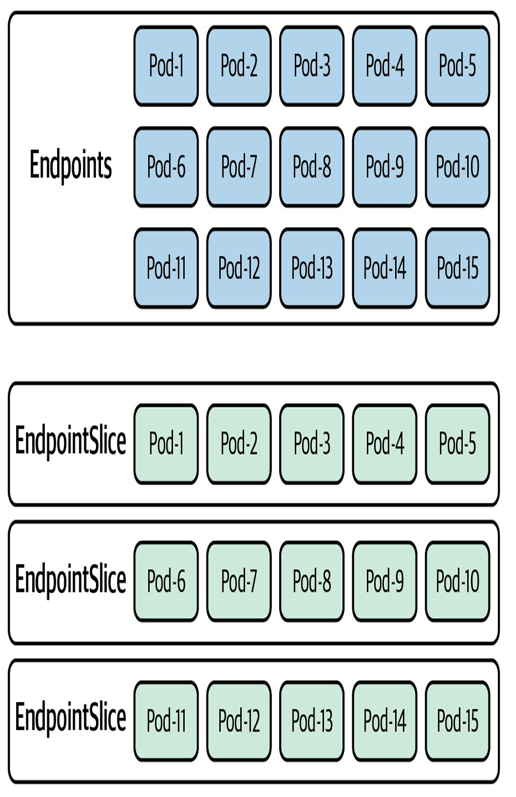
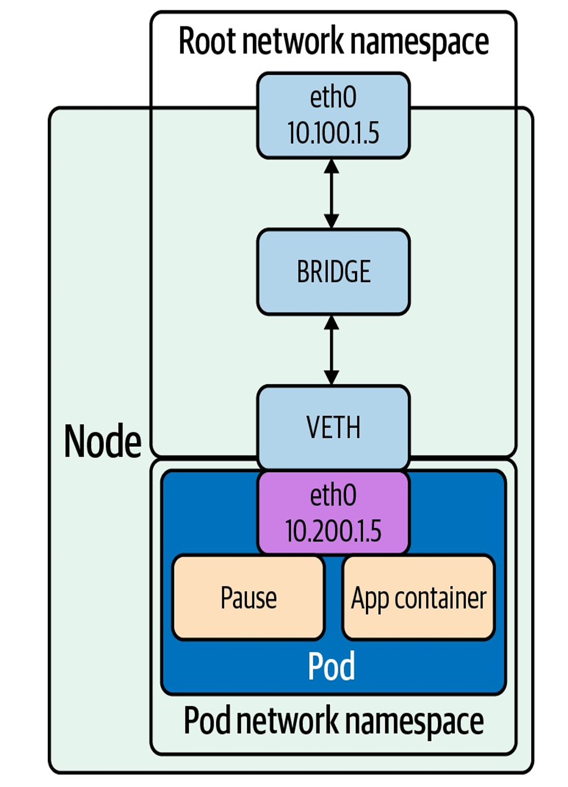
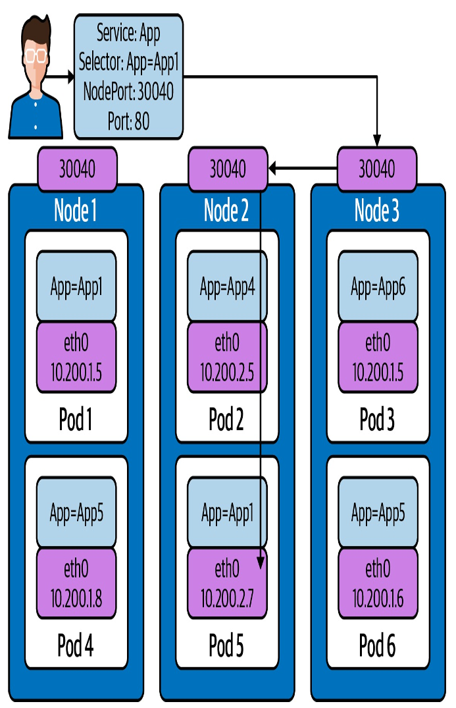
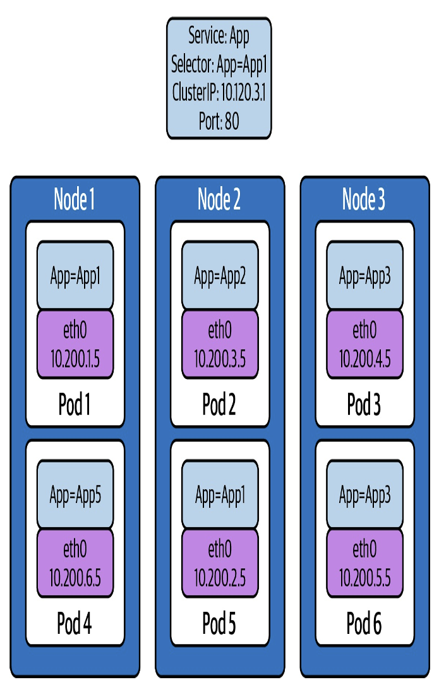
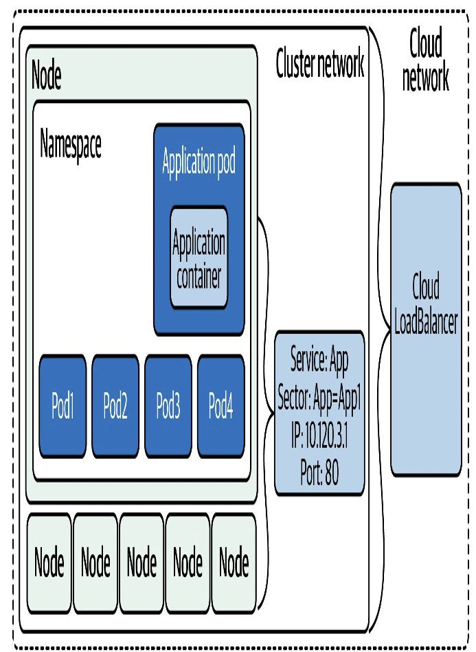
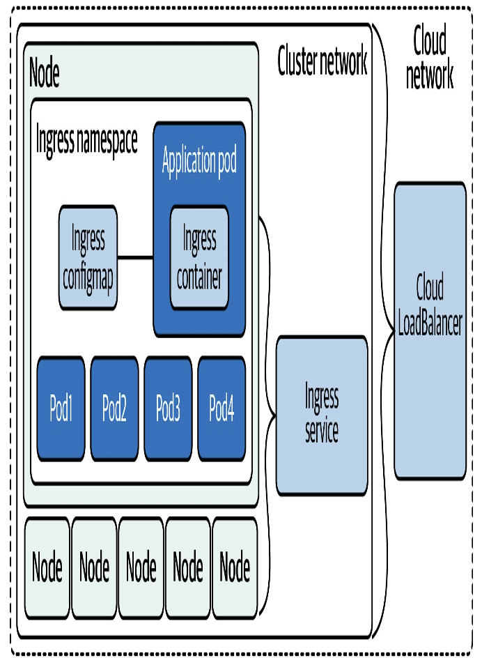

# Kubernetes Networking Abstractions

## **Introduction**

本章主要探討 Kubernetes 中服務（Services）和 Ingress 等抽象化概念，這些資源定義了工作負載的基礎網路特性。由於 Pod 的生命週期短且 IP 不可靠，服務抽象層的出現是必然的架構演進。

### **StatefulSets**

StatefulSets 是 Kubernetes 的一種工作負載抽象，專門用於需要穩定網路識別和持久儲存的應用。

* **關鍵特性：**
  * **穩定且唯一的網路識別：** 每個 Pod 擁有穩定、唯一的網路名稱。
  * **有序部署：** 支援有序且優雅的部署、擴容和滾動更新。
* **DNS 影響：** StatefulSets 要求使用**無頭服務 (Headless Service)** 來管理其網路身份。Pod 的 DNS 記錄會返回特定的 Pod 名稱，例如 `postgres-0.postgres.default.svc.cluster.local`,。
* **應用場景：** 適用於資料庫等有狀態工作負載，而非一般的應用部署。

### **Endpoints**

Endpoint 物件是服務（Services）的骨幹，用於識別和追蹤符合服務標籤選擇器（Selector）的 Pod。

* **組成：** 每個 Endpoint 包含一組埠（Ports）以及兩個地址列表：`ready`（已就緒）和 `notReadyAddresses`（未就緒）。
* **行為：** Pod 的就緒探測（Readiness Probe）一旦失敗，其 IP 位址就會從 `ready` 列表移除，並被列入 `notReadyAddresses`。
* **用途：** 作為服務發現的工具，供 `kube-proxy` 等元件監控 Pod 的健康狀態和 IP 地址。

```yaml
apiVersion: v1
 kind: Endpoints
 metadata:
  labels:
    name: demo-endpoints
 subsets:- addresses:
  - ip: 10.0.0.1- notReadyAddresses:
  - ip: 10.0.0.2
  ports:
  - port: 8080
    protocol: TCP
```

### **Endpoint Slices**

Endpoint Slices 是為了解決大規模集群中 Endpoint 物件所帶來的擴展性瓶頸而設計的。

* **技術挑戰：** 在擁有數千個節點的大型集群中，單一、龐大的 Endpoint 物件頻繁變動會對 etcd、API Server 和網路造成壓力，拖慢整個集群的速度。
* **解決方案：** 服務會建立多個 Endpoint Slice 物件，每個切片僅包含部分 Pod 地址。當 IP 變動時，只需傳輸和更新較小的切片資料，大幅減輕了 `kube-proxy` 監聽器的負載。
* **內容：** Endpoint Slices 包含 `TargetRef`（指向哪個 Pod）和 `Topology`（Pod 部署在哪個工作節點）等元數據,。

下圖對比了傳統單一、大容量的 `Endpoints` 物件結構與分散成多個 `Endpoint Slices` 的結構，說明了切片如何將目標列表分解成子集，以優化大規模數據傳輸。



example:

```yaml
apiVersion: discovery.k8s.io/v1beta1
kind: EndpointSlice
metadata:
    name: demo-slice-1
    labels:
    kubernetes.io/service-name: demo
addressType: IPv4
ports:
- name: http
  protocol: TCP
  port: 80
endpoints:
 - addresses:
   - "10.0.0.1"
   conditions:
   ready: true
```

### **Kubernetes Services**

服務是 Pod 網路抽象化的核心，提供穩定的單一訪問點來路由到後端 Pod。

* **服務的四種主要類型：** ClusterIP, NodePort, LoadBalancer, ExternalName。

下圖說明了 Pod 內的容器（以及 Pause 容器）共享同一個網路命名空間的架構基礎。



example:

```yaml
apiVersion: v1
kind: Service
metadata:
  name: demo-service
spec:
  selector:
    app: demo
```

#### **NodePort**

NodePort 服務在集群中所有節點上暴露一個固定的埠（NodePort），允許外部軟體或負載平衡器透過任何節點的 IP 來存取服務。

* **`externalTrafficPolicy`：** 決定外部流量的路由策略：`Cluster`（預設，可能跨節點，隱藏用戶端源 IP）或 `Local`（僅路由到本地節點 Pod，保留源 IP，可能導致負載不均）,。

下圖描述外部流量到達節點的 `NodePort` 後，透過 `iptables` 規則，可能路由到本地 `Pod`，也可能跨節點路由到另一個節點上的 `Pod`。



example:

```yaml
apiVersion: v1
kind: Service
metadata:
  name: demo-service
spec:
  type: NodePort
  selector:
    app: demo
  ports:
  - port: 80
    targetPort: 80
    nodePort: 30000
```

#### **ClusterIP**

`ClusterIP` 是預設的服務類型，提供一個只能在集群內部路由的虛擬 IP 地址，用於內部負載平衡。

* **虛擬 IP：** ClusterIP 地址必須在 API Server 配置的服務集群 IP 範圍內。
* **實作機制：** `kube-proxy` 負責配置節點上的 `iptables` 規則（或使用 IPVS）來實現 L4 負載平衡。它利用 DNAT 規則將流量從 ClusterIP 和服務埠導向特定的 Pod IP 和目標埠,。
* **優勢與限制：** 解決了 Pod IP 不可靠的問題，但僅限集群內部使用。

下圖描述 ClusterIP 與 App=App1 的標籤關聯



#### **Headless**

Headless 服務的特點是 `.spec.clusterIP` 設定為 `None`。

* **行為：** 不提供負載平衡功能，DNS 查詢會返回**所有**就緒 Pod 的 IP 地址列表,。
* **用途：** 將負載平衡的決策權交給客戶端應用或特定架構（例如有客戶端負載平衡邏輯的應用，或集群資料庫）。

#### **ExternalName**

ExternalName 是一種特殊的服務類型，它不使用選擇器，而是透過 DNS CNAME 記錄將集群內部請求導向一個外部的 FQDN（完全合格網域名稱）。

* **用途：** 簡化應用遷移，允許開發人員使用集群內部的服務名稱來訪問位於集群外部的依賴項。

example:

```yaml
apiVersion: v1
kind: Service
metadata:
  name: ext-service
  spec:
    type: ExternalName
    externalName: database.mycompany.com
```

#### **LoadBalancer**

LoadBalancer 服務結合了 NodePort 的特性與外部雲端負載平衡器的整合，是將 L4 服務暴露到集群外部的標準方式。

* **條件限制：** 必須有底層雲服務提供商的支持（如 AWS ELB, GCP GCLB, Azure Load Balancer）或手動部署的軟體（如 MetalLB）才能生效。

下圖外部流量到達雲端負載平衡器，然後被導向到某個節點的 NodePort，最終經由內部路由到達 Pod。



### **Ingress**

Ingress 是 Kubernetes 特有的 L7（HTTP）外部負載平衡器抽象，主要用於將 HTTP(S) 工作負載暴露到集群外部。

* **規則類型：** 允許基於 HTTP 請求資訊（如 Host 標頭或 URI 路徑）進行路由分發。路徑類型包括 `Exact`（精確匹配）、`Prefix`（前綴匹配）和 `ImplementationSpecific`（實作相關）。
* **控制器選擇：** 外部負載平衡器控制器（由雲端提供商管理，通常成本較高）或內部負載平衡器控制器（在集群內運行，成本較低但有延遲）。
* **IngressClass：** 用於明確指定哪個 Ingress Controller 負責實作該 Ingress 資源。

下圖 Ingress 依賴於兩個主要元件：**Ingress Controller**（在集群內運行，負責監聽和實作規則）和 **Ingress Rules**（定義路由的配置）。



> Ingress 經過時間進化，會逐漸往 Gateway API 規範前進

### **Service Meshes**

服務網格是一個 API 驅動的基礎設施層，用於管理服務間的通訊，解決預設 Kubernetes 網路的固有缺陷。

* **功能強化：** 提供超越 Kubernetes 網路策略（L3/L4）的進階功能，包括：
  * **安全性：** 服務間的 mTLS（相互 TLS）加密。
  * **彈性：** 內建重試、逾時和熔斷機制。
  * **可觀察性：** 豐富的 L7 監控指標、追蹤和警報。
  * **路由控制：** 金絲雀發佈、A/B 測試和流量鏡像。
* 流量在進入和離開集群時由 **Gateways** 處理；集群內部，每個 Pod 都有一個**邊車代理（Sidecar Proxy）**注入，負責所有流量的轉發、加密和策略執行。這些元件由 **Control Plane** 集中管理。
* **實例：** Linkerd 和 Istio 是流行的服務網格實作。Linkerd 透過**代理注入器（Proxy Injector）**將邊車自動加入到應用部署中，以啟用網格功能。

### **Conclusion**

Kubernetes 網路抽象化提供了一組功能強大的工具（Services, Endpoints, Ingress, Service Meshes），使開發人員和運維團隊能夠程式化地管理集群內外的流量。掌握這些抽象層的內部機制（例如 `kube-proxy` 如何透過 `iptables` 實現 ClusterIP 的虛擬路由）對於在高擴展性環境
中排除網路故障至關重要。選擇合適的服務類型或引入服務網格，都必須基於工作負載的具體需求、成本考量和安全規範來決定。
